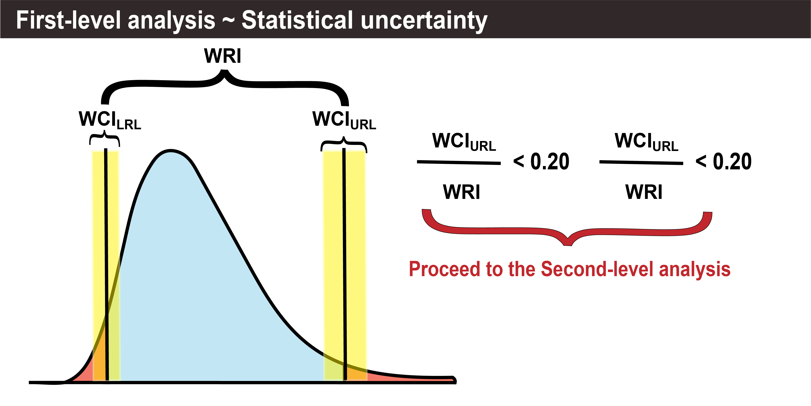
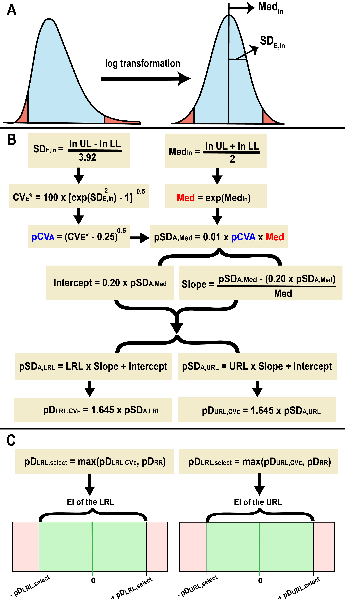
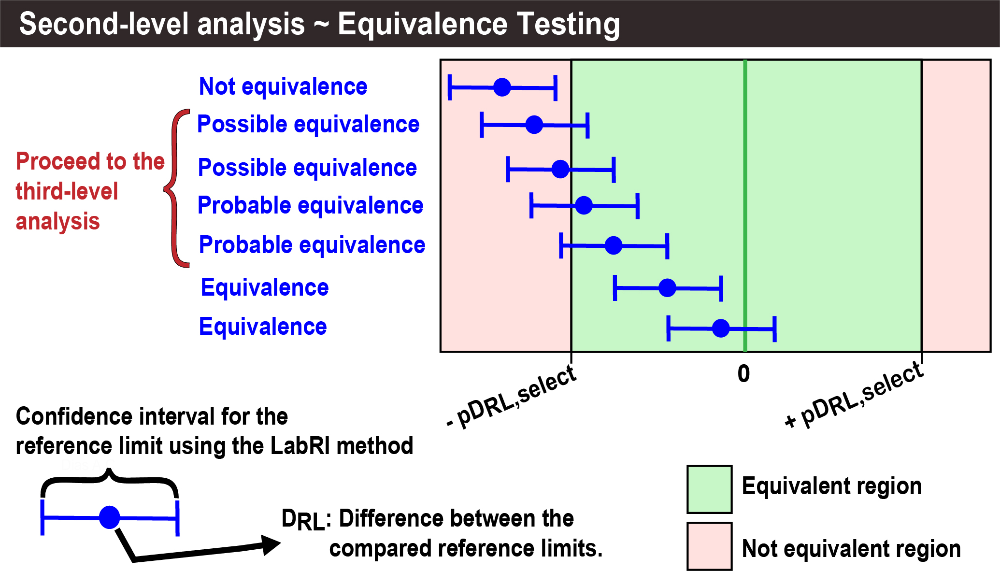
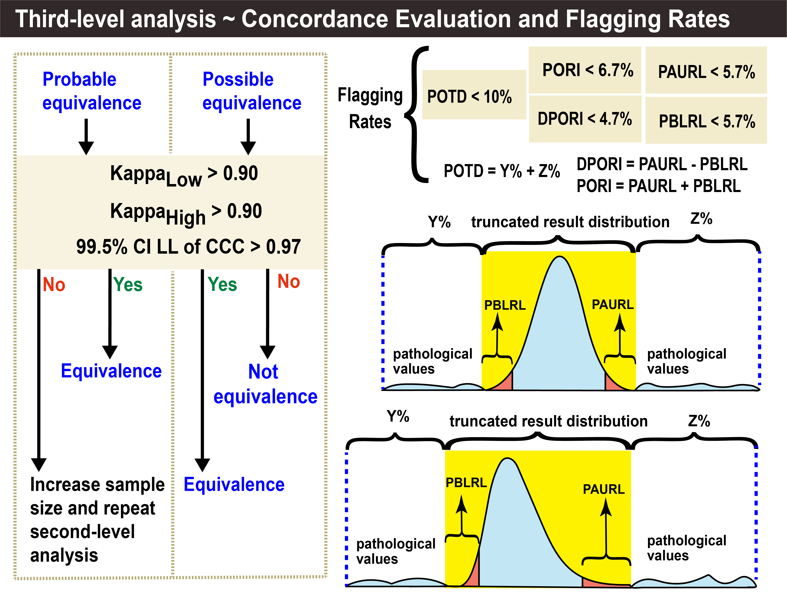

<br>

<br>

<div class="alert alert-dismissible alert-success" style="text-align: justify; line-height: 1.8;">
  <button type="button" class="btn-close" data-bs-dismiss="alert"></button> The <strong>LabRI tool</strong> is an R Markdown file that employs the indirect method called the <strong>LabRI Method</strong>. This method is an adaptive and multi-criteria approach for the <a href="#" class="alert-link">estimation and verification</a> of reference intervals, utilizing a combination of data cleaning algorithms, data transformation, clustering techniques, and the refineR and reflimR algorithms or the expectation-maximization (EM) algorithm, depending on the number of clusters in the truncated distribution.
</div>

<br>

<div class="alert alert-dismissible alert-info" style="text-align: justify; line-height: 1.8;">
  <button type="button" class="btn-close" data-bs-dismiss="alert"></button>
  <h4 class="alert-heading"><strong>Copyright (C); 2024; LabR Group</strong></h4>
  <p>This program is free software: you can redistribute it and/or modify it under the terms of the GNU General Public License as published by the Free Software Foundation, either version 3 of the License, or (at your option) any later version.</p>
  <p>This program is distributed in the hope that it will be useful, but WITHOUT ANY WARRANTY; without even the implied warranty of MERCHANTABILITY or FITNESS FOR A PARTICULAR PURPOSE. See the GNU General Public License for more details.</p>
  <p>You should have received a copy of the GNU General Public License along with this program. If not, see <a href="https://www.gnu.org/licenses/" class="alert-link">Link</a>.</p>
</div>

<br>


# Contents

<br>

## 1. Initial information

<br>

```{r Stage_1_Initial_information,echo=FALSE,warning=FALSE,message=FALSE}


################################################################################
################################################################################
##################### NAME OF THE RESPONSIBLE SPECIALIST #######################
################################################################################
################################################################################


Responsible_person <- params$Responsible_person         


# Note 1: Please provide the name of the person responsible for the process or 
#         analysis conducted.

################################################################################
################################################################################
########################### DEFINE THE DATASET #################################
################################################################################
################################################################################


File_Name<-params$File_Name


# NOTE 2: Provide the name of the data file to be analyzed. 
#         The file must be in .csv, .xls, or .xlsx format.


################################################################################


Column_Name<-params$Column_Name


# NOTE 3: Provide the name of the column that contains the data to be analyzed.


################################################################################


# Is the name of the analyte the same as the name of the column in the file? 
# Mark the appropriate answer with an "X" 


yes <- ifelse(params$measurand_name == "yes", "x", "")

no <- ifelse(params$measurand_name == "no", "x", "")

Name_of_measurand <- params$Name_of_measurand


# NOTE 4: Select 'Yes' if the measurand name is the same as the column name in 
#         the dataset; otherwise, select 'No'. If 'No' is chosen, specify the 
#         custom measurand name in the "Name_of_measurand" field. This name will 
#         be used in the HTML report generated by the tool.


################################################################################


# File Format 
# Mark the appropriate answer with an "X" 


CSV<-""

XLS<-""

XLSX<-"x"


# Note 5: The default configuration File Format configuration is "CSV".


################################################################################


Data_source <- params$Data_source


# NOTE 6: NOTE: Provide the source of the dataset, specifying where it was 
#         obtained from.


################################################################################
################################################################################
##################### ABOUT THE TYPE OF REFERENCE INTERVAL #####################
######################  AND THE NUMBER OF DECIMAL PLACES  ######################
################################################################################
################################################################################


# C) Double-sided or One-sided reference intervals? 
# Mark the appropriate answer with an "X" 


Double_sided <- params$Double_sided

Right_sided <- params$Right_sided


# Note 7: The default configuration for reference intervals is "Double-sided".


################################################################################


Number_of_decimal_places <- params$Number_of_decimal_places


# Note 8: The default configuration for the number of decimal places is "2".


################################################################################
################################################################################
###################### STUDY TRACEABILITY INFORMATION ##########################
################################################################################
################################################################################


Measurement_procedure_and_analytical_method <- params$Measurement_procedure_and_analytical_method

Unit_of_measurement <- params$Unit_of_measurement

Type_of_specimen <- params$Type_of_specimen

Age_range <- params$Age_range

Sex <- params$Sex

Exclusion_criteria <- params$Exclusion_criteria  


################################################################################
################################################################################
######## PROVIDE THE COMPARATIVE REFERENCE INTERVAL (IF APPLICABLE) ############
################################################################################
################################################################################


Upper__Reference__Limit__of__Comparative_Reference <-params$Upper__Reference__Limit__of__Comparative_Reference
Lower__Reference__Limit__of__Comparative_Reference <- params$Lower__Reference__Limit__of__Comparative_Reference
Source_of_comparative_reference_used <- params$Source_of_comparative_reference_used


# NOTE 9: To perform the verification of reference intervals, a comparative 
#          reference interval must be provided. If a Comparative Reference 
#          Interval is not specified, the reference interval estimated by the 
#          LabRI method itself will be used as the comparative reference. 
#          This is because the algorithms in the LabRI method’s verification 
#          module require a comparative reference to conduct the verification.


################################################################################
################################################################################
################# SET THE MAXIMUM SAMPLE SIZE (IF APPLICABLE) ##################
################################################################################
################################################################################


Maximum_sample_size <- params$Maximum_sample_size


# NOTE 10: If the maximum sample size is not specified, a default value of 
#          10,000 will be used. This value was validated in the LabRI method 
#          study for estimating reference intervals representative of the 
#          laboratory's served population, ensuring processing efficiency and 
#          timely results.


################################################################################
########################## End (CLICK on "Knit") ###############################
################################################################################  
################################################################################  
################################################################################  
################################################################################  
################################################################################  
################################################################################  
################################################################################  
################################################################################  
################################################################################  
################################################################################  
################################################################################  
################################################################################  
################################################################################  
################################################################################  
################################################################################  
################################################################################  
################################################################################  
################################################################################  
################################################################################  
################################################################################ 
################################################################################  
################################################################################  
################################################################################  
################################################################################  
################################################################################  
################################################################################  
################################################################################  
################################################################################  
################################################################################  
################################################################################  
################################################################################  
################################################################################  
################################################################################  
################################################################################  
################################################################################ 
################################################################################  
################################################################################  
################################################################################  
################################################################################   
################################################################################  
################################################################################  
################################################################################  
################################################################################ 
################################################################################  
################################################################################  
################################################################################  
################################################################################  
################################################################################  
################################################################################  
################################################################################ 
################################################################################  
################################################################################ 
################################################################################  
################################################################################  
################################################################################  
################################################################################ 
################################################################################  
################################################################################  
################################################################################   
################################################################################  
################################################################################ 
################################################################################  
################################################################################ 
################################################################################  
################################################################################  
################################################################################  
################################################################################  
################################################################################
################################################################################  


tempo_ini <- Sys.time()
options(save.workspace = FALSE)

# Function to save .RData and .Rhistory when the application is stopped

onStop(function() {
  
  # Paths to save the files
  
  rdata_file <- file.path("3_exports", ".RData")
  rhistory_file <- file.path("3_exports", ".Rhistory")
  
  # Save the workspace and history
  
  save.image(rdata_file)
  savehistory(rhistory_file)
  cat("Workspace and history automatically saved in 3_exports.\n")
})

################################################################################
#### 1.1. Installing Packages ##################################################
################################################################################


install.packages.LabRI.Method <- function(Packages) {
  
Packages <- c("AID", "DT", "FactoMineR", "KernSmooth", "MASS", "MethComp",
                       "RVAideMemoire", "calibrate", "cartography", "cluster",
                       "datawizard","data.table", "devtools", "digest", "dplyr", "epiR",
                       "factoextra","ffp", "forecast", "ggQC", "ggplot2", "ggpubr",
                       "ggtext", "grid", "gt","imputeTS", "installr", "irr", "janitor",
                       "kableExtra", "knitr","lattice", "lubridate", "mclust", "mixR",
                       "modeest", "moments","multimode", "multiway", "nortest",
                       "openxlsx", "pacman", "plotly","prettydoc", "qqplotr", "readr",
                       "readxl", "refineR", "reflimR","reshape2", "rmarkdown","scales",
                       "shiny","shinyjs","shiny.exe","shinythemes","stats", "stringi", 
                       "systemfonts","tools","utf8","univOutl", "xfun","writexl","zlog")

    novos_pacotes <- Packages[!(Packages %in% installed.packages()[, "Package"])]
  if(length(novos_pacotes)) {
    install.packages(novos_pacotes, dependencies = TRUE)
  }
  resultado <- sapply(Packages, require, character.only = TRUE)
  
 # Create the formatted table
  
  n <- length(Packages)
  ncol <- 7
  nrow <- ceiling(n / ncol)
  tabela <- matrix("", nrow = nrow * 2, ncol = ncol)
  
  for (i in 1:n) {
    row <- ((i - 1) %% nrow) * 2 + 1
    col <- ceiling(i / nrow)
    tabela[row, col] <- Packages[i]
    tabela[row + 1, col] <- ifelse(resultado[i], "TRUE", "FALSE")
  }
  
  # Convert the matrix to a data frame for use with kable
  
  df_tabela <- as.data.frame(tabela)
  colnames(df_tabela) <- rep("", ncol)
  
   cor_condicional <- function(value) {
    if (value == "TRUE") {
      return("#d4edda") 
    } else if (value == "FALSE") {
      return("#f8d7da") 
    } else {
      return(NA) 
    }
  }
  
  df_color <- apply(df_tabela, c(1, 2), 
                    function(value) ifelse(value == "", NA, 
                    cor_condicional(value)))
  require(knitr)
  require(kableExtra)
  

  
kbl(df_tabela, align = "c", col.names = rep("", ncol), 
      caption = "<div style='text-align: justify; color: black;'><strong>Table 1.</strong> R Package Status.</div>") %>%
    kable_styling(full_width = FALSE, 
                  bootstrap_options = c("striped", "hover","condensed", "responsive")) %>%
    row_spec(seq(1, nrow(df_tabela), by = 2), bold = TRUE, color = "White", 
             background = "#1976d2") %>%
    column_spec(1:ncol, 
                background = ifelse(is.na(df_color), "transparent", df_color), 
                color = ifelse(df_tabela == "TRUE", "#155724", 
                               ifelse(df_tabela == "FALSE", "#721c24", "black")))
}


install.packages.LabRI.Method()


################################################################################
#### 1.2. Reloading packages ###################################################
################################################################################


options(scipen = 999)
library(DT)
library(dplyr)
library(utf8)
set.seed(200707042)


################################################################################
#### 1.3. Reading the file - Start Data cleaning ###############################
################################################################################


read_dataset_column <- function(file_name, column_name) {
  
  # Internal function to remove accents
  
  remove_accents <- function(text) {
    return(stri_trans_general(text, "Latin-ASCII"))
  }
  
  # Internal function to read the file
  
  read_file <- function(file) {
    extension <- tools::file_ext(file)
    
    tryCatch({
      if (extension == "csv") {
        
        # Read the first lines to detect the decimal delimiter
        
        first_lines <- readLines(file, n = 5)
        decimal_mark <- ifelse(any(grepl(",", first_lines)), ",", ".")
        
        data <- read_delim(file, delim = ";", 
                           locale = locale(decimal_mark = decimal_mark, 
                                           encoding = "UTF-8"), n_max = -1)
      } else if (extension %in% c("xls", "xlsx")) {
        data <- read_excel(file, .name_repair = make.names, na = "", col_types = "guess")
        
        # Convert columns to numeric, replacing commas with periods
        
        columns_to_convert <- colnames(data)
        
        for (column in columns_to_convert) {
          if (is.character(data[[column]])) {
            data[[column]] <- as.numeric(gsub(",", ".", data[[column]]))
          }
        }
      } else {
        stop("Unsupported file extension.")
      }
      
      # Remove accents and special characters from column names
      
      colnames(data) <- remove_accents(make.names(colnames(data), unique = TRUE))
      
      return(data)
    }, error = function(e) {
      stop(paste("Error reading the file:", e$message))
    })
  }
  
  # Full file path
  
  file_path <- file.path("1_Dataset", file_name)
  
  # Check if the file exists
  
  if (!file.exists(file_path)) {
    stop("The specified file was not found.")
  }
  
  data <- read_file(file_path)
  
  # Clean and standardize the specified column name
  
  column_name_clean <- make.names(column_name)
  
  # Check if the specified column exists in the dataset
  
  if (!column_name_clean %in% colnames(data)) {
    stop("The specified column does not exist in the dataset.")
  }
  
  # Extract the specified column
  
  column_data <- data[[column_name_clean]]
  
  # Check the data type of the column and handle appropriately
  
  if (is.factor(column_data)) {
    column_data <- as.character(column_data)
  } else if (is.character(column_data)) {
    column_data <- as.numeric(gsub(",", ".", column_data))
  }
  
  return(column_data)
}

resultados<-data.frame(read_dataset_column(params$File_Name,Column_Name))
colnames(resultados)[1]<-"resultados"
resultados<-resultados$resultados
resultados<-as.character(resultados)
resultados<-gsub("[:punct:]","",resultados)
resultados<-as.numeric(resultados)
resultados<-na.omit(data.frame(resultados))
Resultados_dos_Pacientes<-data.frame(resultados)
resultados<-replace(Resultados_dos_Pacientes$resultados,
                    Resultados_dos_Pacientes$resultados<=0,0.0001)


################################################################################
## 1.4. Sampling ###############################################################
################################################################################


sample.size<-length(resultados)

sampling<-ifelse(Maximum_sample_size=="","10000",Maximum_sample_size)

sampling<-as.numeric(sampling)

sampling<-ifelse(is.na(sampling)==TRUE,sample.size,sampling)

sample.size.select<-ifelse(is.na(sampling)==TRUE,sample.size,
                    ifelse(sampling>sample.size,sample.size,sampling))

resultados<-data.frame(resultados)

amostragem <- sample(nrow(resultados), replace=FALSE, 
                     size=sample.size.select)

resultados <- resultados[amostragem, ]
Resultados_dos_Pacientes <-data.frame(resultados)


################################################################################
## 1.5. Loading Information ####################################################
################################################################################


interpretando.responsavel<-Responsible_person==""


Responsavel<-ifelse(interpretando.responsavel==TRUE,
                        "Provide the name of the person responsible for the analysis",
                    as.character(Responsible_person))


interpretando.Sistema.Analitico<-Measurement_procedure_and_analytical_method==""
Sistema.Analitico<-ifelse(interpretando.Sistema.Analitico==TRUE,
                        "Provide the measurement procedure and Method",
                        as.character(Measurement_procedure_and_analytical_method))


Nome_do_Analito<-ifelse(yes=="x"|yes=="X",Column_Name,
                 ifelse(no=="x"|no=="X",Name_of_measurand,
                 ifelse(Name_of_measurand=="",Column_Name,Name_of_measurand)))

interpretando.nome.analito<-Nome_do_Analito==""
Nome.do.analito<-ifelse(interpretando.nome.analito==TRUE,
                        "Provide the name of the measurand",
                        as.character(Nome_do_Analito))


interpretando.tipo.de.amostra<-Type_of_specimen==""
Tipo.de.amostra<-ifelse(interpretando.tipo.de.amostra==TRUE,
                              "Provide the type of specimen.",
                              as.character(Type_of_specimen))


interpretando.Criterios.de.exclusao<-Exclusion_criteria==""
Criterios.de.exclusao<-ifelse(interpretando.Criterios.de.exclusao==TRUE,
                              "Provide the exclusion criteria",
                              as.character(Exclusion_criteria))


interpretando.Local.origem.dos.dados<-Data_source==""
Local.origem.dos.dados<-ifelse(interpretando.Local.origem.dos.dados==TRUE,
                               "Provide the data source",
                               as.character(Data_source))


interpretando.unidade.de.medida<-Unit_of_measurement==""
Unidade.de.medida<-ifelse(interpretando.unidade.de.medida==TRUE,
                        "Provide the unit of measurement used",
                        as.character(Unit_of_measurement))


interpretando.faixa.etaria<-Age_range==""
Faixa.etaria<-ifelse(interpretando.faixa.etaria==TRUE,
                        "Provide the age range",
                        as.character(Age_range))


interpretando.sexo<-Sex==""
Sexo<-ifelse(interpretando.sexo==TRUE,
             "Provide the sex",
             as.character(Sex))


interpretando.casa.decimal<-Number_of_decimal_places==""

casa.decimal<-ifelse(is.numeric(as.numeric(interpretando.casa.decimal))==TRUE,
                     as.numeric(Number_of_decimal_places),2)

casa.decimal<-ifelse(is.na(casa.decimal)==TRUE,2,casa.decimal)
casa.decimal<-ifelse(casa.decimal==0,1,casa.decimal)
casa.decimal2<-as.numeric(ifelse(Number_of_decimal_places=="",2,
                                 Number_of_decimal_places))

lado<-ifelse(Double_sided=="x"|Double_sided=="X","Two_sided",
             ifelse(Right_sided=="x"|Right_sided=="X","Right_sided",
                     "Two_sided"))

Lado.texto<-ifelse(lado=="Two_sided",
            "Double-sided. There is a Lower Limit and an Upper Limit of reference.",
            ifelse(lado=="Right_sided",
            "Right-sided. There is only the Upper Limit of reference.",
            "Double-sided. There is a Lower Limit and an Upper Limit of reference."))


Platykurtic<-"The distribution can be considered platykurtic."
Leptokurtic<-"The distribution can be considered leptokurtic."
Mesokurtic<-"The distribution can be considered mesokurtic."

# Remove the 'base.de.data' object from memory

rm(base.de.dados)

percentil.LS<-ifelse(lado=="Two-sided",0.975,0.95)
percentil.LI<-ifelse(lado=="Two-sided",0.025,0.05)


```

<br>

::: {style="text-align: justify; line-height: 1.8; color: black;"}
<li><strong>Responsible person:</strong> `r Responsavel`;</li>
:::

<br>

::: {style="text-align: justify; line-height: 1.8; color: black;"}
<li><strong>Measurement procedure and Method:</strong> `r Sistema.Analitico`;</li>
:::

<br>

::: {style="text-align: justify; line-height: 1.8; color: black;"}
<li><strong>Name of the measurand:</strong> `r Nome.do.analito`;</li>
:::

<br>

::: {style="text-align: justify; line-height: 1.8; color: black;"}
<li><strong>Unit of measurement:</strong> `r Unidade.de.medida`;</li>
:::

<br>

::: {style="text-align: justify; line-height: 1.8; color: black;"}
<li><strong>Type of blood specimen:</strong> `r Tipo.de.amostra`;</li>
:::

<br>

::: {style="text-align: justify; line-height: 1.8; color: black;"}
<li><strong>Exclusion criteria:</strong> `r Criterios.de.exclusao`;</li>
:::

<br>

::: {style="text-align: justify; line-height: 1.8; color: black;"}
<li><strong>Data source:</strong> `r Local.origem.dos.dados`;</li>
:::

<br>

::: {style="text-align: justify; line-height: 1.8; color: black;"}
<li><strong>Age range:</strong> `r Faixa.etaria`;</li>
:::

<br>

::: {style="text-align: justify; line-height: 1.8; color: black;"}
<li><strong>Sex:</strong> `r Sexo`;</li>
:::

<br>

::: {style="text-align: justify; line-height: 1.8; color: black;"}
<li><strong>Settings:</strong></li>
:::

::: {style="text-align: justify; line-height: 1.8; color: black;"}
<ul style="list-style-type: circle; margin-left: 10px;">

<li><strong>Number of decimal places:</strong> `r casa.decimal`;</li>

<li><strong>Setting the limits of the Reference Interval ('Double-sided' or 'One-sided'):</strong> `r Lado.texto`;</li>

</ul>
:::

<br>

## 2. Descriptive statistics

<br>

```{r Stage_2_Descriptive_statistics,echo=FALSE,warning=FALSE,message=FALSE}


################################################################################
## 2.1. Reloading packages #####################################################
################################################################################


options(scipen = 999)
set.seed(200707042)
library(modeest)
library(kableExtra)
library(forecast)
library(multimode)
library(utf8)
library(DT)
library(dplyr)
library(utf8)


################################################################################
## 2.2. Table 2 Patients' results ##############################################
################################################################################

colnames <- c("Sample size", "Patients' results")
colnames <- enc2utf8(colnames)

Table.2 <- datatable(Resultados_dos_Pacientes, 
                     class = "cell-border stripe",
                     colnames = colnames(Resultados_dos_Pacientes),
                     caption = htmltools::tags$caption(
                       style = 'caption-side: top; text-align: justify; color: black;',
                       htmltools::HTML("<b>Table 2.</b> Patients' results.")),
                     filter = "top",
                     escape = FALSE,
                     options = list(
                       searchHighlight = TRUE,
                       initComplete = JS("function(settings, json) {",
                                         "$(this.api().table().header()).css({'background-color': '#0d47a1', 'color': '#fff'});",
                                         "}")
                     ))

Table.2


################################################################################
## 2.3. Table 3 - Position Measurements (Part 1) ###############################
################################################################################


mensurando<-paste(Nome.do.analito,"(",Unidade.de.medida,")")

P.media<-round(mean(resultados),digits=casa.decimal)

P.mediana<-round(median(resultados),digits=casa.decimal)


P.moda<-locmodes(resultados,mod0=1)
P.moda<-round(P.moda$locations,digits=casa.decimal)


P.dp<-round(sd(resultados),digits=casa.decimal)


menor.valor<-round(min(resultados),digits=casa.decimal)
maior.valor<-round(max(resultados),digits=casa.decimal)


medidas.posicao.1<-c("Sample size (N)",
                     "Sampling (n)", 
                     "Minimum", 
                     "Mode", 
                     "Mean", 
                     "Median", 
                     "Maximum")


result.medidas.posicao.1<-c(sample.size,
                            sample.size.select,
                            menor.valor,
                            P.moda,
                            P.media,
                            P.mediana,
                            maior.valor)

Tabela.medidas.posicao.1 <-data.frame(medidas.posicao.1,
                                      result.medidas.posicao.1)

Titulo.Table.3<-"<div style='text-align: justify; color: black;'><strong>Table 3.</strong> Measures of Position - Part 1.</div>"

Table.3 <- kbl(Tabela.medidas.posicao.1,
                  col.names = c("Statistical parameters","Results"),
                  align = "cc",
                  caption = Titulo.Table.3,
               format = "html", 
               table.attr = "style='text-align: justify; line-height: 1.8; color: #000000; font-size: 1em;'") %>%
  kable_styling(full_width = FALSE,
                bootstrap_options = c("striped",
                                      "hover",
                                      "condensed",
                                      "responsive")) %>%
  row_spec(0,
           bold = TRUE, 
           color = "White", 
           background = "#0d47a1") %>%
  column_spec(1,
             bold = TRUE,
             color = "White",
             background = "#1976d2")

Table.3


################################################################################
## 2.4. Table 4 - Position Measurements (Part 2) ###############################
################################################################################


medidas.posicao.2<-c("Sample size (N)",
                     "Sampling (n)", 
                     "1st percentile", 
                     "2.5th percentile", 
                     "5th percentile", 
                     "10th percentile", 
                     "16th percentile", 
                     "25th percentile", 
                     "50th percentile (median)", 
                     "75th percentile",
                     "84th percentile",
                     "90th percentile",
                     "95th percentile", 
                     "97.5th percentile",
                     "99th percentile")


result.medidas.posicao.2<-c(sample.size,
                            sample.size.select,
                          round(quantile(resultados,0.01),digits=casa.decimal),
                          round(quantile(resultados,0.025),digits=casa.decimal),
                          round(quantile(resultados,0.05),digits=casa.decimal),
                          round(quantile(resultados,0.10),digits=casa.decimal),
                          round(quantile(resultados,0.16),digits=casa.decimal),
                          round(quantile(resultados,0.25),digits=casa.decimal),
                          P.mediana,
                          round(quantile(resultados,0.75),digits=casa.decimal),
                          round(quantile(resultados,0.84),digits=casa.decimal),
                          round(quantile(resultados,0.90),digits=casa.decimal),
                          round(quantile(resultados,0.95),digits=casa.decimal),
                          round(quantile(resultados,0.975),digits=casa.decimal),
                          round(quantile(resultados,0.99),digits=casa.decimal))


Tabela.medidas.posicao.2 <-data.frame(medidas.posicao.2,
                                      result.medidas.posicao.2)


Titulo.Table.4<-"<div style='text-align: justify; color: black;'><strong>Table 4.</strong> Measures of Position - Part 2.</div>"

Table.4 <- kbl(Tabela.medidas.posicao.2,col.names=c("Statistical parameters",
                                                       "Results"),
                  align = "cc",
                  caption = Titulo.Table.4,
               format = "html", 
               table.attr = "style='text-align: justify; line-height: 1.8; color: #000000; font-size: 1em;'") %>%
  kable_styling(full_width = FALSE,
                bootstrap_options = c("striped",
                                      "hover",
                                      "condensed",
                                      "responsive")) %>%
  row_spec(0,
           bold = TRUE, 
           color = "White", 
           background = "#0d47a1") %>%
  column_spec(1,
             bold = TRUE,
             color = "White",
             background = "#1976d2")

Table.4


################################################################################
## 2.5. Table 5 - Dispersion measurements ######################################
################################################################################


medidas.dispers<-c("Sample size (N)",
                   "Sampling (n)",
                   "Standard Deviation (SD)",
                   "Variance",
                   "Interquartile Range (IQR)",
                   "Range")


amplitude<-round(max(resultados),digits=casa.decimal)-round(min(resultados),
                                                            digits=casa.decimal)

result.medidas.dispers <- c (sample.size,
                             sample.size.select,
                             P.dp,
                             round(var(resultados),digits=casa.decimal),
                             round(IQR(resultados),digits=casa.decimal),
                             round(amplitude,digits=casa.decimal))


Tabela.medidas.dispers <- data.frame(medidas.dispers,result.medidas.dispers)


Titulo.Table.5<-"<div style='text-align: justify; color: black;'><strong>Table 5.</strong> Measures of Dispersion.</div>"


Table.5<-kbl(Tabela.medidas.dispers,col.names = c("Statistical parameters",
                                                       "Results"),
                align = "cc",
                caption = Titulo.Table.5,
             format = "html", 
             table.attr = "style='text-align: justify; line-height: 1.8; color: #000000; font-size: 1em;'") %>%
  
  kable_styling(full_width = FALSE,
                bootstrap_options = c("striped",
                                      "hover",
                                      "condensed",
                                      "responsive")) %>%
  row_spec(0,
           bold = TRUE, 
           color = "White", 
           background = "#0d47a1") %>%
  column_spec(1,
             bold = TRUE,
             color = "White",
             background = "#1976d2")

Table.5


################################################################################
## 2.6. Histogram Breaks #######################################################
################################################################################


tabela.dados<-as.data.frame(table(data=resultados))


n.resultados.diff<-length(tabela.dados$data)


quebras.histograma.1<-round(1+(3.222*log(sample.size.select)),digits=0)

quebras.histograma.2<-round((max(resultados)-min(resultados))/bw.nrd(resultados),digits=0)

quebras.histograma.3<-round((max(resultados)-min(resultados))/bw.nrd0(resultados),digits=0)

quebras.histograma.4<-ifelse(n.resultados.diff<25,15,
                             ifelse(n.resultados.diff<100,25,
                             ifelse(sample.size.select<500,quebras.histograma.1,
                             ifelse(sample.size.select<1000,quebras.histograma.2,
                             quebras.histograma.3))))

```

<br>

## 3. Estimation Module

<br>

::: {style="text-align: justify; line-height: 1.8; color: black;"}
<ul>

<li>The LabRI method is an adaptive and multi-criteria approach for the <strong>indirect estimation and
verification</strong> of reference intervals. It integrates data cleaning, data transformation, clustering
techniques, and applies the refineR, reflimR, and Expectation-Maximization (EM) algorithms. The method
combines parametric and non-parametric percentile approaches to estimate population reference intervals,
depending on the number of clusters identified in the truncated distribution.</li>

</ul>
:::

::: {style="text-align: justify; line-height: 1.8; color: black;"}
<ul><strong>Characteristics of the LabRI Method:</strong></ul>
:::

::: {style="text-align: justify; line-height: 1.8; color: black; margin-left: 20px;"}
<ul style="list-style-type: circle;">

<li><strong>Adaptive:</strong> Adjusts its application based on the structure and characteristics of the data,
using different cleaning and transformation techniques as needed. Applies the Centroid of Windsorized
Reference Limits method using refineR and reflimR if the data distribution has more than one cluster for
reference interval estimation. If there is only one cluster, the expectation-maximization algorithm is used
with both parametric and non-parametric approaches to obtain the best reference interval estimate.</li>

<li><strong>Multi-criteria:</strong> Considers multiple criteria and methods for the estimation and
verification of reference intervals, ensuring a robust and comprehensive analysis.</li>

</ul>
:::

<br>

### 3.1. Data preprocessing {.tabset .tabset-pills}

<br>

```{r Stage_3_1_Preprocessing,echo=FALSE,warning=FALSE,message=FALSE,results='asis'}


################################################################################
##### 3.1.1. Reloading packages ################################################
################################################################################


set.seed(200707042)
library(modeest)
library(kableExtra)
library(forecast)
library(multimode)
library(utf8)
library(univOutl)
library(reflimR)
library(refineR)


################################################################################
###### 3.1.2. Step 1 - Deterministic Perturbation ##############################
################################################################################


shift_value<-c(1:length(resultados))
df.resultados.shift_value<-data.frame(resultados,
                                     shift_value,
                                     resultados.shift_value = "")

df.resultados.shift_value.2<-df.resultados.shift_value %>%
  dplyr::mutate(resultados.shift_value= ifelse(shift_value<10,
                                       resultados + shift_value/1000,
                                       ifelse(shift_value>=10 & shift_value<100,
                                       resultados + shift_value/10000,
                                       ifelse(shift_value>=100 & shift_value<1000,
                                       resultados + shift_value/100000,
                                       ifelse(shift_value>=1000 & shift_value<10000,
                                       resultados + shift_value/1000000,
                                       resultados + shift_value/10000000)))))

resultados<-df.resultados.shift_value.2$resultados.shift_value
resultados<-as.character(resultados)
resultados<-gsub("[:punct:]","",resultados)
resultados<-as.numeric(resultados)
resultados<-na.omit(data.frame(resultados))
resultados<-data.frame(resultados)

resultados<-resultados[resultados>0]

################################################################################
###### 3.1.3. Step 2.2 - Preprocessing #########################################
################################################################################


preproc <- function(ds_orig) {
  
  require(univOutl) 
  require(reflimR)

  # Step A.1 - iBoxplot99 Algorithm and Box_Plot
  
  truncamento.reflim <-local({
                        old <- grDevices::pdf(NULL)
                        on.exit(grDevices::dev.off())
                        iboxplot(ds_orig, perc.trunc = 0.05)})

  LRL.iBoxPlot.truc<-truncamento.reflim$truncation.points[1]
  URL.iBoxPlot.truc<-truncamento.reflim$truncation.points[2]
  

  
  # Step A.2 - First filtering of the original dataset

     # Assuming 'n' is the dataset size
  
     n <- length(ds_orig)

     if (n < 1000) {
  
        ds_orig_filtered.2 <- ds_orig[ds_orig >= LRL.iBoxPlot.truc & 
                                      ds_orig <= URL.iBoxPlot.truc]
     } else {
       
        ds_orig_filtered.1 <- ds_orig[ds_orig >= LRL.iBoxPlot.truc & 
                                      ds_orig <= URL.iBoxPlot.truc]
  
        URL.box.plot <- boxB(ds_orig_filtered.1,
                             k = 2, method = "asymmetric", 
                             exclude = NA)$fences[2]
  
        ds_orig_filtered.2 <- ds_orig_filtered.1[ds_orig_filtered.1 >= 
                                                   LRL.iBoxPlot.truc & 
                                           ds_orig_filtered.1 <= URL.box.plot]}

  # Step A.3 - First Box-Cox transf

  
  lambda.box.cox<-round(BoxCox.lambda(ds_orig_filtered.2,
                  method="loglik",lower=0,upper=3),digits = 4)
  
  ds_transf_filtered<-forecast::BoxCox(ds_orig_filtered.2,lambda.box.cox)
  
  
   # Step B.4 - Pruning Data Tails for Bowley's Sk
  
Sk_PruneTails <- function(dataset) {

  # Load the necessary package
  
  require(reflimR)
  
  # Calculate reference intervals using the reflim function
  
  IR.reflim.cenario.1 <-local({
                        old <- grDevices::pdf(NULL)
                        on.exit(grDevices::dev.off())
                        reflim(dataset, perc.trunc = ifelse(n<120,2.5,5), 
                               n.min = 40)})
  
  # Extract the lower and upper limits of the reference interval
  
  lower_limit <- IR.reflim.cenario.1$limits[1]
  upper_limit <- IR.reflim.cenario.1$limits[2]
  
  # Define a function to calculate the number and percentage of outliers
  
  RI_exceedances <- function(dataset, lower_limit, upper_limit) {
    
    # Initial count of dataset
    
    initial_count <- length(dataset)
    
    # Count the number of values above the upper limit
    
    count_above <- length(dataset[dataset >= upper_limit])
    
    # Count the number of values below the lower limit
    
    count_below <- length(dataset[dataset <= lower_limit])
    
    # Calculate the percentage of values above and below the limits
    
    percentage_above <- (count_above / initial_count) * 100
    percentage_below <- (count_below / initial_count) * 100
    
    # Return a list with the results
    
    result <- list(count_above = count_above, 
                   count_below = count_below,
                   initial_count = initial_count,
                   percentage_above = percentage_above,
                   percentage_below = percentage_below)
    
    return(result)}
  
  # Calculate outliers
  
  exceedances <- RI_exceedances(dataset = dataset, 
                                lower_limit = lower_limit, 
                                upper_limit = upper_limit)
  
  # Extract the percentage of values above and below the limits
  
  percentage_above <- ifelse(exceedances$percentage_above - 2.5 < 0, 0, 
                             exceedances$percentage_above - 2.5)
  percentage_below <- ifelse(exceedances$percentage_below - 2.5 < 0, 0, 
                             exceedances$percentage_below - 2.5)
  
  # Initialize the remaining dataset with values within the limits
  
  if (!is.na(lower_limit) & !is.na(upper_limit)) 
    {processed_dataset <- dataset[dataset >= lower_limit & dataset <= upper_limit]} 
  else {processed_dataset <- dataset}
  
  # Filter and keep the desired percentage below the lower limit
  
  if (!is.na(lower_limit) & !is.na(percentage_below)) {
    below_limit <- dataset[dataset < lower_limit]
    count_below <- ceiling((percentage_below / 100) * length(dataset))
    values_below <- sort(below_limit, decreasing = TRUE)[1:count_below]
    processed_dataset <- c(processed_dataset, values_below)}
  
  # Filter and keep the desired percentage above the upper limit
  
  if (!is.na(upper_limit) & !is.na(percentage_above)) {
    above_limit <- dataset[dataset > upper_limit]
    count_above <- ceiling((percentage_above / 100) * length(dataset))
    values_above <- sort(above_limit)[1:count_above]
    processed_dataset <- c(processed_dataset, values_above)}
  
  # Sort the remaining dataset
  
  final_count <- length(processed_dataset)
  
  # Return the results as a list
  
  result <- list(LRL.refineR = lower_limit,
                 URL.refineR = upper_limit,
                 processed_dataset = processed_dataset, 
                 final_count = final_count,
                 initial_count = exceedances$initial_count,
                 count_below = count_below,
                 count_above = count_above,
                 percentage_above = percentage_above,
                 percentage_below = percentage_below)
  
  return(result)}

dataset_PruneTails<-Sk_PruneTails(dataset = ds_orig)

ds_orig_filtered.sk<-dataset_PruneTails$processed_dataset
  

  lambda.box.cox.sk<-round(BoxCox.lambda(ds_orig_filtered.sk,
                  method="loglik",lower=-2,upper=2),digits = 4)
  
  ds_transf_filtered.sk<-forecast::BoxCox(ds_orig_filtered.sk,lambda.box.cox.sk)
  
  
    sk_orig <- bowley(ds_orig_filtered.sk, alpha = 0.25)
 
    sk_transf <- bowley(ds_transf_filtered.sk, alpha = 0.25)
  
    delta <- abs(sk_transf-sk_orig)
    
  
  # Step B.5 - Lognormality decision
     
    Box.Cox.Decision.Algorithm<-ifelse(abs(sk_orig)<0.025,FALSE,       
                                ifelse(abs(sk_transf)<abs(sk_orig)&delta >0.05,
                                TRUE,FALSE))
    
  # Step C - Dataset Select
    
    dataset_select <- function(Box.Cox.Decision.Algorithm,
                               ds_orig_filtered.2,
                               ds_transf_filtered) {
  if (Box.Cox.Decision.Algorithm==FALSE) {
    return(ds_orig_filtered.2)
  } else {
    return(ds_transf_filtered)}}
   
  dataset_select<-dataset_select(Box.Cox.Decision.Algorithm=Box.Cox.Decision.Algorithm,
                                 ds_orig_filtered=ds_orig_filtered.2,
                                 ds_transf_filtered=ds_transf_filtered)   

  # Step E - "List of outputs from the 'preproc' function"

  resultado <- list(dataset_select = dataset_select,
                    dataset_orig_truncado = ds_orig_filtered.2,
                    lambda_box.cox = lambda.box.cox,
                    skewness_orig.Bowley = sk_orig,
                    skewness_transf.Bowley = sk_transf,
                    delta.bowley = delta,
                    LRL.trunc = LRL.iBoxPlot.truc,
                    URL.trunc = URL.iBoxPlot.truc,
                    Box.Cox.Decision.Algorithm = Box.Cox.Decision.Algorithm,
                    tratamento_analise_sk = dataset_PruneTails)
  
  return(resultado)}


data_analysis <- preproc(ds_orig = resultados)

devo.logtransformar<-data_analysis$Box.Cox.Decision.Algorithm

lambda<-data_analysis$lambda_box.cox

dataset.escolhido<-data.frame(data_analysis$dataset_select)
colnames(dataset.escolhido) <- "dataset.escolhido"


################################################################################
###### 3.1.4. Table 6 ##########################################################
################################################################################


n.after.truncation<-length(dataset.escolhido$dataset.escolhido)
n.outliers<-sample.size.select-n.after.truncation
percentual.outliers<-(n.outliers/sample.size.select)*100
nomes.estatistica.outliers<-c("Sample size (N)",
                              "Sampling (n)",
                              "Detection of outliers based on Box-Plot",
                              "Percentage of outliers detected and removed",
                              "n<sub>New1</sub>",
                              "Sk<sub>Bowley<sub>orig</sub></sub>",
                              "Sk<sub>Bowley<sub>trans</sub></sub>",
                              "<strong>&#124;&#916;<sub>Sk</sub>&#124;</strong>")

lista.estatistica.outliers<-c(sample.size,
                              sample.size.select,
                              round(n.outliers,digits = casa.decimal),
                              round(percentual.outliers,digits = casa.decimal),
                              round(n.after.truncation,digits = casa.decimal),
                              round(data_analysis$skewness_orig.Bowley,digits=3),
                              round(data_analysis$skewness_transf.Bowley,digits=3),
                              round(data_analysis$delta.bowley,digits=3))
 
Tabela.outliers<-data.frame(nomes.estatistica.outliers,
                            lista.estatistica.outliers)


footnote_text.Tables.6 <- paste("
<div style='text-align: justify; color: black;'><strong>n<sub>New1</sub></strong>, Sampling after removal of outliers.
  <strong>Sk<sub>Bowley</sub></strong>, Bowley's Coefficient of Skewness.
  <strong>Sk<sub>Bowley</sub><sub>orig</sub></strong>, Sk<sub>Bowley</sub> for the original data.
  <strong>Sk<sub>Bowley</sub><sub>trans</sub></strong>, Sk<sub>Bowley</sub> for the transformed data.
  <strong>&#124;&#916;<sub>Sk</sub>&#124;</strong>, the absolute difference in the Sk<sub>Bowley</sub> values between the original and transformed data.
</div>
<hr style='border: none; border-top: 1px solid #120a8f; margin-top: 5px; margin-bottom: 5px;'>
<div style='text-align: justify; color: black;'><strong>Reference:</strong>
  <a href='https://doi.org/10.32614/CRAN.package.reflimR' target='_blank'>[1]</a>,
  <a href='https://doi.org/10.1007/978-3-031-15509-3' target='_blank'>[2]</a>,
  <a href='https://doi.org/10.32614/CRAN.package.univOutl' target='_blank'>[3]</a>,
  <a href='https://doi.org/10.1007/s41060-024-00559-0' target='_blank'>[4]</a>
</div>
")


Table.6<- kbl(Tabela.outliers,
              escape = FALSE,
      col.names = c("Statistics parameters",
                    "Results"),
      align = "cc",
      caption = paste("<div style='text-align: justify; color: black;'><strong>Table 6.</strong> Outliers removed after iterative cycles of Tukey's test using the iboxplot() function from the 'reflimR' package.</div>"),
      format = "html", 
      table.attr = "style='text-align: justify; line-height: 1.8; color: #000000; font-size: 1em;'") %>%
  kable_styling(full_width = FALSE,
                bootstrap_options = c("striped",
                                      "hover",
                                      "condensed",
                                      "responsive")) %>%
  row_spec(0,
           bold = TRUE, 
           color = "White", 
           background = "#0d47a1") %>%
  column_spec(1,
             bold = TRUE,
             color = "White",
             background = "#1976d2") %>% 
  footnote(general_title = "<div style='text-align: justify; color: black;'>Footnote</div>",
           general = footnote_text.Tables.6, escape = FALSE)

Table.6


################################################################################
###### 3.1.5. Explanation ######################################################
################################################################################


cat("
<br>
<div style='text-align: justify; line-height: 1.8; color: #0033CC; font-size: 1.2em;'>
<strong>3.1.1. Outlier removal and transformation approaches:</strong>
</div>

<div style='text-align: justify; line-height: 1.8; color: black;'>
  <ul>
    <li>
      <strong>1º)</strong> To identify and remove outliers in datasets with a sample size of less than 1000, the <strong>iboxplot algorithm</strong> from the <strong>`reflimR` package</strong> is employed. For datasets with a sample size of 1000 or more, the iboxplot is applied as the initial step in data cleaning, followed by the Semi-Interquartile Range (SIQR) boxplot approach to selectively remove upper outliers.
    </li>
    <li>
      <strong>2º)</strong> The Box-Cox transformation (see Section 3.1.2) is applied based on the <strong>Bowley&#39;s Coefficient of Skewness (Sk<sub>Bowley</sub>)</strong>. After the transformation, Sk<sub>Bowley</sub> is reassessed to determine which dataset exhibits a distribution closest to Gaussian. The dataset with the most Gaussian-like profile, whether from the cleaned original data or the transformed data, will be used in the clustering and truncation steps.
    </li>
  </ul>
</div>

<br>

<div style='text-align: justify; line-height: 1.8; color: #0033CC; font-size: 1.2em;'>
<strong>3.1.2. Algorithm for data transformation:</strong>
</div>

<div style='text-align: justify; line-height: 1.8; color: black;'>
  <ul>
    <li>
      The <strong>'Transformation Algorithm'</strong> will be used to select the best Box-Cox transformation (method = <strong>log-likelihood</strong>) and the optimal lambda value, which is the one that provides the best approximation to a normal distribution. <strong>Sk<sub>Bowley</sub></strong> is calculated before and after the transformation. To achieve this, a specific treatment is applied to the dataset with adjustments to the distribution tails, aiming to minimize the influence of pathological results on the accuracy of <strong>Sk<sub>Bowley</sub></strong> values. **Lambda (&lambda;)** values are truncated between 0 and 3 to limit the transformation to a more stable range, avoiding extreme values that could distort the data distribution. The decision to use the transformed data will depend on the <strong>Sk<sub>Bowley</sub></strong> values and the difference (delta) between the values before and after the transformation (<strong>&#916;<sub>Sk</sub></strong>).
    </li>
    <li>
      The transformation of y is performed using <strong>eq.(1)</strong>:
    </li>
  </ul>
</div>
")

cat("$$
\\Large{
y^{(\\lambda)} = 
\\left\\{
\\begin{matrix} 
{\\frac{y_i^\\lambda - 1}{\\lambda}}, & \\mbox{if } \\lambda \\neq 0 \\\\ 
ln(y_i), & \\mbox{if } \\lambda = 0 
\\end{matrix} 
\\right.
} \\quad \\quad \\quad \\quad \\quad \\quad {(1)} 
$$")

cat("
<br>

-   $y^{(\\lambda)}$: the transformed value of the (i)-th observation after applying the Box-Cox
    transformation.

-   $y_{i}$: the original value of the $i$-th observation in the dataset.

-   $\\lambda$: the transformation parameter that maximizes the normality of the data. It is
    determined through optimization.

-   $ln(y_{i})$: The natural logarithm of $y_{i}$, used when $\\lambda = 0$.

<br>


<div style='text-align: justify; line-height: 1.8; color: #0033CC; font-size: 1.2em;'>
<strong>3.1.3. Interpreting the shape of data distributions:</strong>
</div>

<div style='text-align: justify; line-height: 1.8; color: black; margin-top: 10px;'>
  <ul>
    <li>
      <strong>Skewness</strong> refers to a distortion or asymmetry that deviates from the symmetrical bell curve, or normal distribution, in a set of data. If the curve is shifted to the left or right, it is said to be skewed.
      <ul style='margin-left: 20px;'>
        <li><strong>Positive skewed distribution (or right-skewed distribution):</strong> It is a type of distribution in which most values are clustered around the left tail of the distribution, while the right tail of the distribution is longer, indicating a positive skewness coefficient (Sk &gt; 0).</li>
        <li><strong>Negative skewness (or left-skewed distribution):</strong> It is a type of distribution in which most of the values are grouped around the right tail of the distribution, while the left tail of the distribution is longer, indicating a negative skewness coefficient (Sk &lt; 0).</li>
      </ul>
    </li>
  </ul>
</div>


<br>
<div style='text-align: justify; line-height: 1.8; color: black;'>
  <ul>
    <li>
      <strong>Kurtosis:</strong> Similar to 'skewness', kurtosis coefficient (Kt) is a statistical measure used to describe a distribution. While skewness differentiates extreme values in one tail versus the other, kurtosis measures extreme values in both tails. Kurtosis is a measure of the combined weight of the tails of a distribution relative to the center of the distribution.
      <ul style='margin-left: 20px;'>
        <li><strong>Leptokurtic:</strong> A leptokurtic distribution shows heavy tails on both sides, indicating large discrepant values. Theoretically, a leptokurtic distribution is one with K &gt; 3. From a practical standpoint, a leptokurtic distribution with Kt &gt; 3.3 can be considered visibly or perceptibly leptokurtic.</li>
        <li><strong>Mesokurtic:</strong> Data that follows a mesokurtic distribution shows an excess kurtosis of zero or close to zero. This means that if the data follows a normal distribution, it follows a mesokurtic distribution. Theoretically, the kurtosis of a normal distribution is equal to 3. A distribution of results between 2.7 and 3.3 will be considered mesokurtic.</li>
        <li><strong>Platykurtic:</strong> The kurtosis reveals a distribution with flattened tails. The flat tails indicate few outliers in the distribution. Theoretically, a platykurtic distribution is one with kurtosis below 3. From a practical standpoint, a distribution with kurtosis below 2.7 can be considered platykurtic.</li>
      </ul>
    </li>
  </ul>
</div>


<br>
")


```

<br>

#### 3.1.1. Data shape before cleaning

<br>

```{r Stage_3_1_1_Before_cleaning,echo=FALSE,warning=FALSE,message=FALSE,results='asis'}


################################################################################
###### 3.1.1.1. Reloading packages #############################################
################################################################################


set.seed(200707042)
library(ggplot2)
library(ggpubr)
library(qqplotr)
library(moments)
library(modeest)
library(multimode)
library(writexl)
library(reflimR)
library(refineR)
library(plotly)


################################################################################
###### 3.1.1.2. Central tendency measurements ##################################
################################################################################

cat("

<br>


<div style='text-align: justify; line-height: 1.8; color: black;'>
  <ul>
    <li>Distribution profile of data <strong>before the outlier removal</strong> algorithm.</li>
  </ul>
</div>


<br>

")

write_xlsx(data.frame(resultados),
           "3_exports/1_dataset_orig_sampling.xlsx")

P.moda.texto<-paste("Mode: ",P.moda)
P.media.texto<-paste("Average: ",P.media)
P.mediana.texto<-paste("Median: ",P.mediana)

titulo.fig.1<-paste("Fig. 1. Density plot and Box-Plot before exclusion of outliers (n = ",
                      sample.size.select," ).")


P.g1=qplot(x="",y=resultados,
         data=data.frame(resultados),xlab="",geom="boxplot") +
  labs(y=mensurando) + coord_flip() +
  theme(legend.position="top",
        legend.text  = element_text (color="black",size =11 ),
        axis.title = element_text(size = 12),
        axis.text  = element_text (color="black",size = 11 ))

P.g2=qplot(x=resultados,
         data=data.frame(resultados),
         geom="density") + 
  labs(title=titulo.fig.1,
       x=mensurando,y="Density") +
  geom_density(color="sienna3",alpha = 0.6,fill="sienna1") +
  stat_function(fun = function(x) dnorm(x, mean = P.media, sd = P.dp),
                color = "black", size = 1.2) +
  geom_vline(aes(xintercept=P.moda,colour=P.moda.texto),size =1.2,
             linetype="solid") +
  geom_vline(aes(xintercept = P.mediana,colour=P.mediana.texto),size =1.2,
             linetype="solid") +
  geom_vline(aes(xintercept = P.media,colour=P.media.texto),size =1.2,
             linetype="solid") +
  scale_colour_manual("",breaks = c(P.moda.texto,P.mediana.texto,P.media.texto),
                      values = c("red","springgreen4","blue2")) +
  theme(legend.position="top",
        axis.title = element_text(size = 12),
        legend.text  = element_text (color="black",size =11 ),
        axis.text  = element_text (color="black",size = 11 ),
        plot.title=element_text(size=10,face = "bold"))

ggarrange(P.g2, P.g1, heights = c(3, 2), align = "hv", ncol = 1, nrow = 2)


P.g22=qplot(x=resultados,
         data=data.frame(resultados),
         geom="density") + 
  labs(x=mensurando,y="Density") +
  geom_density(color="sienna3",alpha = 0.6,fill="sienna1") +
  stat_function(fun = function(x) dnorm(x, mean = P.media, sd = P.dp),
                color = "black", size = 1.2) +
  geom_vline(aes(xintercept=P.moda,colour=P.moda.texto),size =1.2,
             linetype="solid") +
  geom_vline(aes(xintercept = P.mediana,colour=P.mediana.texto),size =1.2,
             linetype="solid") +
  geom_vline(aes(xintercept = P.media,colour=P.media.texto),size =1.2,
             linetype="solid") +
  scale_colour_manual("",breaks = c(P.moda.texto,P.mediana.texto,P.media.texto),
                      values = c("red","springgreen4","blue2")) +
  theme(legend.position="top",
        axis.title = element_text(size = 12),
        legend.text  = element_text (color="black",size =11 ),
        axis.text  = element_text (color="black",size = 11 ),
        plot.title=element_text(size=10,face = "bold"))

Fig.1 <- ggarrange(P.g22, P.g1, heights = c(3, 2),
                     align = "hv", ncol = 1, nrow = 2)


jpeg(filename = "3_exports/Fig.1._Density_plot_Box-Plot_before_exclusion_outliers.jpeg", 
     width = 6 * 600, height = 4 * 600, 
     units = "px", res = 600, quality = 100)
print(Fig.1)

invisible(dev.off())

rm(Fig.1)


titulo.fig.2<-paste("Fig. 2. Ogive plot before detection and exclusion of outliers (n = ",
                      sample.size.select," ).")

Fig.2 <- ggplot(data.frame(resultados),
       aes(resultados)) + 
  stat_ecdf(geom = "step", pad = FALSE,size =1.2) +
  labs(title=titulo.fig.2,
       x=mensurando,y="Cumulative frequency") +
  theme(plot.title=element_text(size=11,face = "bold"))

Fig.2<-ggplotly(Fig.2)

Fig.2

Fig.2.new <- ggplot(data.frame(resultados),
       aes(resultados)) + 
  stat_ecdf(geom = "step", pad = FALSE,size =1.2) +
  labs(x=mensurando,y="Cumulative frequency") +
  theme(plot.title=element_text(size=11,face = "bold"))

jpeg(filename = "3_exports/Fig.2._Ogive_plot_before_exclusion_outliers.jpeg", 
     width = 6 * 600, height = 4 * 600, 
     units = "px", res = 600, quality = 100)

print(Fig.2.new)

invisible(dev.off())

rm(Fig.2.new)

################################################################################
###### 3.1.1.3. Analyze Kurtosis ###############################################
################################################################################


P.Kurtosis<-round(moments::kurtosis(resultados),2)


P.conclusao.Kurtosis<-ifelse(P.Kurtosis>3.3,Leptokurtic,ifelse(P.Kurtosis<2.7,
                                                               Platykurtic,
                                                               Mesokurtic))

P.analise.cor.Kurtosis<-ifelse(P.conclusao.Kurtosis==Mesokurtic,"ok","nao ok")


################################################################################
###### 3.1.1.4. Asymmetry Analysis #############################################
################################################################################


P.ordem.neg.assimetria<-ifelse(P.moda>P.mediana & P.moda>P.media & 
                        P.mediana>P.media,"ok","nao ok")


P.ordem.pos.assimetria<-ifelse(P.media>P.mediana & P.media>P.moda & 
                        P.mediana>P.moda,"ok","nao ok")


P.conclusao.assimetria.1<-ifelse(P.ordem.pos.assimetria=="ok" & 
 P.ordem.neg.assimetria=="nao ok",
 "Empirical relationship between Mean, Median, and Mode is: Mean > Median > Mode. ",
 ifelse(P.ordem.pos.assimetria=="nao ok" & P.ordem.neg.assimetria=="ok",
 "Empirical relationship between Mean, Median and Mode: Mode > Median > Mean. ",""))


P.assimetria<-signif(round(skewness(resultados),digits=2),4)


P.magnitude.assimetria<-ifelse(abs(P.assimetria)>1,
                        "The distribution is highly skewed",
                        ifelse(abs(P.assimetria)>0.5 & abs(P.assimetria)<=1,
                        "The distribution is moderately skewed",      
                        ifelse(abs(P.assimetria)>0.15 & abs(P.assimetria)<=0.5,
                        "the distribution is slightly skewed",
                        "The distribution is approximately symmetric.")))


P.sinal.assimetria<-ifelse(P.assimetria > 0.15," to the right.",
                         ifelse(P.assimetria < (-0.15)," to the left.",""))


P.conclusao.assimetria.2<-paste(P.magnitude.assimetria,P.sinal.assimetria)

P.conclusao.assimetria<-paste(P.conclusao.assimetria.1,P.conclusao.assimetria.2)


P.analise.cor.assimetria<-ifelse(P.magnitude.assimetria==
                          "The distribution is highly skewed",
                          "nao ok","ok")


################################################################################
###### 3.1.1.5. Quantil-Quantil Chart ##########################################
################################################################################


titulo.fig.3<-paste("Fig. 3. Q-Q plot before detection and exclusion of outliers (n = ",sample.size.select," ).")


Fig.3<-ggplot(data.frame(resultados), mapping = aes(sample = resultados)) +
  stat_qq_band(geom = "qq_band",distribution = "norm",qtype = 7,
  bandType="pointwise",fill="gold4",alpha=0.4,conf=0.95) +
  stat_qq_line(size=1,color="royalblue4") +
  stat_qq_point(size=1,color="black") +
  labs(title=titulo.fig.3,x="Theoretical quantiles",
       y="Quantiles of the observed results") +
  theme(plot.title=element_text(size=10,face = "bold"))

Fig.3<-ggplotly(Fig.3)

Fig.3

Fig.3.new<-ggplot(data.frame(resultados), mapping = aes(sample = resultados)) +
  stat_qq_band(geom = "qq_band",distribution = "norm",qtype = 7,
  bandType="pointwise",fill="gold4",alpha=0.4,conf=0.95) +
  stat_qq_line(size=1,color="royalblue4") +
  stat_qq_point(size=1,color="black") +
  labs(x="Theoretical quantiles",
       y="Quantiles of the observed results") +
  theme(plot.title=element_text(size=10,face = "bold"))

jpeg(filename = "3_exports/Fig.3._Q-Q_plot_before_outliers.jpeg", 
     width = 6 * 600, height = 4 * 600, units = "px", res = 600, quality = 100)

print(Fig.3.new)

invisible(dev.off())

rm(Fig.3.new)

################################################################################
###### 3.1.1.6. Shape Table 6 ##################################################
################################################################################


P.lista.nomes.shape<-c("Sample size (N)",
                       "Sampling (n)",
                       "Kurtosis coefficient (Kt)",
                       "Interpretation of the Kt",
                       "Pearson&#39;s coefficient of skewness (Sk<sub>Pearson</sub>)",
                       "Interpreting the result of the Sk<sub>Pearson</sub>")


P.lista.resultados.shape<-c(sample.size,
                            sample.size.select,
                            P.Kurtosis,
                            P.conclusao.Kurtosis,
                            P.assimetria,
                            P.conclusao.assimetria)


P.Tabela.shape<-data.frame(P.lista.nomes.shape,
                         P.lista.resultados.shape)


footnote_text.Tables.7.8.9.12 <- paste("<div style='text-align: justify; color: black;'>
<strong>Mesokurtic:</strong> If the Kt is between 2.7 and 3.3, the distribution can be 
considered mesokurtic.</div>

<hr style='border: none; border-top: 1px solid #120a8f; margin-top: 5px; margin-bottom: 5px;'>

<div style='text-align: justify; color: black;'><strong>Platykurtic:</strong> If the Kt is less 
than 2.7.</div>

<hr style='border: none; border-top: 1px solid #120a8f; margin-top: 5px; margin-bottom: 5px;'>

<div style='text-align: justify; color: black;'><strong>Leptokurtic:</strong> If the Kt is greater 
than 3.3.</div>

<hr style='border: none; border-top: 1px solid #120a8f; margin-top: 5px; margin-bottom: 5px;'>

<div style='text-align: justify; color: black;'><strong>Distribution is highly skewed:</strong> If the Sk<sub>Pearson</sub> is less than -1 or greater than 1.</div>

<hr style='border: none; border-top: 1px solid #120a8f; margin-top: 5px; margin-bottom: 5px;'>

<div style='text-align: justify; color: black;'><strong>Distribution is moderately skewed:</strong> 
If the Sk<sub>Pearson</sub> is between -1 and -0.5 or between 0.5 and 1.</div>

<hr style='border: none; border-top: 1px solid #120a8f; margin-top: 5px; margin-bottom: 5px;'>

<div style='text-align: justify; color: black;'><strong>Distribution is slightly skewed:</strong> 
If the Sk<sub>Pearson</sub> is between -0.5 and -0.15 or between 0.15 and 0.5.</div>

<hr style='border: none; border-top: 1px solid #120a8f; margin-top: 5px; margin-bottom: 5px;'>

<div style='text-align: justify; color: black;'><strong>Distribution is approximately symmetrical:</strong>  
If the Sk<sub>Pearson</sub> is between -0.15 and 0.15.</div>

<hr style='border: none; border-top: 1px solid #120a8f; margin-top: 5px; margin-bottom: 5px;'>

<div style='text-align: justify; color: black;'><strong>References:</strong><a href='https://doi.org/10.1515/CCLM.2010.319' target='_blank'>[5]</a>,<a href='https://doi.org/10.1201/9781315153803' target='_blank'>[6]</a>,<a href='https://doi.org/10.4103/aca.ACA_157_18' target='_blank'>[7]</a>,<a href='https://doi.org/10.1016/j.clinbiochem.2019.06.006' target='_blank'>[8]</a>,<a href='https://doi.org/10.1016/j.clinbiochem.2017.07.005' target='_blank'>[9]</a></div>")


Titulo.Table.7<-paste("<div style='text-align: justify; color: black;'><strong>Table 7.</strong> Data distribution before outlier detection and exclusion (n = ",sample.size.select,").</div>")

Table.7<-kbl(P.Tabela.shape,
          escape = FALSE,
          col.names = c("Statistical parameters","Results"),
          align = "cc",
          caption = Titulo.Table.7,
          format = "html", 
          table.attr = "style='text-align: justify; line-height: 1.8; color: #000000; font-size: 1em;'") %>%
        kable_styling(full_width = FALSE,
                bootstrap_options = c("striped",
                                      "hover",
                                      "condensed",
                                      "responsive")) %>%
        row_spec(0,
                 bold = TRUE, 
                 color = "White", 
                 background = "#0d47a1") %>%
        row_spec(4,
                 bold = TRUE, 
                 color = "black", 
                 background = ifelse(is.na(P.analise.cor.Kurtosis)==TRUE,"gold",
                                     ifelse(P.analise.cor.Kurtosis=="ok",
                                            "palegreen","gold"))) %>%
        row_spec(6,
                 bold = TRUE, 
                 color = "black", 
                 background = ifelse(is.na(P.analise.cor.assimetria)==TRUE,"gold",
                                     ifelse(P.analise.cor.assimetria=="ok",
                                            "palegreen","gold"))) %>%
        column_spec(1,
                    bold = TRUE,
                    color = "White",
                    background = "#1976d2") %>%
        footnote(general_title = "<div style='text-align: justify; color: black;'>Footnote</div>",
                 general = footnote_text.Tables.7.8.9.12, escape = FALSE)

Table.7


################################################################################
###### 3.1.1.7. RI refineR #####################################################
################################################################################


RIperc<-ifelse(lado == "Right_sided", list(c(0.00, 0.95)), 
               list(c(0.025, 0.975)))[[1]]

refineR.cenario.1<-findRI(resultados)
refineR.cenario.11<-refineR::getRI(refineR.cenario.1,
                                   pointEst ="fullDataEst",
                                   RIperc = RIperc)

URL.RI.refineR.cenario.1<-round(refineR.cenario.11$PointEst[2],digits=casa.decimal2) 

LRL.RI.refineR.cenario.1<-round(refineR.cenario.11$PointEst[1],digits=casa.decimal2) 
LRL.RI.refineR.cenario.1<-ifelse(LRL.RI.refineR.cenario.1<0,0,LRL.RI.refineR.cenario.1)


IR.refineR.cenario.1<-paste(round(LRL.RI.refineR.cenario.1,digits = casa.decimal2),"to",
                      round(URL.RI.refineR.cenario.1,digits = casa.decimal2))

plot.refineR.1<-plot(refineR.cenario.1, 
                    Scale = "original",
                    RIperc = RIperc,
                    showPathol = TRUE,
                    scalePathol = TRUE,
                    showBSModels = TRUE,
                    showValue = TRUE,
                    pointEst = "fullDataEst",
                    xlab = mensurando,
                    title = "Fig. 4. Reference interval refineR - before cleaning")

jpeg(filename = "3_exports/Fig.4._RI_refineR_before_exclusion_outliers.jpeg", width = 6 * 600, height = 4 * 600, units = "px", 
     res = 600, quality = 100)

plot.refineR.11<-plot(refineR.cenario.1, 
                     Scale = "original",
                     RIperc = RIperc,
                     showPathol = TRUE,
                     scalePathol = TRUE,
                     showBSModels = TRUE,
                     showValue = TRUE,
                     pointEst = "fullDataEst",
                     xlab = mensurando)

invisible(dev.off())


################################################################################
###### 3.1.1.8. RI reflimR #####################################################
################################################################################


reflim_analysis <- function(lado,
                            dataset,
                            logtransformar = NA,
                            mensurando = NA, 
                            titulo = NA,
                            LRL.RI.refineR = NA,
                            URL.RI.refineR = NA,
                            casa.decimal2 = 2) {
  
    if (lado == "Right_sided") {
      
          IR.reflim <- local({ old <- grDevices::pdf(NULL) 
                               on.exit(grDevices::dev.off()) 
                               reflim(dataset,lognormal = devo.logtransformar,
                                      plot.all = TRUE,
                                      perc.trunc = ifelse(sample.size.select<120,2.5,5),
                                      n.min = 40,
                                      main = titulo,
                                      xlab = mensurando)})
    invisible(IR.reflim)      
          
    
    meanlog.reflim <- IR.reflim$stats[1]
    invisible(meanlog.reflim)  
    
    sdlog.reflim <- IR.reflim$stats[2]
    invisible(sdlog.reflim)  
    
    URL.95.reflim <- meanlog.reflim + (1.645 * sdlog.reflim)
    invisible(URL.95.reflim) 
    

    LRL.RI.reflimR <- ifelse(lado == "Right_sided", 0, IR.reflim$limits[1])
    LRL.RI.reflimR <- ifelse(LRL.RI.reflimR < 0, 0, LRL.RI.reflimR)
    invisible(LRL.RI.reflimR) 

    URL.RI.reflimR <- ifelse(lado == "Right_sided",
                             ifelse(devo.logtransformar==TRUE,
                             exp(URL.95.reflim),URL.95.reflim), 
                             IR.reflim$limits[2])
    invisible(URL.RI.reflimR) 

    IR.reflimR <- paste(round(LRL.RI.reflimR, digits = casa.decimal2), 
                        "to",
                        round(URL.RI.reflimR, digits = casa.decimal2))
    invisible(IR.reflimR) 

    URL.RI.refineR <- ifelse(is.na(URL.RI.refineR),
                                   URL.RI.reflimR,
                                   URL.RI.refineR)
    invisible(URL.RI.refineR)  

    LRL.RI.refineR <- ifelse(is.na(LRL.RI.refineR),
                                   LRL.RI.reflimR,
                                   LRL.RI.refineR)
    invisible(URL.RI.refineR)  

    densidade.reflimR <- density(dataset)
    densidade_maxima.reflimR <- max(densidade.reflimR$y)

    Fig <- ggplot(data = data.frame(dataset), aes(x = dataset)) +
      geom_histogram(aes(y = ..density..), binwidth = bw.nrd0(dataset),
                     fill = "white", color = "black", alpha = 0.7) +
      geom_density(color = "red", size = 1) +
      geom_vline(xintercept = c(LRL.RI.reflimR, URL.RI.reflimR),
                 color = "blue2", linetype = "solid", size = 1) +
      theme_minimal() +
      labs(title = titulo, x = mensurando, y = "Density") +
      theme(plot.margin = unit(c(2, 1, 1, 1), "lines"))
    
    invisible(Fig) 

    Fig.final <- Fig +
      annotate("text", x = LRL.RI.reflimR,
               y = densidade_maxima.reflimR * 1.15,
               label = round(LRL.RI.reflimR, 2),
               color = "black", size = 4, hjust = -0.2) +
      annotate("text", x = URL.RI.reflimR,
               y = densidade_maxima.reflimR * 1.15,
               label = round(URL.RI.reflimR, 2),
               color = "black", size = 4, hjust = -0.2)
    
    invisible(Fig.final) 
    
    result <- list(LRL.RI.reflimR = LRL.RI.reflimR,
                   URL.RI.reflimR = URL.RI.reflimR,
                   IR.reflimR = IR.reflimR,
                   LRL.RI.refineR = LRL.RI.refineR,
                   URL.RI.refineR = URL.RI.refineR,
                   Figura = Fig.final)
    
    return(result) } 
  
 
   else {
    
     
    Fig.final <- reflim(dataset,
                    lognormal = devo.logtransformar,
                    plot.all = TRUE,
                    perc.trunc = ifelse(sample.size.select<120,2.5,5),
                    n.min = 40,
                    main = titulo,
                    xlab = mensurando)
    
    invisible(Fig.final)

    meanlog.reflim <- Fig.final$stats[1]
    invisible(meanlog.reflim) 
    
    sdlog.reflim <- Fig.final$stats[2]
    invisible(sdlog.reflim) 
    
    URL.95.reflim <- meanlog.reflim + (1.645 * sdlog.reflim)
    invisible(URL.95.reflim) 

    LRL.RI.reflimR <- ifelse(lado == "Right_sided", 0, 
                                       Fig.final$limits[1])
    LRL.RI.reflimR <- ifelse(LRL.RI.reflimR < 0, 0, LRL.RI.reflimR)
    invisible(LRL.RI.reflimR) 

    URL.RI.reflimR <- ifelse(lado == "Right_sided", 
                      ifelse(devo.logtransformar==TRUE,
                      exp(URL.95.reflim),URL.95.reflim),Fig.final$limits[2])
    invisible(URL.RI.reflimR) 

    IR.reflimR <- paste(round(LRL.RI.reflimR, digits = casa.decimal2), 
                        "to",
      round(URL.RI.reflimR, digits = casa.decimal2))
    invisible(IR.reflimR) 

    URL.RI.refineR <- ifelse(is.na(URL.RI.refineR),
                             URL.RI.reflimR,
                             URL.RI.refineR)
    invisible(URL.RI.refineR) 

    LRL.RI.refineR <- ifelse(is.na(LRL.RI.refineR),
                             LRL.RI.reflimR,
                             LRL.RI.refineR)
    invisible(LRL.RI.refineR) 

    result <- list(LRL.RI.reflimR = LRL.RI.reflimR,
                   URL.RI.reflimR = URL.RI.reflimR,
                   IR.reflimR = IR.reflimR,
                   LRL.RI.refineR = LRL.RI.refineR,
                   URL.RI.refineR = URL.RI.refineR,
                   Figura = Fig.final)
    
    return(result) }}

titulo.Fig.5<-"Fig. 5. RI reflimR before cleaning"

reflim_analysis.1<-reflim_analysis(lado = lado,
                                   dataset = resultados,
                                   titulo = titulo.Fig.5,
                                   logtransformar = devo.logtransformar,
                                   URL.RI.refineR = URL.RI.refineR.cenario.1,
                                   LRL.RI.refineR= LRL.RI.refineR.cenario.1)


jpeg(filename = "3_exports/Fig.5._RI_reflimR_before_exclusion_outliers.jpeg", width = 6 * 600, height = 4 * 600, units = "px", 
     res = 600, quality = 100)

reflim_analysis.1<-reflim_analysis(lado = lado,
                                   dataset = resultados,
                                   titulo = titulo.Fig.5,
                                   logtransformar = devo.logtransformar,
                                   URL.RI.refineR = URL.RI.refineR.cenario.1,
                                   LRL.RI.refineR= LRL.RI.refineR.cenario.1)

invisible(dev.off())


LRL.RI.reflimR.cenario.1<-reflim_analysis.1$LRL.RI.reflimR
                                 
URL.RI.reflimR.cenario.1<-reflim_analysis.1$URL.RI.reflimR

IR.reflimR.cenario.1<-reflim_analysis.1$IR.reflimR

URL.RI.refineR.cenario.11<-reflim_analysis.1$URL.RI.refineR

LRL.RI.refineR.cenario.11<-reflim_analysis.1$LRL.RI.refineR

Fig.5<-reflim_analysis.1$Figura

invisible(Fig.5) 


```

<br>

#### 3.1.2. Data shape after cleaning

<br>

```{r Stage_3_1_2_After_cleaning,echo=FALSE,warning=FALSE,message=FALSE,results='asis'}


################################################################################
###### 3.1.2.1. Reloading packages #############################################
################################################################################


set.seed(200707042)
library(ggplot2)
library(ggpubr)
library(qqplotr)
library(moments)
library(modeest)
library(multimode)
library(writexl)
library(reflimR)
library(refineR)
library(plotly)
library(grid)


################################################################################
###### 3.1.2.2. Central tendency measurements ##################################
################################################################################


cat('

<br>

<div style="text-align: justify; line-height: 1.8; color: black;">
  <ul>
    <li>Distribution profile of the data <strong>after the outlier removal</strong> algorithm.</li>
  </ul>
</div>


<br>

')


dataset_orig_truncado<-data_analysis$dataset_orig_truncado

write_xlsx(data.frame(dataset_orig_truncado),
           "3_exports/2_dataset_orig_sampling_truncado.xlsx")

S.media<-round(mean(dataset_orig_truncado),digits = casa.decimal2)
S.mediana<-round(median(dataset_orig_truncado),digits = casa.decimal2)


S.moda<-locmodes(dataset_orig_truncado,mod0=1)
S.moda<-round(S.moda$locations,digits=casa.decimal2)


S.moda.texto<-paste("Mode: ",S.moda)
S.media.texto<-paste("Average: ",S.media)
S.mediana.texto<-paste("Median: ",S.mediana)


################################################################################
###### 3.1.2.3. Density and Box-Plot ###########################################
################################################################################


titulo.fig.6<-paste("Fig. 6. Density plot and Box-Plot after exclusion of outliers (n<sub>New1</sub> = ",n.after.truncation," ).")


S.dp<-round(sd(dataset_orig_truncado),digits = casa.decimal)


S.g1=qplot(x="",y=dataset_orig_truncado,
         data=data.frame(dataset_orig_truncado),xlab="",geom="boxplot") +
  labs(y=mensurando) + coord_flip() +
  theme(legend.position="top",
        legend.text  = element_text (color="black",size =11 ),
        axis.title = element_text(size = 12),
        axis.text  = element_text (color="black",size = 11 ))
  

S.g2=qplot(x=data_analysis$dataset_orig_truncado,
         data=data.frame(data_analysis$dataset_orig_truncado),
         geom="density") + 
  labs(title=titulo.fig.6,
       x=mensurando,y="Density") +
  geom_density(color="sienna3",alpha = 0.6,fill="sienna1") +
  stat_function(fun = function(x) dnorm(x, mean = S.media, sd = S.dp),
                color = "black", size = 1.2) +
  geom_vline(aes(xintercept=S.moda,colour=S.moda.texto),size =1.2,
             linetype="solid") +
  geom_vline(aes(xintercept = S.mediana,colour=S.mediana.texto),size =1.2,
             linetype="solid") +
  geom_vline(aes(xintercept = S.media,colour=S.media.texto),size =1.2,
             linetype="solid") +
  scale_colour_manual("",breaks = c(S.moda.texto,S.mediana.texto,S.media.texto),
                      values = c("red","springgreen4","blue2")) +
  theme(legend.position="top",
        axis.title = element_text(size = 12),
        legend.text  = element_text (color="black",size =11 ),
        axis.text  = element_text (color="black",size = 11 ),
        plot.title=element_textbox_simple(size=10,face = "bold"))


ggarrange(S.g2, S.g1,heights=c(3, 2),align="hv",ncol=1,nrow=2)


S.g22=qplot(x=dataset_orig_truncado,
         data=data.frame(dataset_orig_truncado),
         geom="density") + 
  labs(x=mensurando,y="Density") +
  geom_density(color="sienna3",alpha = 0.6,fill="sienna1") +
  stat_function(fun = function(x) dnorm(x, mean = S.media, sd = S.dp),
                color = "black", size = 1.2) +
  geom_vline(aes(xintercept=S.moda,colour=S.moda.texto),size =1.2,
             linetype="solid") +
  geom_vline(aes(xintercept = S.mediana,colour=S.mediana.texto),size =1.2,
             linetype="solid") +
  geom_vline(aes(xintercept = S.media,colour=S.media.texto),size =1.2,
             linetype="solid") +
  scale_colour_manual("",breaks = c(S.moda.texto,S.mediana.texto,S.media.texto),
                      values = c("red","springgreen4","blue2")) +
  theme(legend.position="top",
        axis.title = element_text(size = 12),
        legend.text  = element_text (color="black",size =11 ),
        axis.text  = element_text (color="black",size = 11 ),
        plot.title=element_textbox_simple(size=10,face = "bold"))

Fig.6 <- ggarrange(S.g22, S.g1, heights = c(3, 2),
                     align = "hv", ncol = 1, nrow = 2)

jpeg(filename = "3_exports/Fig.6._Density_plot_Box_Plot_after_exclusion_outliers.jpeg", 
     width = 6 * 600, height = 4 * 600, 
     units = "px", res = 600, quality = 100)

print(Fig.6)

invisible(dev.off())

rm(Fig.6)


titulo.fig.7<-paste("Fig. 7. Ogive plot after detection and exclusion of outliers (n<sub>New1</sub> = ",
                      n.after.truncation," ).")

Fig.7 <- ggplot(data.frame(dataset_orig_truncado),
       aes(dataset_orig_truncado)) + 
  stat_ecdf(geom = "step", pad = FALSE,size =1.2) +
  labs(title=titulo.fig.7,
       x=mensurando,y="Cumulative Frequency") +
  theme(plot.title=element_textbox_simple(size=11,face = "bold"))

Fig.7<-ggplotly(Fig.7)

Fig.7

Fig.7.new <- ggplot(data.frame(dataset_orig_truncado),
       aes(dataset_orig_truncado)) + 
  stat_ecdf(geom = "step", pad = FALSE,size =1.2) +
  labs(x=mensurando,y="Cumulative Frequency") +
  theme(plot.title=element_textbox_simple(size=11,face = "bold"))

jpeg(filename = "3_exports/Fig.7._Ogive_plot_exclusion_outliers.jpeg", 
     width = 6 * 600, height = 4 * 600, units = "px", res = 600, quality = 100)

print(Fig.7.new)

invisible(dev.off())

rm(Fig.7.new)

################################################################################
###### 3.1.2.4. Analyze Kurtosis ###############################################
################################################################################


S.Kurtosis<-round(moments::kurtosis(dataset_orig_truncado),2)

S.conclusao.Kurtosis<-ifelse(S.Kurtosis>3.3,Leptokurtic,ifelse(S.Kurtosis<2.7,
                                                               Platykurtic,
                                                               Mesokurtic))

S.analise.cor.Kurtosis<-ifelse(S.conclusao.Kurtosis==Mesokurtic,
                               "ok","nao ok")


################################################################################
###### 3.1.2.5. Asymmetry Analysis #############################################
################################################################################


S.ordem.neg.assimetria<-ifelse(S.moda>S.mediana & S.moda>S.media & S.mediana>S.media,
                            "ok","nao ok")
S.ordem.pos.assimetria<-ifelse(S.media>S.mediana & S.media>S.moda & S.mediana>S.moda,
                            "ok","nao ok")
S.conclusao.assimetria.1<-ifelse(S.ordem.pos.assimetria=="ok" & 
                                 S.ordem.neg.assimetria=="nao ok",
                                      "Empirical relationship between Mean, Median, and Mode is: Mean > Median > Mode. ",
                                      ifelse(S.ordem.pos.assimetria=="nao ok" & 
                                               S.ordem.neg.assimetria=="ok",
                                             "Empirical relationship between Mean, Median, and Mode is: Mode > Median > Mean. ",
                                             ""))

S.assimetria<-signif(round(skewness(data_analysis$dataset_orig_truncado),digits=2),4)


S.magnitude.assimetria<-ifelse(abs(S.assimetria)>1,
                        "The distribution is highly skewed",
                        ifelse(abs(S.assimetria)>0.5 & abs(S.assimetria)<=1,
                        "The distribution is moderately skewed",      
                        ifelse(abs(S.assimetria)>0.15 & abs(S.assimetria)<=0.5,
                        "The distribution is slightly skewed",
                        "The distribution is approximately symmetrical.")))


S.sinal.assimetria<-ifelse(S.assimetria > 0.15," to the right.",
                         ifelse(S.assimetria < (-0.15)," to the left.",""))

S.conclusao.assimetria.2<-paste(S.magnitude.assimetria,S.sinal.assimetria)

S.conclusao.assimetria<-paste(S.conclusao.assimetria.1,S.conclusao.assimetria.2)


S.analise.cor.assimetria<-ifelse(S.magnitude.assimetria==
                                 "The distribution is highly skewed",
                                 "nao ok","ok")
  

################################################################################
###### 3.1.2.6. Quantile-Quantile Chart ########################################
################################################################################


titulo.fig.8<-paste("Fig. 8. Q-Q plot after detection and exclusion of outliers. (n<sub>New1</sub> = ",n.after.truncation," ).")

Fig.8<-ggplot(data.frame(dataset_orig_truncado), 
              mapping = aes(sample = dataset_orig_truncado)) +
  stat_qq_band(geom = "qq_band",distribution = "norm",qtype = 7,
  bandType="pointwise",fill="gold4",alpha=0.4,conf=0.95) +
  stat_qq_line(size=1,color="royalblue4") +
  stat_qq_point(size=1,color="black") +
  labs(title=titulo.fig.8,x="Theoretical quantiles",
       y="Quantiles of the observed results") +
  theme(plot.title=element_text(size=10,face = "bold"))

Fig.8<-ggplotly(Fig.8)

Fig.8


Fig.8<-ggplot(data.frame(dataset_orig_truncado), 
              mapping = aes(sample = dataset_orig_truncado)) +
  stat_qq_band(geom = "qq_band",distribution = "norm",qtype = 7,
  bandType="pointwise",fill="gold4",alpha=0.4,conf=0.95) +
  stat_qq_line(size=1,color="royalblue4") +
  stat_qq_point(size=1,color="black") +
  labs(x="Theoretical quantiles",
       y="Quantiles of the observed results") +
  theme(plot.title=element_text(size=10,face = "bold"))

jpeg(filename = "3_exports/Fig.8._Q-Q_plot_after_exclusion_outliers.jpeg", 
     width = 6 * 600, height = 4 * 600, 
     units = "px", res = 600, quality = 100)
print(Fig.8)

invisible(dev.off())

rm(Fig.8)


################################################################################
###### 3.1.2.7. Shape table ####################################################
################################################################################


S.lista.nomes.shape<-c("Sample size (N)",
                       "Sampling (n)",
                       "Sample size after removal of outliers (n<sub>New1</sub>)",
                       "Kurtosis coefficient (Kt)",
                       "Interpretation of the Kt",
                       "Pearson&#39;s coefficient of skewness (Sk<sub>Pearson</sub>)",
                       "Interpreting the result of the Sk<sub>Pearson</sub>")

S.lista.resultados.shape<-c(sample.size,
                            sample.size.select,
                            n.after.truncation,
                            S.Kurtosis,
                            S.conclusao.Kurtosis,
                            S.assimetria,
                            S.conclusao.assimetria)

S.Tabela.shape<-data.frame(S.lista.nomes.shape,S.lista.resultados.shape)


titulo.tabela.8<-paste("<div style='text-align: justify; color: black;'><strong>Table 8.</strong> Data shape after outlier detection (n<sub>New1</sub> = ",n.after.truncation,").</div>")


Table.8<-kbl(S.Tabela.shape,
             escape = FALSE,
             col.names = c("Statistical parameters",
                    "ResultS"),
            align = "cc",
            caption = titulo.tabela.8,
            format = "html", 
            table.attr = "style='text-align: justify; line-height: 1.8; color: #000000; font-size: 1em;'") %>%
            kable_styling(full_width = FALSE,
                          bootstrap_options = c("striped",
                                               "hover",
                                               "condensed",
                                               "responsive")) %>%
            row_spec(0,
                     bold = TRUE, 
           color = "White", 
           background = "#0d47a1") %>%
  row_spec(5,
           bold = TRUE, 
           color = "black", 
           background = ifelse(is.na(S.analise.cor.Kurtosis)==TRUE,"gold",
                                 ifelse(S.analise.cor.Kurtosis=="ok",
                                        "palegreen","gold"))) %>%
  row_spec(7,
           bold = TRUE, 
           color = "black", 
           background =   ifelse(is.na(S.analise.cor.assimetria)==TRUE,"gold",
                                 ifelse(S.analise.cor.assimetria=="ok",
                                        "palegreen","gold"))) %>%
  
  column_spec(1,
             bold = TRUE,
             color = "White",
             background = "#1976d2") %>%
        footnote(general_title = "<div style='text-align: justify; color: black;'>Footnote</div>",
                 general = footnote_text.Tables.7.8.9.12, escape = FALSE)

Table.8


################################################################################
###### 3.1.2.8. RI refineR #####################################################
################################################################################


refineR.cenario.2<-findRI(dataset_orig_truncado)
refineR.cenario.22<-refineR::getRI(refineR.cenario.2,
                                   pointEst ="fullDataEst",
                                   RIperc = RIperc)

URL.RI.refineR.cenario.2<-round(refineR.cenario.22$PointEst[2],digits=casa.decimal2) 

LRL.RI.refineR.cenario.2<-round(refineR.cenario.22$PointEst[1],digits=casa.decimal2) 
LRL.RI.refineR.cenario.2<-ifelse(LRL.RI.refineR.cenario.2<0,0,LRL.RI.refineR.cenario.2)


IR.refineR.cenario.2<-paste(round(LRL.RI.refineR.cenario.2,digits = casa.decimal2),"to",
                      round(URL.RI.refineR.cenario.2,digits = casa.decimal2))

Titulo.fig.9<-"Fig. 9. Reference interval refineR - after cleaning"

plot.refineR.2<-plot(refineR.cenario.2, 
                   Scale = "original",
                   RIperc = RIperc,
                   showPathol = TRUE,
                   scalePathol = TRUE,
                   showBSModels = TRUE,
                   showValue = TRUE,
                   pointEst = "fullDataEst",
                   xlab = mensurando,
                   title = Titulo.fig.9)

jpeg(filename = "3_exports/Fig.9._RI_refineR_after_exclusion_outliers.jpeg", width = 6 * 600, height = 4 * 600, units = "px", 
     res = 600, quality = 100)

plot.refineR.2<-plot(refineR.cenario.2, 
                   Scale = "original",
                   RIperc = RIperc,
                   showPathol = TRUE,
                   scalePathol = TRUE,
                   showBSModels = TRUE,
                   showValue = TRUE,
                   pointEst = "fullDataEst",
                   xlab = mensurando)

invisible(dev.off()) 


################################################################################
###### 3.1.2.9. RI reflimR #####################################################
################################################################################


titulo.Fig.10<-"Fig. 10. RI reflimR after cleaning"

reflim_analysis.2<-reflim_analysis(lado = lado,
                                   dataset = dataset_orig_truncado,
                                   titulo = titulo.Fig.10,
                                   logtransformar = devo.logtransformar,
                                   URL.RI.refineR = URL.RI.refineR.cenario.2,
                                   LRL.RI.refineR= LRL.RI.refineR.cenario.2)

jpeg(filename = "3_exports/Fig.10._RI_refimimR_after_exclusion_outliers.jpeg", width = 6 * 600, height = 4 * 600, units = "px", 
     res = 600, quality = 100)

reflim_analysis.2<-reflim_analysis(lado = lado,
                                   dataset = dataset_orig_truncado,
                                   titulo = titulo.Fig.10,
                                   logtransformar = devo.logtransformar,
                                   URL.RI.refineR = URL.RI.refineR.cenario.2,
                                   LRL.RI.refineR= LRL.RI.refineR.cenario.2)

invisible(dev.off()) 

invisible(reflim_analysis.2) 

LRL.RI.reflimR.cenario.2<-reflim_analysis.2$LRL.RI.reflimR
                                 
URL.RI.reflimR.cenario.2<-reflim_analysis.2$URL.RI.reflimR

IR.reflimR.cenario.2<-reflim_analysis.2$IR.reflimR

URL.RI.refineR.cenario.22<-reflim_analysis.2$URL.RI.refineR

LRL.RI.refineR.cenario.22<-reflim_analysis.2$LRL.RI.refineR

Fig.10<-reflim_analysis.2$Figura

invisible(Fig.10) 


```

<br>

#### 3.1.3. Box-Cox transformation

<br>

```{r Stage_3_1_3_Box_Cox_transformation,echo=FALSE,warning=FALSE,message=FALSE,results='asis'}


################################################################################
###### 3.1.3.1. Reloading packages #############################################
################################################################################


set.seed(200707042)
library(ggplot2)
library(ggpubr)
library(qqplotr)
library(moments)
library(modeest)
library(multimode)
library(plotly)


################################################################################
###### 3.1.3.2. Decision box-cox ###############################################
################################################################################


texto.nao.devo.logtransformar<-"<div style='text-align: justify; line-height: 1.8; color: black; font-size: 15px;'><li>The magnitude of Sk<sub>Bowley</sub> and the of &#124;&#916;<sub>Sk</sub>&#124; <strong>did not indicate the need to apply the Box-Cox transformation</strong> after data cleaning.</li></div><br>"

texto.sim.devo.logtransformar<- "<div style='text-align: justify; line-height: 1.8; color: black; font-size: 15px;'><li>The magnitude of Sk<sub>Bowley</sub> and the of &#124;&#916;<sub>Sk</sub>&#124; <strong>indicated the need to apply the Box-Cox transformation</strong> after data cleaning.</li></div><br>"

text.decision<-ifelse(devo.logtransformar==TRUE,texto.sim.devo.logtransformar,
                     texto.nao.devo.logtransformar)

cat(text.decision)


################################################################################
###### 3.1.3.3. Central tendency measurements ##################################
################################################################################


ajuste.casa.decimal<-ifelse(devo.logtransformar==TRUE,
                            10,casa.decimal2)

T.media<-round(mean(data_analysis$dataset_select),
               digits=ajuste.casa.decimal)
T.mediana<-round(median(data_analysis$dataset_select),
                 digits=ajuste.casa.decimal)

T.moda<-locmodes(data_analysis$dataset_select,mod0=1)
T.moda<-round(T.moda$locations,digits=ajuste.casa.decimal)


T.moda.texto<-paste("Mode: ",T.moda)
T.media.texto<-paste("Average: ",T.media)
T.mediana.texto<-paste("Median: ",T.mediana)

T.dp<-round(sd(data_analysis$dataset_select),
            digits = ajuste.casa.decimal)


################################################################################
###### 3.1.3.4. Density and Box-Plot ###########################################
################################################################################


lambda.method<-paste("Lambda = ",lambda,"; Method = loglik.",sep = "")

titulo.fig.11<-paste("Fig. 11. Density plot and Box-Plot after exclusion of outliers (n<sub>New1</sub> =",
                      n.after.truncation,"). ")

titulo.fig.11.transf<-paste("Fig. 11. Density plot and Box-Plot after transformation (n<sub>New1</sub> =",
                      n.after.truncation,"); ",lambda.method)


T.g1=qplot(x="",y=data_analysis$dataset_select,
         data=data.frame(data_analysis$dataset_select),xlab="",
         geom="boxplot") +
  labs(y=mensurando) + coord_flip() +
  theme(legend.position="top",
        legend.text  = element_text (color="black",size =11 ),
        axis.title = element_text(size = 12),
        axis.text  = element_text (color="black",size = 11 ))
  

T.g2=qplot(x=data_analysis$dataset_select,
         data=data.frame(data_analysis$dataset_select),
         geom="density") + 
  labs(title=ifelse(devo.logtransformar==TRUE,
                    titulo.fig.11.transf,titulo.fig.11),
       x=mensurando,y="Density") +
  geom_density(color="sienna3",alpha = 0.6,fill="sienna1") +
  stat_function(fun = function(x) dnorm(x, mean = T.media, sd = T.dp),
                color = "black", size = 1.2) +
  geom_vline(aes(xintercept=T.moda,colour=T.moda.texto),size =1.2,
             linetype="solid") +
  geom_vline(aes(xintercept = T.mediana,colour=T.mediana.texto),size =1.2,
             linetype="solid") +
  geom_vline(aes(xintercept = T.media,colour=T.media.texto),size =1.2,
             linetype="solid") +
  scale_colour_manual("",breaks = c(T.moda.texto,T.mediana.texto,T.media.texto),
                      values = c("red","springgreen4","blue2")) +
  theme(legend.position="top",
        axis.title = element_text(size = 12),
        legend.text  = element_text (color="black",size =11 ),
        axis.text  = element_text (color="black",size = 11 ),
        plot.title=element_textbox_simple(size=9,face = "bold"))


ggarrange(T.g2, T.g1,heights=c(3, 2),align="hv",ncol=1,nrow=2)


T.g22=qplot(x=data_analysis$dataset_select,
         data=data.frame(data_analysis$dataset_select),
         geom="density") + 
  labs(x=mensurando,y="Density") +
  geom_density(color="sienna3",alpha = 0.6,fill="sienna1") +
  stat_function(fun = function(x) dnorm(x, mean = T.media, sd = T.dp),
                color = "black", size = 1.2) +
  geom_vline(aes(xintercept=T.moda,colour=T.moda.texto),size =1.2,
             linetype="solid") +
  geom_vline(aes(xintercept = T.mediana,colour=T.mediana.texto),size =1.2,
             linetype="solid") +
  geom_vline(aes(xintercept = T.media,colour=T.media.texto),size =1.2,
             linetype="solid") +
  scale_colour_manual("",breaks = c(T.moda.texto,T.mediana.texto,T.media.texto),
                      values = c("red","springgreen4","blue2")) +
  theme(legend.position="top",
        axis.title = element_text(size = 12),
        legend.text  = element_text (color="black",size =11 ),
        axis.text  = element_text (color="black",size = 11 ),
        plot.title=element_textbox_simple(size=9,face = "bold"))

Fig.11 <- ggarrange(T.g22, T.g1, heights = c(3, 2),
                     align = "hv", ncol = 1, nrow = 2)

jpeg(filename = "3_exports/Fig.11._Density_plot_Box-Plot_after_transformation.jpeg", 
     width = 6 * 600, height = 4 * 600, 
     units = "px", res = 600, quality = 100)

print(Fig.11)

invisible(dev.off())

rm(Fig.11)


titulo.fig.12<-paste("Fig. 12.  Ogive plot after detection and exclusion of outliers (n<sub>New1</sub> =",
                n.after.truncation,").")

titulo.fig.12.tranf<-paste("Fig. 12. Ogive plot after transformation (n<sub>New1</sub> =",
                n.after.truncation,")",lambda.method)


fig.12<-ggplot(data.frame(data_analysis$dataset_select),
               aes(data_analysis$dataset_select)) + 
               stat_ecdf(geom = "step", pad = FALSE,size =1.2) +
               labs(title=ifelse(devo.logtransformar==TRUE,titulo.fig.12.tranf,
                                     titulo.fig.12),
                   x=mensurando,y="Cumulative frequency") +
                  theme(plot.title=element_textbox_simple(size=10,face = "bold"))

fig.12

fig.12.new<-ggplot(data.frame(data_analysis$dataset_select),
               aes(data_analysis$dataset_select)) + 
               stat_ecdf(geom = "step", pad = FALSE,size =1.2) +
               labs(x=mensurando,y="Cumulative frequency") +
                  theme(plot.title=element_textbox_simple(size=10,face = "bold"))

jpeg(filename = "3_exports/Fig.12._Ogive_plot_after_transformation.jpeg", 
     width = 6 * 600, height = 4 * 600, 
     units = "px", res = 600, quality = 100)

print(fig.12.new)

invisible(dev.off())

rm(fig.12.new)


################################################################################
###### 3.1.3.5. Analyze Kurtosis ###############################################
################################################################################


T.Kurtosis<-round(moments::kurtosis(dataset.escolhido),2)


T.conclusao.Kurtosis<-ifelse(T.Kurtosis>3.3,Leptokurtic,ifelse(T.Kurtosis<2.7,
                                                               Platykurtic,
                                                               Mesokurtic))

T.analise.cor.Kurtosis<-ifelse(T.conclusao.Kurtosis==Mesokurtic,
                               "ok","nao ok")


################################################################################
###### 3.1.3.6. Asymmetry Analysis #############################################
################################################################################


T.ordem.neg.assimetria<-ifelse(T.moda>T.mediana & T.moda>T.media & 
                        T.mediana>T.media,"ok","nao ok")

T.ordem.pos.assimetria<-ifelse(T.media>T.mediana & T.media>T.moda & 
                        T.mediana>T.moda,"ok","nao ok")

T.conclusao.assimetria.1<-ifelse(T.ordem.pos.assimetria=="ok" & 
                          T.ordem.neg.assimetria=="nao ok",
      "Empirical relationship between Mean, Median, and Mode is: Mean > Median > Mode.",
      ifelse(T.ordem.pos.assimetria=="nao ok" &
      T.ordem.neg.assimetria=="ok",
      "Empirical relationship between Mean, Median and Mode: Mode > Median > Mean.",
                                             ""))

T.assimetria<-signif(round(skewness(data_analysis$dataset_select),
              digits=2),4)


T.magnitude.assimetria<-ifelse(abs(T.assimetria)>1,
                        "The distribution is highly skewed",
                        ifelse(abs(T.assimetria)>0.5 & abs(T.assimetria)<=1,
                        "The distribution is moderately skewed",      
                        ifelse(abs(T.assimetria)>0.15 & abs(T.assimetria)<=0.5,
                        "The distribution is slightly skewed",
                        "The distribution is approximately symmetric.")))

T.sinal.assimetria<-ifelse(T.assimetria > 0.15," to the right.",
                         ifelse(T.assimetria < (-0.15)," to the left.",""))

T.conclusao.assimetria.2<-paste(T.magnitude.assimetria,T.sinal.assimetria)

T.conclusao.assimetria<-paste(T.conclusao.assimetria.1,T.conclusao.assimetria.2)


T.analise.cor.assimetria<-ifelse(T.magnitude.assimetria==
                                 "The distribution is highly skewed",
                                 "nao ok","ok")


################################################################################  
###### 3.1.3.7. Quantil-Quantil Chart #########################################
################################################################################  


titulo.fig.13<-paste("Fig. 13. Q-Q plot after detection and exclusion of outliers (n<sub>New1</sub> =",
                n.after.truncation,").")

titulo.fig.13.tranf<-paste("Fig. 13. Q-Q plot after transformation (n<sub>New1</sub> =",
                n.after.truncation,"); ",lambda.method)

Fig.13<-ggplot(data.frame(data_analysis$dataset_select),
             mapping=aes(sample=data_analysis$dataset_select)) +
  stat_qq_band(geom = "qq_band",distribution="norm",qtype=7,
  bandType="pointwise",fill="gold4",alpha=0.4,conf=0.95) +
  stat_qq_line(size=1,color="royalblue4",position = "identity") +
  stat_qq_point(size=1,color="black") +
  labs(title=ifelse(devo.logtransformar==TRUE,titulo.fig.13.tranf,
  titulo.fig.13),x="Theoretical Quantiles",
  y="Quantiles of the observed results") +
  theme(plot.title=element_text(size=9,face = "bold"))

Fig.13<-ggplotly(Fig.13)

Fig.13

Fig.13.new<-ggplot(data.frame(data_analysis$dataset_select),
             mapping=aes(sample=data_analysis$dataset_select)) +
  stat_qq_band(geom = "qq_band",distribution="norm",qtype=7,
  bandType="pointwise",fill="gold4",alpha=0.4,conf=0.95) +
  stat_qq_line(size=1,color="royalblue4",position = "identity") +
  stat_qq_point(size=1,color="black") +
  labs(x="Theoretical Quantiles",
  y="Quantiles of the observed results") +
  theme(plot.title=element_text(size=9,face = "bold"))

jpeg(filename = "3_exports/Fig.13._Q-Q_plot_after_transformation.jpeg", 
     width = 6 * 600, height = 4 * 600, 
     units = "px", res = 600, quality = 100)

print(Fig.13.new)

invisible(dev.off())

rm(Fig.13.new)

################################################################################  
###### 3.1.3.8. Shape table ###################################################
################################################################################


T.lista.nomes.shape<-c("Sample size (N)",
                       "Sampling (n)",
                       "Sample size after removal of outliers (n<sub>New1</sub>)",
                       "Kurtosis coefficient (Kt)",
                       "Interpretation of the Kt",
                       "Pearson&#39;s coefficient of skewness (Sk<sub>Pearson</sub>)",
                       "Interpreting the result of the Sk<sub>Pearson</sub>")

T.lista.resultados.shape<-c(sample.size,
                            sample.size.select,
                            n.after.truncation,
                            T.Kurtosis,
                            T.conclusao.Kurtosis,
                            T.assimetria,
                            T.conclusao.assimetria)

T.Tabela.shape<-data.frame(T.lista.nomes.shape,T.lista.resultados.shape)


titulo.tabela.9<-paste("<div style='text-align: justify; color: black;'><strong>Table 9.</strong> Data shape after outlier detection (n<sub>New1</sub> = ",n.after.truncation,").</div>")


titulo.tabela.9.transf<-paste("<div style='text-align: justify; color: black;'><strong>Table 9.</strong> Shape of the data after transformation (n<sub>New1</sub> = ",n.after.truncation,");",lambda.method,"</div>")


Table.9<- kbl(T.Tabela.shape,
              escape = FALSE,
              col.names = c("Statistical parameters","ResultS"),
              align = "cc",
              caption = ifelse(devo.logtransformar==TRUE,
                        titulo.tabela.9.transf,titulo.tabela.9),
              format = "html", 
              table.attr = "style='text-align: justify; line-height: 1.8; color: #000000; font-size: 1em;'") %>%
          kable_styling(full_width = FALSE,
                        bootstrap_options = c("striped",
                                              "hover",
                                              "condensed",
                                              "responsive")) %>%
           row_spec(0,
                    bold = TRUE, 
                    color = "White", 
                    background = "#0d47a1") %>%
           row_spec(5,
                    bold = TRUE, 
                    color = "black", 
                    background = ifelse(is.na(T.analise.cor.Kurtosis)==TRUE,
                                 "gold",ifelse(T.analise.cor.Kurtosis=="ok",
                                        "palegreen","gold"))) %>%
           row_spec(7,
                    bold = TRUE, 
                    color = "black", 
                    background = ifelse(is.na(T.analise.cor.assimetria)==TRUE,
                    "gold",ifelse(T.analise.cor.assimetria=="ok",
                                        "palegreen","gold"))) %>%
           column_spec(1,
                       bold = TRUE,
                       color = "White",
                       background = "#1976d2") %>%
        footnote(general_title = "<div style='text-align: justify; color: black;'>Footnote</div>",
                 general = footnote_text.Tables.7.8.9.12, escape = FALSE)

Table.9


```

<br>

### 3.2. Clustering and truncation

<br>

```{r Stage_3_2_Clustering_and_truncation,echo=FALSE,warning=FALSE,message=FALSE,results='asis'}


################################################################################
##### 3.2.1. Reloading packages ################################################
################################################################################


set.seed(200707042)
library(mixR)
library(multimode)
library(ggplot2)
library(ggpubr)
library(mclust)
library(modeest)
library(ggQC)
library(data.table)
library(dplyr)
library(moments)
library(ggtext)
library(datawizard)


################################################################################
##### 3.2.2. Estimating BIC (Models E and V) ###################################
################################################################################


gerando.componentes<-Mclust(dataset.escolhido,G=1:7)
componente<-matrix(gerando.componentes$BIC)

lista.mistura.E<-matrix(gerando.componentes$BIC[1:7])

lista.mistura.V<-matrix(gerando.componentes$BIC[8:14])

lista.n.componentes<-c(1,2,3,4,5,6,7)

dados.BIC<-data.frame(lista.n.componentes,lista.mistura.E,lista.mistura.V)
colnames(dados.BIC)[2]<-"Model E: Equal Variance"
colnames(dados.BIC)[3]<-"Model V: Variable Variance"


################################################################################
##### 3.2.3. BIC Modelo V - one dimensional-Variable variance ##################
################################################################################


################################################################################
###### 3.2.3.1. Estimating differences (Model V) ###############################
################################################################################


dif.1.para.2<-abs(componente[9]-componente[8])
dif.2.para.3<-abs(componente[10]-componente[9])
dif.3.para.4<-abs(componente[11]-componente[10])
dif.4.para.5<-abs(componente[12]-componente[11])
dif.5.para.6<-abs(componente[13]-componente[12])
dif.6.para.7<-abs(componente[14]-componente[13])


dif.1.para.2<-ifelse(is.na(dif.1.para.2)==TRUE,0,dif.1.para.2)
dif.2.para.3<-ifelse(is.na(dif.2.para.3)==TRUE,0,dif.2.para.3)
dif.3.para.4<-ifelse(is.na(dif.3.para.4)==TRUE,0,dif.3.para.4)
dif.4.para.5<-ifelse(is.na(dif.4.para.5)==TRUE,0,dif.4.para.5)
dif.5.para.6<-ifelse(is.na(dif.5.para.6)==TRUE,0,dif.5.para.6)
dif.6.para.7<-ifelse(is.na(dif.6.para.7)==TRUE,0,dif.6.para.7)


soma.dif.1.ate.7<-dif.1.para.2+dif.2.para.3+dif.3.para.4+
                  dif.4.para.5+dif.5.para.6+dif.6.para.7


################################################################################
###### 3.2.3.2. Estimating relative frequencies - part 1 (Model V) #############
################################################################################


freq.rel.dif.1.para.2<-dif.1.para.2/soma.dif.1.ate.7
freq.rel.dif.2.para.3<-dif.2.para.3/soma.dif.1.ate.7
freq.rel.dif.3.para.4<-dif.3.para.4/soma.dif.1.ate.7
freq.rel.dif.4.para.5<-dif.4.para.5/soma.dif.1.ate.7
freq.rel.dif.5.para.6<-dif.5.para.6/soma.dif.1.ate.7
freq.rel.dif.6.para.7<-dif.6.para.7/soma.dif.1.ate.7


################################################################################
###### 3.2.3.3. Estimating relative frequencies - part 2 (Model V) #############
################################################################################


freq.rel.dif.1.para.2<-ifelse(is.na(freq.rel.dif.1.para.2)==TRUE,1,
                       freq.rel.dif.1.para.2)
freq.rel.dif.2.para.3<-ifelse(is.na(freq.rel.dif.2.para.3)==TRUE,1,
                       freq.rel.dif.2.para.3)
freq.rel.dif.3.para.4<-ifelse(is.na(freq.rel.dif.3.para.4)==TRUE,1,
                       freq.rel.dif.3.para.4)
freq.rel.dif.4.para.5<-ifelse(is.na(freq.rel.dif.4.para.5)==TRUE,1,
                       freq.rel.dif.4.para.5)
freq.rel.dif.5.para.6<-ifelse(is.na(freq.rel.dif.5.para.6)==TRUE,1,
                       freq.rel.dif.5.para.6)
freq.rel.dif.6.para.7<-ifelse(is.na(freq.rel.dif.6.para.7)==TRUE,1,
                       freq.rel.dif.6.para.7)

################################################################################
###### 3.2.3.4. Estimating accumulated frequencies #############################
################################################################################

freq.acum.dif.1.para.2<-freq.rel.dif.1.para.2
freq.acum.dif.1.para.2<-round(freq.acum.dif.1.para.2,1)

freq.acum.dif.1.para.3<-freq.rel.dif.1.para.2 + freq.rel.dif.2.para.3
freq.acum.dif.1.para.3<-round(freq.acum.dif.1.para.3,1)

freq.acum.dif.1.para.4<-freq.rel.dif.1.para.2 + freq.rel.dif.2.para.3 + 
freq.rel.dif.3.para.4
freq.acum.dif.1.para.4<-round(freq.acum.dif.1.para.4,1)

freq.acum.dif.1.para.5<-freq.rel.dif.1.para.2 + freq.rel.dif.2.para.3 + 
freq.rel.dif.3.para.4 + freq.rel.dif.4.para.5
freq.acum.dif.1.para.5<-round(freq.acum.dif.1.para.5,1)

freq.acum.dif.1.para.6<-freq.rel.dif.1.para.2 + freq.rel.dif.2.para.3 + 
freq.rel.dif.3.para.4 + freq.rel.dif.4.para.5 + freq.rel.dif.5.para.6
freq.acum.dif.1.para.6<-round(freq.acum.dif.1.para.6,1)

freq.acum.dif.1.para.7<-freq.rel.dif.1.para.2 + freq.rel.dif.2.para.3 + 
freq.rel.dif.3.para.4 + freq.rel.dif.4.para.5 + freq.rel.dif.5.para.6 +
freq.rel.dif.6.para.7
freq.acum.dif.1.para.7<-round(freq.acum.dif.1.para.7,1)


################################################################################
###### 3.2.3.5. Criterion 1 - Pareto Principle (Model V) #######################
################################################################################


Pareto.k.1<-ifelse(freq.acum.dif.1.para.2>=0.8,2,
                   ifelse(freq.acum.dif.1.para.3>=0.8,3,
                   ifelse(freq.acum.dif.1.para.4>=0.8,4,
                   ifelse(freq.acum.dif.1.para.5>=0.8,5,
                   ifelse(freq.acum.dif.1.para.6>=0.8,6,
                   ifelse(freq.acum.dif.1.para.7>=0.8,7,2))))))


################################################################################
###### 3.2.3.6. criterion 2 - Plato on the BIC chart (Model V) #################
################################################################################


vetor.k.2<-c(freq.acum.dif.1.para.2,freq.acum.dif.1.para.3,
             freq.acum.dif.1.para.4,freq.acum.dif.1.para.5,
             freq.acum.dif.1.para.6,freq.acum.dif.1.para.7)

k.2.moda<-locmodes(vetor.k.2,mod0=1)
k.2.moda<-round(k.2.moda$locations,2)


Plato.BIC.k.2<-ifelse(freq.acum.dif.1.para.2>=k.2.moda,2,
               ifelse(freq.acum.dif.1.para.3>=k.2.moda,3,
               ifelse(freq.acum.dif.1.para.4>=k.2.moda,4,
               ifelse(freq.acum.dif.1.para.5>=k.2.moda,5,
               ifelse(freq.acum.dif.1.para.6>=k.2.moda,6,
               ifelse(freq.acum.dif.1.para.7>=k.2.moda,7,2))))))


################################################################################
###### 3.2.3.7. criterion 3- Largest BIC (Model V) #############################
################################################################################


maior.vetor.k3<-c(componente[8],componente[9],componente[10],componente[11],
                    componente[12],componente[13],componente[14])
maior.vetor.k3<-na.omit(data.frame(maior.vetor.k3))
maior.vetor.k3<-maior.vetor.k3$maior.vetor.k3
maior.vetor.k3<-max(maior.vetor.k3)


maior.BIC.k3<-ifelse(maior.vetor.k3==componente[8],1,
              ifelse(maior.vetor.k3==componente[9],2,
              ifelse(maior.vetor.k3==componente[10],3,
              ifelse(maior.vetor.k3==componente[11],4,
              ifelse(maior.vetor.k3==componente[12],5,
              ifelse(maior.vetor.k3==componente[13],6,7))))))


################################################################################
###### 3.2.4. BIC Model E - one dimensional-equal variance #####################
################################################################################


################################################################################
##### 3.2.4.1. Estimating the differences (Model E) ############################
################################################################################


dif.11.para.22<-abs(componente[2]-componente[1])
dif.22.para.33<-abs(componente[3]-componente[2])
dif.33.para.44<-abs(componente[4]-componente[3])
dif.44.para.55<-abs(componente[5]-componente[4])
dif.55.para.66<-abs(componente[6]-componente[5])
dif.66.para.77<-abs(componente[7]-componente[6])


dif.11.para.22<-ifelse(is.na(dif.11.para.22)==TRUE,0,dif.11.para.22)
dif.22.para.33<-ifelse(is.na(dif.22.para.33)==TRUE,0,dif.22.para.33)
dif.33.para.44<-ifelse(is.na(dif.33.para.44)==TRUE,0,dif.33.para.44)
dif.44.para.55<-ifelse(is.na(dif.44.para.55)==TRUE,0,dif.44.para.55)
dif.55.para.66<-ifelse(is.na(dif.55.para.66)==TRUE,0,dif.55.para.66)
dif.66.para.77<-ifelse(is.na(dif.66.para.77)==TRUE,0,dif.66.para.77)


soma.dif.11.ate.77<-dif.11.para.22+dif.22.para.33+dif.33.para.44+
                    dif.44.para.55+dif.55.para.66+dif.66.para.77


################################################################################
###### 3.2.4.2. Estimating relative frequencies - part 1 (Model E) #############
################################################################################


freq.rel.dif.11.para.22<-dif.11.para.22/soma.dif.11.ate.77
freq.rel.dif.22.para.33<-dif.22.para.33/soma.dif.11.ate.77
freq.rel.dif.33.para.44<-dif.33.para.44/soma.dif.11.ate.77
freq.rel.dif.44.para.55<-dif.44.para.55/soma.dif.11.ate.77
freq.rel.dif.55.para.66<-dif.55.para.66/soma.dif.11.ate.77
freq.rel.dif.66.para.77<-dif.66.para.77/soma.dif.11.ate.77


################################################################################
###### 3.2.4.3. Estimating relative frequencies - part 2 (Model E) #############
################################################################################


freq.rel.dif.11.para.22<-ifelse(is.na(freq.rel.dif.11.para.22)==TRUE,1,
                         freq.rel.dif.11.para.22)
freq.rel.dif.22.para.33<-ifelse(is.na(freq.rel.dif.22.para.33)==TRUE,1,
                         freq.rel.dif.22.para.33)
freq.rel.dif.33.para.44<-ifelse(is.na(freq.rel.dif.33.para.44)==TRUE,1,
                         freq.rel.dif.33.para.44)
freq.rel.dif.44.para.55<-ifelse(is.na(freq.rel.dif.44.para.55)==TRUE,1,
                         freq.rel.dif.44.para.55)
freq.rel.dif.55.para.66<-ifelse(is.na(freq.rel.dif.55.para.66)==TRUE,1,
                         freq.rel.dif.55.para.66)
freq.rel.dif.66.para.77<-ifelse(is.na(freq.rel.dif.66.para.77)==TRUE,1,
                         freq.rel.dif.66.para.77)


################################################################################
###### 3.2.4.4. Estimating accumulated frequencies (Model E) ###################
################################################################################


freq.acum.dif.11.para.22<-freq.rel.dif.11.para.22
freq.acum.dif.11.para.22<-round(freq.acum.dif.11.para.22,1)

freq.acum.dif.11.para.33<-freq.rel.dif.11.para.22 + freq.rel.dif.22.para.33
freq.acum.dif.11.para.33<-round(freq.acum.dif.11.para.33,1)

freq.acum.dif.11.para.44<-freq.rel.dif.11.para.22 + freq.rel.dif.22.para.33 + 
                          freq.rel.dif.33.para.44
freq.acum.dif.11.para.44<-round(freq.acum.dif.11.para.44,1)

freq.acum.dif.11.para.55<-freq.rel.dif.11.para.22 + freq.rel.dif.22.para.33 + 
                          freq.rel.dif.33.para.44 + freq.rel.dif.44.para.55
freq.acum.dif.11.para.55<-round(freq.acum.dif.11.para.55,1)

freq.acum.dif.11.para.66<-freq.rel.dif.11.para.22 + freq.rel.dif.22.para.33 + 
                          freq.rel.dif.33.para.44 + freq.rel.dif.44.para.55 + 
                          freq.rel.dif.55.para.66
freq.acum.dif.11.para.66<-round(freq.acum.dif.11.para.66,1)

freq.acum.dif.11.para.77<-freq.rel.dif.11.para.22 + freq.rel.dif.22.para.33 + 
freq.rel.dif.33.para.44 + freq.rel.dif.44.para.55 + freq.rel.dif.55.para.66 +
freq.rel.dif.66.para.77
freq.acum.dif.11.para.77<-round(freq.acum.dif.11.para.77,1)


################################################################################
###### 3.2.4.5. Criterion 1-Pareto Principle (Model E) #########################
################################################################################


Pareto.k.11<-ifelse(freq.acum.dif.11.para.22>=0.8,2,
             ifelse(freq.acum.dif.11.para.33>=0.8,3,
             ifelse(freq.acum.dif.11.para.44>=0.8,4,
             ifelse(freq.acum.dif.11.para.55>=0.8,5,
             ifelse(freq.acum.dif.11.para.66>=0.8,6,
             ifelse(freq.acum.dif.11.para.77>=0.8,7,2))))))


################################################################################
###### 3.2.4.6. Criterion 2-Plato on the BIC chart (Model E) ###################
################################################################################


vetor.k.22<-c(freq.acum.dif.11.para.22,freq.acum.dif.11.para.33,
             freq.acum.dif.11.para.44,freq.acum.dif.11.para.55,
             freq.acum.dif.11.para.66,freq.acum.dif.11.para.77)


k.22.moda.1<-mlv1(vetor.k.22,method="Parzen")[1]
k.22.moda.2<-mlv1(vetor.k.22,method="naive")[1]
k.22.moda.3<-mlv1(vetor.k.22,method="Venter")[1]
k.22.moda.4<-locmodes(vetor.k.22,mod0=1)
k.22.moda.4<-k.22.moda.4$locations


k.22.moda.results<-c(k.22.moda.1,k.22.moda.2,k.22.moda.3,k.22.moda.4)
k.22.moda<-round(median(k.22.moda.results),digits=casa.decimal)


Plato.BIC.k.22<-ifelse(freq.acum.dif.11.para.22>=k.22.moda,2,
                      ifelse(freq.acum.dif.11.para.33>=k.22.moda,3,
                      ifelse(freq.acum.dif.11.para.44>=k.22.moda,4,
                      ifelse(freq.acum.dif.11.para.55>=k.22.moda,5,
                      ifelse(freq.acum.dif.11.para.66>=k.22.moda,6,
                      ifelse(freq.acum.dif.11.para.77>=k.22.moda,7,2))))))


################################################################################
###### 3.2.4.7. Criterion 3-Highest BIC (Model E) ##############################
################################################################################


maior.vetor.k33<-c(componente[1],componente[2],componente[3],componente[4],
                   componente[5],componente[6],componente[7])
maior.vetor.k33<-na.omit(data.frame(maior.vetor.k33))
maior.vetor.k33<-maior.vetor.k33$maior.vetor.k33
maior.vetor.k33<-max(maior.vetor.k33)


maior.BIC.k33<-ifelse(maior.vetor.k33==componente[1],1,
               ifelse(maior.vetor.k33==componente[2],2,
               ifelse(maior.vetor.k33==componente[3],3,
               ifelse(maior.vetor.k33==componente[4],4,
               ifelse(maior.vetor.k33==componente[5],5,
               ifelse(maior.vetor.k33==componente[6],6,7))))))


################################################################################
##### 3.2.5. Number of Child Clusters based on BICs Models V and E #############
################################################################################


lista.k.BIC<-c(Pareto.k.1,Plato.BIC.k.2,maior.BIC.k3,
               Pareto.k.11,Plato.BIC.k.22,maior.BIC.k33)


lista.k.BIC<-na.omit(data.frame(lista.k.BIC))
lista.k.BIC<-lista.k.BIC$lista.k.BIC


min.k.BIC<-min(lista.k.BIC)


################################################################################
##### 3.2.6. Number Clusters Son based Modes ###################################
################################################################################


n.modas.1<-nmodes(data=dataset.escolhido$dataset.escolhido,
           bw=bw.nrd(dataset.escolhido$dataset.escolhido))
n.modas.1<-ifelse(n.modas.1>=6,min.k.BIC,n.modas.1)

n.modas.2<-nmodes(data=dataset.escolhido$dataset.escolhido,
           bw=bw.nrd0(dataset.escolhido$dataset.escolhido))
n.modas.2<-ifelse(n.modas.2>=6,min.k.BIC,n.modas.2)

n.modas<-min(n.modas.1,n.modas.2)


################################################################################
##### 3.2.7. Choosing the best number of Child Clusters ########################
################################################################################


k.new<-max(min.k.BIC,n.modas)


################################################################################
##### 3.2.8. Pareto and BIC charts #############################################
################################################################################


cat('
<div style="text-align: justify; line-height: 1.8; color: #0033CC; font-size: 1.2em;">
  <p><strong>3.2.1. Criterion based on the Bayesian Information Criterion (BIC) to identify the number of clusters:</strong></p>
</div>  

<br>
  ')


################################################################################
###### 3.2.8.1. Pareto Difference between BICs - Mixture V #####################
################################################################################


titulo.fig.14<-paste("Fig. 14. Pareto chart of differences between BICs - Model V (Variable variance).")


Data4Pareto1<-data.frame(Amplitudes_entre_Agrupamentos=c("Between  1 and 2",
                                                         "Between  2 and 3",
                                                         "Between  3 and 4",
                                                         "Between  4 and 5",
                                                         "Between  5 and 6",
                                                         "Between  6 and 7"),
                      Differences_between_BICs=c(ifelse(is.na(dif.1.para.2)==
                                                        TRUE,0,dif.1.para.2),
                                               ifelse(is.na(dif.2.para.3)==
                                                        TRUE,0,dif.2.para.3),
                                               ifelse(is.na(dif.3.para.4)==
                                                        TRUE,0,dif.3.para.4),
                                               ifelse(is.na(dif.4.para.5)==
                                                        TRUE,0,dif.4.para.5),
                                               ifelse(is.na(dif.5.para.6)==
                                                        TRUE,0,dif.5.para.6),
                                               ifelse(is.na(dif.6.para.7)==
                                                        TRUE,0,dif.6.para.7))) 


fig.14<-ggplot2::ggplot(Data4Pareto1,
                        aes(x = Amplitudes_entre_Agrupamentos,
                        y = Differences_between_BICs)) +
        ggQC::stat_pareto(point.color = "red",
                   point.size = 3,
                   line.size = 1,
                   line.color = "black",bars.fill ="deepskyblue4") +
       labs(title=titulo.fig.14,size=0.5) +
       scale_y_continuous("Differences between BICs",
                       sec.axis = sec_axis(~./(max(.)*.95)*100,
                                name = "Cumulative frequency")) +
       scale_x_discrete("Ranges between Clusters") +
       theme(axis.text.x = element_text(angle = 65, hjust = 0.5, vjust=0.5),
             axis.title = element_text(size = 14),
             legend.text  = element_text (colour ="black",size =12 ),
             axis.text  = element_text (colour ="black",size = 12 ),
             plot.title=element_text(size=11,face = "bold"))
  
 fig.14
 
 fig.14.new<-ggplot2::ggplot(Data4Pareto1,
                        aes(x = Amplitudes_entre_Agrupamentos,
                        y = Differences_between_BICs)) +
        ggQC::stat_pareto(point.color = "red",
                   point.size = 3,
                   line.size = 1,
                   line.color = "black",bars.fill ="deepskyblue4") +
       scale_y_continuous("Differences between BICs",
                       sec.axis = sec_axis(~./(max(.)*.95)*100,
                                name = "Cumulative frequency")) +
       scale_x_discrete("Ranges between Clusters") +
       theme(axis.text.x = element_text(angle = 65, hjust = 0.5, vjust=0.5),
             axis.title = element_text(size = 14),
             legend.text  = element_text (colour ="black",size =12 ),
             axis.text  = element_text (colour ="black",size = 12 ),
             plot.title=element_text(size=11,face = "bold"))
 
 
jpeg(filename = "3_exports/Fig.14._Pareto_chart_Model_V.jpeg", 
     width = 6 * 600, height = 4 * 600, 
     units = "px", res = 600, quality = 100)

print(fig.14.new)

invisible(dev.off())

rm(fig.14.new)
 
################################################################################  
###### 3.2.8.2. Pareto Difference between BICs - Mixture E #####################
################################################################################


cat('
<br><br><br>
')

titulo.fig.15<-paste("Fig. 15. Pareto chart of differences between BICs - Model E (Equal variance).")


Data4Pareto2<-data.frame(Amplitudes_entre_Agrupamentos=c("Between  1 and 2",
                                                         "Between  2 and 3",
                                                         "Between  3 and 4",
                                                         "Between  4 and 5",
                                                         "Between  5 and 6",
                                                         "Between  6 and 7"),
                         Differences_between_BICs.= c(dif.11.para.22,
                                                    dif.22.para.33,
                                                    dif.33.para.44,
                                                    dif.44.para.55,
                                                    dif.55.para.66,
                                                    dif.66.para.77)) 


fig.15<-ggplot2::ggplot(Data4Pareto2,
                 aes(x = Amplitudes_entre_Agrupamentos,
                     y = Differences_between_BICs.)) +
        ggQC::stat_pareto(point.color = "red",
                   point.size = 3,
                   line.size = 1,
                   line.color = "black",bars.fill ="deepskyblue4") +
       labs(title=titulo.fig.15) +
       scale_y_continuous("Differences between BICs",
                       sec.axis = sec_axis(~./(max(.)*.95)*100,
                                           name = "Cumulative frequency")) +
       scale_x_discrete("Ranges between clusters") +
       theme(axis.text.x = element_text(angle = 65, hjust = 0.5, vjust=0.5),
             axis.title = element_text(size = 14),
             legend.text  = element_text (colour ="black",size =12 ),
             axis.text  = element_text (colour ="black",size = 12 ),
             plot.title=element_text(size=11,face = "bold"))

fig.15

fig.15.new<-ggplot2::ggplot(Data4Pareto2,
                 aes(x = Amplitudes_entre_Agrupamentos,
                     y = Differences_between_BICs.)) +
        ggQC::stat_pareto(point.color = "red",
                   point.size = 3,
                   line.size = 1,
                   line.color = "black",bars.fill ="deepskyblue4") +
       scale_y_continuous("Differences between BICs",
                       sec.axis = sec_axis(~./(max(.)*.95)*100,
                                           name = "Cumulative frequency")) +
       scale_x_discrete("Ranges between clusters") +
       theme(axis.text.x = element_text(angle = 65, hjust = 0.5, vjust=0.5),
             axis.title = element_text(size = 14),
             legend.text  = element_text (colour ="black",size =12 ),
             axis.text  = element_text (colour ="black",size = 12 ),
             plot.title=element_text(size=11,face = "bold"))


jpeg(filename = "3_exports/Fig.15._Pareto_chart_Model_E.jpeg", 
     width = 6 * 600, height = 4 * 600, 
     units = "px", res = 600, quality = 100)

print(fig.15.new)

invisible(dev.off())

rm(fig.15.new)


################################################################################
###### 3.2.8.3. BIC Chart ######################################################
################################################################################


cat('
<br><br><br>
')


titulo.fig.16<-"Fig. 16. BIC plot indicating the number of selected clusters."

dados.BIC2<-melt(dados.BIC,id.vars="lista.n.componentes")


fig.16<-ggplot(data=dados.BIC2, 
                aes(x=lista.n.componentes,y=value,
                    group=variable,color=variable)) + 
        scale_x_continuous(labels=as.character(lista.n.componentes),
                                        breaks=lista.n.componentes) +
        geom_point(size=3.5) + 
        geom_vline(aes(xintercept = min.k.BIC)) +
        geom_line(size=1.5) +
        labs(title=titulo.fig.16,x="Number of Components (Clusters)",
        y="Bayesian Information Criterion (BIC)",color="Legend") +
        theme(legend.position="bottom",
              axis.title = element_text(size = 14),
              legend.text  = element_text (colour ="black",size =13 ),
              axis.text  = element_text (colour ="black",size = 11 ),
              plot.title=element_text(size=11,face = "bold"))

fig.16

fig.16.new<-ggplot(data=dados.BIC2, 
                aes(x=lista.n.componentes,y=value,
                    group=variable,color=variable)) + 
        scale_x_continuous(labels=as.character(lista.n.componentes),
                                        breaks=lista.n.componentes) +
        geom_point(size=3.5) + 
        geom_vline(aes(xintercept = min.k.BIC)) +
        geom_line(size=1.5) +
        labs(x="Number of Components (Clusters)",
        y="Bayesian Information Criterion (BIC)",color="Legend") +
        theme(legend.position="bottom",
              axis.title = element_text(size = 14),
              legend.text  = element_text (colour ="black",size =13 ),
              axis.text  = element_text (colour ="black",size = 12 ),
              plot.title=element_text(size=11,face = "bold"))

jpeg(filename = "3_exports/Fig.16._BIC_plot.jpeg", 
     width = 6 * 600, height = 4 * 600, 
     units = "px", res = 600, quality = 100)

print(fig.16.new)

invisible(dev.off())

rm(fig.16.new)

################################################################################
##### 3.2.9. Generating modes and anti-modes ###################################
################################################################################


cat('
<br><br><br>
<div style="text-align: justify; line-height: 1.8; color: #0033CC; font-size: 1.2em;">
<p><strong>3.2.2. Criterion based on the number of modes to identify the number of clusters. This criterion uses an algorithm that determines the number of modes based on kernel bandwidth:</strong></p></div>
')

multimoda<-locmodes(dataset.escolhido$dataset.escolhido,mod0=k.new)


moda.1<-multimoda$locations[1]
anti.moda.1<-multimoda$locations[2]
moda.2<-multimoda$locations[3]
anti.moda.2<-multimoda$locations[4]
moda.3<-multimoda$locations[5]
anti.moda.3<-multimoda$locations[6]
moda.4<-multimoda$locations[7]
anti.moda.4<-multimoda$locations[8]
moda.5<-multimoda$locations[9]
anti.moda.5<-multimoda$locations[10]
moda.6<-multimoda$locations[11]
anti.moda.6<-multimoda$locations[12]
moda.7<-multimoda$locations[13]


lista.modas<-c(ifelse(is.na(moda.1)==TRUE,0,moda.1),
               ifelse(is.na(moda.2)==TRUE,0,moda.2),
               ifelse(is.na(moda.3)==TRUE,0,moda.3),
               ifelse(is.na(moda.4)==TRUE,0,moda.4),
               ifelse(is.na(moda.5)==TRUE,0,moda.5),
               ifelse(is.na(moda.6)==TRUE,0,moda.6),
               ifelse(is.na(moda.7)==TRUE,0,moda.7))

jpeg(filename = "3_exports/Fig.17._Density_plot_modes_Antimodes.jpeg", 
     width = 6 * 600, height = 4 * 600, 
     units = "px", res = 600, quality = 100)

plot(multimoda,addLegend=TRUE,xlab=mensurando,ylab="Density")

invisible(dev.off())


Titulo.fig.17<-paste("Fig. 17. Density Plot with Modes and Anti-modes.")

Fig.17 <- plot(multimoda,addLegend=TRUE,xlab=mensurando,ylab="Density",
          main=Titulo.fig.17)

invisible(Fig.17)


################################################################################
##### 3.2.10. Defining equal or variable variance between clusters #############
################################################################################


remover_zeros <- function(vetor) {
  return(vetor[vetor != 0])}


fit.A<-mixfit(dataset.escolhido$dataset.escolhido,ncomp=k.new,
              tol=1e-18,max_iter=10000,
              family="normal",mu=remover_zeros(lista.modas),ev=FALSE)

Media.1A<-fit.A$mu[1]
Media.2A<-fit.A$mu[2]
Media.3A<-fit.A$mu[3]
Media.4A<-fit.A$mu[4]
Media.5A<-fit.A$mu[5]
Media.6A<-fit.A$mu[6]
Media.7A<-fit.A$mu[7]


lista.medias.A<-c(ifelse(is.na(Media.1A)==TRUE,0,Media.1A),
                  ifelse(is.na(Media.2A)==TRUE,0,Media.2A),
                  ifelse(is.na(Media.3A)==TRUE,0,Media.3A),
                  ifelse(is.na(Media.4A)==TRUE,0,Media.4A),
                  ifelse(is.na(Media.5A)==TRUE,0,Media.5A),
                  ifelse(is.na(Media.6A)==TRUE,0,Media.6A),
                  ifelse(is.na(Media.7A)==TRUE,0,Media.7A))


fit.B<-mixfit(dataset.escolhido$dataset.escolhido,ncomp=k.new,
              tol=1e-18,max_iter=10000,
              family="normal",mu=remover_zeros(lista.modas),ev=TRUE)


Media.1B<-fit.B$mu[1]
Media.2B<-fit.B$mu[2]
Media.3B<-fit.B$mu[3]
Media.4B<-fit.B$mu[4]
Media.5B<-fit.B$mu[5]
Media.6B<-fit.B$mu[6]
Media.7B<-fit.B$mu[7]


lista.medias.B<-c(ifelse(is.na(Media.1B)==TRUE,0,Media.1B),
                  ifelse(is.na(Media.2B)==TRUE,0,Media.2B),
                  ifelse(is.na(Media.3B)==TRUE,0,Media.3B),
                  ifelse(is.na(Media.4B)==TRUE,0,Media.4B),
                  ifelse(is.na(Media.5B)==TRUE,0,Media.5B),
                  ifelse(is.na(Media.6B)==TRUE,0,Media.6B),
                  ifelse(is.na(Media.7B)==TRUE,0,Media.7B))


dp.1B<-fit.B$sd[1]
dp.2B<-fit.B$sd[2]
dp.3B<-fit.B$sd[3]
dp.4B<-fit.B$sd[4]
dp.5B<-fit.B$sd[5]
dp.6B<-fit.B$sd[6]
dp.7B<-fit.B$sd[7]


lista.dp.B<-c(ifelse(is.na(dp.1B)==TRUE,0,dp.1B),
              ifelse(is.na(dp.2B)==TRUE,0,dp.2B),
              ifelse(is.na(dp.3B)==TRUE,0,dp.3B),
              ifelse(is.na(dp.4B)==TRUE,0,dp.4B),
              ifelse(is.na(dp.5B)==TRUE,0,dp.5B),
              ifelse(is.na(dp.6B)==TRUE,0,dp.6B),
              ifelse(is.na(dp.7B)==TRUE,0,dp.7B))


peso.1B<-fit.B$pi[1]
peso.2B<-fit.B$pi[2]
peso.3B<-fit.B$pi[3]
peso.4B<-fit.B$pi[4]
peso.5B<-fit.B$pi[5]
peso.6B<-fit.B$pi[6]
peso.7B<-fit.B$pi[7]


lista.pesos.B<-c(ifelse(is.na(peso.1B)==TRUE,0,peso.1B),
                 ifelse(is.na(peso.2B)==TRUE,0,peso.2B),
                 ifelse(is.na(peso.3B)==TRUE,0,peso.3B),
                 ifelse(is.na(peso.4B)==TRUE,0,peso.4B),
                 ifelse(is.na(peso.5B)==TRUE,0,peso.5B),
                 ifelse(is.na(peso.6B)==TRUE,0,peso.6B),
                 ifelse(is.na(peso.7B)==TRUE,0,peso.7B))


maior.peso.B<-max(lista.pesos.B)


melhor.media<-ifelse(maior.peso.B==peso.1B,Media.1B,
                     ifelse(maior.peso.B==peso.2B,Media.2B,
                     ifelse(maior.peso.B==peso.3B,Media.3B,
                     ifelse(maior.peso.B==peso.4B,Media.4B,
                     ifelse(maior.peso.B==peso.5B,Media.5B,
                     ifelse(maior.peso.B==peso.6B,Media.6B,Media.7B))))))


melhor.dp<-ifelse(maior.peso.B==peso.1B,dp.1B,
                  ifelse(maior.peso.B==peso.2B,dp.2B,
                  ifelse(maior.peso.B==peso.3B,dp.3B,
                  ifelse(maior.peso.B==peso.4B,dp.4B,
                  ifelse(maior.peso.B==peso.5B,dp.5B,
                  ifelse(maior.peso.B==peso.6B,dp.6B,dp.7B))))))


LI.validar.ev<-melhor.media-melhor.dp
LS.validar.ev<-melhor.media+melhor.dp


validando.Media.1A<-ifelse(Media.1A>LI.validar.ev & Media.1A<LS.validar.ev,1,0)
validando.Media.2A<-ifelse(Media.2A>LI.validar.ev & Media.2A<LS.validar.ev,1,0)
validando.Media.3A<-ifelse(Media.3A>LI.validar.ev & Media.3A<LS.validar.ev,1,0)
validando.Media.4A<-ifelse(Media.4A>LI.validar.ev & Media.4A<LS.validar.ev,1,0)
validando.Media.5A<-ifelse(Media.5A>LI.validar.ev & Media.5A<LS.validar.ev,1,0)
validando.Media.6A<-ifelse(Media.6A>LI.validar.ev & Media.6A<LS.validar.ev,1,0)
validando.Media.7A<-ifelse(Media.7A>LI.validar.ev & Media.7A<LS.validar.ev,1,0)


validando.Media.1A<-ifelse(is.na(validando.Media.1A)==TRUE,0,validando.Media.1A)
validando.Media.2A<-ifelse(is.na(validando.Media.2A)==TRUE,0,validando.Media.2A)
validando.Media.3A<-ifelse(is.na(validando.Media.3A)==TRUE,0,validando.Media.3A)
validando.Media.4A<-ifelse(is.na(validando.Media.4A)==TRUE,0,validando.Media.4A)
validando.Media.5A<-ifelse(is.na(validando.Media.5A)==TRUE,0,validando.Media.5A)
validando.Media.6A<-ifelse(is.na(validando.Media.6A)==TRUE,0,validando.Media.6A)
validando.Media.7A<-ifelse(is.na(validando.Media.7A)==TRUE,0,validando.Media.7A)


soma.validacoes.Medias.A<-sum(validando.Media.1A,validando.Media.2A,
                              validando.Media.3A,validando.Media.4A,
                              validando.Media.5A,validando.Media.6A,
                              validando.Media.7A)


ev<-ifelse(soma.validacoes.Medias.A>1,TRUE,FALSE)


################################################################################
##### 3.2.11. Generating Mother Cluster Parameters #############################
################################################################################


fit.1<-mixfit(dataset.escolhido$dataset.escolhido,ncomp=k.new,
              tol=1e-18,max_iter=10000,
            family="normal",mu=remover_zeros(lista.modas),ev=ev)

dois<-ifelse(k.new==1,k.new,2)
tres<-ifelse(k.new==1|k.new==2,k.new,3)
quatro<-ifelse(k.new==1|k.new==2|k.new==3,k.new,4)
cinco<-ifelse(k.new==1|k.new==2|k.new==3|k.new==4,k.new,5)
seis<-ifelse(k.new==1|k.new==2|k.new==3|k.new==4|k.new==5,k.new,6)
sete<-ifelse(k.new==1|k.new==2|k.new==3|k.new==4|k.new==5|k.new==6,k.new,7)

Mi.1<-fit.1$mu[1]
Sigma.1<-fit.1$sd[1]
Weights.1<-round(fit.1$pi[1],3)
LI.Cluster.1.pre.mae<-Mi.1-3.291*Sigma.1
LS.Cluster.1.pre.mae<-Mi.1+3.291*Sigma.1

Mi.2<-fit.1$mu[dois]
Sigma.2<-fit.1$sd[dois]
Weights.2<-round(fit.1$pi[dois],3)
LI.Cluster.2.pre.mae<-Mi.2-3.291*Sigma.2
LS.Cluster.2.pre.mae<-Mi.2+3.291*Sigma.2

Mi.3<-fit.1$mu[tres]
Sigma.3<-fit.1$sd[tres]
Weights.3<-round(fit.1$pi[tres],3)
LI.Cluster.3.pre.mae<-Mi.3-3.291*Sigma.3
LS.Cluster.3.pre.mae<-Mi.3+3.291*Sigma.3

Mi.4<-fit.1$mu[quatro]
Sigma.4<-fit.1$sd[quatro]
Weights.4<-round(fit.1$pi[quatro],3)
LI.Cluster.4.pre.mae<-Mi.4-3.291*Sigma.4
LS.Cluster.4.pre.mae<-Mi.4+3.291*Sigma.4

Mi.5<-fit.1$mu[cinco]
Sigma.5<-fit.1$sd[cinco]
Weights.5<-round(fit.1$pi[cinco],3)
LI.Cluster.5.pre.mae<-Mi.5-3.291*Sigma.5
LS.Cluster.5.pre.mae<-Mi.5+3.291*Sigma.5

Mi.6<-fit.1$mu[seis]
Sigma.6<-fit.1$sd[seis]
Weights.6<-round(fit.1$pi[seis],3)
LI.Cluster.6.pre.mae<-Mi.6-3.291*Sigma.6
LS.Cluster.6.pre.mae<-Mi.6+3.291*Sigma.6

Mi.7<-fit.1$mu[sete]
Sigma.7<-fit.1$sd[sete]
Weights.7<-round(fit.1$pi[sete],3)
LI.Cluster.7.pre.mae<-Mi.7-3.291*Sigma.7
LS.Cluster.7.pre.mae<-Mi.7+3.291*Sigma.7


vector.clusters <- function(k.new,vetor.Mi,vetor.Sigma,vetor.Weights) {
  
  # Verifica se k.new está dentro do intervalo permitido
  
  if (k.new < 1 || k.new > 7) {
    stop("k.new deve ser um valor entre 1 e 7.")
  }
  
  # Atualiza os vetores conforme o número de clusters especificado
  
  vetor.Mi <- c(vetor.Mi[1:k.new], rep(NA, 7 - k.new))
  vetor.Sigma <- c(vetor.Sigma[1:k.new], rep(NA, 7 - k.new))
  vetor.Weights <- c(vetor.Weights[1:k.new], rep(NA, 7 - k.new))
  
  # Retorna os vetores ajustados em uma lista
  
  return(list(Mi = vetor.Mi, Sigma = vetor.Sigma, Weights = vetor.Weights))
}


results.vector.clusters<-vector.clusters(k.new = k.new,
                                         vetor.Mi = c(Mi.1,
                                                      Mi.2,
                                                      Mi.3,
                                                      Mi.4,
                                                      Mi.5,
                                                      Mi.6,
                                                      Mi.7),
                                         vetor.Sigma = c(Sigma.1,
                                                         Sigma.2,
                                                         Sigma.3,
                                                         Sigma.4,
                                                         Sigma.5,
                                                         Sigma.6,
                                                         Sigma.7),
                                         vetor.Weights = c(Weights.1,
                                                           Weights.2,
                                                           Weights.3,
                                                           Weights.4,
                                                           Weights.5,
                                                           Weights.6,
                                                           Weights.7))


remover_NAs.1 <- function(vetor) {
  return(vetor[!is.na(vetor)])
}

vector.Mi<-remover_NAs.1(results.vector.clusters$Mi)

vector.Sigma<-remover_NAs.1(results.vector.clusters$Sigma)

vector.Weights<-remover_NAs.1(results.vector.clusters$Weights)

maior.peso<-max(vector.Weights)
LS.peso<-maior.peso+0.1
LS.peso<-ifelse(LS.peso>1,1,LS.peso)
LI.peso<-maior.peso-0.1
LI.peso<-ifelse(LI.peso<0,0,LI.peso)

faixa.validada.peso.1<-ifelse(is.na(fit.1$pi[1])==TRUE,0,ifelse(fit.1$pi[1]>=LI.peso & fit.1$pi[1]<=LS.peso,1,0))
faixa.validada.peso.2<-ifelse(is.na(fit.1$pi[2])==TRUE,0,ifelse(fit.1$pi[2]>=LI.peso & fit.1$pi[2]<=LS.peso,1,0))  
faixa.validada.peso.3<-ifelse(is.na(fit.1$pi[3])==TRUE,0,ifelse(fit.1$pi[3]>=LI.peso & fit.1$pi[3]<=LS.peso,1,0))
faixa.validada.peso.4<-ifelse(is.na(fit.1$pi[4])==TRUE,0,ifelse(fit.1$pi[4]>=LI.peso & fit.1$pi[4]<=LS.peso,1,0))
faixa.validada.peso.5<-ifelse(is.na(fit.1$pi[5])==TRUE,0,ifelse(fit.1$pi[5]>=LI.peso & fit.1$pi[5]<=LS.peso,1,0))
faixa.validada.peso.6<-ifelse(is.na(fit.1$pi[6])==TRUE,0,ifelse(fit.1$pi[6]>=LI.peso & fit.1$pi[6]<=LS.peso,1,0))
faixa.validada.peso.7<-ifelse(is.na(fit.1$pi[7])==TRUE,0,ifelse(fit.1$pi[7]>=LI.peso & fit.1$pi[7]<=LS.peso,1,0))

diff.peso.1<-ifelse(is.na(fit.1$pi[1])==TRUE,1,maior.peso-fit.1$pi[1])
diff.peso.2<-ifelse(is.na(fit.1$pi[2])==TRUE,1,maior.peso-fit.1$pi[2])
diff.peso.3<-ifelse(is.na(fit.1$pi[3])==TRUE,1,maior.peso-fit.1$pi[3])
diff.peso.4<-ifelse(is.na(fit.1$pi[4])==TRUE,1,maior.peso-fit.1$pi[4])
diff.peso.5<-ifelse(is.na(fit.1$pi[5])==TRUE,1,maior.peso-fit.1$pi[5])
diff.peso.6<-ifelse(is.na(fit.1$pi[6])==TRUE,1,maior.peso-fit.1$pi[6])
diff.peso.7<-ifelse(is.na(fit.1$pi[7])==TRUE,1,maior.peso-fit.1$pi[7])

diff.peso.1.validada<-ifelse(diff.peso.1==0,1,0)
diff.peso.2.validada<-ifelse(diff.peso.2==0,1,0)
diff.peso.3.validada<-ifelse(diff.peso.3==0,1,0)
diff.peso.4.validada<-ifelse(diff.peso.4==0,1,0)
diff.peso.5.validada<-ifelse(diff.peso.5==0,1,0)
diff.peso.6.validada<-ifelse(diff.peso.6==0,1,0)
diff.peso.7.validada<-ifelse(diff.peso.7==0,1,0)

midpoint<-ifelse(T.media>T.mediana & 
                   T.media>T.moda & 
                   T.mediana>T.moda,T.moda,
                 ifelse(T.moda>T.mediana & 
                          T.moda>T.media & 
                          T.mediana>T.media,
                        T.moda,ifelse(T.moda>T.media & 
                                        T.media>T.mediana,T.moda,
                                        T.mediana)))

diff.media.1<-abs(midpoint-Mi.1)
diff.media.2<-abs(midpoint-Mi.2)
diff.media.3<-abs(midpoint-Mi.3)
diff.media.4<-abs(midpoint-Mi.4)
diff.media.5<-abs(midpoint-Mi.5)
diff.media.6<-abs(midpoint-Mi.6)
diff.media.7<-abs(midpoint-Mi.7)

menor.diff.media<-min(diff.media.1,diff.media.2,diff.media.3,diff.media.4,
                  diff.media.5,diff.media.6,diff.media.7)

diff.media.1.validada<-ifelse(menor.diff.media==diff.media.1,1,0)
diff.media.2.validada<-ifelse(menor.diff.media==diff.media.2,1,0)
diff.media.3.validada<-ifelse(menor.diff.media==diff.media.3,1,0)
diff.media.4.validada<-ifelse(menor.diff.media==diff.media.4,1,0)
diff.media.5.validada<-ifelse(menor.diff.media==diff.media.5,1,0)
diff.media.6.validada<-ifelse(menor.diff.media==diff.media.6,1,0)
diff.media.7.validada<-ifelse(menor.diff.media==diff.media.7,1,0)

menor.diff.media.faixa.peso.1<-ifelse(menor.diff.media==diff.media.1 & 
                               faixa.validada.peso.1==1,1,0)
menor.diff.media.faixa.peso.2<-ifelse(menor.diff.media==diff.media.2 & 
                               faixa.validada.peso.2==1,1,0)
menor.diff.media.faixa.peso.3<-ifelse(menor.diff.media==diff.media.3 & 
                               faixa.validada.peso.3==1,1,0)
menor.diff.media.faixa.peso.4<-ifelse(menor.diff.media==diff.media.4 & 
                               faixa.validada.peso.4==1,1,0)
menor.diff.media.faixa.peso.5<-ifelse(menor.diff.media==diff.media.5 & 
                               faixa.validada.peso.5==1,1,0)
menor.diff.media.faixa.peso.6<-ifelse(menor.diff.media==diff.media.6 & 
                               faixa.validada.peso.6==1,1,0)
menor.diff.media.faixa.peso.7<-ifelse(menor.diff.media==diff.media.7 & 
                               faixa.validada.peso.7==1,1,0)


pontuacao.global.cluster.1<-faixa.validada.peso.1 + diff.peso.1.validada + 
                           diff.media.1.validada + menor.diff.media.faixa.peso.1

pontuacao.global.cluster.2<-faixa.validada.peso.2 + diff.peso.2.validada + 
                           diff.media.2.validada + menor.diff.media.faixa.peso.2

pontuacao.global.cluster.3<-faixa.validada.peso.3 + diff.peso.3.validada + 
                           diff.media.3.validada + menor.diff.media.faixa.peso.3

pontuacao.global.cluster.4<-faixa.validada.peso.4 + diff.peso.4.validada + 
                           diff.media.4.validada + menor.diff.media.faixa.peso.1

pontuacao.global.cluster.5<-faixa.validada.peso.5 + diff.peso.5.validada + 
                           diff.media.5.validada + menor.diff.media.faixa.peso.5

pontuacao.global.cluster.6<-faixa.validada.peso.6 + diff.peso.6.validada + 
                           diff.media.6.validada + menor.diff.media.faixa.peso.6

pontuacao.global.cluster.7<-faixa.validada.peso.7 + diff.peso.7.validada + 
                           diff.media.7.validada + menor.diff.media.faixa.peso.7


lista.pontuacao.global.cluster<-c(pontuacao.global.cluster.1,
                                  pontuacao.global.cluster.2,
                                  pontuacao.global.cluster.3,
                                  pontuacao.global.cluster.4,
                                  pontuacao.global.cluster.5,
                                  pontuacao.global.cluster.6,
                                  pontuacao.global.cluster.7)


maior.pontuacao.global.cluster<-max(lista.pontuacao.global.cluster)


maximo.cluster.mae<-max(dataset.escolhido$dataset.escolhido)
minimo.cluster.mae<-min(dataset.escolhido$dataset.escolhido)


LS.Truncado.cluster.mae<-ifelse(maior.pontuacao.global.cluster==
                                  pontuacao.global.cluster.1,
                                LS.Cluster.1.pre.mae,
                        ifelse(maior.pontuacao.global.cluster==
                                 pontuacao.global.cluster.2,
                               LS.Cluster.2.pre.mae,
                        ifelse(maior.pontuacao.global.cluster==
                                 pontuacao.global.cluster.3,
                               LS.Cluster.3.pre.mae,
                        ifelse(maior.pontuacao.global.cluster==
                                 pontuacao.global.cluster.4,
                               LS.Cluster.4.pre.mae,
                        ifelse(maior.pontuacao.global.cluster==
                                 pontuacao.global.cluster.5,
                               LS.Cluster.5.pre.mae,
                        ifelse(maior.pontuacao.global.cluster==
                                 pontuacao.global.cluster.6,
                               LS.Cluster.6.pre.mae,
                        LS.Cluster.7.pre.mae))))))


LS.Truncado.cluster.mae<-ifelse(LS.Truncado.cluster.mae>maximo.cluster.mae,
                                maximo.cluster.mae,LS.Truncado.cluster.mae) 


LI.Truncado.cluster.mae<-ifelse(maior.pontuacao.global.cluster==
                                  pontuacao.global.cluster.1,
                                LI.Cluster.1.pre.mae,
                        ifelse(maior.pontuacao.global.cluster==
                                 pontuacao.global.cluster.2,
                               LI.Cluster.2.pre.mae,
                        ifelse(maior.pontuacao.global.cluster==
                                 pontuacao.global.cluster.3,
                               LI.Cluster.3.pre.mae,
                        ifelse(maior.pontuacao.global.cluster==
                                 pontuacao.global.cluster.4,
                               LI.Cluster.4.pre.mae,
                        ifelse(maior.pontuacao.global.cluster==
                                 pontuacao.global.cluster.5,
                               LI.Cluster.5.pre.mae,
                        ifelse(maior.pontuacao.global.cluster==
                                 pontuacao.global.cluster.6,
                               LI.Cluster.6.pre.mae,
                        LI.Cluster.7.mae))))))


LI.Truncado.cluster.mae<-ifelse(LI.Truncado.cluster.mae<minimo.cluster.mae,
                                minimo.cluster.mae,LI.Truncado.cluster.mae) 


Range.Truncado.cluster.mae<-c(LI.Truncado.cluster.mae,LS.Truncado.cluster.mae)


dataset.escolhido.2<-data.frame(dataset.escolhido$dataset.escolhido)


dataset.escolhido.2<-data.frame(dataset.escolhido)
cluster.mae<-dataset.escolhido.2 %>%
  filter(dataset.escolhido>=LI.Truncado.cluster.mae &
           dataset.escolhido<=LS.Truncado.cluster.mae)


cluster.mae<-data.frame(cluster.mae)
colnames(cluster.mae)[1] <- "cluster.mae"
cluster.mae2<-cluster.mae$cluster.mae
n.cluster.mae<-length(cluster.mae2)


################################################################################
##### 3.2.12. Child Group Parameters ###########################################
################################################################################


################################################################################
##### 3.2.12.1. Child group 1 ##################################################
################################################################################


LS.Cluster.1<-Mi.1+3.291*Sigma.1
LI.Cluster.1<-Mi.1-3.291*Sigma.1


range.truncado.cluster.1<-paste(round(LI.Cluster.1,digits=ajuste.casa.decimal),
                                " to ",
                          round(LS.Cluster.1,digits=ajuste.casa.decimal))


dataset.truncado.clusters.filho<-dataset.escolhido.2 %>%
  filter(dataset.escolhido>=LI.Cluster.1 & 
           dataset.escolhido<=LS.Cluster.1)


LS.IR.Cluster.1.bi.1<-quantile(dataset.truncado.clusters.filho$dataset.escolhido,0.975)
LS.IR.Cluster.1.bi.2<-Mi.1+1.96*Sigma.1
LS.IR.Cluster.1.bi<-min(LS.IR.Cluster.1.bi.1,LS.IR.Cluster.1.bi.2)


LS.IR.Cluster.1.uni.1<-quantile(dataset.truncado.clusters.filho$dataset.escolhido,0.95)
LS.IR.Cluster.1.uni.2<-Mi.1+1.645*Sigma.1
LS.IR.Cluster.1.uni<-min(LS.IR.Cluster.1.uni.1,LS.IR.Cluster.1.uni.2)


LS.IR.Cluster.1<-ifelse(lado=="Right_sided",LS.IR.Cluster.1.uni,LS.IR.Cluster.1.bi)


LI.IR.Cluster.1.bi.1<-quantile(dataset.truncado.clusters.filho$dataset.escolhido,0.025)
LI.IR.Cluster.1.bi.2<-Mi.1-1.96*Sigma.1
LI.IR.Cluster.1.bi<-max(LI.IR.Cluster.1.bi.1,LI.IR.Cluster.1.bi.2)


LI.IR.Cluster.1.uni.1<-quantile(dataset.truncado.clusters.filho$dataset.escolhido,0.05)
LI.IR.Cluster.1.uni.2<-Mi.1-1.645*Sigma.1
LI.IR.Cluster.1.uni<-max(LI.IR.Cluster.1.uni.1,LI.IR.Cluster.1.uni.2)


LI.IR.Cluster.1<-ifelse(lado=="Right_sided",NA,LI.IR.Cluster.1.bi)


IR.cluster.1<-paste(round(LI.IR.Cluster.1,digits=ajuste.casa.decimal)," a ",
                                      round(LS.IR.Cluster.1,
                                            digits=ajuste.casa.decimal))


################################################################################
##### 3.2.12.2. Child group 2 ##################################################
################################################################################


LS.Cluster.2<-Mi.2+3.291*Sigma.2
LI.Cluster.2<-Mi.2-3.291*Sigma.2


range.truncado.cluster.2<-paste(round(LI.Cluster.2,digits=ajuste.casa.decimal),
                                " to ",
                          round(LS.Cluster.2,digits=ajuste.casa.decimal))


dataset.truncado.clusters.filho<-dataset.escolhido.2 %>%
  filter(dataset.escolhido>=LI.Cluster.2 & 
           dataset.escolhido<=LS.Cluster.2)


LS.IR.Cluster.2.bi.1<-quantile(dataset.truncado.clusters.filho$dataset.escolhido,0.975)
LS.IR.Cluster.2.bi.2<-Mi.2+1.96*Sigma.2
LS.IR.Cluster.2.bi<-min(LS.IR.Cluster.2.bi.1,LS.IR.Cluster.2.bi.2)


LS.IR.Cluster.2.uni.1<-quantile(dataset.truncado.clusters.filho$dataset.escolhido,0.95)
LS.IR.Cluster.2.uni.2<-Mi.2+1.645*Sigma.2
LS.IR.Cluster.2.uni<-min(LS.IR.Cluster.2.uni.1,LS.IR.Cluster.2.uni.2)


LS.IR.Cluster.2<-ifelse(lado=="Right_sided",LS.IR.Cluster.2.uni,LS.IR.Cluster.2.bi)


LI.IR.Cluster.2.bi.1<-quantile(dataset.truncado.clusters.filho$dataset.escolhido,0.025)
LI.IR.Cluster.2.bi.2<-Mi.2-1.96*Sigma.2
LI.IR.Cluster.2.bi<-max(LI.IR.Cluster.2.bi.1,LI.IR.Cluster.2.bi.2)


LI.IR.Cluster.2.uni.1<-quantile(dataset.truncado.clusters.filho$dataset.escolhido,0.05)
LI.IR.Cluster.2.uni.2<-Mi.2-1.645*Sigma.2
LI.IR.Cluster.2.uni<-max(LI.IR.Cluster.2.uni.1,LI.IR.Cluster.2.uni.2)


LI.IR.Cluster.2<-ifelse(lado=="Right_sided",NA,LI.IR.Cluster.2.bi)


IR.cluster.2<-paste(round(LI.IR.Cluster.2,digits=ajuste.casa.decimal)," to ",
                                      round(LS.IR.Cluster.2,
                                            digits=ajuste.casa.decimal))


################################################################################
##### 3.2.12.3. Child group 3 ##################################################
################################################################################


LS.Cluster.3<-Mi.3+3.291*Sigma.3
LI.Cluster.3<-Mi.3-3.291*Sigma.3


range.truncado.cluster.3<-paste(round(LI.Cluster.3,digits=ajuste.casa.decimal),
                                " to ",
                          round(LS.Cluster.3,digits=ajuste.casa.decimal))


dataset.truncado.clusters.filho<-dataset.escolhido.2 %>%
  filter(dataset.escolhido>=LI.Cluster.3 & 
           dataset.escolhido<=LS.Cluster.3)


LS.IR.Cluster.3.bi.1<-quantile(dataset.truncado.clusters.filho$dataset.escolhido,0.975)
LS.IR.Cluster.3.bi.2<-Mi.3+1.96*Sigma.3
LS.IR.Cluster.3.bi<-min(LS.IR.Cluster.3.bi.1,LS.IR.Cluster.3.bi.2)


LS.IR.Cluster.3.uni.1<-quantile(dataset.truncado.clusters.filho$dataset.escolhido,0.95)
LS.IR.Cluster.3.uni.2<-Mi.3+1.645*Sigma.3
LS.IR.Cluster.3.uni<-min(LS.IR.Cluster.3.uni.1,LS.IR.Cluster.3.uni.2)


LS.IR.Cluster.3<-ifelse(lado=="Right_sided",LS.IR.Cluster.3.uni,LS.IR.Cluster.3.bi)


LI.IR.Cluster.3.bi.1<-quantile(dataset.truncado.clusters.filho$dataset.escolhido,0.025)
LI.IR.Cluster.3.bi.2<-Mi.3-1.96*Sigma.3
LI.IR.Cluster.3.bi<-max(LI.IR.Cluster.3.bi.1,LI.IR.Cluster.3.bi.2)


LI.IR.Cluster.3.uni.1<-quantile(dataset.truncado.clusters.filho$dataset.escolhido,0.05)
LI.IR.Cluster.3.uni.2<-Mi.3-1.645*Sigma.3
LI.IR.Cluster.3.uni<-max(LI.IR.Cluster.3.uni.1,LI.IR.Cluster.3.uni.2)


LI.IR.Cluster.3<-ifelse(lado=="Right_sided",NA,LI.IR.Cluster.3.bi)


IR.cluster.3<-paste(round(LI.IR.Cluster.3,digits=ajuste.casa.decimal)," to ",
                                      round(LS.IR.Cluster.3,
                                            digits=ajuste.casa.decimal))


################################################################################
##### 3.2.12.4. Child group 4 ##################################################
################################################################################


LS.Cluster.4<-Mi.4+3.291*Sigma.4
LI.Cluster.4<-Mi.4-3.291*Sigma.4


range.truncado.cluster.4<-paste(round(LI.Cluster.4,digits=ajuste.casa.decimal),
                                " to ",
                          round(LS.Cluster.4,digits=ajuste.casa.decimal))


dataset.truncado.clusters.filho<-dataset.escolhido.2 %>%
  filter(dataset.escolhido>=LI.Cluster.4 & 
           dataset.escolhido<=LS.Cluster.4)


LS.IR.Cluster.4.bi.1<-quantile(dataset.truncado.clusters.filho$dataset.escolhido,0.975)
LS.IR.Cluster.4.bi.2<-Mi.4+1.96*Sigma.4
LS.IR.Cluster.4.bi<-min(LS.IR.Cluster.4.bi.1,LS.IR.Cluster.4.bi.2)


LS.IR.Cluster.4.uni.1<-quantile(dataset.truncado.clusters.filho$dataset.escolhido,0.95)
LS.IR.Cluster.4.uni.2<-Mi.4+1.645*Sigma.4
LS.IR.Cluster.4.uni<-min(LS.IR.Cluster.4.uni.1,LS.IR.Cluster.4.uni.2)


LS.IR.Cluster.4<-ifelse(lado=="Right_sided",LS.IR.Cluster.4.uni,LS.IR.Cluster.4.bi)


LI.IR.Cluster.4.bi.1<-quantile(dataset.truncado.clusters.filho$dataset.escolhido,0.025)
LI.IR.Cluster.4.bi.2<-Mi.4-1.96*Sigma.4
LI.IR.Cluster.4.bi<-max(LI.IR.Cluster.4.bi.1,LI.IR.Cluster.4.bi.2)


LI.IR.Cluster.4.uni.1<-quantile(dataset.truncado.clusters.filho$dataset.escolhido,0.05)
LI.IR.Cluster.4.uni.2<-Mi.4-1.645*Sigma.4
LI.IR.Cluster.4.uni<-max(LI.IR.Cluster.4.uni.1,LI.IR.Cluster.4.uni.2)


LI.IR.Cluster.4<-ifelse(lado=="Right_sided",NA,LI.IR.Cluster.4.bi)


IR.cluster.4<-paste(round(LI.IR.Cluster.4,digits=ajuste.casa.decimal)," to ",
                                      round(LS.IR.Cluster.4,
                                            digits=ajuste.casa.decimal))


################################################################################
##### 3.2.12.5. Child group 5 ##################################################
################################################################################


LS.Cluster.5<-Mi.5+3.291*Sigma.5
LI.Cluster.5<-Mi.5-3.291*Sigma.5


range.truncado.cluster.5<-paste(round(LI.Cluster.5,digits=ajuste.casa.decimal),
                                " to ",
                          round(LS.Cluster.5,digits=ajuste.casa.decimal))


dataset.truncado.clusters.filho<-dataset.escolhido.2 %>%
  filter(dataset.escolhido>=LI.Cluster.5 & 
           dataset.escolhido<=LS.Cluster.5)


LS.IR.Cluster.5.bi.1<-quantile(dataset.truncado.clusters.filho$dataset.escolhido,0.975)
LS.IR.Cluster.5.bi.2<-Mi.5+1.96*Sigma.5
LS.IR.Cluster.5.bi<-min(LS.IR.Cluster.5.bi.1,LS.IR.Cluster.5.bi.2)


LS.IR.Cluster.5.uni.1<-quantile(dataset.truncado.clusters.filho$dataset.escolhido,0.95)
LS.IR.Cluster.5.uni.2<-Mi.5+1.645*Sigma.5
LS.IR.Cluster.5.uni<-min(LS.IR.Cluster.5.uni.1,LS.IR.Cluster.5.uni.2)


LS.IR.Cluster.5<-ifelse(lado=="Right_sided",LS.IR.Cluster.5.uni,LS.IR.Cluster.5.bi)


LI.IR.Cluster.5.bi.1<-quantile(dataset.truncado.clusters.filho$dataset.escolhido,0.025)
LI.IR.Cluster.5.bi.2<-Mi.5-1.96*Sigma.5
LI.IR.Cluster.5.bi<-max(LI.IR.Cluster.5.bi.1,LI.IR.Cluster.5.bi.2)


LI.IR.Cluster.5.uni.1<-quantile(dataset.truncado.clusters.filho$dataset.escolhido,0.05)
LI.IR.Cluster.5.uni.2<-Mi.5-1.645*Sigma.5
LI.IR.Cluster.5.uni<-max(LI.IR.Cluster.5.uni.1,LI.IR.Cluster.5.uni.2)


LI.IR.Cluster.5<-ifelse(lado=="Right_sided",NA,LI.IR.Cluster.5.bi)


IR.cluster.5<-paste(round(LI.IR.Cluster.5,digits=ajuste.casa.decimal)," to ",
                                      round(LS.IR.Cluster.5,
                                            digits=ajuste.casa.decimal))


################################################################################
##### 3.2.12.6. Child group 6 ##################################################
################################################################################


LS.Cluster.6<-Mi.6+3.291*Sigma.6
LI.Cluster.6<-Mi.6-3.291*Sigma.6


range.truncado.cluster.6<-paste(round(LI.Cluster.6,digits=ajuste.casa.decimal),
                                " to ",
                          round(LS.Cluster.6,digits=ajuste.casa.decimal))


dataset.truncado.clusters.filho<-dataset.escolhido.2 %>%
  filter(dataset.escolhido>=LI.Cluster.6 & 
           dataset.escolhido<=LS.Cluster.6)


LS.IR.Cluster.6.bi.1<-quantile(dataset.truncado.clusters.filho$dataset.escolhido,0.975)
LS.IR.Cluster.6.bi.2<-Mi.6+1.96*Sigma.6
LS.IR.Cluster.6.bi<-min(LS.IR.Cluster.6.bi.1,LS.IR.Cluster.6.bi.2)


LS.IR.Cluster.6.uni.1<-quantile(dataset.truncado.clusters.filho$dataset.escolhido,0.95)
LS.IR.Cluster.6.uni.2<-Mi.6+1.645*Sigma.6
LS.IR.Cluster.6.uni<-min(LS.IR.Cluster.6.uni.1,LS.IR.Cluster.6.uni.2)


LS.IR.Cluster.6<-ifelse(lado=="Right_sided",LS.IR.Cluster.6.uni,LS.IR.Cluster.6.bi)


LI.IR.Cluster.6.bi.1<-quantile(dataset.truncado.clusters.filho$dataset.escolhido,0.025)
LI.IR.Cluster.6.bi.2<-Mi.6-1.96*Sigma.6
LI.IR.Cluster.6.bi<-max(LI.IR.Cluster.6.bi.1,LI.IR.Cluster.6.bi.2)


LI.IR.Cluster.6.uni.1<-quantile(dataset.truncado.clusters.filho$dataset.escolhido,0.05)
LI.IR.Cluster.6.uni.2<-Mi.6-1.645*Sigma.6
LI.IR.Cluster.6.uni<-max(LI.IR.Cluster.6.uni.1,LI.IR.Cluster.6.uni.2)


LI.IR.Cluster.6<-ifelse(lado=="Right_sided",NA,LI.IR.Cluster.6.bi)


IR.cluster.6<-paste(round(LI.IR.Cluster.6,digits=ajuste.casa.decimal)," to ",
                                      round(LS.IR.Cluster.6,
                                            digits=ajuste.casa.decimal))


################################################################################
##### 3.2.12.7. Child group 7 ##################################################
################################################################################


LS.Cluster.7<-Mi.7+3.291*Sigma.7
LI.Cluster.7<-Mi.7-3.291*Sigma.7


range.truncado.cluster.7<-paste(round(LI.Cluster.7,digits=ajuste.casa.decimal),
                                " to ",
                          round(LS.Cluster.7,digits=ajuste.casa.decimal))


dataset.truncado.clusters.filho<-dataset.escolhido.2 %>%
  filter(dataset.escolhido>=LI.Cluster.7 & 
           dataset.escolhido<=LS.Cluster.7)


LS.IR.Cluster.7.bi.1<-quantile(dataset.truncado.clusters.filho$dataset.escolhido,0.975)
LS.IR.Cluster.7.bi.2<-Mi.7+1.96*Sigma.7
LS.IR.Cluster.7.bi<-min(LS.IR.Cluster.7.bi.1,LS.IR.Cluster.7.bi.2)


LS.IR.Cluster.7.uni.1<-quantile(dataset.truncado.clusters.filho$dataset.escolhido,0.95)
LS.IR.Cluster.7.uni.2<-Mi.7+1.645*Sigma.7
LS.IR.Cluster.7.uni<-min(LS.IR.Cluster.7.uni.1,LS.IR.Cluster.7.uni.2)


LS.IR.Cluster.7<-ifelse(lado=="Right_sided",LS.IR.Cluster.7.uni,LS.IR.Cluster.7.bi)


LI.IR.Cluster.7.bi.1<-quantile(dataset.truncado.clusters.filho$dataset.escolhido,0.025)
LI.IR.Cluster.7.bi.2<-Mi.7-1.96*Sigma.7
LI.IR.Cluster.7.bi<-max(LI.IR.Cluster.7.bi.1,LI.IR.Cluster.7.bi.2)


LI.IR.Cluster.7.uni.1<-quantile(dataset.truncado.clusters.filho$dataset.escolhido,0.05)
LI.IR.Cluster.7.uni.2<-Mi.7-1.645*Sigma.7
LI.IR.Cluster.7.uni<-max(LI.IR.Cluster.7.uni.1,LI.IR.Cluster.7.uni.2)


LI.IR.Cluster.7<-ifelse(lado=="Right_sided",NA,LI.IR.Cluster.7.bi)


IR.cluster.7<-paste(round(LI.IR.Cluster.7,digits=ajuste.casa.decimal)," to ",
                                      round(LS.IR.Cluster.7,
                                            digits=ajuste.casa.decimal))


################################################################################
#### 3.2.13. Validating Child Groupings ########################################
################################################################################


################################################################################
##### 3.2.13.1. Include - do not include #######################################
################################################################################


decisao.cluster.1<-ifelse(Mi.1>LI.Truncado.cluster.mae & 
                  Mi.1<LS.Truncado.cluster.mae,"incluir","nao incluir")


decisao.cluster.2<-ifelse(Mi.2>LI.Truncado.cluster.mae & 
                   Mi.2 < LS.Truncado.cluster.mae,"incluir","nao incluir")


decisao.cluster.3<-ifelse(Mi.3>LI.Truncado.cluster.mae & 
                   Mi.3 < LS.Truncado.cluster.mae,"incluir","nao incluir")


decisao.cluster.4<-ifelse(Mi.4>LI.Truncado.cluster.mae & 
                   Mi.4 < LS.Truncado.cluster.mae,"incluir","nao incluir")


decisao.cluster.5<-ifelse(Mi.5>LI.Truncado.cluster.mae & 
                   Mi.5 < LS.Truncado.cluster.mae,"incluir","nao incluir")


decisao.cluster.6<-ifelse(Mi.6>LI.Truncado.cluster.mae & 
                   Mi.6 < LS.Truncado.cluster.mae,"incluir","nao incluir")


decisao.cluster.7<-ifelse(Mi.7>LI.Truncado.cluster.mae & 
                   Mi.7 < LS.Truncado.cluster.mae,"incluir","nao incluir")


habil.1<-ifelse(decisao.cluster.1=="incluir",1,0)
habil.2<-ifelse(decisao.cluster.2=="incluir",1,0)
habil.3<-ifelse(decisao.cluster.3=="incluir",1,0)
habil.4<-ifelse(decisao.cluster.4=="incluir",1,0)
habil.5<-ifelse(decisao.cluster.5=="incluir",1,0)
habil.6<-ifelse(decisao.cluster.6=="incluir",1,0)
habil.7<-ifelse(decisao.cluster.7=="incluir",1,0)


n.clusters.habili<-ifelse(k.new==2,habil.1+habil.2,
ifelse(k.new==3,habil.1+habil.2+habil.3,
ifelse(k.new==4,habil.1+habil.2+habil.3+habil.4,
ifelse(k.new==5,habil.1+habil.2+habil.3+habil.4+habil.5,
ifelse(k.new==6,habil.1+habil.2+habil.3+habil.4+habil.5+habil.6,
ifelse(k.new==7,habil.1+habil.2+habil.3+habil.4+habil.5+habil.6+habil.7,1))))))


################################################################################
##### 3.2.13.2. Informing the column that can be colored #######################
################################################################################


table3.1.coluna.2<-ifelse(k.new>=1,2,"")
table3.1.coluna.3<-ifelse(k.new>=2,3,"")
table3.1.coluna.4<-ifelse(k.new>=3,4,"")
table3.1.coluna.5<-ifelse(k.new>=4,5,"")
table3.1.coluna.6<-ifelse(k.new>=5,6,"")
table3.1.coluna.7<-ifelse(k.new>=6,7,"")
table3.1.coluna.8<-ifelse(k.new>=7,8,"")


################################################################################
##### 3.2.13.3. Enabling color in the column ###################################
################################################################################


cor.coluna.table.4<-c(ifelse(decisao.cluster.1=="incluir",table3.1.coluna.2,""),
                      ifelse(decisao.cluster.2=="incluir",table3.1.coluna.3,""),
                      ifelse(decisao.cluster.3=="incluir",table3.1.coluna.4,""),
                      ifelse(decisao.cluster.4=="incluir",table3.1.coluna.5,""),
                      ifelse(decisao.cluster.5=="incluir",table3.1.coluna.6,""),
                      ifelse(decisao.cluster.6=="incluir",table3.1.coluna.7,""),
                      ifelse(decisao.cluster.7=="incluir",table3.1.coluna.8,""))

cor.coluna.table.4<-as.numeric(cor.coluna.table.4)
cor.coluna.table.4<-na.omit(data.frame(cor.coluna.table.4))
cor.coluna.table.4<-cor.coluna.table.4$cor.coluna.table.4


################################################################################
#### 3.2.14. Estimating Truncated Interval based on Child Clusters #############
################################################################################


LS.Cluster.11<-ifelse(decisao.cluster.1=="incluir",LS.Cluster.1,"")
LI.Cluster.11<-ifelse(decisao.cluster.1=="incluir",LI.Cluster.1,"")


LS.Cluster.22<-ifelse(decisao.cluster.2=="incluir",LS.Cluster.2,"")
LI.Cluster.22<-ifelse(decisao.cluster.2=="incluir",LI.Cluster.2,"")


LS.Cluster.33<-ifelse(decisao.cluster.3=="incluir",LS.Cluster.3,"")
LI.Cluster.33<-ifelse(decisao.cluster.3=="incluir",LI.Cluster.3,"")


LS.Cluster.44<-ifelse(decisao.cluster.4=="incluir",LS.Cluster.4,"")
LI.Cluster.44<-ifelse(decisao.cluster.4=="incluir",LI.Cluster.4,"")


LS.Cluster.55<-ifelse(decisao.cluster.5=="incluir",LS.Cluster.5,"")
LI.Cluster.55<-ifelse(decisao.cluster.5=="incluir",LI.Cluster.5,"")


LS.Cluster.66<-ifelse(decisao.cluster.6=="incluir",LS.Cluster.6,"")
LI.Cluster.66<-ifelse(decisao.cluster.6=="incluir",LI.Cluster.6,"")


LS.Cluster.77<-ifelse(decisao.cluster.7=="incluir",LS.Cluster.7,"")
LI.Cluster.77<-ifelse(decisao.cluster.7=="incluir",LI.Cluster.7,"")

lista.valores.truncados<-c(LS.Cluster.11,LI.Cluster.11,
                           LS.Cluster.22,LI.Cluster.22,
                           LS.Cluster.33,LI.Cluster.33,
                           LS.Cluster.44,LI.Cluster.44,
                           LS.Cluster.55,LI.Cluster.55,
                           LS.Cluster.66,LI.Cluster.66,
                           LS.Cluster.77,LI.Cluster.77)

lista.valores.truncados<-as.numeric(lista.valores.truncados)
lista.valores.truncados<-na.omit(data.frame(lista.valores.truncados))
lista.valores.truncados<-lista.valores.truncados$lista.valores.truncados


LI.Truncado.clusters1<-min(lista.valores.truncados)
LS.Truncado.clusters1<-max(lista.valores.truncados)


################################################################################
#### 3.2.15. Truncated distribution for 1 enabled cluster ######################
################################################################################


LS.Cluster.111<-ifelse(decisao.cluster.1=="incluir" & n.clusters.habili==1,
                      LS.Cluster.1,"")
LI.Cluster.111<-ifelse(decisao.cluster.1=="incluir" & n.clusters.habili==1,
                      LI.Cluster.1,"")


LS.Cluster.222<-ifelse(decisao.cluster.2=="incluir" & n.clusters.habili==1,
                      LS.Cluster.2,"")
LI.Cluster.222<-ifelse(decisao.cluster.2=="incluir" & n.clusters.habili==1,
                      LI.Cluster.2,"")


LS.Cluster.333<-ifelse(decisao.cluster.3=="incluir" & n.clusters.habili==1,
                      LS.Cluster.3,"")
LI.Cluster.333<-ifelse(decisao.cluster.3=="incluir" & n.clusters.habili==1,
                      LI.Cluster.2,"")


LS.Cluster.444<-ifelse(decisao.cluster.4=="incluir" & n.clusters.habili==1,
                      LS.Cluster.4,"")
LI.Cluster.444<-ifelse(decisao.cluster.4=="incluir" & n.clusters.habili==1,
                      LI.Cluster.4,"")


LS.Cluster.555<-ifelse(decisao.cluster.5=="incluir" & n.clusters.habili==1,
                      LS.Cluster.5,"")
LI.Cluster.555<-ifelse(decisao.cluster.5=="incluir" & n.clusters.habili==1,
                      LI.Cluster.5,"")


LS.Cluster.666<-ifelse(decisao.cluster.6=="incluir" & n.clusters.habili==1,
                      LS.Cluster.6,"")
LI.Cluster.666<-ifelse(decisao.cluster.6=="incluir" & n.clusters.habili==1,
                      LI.Cluster.6,"")


LS.Cluster.777<-ifelse(decisao.cluster.7=="incluir" & n.clusters.habili==1,
                      LS.Cluster.7,"")
LI.Cluster.777<-ifelse(decisao.cluster.7=="incluir" & n.clusters.habili==1,
                      LI.Cluster.7,"")


lista.valores.truncados.2<-c(LS.Cluster.111,LI.Cluster.111,
                             LS.Cluster.222,LI.Cluster.222,
                             LS.Cluster.333,LI.Cluster.333,
                             LS.Cluster.444,LI.Cluster.444,
                             LS.Cluster.555,LI.Cluster.555,
                             LS.Cluster.666,LI.Cluster.666,
                             LS.Cluster.777,LI.Cluster.777)


lista.valores.truncados.2<-as.numeric(lista.valores.truncados.2)
lista.valores.truncados.2<-na.omit(data.frame(lista.valores.truncados.2))
lista.valores.truncados.2<-lista.valores.truncados.2$lista.valores.truncados.2


LI.Truncado.clusters.alternativo<-round(min(lista.valores.truncados.2),
                                        digits = ajuste.casa.decimal)

LS.Truncado.clusters.alternativo<-round(max(lista.valores.truncados.2),
                                        digits = ajuste.casa.decimal)


################################################################################
#### 3.2.16. Final truncated distribution filter ###############################
################################################################################


LS.Truncado.clusters<-ifelse(n.clusters.habili==1,
                             LS.Truncado.clusters.alternativo,
                             LS.Truncado.clusters1)

LI.Truncado.clusters<-ifelse(n.clusters.habili==1,
                             LI.Truncado.clusters.alternativo,
                             LI.Truncado.clusters1)


LS.Truncado.clusters<-ifelse(LS.Truncado.clusters>=
                      max(dataset.escolhido$dataset.escolhido),
                      max(dataset.escolhido$dataset.escolhido),
                      LS.Truncado.clusters)


LI.Truncado.clusters<-ifelse(LI.Truncado.clusters<=
                      min(dataset.escolhido$dataset.escolhido),
                      min(dataset.escolhido$dataset.escolhido),
                      LI.Truncado.clusters)

dataset.escolhido.2<-data.frame(dataset.escolhido)

dataset.truncado.clusters<-dataset.escolhido.2 %>%
  filter(dataset.escolhido>=LI.Truncado.clusters & 
           dataset.escolhido<=LS.Truncado.clusters)

range.truncado.clusters<-paste(round(LI.Truncado.clusters,
                                     digits=ajuste.casa.decimal)," to ",
                               round(LS.Truncado.clusters,
                                     digits=ajuste.casa.decimal)) 

dataset.truncado.clusters<-data.frame(dataset.truncado.clusters)

n.truncado.clusters<-length(dataset.truncado.clusters$dataset.escolhido)

dataset.IR<-dataset.truncado.clusters$dataset.escolhido


################################################################################
#### 3.2.17. Table modes and anti-modes ########################################
################################################################################


lista.antimodas<-c(ifelse(is.na(round(anti.moda.1,
                                      digits=ajuste.casa.decimal))==TRUE,
                          "--",round(anti.moda.1,
                                     digits=ajuste.casa.decimal)),
                   ifelse(is.na(round(anti.moda.2,
                                      digits=ajuste.casa.decimal))==TRUE,
                          "--",round(anti.moda.2,
                                     digits=ajuste.casa.decimal)),
                   ifelse(is.na(round(anti.moda.3,
                                      digits=ajuste.casa.decimal))==TRUE,
                          "--",round(anti.moda.3,
                                     digits=ajuste.casa.decimal)),
                   ifelse(is.na(round(anti.moda.4,
                                      digits=ajuste.casa.decimal))==TRUE,
                          "--",round(anti.moda.4,
                                     digits=ajuste.casa.decimal)),
                   ifelse(is.na(round(anti.moda.5,
                                      digits=ajuste.casa.decimal))==TRUE,
                          "--",round(anti.moda.5,
                                     digits=ajuste.casa.decimal)),
                   ifelse(is.na(round(anti.moda.6,
                                      digits=ajuste.casa.decimal))==TRUE,
                          "--",round(anti.moda.6,
                                     digits=ajuste.casa.decimal)),"--")
  
lista.modas.2<-c(ifelse(is.na(round(moda.1,
                                    digits=ajuste.casa.decimal))==TRUE,"--",
             round(moda.1,digits=ajuste.casa.decimal)),
               ifelse(is.na(round(moda.2,
                                  digits=ajuste.casa.decimal))==TRUE,"--",
             round(moda.2,digits=ajuste.casa.decimal)),
               ifelse(is.na(round(moda.3,
                                  digits=ajuste.casa.decimal))==TRUE,"--",
             round(moda.3,digits=ajuste.casa.decimal)),
               ifelse(is.na(round(moda.4,
                                  digits=ajuste.casa.decimal))==TRUE,"--",
             round(moda.4,digits=ajuste.casa.decimal)),
               ifelse(is.na(round(moda.5,
                                  digits=ajuste.casa.decimal))==TRUE,"--",
             round(moda.5,digits=ajuste.casa.decimal)),
               ifelse(is.na(round(moda.6,
                                  digits=ajuste.casa.decimal))==TRUE,"--",
             round(moda.6,digits=ajuste.casa.decimal)),
               ifelse(is.na(round(moda.7,
                                  digits=ajuste.casa.decimal))==TRUE,"--",
             round(moda.7,digits=ajuste.casa.decimal)))
 

lista.n.moda.antimoda<-c(1,2,3,4,5,6,7)


Tabela.moda.antimoda<-data.frame(lista.n.moda.antimoda,
                                 lista.modas.2,
                                 lista.antimodas)

Table.10<-kbl(Tabela.moda.antimoda,
             col.names = c("Quantitative (n)","Modes","Anti-modes"),
             align = "cccccccc",
             caption = paste("<div style='text-align: justify; color: black;'><strong>Table 10.</strong> Modes and Anti-modes (n<sub>New1</sub> = ",n.after.truncation, ").</div>"),
             format = "html", table.attr = "style='text-align: justify; line-height: 1.8; color: #000000; font-size: 1em;'") %>%
             kable_styling(full_width = FALSE,
                           bootstrap_options = c("striped",
                                                 "hover",
                                                 "condensed",
                                                 "responsive")) %>%
             row_spec(0,
                      bold = TRUE, 
                      color = "White", 
                      background = "#0d47a1") %>%
             column_spec(1,
                         bold = TRUE,
                         color = "White",
                         background = "#1976d2")

Table.10


################################################################################
#### 3.2.18. Data shape ########################################################
################################################################################


################################################################################
##### 3.2.18.1. Estimating mean, median and mode ###############################
################################################################################


Q.moda<-locmodes(dataset.IR,mod0=1)
Q.moda<-round(Q.moda$locations,digits=ajuste.casa.decimal)


Q.media<-mean(dataset.IR)
Q.mediana<-median(dataset.IR)


Q.midpoint<-ifelse(Q.media>Q.mediana & Q.media>Q.moda & 
             Q.mediana>Q.moda,Q.moda,ifelse(Q.moda>Q.mediana & 
             Q.moda>Q.media & Q.mediana>Q.media,Q.moda,Q.mediana))


################################################################################
##### 3.2.18.2. Analyze kurtosis ###############################################
################################################################################


Q.Kurtosis<-round(moments::kurtosis(dataset.truncado.clusters),2)
Q.conclusao.Kurtosis<-ifelse(Q.Kurtosis>3.3,Leptokurtic,ifelse(Q.Kurtosis<2.7,
                                                               Platykurtic,
                                                               Mesokurtic))

Q.analise.cor.Kurtosis<-ifelse(Q.conclusao.Kurtosis==Mesokurtic,"ok","nao ok")


################################################################################
##### 3.2.18.3. Analysis of asymmetry ##########################################
################################################################################


Q.ordem.neg.assimetria<-ifelse(Q.moda>Q.mediana & Q.moda>Q.media & 
                                 Q.mediana>Q.media,"ok","nao ok")

Q.ordem.pos.assimetria<-ifelse(Q.media>Q.mediana & Q.media>Q.moda & 
                                 Q.mediana>Q.moda,"ok","nao ok")

Q.conclusao.assimetria.1<-ifelse(Q.ordem.pos.assimetria=="ok" & 
                                 Q.ordem.neg.assimetria=="nao ok",
    "Empirical relationship between Mean, Median, and Mode is: Mean > Median > Mode.",
    ifelse(T.ordem.pos.assimetria=="nao ok" & T.ordem.neg.assimetria=="ok",
    "Empirical relationship between Mean, Median and Mode: Mode > Median > Mean.",
    ""))

Q.assimetria<-signif(round(skewness(dataset.IR),digits=2),4)

Q.magnitude.assimetria<-ifelse(abs(Q.assimetria)>1,
                        "The distribution is highly skewed",
                        ifelse(abs(Q.assimetria)>0.5 & abs(Q.assimetria)<=1,
                        "The distribution is moderately skewed",      
                        ifelse(abs(Q.assimetria)>0.15 & abs(Q.assimetria)<=0.5,
                        "The distribution is slightly skewed",
                        "The distribution is approximately symmetric.")))

Q.sinal.assimetria<-ifelse(Q.assimetria > 0.15," to the right.",
                         ifelse(Q.assimetria < (-0.15)," to the left.",""))

Q.conclusao.assimetria.2<-paste(Q.magnitude.assimetria,Q.sinal.assimetria)


Q.conclusao.assimetria<-paste(Q.conclusao.assimetria.1,Q.conclusao.assimetria.2)


Q.analise.cor.assimetria<-ifelse(Q.magnitude.assimetria==
                                 "The distribution is highly skewed","nao ok","ok")


################################################################################
#### 3.2.20. Table 11 ##########################################################
################################################################################


Mistura.Normal.Nomes<-c("Global Midpoint (Mode or Median)",
                        "Cluster Mean",
                        "Cluster Standard Deviation",
                        "Mixture Proportion (Weight)",
                        "Cluster Truncated Distribution (+/- 3SD)")

Mistura.Normal.Cluster.1<-c(round(midpoint,digits = ajuste.casa.decimal),
                            round(Mi.1,digits = ajuste.casa.decimal),
                            round(Sigma.1,digits = ajuste.casa.decimal),
                            round(Weights.1,digits = ajuste.casa.decimal),
                            range.truncado.cluster.1)

Mistura.Normal.Cluster.2<-c(round(midpoint,digits = ajuste.casa.decimal),
                            round(Mi.2,digits = ajuste.casa.decimal),
                            round(Sigma.2,digits = ajuste.casa.decimal),
                            round(Weights.2,digits = ajuste.casa.decimal),
                            range.truncado.cluster.2)

Mistura.Normal.Cluster.3<-c(round(midpoint,digits = ajuste.casa.decimal),
                            round(Mi.3,digits = ajuste.casa.decimal),
                            round(Sigma.3,digits = ajuste.casa.decimal),
                            round(Weights.3,digits = ajuste.casa.decimal),
                            range.truncado.cluster.3)

Mistura.Normal.Cluster.4<-c(round(midpoint,digits = ajuste.casa.decimal),
                            round(Mi.4,digits = ajuste.casa.decimal),
                            round(Sigma.4,digits = ajuste.casa.decimal),
                            round(Weights.4,digits = ajuste.casa.decimal),
                            range.truncado.cluster.4)

Mistura.Normal.Cluster.5<-c(round(midpoint,digits = ajuste.casa.decimal),
                            round(Mi.5,digits = ajuste.casa.decimal),
                            round(Sigma.5,digits = ajuste.casa.decimal),
                            round(Weights.5,digits = ajuste.casa.decimal),
                            range.truncado.cluster.5)

Mistura.Normal.Cluster.6<-c(round(midpoint,digits = ajuste.casa.decimal),
                            round(Mi.6,digits = ajuste.casa.decimal),
                            round(Sigma.6,digits = ajuste.casa.decimal),
                            round(Weights.6,digits = ajuste.casa.decimal),
                            range.truncado.cluster.6)

Mistura.Normal.Cluster.7<-c(round(midpoint,digits = ajuste.casa.decimal),
                            round(Mi.7,digits = ajuste.casa.decimal),
                            round(Sigma.7,digits = ajuste.casa.decimal),
                            round(Weights.7,digits = ajuste.casa.decimal),
                            range.truncado.cluster.7)


coluna.desabilitada<-c("N/A","N/A","N/A","N/A","N/A")


Mistura.Normal.Cluster.22 <- function (k.new) {
  
  if (k.new>=2) {
    return (Mistura.Normal.Cluster.2)
    } else {
      return (coluna.desabilitada)
    }
  }
Mistura.Normal.Cluster.22<-Mistura.Normal.Cluster.22(k.new=k.new)


Mistura.Normal.Cluster.33 <- function (k.new) {
  
  if (k.new>=3) {
    return (Mistura.Normal.Cluster.3)
    } else {
      return (coluna.desabilitada)
    }
  }
Mistura.Normal.Cluster.33<-Mistura.Normal.Cluster.33(k.new=k.new)


Mistura.Normal.Cluster.44 <- function (k.new) {
  
  if (k.new>=4) {
    return (Mistura.Normal.Cluster.4)
    } else {
      return (coluna.desabilitada)
    }
  }
Mistura.Normal.Cluster.44<-Mistura.Normal.Cluster.44(k.new=k.new)


Mistura.Normal.Cluster.55 <- function (k.new) {
  if (k.new>=5) {
    return (Mistura.Normal.Cluster.5)
    } else {
      return (coluna.desabilitada)
    }
  }
Mistura.Normal.Cluster.55<-Mistura.Normal.Cluster.55(k.new=k.new)


Mistura.Normal.Cluster.66 <- function (k.new) {
  if (k.new>=6) {
    return (Mistura.Normal.Cluster.6)
    } else {
      return (coluna.desabilitada)
    }
  }
Mistura.Normal.Cluster.66<-Mistura.Normal.Cluster.66(k.new=k.new)


Mistura.Normal.Cluster.77 <- function (k.new) {
  if (k.new>=7) {
    return (Mistura.Normal.Cluster.7)
    } else {
      return (coluna.desabilitada)
    }
  }
Mistura.Normal.Cluster.77<-Mistura.Normal.Cluster.77(k.new=k.new)


Tabela.Mistura.Normal<-data.frame(Mistura.Normal.Nomes,
                                  Mistura.Normal.Cluster.1,
                                  Mistura.Normal.Cluster.22,
                                  Mistura.Normal.Cluster.33,
                                  Mistura.Normal.Cluster.44,
                                  Mistura.Normal.Cluster.55,
                                  Mistura.Normal.Cluster.66,
                                  Mistura.Normal.Cluster.77)

footnote_text.Table.11 <- paste("<div style='text-align: justify; color: black;'>
<strong>N/A</strong>, not applicable.</div>

<hr style='border: none; border-top: 1px solid #120a8f; margin-top: 5px; margin-bottom: 5px;'>

<div style='text-align: justify; color: black;'>The columns with green background indicate 
the best clusters used to estimate the 'Truncated Global Distribution'.</div>

<hr style='border: none; border-top: 1px solid #120a8f; margin-top: 5px; margin-bottom: 5px;'>

<div style='text-align: justify; color: black;'><strong>Truncated global distribution 
(all clusters selected):</strong>",range.truncado.clusters,".</div>")


cat('
<br><br><br>
<div style="text-align: justify; line-height: 1.8; color: #0033CC; font-size: 1.2em;">
  <p><strong>3.2.3. Clustering and truncation of the distribution of results after analyzing the Bayesian information criterion (BIC) and the number of modes:</strong></p></div>
')


Titulo.Table.11<-paste("<div style='text-align: justify; color: black;'><strong>Table 11.</strong> Statistical parameters estimated by Maximum Likelihood after Box-Cox transformation (n<sub>New1</sub> =",n.after.truncation, ").</div>")


Table.11<-kbl(Tabela.Mistura.Normal,
              col.names = c("Statistical parameters",
                            "Cluster 1",
                            "Cluster 2",
                            "Cluster 3",
                            "Cluster 4",
                            "Cluster 5",
                            "Cluster 6",
                            "Cluster 7"),
             align = "ccc",
             caption = Titulo.Table.11,
             format = "html", 
             table.attr = "style='text-align: justify; line-height: 1.8; color: #000000; font-size: 1em;'") %>%
             kable_styling(full_width = FALSE,
                           bootstrap_options = c("striped",
                                                 "hover",
                                                 "condensed",
                                                 "responsive")) %>%
             row_spec(0,
                      bold = TRUE, 
                      color = "White", 
                      background = "#0d47a1") %>%
             column_spec(1,
                         bold = TRUE,
                         color = "White",
                         background = "#1976d2") %>%
             column_spec(cor.coluna.table.4,
                         bold = TRUE,
                         color = "black",
                         background = "palegreen") %>%
            footnote(general_title = "<div style='text-align: justify; color: black;'>Footnote</div>",
                     general = footnote_text.Table.11, escape = FALSE) 

Table.11


################################################################################
#### 3.2.21. Histograms ########################################################
################################################################################


sigma.maximo<-max(Sigma.1,Sigma.2,Sigma.3,Sigma.4,Sigma.5,Sigma.6,Sigma.7)

  
menor.LI<-min(LI.Cluster.1,LI.Cluster.2,LI.Cluster.3,LI.Cluster.4,
              LI.Cluster.5,LI.Cluster.6,LI.Cluster.7,menor.valor,
              min(dataset.escolhido))

maior.LS<-c(LS.Cluster.1,LS.Cluster.2,LS.Cluster.3,LS.Cluster.4,
            LS.Cluster.5,LS.Cluster.6,LS.Cluster.7)
maior.LS<-max(LS.Cluster.1,LS.Cluster.2,LS.Cluster.3,LS.Cluster.4,
              LS.Cluster.5,LS.Cluster.6,LS.Cluster.7,max(dataset.escolhido))


n.misturas<-ifelse(k.new==2,"two",
                   ifelse(k.new==3,"three",
                          ifelse(k.new==4,"four",
                                 ifelse(k.new==5,"five",
                                         ifelse(k.new==6,"six",
                                                ifelse(k.new==7,"Seven",""))))))


lambda.hist<-fit.1$pi
mu.hist<-fit.1$mu


ID.coluna.mu<-function(k.new) {
  if (k.new==1) {return (c("1"))}
  else if (k.new==2){return (c("1","2"))}
  else if (k.new==3){return (c("1","2","3"))}
  else if (k.new==4){return (c("1","2","3","4"))}
  else if (k.new==5){return (c("1","2","3","4","5"))}
  else if (k.new==6){return (c("1", "2","3","4","5","6"))}
  else {return (c("1", "2","3","4","5","6","7"))}
  }
names(mu.hist)<-ID.coluna.mu(k.new=k.new)


sigma.hist<-fit.1$sd
posterior.hist<-fit.1$comp.prob


ID.coluna.posterior<-function(k.new) {
  if (k.new==1) {return (c("comp.1"))}
  else if (k.new==2){return (c("comp.1","comp.2"))}
  else if (k.new==3){return (c("comp.1","comp.2","comp.3"))}  
  else if (k.new==4){return (c("comp.1","comp.2","comp.3","comp.4"))}
  else if (k.new==5){return (c("comp.1","comp.2","comp.3","comp.4","comp.5"))}
  else if (k.new==6){return (c("comp.1", "comp.2","comp.3","comp.4","comp.5","comp.6"))}
  else {return (c("comp.1", "comp.2","comp.3","comp.4","comp.5","comp.6","comp.7"))}
  }
colnames(posterior.hist)<-ID.coluna.posterior(k.new=k.new)


x.hist<-fit.1$data


fit.1.his<-list(mu=mu.hist,sigma=sigma.hist,lambda=lambda.hist,
                posterior=posterior.hist,x=x.hist)

titulo.fig.18<-paste("Fig. 18. Histogram with",n.misturas,
                   "Gaussian Mixture Components (n<sub>New1</sub> = ",n.after.truncation,").")

remover_NAs <- function(vetor) {
  return(vetor[vetor != "N/A"])}

lista.Medias<-c(Tabela.Mistura.Normal[2,2],
                Tabela.Mistura.Normal[2,3],
                Tabela.Mistura.Normal[2,4],
                Tabela.Mistura.Normal[2,5],
                Tabela.Mistura.Normal[2,6],
                Tabela.Mistura.Normal[2,7],
                Tabela.Mistura.Normal[2,8])


hist.mix.gauss.2<-plot(mixfit(dataset.escolhido$dataset.escolhido,
                  ncomp = k.new,family = "normal",
                  tol=1e-18,max_iter=10000,
                  mu=as.numeric(remover_NAs(lista.Medias)),ev=ev),
                  xlab=mensurando,
                  ylab="Density",
                  add_poly=TRUE,
                  title=titulo.fig.18,
                  plot.title=element_text(size=9,face = "bold"),
                  theme="gray",
                  breaks=quebras.histograma.4)

Fig.18 <- ggplotly(hist.mix.gauss.2)

Fig.18


Fig.18.new<-plot(mixfit(dataset.escolhido$dataset.escolhido,
                  ncomp = k.new,family = "normal",
                  tol=1e-18,max_iter=10000,
                  mu=as.numeric(remover_NAs(lista.Medias)),ev=ev),
                  xlab=mensurando,
                  ylab="Density",
                  add_poly=TRUE,
                  plot.title=element_text(size=9,face = "bold"),
                  theme="gray",
                  breaks=quebras.histograma.4)

jpeg(filename = "3_exports/Fig.18._Histogram_Gaussian_Mix.jpeg", 
     width = 6 * 600, height = 4 * 600, 
     units = "px", res = 600, quality = 100)

print(Fig.18.new)

invisible(dev.off())

rm(Fig.18.new)


hist.mix.gauss.2<-function(EM) {
  require(ggplot2)
  x       <-with(EM,seq(menor.LI,maior.LS,len=10000))
  pars    <-with(EM,data.frame(comp=colnames(posterior),mu,sigma,lambda))
  em.df   <-data.frame(x=rep(x,each=nrow(pars)),pars)
  em.df$y <-with(em.df,lambda*dnorm(x,mean=mu,sd=sigma))
  ggplot(data.frame(x=EM$x),
         aes(x,y=..density..)) +
    
    geom_histogram(fill="white",
                   color="black", 
                   bins = quebras.histograma.4) +
    geom_polygon(data=em.df,aes(x,y,fill=comp), 
                 size = 1,
                 alpha=0.5) +
    
    scale_fill_discrete("Mean values\nof the\nacluster",
                        labels=format(em.df$mu,digits=4)) +
    scale_x_continuous(breaks = waiver(),n.breaks = 8, expand = waiver()) +
    labs(x=mensurando,y = "Density") +
    theme(axis.title = element_text(size = 11),
          legend.text  = element_text (colour ="black",size =12 ),
          axis.text  = element_text (colour ="black",size = 12 ),
          plot.title=element_text(size=9,face = "bold"))
}

hist.mix.gauss.2<-hist.mix.gauss.2(fit.1.his)

titulo.fig.19<-paste("Fig. 19. Histogram and 'New Truncated Global Distribution':",
                      range.truncado.clusters)

Fig.19 <-hist.mix.gauss.2 + 
         labs(title=titulo.fig.19, x=mensurando, y = "Density") +
         annotate("rect",xmin=LI.Truncado.clusters,
         xmax=LS.Truncado.clusters,ymin=-Inf,ymax=Inf,alpha=0.15, fill="gold2")

Fig.19


Fig.19.new <-hist.mix.gauss.2 + 
         labs(x=mensurando, y = "Density") +
         annotate("rect",xmin=LI.Truncado.clusters,
         xmax=LS.Truncado.clusters,ymin=-Inf,ymax=Inf,alpha=0.15, fill="gold2")

jpeg(filename = "3_exports/Fig.19._Histogram_New_Truncated.jpeg", 
     width = 6 * 600, height = 4 * 600, 
     units = "px", res = 600, quality = 100)

print(Fig.19.new)

invisible(dev.off())

rm(Fig.19.new)


################################################################################
#### 3.2.22. Grafico densidade e Box-plot ######################################
################################################################################


titulo.fig.20<-paste("Fig. 20. Density plot and Box-Plot of the data from the 'New Truncated Global Distribution' (n<sub>New2</sub> =",n.truncado.clusters,")")

Q.dp<-round(sd(dataset.IR),digits=casa.decimal)
Q.moda.texto<-paste("Mode: ",Q.moda)
Q.media.texto<-paste("Mean: ",Q.media)
Q.mediana.texto<-paste("Median: ",Q.mediana)


Q.g1=qplot(x="",y=dataset.IR,
         data=data.frame(dataset.IR),xlab="",geom="boxplot") +
  labs(y=mensurando) + coord_flip() +
  theme(legend.position="top",
        legend.text  = element_text (colour ="black",size =11 ),
        axis.title = element_text(size = 12),
        axis.text  = element_text (colour ="black",size = 11 ))


Q.g2=qplot(x=dataset.IR,
         data=data.frame(dataset.IR),
         geom="density") + 
  labs(title=titulo.fig.20,
       x=mensurando,y="Density") +
  geom_density(color="sienna3",alpha = 0.6,fill="sienna1") +
  stat_function(fun = function(x) dnorm(x, mean = Q.media, sd = Q.dp),color = "black", size = 1.2) +
  geom_vline(aes(xintercept=Q.moda,colour=Q.moda.texto),size =1.2,
             linetype="solid") +
  geom_vline(aes(xintercept = Q.mediana,colour=Q.mediana.texto),size =1.2,
             linetype="solid") +
  geom_vline(aes(xintercept = Q.media,colour=Q.media.texto),size =1.2,
             linetype="solid") +
  scale_colour_manual("",breaks = c(Q.moda.texto,Q.mediana.texto,Q.media.texto),
                      values = c("red","springgreen4","blue")) +
  theme(legend.position="top",
        axis.title = element_text(size = 12),
        legend.text  = element_text (colour ="black",size =11 ),
        axis.text  = element_text (colour ="black",size = 11 ),
        plot.title=element_textbox_simple(size=9,face = "bold"))


Q.g22=qplot(x=dataset.IR,
         data=data.frame(dataset.IR),
         geom="density") + 
  labs(x=mensurando,y="Density") +
  geom_density(color="sienna3",alpha = 0.6,fill="sienna1") +
  stat_function(fun = function(x) dnorm(x, mean = Q.media, sd = Q.dp),color = "black", size = 1.2) +
  geom_vline(aes(xintercept=Q.moda,colour=Q.moda.texto),size =1.2,
             linetype="solid") +
  geom_vline(aes(xintercept = Q.mediana,colour=Q.mediana.texto),size =1.2,
             linetype="solid") +
  geom_vline(aes(xintercept = Q.media,colour=Q.media.texto),size =1.2,
             linetype="solid") +
  scale_colour_manual("",breaks = c(Q.moda.texto,Q.mediana.texto,Q.media.texto),
                      values = c("red","springgreen4","blue")) +
  theme(legend.position="top",
        axis.title = element_text(size = 12),
        legend.text  = element_text (colour ="black",size =11 ),
        axis.text  = element_text (colour ="black",size = 11 ),
        plot.title=element_textbox_simple(size=9,face = "bold"))

Fig.20 <-ggarrange(Q.g2, Q.g1,heights = c(3, 2),align ="hv",ncol = 1,nrow = 2)

Fig.20

Fig.20.new <-ggarrange(Q.g22, Q.g1,heights = c(3, 2),align ="hv",ncol = 1,nrow = 2)

jpeg(filename = "3_exports/Fig.20._Density_plot_Box-Plot_New_Truncated.jpeg", 
     width = 6 * 600, height = 4 * 600, 
     units = "px", res = 600, quality = 100)

print(Fig.20.new)

invisible(dev.off())

rm(Fig.20.new)


titulo.fig.21<-paste("Fig. 21. Ogive Graph of the 'New Truncated Global Distribution' data  (n<sub>New2</sub> =",n.truncado.clusters,").")

Fig.21<-ggplot(dataset.truncado.clusters,
        aes(dataset.IR)) + 
        stat_ecdf(geom = "step", pad = FALSE,size =1.2) +
        labs(title=titulo.fig.21,
       x=mensurando,y="Cumulative frequency") +
  theme(plot.title=element_textbox_simple(size=11,face = "bold"))

Fig.21

Fig.21.new<-ggplot(dataset.truncado.clusters,
        aes(dataset.IR)) + 
        stat_ecdf(geom = "step", pad = FALSE,size =1.2) +
        labs(x=mensurando,y="Cumulative frequency") +
  theme(plot.title=element_textbox_simple(size=11,face = "bold"))


jpeg(filename = "3_exports/Fig.21._Ogive_Graph_New_Truncated.jpeg", 
     width = 6 * 600, height = 4 * 600, 
     units = "px", res = 600, quality = 100)

print(Fig.21.new)

invisible(dev.off())

rm(Fig.21.new)


################################################################################
#### 3.2.23. Quantil-Quantil Chart #############################################
################################################################################


titulo.fig.22<-paste("Fig. 22. Q-Q Plot of the 'New Truncated Global Distribution' data (n<sub>New2</sub>=",n.truncado.clusters,").")


Fig.22<-ggplot(dataset.truncado.clusters,
                 mapping = aes(sample = dataset.IR)) +
  stat_qq_band(geom="qq_band",distribution="norm",qtype=7,bandType="pointwise",
               fill = "gold4",alpha = 0.4,conf = 0.95) +
  stat_qq_line(size=1,color="royalblue4") +
  stat_qq_point(size=1,color="black") +
  labs(title=titulo.fig.22,
       x="Theoretical Quantiles",y="Quantiles of the observed results") +
  theme(plot.title=element_textbox_simple(size=10,face = "bold"))

Fig.22<-ggplotly(Fig.22)

Fig.22


Fig.22.new<-ggplot(dataset.truncado.clusters,
                 mapping = aes(sample = dataset.IR)) +
  stat_qq_band(geom="qq_band",distribution="norm",qtype=7,bandType="pointwise",
               fill = "gold4",alpha = 0.4,conf = 0.95) +
  stat_qq_line(size=1,color="royalblue4") +
  stat_qq_point(size=1,color="black") +
  labs(title=titulo.fig.22,
       x="Theoretical Quantiles",y="Quantiles of the observed results") +
  theme(plot.title=element_textbox_simple(size=10,face = "bold"))


jpeg(filename = "3_exports/Fig.22._Q-Q_Plot_New_Truncated.jpeg", 
     width = 6 * 600, height = 4 * 600, 
     units = "px", res = 600, quality = 100)

print(Fig.22.new)

invisible(dev.off())

rm(Fig.22.new)


################################################################################
#### 3.2.24. Table 12 (shape) ##################################################
################################################################################


Q.lista.nomes.shape<-c("Sample size (N)",
                       "Sampling (n)",
                       "Sample size after removal of outliers (n<sub>New1</sub>)",
                       "Sample size after distribution truncation (n<sub>New2</sub>)",
                       "Kurtosis coefficient (Kt)",
                       "Interpretation of the Kt",
                       "Pearson&#39;s coefficient of skewness (Sk<sub>Pearson</sub>)",
                       "Interpreting the result of the Sk<sub>Pearson</sub>")

Q.lista.resultados.shape<-c(sample.size,
                            sample.size.select,
                            n.after.truncation,
                            n.truncado.clusters,
                            Q.Kurtosis,
                            Q.conclusao.Kurtosis,
                            Q.assimetria,
                            Q.conclusao.assimetria)

Q.Tabela.shape<-data.frame(Q.lista.nomes.shape,Q.lista.resultados.shape)

Titulo.Tabela.12<-paste("<div style='text-align: justify; color: black;'><strong>Table 12.</strong> Shape of the 'Truncated Global Distribution' data (n<sub>New2</sub> =",n.truncado.clusters,").</div>")

Table.12<-kbl(Q.Tabela.shape,
              escape = FALSE,
              col.names = c("Statistical parameters","Results"),
              align = "cc",
              caption = Titulo.Tabela.12,
              format = "html", 
              table.attr = "style='text-align: justify; line-height: 1.8; color: #000000; font-size: 1em;'") %>%
              kable_styling(full_width = FALSE,
                            bootstrap_options = c("striped",
                                                  "hover",
                                                  "condensed",
                                                  "responsive")) %>%
             row_spec(0,bold = TRUE,color = "White", 
                      background = "#0d47a1") %>%
             row_spec(6,bold = TRUE,color = "black", 
                      background = ifelse(Q.analise.cor.Kurtosis=="ok",
                                         "palegreen","gold")) %>%
             row_spec(8,bold = TRUE,color = "black", 
                      background = ifelse(Q.analise.cor.assimetria=="ok",
                                         "palegreen","gold")) %>%
             column_spec(1,bold = TRUE,color = "White",
                         background = "#1976d2") %>%
        footnote(general_title = "<div style='text-align: justify; color: black;'>Footnote</div>",
                 general = footnote_text.Tables.7.8.9.12, escape = FALSE)

Table.12


################################################################################
#### 3.2.25. RI LabRI (1 cluster and + 1 cluster) ##############################
################################################################################


cat('
<br><br>
<div style="text-align: justify; line-height: 1.8; color: #0033CC; font-size: 1.2em;">
<p><strong>3.2.4. Selection of the approach adopted for the estimation of the reference 
interval based on the number of clusters in the truncated interval:</strong></p></div>
<br><br>
')


################################################################################
#### 3.2.19. Step 1 - Reference interval considering only a single cluster #####
################################################################################


cat('
<div style="text-align: justify; line-height: 1.8; color: #0033CC; font-size: 1.2em;">
<p><strong>3.2.4.1. Approach based on a scenario with the presence of only 1 cluster 
in the truncated distribution:</strong></p></div>

<br><br>
')


analisar_clusters <- function(decisao.cluster, 
                              LS.IR.Cluster, 
                              LI.IR.Cluster, 
                              n.clusters.habili) {
  
  # Check if n.clusters.habili is greater than 1
  
  if (n.clusters.habili > 1) {
    return(NA)
  }
  
  # Initialize empty lists for LS and LI
  
  LS.IR <- c()
  LI.IR <- c()
  
  # Iterate over all clusters
  
  for (i in 1:length(decisao.cluster)) {
    if (decisao.cluster[i] == "incluir" & n.clusters.habili == 1) {
      LS.IR <- c(LS.IR, LS.IR.Cluster[i])
      LI.IR <- c(LI.IR, LI.IR.Cluster[i])
    }
  }
  
  # Combines the lists LS and LI
  
  lista.IR.por.Cluster <- c(LS.IR, LI.IR)
  
  # Convert to numeric, remove NAs and return as vector
  
  lista.IR.por.Cluster <- as.numeric(lista.IR.por.Cluster)
  lista.IR.por.Cluster <- na.omit(lista.IR.por.Cluster)
  
  return(lista.IR.por.Cluster)
}


decisao.cluster <- c(decisao.cluster.1, 
                     decisao.cluster.2, 
                     decisao.cluster.3, 
                     decisao.cluster.4, 
                     decisao.cluster.5, 
                     decisao.cluster.6, 
                     decisao.cluster.7)

LS.IR.Cluster <- c(LS.IR.Cluster.1, 
                   LS.IR.Cluster.2, 
                   LS.IR.Cluster.3, 
                   LS.IR.Cluster.4, 
                   LS.IR.Cluster.5, 
                   LS.IR.Cluster.6, 
                   LS.IR.Cluster.7)

LI.IR.Cluster <- c(LI.IR.Cluster.1, 
                   LI.IR.Cluster.2, 
                   LI.IR.Cluster.3, 
                   LI.IR.Cluster.4, 
                   LI.IR.Cluster.5, 
                   LI.IR.Cluster.6, 
                   LI.IR.Cluster.7)

lista.IR.por.Cluster <- analisar_clusters(decisao.cluster, 
                                          LS.IR.Cluster, 
                                          LI.IR.Cluster, 
                                          n.clusters.habili)

URL.RI.1.cluster<-round(max(lista.IR.por.Cluster),
                          digits = ajuste.casa.decimal)

URL.RI.1.cluster.back<-round(InvBoxCox(URL.RI.1.cluster,
                                         lambda),digits=casa.decimal)

URL.RI.1.cluster<-ifelse(devo.logtransformar==FALSE,
                           URL.RI.1.cluster,URL.RI.1.cluster.back)


LRL.RI.1.cluster<-round(min(lista.IR.por.Cluster),
                          digits = ajuste.casa.decimal)

LRL.RI.1.cluster.back<-round(InvBoxCox(LRL.RI.1.cluster,
                                         lambda),digits=casa.decimal)

LRL.RI.1.cluster<-ifelse(devo.logtransformar==FALSE,
                    LRL.RI.1.cluster,LRL.RI.1.cluster.back)


URL.RI.LabRI.1.cluster<-round(ifelse(n.clusters.habili==1,URL.RI.1.cluster,
                           NA),casa.decimal2)

LRL.RI.LabRI.1.cluster<-round(ifelse(n.clusters.habili==1,LRL.RI.1.cluster,
                           NA),casa.decimal2)

LRL.RI.LabRI.1.cluster<-ifelse(lado=="Right_sided",0,LRL.RI.LabRI.1.cluster)


IR.LabRI.1.cluster<-paste(round(LRL.RI.LabRI.1.cluster,digits = casa.decimal),"to",
                    round(URL.RI.LabRI.1.cluster,digits = casa.decimal))


footnote.table.13 <- paste("<div style='text-align: justify; color: black;'><strong>RI</strong>,  reference interval. <strong>EM</strong>, Expectation–Maximization (EM). <strong>N/A</strong>, not applicable.</div>")


col_names.Table.13<-c("Algorithm used",
                      "RI<sub>optimized</sub>(parametric,non-parametric)")

Table.RI2<-data.frame("EM Algorithm",
                      ifelse(k.new>1,"Option disabled",IR.LabRI.1.cluster))

titulo.tabela.13<-paste("<div style='text-align: justify; color: black;'><strong>Table 13.</strong> Reference Interval estimates using the Expectation-Maximization algorithm and parametric and non-parametric statistical methods to optimize the estimated interval (applied in a scenario with 1 cluster in the truncated distribution).</div>")

Table.13 <- kbl(Table.RI2,
                align = "cc",
                col.names = col_names.Table.13, 
                caption = titulo.tabela.13,
                escape = FALSE,
                format = "html", 
                table.attr = "style='text-align: justify; line-height: 1.8; color: #000000; font-size: 1em;'") %>%
  kable_styling(full_width = FALSE,
                bootstrap_options = c("striped", "hover", 
                                      "condensed", 
                                      "responsive")) %>%
  row_spec(0, bold = TRUE, color = "White", background = "#0d47a1") %>%
  column_spec(1, bold = TRUE, color = "White", background = "#1976d2") %>% 
  footnote(general_title = "<div style='text-align: justify; color: black;'>Footnote</div>",
           general = footnote.table.13, escape = FALSE)

Table.13


################################################################################
#### 3.2.19. Step 2 - Reference interval considering multiple clusters, ########
###########  with one isolated #################################################
################################################################################


# scenario 1


identify_main_cluster_and_RI <- function(num_clusters, 
                                  midpoints, sds, 
                                  proportions, 
                                  global_midpoint, 
                                  devo.logtransformar = FALSE, 
                                  lambda = NULL) {
  
 # Check if the number of clusters is greater than 1
  
  if (num_clusters <= 1) {
    return(list(Cluster_Number = NA,
                Lower_Reference_Limit = NA,
                Upper_Reference_Limit = NA))}
  
  # Convert ratio to percentage if needed
  
  if (sum(proportions) != 100) {
    proportions <- proportions / sum(proportions) * 100
  }
  
  # Check if any cluster has proportion > 50%
  
  main_clusters <- which(proportions > 50)
  
  if (length(main_clusters) == 0) {
    return(list(Cluster_Number = NA,
                Lower_Reference_Limit = NA,
                Upper_Reference_Limit = NA))
  }
  
  # Calculates the distance between the cluster means and the global midpoint
  
  distances <- abs(midpoints[main_clusters] - global_midpoint)
  
  # Find the cluster with the smallest distance
  
  min_distance_cluster <- main_clusters[which.min(distances)]
  
  # Check the distance of the means of the other clusters in relation to the main_cluster
  
  for (i in 1:num_clusters) {
    if (i != min_distance_cluster) {
      distance_from_main <- abs(midpoints[i] - midpoints[min_distance_cluster])
      if (distance_from_main <= 1.96 * sds[min_distance_cluster]) {
        return(list(Cluster_Number = NA,
                Lower_Reference_Limit = NA,
                Upper_Reference_Limit = NA))
      }
    }
  }
  
  
# Calculate the lower and upper reference limits
  
  lower_limit <- midpoints[min_distance_cluster] - 1.96 * sds[min_distance_cluster]
  upper_limit <- midpoints[min_distance_cluster] + 1.96 * sds[min_distance_cluster]
  
# If devo.logtransform is TRUE, apply InvBoxCox to the bounds
  
  if (devo.logtransformar && !is.null(lambda)) {
    lower_limit <- InvBoxCox(lower_limit, lambda)
    upper_limit <- InvBoxCox(upper_limit, lambda)
  }
  
  # Returns the mean, standard deviation, and reference limits of the main cluster
  
  return(list(
    Cluster_Number = min_distance_cluster,
    Mean = midpoints[min_distance_cluster],
    DP = sds[min_distance_cluster],
    Lower_Reference_Limit = lower_limit,
    Upper_Reference_Limit = upper_limit))}

isolated.cluster<-identify_main_cluster_and_RI(num_clusters = k.new,
                                               midpoints = vector.Mi,
                                               sds = vector.Sigma,
                                               proportions = vector.Weights,
                                               global_midpoint = midpoint,
                                               devo.logtransformar = devo.logtransformar,
                                               lambda = lambda)

LRL.isolated.cluster<-isolated.cluster$Lower_Reference_Limit

URL.isolated.cluster<-isolated.cluster$Upper_Reference_Limit


# scenario 2


percentage_outside_RI <- function(dataset, upper_limit,lower_limit) {
  
  # Calculate the number of values above the limit
  
  n_acima <- sum(dataset > upper_limit)
  
  n_abaixo <- sum(dataset < lower_limit)
  
  # Calculates the percentage of values above the limit
  
  percentual_acima <- round(n_acima / length(dataset),3)
  
  percentual_abaixo <- round(n_abaixo / length(dataset),3)
  
  # Returns the percentage
  
  resultado <- list(
  percentual_acima = percentual_acima, 
  percentual_abaixo = percentual_abaixo)
  
  return(resultado)}


outside.reflimR.2<-percentage_outside_RI(dataset =data_analysis$dataset_orig_truncado, 
                                         upper_limit = URL.RI.reflimR.cenario.2,
                                         lower_limit = LRL.RI.reflimR.cenario.2)

outside.refineR.2<-percentage_outside_RI(dataset =data_analysis$dataset_orig_truncado, 
                                       upper_limit = URL.RI.refineR.cenario.22,
                                       lower_limit = LRL.RI.refineR.cenario.22)

outside.refineR.2<-c(outside.refineR.2$percentual_abaixo,
                     outside.refineR.2$percentual_acima)

outside.reflimR.2<-c(outside.reflimR.2$percentual_abaixo,
                     outside.reflimR.2$percentual_acima)

check_all_values <- function(outside1, outside2) {
  
  # Combine all values into a single vector
  
  all_values <- c(outside1, outside2)
  
  # Check if any value is greater than 0.057
  
  if (any(all_values > 0.06)) {
    return(list(URL = NA, 
                LRL = NA))} 
  
  else {
    
    return(list(URL = round(quantile(dataset.truncado.clusters$dataset.escolhido,
                                     0.975),digits=5), 
                LRL = round(quantile(dataset.truncado.clusters$dataset.escolhido,
                                     0.025),digits=5)))}}

RI.percentil<-check_all_values(outside1 = outside.refineR.2,
                 outside2 = outside.reflimR.2)

LRL.percentil.1<-RI.percentil$LRL

LRL.percentil<-round(ifelse(devo.logtransformar == TRUE,
                     InvBoxCox(LRL.percentil.1, lambda),LRL.percentil.1),
                     digits = casa.decimal2)

URL.percentil.1<-RI.percentil$URL

URL.percentil<-round(ifelse(devo.logtransformar == TRUE,
                     InvBoxCox(URL.percentil.1, lambda),URL.percentil.1),
                     digits = casa.decimal2)

# conclusion


URL.isolated.percentil<-ifelse(is.na(URL.isolated.cluster),
                        ifelse(is.na(URL.percentil),NA,
                        URL.percentil),URL.isolated.cluster)

LRL.isolated.percentil<-ifelse(is.na(LRL.isolated.cluster),
                        ifelse(is.na(LRL.percentil),NA,
                        LRL.percentil),LRL.isolated.cluster)


################################################################################
#### 3.2.25.1. Step 3 - pD_RL Haeckel approach and weighted mean RI ############
################################################################################


cat('
<br><br>
<div style="text-align: justify; line-height: 1.8; color: #0033CC; font-size: 1.2em;">
<p><strong>3.2.4.2. Approach based on a scenario with the presence of multiple 
clusters in the truncated distribution:</strong></p>
</div>

<br><br>
')

Haeckel_approach1 <- function(LI_IR, 
                              LS_IR, 
                              variable = "all", 
                              decimals = 2) {
  
  # Input checks
  
  if (missing(LS_IR) || missing(LI_IR)) {
    stop("Please provide values for LS_IR and LI_IR.")
  }
  
  if (!is.numeric(LS_IR) || !is.numeric(LI_IR)) {
    stop("LS_IR and LI_IR must be numeric values.")
  }
  
  if (!is.numeric(decimals) || decimals < 0) {
    stop("decimals must be a non-negative integer.")
  }
  
  # Calculating intermediate and final variables

  CV_E <- sqrt(exp(((log(LS_IR) - log(ifelse(is.na(LI_IR) || LI_IR == 0,
                                             ifelse(is.na(LS_IR), NA, 
                                                    0.15 * LS_IR), LI_IR))) / 
                                                    3.92)^2) - 1)
  
  pCV_A <- (sqrt(CV_E * 100 - 0.25)) / 100
  
  Med <- if (is.na(LI_IR) & is.na(LS_IR)) {
    NA
  } else {
    sqrt(ifelse(LI_IR == "" || LI_IR == 0,
                ifelse(LS_IR == "", NA, 0.15 * LS_IR), LI_IR) * LS_IR)
  }
  
  pS_A.Med <- pCV_A * Med
  
  Slope <- if (Med == 0) {
    NA
  } else {
    (pS_A.Med - 0.2 * pS_A.Med) / Med
  }

  Intercept<- (0.2 * pS_A.Med)

  pS_A.LI <- (ifelse(LI_IR == "", ifelse(LS_IR == "", NA, 
                                         0.15 * LS_IR), 
                     LI_IR) * Slope) + (0.2 * pS_A.Med)
  
  pS_A.LS <- (LS_IR * Slope) + (0.2 * pS_A.Med)
  
  pD_LI <- round(1.645 * pS_A.LI, decimals)

  pD_LS <- round(1.645 * pS_A.LS, decimals)
  
  # Creating a data frame with all variables

  results_table <- data.frame(CV_E, pCV_A, Med, pS_A.Med, 
                              Slope, Intercept,
                              pS_A.LI, pS_A.LS, pD_LI, pD_LS)
  
  # Returning the specified variable or all variables
  
  if (variable == "all") {
    return(results_table)
  } else if (variable %in% names(results_table)) {
    return(results_table[[variable]])
  } else {
    stop("The specified variable is not in the results table.")
  }
}

mean.LRL<-median(c(LRL.RI.refineR.cenario.11,
                   LRL.RI.refineR.cenario.22,
                   LRL.RI.reflimR.cenario.1,
                   LRL.RI.reflimR.cenario.2,
                   LRL.isolated.percentil),
                   na.rm = TRUE)

mean.URL<-median(c(URL.RI.refineR.cenario.11,
                   URL.RI.refineR.cenario.22,
                   URL.RI.reflimR.cenario.1,
                   URL.RI.reflimR.cenario.2,
                   URL.isolated.percentil),
                   na.rm = TRUE)

IR.pD.Haeckel_approach1<-Haeckel_approach1(mean.LRL,mean.URL)

LTL_LRL.Haeckel_approach1<-mean.LRL-IR.pD.Haeckel_approach1$pD_LI

LTL_LRL.Haeckel_approach1<-ifelse(LTL_LRL.Haeckel_approach1<0,0,
                                  LTL_LRL.Haeckel_approach1)

UTL_LRL.Haeckel_approach1<-mean.LRL+IR.pD.Haeckel_approach1$pD_LI

LTL_URL.Haeckel_approach1<-mean.URL-IR.pD.Haeckel_approach1$pD_LS

LTL_URL.Haeckel_approach1<-ifelse(LTL_URL.Haeckel_approach1<0,0,
                                  LTL_URL.Haeckel_approach1)

UTL_URL.Haeckel_approach1<-mean.URL+IR.pD.Haeckel_approach1$pD_LS


################################################################################
#### 3.2.25.2. Step 4 - Windorization of the Reference Limits ##################
################################################################################


Two.stage_Winso<-function(LTL_LRL.Haeckel_approach1,
                                  UTL_LRL.Haeckel_approach1,
                                  LTL_URL.Haeckel_approach1,
                                  UTL_URL.Haeckel_approach1,
                                  LRL.RI.refineR.cenario.11,
                                  LRL.RI.reflimR.cenario.1,
                                  LRL.RI.refineR.cenario.22,
                                  LRL.RI.reflimR.cenario.2,
                                  LRL.isolated.percentil,
                                  URL.RI.refineR.cenario.11,
                                  URL.RI.reflimR.cenario.1,
                                  URL.RI.refineR.cenario.22,
                                  URL.RI.reflimR.cenario.2,
                                  URL.isolated.percentil){


LRL.faixa.windsor.Haeckel_approach1<-c(LTL_LRL.Haeckel_approach1,
                                       UTL_LRL.Haeckel_approach1)

URL.faixa.windsor.Haeckel_approach1<-c(LTL_URL.Haeckel_approach1,
                                       UTL_URL.Haeckel_approach1)

lista.LRL<-c(LRL.RI.refineR.cenario.11, 
             LRL.RI.reflimR.cenario.1,
             LRL.RI.refineR.cenario.22,
             LRL.RI.reflimR.cenario.2,
             ifelse(k.new==1,NA,LRL.isolated.percentil))

lista.URL<-c(URL.RI.refineR.cenario.11, 
             URL.RI.reflimR.cenario.1,
             URL.RI.refineR.cenario.22, 
             URL.RI.reflimR.cenario.2,
             ifelse(k.new==1,NA,URL.isolated.percentil))

lista.URL.wind<-winsorize(lista.URL,
                          threshold = URL.faixa.windsor.Haeckel_approach1,
                          method = "raw")

lista.URL.wind.2<-winsorize(lista.URL.wind,method = "zscore")

lista.LRL.wind<-winsorize(lista.LRL,
                          threshold = LRL.faixa.windsor.Haeckel_approach1,
                          method = "raw")

lista.LRL.wind.2<-winsorize(lista.LRL.wind,robust = TRUE,method = "zscore")

    result <- list(List.LRL.Winsorized = lista.LRL.wind.2, 
                   List.URL.Winsorized = lista.URL.wind.2)
    
    return(result)}


Winsorization_RL<-Two.stage_Winso(LTL_LRL.Haeckel_approach1=LTL_LRL.Haeckel_approach1,
                                  UTL_LRL.Haeckel_approach1=UTL_LRL.Haeckel_approach1,
                                  LTL_URL.Haeckel_approach1=LTL_URL.Haeckel_approach1,
                                  UTL_URL.Haeckel_approach1=UTL_URL.Haeckel_approach1,
                                  LRL.RI.refineR.cenario.11=LRL.RI.refineR.cenario.11,
                                  LRL.RI.reflimR.cenario.1=LRL.RI.reflimR.cenario.1,
                                  LRL.RI.refineR.cenario.22=LRL.RI.refineR.cenario.22,
                                  LRL.RI.reflimR.cenario.2=LRL.RI.reflimR.cenario.2,
                                  LRL.isolated.percentil=LRL.isolated.percentil,
                                  URL.RI.refineR.cenario.11=URL.RI.refineR.cenario.11,
                                  URL.RI.reflimR.cenario.1=URL.RI.reflimR.cenario.1,
                                  URL.RI.refineR.cenario.22=URL.RI.refineR.cenario.22,
                                  URL.RI.reflimR.cenario.2=URL.RI.reflimR.cenario.2,
                                  URL.isolated.percentil=URL.isolated.percentil)

lista.URL.wind.2<-Winsorization_RL$List.URL.Winsorized

lista.LRL.wind.2<-Winsorization_RL$List.LRL.Winsorized


################################################################################
#### 3.2.25.3. Step 5 - K-means Reference limits ###############################
################################################################################


# Hartigan-Wong Centroid Reference Limits Algorithm

if (is.na(ifelse(k.new==1,NA,LRL.isolated.percentil)) && 
    is.na(ifelse(k.new==1,NA,URL.isolated.percentil))) {

get_kmeans_limits_and_plot<-function(LRL.RI.refineR.cenario.1, 
                                     LRL.RI.reflimR.cenario.1,
                                     LRL.RI.refineR.cenario.2, 
                                     LRL.RI.reflimR.cenario.2,
                                     URL.RI.refineR.cenario.1, 
                                     URL.RI.reflimR.cenario.1,
                                     URL.RI.refineR.cenario.2, 
                                     URL.RI.reflimR.cenario.2) {
 require(cluster)
 require(ggplot2)
 require(plotly)
 require(ggtext) 
  
  # Defining the limits
  
    limites <- data.frame(
    
    Metodo = c("refineR_dados_originais", 
               "reflimR_dados_originais", 
               "refineR_primeira_limpeza", 
               "reflimR_primeira_limpeza"),
    Limite_inferior = c(LRL.RI.refineR.cenario.1,
                        LRL.RI.reflimR.cenario.1,
                        LRL.RI.refineR.cenario.2,
                        LRL.RI.reflimR.cenario.2),
    Limite_superior = c(URL.RI.refineR.cenario.1,
                        URL.RI.reflimR.cenario.1,
                        URL.RI.refineR.cenario.2,
                        URL.RI.reflimR.cenario.2))
  
  # Apply K-means clustering to find the most representative thresholds
  

  kmeans_result<-kmeans(limites[,c("Limite_inferior","Limite_superior")],
                        algorithm = "Hartigan-Wong",centers = 1)
  
  # More representative limits
  
  limite_inferior_escolhido <- kmeans_result$centers[1, "Limite_inferior"]
  limite_superior_escolhido <- kmeans_result$centers[1, "Limite_superior"]
  
  # Adding K-means results to the data frame
  
  limites$Cluster <- factor(kmeans_result$cluster)
  
  # Defining axis limits
  
  x_limits <- range(limites$Limite_inferior, limite_inferior_escolhido)
  y_limits <- range(limites$Limite_superior, limite_superior_escolhido)
  
  # Creating the graph
  
  p1 <- ggplot(limites, aes(x = Limite_inferior, 
                            y = Limite_superior, 
                            color = as.factor(Cluster))) +
  geom_point(size = 4, shape = 21, fill = "#FFA3D1", color = "black") +
  geom_point(aes(x = limite_inferior_escolhido, y = limite_superior_escolhido), 
             color = "blue", size = 5, shape = 8, stroke = 1) + 
  geom_segment(aes(x = limite_inferior_escolhido, 
                   xend = limite_inferior_escolhido, 
                   y = y_limits[1], 
                   yend = limite_superior_escolhido), 
               linetype = "dashed", color = "blue") +
  geom_segment(aes(x = x_limits[1], xend = limite_inferior_escolhido,
                   y = limite_superior_escolhido, 
                   yend = limite_superior_escolhido), 
               linetype = "dashed", color = "blue") +
  geom_hline(yintercept = 0, linetype = "solid", color = "black") + 
  geom_vline(xintercept = 0, linetype = "solid", color = "black") + 
  labs(title = "Fig. 23. Reference Limits with K-means Centroid.",
       x = "Lower reference limit",
       y = "Upper reference limit") +
  scale_x_continuous(limits = x_limits) +
  scale_y_continuous(limits = y_limits) +
  theme(legend.position = "none",
        axis.title = element_text(size = 12),
        axis.text  = element_text(colour = "black", size = 10),
        plot.title = element_textbox_simple(size = 10, face = "bold"))

  p2 <- ggplot(limites, aes(x = Limite_inferior, 
                         y = Limite_superior, color = as.factor(Cluster))) +
  geom_point(size = 4, shape = 21, fill = "#FFA3D1", color = "black") +
  geom_point(aes(x = limite_inferior_escolhido, y = limite_superior_escolhido), 
             color = "blue", size = 5, shape = 8, stroke = 1) + 
  geom_segment(aes(x = limite_inferior_escolhido, 
                   xend = limite_inferior_escolhido, 
                   y = y_limits[1], 
                   yend = limite_superior_escolhido), 
               linetype = "dashed", color = "blue") +
  geom_segment(aes(x = x_limits[1], xend = limite_inferior_escolhido,
                   y = limite_superior_escolhido, 
                   yend = limite_superior_escolhido), 
               linetype = "dashed", color = "blue") +
  geom_hline(yintercept = 0, linetype = "solid", color = "black") + 
  geom_vline(xintercept = 0, linetype = "solid", color = "black") + 
  labs(x = "Lower reference limit",
       y = "Upper reference limit") +
  scale_x_continuous(limits = x_limits) +
  scale_y_continuous(limits = y_limits) +
  theme(legend.position = "none",
        axis.title = element_text(size = 12),
        axis.text  = element_text(colour = "black", size = 10),
        plot.title = element_textbox_simple(size = 10, face = "bold"))
    
# Plot the graph
  
p1<-ggplotly(p1)

print(p1)
  
  # Returning the results
  
  return(list(limite_inferior_escolhido = limite_inferior_escolhido, 
              limite_superior_escolhido = limite_superior_escolhido,
              reference_limits = limites, plot1 = p1, plot2 = p2))
}


refineR.reflim.kmeans<-get_kmeans_limits_and_plot(lista.LRL.wind.2[1],  
                                                  lista.LRL.wind.2[2],  
                                                  lista.LRL.wind.2[3],  
                                                  lista.LRL.wind.2[4],
                                                  lista.URL.wind.2[1], 
                                                  lista.URL.wind.2[2], 
                                                  lista.URL.wind.2[3], 
                                                  lista.URL.wind.2[4])
} else {

get_kmeans_limits_and_plot<-function(LRL.RI.refineR.cenario.1, 
                                     LRL.RI.reflimR.cenario.1,
                                     LRL.RI.refineR.cenario.2, 
                                     LRL.RI.reflimR.cenario.2,
                                     LRL.isolated.percentil,
                                     URL.RI.refineR.cenario.1, 
                                     URL.RI.reflimR.cenario.1,
                                     URL.RI.refineR.cenario.2, 
                                     URL.RI.reflimR.cenario.2,
                                     URL.isolated.percentil) {
 require(cluster)
 require(ggplot2)
 require(plotly)
 require(ggtext) 
  
  # Defining the limits
  
    limites <- data.frame(
    
    Metodo = c("refineR_dados_originais", 
               "reflimR_dados_originais", 
               "refineR_primeira_limpeza", 
               "reflimR_primeira_limpeza",
               "EM_Algorithm_Percentiles"),
    Limite_inferior = c(LRL.RI.refineR.cenario.1,
                        LRL.RI.reflimR.cenario.1,
                        LRL.RI.refineR.cenario.2,
                        LRL.RI.reflimR.cenario.2,
                        LRL.isolated.percentil),
    Limite_superior = c(URL.RI.refineR.cenario.1,
                        URL.RI.reflimR.cenario.1,
                        URL.RI.refineR.cenario.2,
                        URL.RI.reflimR.cenario.2,
                        URL.isolated.percentil))
  
  # Apply K-means clustering to find the most representative thresholds
  

  kmeans_result<-kmeans(limites[,c("Limite_inferior","Limite_superior")],
                        centers = 1)
  
  # More representative limits
  
  limite_inferior_escolhido <- kmeans_result$centers[1, "Limite_inferior"]
  limite_superior_escolhido <- kmeans_result$centers[1, "Limite_superior"]
  
  # Adding K-means results to the data frame
  
  limites$Cluster <- factor(kmeans_result$cluster)
  
  # Defining axis limits
  
  x_limits <- range(limites$Limite_inferior, limite_inferior_escolhido)
  y_limits <- range(limites$Limite_superior, limite_superior_escolhido)
  
  # Creating the graph
  
  p1 <- ggplot(limites, aes(x = Limite_inferior, 
                         y = Limite_superior, color = as.factor(Cluster))) +
  geom_point(size = 4, shape = 21, fill = "#FFA3D1", color = "black") +
  geom_point(aes(x = limite_inferior_escolhido, y = limite_superior_escolhido), 
             color = "blue", size = 5, shape = 8, stroke = 1) + 
  geom_segment(aes(x = limite_inferior_escolhido, 
                   xend = limite_inferior_escolhido, 
                   y = y_limits[1], 
                   yend = limite_superior_escolhido), 
               linetype = "dashed", color = "blue") +
  geom_segment(aes(x = x_limits[1], xend = limite_inferior_escolhido,
                   y = limite_superior_escolhido, 
                   yend = limite_superior_escolhido), 
               linetype = "dashed", color = "blue") +
  geom_hline(yintercept = 0, linetype = "solid", color = "black") + 
  geom_vline(xintercept = 0, linetype = "solid", color = "black") + 
  labs(title = "Fig. 23. Reference Limits with K-means Centroid.",
       x = "Lower reference limit",
       y = "Upper reference limit") +
  scale_x_continuous(limits = x_limits) +
  scale_y_continuous(limits = y_limits) +
  theme(legend.position = "none",
        axis.title = element_text(size = 12),
        axis.text  = element_text(colour = "black", size = 10),
        plot.title = element_textbox_simple(size = 10, face = "bold"))

    p2 <- ggplot(limites, aes(x = Limite_inferior, 
                         y = Limite_superior, color = as.factor(Cluster))) +
  geom_point(size = 4, shape = 21, fill = "#FFA3D1", color = "black") +
  geom_point(aes(x = limite_inferior_escolhido, y = limite_superior_escolhido), 
             color = "blue", size = 5, shape = 8, stroke = 1) + 
  geom_segment(aes(x = limite_inferior_escolhido, 
                   xend = limite_inferior_escolhido, 
                   y = y_limits[1], 
                   yend = limite_superior_escolhido), 
               linetype = "dashed", color = "blue") +
  geom_segment(aes(x = x_limits[1], xend = limite_inferior_escolhido,
                   y = limite_superior_escolhido, 
                   yend = limite_superior_escolhido), 
               linetype = "dashed", color = "blue") +
  geom_hline(yintercept = 0, linetype = "solid", color = "black") + 
  geom_vline(xintercept = 0, linetype = "solid", color = "black") + 
  labs(x = "Lower reference limit",
       y = "Upper reference limit") +
  scale_x_continuous(limits = x_limits) +
  scale_y_continuous(limits = y_limits) +
  theme(legend.position = "none",
        axis.title = element_text(size = 12),
        axis.text  = element_text(colour = "black", size = 10),
        plot.title = element_textbox_simple(size = 10, face = "bold"))
    
# Plot the graph
  
p1<-ggplotly(p1)

print(p1)
  
  # Returning the results
  
  return(list(limite_inferior_escolhido = limite_inferior_escolhido, 
              limite_superior_escolhido = limite_superior_escolhido,
              reference_limits = limites, plot1 = p1,plot2 = p2))
}


refineR.reflim.kmeans<-get_kmeans_limits_and_plot(lista.LRL.wind.2[1],  
                                                  lista.LRL.wind.2[2],  
                                                  lista.LRL.wind.2[3],  
                                                  lista.LRL.wind.2[4],
                                                  lista.LRL.wind.2[5],
                                                  lista.URL.wind.2[1], 
                                                  lista.URL.wind.2[2], 
                                                  lista.URL.wind.2[3], 
                                                  lista.URL.wind.2[4],
                                                  lista.URL.wind.2[5])}

URL.RI.refineR.reflimR.kmeans<-round(refineR.reflim.kmeans$limite_superior_escolhido,
                      digits=casa.decimal2) 

LRL.RI.refineR.reflimR.kmeans<-round(refineR.reflim.kmeans$limite_inferior_escolhido,
                                     digits=casa.decimal2) 

LRL.RI.refineR.reflimR.kmeans<-ifelse(LRL.RI.refineR.reflimR.kmeans<0,0,
                                      LRL.RI.refineR.reflimR.kmeans)

RI.refineR.reflimR.kmeans<-paste(LRL.RI.refineR.reflimR.kmeans,
                                 " to ",
                                 URL.RI.refineR.reflimR.kmeans)


################################################################################
#### 3.2.25.5. Step 6 - Table and Fig. RIs before and ##########################
############## after Windorization and k-means #################################
################################################################################


IR.refineR.cenario.1.wind<-paste(round(lista.LRL.wind.2[1],casa.decimal2),
                                 " to ", 
                                 round(lista.URL.wind.2[1],casa.decimal2))

IR.refineR.cenario.2.wind<-paste(round(lista.LRL.wind.2[3],casa.decimal2),
                                 " to ", 
                                 round(lista.URL.wind.2[3],casa.decimal2))

IR.reflimR.cenario.1.wind<-paste(round(lista.LRL.wind.2[2],casa.decimal2),
                                 " to ", 
                                 round(lista.URL.wind.2[2],casa.decimal2))

IR.reflimR.cenario.2.wind<-paste(round(lista.LRL.wind.2[4],casa.decimal2),
                                 " to ", 
                                 round(lista.URL.wind.2[4],casa.decimal2))


IR.EM.Algorithm<-ifelse(k.new==1,"Option disabled",
                        ifelse(is.na(LRL.isolated.percentil) == TRUE &
                        is.na(URL.isolated.percentil) == TRUE,"Option disabled",
                        paste(round(LRL.isolated.percentil,casa.decimal2),
                        " to ",round(URL.isolated.percentil,casa.decimal2))))


IR.EM.Algorithm.wind<-ifelse(k.new==1,"Option disabled",
                      ifelse(is.na(LRL.isolated.percentil) == TRUE &
                      is.na(URL.isolated.percentil) == TRUE,"Option disabled",
                      paste(round(lista.LRL.wind.2[5],casa.decimal2),
                      " to ",round(lista.URL.wind.2[5],casa.decimal2))))


lista.RIs<-c("RI refineR","RI reflimR","EM Algorithm")

lista.RIs.before.before.windsor<-c(IR.refineR.cenario.1,
                                   IR.reflimR.cenario.1,
                                   " --- ")  

lista.RIs.after.before.windsor<-c(IR.refineR.cenario.2,
                                  IR.reflimR.cenario.2,
                                  IR.EM.Algorithm)  

lista.RIs.before.after.windsor<-c(IR.refineR.cenario.1.wind,
                                  IR.reflimR.cenario.1.wind,
                                  " --- ")  

lista.RIs.after.after.windsor<-c(IR.refineR.cenario.2.wind,
                                 IR.reflimR.cenario.2.wind,
                                 IR.EM.Algorithm.wind)  

lista.RI.kmeans<-c(RI.refineR.reflimR.kmeans,
                   RI.refineR.reflimR.kmeans,
                   RI.refineR.reflimR.kmeans)


Table.RIs<-data.frame(lista.RIs,
                      lista.RIs.before.before.windsor,
                      lista.RIs.after.before.windsor,
                      lista.RIs.before.after.windsor,
                      lista.RIs.after.after.windsor,
                      lista.RI.kmeans)

col_names.Table.14<-c("Algorithm used",
                      "RI before cleaning",
                      "RI after cleaning",
                      "RI before cleaning",
                      "RI after cleaning",
                      "Centroid RI")


footnote.table.14<-paste("<div style='text-align: justify; color: black;'><strong>RI</strong>,  reference interval. <strong>EM</strong>, Expectation–Maximization (EM).</div>")

titulo.tabela.14<-paste("<div style='text-align: justify; color: black;'><strong>Table 14.</strong> Reference Interval estimates with application of Centroid of Windsorized Reference Limits using refineR, refLimR, and EM Algorithm (approach applied in a scenario with multiple clusters in the truncated distribution).</div>")

Table.14<-kbl(Table.RIs,
              align = "cccccc",
              col.names = col_names.Table.14, 
              caption = titulo.tabela.14,
              escape = FALSE,
              format = "html", 
              table.attr = "style='text-align: justify; line-height: 1.8; color: #000000; font-size: 1em;'") %>%
  add_header_above(c(" " = 1, "before Windorization" = 2, "after Windorization" = 3),
                   bold = TRUE, color = "White",background = "#0d47a1") %>%
  collapse_rows(columns = 6) %>%
  kable_styling(full_width = FALSE,
                bootstrap_options = c("striped", "hover", 
                                      "condensed", 
                                      "responsive")) %>%
  row_spec(0, bold = TRUE, color = "White", background = "#0d47a1") %>%
  column_spec(1, bold = TRUE, color = "White", background = "#1976d2") %>% 
  
  footnote(general_title = "<div style='text-align: justify; color: black;'>Footnote</div>",
           general = footnote.table.14, escape = FALSE)

Table.14

Fig.23<-refineR.reflim.kmeans$plot1

Fig.23

Fig.23.new<-refineR.reflim.kmeans$plot2

jpeg(filename = "3_exports/Fig.23._RIK-means_Centroid.jpeg", 
     width = 6 * 600, height = 4 * 600, 
     units = "px", res = 600, quality = 100)

print(Fig.23.new)

invisible(dev.off())

rm(Fig.23.new)


################################################################################
#### 3.2.26. RI LabRI ##########################################################
################################################################################


URL.RI.LabRI<-round(ifelse(n.clusters.habili==1,URL.RI.LabRI.1.cluster,
                           URL.RI.refineR.reflimR.kmeans),casa.decimal2)

LRL.RI.LabRI<-round(ifelse(n.clusters.habili==1,LRL.RI.LabRI.1.cluster,
                           LRL.RI.refineR.reflimR.kmeans),casa.decimal2)

LRL.RI.LabRI<-ifelse(lado=="Right_sided",0,LRL.RI.LabRI)


IR.LabRI<-paste(round(LRL.RI.LabRI,digits = casa.decimal),"to",
                round(URL.RI.LabRI,digits = casa.decimal))


################################################################################
##### 3.2.26.1. CI of the RL of the LabRI method ###############################
################################################################################


# Half Gaussian Confidence Interval Algorithm 

Half_Gaussian_CI<-function(mode,median,mean,
                           lambda,logtransform,
                           LRL_LabRI,URL_LabRI,
                           digits){

  
  # Step A.1 - Defining the Midpoint 
  
   Midpoint<-ifelse(mean>median & mean>mode & median>mode,mode,
                    ifelse(mode>median & mode>mean & median>mean,mode,median))  
  
   Midpoint_choose <- function(Midpoint, lambda, logtransform) {
     
     if (!require(forecast)) {
       install.packages("forecast")
       library(forecast)}
     
     if (logtransform == FALSE) {
       return(Midpoint)} 
     
     else {Midpoint.inverso <- (InvBoxCox(Midpoint,lambda=lambda))
     
     return(Midpoint.inverso)}}

   Midpoint_finale<-Midpoint_choose(Midpoint = Midpoint,
                                    lambda = lambda,
                                    logtransform = logtransform)

   
   # Step A.2 - Defining Empirical Standard Deviation (SDe) and Standard Error (SEe)
   
   SD.empirical.URL<-(URL_LabRI - Midpoint_finale)/1.96   
   SD.empirical.LRL<-(Midpoint_finale - LRL_LabRI)/1.96

   SE.empirical.URL<-3*(SD.empirical.URL/sqrt(n.truncado.clusters))
   SE.empirical.LRL<-3*(SD.empirical.LRL/sqrt(n.truncado.clusters))

      
   # Step B.1 - CI of the LRL 
   
   ## Step B.1.1. - UL of the CI of the LRL

   UL.IC90.LRL.LabRI<-LRL_LabRI+SE.empirical.LRL

   UL.IC90.LRL.LabRI<-ifelse(is.numeric(UL.IC90.LRL.LabRI)==FALSE|
                            is.logical(UL.IC90.LRL.LabRI)==TRUE,0,
                            UL.IC90.LRL.LabRI)
   
   UL.IC90.LRL.LabRI<-round(ifelse(lado=="Right_sided",0,
                            ifelse(is.na(ifelse(UL.IC90.LRL.LabRI<0,0,
                                   UL.IC90.LRL.LabRI))==TRUE,0,
                            ifelse(UL.IC90.LRL.LabRI<0,0,
                                   UL.IC90.LRL.LabRI))),digits = digits)
   

   ## Step B.1.2. - LL of the CI of the LRL 

   LL.IC90.LRL.LabRI<-LRL_LabRI-SE.empirical.LRL

   LL.IC90.LRL.LabRI<-ifelse(is.numeric(LL.IC90.LRL.LabRI)==FALSE|
                            is.logical(LL.IC90.LRL.LabRI)==TRUE,0,
                            LL.IC90.LRL.LabRI)
   
   LL.IC90.LRL.LabRI<-round(ifelse(lado=="Right_sided",0,
                            ifelse(is.na(ifelse(LL.IC90.LRL.LabRI<0,0,
                                                LL.IC90.LRL.LabRI))==TRUE,0,
                                         ifelse(LL.IC90.LRL.LabRI<0,0,
                                         LL.IC90.LRL.LabRI))),digits = digits)


   ## Step B.1.3. -  CI of the LRL of the Table
   
   
   UL.IC90.LRL.LabRI.2<-ifelse(UL.IC90.LRL.LabRI<LRL_LabRI,
                               "---",UL.IC90.LRL.LabRI)
   
   LL.IC90.LRL.LabRI.2<-ifelse(LL.IC90.LRL.LabRI>LRL_LabRI,
                               "---",LL.IC90.LRL.LabRI)
   
   IC90.LRL.LabRI<-paste(LL.IC90.LRL.LabRI.2,"to",UL.IC90.LRL.LabRI.2)

   
   # Step B.2 - CI of the URL 
   
   ## Step B.2.1. -  UL of the CI of the URL

   UL.IC90.URL.LabRI<-URL_LabRI+SE.empirical.URL
  
   UL.IC90.URL.LabRI<-ifelse(ifelse(is.numeric(UL.IC90.URL.LabRI)==FALSE|
                                    is.logical(UL.IC90.URL.LabRI)==TRUE,0,
                                    UL.IC90.URL.LabRI)<0,0,
                             ifelse(is.numeric(UL.IC90.URL.LabRI)==FALSE|
                                    is.logical(UL.IC90.URL.LabRI)==TRUE,0,
                                    UL.IC90.URL.LabRI))
  
   UL.IC90.URL.LabRI<-round(ifelse(is.na(UL.IC90.URL.LabRI)==TRUE,0,
                                   UL.IC90.URL.LabRI),digits = digits)
   

   ## Step B.2.2. -  LL of the CI of the URL

   LL.IC90.URL.LabRI<-URL_LabRI-SE.empirical.URL
   LL.IC90.URL.LabRI<-ifelse(LL.IC90.URL.LabRI<0,0,LL.IC90.URL.LabRI)
   LL.IC90.URL.LabRI<-ifelse(is.numeric(LL.IC90.URL.LabRI)==FALSE|
                             is.logical(LL.IC90.URL.LabRI)==TRUE,0,
                             LL.IC90.URL.LabRI)

   LL.IC90.URL.LabRI<-round(ifelse(is.na(LL.IC90.URL.LabRI)==TRUE,0,
                                   LL.IC90.URL.LabRI),digits = digits)


   ## Step B.2.3. -  CI of the URL of the Table
   
   IC90.URL.LabRI<-paste(LL.IC90.URL.LabRI,"a",UL.IC90.URL.LabRI)

   
   ## Step 3 -  Output
   
   result <- list(Midpoint = Midpoint_finale,
                  SE.empirical.URL = SE.empirical.URL,
                  SE.empirical.LRL = SE.empirical.LRL,
                  
                  URL_LabRI = URL_LabRI,
                  UL.IC90.URL.LabRI = UL.IC90.URL.LabRI,
                  LL.IC90.URL.LabRI = LL.IC90.URL.LabRI,
                  IC90.URL.LabRI = IC90.URL.LabRI,
                  
                  LRL_LabRI = LRL_LabRI,
                  UL.IC90.LRL.LabRI = UL.IC90.LRL.LabRI,
                  LL.IC90.LRL.LabRI = LL.IC90.LRL.LabRI,
                  IC90.LRL.LabRI=IC90.LRL.LabRI)
  
  return(result)}


CI.info<-Half_Gaussian_CI(mode = Q.moda,median = Q.mediana, mean = Q.media, 
                          lambda = lambda,
                          logtransform = devo.logtransformar,
                          LRL_LabRI = LRL.RI.LabRI, URL_LabRI = URL.RI.LabRI,
                          digits=casa.decimal2)
 


LS.IC90.LI.LabRI.2<-CI.info$UL.IC90.LRL.LabRI

LI.IC90.LI.LabRI.2<-CI.info$LL.IC90.LRL.LabRI
  
IC90.LI.LabRI<-paste(LI.IC90.LI.LabRI.2,"to",LS.IC90.LI.LabRI.2)


LS.IC90.LS.LabRI.2<-CI.info$UL.IC90.URL.LabRI

LI.IC90.LS.LabRI.2<-CI.info$LL.IC90.URL.LabRI

IC90.LS.LabRI<-paste(LI.IC90.LS.LabRI.2,"a",LS.IC90.LS.LabRI.2)

```

<br> <br> <br>

### 3.3. Estimated reference interval

<br>

```{r Stage_3_3_Estimated_reference_Interval,echo=FALSE,warning=FALSE,message=FALSE}


################################################################################
#### 3.3.1. Reloading packages #################################################
################################################################################


set.seed(200707042)
library(KernSmooth)
library(plotly)
library(mixR)


################################################################################
#### 3.3.2. Adjusting the limits for the graph #################################
################################################################################


LS.IC90.LI.LabRI.2<-ifelse(LS.IC90.LI.LabRI.2=="---"|
                              LI.IC90.LI.LabRI.2>
                              LRL.RI.LabRI,NA,
                              round(LS.IC90.LI.LabRI.2,
                              digits = casa.decimal2))


LI.IC90.LI.LabRI.2<-ifelse(LI.IC90.LI.LabRI.2=="---"|
                              LI.IC90.LI.LabRI.2>
                              LRL.RI.LabRI,NA,
                              round(LI.IC90.LI.LabRI.2,
                              digits = casa.decimal2))


LS.IC90.LS.LabRI.2<-ifelse(LS.IC90.LS.LabRI.2=="---"|
                              LI.IC90.LS.LabRI.2>
                              URL.RI.LabRI,NA,
                              round(LS.IC90.LS.LabRI.2,
                              digits = casa.decimal2))


LI.IC90.LS.LabRI.2<-ifelse(LI.IC90.LS.LabRI.2=="---"|
                              LI.IC90.LS.LabRI.2>
                              URL.RI.LabRI,NA,
                              round(LI.IC90.LS.LabRI.2,
                              digits = casa.decimal2))


LI.IR.LabRI.2<-ifelse(is.na(LRL.RI.LabRI)==TRUE,"---",
                    round(LRL.RI.LabRI,digits = casa.decimal2))


LS.IR.LabRI.2<-ifelse(is.na(URL.RI.LabRI)==TRUE,"---",
                    round(URL.RI.LabRI,digits = casa.decimal2))


################################################################################
#### 3.3.3. RI and CI LabRI Method #############################################
################################################################################


IR.LabRI<-paste(LI.IR.LabRI.2," to ",LS.IR.LabRI.2)


IC90.LI.LabRI.2<-paste(ifelse(is.na(LI.IC90.LI.LabRI.2)==TRUE,"---",
                              LI.IC90.LI.LabRI.2),
                       " to ",
                       ifelse(is.na(LS.IC90.LI.LabRI.2)==TRUE,"---",
                              LS.IC90.LI.LabRI.2))


IC90.LS.LabRI.2<-paste(ifelse(is.na(LI.IC90.LS.LabRI.2)==TRUE,"---",
                              LI.IC90.LS.LabRI.2),
                       " to ",
                       ifelse(is.na(LS.IC90.LS.LabRI.2)==TRUE,"---",
                              LS.IC90.LS.LabRI.2))


################################################################################
#### 3.3.4. Generating fit.3.hist object #######################################
################################################################################


fit.3<-mixfit(data_analysis$dataset_orig_truncado,
              ncomp=k.new,family="normal",tol=1e-18,max_iter=10000,ev=ev)


lambda.hist.2<-fit.3$pi
mu.hist.2<-fit.3$mu


ID.coluna.mu.2<-function(k) {
  if (k.new==1) {return (c("1"))}
  else if (k.new==2){return (c("1","2"))}
  else if (k.new==3){return (c("1","2","3"))}
  else if (k.new==4){return (c("1","2","3","4"))}
  else if (k.new==5){return (c("1","2","3","4","5"))}
  else if (k.new==6){return (c("1", "2","3","4","5","6"))}
  else {return (c("1", "2","3","4","5","6","7"))}
  }
names(mu.hist.2)<-ID.coluna.mu.2(k=k.new)


sigma.hist.2<-fit.3$sd
posterior.hist.2<-fit.3$comp.prob


ID.coluna.posterior.2<-function(k) {
  if (k.new==1) {return (c("comp.1"))}
  else if (k.new==2){return (c("comp.1","comp.2"))}
  else if (k.new==3){return (c("comp.1","comp.2","comp.3"))}  
  else if (k.new==4){return (c("comp.1","comp.2","comp.3","comp.4"))}
  else if (k.new==5){return (c("comp.1","comp.2","comp.3","comp.4","comp.5"))}
  else if (k.new==6){return (c("comp.1", "comp.2","comp.3",
                               "comp.4","comp.5","comp.6"))}
  else {return (c("comp.1", "comp.2","comp.3","comp.4",
                  "comp.5","comp.6","comp.7"))}
  }
colnames(posterior.hist.2)<-ID.coluna.posterior.2(k=k.new)


x.hist.2<-fit.3$data


fit.3.his<-list(mu=mu.hist.2,sigma=sigma.hist.2,lambda=lambda.hist.2,
                posterior=posterior.hist.2,x=x.hist.2)


################################################################################
#### 3.3.5. Generating RI and CI from the LabRI Histogram ######################
################################################################################


LI.IC90.LI.LabRI.Fig.5.1<-ifelse(is.na(LI.IC90.LI.LabRI.2)==TRUE,
                                 LRL.RI.LabRI,LI.IC90.LI.LabRI.2)
LS.IC90.LI.LabRI.Fig.5.1<-ifelse(is.na(LS.IC90.LI.LabRI.2)==TRUE,
                                 LRL.RI.LabRI,LS.IC90.LI.LabRI.2)


LI.IC90.LS.LabRI.Fig.5.1<-ifelse(is.na(LI.IC90.LS.LabRI.2)==TRUE,
                                 URL.RI.LabRI,LI.IC90.LS.LabRI.2)
LS.IC90.LS.LabRI.Fig.5.1<-ifelse(is.na(LS.IC90.LS.LabRI.2)==TRUE,
                                 URL.RI.LabRI,LS.IC90.LS.LabRI.2)


LI.IC90.LI.LabRI.Fig.5.1.new<-ifelse(is.na(LI.IC90.LI.LabRI.Fig.5.1)==TRUE,
                              LI.IC90.LS.LabRI.Fig.5.1,
                              LI.IC90.LI.LabRI.Fig.5.1)
                                 
LS.IC90.LI.LabRI.Fig.5.1.new<-ifelse(is.na(LS.IC90.LI.LabRI.Fig.5.1)==TRUE,
                              LS.IC90.LS.LabRI.Fig.5.1,
                              LS.IC90.LI.LabRI.Fig.5.1)


LI.IC90.LS.LabRI.Fig.5.1.new<-ifelse(is.na(LI.IC90.LS.LabRI.Fig.5.1)==TRUE,
                              LI.IC90.LI.LabRI.Fig.5.1,
                              LI.IC90.LS.LabRI.Fig.5.1)
                                 
LS.IC90.LS.LabRI.Fig.5.1.new<-ifelse(is.na(LS.IC90.LS.LabRI.Fig.5.1)==TRUE,
                              LS.IC90.LI.LabRI.Fig.5.1,
                              LS.IC90.LS.LabRI.Fig.5.1)


LI.IR.LabRI.Fig.5.1<-ifelse(is.na(LRL.RI.LabRI)==TRUE,URL.RI.LabRI,LRL.RI.LabRI)
LS.IR.LabRI.Fig.5.1<-ifelse(is.na(URL.RI.LabRI)==TRUE,LRL.RI.LabRI,URL.RI.LabRI)


################################################################################
#### 3.3.6. Histogram with RI and CI LabRI #####################################
################################################################################


Unidade.de.medida2<-ifelse(Unit_of_measurement=="","",Unit_of_measurement)

main_metodo.LabRI<-paste("Fig. 24. Reference Intervals for the LabRI Method =",
                   IR.LabRI,Unidade.de.medida2,".")


hist.mix.gauss.4 <- function(EM) {
  require(ggplot2)
  
  x <- with(EM, seq(min(x), max(x), len = 10000))
  
  pars <- with(EM, data.frame(comp = colnames(posterior), mu, sigma, lambda))
  
  em.df <- data.frame(x = rep(x, each = nrow(pars)), pars)
  
  em.df$y <- with(em.df, lambda * dnorm(x, mean = mu, sd = sigma))
  
  ggplot(data.frame(x = EM$x), aes(x, y = ..count..)) +
    geom_histogram(fill = "#66CDAA", color = "#5DBB9A", alpha = 0.5, size = 0.2, bins = quebras.histograma.4) +
    scale_x_continuous(breaks = waiver(), n.breaks = 10, expand = waiver()) +
    labs(x = mensurando, y = "Density") +
    theme_minimal(base_size = 15) + 
    theme(panel.background = element_rect(fill = "#FFFFFF", color = NA),
          plot.background = element_rect(fill = "#FFFFFF", color = NA),
          panel.grid = element_blank(),
          axis.line = element_line(color = "black"),
          axis.title = element_text(size = 11),
          legend.text = element_text(colour = "black", size = 11),
          axis.text = element_text(colour = "black", size = 11),
          plot.title = element_text(size = 10, face = "bold"))
}
hist.mix.gauss.4 <- hist.mix.gauss.4(fit.3.his)


g <- ggplot_build(hist.mix.gauss.4)
density.max.hist.mix.gauss.4 <- max(g$data[[1]]$count)


Fig.24 <- hist.mix.gauss.4 + 
  labs(title = main_metodo.LabRI,
       x = mensurando, y = "Absolute Frequency") +
  
  geom_vline(xintercept = LI.IR.LabRI.Fig.5.1,
             linetype = "solid", color = "#4682B4", size = 0.6) +
  
  geom_vline(xintercept = LS.IR.LabRI.Fig.5.1,
             linetype = "solid", color = "#4682B4", size = 0.6) +
  
  annotate("rect", xmin = LI.IC90.LI.LabRI.Fig.5.1.new,
           xmax = LS.IC90.LI.LabRI.Fig.5.1.new,
           ymin = 0, ymax = density.max.hist.mix.gauss.4,
           alpha = 0.2, fill = "dodgerblue") +
  
  annotate("rect", xmin = LI.IC90.LS.LabRI.Fig.5.1.new,
           xmax = LS.IC90.LS.LabRI.Fig.5.1.new,
           ymin = 0, ymax = density.max.hist.mix.gauss.4,
           alpha = 0.2, fill = "dodgerblue")

Fig.24 <- ggplotly(Fig.24)

Fig.24


Fig.24.new <- hist.mix.gauss.4 + 
  labs(title = main_metodo.LabRI,
       x = mensurando, y = "Absolute Frequency") +
  
  geom_vline(xintercept = LI.IR.LabRI.Fig.5.1,
             linetype = "solid", color = "#4682B4", size = 0.6) +
  
  geom_vline(xintercept = LS.IR.LabRI.Fig.5.1,
             linetype = "solid", color = "#4682B4", size = 0.6) +
  
  annotate("rect", xmin = LI.IC90.LI.LabRI.Fig.5.1.new,
           xmax = LS.IC90.LI.LabRI.Fig.5.1.new,
           ymin = 0, ymax = density.max.hist.mix.gauss.4,
           alpha = 0.2, fill = "dodgerblue") +
  
  annotate("rect", xmin = LI.IC90.LS.LabRI.Fig.5.1.new,
           xmax = LS.IC90.LS.LabRI.Fig.5.1.new,
           ymin = 0, ymax = density.max.hist.mix.gauss.4,
           alpha = 0.2, fill = "dodgerblue")


jpeg(filename = "3_exports/Fig.24._RI_LabRI_Method.jpeg", 
     width = 6 * 600, height = 4 * 600, 
     units = "px", res = 600, quality = 100)

print(Fig.24.new)

invisible(dev.off())

rm(Fig.24.new)


################################################################################
#### 3.3.7. Limits of CR #######################################################
################################################################################


LI.Comparativo<-ifelse(is.numeric(as.numeric(Lower__Reference__Limit__of__Comparative_Reference))==TRUE,
                     as.numeric(Lower__Reference__Limit__of__Comparative_Reference),
                     LI.IR.LabRI.escolhido)
LI.Comparativo<-ifelse(is.na(LI.Comparativo)==TRUE,
                       LRL.RI.LabRI,LI.Comparativo)
LI.Comparativo<-round(LI.Comparativo,digits = casa.decimal)


LS.Comparativo<-ifelse(is.numeric(as.numeric(Upper__Reference__Limit__of__Comparative_Reference))==TRUE,
                     as.numeric(Upper__Reference__Limit__of__Comparative_Reference),
                     URL.RI.LabRI)
LS.Comparativo<-ifelse(is.na(LS.Comparativo)==TRUE,
                       URL.RI.LabRI,LS.Comparativo)
LS.Comparativo<-round(LS.Comparativo,digits = casa.decimal)


Interpretacao.Fonte.Refe.Comp<-Source_of_comparative_reference_used==""


Fonte.Refe.Comp<-ifelse(Interpretacao.Fonte.Refe.Comp==TRUE,
                        "Inform the source of the Comparative Reference.",
                        as.character(Source_of_comparative_reference_used))


################################################################################
#### 3.3.8. Comparative RI Histogram ###########################################
################################################################################


LI.Comparativo.2<-ifelse(is.na(LI.Comparativo)==TRUE,"---",LI.Comparativo)
LS.Comparativo.2<-ifelse(is.na(LS.Comparativo)==TRUE,"---",LS.Comparativo)


main.histo.RC<-ifelse(is.na(LI.Comparativo)==TRUE & is.na(LS.Comparativo)==TRUE,
                      paste("Fig. 25. Unreported Comparative Reference Interval."),
                      paste("Fig. 25. Comparative Reference Interval = ",
                            LI.Comparativo.2," to ",
                            LS.Comparativo.2,Unidade.de.medida2,"."))

Fig.25 <-hist.mix.gauss.4 + 
  
  labs(title=main.histo.RC,x=mensurando,y="Absolute Frequency") +
  geom_vline(xintercept=ifelse(is.na(LI.Comparativo)==TRUE,
  LS.Comparativo,LI.Comparativo),linetype="solid",color="#ff6961",size=0.6) +
  geom_vline(xintercept=ifelse(is.na(LS.Comparativo)==TRUE,LI.Comparativo,
  LS.Comparativo),colour="#ff6961",size =0.6,linetype="solid")


Fig.25 <- ggplotly(Fig.25)

Fig.25

Fig.25.new<-hist.mix.gauss.4 + 
  labs(title=main.histo.RC,x=mensurando,y="Absolute Frequency") +
  geom_vline(xintercept=ifelse(is.na(LI.Comparativo)==TRUE,
  LS.Comparativo,LI.Comparativo),linetype="solid",color="#ff6961",size=0.6) +
  geom_vline(xintercept=ifelse(is.na(LS.Comparativo)==TRUE,LI.Comparativo,
  LS.Comparativo),colour="#ff6961",size =0.6,linetype="solid")

jpeg(filename = "3_exports/Fig.25._RI_Comparative_Reference.jpeg", 
     width = 6 * 600, height = 4 * 600, 
     units = "px", res = 600, quality = 100)

print(Fig.25.new)

invisible(dev.off())

rm(Fig.25.new)


################################################################################
#### 3.3.9. Table 5.1 ##########################################################
################################################################################


criterio.IC.LI.txt<-"90% CI of the LRL"
criterio.IC.LS.txt<-"90% CI of the URL"
Reference.Interval.txt<-paste("95% RI, ",lado)

IR_Comparativo1<-paste(ifelse(is.na(LI.Comparativo)==TRUE,"---",LI.Comparativo),
                " to ",ifelse(is.na(LS.Comparativo)==TRUE,"---",LS.Comparativo))

# Validação de Variáveis
IR_Comparativo1 <- ifelse(is.null(IR_Comparativo1), "N/A", IR_Comparativo1)
Unidade.de.medida <- ifelse(is.null(Unidade.de.medida), "N/A", Unidade.de.medida)
Fonte.Refe.Comp <- ifelse(is.null(Fonte.Refe.Comp), "N/A", Fonte.Refe.Comp)
Interpretacao.Fonte.Refe.Comp <- ifelse(is.null(Interpretacao.Fonte.Refe.Comp), FALSE, Interpretacao.Fonte.Refe.Comp)


footnote_text.Table.15 <- paste0("<div style='text-align: justify; color: black;'>",
                          "<strong>RI</strong>, reference interval. <strong>CI</strong>, confidence interval. ",
                          "<strong>LRL</strong>, lower reference limit. <strong>URL</strong>, upper reference limit.",
                          "</div>",
                          "<hr style='border: none; border-top: 1px solid #120a8f; margin-top: 5px; margin-bottom: 5px;'>",
                          "<div style='text-align: justify; color: black;'>",
                          "<strong>Main references to develop the LabRI method (Estimation Module):</strong> ",
                          "<a href='https://doi.org/10.32614/CRAN.package.reflimR' target='_blank'>[1]</a>, ",
                          "<a href='https://doi.org/10.1515/CCLM.2010.273' target='_blank'>[10]</a>, ",
                          "<a href='https://doi.org/10.1515/CCLM.2007.249' target='_blank'>[11]</a>, ",
                          "<a href='https://doi.org/10.1016/0009-8981(87)90151-3' target='_blank'>[12]</a>, ",
                          "<a href='https://doi.org/10.32614/CRAN.package.mixR' target='_blank'>[13]</a>, ",
                          "<a href='https://doi.org/10.18637/jss.v097.i09' target='_blank'>[14]</a>, ",
                          "<a href='https://doi.org/10.32614/CRAN.package.moments' target='_blank'>[15]</a>, ",
                          "<a href='https://doi.org/10.32614/CRAN.package.mclust' target='_blank'>[16]</a>, ",
                          "<a href='https://doi.org/10.32614/CRAN.package.modeest' target='_blank'>[17]</a>, ",
                          "<a href='https://doi.org/10.1515/labmed-2024-0118' target='_blank'>[18]</a>, ",
                          "<a href='https://doi.org/10.3109/00365519509088450' target='_blank'>[19]</a>, ",
                          "<a href='https://doi.org/10.1016/j.jmsacl.2022.02.004' target='_blank'>[20]</a>, ",
                          "<a href='https://doi.org/10.32614/CRAN.package.refineR' target='_blank'>[21]</a>, ",
                          "<a href='https://doi.org/10.1515/labmed-2020-0157' target='_blank'>[22]</a>, ",
                          "<a href='https://www.ncbi.nlm.nih.gov/pmc/articles/PMC6544248/#b44-cbr-40-99' target='_blank'>[23]</a>, ",
                          "<a href='https://doi.org/10.1016/s0140-6736(60)91480-x' target='_blank'>[24]</a>, ",
                          "<a href='https://doi.org/10.1515/CCLM.2009.290' target='_blank'>[25]</a>","</div>",
                          "<hr style='border: none; border-top: 1px solid #120a8f; margin-top: 5px; margin-bottom: 5px;'>",
                          "<div style='text-align: justify; color: black;'>","<strong>Comparative Reference Interval:</strong> ",
                          IR_Comparativo1, " ", Unidade.de.medida,"</div>",
                          "<hr style='border: none; border-top: 1px solid #120a8f; margin-top: 5px; margin-bottom: 5px;'>",
                          "<div style='text-align: justify; color: black;'>","<strong>Source of the Comparative Reference Interval:</strong> ",ifelse(Interpretacao.Fonte.Refe.Comp, "Insert the source of the Comparative Reference Interval.",Fonte.Refe.Comp),"</div>")


titulo.Table.15<-paste("<div style='text-align: justify; color: black;'><strong>Table 15.</strong> Reference Interval estimated by the LabRI Method of",mensurando,", Age: ",Faixa.etaria,", Sex: ",
Sexo," (n = ",n.truncado.clusters,").</div>")

metodo<-c("Results")

intervalos_referencia<-data.frame(metodo,IR.LabRI,
                                  IC90.LI.LabRI.2,
                                  IC90.LS.LabRI.2)

Table.15<-kbl(intervalos_referencia,
               col.names = c("LabRI Method",
                             Reference.Interval.txt,
                             criterio.IC.LI.txt,
                             criterio.IC.LS.txt),
              align = "cccc",
              caption = titulo.Table.15,
              format = "html", 
              table.attr = "style='text-align: justify; line-height: 1.8; color: #000000; font-size: 1em;'") %>%
          kable_styling(full_width = FALSE,
                        bootstrap_options = c("striped",
                                              "hover",
                                              "condensed",
                                              "responsive")) %>%
           row_spec(0,
                    bold = TRUE,
                    color = "White", 
                    background = "#0d47a1") %>%
           column_spec(1,
                       bold = TRUE,
                       color = "White",
                       background = "#1976d2") %>%
           footnote(general_title = "<div style='text-align: justify; color: black;'>Footnote</div>", 
                    general = footnote_text.Table.15, escape = FALSE)


Table.15


```

<br>

## 4. Verification Module

<br>

::: {style="text-align: justify; line-height: 1.8; color: black;"}
<ul>

<li>It is important for laboratories to verify their RIs before applying them for routine clinical care. This
requirement applies to reference intervals derived using the indirect approach.</li>

</ul>
:::

<br>

::: {style="text-align: justify; line-height: 1.8; color: black;"}
<ul>About the <strong>verification module</strong> of the LabRI method:</ul>
:::

::: {style="text-align: justify; line-height: 1.8; color: black; margin-left: 20px;"}
<ul style="list-style-type: circle;">

<li>A three-level analysis is performed, and after this analysis, the tool concludes whether the compared reference limits are equivalent or not. The first stage is called "<strong>First-Level Analysis \~ Statistical Uncertainty</strong>". The second stage is called "<strong>Second-Level Analysis \~ Distance Criterion Based on Equivalence Testing</strong>". The third stage is called "<strong>Third-Level Analysis \~ Concordance Evaluation</strong>".</li>

<br>

<li>The <strong>first-level analysis</strong> evaluates the magnitude of the statistical uncertainty associated with the reference limits. If this statistical uncertainty is acceptable, the <strong>second-level analysis</strong> is performed, which compares the reference limit estimated by the LabRI method with the comparative reference limit. Therefore, in the second-level analysis, it is assessed, through equivalence testing, whether the differences between the compared reference limits are practically significant.</li>

<br>

<li>The <strong>third-level analysis</strong> is only applied if the interpretation of the equivalence test is "<strong>Possible Equivalence</strong>" or "<strong>Probable Equivalence</strong>", as in these cases, the confidence interval of the equivalence test incorporates one of the equivalence limits. In these cases, three approaches are used in the third-level analysis: Fleiss' Kappa test, Lin's Concordance Correlation Coefficient, and Flagging Rates.</li>

</ul>
:::

<br>

### 4.1. First-level analysis

<br>

```{r Stage_4_1_First_level_analysis,echo=FALSE,warning=FALSE,message=FALSE,results='asis'}


################################################################################
### 4.1.1. Reload the package ##################################################
################################################################################


set.seed(200707042)
library(dplyr)
library(DT)
library(kableExtra)
library(multiway)


################################################################################
##### 4.1.2. Fig. validating the magnitude of statistical uncertainty ##########
################################################################################


cat('
<div style="text-align: justify; line-height: 1.8; color: black; 
margin-bottom: 15px;">
  <p>The number of values (results or individuals selected) directly affects the 
    accuracy of the calculation of reference limits. The calculation of the 
    Confidence Interval (CI) for each reference limit allows for validation of 
    the number of selected individuals (sample size). It is generally accepted 
    that the 90% CI for each reference limit should be less than 0.2 times the 
    width of the 95% Reference Interval (RI) in question.</p></div>
')


cat('

<div style="text-align: justify; line-height: 1.8; color: #0033CC; 
font-size: 1.2em; margin-bottom: 20px;">
  <p><strong>4.1.1. Interpretation of the first-level analysis</strong></p>
</div>

<div style="text-align: center; margin-bottom: 30px;">
  
</div>

')


cat('

<div style="text-align: justify; line-height: 1.8; color: #0033CC; 
font-size: 1.2em; margin-bottom: 20px;">
  <p><strong>4.1.2. Results obtained from the first-level analysis</strong></p>
</div>

')


################################################################################
##### 4.1.3. Calculating table elements ########################################
################################################################################


LS.IC90.LS.LabRI<-ifelse(LS.IC90.LS.LabRI.2=="---",0,LS.IC90.LS.LabRI.2)
LI.IC90.LS.LabRI<-ifelse(LI.IC90.LS.LabRI.2=="---",0,LI.IC90.LS.LabRI.2)

range.CI90.LS<-LS.IC90.LS.LabRI-LI.IC90.LS.LabRI

LS.IC90.LI.LabRI<-ifelse(LS.IC90.LI.LabRI.2=="---",0,LS.IC90.LI.LabRI.2)
LI.IC90.LI.LabRI<-ifelse(LI.IC90.LI.LabRI.2=="---",0,LI.IC90.LI.LabRI.2)

range.CI90.LI<-LS.IC90.LI.LabRI-LI.IC90.LI.LabRI


range.RI95.1<-round((URL.RI.LabRI+0)/2,digits = 4)
range.RI95.2<-round(URL.RI.LabRI-LRL.RI.LabRI,digits = 4)

range.RI95<-ifelse(lado=="Right sided",range.RI95.1,range.RI95.2)


razao.ranges.LS<-range.CI90.LS/range.RI95
razao.ranges.LI<-range.CI90.LI/range.RI95


razao.ranges.max<-0.2


range.CI90.LS.tabela<-paste(round(LS.IC90.LS.LabRI,digits = 3)," - ",
                            round(LI.IC90.LS.LabRI,digits = 3)," = ",
                            round(range.CI90.LS,digits = 3))

range.CI90.LI.tabela<-paste(round(LS.IC90.LI.LabRI,digits = 3)," - ",
                            round(LI.IC90.LI.LabRI,digits = 3)," = ",
                            round(range.CI90.LI,digits = 3))

range.range.RI95.tabela<-paste(round(URL.RI.LabRI,digits = 3)," - ",
                            round(LRL.RI.LabRI,digits = 3)," = ",
                            round(range.RI95,digits = 3))


razao.ranges.LS.tabela<-paste(round(range.CI90.LS,digits = 3)," / ",
                            round(range.RI95,digits = 3)," = ",
                            round(razao.ranges.LS,digits = 3))

razao.ranges.LI.tabela<-paste(round(range.CI90.LI,digits = 3)," / ",
                            round(range.RI95,digits = 3)," = ",
                            round(razao.ranges.LI,digits = 3))


lista.ranges.nomes<-c("WCI","WRI",
                      "WCI/WRI ratio",
                      "WCI/WRI ratio",
                      "WCI/WRI limit")

lista.ranges.LS.results<-c(range.CI90.LS.tabela,
                           range.range.RI95.tabela,
                           razao.ranges.LS.tabela,
                           round(razao.ranges.LS,3),
                           razao.ranges.max)

lista.ranges.LI.results<-c(range.CI90.LI.tabela,
                           range.range.RI95.tabela,
                           razao.ranges.LI.tabela,
                           round(razao.ranges.LI,3),
                           razao.ranges.max)


################################################################################
##### 4.1.4. Table 16 ##########################################################
################################################################################


footnote.table.16 <- paste("<div style='text-align: justify; color: black;'>
<strong>WCI</strong>,  Width of the 90% Confidence Interval; <strong>WRI</strong>,  
Width of the 95% Reference Interval.</div>

<hr style='border: none; border-top: 1px solid #120a8f; margin-top: 5px; margin-bottom: 5px;'>

<div style='text-align: justify; color: black;'><strong>References:</strong><a href='https://doi.org/10.1515/cclm-2016-0793' target='_blank'>[26]</a>,<a href=' https://doi.org/10.1111/vcp.12065' target='_blank'>[27]</a>,<a href='https://doi.org/10.1515/labmed-2020-0131' target='_blank'>[28]</a>,<a href='https://doi.org/10.1016/j.clinbiochem.2020.03.012' target='_blank'>[29]</a>,<a href='https://doi.org/10.1186/s12874-022-01751-1' target='_blank'>[30]</a></div>")


Tabela.range.CI.RI<-data.frame(lista.ranges.nomes,
                               lista.ranges.LI.results,
                               lista.ranges.LS.results)
	

Tabela.range.CI.RI[4, 2] <- cell_spec(
  Tabela.range.CI.RI[4, 2],
  background = ifelse(razao.ranges.LI > 0.2, "lightpink", "palegreen")
,escape = FALSE)

Tabela.range.CI.RI[4, 3] <- cell_spec(
  Tabela.range.CI.RI[4, 3],
  background = ifelse(razao.ranges.LS > 0.2,  "lightpink", "palegreen")
,escape = FALSE)


Titulo.Table.16<-paste("<div style='text-align: justify; color: black;'><strong>Table 16.</strong> Evaluating the magnitude of the statistical uncertainty associated with the reference limits.</div>")


col.names.Table.16<-c("Statistical Parameters",
                      "Lower Limit of RI",
                      "Upper Limit of RI")

Table.16 <- kbl(Tabela.range.CI.RI,
                col.names = col.names.Table.16,
                align = "ccc",
                caption = Titulo.Table.16,
                escape = FALSE,
                format = "html", 
                table.attr = "style='text-align: justify; line-height: 1.8; color: #000000; font-size: 1em;'") %>%
  kable_styling(full_width = FALSE,
                bootstrap_options = c("striped", "hover", "condensed", "responsive")) %>%
  row_spec(0, bold = TRUE, color = "White", background = "#0d47a1") %>%
  column_spec(1, bold = TRUE, color = "White", background = "#1976d2") %>%
  footnote(general_title = "<div style='text-align: justify; color: black;'>Footnote</div>",
           general = footnote.table.16, escape = FALSE)


Table.16


################################################################################
##### 4.1.5. Table 17 - conclusion - First-level analysis ######################
################################################################################


cat('
<br><br>

<div style="text-align: justify; line-height: 1.8; color: #0033CC; font-size: 1.2em;">
<p><strong>4.1.3. Conclusion of the first-level analysis</strong></p></div>  
<br>
')

condicional1.WC.WR<-"<div style='text-align: justify; color: black;'>The width of the 90% confidence interval (CIW) for the lower (LRL) and upper (URL) reference limits is proportionally small relative to the width of the 95% reference interval (RIW), with a ratio of CIW/RIW &le; 0.20. Therefore, the magnitudes of these statistical uncertainties validate these reference limits. <strong>Proceed to the second-level analysis.</strong></div>"

condicional2.WC.WR<-"<div style='text-align: justify; color: black;'>The width of the 90% confidence interval (CIW) for at least one of the reference limits, either lower (LRL) or upper (URL), is proportionally larger than recommended relative to the width of the 95% reference interval (RIW), implying a ratio of CIW/RIW &gt; 0.20 for one of the reference limits. It is recommended to check the sample size or the criteria adopted for filtering the dataset to mitigate the presence of any pathological results. It is recommended to increase the <strong>sample size</strong> or adjust the criteria adopted for <strong>filtering</strong> the dataset to mitigate the presence of pathological results.</div>"

condicional3.WC.WR<-"<div style='text-align: justify; color: black;'>Both the width of the 90% confidence interval (CIW) for the lower reference limit (LRL) and the upper reference limit (URL) are proportionally larger than recommended relative to the width of the 95% reference interval (RIW), implying a ratio of CIW/RIW &gt; 0.20 for both reference limits. It is recommended to increase the <strong>sample size</strong> or adjust the criteria adopted for <strong>filtering</strong> the dataset to mitigate the presence of pathological results.</div>"

conclusion.1.level<-ifelse(razao.ranges.LI<=0.2 & razao.ranges.LS <=0.2,
                    condicional1.WC.WR,
                    ifelse(razao.ranges.LI>0.2 | razao.ranges.LS >0.2,
                    condicional2.WC.WR,condicional3.WC.WR))

conclusion.1.level.dataframe<-data.frame(conclusion.1.level)

colnames(conclusion.1.level.dataframe)[colnames(conclusion.1.level.dataframe) ==
                                         "conclusion.1.level"] <- "First-level analysis conclusion"


footnote.table.17 <- paste("<div style='text-align: justify; color: black;'><strong>References:</strong> <a href='https://doi.org/10.1515/cclm-2016-0793' target='_blank'>[26]</a>,<a href=' https://doi.org/10.1111/vcp.12065' target='_blank'>[27]</a>,<a href='https://doi.org/10.1515/labmed-2020-0131' target='_blank'>[28]</a></div>")


Titulo.Table.17<-paste("<div style='text-align: justify; color: black;'><strong>Table 17.</strong> First-level analysis conclusion.</div>")

Table.17 <- kbl(conclusion.1.level.dataframe,
                align = "c",
                caption = Titulo.Table.17,
                escape = FALSE,
                format = "html", 
                table.attr = "style='text-align: justify; line-height: 1.8; color: #000000; font-size: 1em;'") %>%
  kable_styling(full_width = FALSE,
                bootstrap_options = c("striped", "hover", 
                                      "condensed", 
                                      "responsive")) %>%
  row_spec(0, bold = TRUE, color = "White", background = "#0d47a1") %>%
  column_spec(1, color = "black", 
              background=ifelse(conclusion.1.level==condicional2.WC.WR|
                                conclusion.1.level==condicional3.WC.WR,
                                "#fdfd96",
                                "palegreen")) %>%
  footnote(general_title = "<div style='text-align: justify; color: black;'>Footnote</div>",
           general = footnote.table.17, escape = FALSE)

Table.17


```

<br>

### 4.2. Second-level analysis

<br>

```{r Stage_4_2_Second_level_analysis,echo=FALSE,warning=FALSE,message=FALSE,results='asis'}


################################################################################
##### 4.2.1. Reloading packages ################################################
################################################################################


library(ggplot2)
library(plotly)
library(ggplot2)
library(kableExtra)
library(knitr)
library(scales)
library(ggtext)


################################################################################
##### 4.2.2. Calculating table elements ########################################
################################################################################


cat('

<div style="text-align: justify; line-height: 1.8; color: #0033CC; font-size: 1.2em;">

<p><strong>4.2.1. Results obtained from the second-level analysis</strong></p></div>
<br>

')

Bias.LS<-round(URL.RI.LabRI-LS.Comparativo,digits = 3)

Bias.LI<-round(LRL.RI.LabRI-LI.Comparativo,digits = 3)
Bias.LI<-ifelse(lado=="Right_sided",NA,Bias.LI)

calcula_RU <- function(digitos) {
  if (digitos >= 0) {
    return(10^(-digitos))
  } else {
    stop("The number of decimal places must be a non-negative integer")
  }
}

pD.RR<-3*calcula_RU(casa.decimal2)

interpretando.RU.LS<-ifelse(abs(Bias.LS)>=pD.RR,
    "<div style='text-align: justify; color: black;'>The difference between the upper reference limits is discernible from a practical standpoint.</div>",
    "<div style='text-align: justify; color: black;'>The difference between the upper reference limits is not discernible from a practical standpoint.</div>")

interpretando.RU.LI<-ifelse(abs(Bias.LI)>=pD.RR,
    "<div style='text-align: justify; color: black;'>The difference between the lower reference limits is discernible from a practical standpoint.</div>",
    "<div style='text-align: justify; color: black;'>The difference between the lower reference limits is not discernible from a practical standpoint.</div>")


################################################################################
#### 4.2.3. Tables 18 and 19 ###################################################
################################################################################


cat('
<div style="text-align: justify; line-height: 1.8; color: #0033CC; font-size: 1.2em;">
  <p><strong>4.2.1.1. Permissible difference for the reference limit (pD<sub>RR</sub>), based on the "Reporting range" (RR) criterion</strong></p></div>

<br>

<div style="text-align: justify; line-height: 1.8; color: black;">
  <ul>
    <li>When the RI is narrow, both ratios can be inflated. To address these situations, we have established a pragmatic criterion where the analytical bias reference limits (<strong>D<sub>RL</sub></strong>) must be equal to or greater than 3 times the <strong>“Reporting range (RR)"</strong> to validate whether the differences between the reference limits are practically relevant (clinically significant).</li>
    <li>The <strong>RR</strong> represents the smallest difference between two reported results, that is, the minimum increment in reported analyte concentrations. In laboratory medicine, this incremental value generally ranges between 0.01 and 10. If the number of digits below the decimal point in reporting test results is 2, 1, or 0, RR is 0.01, 0.1, or 1, respectively.</li>
  </ul>
</div>
<br><br>
')


lista.nomes.Tabela.RU<-c("&#124;D<sub>RL</sub>&#124;",
                         "pD<sub>RR</sub> = 3 x RR",
                          "Conclusion")

lista.resultados.Tabela.RU.LS<-c(abs(Bias.LS),
                           paste(" 3 x ",calcula_RU(casa.decimal2)," = ",pD.RR),
                           interpretando.RU.LS)

lista.resultados.Tabela.RU.LI<-c(ifelse(lado=="Right_sided","---",abs(Bias.LI)),
                           paste(" 3 x ",calcula_RU(casa.decimal2)," = ",pD.RR),
                           ifelse(lado=="Right_sided","---",interpretando.RU.LI))

Tabela.RU.LS<-data.frame(lista.nomes.Tabela.RU,
                         lista.resultados.Tabela.RU.LS)

Tabela.RU.LI<-data.frame(lista.nomes.Tabela.RU,
                         lista.resultados.Tabela.RU.LI)

footnote.tables.18.19 <- paste("<div style='text-align: justify; color: black;'><strong>D<sub>RL</sub></strong>, absolute difference (modulus) between the reference limits. <strong>pD<sub>RR</sub></strong>, value for the permissible difference for the reference limit, based on the Reporting range (RR). <strong>RR</strong>, represents the 'reporting range', defined as the incremental value selected to capture changes in analyte concentration, designed to reflect background noise caused by analytical imprecision and biological variation, capturing only significant changes when a true alteration is likely to occur. For example, if the number of digits below the decimal point in reporting test results is 2, 1, or 0, then the RR is 0.01, 0.1, or 1, respectively.</div>

<hr style='border: none; border-top: 1px solid #120a8f; margin-top: 5px; margin-bottom: 5px;'>

<div style='text-align: justify; color: black;'><strong>References:</strong><a href='https://doi.org/10.1371/journal.pone.0235234' target='_blank'>[31]</a>,<a href='https://doi.org/10.1016/j.cca.2006.06.008' target='_blank'>[32]</a>,<a href='https://doi.org/10.1373/clinchem.2005.063107' target='_blank'>[33]</a>,<a href='https://doi.org/10.1258/0004563041731583' target='_blank'>[34]</a>,<a href='https://doi.org/10.1016/j.cca.2009.11.006' target='_blank'>[35]</a></div>")


Titulo.Table.18<-paste("<div style='text-align: justify; color: black;'><strong>Table 18.</strong> Assessing the difference between the upper reference limits (URL) using the RU based criteria.</div>")

col.names.Table.18<-c("Statistical parameters",
                      "Results of bias between upper limits")

Table.18<-kbl(Tabela.RU.LS,
              escape = FALSE,
               col.names = col.names.Table.18,
               align = "cc",
               caption = Titulo.Table.18,
              format = "html", 
              table.attr = "style='text-align: justify; line-height: 1.8; color: #000000; font-size: 1em;'") %>%
  kable_styling(full_width = FALSE,
                bootstrap_options = c("striped",
                                      "hover",
                                      "condensed",
                                      "responsive")) %>%
  row_spec(0,
           bold = TRUE, 
           color = "White", 
           background = "#0d47a1") %>%
  row_spec(3,
             color = "black",
             background = ifelse(is.na(Bias.LS)==TRUE,"",
                                 ifelse(abs(Bias.LS)>=pD.RR,
                                "#fdfd96",
                                "palegreen"))) %>%
  column_spec(1,
             bold = TRUE,
             color = "White",
             background = "#1976d2") %>%
          footnote(general_title = "<div style='text-align: justify; color: black;'>Footnote</div>",
                 general = footnote.tables.18.19,escape = FALSE)

Table.18


Titulo.Table.19<-paste("<div style='text-align: justify; color: black;'><strong>Table 19.</strong> Assessing the difference between the lower reference limits (LRL) using the RU based criteria.</div>")

col.names.Table.19<-c("Statistical parameters",
                      "Results of bias between upper limits")

Table.19<-kbl(Tabela.RU.LI,
              escape = FALSE,
              col.names = col.names.Table.19,
              align = "cc",
              caption = Titulo.Table.19,
              format = "html", 
              table.attr = "style='text-align: justify; line-height: 1.8; color: #000000; font-size: 1em;'") %>%
  kable_styling(full_width = FALSE,
                bootstrap_options = c("striped",
                                      "hover",
                                      "condensed",
                                      "responsive")) %>%
  row_spec(0,
           bold = TRUE, 
           color = "White", 
           background = "#0d47a1") %>%
  row_spec(3,
             color = "black",
             background = ifelse(is.na(Bias.LI)==TRUE,"",
                                 ifelse(abs(Bias.LI)>=pD.RR,
                                "#fdfd96",
                                "palegreen"))) %>%
  column_spec(1,
             bold = TRUE,
             color = "White",
             background = "#1976d2") %>%
          footnote(general_title = "<div style='text-align: justify; color: black;'>Footnote</div>",
                 general = footnote.tables.18.19,escape = FALSE)


Table.19


################################################################################
##### 4.2.4. Equivalence Interval Function #####################################
################################################################################


Haeckel_approach2 <- function(LI_IR, LS_IR, variable = "all", decimals = 2) {
  
  # Input checks
  if (missing(LS_IR) || missing(LI_IR)) {
    stop("Please provide values for LS_IR and LI_IR.")
  }
  
  if (!is.numeric(LS_IR) || !is.numeric(LI_IR)) {
    stop("LS_IR and LI_IR must be numeric values.")
  }
  
  if (!is.numeric(decimals) || decimals < 0) {
    stop("decimals must be a non-negative integer.")
  }
  
  # Calculating intermediate and final variables

  CV_E <- sqrt(exp(((log(LS_IR) - log(ifelse(is.na(LI_IR) || LI_IR == 0,
                                             ifelse(is.na(LS_IR), NA, 
                                                    0.15 * LS_IR), LI_IR))) / 
                                                    3.92)^2) - 1)
  
  pCV_A <- (sqrt(CV_E * 100 - 0.25)) / 100
  
  Med <- if (is.na(LI_IR) & is.na(LS_IR)) {
    NA
  } else {
    sqrt(ifelse(LI_IR == "" || LI_IR == 0,
                ifelse(LS_IR == "", NA, 0.15 * LS_IR), LI_IR) * LS_IR)
  }
  
  pS_A.Med <- pCV_A * Med
  
  Slope <- if (Med == 0) {
    NA
  } else {
    (pS_A.Med - 0.2 * pS_A.Med) / Med
  }

  Intercept<- (0.2 * pS_A.Med)

  pS_A.LI <- (ifelse(LI_IR == "", ifelse(LS_IR == "", NA, 
                                         0.15 * LS_IR), 
                     LI_IR) * Slope) + (0.2 * pS_A.Med)
  
  pS_A.LS <- (LS_IR * Slope) + (0.2 * pS_A.Med)
  
  pD_LI <- round(1.645 * pS_A.LI, decimals)

  pD_LS <- round(1.645 * pS_A.LS, decimals)
  
 
  
  # Creating a data frame with all variables

  results_table <- data.frame(CV_E, pCV_A, Med, pS_A.Med, Slope, Intercept,
                              pS_A.LI, pS_A.LS, pD_LI, pD_LS)
  
  # Returning the specified variable or all variables
  if (variable == "all") {
    return(results_table)
  } else if (variable %in% names(results_table)) {
    return(results_table[[variable]])
  } else {
    stop("The specified variable is not in the results table.")
  }
}


################################################################################
##### 4.2.5. Equivalence Interval ##############################################
################################################################################


Haeckel_approach_IE_LabRI<-Haeckel_approach2(LI_IR=LRL.RI.LabRI,
                                            LS_IR=URL.RI.LabRI,
                                            variable="all",
                                            decimals=casa.decimal2+1)

Haeckel_approach_IE_Comparativo<-Haeckel_approach2(LI_IR=LI.Comparativo,
                                                  LS_IR=LS.Comparativo,
                                                  variable="all",
                                                  decimals=casa.decimal2+1)

pD_LI_LabRI<-Haeckel_approach_IE_LabRI$pD_LI
pD_LS_LabRI<-Haeckel_approach_IE_LabRI$pD_LS


pD_LI_Comparativo<-Haeckel_approach_IE_Comparativo$pD_LI
pD_LS_Comparativo<-Haeckel_approach_IE_Comparativo$pD_LS


pD_LI_min<-min(pD_LI_LabRI,pD_LI_Comparativo)
pD_LS_min<-min(pD_LS_LabRI,pD_LS_Comparativo)

pD_select.URL<-max(pD.RR,pD_LS_min)
pD_select.LRL<-max(pD.RR,pD_LI_min)

eixo.x.plot.EI<-ifelse(pD_select.URL < 1 | pD_select.LRL < 1, TRUE, FALSE)

LRL_UL_Equivalence_Interval<- pD_select.LRL
LRL_LL_Equivalence_Interval<- -pD_select.LRL


URL_UL_Equivalence_Interval<- pD_select.URL
URL_LL_Equivalence_Interval<- -pD_select.URL


################################################################################
##### 4.2.6. Table 20 (approach proposed by Haeckel) ###########################
################################################################################


cat('
<br>
<div style="text-align: justify; line-height: 1.8; color: #0033CC; font-size: 1.2em;"><p><strong>4.2.1.2. Defining the permissible difference for the reference limit (pD<sub>RL,CV<sub>E</sub></sub>), based on Haeckel’s approach of estimating the empirical coefficient of variation (CV<sub>E</sub>) from the reference interval</strong></p></div>

<br>

<div style="text-align: justify; line-height: 1.8; color: #000000; font-size: 1.2em;">The absolute difference ${ (pD_{LRL} = |LRL_{LabRI} - LRL_{Comp}|)}$ between the two lower reference limits ${(LRL_{LabRI} ; LRL_{Comp})}$ compared should not exceed a permissible difference (${ pD_{LRL}}$) <strong>eq.(2)</strong>. Similarly, the absolute difference${ (pD_{URL} = |URL_{LabRI} - URL_{Comp}|)}$ between the two upper reference limits (${URL_{LabRI}; URL_{Comp}}$) compared should not exceed a permissible difference (${ pD_{URL}}$) <strong>eq.(3)</strong>.</div>

<br>
')

cat('$$\\large{pD_{LRL} \\leq \\ 1.645 \\times pS_{A,LRL} \\ }\\ \\ \\ \\ \\ \\ \\ \\ \\ {(2)}$$')

cat('$$\\large{pD_{URL} \\leq \\ 1.645 \\times pS_{A,URL} \\ }\\ \\ \\ \\ \\ \\ \\ \\ \\ {(3)}$$')

cat('
<br>

-   $EI_{LRL}$: Equivalence Interval (EI) of the Lower Reference Limit (LRL).
-   $EI_{URL}$:Equivalence Interval (EI) of the Upper Reference Limit (URL).
-   $pS_{a,LRL}$: analytical standard deviation permitted (or Clinically irrelevant
    uncertainty) at the Lower Limit (LRL).
-   $pS_{a,URL}$: analytical standard deviation permitted (or Clinically irrelevant
    uncertainty) at the Upper Limit (URL).
-   $Factor \\ 1.645$: The coverage factor 1.645 is used to calculate a one-tailed confidence
    interval of 95%.

<br><br>
')

Tabela.EI <- round(rbind(Haeckel_approach_IE_LabRI, 
             Haeckel_approach_IE_Comparativo),
             digits = casa.decimal2+1)


Tabela.EI <- Tabela.EI %>%
  mutate(pD_LI_min = pD_LI_min) %>%
  relocate(pD_LI_min, .after = pD_LI)%>%
  mutate(pD_LS_min = pD_LS_min) %>%
  relocate(pD_LS_min, .after = pD_LS)


Tabela.EI <-round(Tabela.EI,digits = casa.decimal2+1)


nome.Tabela.EI<-c("RI<sub>LabRI</sub>",
                  "RI<sub>Comp</sub>")


Tabela.EI <- Tabela.EI %>%
  mutate(nome = nome.Tabela.EI) %>%
  relocate(nome, .before = CV_E)


titulo.Table.20<-"<div style='text-align: justify; color: black;'><strong>Table 20.</strong>  Permissible difference for the reference limit (<strong>pD<sub>RL</sub></strong>) based on the approach proposed by Haeckel et al., integrating state-of-the-art models with those based on biological variation.</div>"

col_names.Table.20 <- c("Method", 
                       "CV<sub>E</sub>", 
                       "pCV<sub>A</sub>",
                       "Med<sub>ln</sub>", 
                       "pS<sub>A,Med</sub>", 
                       "Slope", 
                       "Intercept",
                       "pS<sub>A,LRL</sub>",
                       "pS<sub>A,URL</sub>",
                       "pD<sub>LRL</sub>", 
                       "pD<sub>LRL,CV<sub>E</sub></sub>",
                       "pD<sub>URL</sub>", 
                       "pD<sub>URL,CV<sub>E</sub></sub>")

footnote.table.20<-paste("<div style='text-align: justify; color: black;'><strong>RI<sub>LabRI</sub></strong>, reference interval estimated by the LabRI method. <strong>RI<sub>Comp</sub></strong>, comparative reference interval. <strong>CV<sub>E</sub></strong>, empirical biological variation coefficient derived from the logarithmic scale, based on the lower reference limit (LRL) and upper reference limit (URL), then converted to the linear scale. If the LRL is not known, it will be set at 15% of the URL for the CV<sub>E</sub> calculation. <strong>pCV<sub>A</sub></strong>, the permissible CV<sub>A</sub> at the median on the linear scale is obtained from CV<sub>E</sub>. <strong>Med<sub>ln</sub></strong>, median calculated on the logarithmic scale, as the average of ln(LRI) and ln(LRS), and then converted to the linear scale. <strong>pS<sub>A,Med</sub></strong>, permissible analytical standard deviation at the median of the reference interval. <strong>Slope</strong>, calculated based on the pS<sub>A,Med</sub> and at the median of the reference interval. <strong>Intercept</strong>, is related to the detection limit. Because the detection limit is usually unknown for the matrix of human materials, 20% of the pS<sub>A,Med</sub> is applied empirically here as a substitute. <strong>pS<sub>A,LRL</sub></strong>, permissible analytical standard deviation at the LRL. <strong>pS<sub>A,URL</sub></strong>, permissible analytical standard deviation at the URL. <strong>pD<sub>LRL</sub></strong>, permissible difference for the lower reference limit. <strong>pD<sub>LRL,CV<sub>E</sub></sub></strong>, permissible difference for the LRL, based on Haeckel's approach estimating the empirical coefficient of variation CV<sub>E</sub> from the reference interval. <strong>pD<sub>URL</sub></strong>, permissible difference for the URL. <strong>pD<sub>URL,CV<sub>E</sub></sub></strong>, permissible difference for the URL, based on Haeckel's approach estimating the CV<sub>E</sub> from the reference interval. </div>

<hr style='border: none; border-top: 1px solid #120a8f; margin-top: 5px; margin-bottom: 5px;'>

<div style='text-align: justify; color: black;'><strong>References:</strong> <a href='https://doi.org/10.1515/labmed-2016-0002' target='_blank'>[36]</a>,<a href='https://doi.org/10.1515/cclm-2014-0874' target='_blank'>[37]</a>,
<a href='https://doi.org/10.1515/cclm-2022-1061' target='_blank'>[38]</a>,
<a href='https://doi.org/10.1515/labmed-2016-0006' target='_blank'>[39]</a>,
<a href='https://doi.org/10.11613/BM.2017.001' target='_blank'>[40]</a>,
<a href='https://doi.org/10.1111/ijlh.12898' target='_blank'>[41]</a>,
<a href='https://doi.org/10.1186/s13063-018-2925-8' target='_blank'>[42]</a>,
<a href='https://doi.org/10.1046/j.1525-1497.2002.11111.x' target='_blank'>[43]</a>,
<a href='https://doi.org/10.1002/eng2.12197' target='_blank'>[44]</a>,
<a href='https://doi.org/10.1016/j.fct.2017.09.044' target='_blank'>[45]</a>,
<a href='https://doi.org/10.1007/s10055-023-00765-4' target='_blank'>[46]</a>,
<a href='https://doi.org/10.3343/alm.2020.40.3.201' target='_blank'>[47]</a>,
<a href='https://doi.org/10.1016/j.tree.2021.10.009' target='_blank'>[48]</a>,
<a href='https://doi.org/10.11613/BM.2021.010502' target='_blank'>[49]</a>,
<a href='https://doi.org/10.1080/00031305.2019.1583913' target='_blank'>[50]</a>,
<a href='https://doi.org/10.1080/00031305.2016.1154108' target='_blank'>[51]</a>,
<a href='https://doi.org/10.1080/00031305.2018.1564697' target='_blank'>[52]</a>,
<a href='https://doi.org/10.1515/cclm-2014-1201' target='_blank'>[53]</a>,
<a href='https://doi.org/10.1007/s10654-011-9563-8' target='_blank'>[54]</a>,
<a href='https://doi.org/10.1007/s10654-016-0149-3' target='_blank'>[55]</a>,
<a href='https://doi.org/10.1093/clinchem/48.11.1987' target='_blank'>[56]</a>,
<a href='https://doi.org/10.1515/labmed-2020-0149' target='_blank'>[57]</a>,
<a href='https://doi.org/10.1093/clinchem/48.2.338' target='_blank'>[58]</a>,
<a href='https://doi.org/10.1515/labmed-2016-0036' target='_blank'>[59]</a>,
<a href='https://doi.org/10.1515/labmed-2017-0041' target='_blank'>[60]</a></div>") 

Table.20<-kbl(Tabela.EI, 
              col.names = col_names.Table.20, 
              escape = FALSE, 
              align = "cccccccccccccc", 
          caption = titulo.Table.20,
          format = "html", 
          table.attr = "style='text-align: justify; line-height: 1.8; color: #000000; font-size: 1em;'") %>%
          collapse_rows(columns = c(11,13)) %>%
          kable_styling(full_width = FALSE,
                        bootstrap_options = c("striped", 
                                              "hover", 
                                              "condensed", 
                                              "responsive")) %>%
          row_spec(0,bold = TRUE,color = "White", 
                   background = "#0d47a1") %>%
          column_spec(1,bold = TRUE,color = "White", 
                   background = "#1976d2") %>%
          footnote(general_title = "<div style='text-align: justify; color: black;'>Footnote</div>",
                 general = footnote.table.20,escape = FALSE)


Table.20


################################################################################
##### 4.2.7. Tables 21 and 22 max(pD_RU; pD_CVe) ###############################
################################################################################


cat('
  <br>
<div style="text-align: justify; line-height: 1.8; color: #0033CC; font-size: 1.2em;">
  <p><strong>4.2.2. Permissible difference for the reference limit (pD<sub>RL</sub>) selected as the greater value between pD<sub>RU</sub> and pD<sub>RL,CV<sub>E</sub></sub></strong></p>
  
<br>

  
  
</div>  

<br> 
')

Lista.nome.Table.21<-c("&#124;D<sub>RL</sub>&#124;",
                       "pD<sub>RR</sub>",
                       "pD<sub>RL,CV<sub>E</sub></sub>",
                       "pD<sub>RL,select</sub> = max(pD<sub>RR</sub>; pD<sub>RL,CV<sub>E</sub></sub>)")

URL.Table.21<-c(abs(Bias.LS),
                pD.RR,pD_LS_min,pD_select.URL)

LRL.Table.21<-c(ifelse(lado=="Right_sided","---",abs(Bias.LI)),
                pD.RR,pD_LI_min,pD_select.LRL)

Table.pD.select<-data.frame(Lista.nome.Table.21,
                            LRL.Table.21,
                            URL.Table.21)

col.nomes.Table.21<-c("Statistical parameters","LRL","URL")

titulo.Tabela.21<-"<div style='text-align: justify; color: black;'><strong>Table 21.</strong> Selecting the Permissible Difference for the Reference Limit (pD<sub>RL,select</sub>).</div>"

footnote.table.21<-paste("<div style='text-align: justify; color: black;'><strong>RL</strong>, reference limit. <strong>RR</strong>, Reporting range. <strong>D<sub>RL</sub></strong>, absolute difference (modulus) between the reference limits. <strong>pD<sub>RR</sub></strong>, value for the permissible difference for the RL, based on the RR. <strong>pD<sub>RL,CV<sub>E</sub></sub></strong>, permissible difference for the RL, based on Haeckel's approach estimating the empirical coefficient of variation (CV<sub>E</sub>) from the reference interval. <strong>pD<sub>RL,select</sub></strong>, permissible difference for the RL, selected as the greater value between pD<sub>RR</sub> and pD<sub>RL,CV<sub>E</sub></sub>. <strong>URL</strong>, upper reference limit. <strong>LRL</strong>, lower reference limit.</div>") 

Table.21<-kbl(Table.pD.select, 
              col.names = col.nomes.Table.21, 
              escape = FALSE, 
              align = "ccc", 
          caption = titulo.Tabela.21,
          format = "html", 
          table.attr = "style='text-align: justify; line-height: 1.8; color: #000000; font-size: 1em;'") %>%
          kable_styling(full_width = FALSE,
                        bootstrap_options = c("striped", 
                                              "hover", 
                                              "condensed", 
                                              "responsive")) %>%
          row_spec(0,bold = TRUE,color = "White", 
                   background = "#0d47a1") %>%
          column_spec(1,bold = TRUE,color = "White", 
                   background = "#1976d2") %>%
          footnote(general_title = "<div style='text-align: justify; color: black;'>Footnote</div>",
                 general = footnote.table.21,escape = FALSE)

Table.21


################################################################################
##### 4.2.8. Defining the 90% confidence limits of the IE plot #################
################################################################################


LI.IC90.LI<-LI.IC90.LI.LabRI.2 - LI.Comparativo
LS.IC90.LI<-LS.IC90.LI.LabRI.2 - LI.Comparativo

LI.IC90.LS<-LI.IC90.LS.LabRI.2 - LS.Comparativo
LS.IC90.LS<-LS.IC90.LS.LabRI.2 - LS.Comparativo


################################################################################
##### 4.2.9. Generating the dataframe of the IE plot ###########################
################################################################################


data_LRL_EI <-data.frame(Limite_Referencia=c("Lower Reference Limit"), 
              Bias_LI=ifelse(is.na(Bias.LI)==TRUE,0,Bias.LI), 
              LI_IC90_LI=LI.IC90.LI, 
              LS_IC90_LI=LS.IC90.LI)

data_URL_EI <-data.frame(Limite_Referencia=c("Upper Reference Limit"), 
              Bias_LS=ifelse(is.na(Bias.LS)==TRUE,0,Bias.LS), 
              LI_IC90_LS=LI.IC90.LS, 
              LS_IC90_LS=LS.IC90.LS)


################################################################################
##### 4.2.10. Equivalence plots ################################################
################################################################################


cat('

<div style="text-align: justify; line-height: 1.8; color: #0033CC; font-size: 1.2em;">
<br><br>
<p><strong>4.2.3. Interpretation of the second-level analysis</strong></p>

</div>  

<br><br>

')

legend_data <- data.frame(x = c(-Inf, -Inf),
                          y = c(-Inf, -Inf),
                          region = c("Equivalent Region", 
                                     "Not Equivalent Region"))

titulo.fig.26 <- paste("Fig. 26. Equivalence plots.")

plot_UL_IE <- ggplot() +
  
  geom_rect(aes(xmin = URL_LL_Equivalence_Interval,
                xmax = URL_UL_Equivalence_Interval, 
                ymin = -Inf, ymax = Inf, 
                fill = "Equivalent Region"), alpha = 0.5) +
  
  geom_rect(aes(xmin = URL_LL_Equivalence_Interval,xmax = -Inf,
                ymin = -Inf, ymax = Inf, 
                fill = "Not Equivalent Region"),alpha = 0.2) +
  
  geom_rect(aes(xmin = URL_UL_Equivalence_Interval, xmax = Inf, 
                ymin = -Inf, ymax = Inf, 
                fill = "Not Equivalent Region"), alpha = 0.2) +
  
  geom_vline(aes(xintercept = 0), color = "#00B050", size = 1) +
  
  geom_vline(aes(xintercept = URL_LL_Equivalence_Interval), 
             color = "black", size = 0.5) +
  
  geom_vline(aes(xintercept = URL_UL_Equivalence_Interval), 
             color = "black", size = 0.5) +
  
  geom_point(data = data_URL_EI, 
             aes(x = Bias_LS, y = Limite_Referencia, 
             color = "90% Confidence Interval of the URL"), size = 6) +
  
  geom_errorbarh(data = data_URL_EI, mapping = aes(y = Limite_Referencia, 
                x = Bias_LS, xmin = LI.IC90.LS, xmax = LS.IC90.LS, 
                color = "90% Confidence Interval of the URL"), 
                height = 0.2, size = 1.5) +
  
  geom_rect(data = legend_data, aes(xmin = x, xmax = x, ymin = y, 
                                    ymax = y, fill = region), alpha = 0) +  
  
  scale_fill_manual(name = "Legend", 
                    values = c("Equivalent Region" = "#90ee90", 
                               "Not Equivalent Region" = "#ff6961")) +
  
  scale_color_manual(name = "Legend", 
                     values = c("90% Confidence Interval of the URL" = "blue2")) +
  
  scale_linetype_manual(name = "Legend", 
                        values = c("Line of Exact Equality" = "solid")) +
  
  labs(title = titulo.fig.26, 
       x = "Difference Between URLs (or Effect Size<sub>URLs</sub>)", y = "") +
  
  scale_x_continuous(breaks = pretty_breaks(n = 9)) +
  
  guides(fill = guide_legend(order = 1),color = guide_legend(order = 2, 
                override.aes = list(size = 1.5), title = NULL),
                linetype = guide_legend(order = 2,
                override.aes = list(size = 1.5), title = NULL)) +  
  
  theme_minimal() +
  theme(
    axis.line.x = element_line(color = "black"),  
    axis.text.y = element_blank(),
    axis.ticks.y = element_blank(),
    axis.title.y = element_blank(),
    axis.text.x = element_text(color = "black", size = 12,
                               angle = ifelse(eixo.x.plot.EI==TRUE,45,0), 
                               vjust = ifelse(eixo.x.plot.EI==TRUE,0.8,1)),
    panel.grid.major = element_blank(),  
    panel.grid.minor = element_blank(),   
    legend.position = "right",
    legend.title = element_blank(),
    axis.title.x = ggtext::element_markdown(size = 12)
  )


plot_UL_IE2 <- ggplot() +
  
  geom_rect(aes(xmin = URL_LL_Equivalence_Interval,
                xmax = URL_UL_Equivalence_Interval, 
                ymin = -Inf, ymax = Inf, 
                fill = "Equivalent Region"), alpha = 0.5) +
  
  geom_rect(aes(xmin = URL_LL_Equivalence_Interval,xmax = -Inf,
                ymin = -Inf, ymax = Inf, 
                fill = "Not Equivalent Region"),alpha = 0.2) +
  
  geom_rect(aes(xmin = URL_UL_Equivalence_Interval, xmax = Inf, 
                ymin = -Inf, ymax = Inf, 
                fill = "Not Equivalent Region"), alpha = 0.2) +
  
  geom_vline(aes(xintercept = 0), color = "#00B050", size = 1) +
  
  geom_vline(aes(xintercept = URL_LL_Equivalence_Interval), 
             color = "black", size = 0.5) +
  
  geom_vline(aes(xintercept = URL_UL_Equivalence_Interval), 
             color = "black", size = 0.5) +
  
  geom_point(data = data_URL_EI, 
             aes(x = Bias_LS, y = Limite_Referencia, 
             color = "90% Confidence Interval of the URL"), size = 6) +
  
  geom_errorbarh(data = data_URL_EI, mapping = aes(y = Limite_Referencia, 
                x = Bias_LS, xmin = LI.IC90.LS, xmax = LS.IC90.LS, 
                color = "90% Confidence Interval of the URL"), 
                height = 0.2, size = 1.5) +
  
  geom_rect(data = legend_data, aes(xmin = x, xmax = x, ymin = y, 
                                    ymax = y, fill = region), alpha = 0) +  
  
  scale_fill_manual(name = "Legend", 
                    values = c("Equivalent Region" = "#90ee90", 
                               "Not Equivalent Region" = "#ff6961")) +
  
  scale_color_manual(name = "Legend", 
                     values = c("90% Confidence Interval of the URL" = "blue2")) +
  
  scale_linetype_manual(name = "Legend", 
                        values = c("Line of Exact Equality" = "solid")) +
  
  labs(x = "Difference Between URLs (or Effect Size<sub>URLs</sub>)", y = "") +
  
  scale_x_continuous(breaks = pretty_breaks(n = 9)) +
  
  guides(fill = guide_legend(order = 1),color = guide_legend(order = 2, 
                override.aes = list(size = 1.5), title = NULL),
                linetype = guide_legend(order = 2,
                override.aes = list(size = 1.5), title = NULL)) +  
  
  theme_minimal() +
  theme(
    axis.line.x = element_line(color = "black"),  
    axis.text.y = element_blank(),
    axis.ticks.y = element_blank(),
    axis.title.y = element_blank(),
    axis.text.x = element_text(color = "black", size = 12,
                               angle = ifelse(eixo.x.plot.EI==TRUE,45,0), 
                               vjust = ifelse(eixo.x.plot.EI==TRUE,0.8,1)),
    panel.grid.major = element_blank(),  
    panel.grid.minor = element_blank(),   
    legend.position = "right",
    legend.title = element_blank(),
    axis.title.x = ggtext::element_markdown(size = 12)
  )

plot_LL_IE <- ggplot() +
  
  geom_rect(aes(xmin = LRL_LL_Equivalence_Interval, 
                xmax = LRL_UL_Equivalence_Interval, 
                ymin = -Inf, ymax = Inf, 
                fill = "Equivalent Region"), alpha = 0.5) +
  
  geom_rect(aes(xmin = LRL_LL_Equivalence_Interval, xmax = -Inf, 
                ymin = -Inf, ymax = Inf, 
                fill = "Not Equivalent Region"), alpha = 0.2) +
  
  geom_rect(aes(xmin = LRL_UL_Equivalence_Interval, xmax = Inf, 
                ymin = -Inf, ymax = Inf, 
                fill = "Not Equivalent Region"), alpha = 0.2) +
  
  geom_vline(aes(xintercept = 0), color = "#00B050", size = 1) +
  
  geom_vline(aes(xintercept = LRL_LL_Equivalence_Interval), 
             color = "black", size = 0.5) +
  
  geom_vline(aes(xintercept = LRL_UL_Equivalence_Interval), 
             color = "black", size = 0.5) +
  
  geom_point(data = data_LRL_EI, aes(x = Bias_LI,y = Limite_Referencia, 
             color = "90% Confidence Interval of the LRL"), size = 6) +
  
  geom_errorbarh(data = data_LRL_EI, mapping = aes(y = Limite_Referencia, 
                  x = Bias_LI, xmin = LI.IC90.LI, xmax = LS.IC90.LI, 
                  color = "90% Confidence Interval of the LRL"), 
                 height = 0.2, size = 1.5) +
  
  geom_rect(data = legend_data, aes(xmin = x, xmax = x, ymin = y, 
                                    ymax = y, fill = region), alpha = 0) +  
  scale_fill_manual(name = "Legend", 
                    values = c("Equivalent Region" = "#90ee90",
                              "Not Equivalent Region" = "#ff6961")) +
  
  scale_color_manual(name = "Legend", 
                    values = c("90% Confidence Interval of the LRL" = "blue2")) +
  
  scale_linetype_manual(name = "Legend", 
                        values = c("Line of Exact Equality" = "solid")) +
  
  labs(x = "Difference Between LRLs (or Effect Size<sub>LRLs</sub>)", y = "") +
  
  scale_x_continuous(breaks = pretty_breaks(n = 9)) +
  
  guides(fill = guide_legend(order = 1),
    color = guide_legend(order = 2, override.aes = list(size = 1.5), 
                         title = NULL),
    linetype = guide_legend(order = 2, override.aes = list(size = 1.5), 
                            title = NULL)) +  
  
  theme(plot.title=element_text(size=11,face = "bold"),
    axis.line.x = element_line(color = "black"),  
    axis.text.y = element_blank(),
    axis.ticks.y = element_blank(),
    axis.title.y = element_blank(),
    axis.text.x = element_text(color = "black", size = 12,
                               angle = ifelse(eixo.x.plot.EI==TRUE,45,0), 
                               vjust = ifelse(eixo.x.plot.EI==TRUE,0.8,1)),
    panel.grid.major = element_blank(),  
    panel.grid.minor = element_blank(),   
    legend.position = "right",
    legend.title = element_blank(),
    axis.title.x = ggtext::element_markdown(size = 12) 
  )

Fig.26 <- ggarrange(plot_UL_IE, plot_LL_IE, heights = c(8, 8), 
                    align = "hv", ncol = 1, nrow = 2)

Fig.26


Fig.26.new <- ggarrange(plot_UL_IE2, plot_LL_IE, heights = c(8, 8), 
                    align = "hv", ncol = 1, nrow = 2)

jpeg(filename = "3_exports/Fig.26._Equivalence_plots.jpeg", 
     width = 6 * 600, height = 4 * 600, 
     units = "px", res = 600, quality = 100)

print(Fig.26.new)

invisible(dev.off())

rm(Fig.26.new)


################################################################################
##### 4.2.11. Histogram Fig.22 #################################################
################################################################################


titulo.fig.27<-paste("Fig. 27. Histogram with reference limits.")

Fig.27 <- hist.mix.gauss.4 +
  labs(title = titulo.fig.27, x = mensurando, y = "Absolute frequency") +
  geom_vline(aes(xintercept = ifelse(is.na(URL.RI.LabRI) == TRUE, LRL.RI.LabRI, URL.RI.LabRI), colour = "URL of the\nLabRI Method."), size = 0.5, linetype = "solid") +
  geom_vline(aes(xintercept = ifelse(is.na(LRL.RI.LabRI) == TRUE, URL.RI.LabRI, LRL.RI.LabRI), colour = "LRL of the\nLabRI Method."), size = 0.5, linetype = "solid") +
  geom_vline(aes(xintercept = ifelse(is.na(LS.Comparativo) == TRUE, LI.Comparativo, LS.Comparativo), colour = "URL of the\nReference Comparative."), size = 0.5, linetype = "solid") +
  geom_vline(aes(xintercept = ifelse(is.na(LI.Comparativo) == TRUE, LS.Comparativo, LI.Comparativo), colour = "LRL of the\nReference Comparative."), size = 0.5, linetype = "solid") +
  scale_colour_manual("Legend",
                      breaks = c("URL of the\nLabRI Method.",
                                 "LRL of the\nLabRI Method.",
                                 "URL of the\nReference Comparative.",
                                 "LRL of the\nReference Comparative."),
                      values = c("#4682B4", "#4682B4", "#ff6961", "#ff6961")) +
  theme(plot.title=element_text(size=11,face = "bold"),
        legend.position = "bottom", 
        legend.box = "horizontal",
        legend.title = element_text(size = 10),
        legend.text = element_text(size = 8),
        plot.margin = margin(10, 10, 40, 10))


Fig.27 <- ggplotly(Fig.27)

Fig.27


Fig.27.new <- hist.mix.gauss.4 +
  labs(x = mensurando, y = "Absolute frequency") +
  geom_vline(aes(xintercept = ifelse(is.na(URL.RI.LabRI) == TRUE, LRL.RI.LabRI, URL.RI.LabRI), colour = "URL of the\nLabRI Method."), size = 0.5, linetype = "solid") +
  geom_vline(aes(xintercept = ifelse(is.na(LRL.RI.LabRI) == TRUE, URL.RI.LabRI, LRL.RI.LabRI), colour = "LRL of the\nLabRI Method."), size = 0.5, linetype = "solid") +
  geom_vline(aes(xintercept = ifelse(is.na(LS.Comparativo) == TRUE, LI.Comparativo, LS.Comparativo), colour = "URL of the\nReference Comparative."), size = 0.5, linetype = "solid") +
  geom_vline(aes(xintercept = ifelse(is.na(LI.Comparativo) == TRUE, LS.Comparativo, LI.Comparativo), colour = "LRL of the\nReference Comparative."), size = 0.5, linetype = "solid") +
  scale_colour_manual("Legend",
                      breaks = c("URL of the\nLabRI Method.",
                                 "LRL of the\nLabRI Method.",
                                 "URL of the\nReference Comparative.",
                                 "LRL of the\nReference Comparative."),
                      values = c("#4682B4", "#4682B4", "#ff6961", "#ff6961")) +
  theme(plot.title=element_text(size=11,face = "bold"),
        legend.position = "bottom", 
        legend.box = "horizontal",
        legend.title = element_text(size = 10),
        legend.text = element_text(size = 8),
        plot.margin = margin(10, 10, 40, 10))


jpeg(filename = "3_exports/Fig.27._Histogram_with_RLs.jpeg", 
     width = 6 * 600, height = 4 * 600, 
     units = "px", res = 600, quality = 100)

print(Fig.27.new)

invisible(dev.off())

rm(Fig.27.new)

################################################################################
##### 4.1.12. Table 20 - conclusion - Second-level analysis ####################
################################################################################


cat('
<div style="text-align: justify; line-height: 1.8; color: #0033CC; font-size: 1.2em;">
<p><strong>4.2.4. Conclusion of the second-level analysis</strong></p></div>  

<br>
')


interpret.equivalence.test.URL<- function(lower_ci, 
                                          point_estimate, 
                                          upper_ci, 
                                          lower_equivalence, 
                                          upper_equivalence) 
  
  {if (lower_ci > upper_equivalence | upper_ci < lower_equivalence) 
  {return("<div style='text-align: justify; color: #000000; font-size: 1em;'><strong>Not equivalent.</strong> The differences between the compared reference limits are greater than the selected permissible difference (pD<sub>URL,select</sub>). This pD<sub>URL,select</sub> is based on the Haeckel approach, which takes into account the empirical coefficient of variation, and the approach that considers the Reporting range (RR).</div>")} 

  else if (lower_ci < lower_equivalence & point_estimate < lower_equivalence | upper_ci > upper_equivalence & point_estimate > upper_equivalence) 
    {return("<div style='text-align: justify; color: #000000; font-size: 1em;'><strong>Possible equivalence.</strong> Occurs when the point estimate of the difference between the compared reference limits (D<sub>URL</sub>) is greater than the selected permissible difference (pD<sub>URL,select</sub>), while one of the limits of the confidence interval associated with that point estimate is greater than +pD<sub>URL,select</sub> or less than -pD<sub>URL,select</sub>. <strong>Proceed to the third-level analysis</strong>.</div>")} 
  
  else if (lower_ci < lower_equivalence & point_estimate >= lower_equivalence | upper_ci > upper_equivalence & point_estimate <= upper_equivalence) 
    {return("<div style='text-align: justify; color: #000000; font-size: 1em;'><strong>Probable equivalence.</strong> Occurs when the point estimate of the difference between the compared reference limits (D<sub>URL</sub>) is less than the selected permissible difference (pD<sub>URL,select</sub>), while one of the limits of the confidence interval associated with that point estimate is greater than +pD<sub>URL,select</sub> or less than -pD<sub>URL,select</sub>. <strong>Proceed to the third-level analysis</strong>.</div>")} 
  
  else if (lower_ci >= lower_equivalence & upper_ci <= upper_equivalence) 
    {return("<div style='text-align: justify; color: #000000; font-size: 1em;'><strong>Equivalent.</strong> The differences between the compared reference limits are less than or equal to the selected permissible difference (pD<sub>URL,select</sub>). This pD<sub>URL,select</sub> is based on the Haeckel approach, which takes into account the empirical coefficient of variation, and the approach that considers the Reporting range (RR).</div>")} 
  
  else {return("<div style='text-align: justify; color: #000000; font-size: 1em;'>Uncertain interpretation.</div>")}}

interpret.equivalence.test.LRL<- function(lower_ci, 
                                          point_estimate, 
                                          upper_ci, 
                                          lower_equivalence, 
                                          upper_equivalence) 
  
  {if (lower_ci > upper_equivalence | upper_ci < lower_equivalence) 
  {return("<div style='text-align: justify; color: #000000; font-size: 1em;'><strong>Not equivalent.</strong> The differences between the compared reference limits are greater than the selected permissible difference (pD<sub>LRL,select</sub>). This pD<sub>LRL,select</sub> is based on the Haeckel approach, which takes into account the empirical coefficient of variation, and the approach that considers the Reporting range (RR).</div>")} 

  else if (lower_ci < lower_equivalence & point_estimate < lower_equivalence | upper_ci > upper_equivalence & point_estimate > upper_equivalence) 
    {return("<div style='text-align: justify; color: #000000; font-size: 1em;'><strong>Possible equivalence.</strong> Occurs when the point estimate of the difference between the compared reference limits (D<sub>LRL</sub>) is greater than the selected permissible difference (pD<sub>LRL,select</sub>), while one of the limits of the confidence interval associated with that point estimate is greater than +pD<sub>LRL,select</sub> or less than -pD<sub>LRL,select</sub>. <strong>Proceed to the third-level analysis</strong>.</div>")} 
  
  else if (lower_ci < lower_equivalence & point_estimate >= lower_equivalence | upper_ci > upper_equivalence & point_estimate <= upper_equivalence) 
    {return("<div style='text-align: justify; color: #000000; font-size: 1em;'><strong>Probable equivalence.</strong> Occurs when the point estimate of the difference between the compared reference limits (D<sub>LRL</sub>) is less than the selected permissible difference (pD<sub>LRL,select</sub>), while one of the limits of the confidence interval associated with that point estimate is greater than +pD<sub>LRL,select</sub> or less than -pD<sub>LRL,select</sub>. <strong>Proceed to the third-level analysis</strong>.</div>")} 
  
  else if (lower_ci >= lower_equivalence & upper_ci <= upper_equivalence) 
    {return("<div style='text-align: justify; color: #000000; font-size: 1em;'><strong>Equivalent.</strong> The differences between the compared reference limits are less than or equal to the selected permissible difference (pD<sub>LRL,select</sub>). This pD<sub>LRL,select</sub> is based on the Haeckel approach, which takes into account the empirical coefficient of variation, and the approach that considers the Reporting range (RR).</div>")} 
  
  else {return("<div style='text-align: justify; color: #000000; font-size: 1em;'>Uncertain interpretation.</div>")}}

disabling.analyze.level.2<-"<div style='text-align: justify; color: #000000; font-size: 1em;'>The <strong>First-level analysis</strong> indicated that the uncertainty associated with at least one of the reference limits is greater than recommended. It is recommended to increase the <strong>sample size</strong> or adjust the criteria adopted for <strong>filtering</strong> the dataset to mitigate the presence of pathological results.</div>"

equivalence.test.URL<-interpret.equivalence.test.URL(lower_ci =LI.IC90.LS,
                                                     point_estimate =Bias.LS,
                                                     upper_ci =LS.IC90.LS,
                                                     lower_equivalence =URL_LL_Equivalence_Interval,
                                                     upper_equivalence =URL_UL_Equivalence_Interval)


equivalence.test.URL<-ifelse(conclusion.1.level==condicional2.WC.WR|
                             conclusion.1.level==condicional3.WC.WR,
                             disabling.analyze.level.2,
                             equivalence.test.URL)


equivalence.test.LRL<-interpret.equivalence.test.LRL(lower_ci =LI.IC90.LI,
                                                    point_estimate =Bias.LI,
                                                    upper_ci =LS.IC90.LI,
                                                    lower_equivalence =LRL_LL_Equivalence_Interval,
                                                    upper_equivalence =LRL_UL_Equivalence_Interval)


equivalence.test.LRL<-ifelse(conclusion.1.level==condicional2.WC.WR|
                                conclusion.1.level==condicional3.WC.WR,
                             disabling.analyze.level.2,
                             equivalence.test.LRL)

Equivalence.URL.txt<-"<div style='text-align: justify; color: #000000; font-size: 1em;'><strong>Equivalent.</strong> The differences between the compared reference limits are less than or equal to the selected permissible difference (pD<sub>URL,select</sub>). This pD<sub>URL,select</sub> is based on the Haeckel approach, which takes into account the empirical coefficient of variation, and the approach that considers the Reporting range (RR).</div>"

Equivalence.LRL.txt<-"<div style='text-align: justify; color: #000000; font-size: 1em;'><strong>Equivalent.</strong> The differences between the compared reference limits are less than or equal to the selected permissible difference (pD<sub>LRL,select</sub>). This pD<sub>LRL,select</sub> is based on the Haeckel approach, which takes into account the empirical coefficient of variation, and the approach that considers the Reporting range (RR).</div>"

Probable.URL.txt<-"<div style='text-align: justify; color: #000000; font-size: 1em;'><strong>Probable equivalence.</strong> Occurs when the point estimate of the difference between the compared reference limits (D<sub>URL</sub>) is less than the selected permissible difference (pD<sub>URL,select</sub>), while one of the limits of the confidence interval associated with that point estimate is greater than +pD<sub>URL,select</sub> or less than -pD<sub>URL,select</sub>. <strong>Proceed to the third-level analysis</strong>.</div>"

Probable.LRL.txt<-"<div style='text-align: justify; color: #000000; font-size: 1em;'><strong>Probable equivalence.</strong> Occurs when the point estimate of the difference between the compared reference limits (D<sub>LRL</sub>) is less than the selected permissible difference (pD<sub>LRL,select</sub>), while one of the limits of the confidence interval associated with that point estimate is greater than +pD<sub>LRL,select</sub> or less than -pD<sub>LRL,select</sub>. <strong>Proceed to the third-level analysis</strong>.</div>"

Possible.URL.txt<-"<div style='text-align: justify; color: #000000; font-size: 1em;'><strong>Possible equivalence.</strong> Occurs when the point estimate of the difference between the compared reference limits (D<sub>URL</sub>) is greater than the selected permissible difference (pD<sub>URL,select</sub>), while one of the limits of the confidence interval associated with that point estimate is greater than +pD<sub>URL,select</sub> or less than -pD<sub>URL,select</sub>. <strong>Proceed to the third-level analysis</strong>.</div>"

Possible.LRL.txt<-"<div style='text-align: justify; color: #000000; font-size: 1em;'><strong>Possible equivalence.</strong> Occurs when the point estimate of the difference between the compared reference limits (D<sub>LRL</sub>) is greater than the selected permissible difference (pD<sub>LRL,select</sub>), while one of the limits of the confidence interval associated with that point estimate is greater than +pD<sub>LRL,select</sub> or less than -pD<sub>LRL,select</sub>. <strong>Proceed to the third-level analysis</strong>.</div>"

No.Equivalence.URL.txt<-"<div style='text-align: justify; color: #000000; font-size: 1em;'><strong>Not equivalent.</strong> The differences between the compared reference limits are greater than the selected permissible difference (pD<sub>URL,select</sub>). This pD<sub>URL,select</sub> is based on the Haeckel approach, which takes into account the empirical coefficient of variation, and the approach that considers the Reporting range (RR).</div>"

No.Equivalence.LRL.txt<-"<div style='text-align: justify; color: #000000; font-size: 1em;'><strong>Not equivalent.</strong> The differences between the compared reference limits are greater than the selected permissible difference (pD<sub>LRL,select</sub>). This pD<sub>LRL,select</sub> is based on the Haeckel approach, which takes into account the empirical coefficient of variation, and the approach that considers the Reporting range (RR).</div>"

conclusion.2.level.rotulo<-c("URL<sub>LabRI</sub> vs URL<sub>Comp</sub>",
                             "LRL<sub>LabRI</sub> vs LRL<sub>Comp</sub>")

conclusion.2.level<-c(equivalence.test.URL,
                      equivalence.test.LRL)

Table.conclusion.2.level<-data.frame(conclusion.2.level.rotulo,
                                     conclusion.2.level)

Titulo.Table.22<-"<div style='text-align: justify; color: black;'>
<strong>Table 22.</strong> Second-level analysis conclusion.</div>"


colnames.Table.22<-c("Reference limits compared",
                     "Second-level analysis conclusion")


Table.22<-kbl(Table.conclusion.2.level, col.names = colnames.Table.22,align = "cc",
                caption = Titulo.Table.22, escape = FALSE,
                format = "html",
                table.attr = "style='text-align: justify; line-height: 1.8; color: #000000; font-size: 1em;'") %>%
  kable_styling(full_width = FALSE,
                bootstrap_options = c("striped", "hover", 
                                      "condensed", 
                                      "responsive")) %>%
  row_spec(0, bold = TRUE, color = "White", background = "#0d47a1") %>%
  
  row_spec(1,color="black",background = ifelse(equivalence.test.URL==Equivalence.URL.txt,"palegreen",
                                        ifelse(equivalence.test.URL==Probable.URL.txt|
                                               equivalence.test.URL==Possible.URL.txt|
                                               equivalence.test.LRL==disabling.analyze.level.2,"#fdfd96",
                                                          ifelse(equivalence.test.URL==No.Equivalence.URL.txt,"lightpink","")))) %>% 
  
  row_spec(2,color="black",background = ifelse(equivalence.test.LRL==Equivalence.LRL.txt,"palegreen",
                                        ifelse(equivalence.test.LRL==Probable.LRL.txt|
                                               equivalence.test.LRL==Possible.LRL.txt|
                                               equivalence.test.LRL==disabling.analyze.level.2,"#fdfd96",
                                          ifelse(equivalence.test.LRL==No.Equivalence.LRL.txt,"lightpink","")))) %>% 
  
  column_spec(1, bold = TRUE, color = "White", background = "#1976d2")


Table.22


```

<br>

### 4.3. Third-Level Analysis

<br>

```{r Stage_4_3_Third_Level_Analysis,echo=FALSE,warning=FALSE,message=FALSE,results='asis'}


################################################################################
### 4.3.1. Reload the package ##################################################
################################################################################


library(reshape2)
library(writexl)
library(irr)
library(epiR)
library(plotly)
library(zlog)
library(kableExtra)


################################################################################
##### 4.3.2. Fig. equivalence test #############################################
################################################################################


cat('

<div style="text-align: justify; line-height: 1.8; color: #0033CC; font-size: 1.2em;">

<p><strong>4.3.1.Interpretation of the third-level analysis</strong></p>

<br>



</div>

<br><br>

')


cat('

<div style="text-align: justify; line-height: 1.8; color: #0033CC; font-size: 1.2em;">

<p><strong>4.3.2. Results obtained from the third-level analysis</strong></p></div>

<br>
')


################################################################################
### 4.3.3. Choosing the dataset ################################################
################################################################################


select.dataset.FR1 <- function(devo.logtransformar, dataset1, dataset2) {
  if (devo.logtransformar == TRUE) {
    return(dataset1)
  } else {
    return(dataset2)
  }
}

select.dataset.FR1<-select.dataset.FR1(devo.logtransformar=devo.logtransformar,
                                       InvBoxCox(dataset.IR,lambda=lambda),
                                       dataset.IR)


select.dataset.FR2 <- function(k.new, dataset1, dataset2) {
  if (k.new == 1) {
    return(dataset1)
  } else {
    return(dataset2)
  }
}


select.dataset.FR<-select.dataset.FR2(k.new=k.new,
                                     select.dataset.FR1,
                                     dataset_orig_truncado)

n.select.dataset.FR<-length(select.dataset.FR)


outliers.perc.final<-percent(((sample.size.select-n.after.truncation)/
                                sample.size.select),accuracy = 0.01)

outliers.perc.final2<-round(((sample.size.select-n.after.truncation)/
                               sample.size.select)*100,digits = 2)

corte.LI.LabRI<-ifelse(lado=="Right_sided",
                min(dataset_orig_truncado),LRL.RI.LabRI)

corte.LI.RC<-ifelse(lado=="Right_sided",
                    min(dataset_orig_truncado)-0.1,LI.Comparativo)

corte.LS.LabRI<-URL.RI.LabRI

corte.LS.RC<-LS.Comparativo


################################################################################
### 4.3.4. IR RC Interpretation - Low, Normal, High ############################
################################################################################


tabela.sem.Interpretacao.Quali <- data.frame(select.dataset.FR,
                                             IR.Comparativo.Quali = "",
                                             IR.LabRI.Quali = "")

tabela.Quali <- tabela.sem.Interpretacao.Quali %>%
  dplyr::mutate(IR.Comparativo.Quali = ifelse(select.dataset.FR>=
                                      corte.LI.RC & select.dataset.FR<=
                                      corte.LS.RC,"Normal",
                                      ifelse(select.dataset.FR>
                                      corte.LS.RC,"High",
                                      ifelse(select.dataset.FR<
                                       corte.LI.RC,"Low","")))) %>%
  dplyr::mutate(IR.LabRI.Quali = ifelse(select.dataset.FR>=
                                 corte.LI.LabRI & select.dataset.FR<=
                                 corte.LS.LabRI,"Normal",
                                 ifelse(select.dataset.FR>
                                 corte.LS.LabRI,"High",
                                 ifelse(select.dataset.FR<
                                 corte.LI.LabRI,"Low",""))))


Tabela.Baixo.RC<-tabela.Quali %>% filter(IR.Comparativo.Quali=="Low")
Baixo.RC.abs<-length(Tabela.Baixo.RC$IR.Comparativo.Quali)
Baixo.RC<-percent((Baixo.RC.abs/n.select.dataset.FR),accuracy = 0.01)
Baixo.RC2<-round((Baixo.RC.abs/n.select.dataset.FR)*100,digits = 2)


Tabela.Normal.RC<-tabela.Quali %>% filter(IR.Comparativo.Quali=="Normal")
Normal.RC.abs<-length(Tabela.Normal.RC$IR.Comparativo.Quali)
Normal.RC<-percent((Normal.RC.abs/n.select.dataset.FR),accuracy = 0.01)
Normal.RC2<-round((Normal.RC.abs/n.select.dataset.FR)*100,digits = 2)


Tabela.Alto.RC<-tabela.Quali %>% filter(IR.Comparativo.Quali=="High")
Alto.RC.abs<-length(Tabela.Alto.RC$IR.Comparativo.Quali)
Alto.RC<-percent((Alto.RC.abs/n.select.dataset.FR),accuracy = 0.01)
Alto.RC2<-round((Alto.RC.abs/n.select.dataset.FR)*100,digits = 2)


Diferenca.RC<-percent(abs((Baixo.RC.abs/n.select.dataset.FR)-
                            (Alto.RC.abs/n.select.dataset.FR)),
                      accuracy = 0.01)
Diferenca.RC2<-abs(Baixo.RC2-Alto.RC2)


Alterado.RC<-percent(abs((Baixo.RC.abs/n.select.dataset.FR)+
             (Alto.RC.abs/n.select.dataset.FR)),accuracy = 0.01)
Alterado.RC2<-abs(Baixo.RC2+Alto.RC2)


################################################################################
### 4.3.5. RI LabRI Interpretation - Low, Normal, High #########################
################################################################################


Tabela.Baixo.LabRI<-tabela.Quali %>% filter(IR.LabRI.Quali=="Low")
Baixo.LabRI.abs<-length(Tabela.Baixo.LabRI$IR.LabRI.Quali)
Baixo.LabRI<-percent((Baixo.LabRI.abs/n.select.dataset.FR),accuracy = 0.01)
Baixo.LabRI2<-round((Baixo.LabRI.abs/n.select.dataset.FR)*100,digits = 2)


Tabela.Normal.LabRI<-tabela.Quali %>% filter(IR.LabRI.Quali=="Normal")
Normal.LabRI.abs<-length(Tabela.Normal.LabRI$IR.LabRI.Quali)
Normal.LabRI<-percent((Normal.LabRI.abs/n.select.dataset.FR),accuracy = 0.01)
Normal.LabRI2<-round((Normal.LabRI.abs/n.select.dataset.FR)*100,digits = 2)


Tabela.Alto.LabRI<-tabela.Quali %>% filter(IR.LabRI.Quali=="High")
Alto.LabRI.abs<-length(Tabela.Alto.LabRI$IR.LabRI.Quali)
Alto.LabRI<-percent((Alto.LabRI.abs/n.select.dataset.FR),accuracy = 0.01)
Alto.LabRI2<-round((Alto.LabRI.abs/n.select.dataset.FR)*100,digits = 2)


Diferenca.LabRI<-percent(abs((Baixo.LabRI.abs/n.select.dataset.FR)-
                               (Alto.LabRI.abs/n.select.dataset.FR)),
                         accuracy = 0.01)
Diferenca.LabRI2<-abs(Baixo.LabRI2-Alto.LabRI2)

Alterado.LabRI<-percent(abs((Baixo.LabRI.abs/n.select.dataset.FR)+
                              (Alto.LabRI.abs/n.select.dataset.FR)),
                        accuracy = 0.01)
Alterado.LabRI2<-abs(Baixo.LabRI2+Alto.LabRI2)


################################################################################
### 4.3.6. Table 23 ############################################################
################################################################################


write_xlsx(tabela.Quali,
           "3_exports/Table.22.dataset_qualitative_interpretation_results.xlsx")


Table.23<-datatable(data.frame(tabela.Quali),
                    class = "cell-border stripe",
                    colnames = c("Sample number","Patient's results",
                                 "Comparative RI","LabRI Method RI"),
                    caption = htmltools::tags$caption(
                              style = 'caption-side: top; text-align: justify; color: black;',
                              htmltools::HTML("<strong>Table 23.</strong> Qualitative interpretation of the results of the 'New Truncated Global Distribution' data set in relation to the evaluated reference intervals ( n<sub>New2</sub> = ", n.truncado.clusters, ").")
  ),
                              filter = 'top',
                              escape = FALSE,
                              options = list(
                              initComplete = JS("function(settings, json) {",
                                             "$(this.api().table().header()).css({'background-color': '#0d47a1', 'color': '#fff'});",
                                              "}"))) %>%
        formatStyle("IR.Comparativo.Quali",
                    backgroundColor = styleEqual(c("Normal","Low","High"),
                    c("palegreen","lightpink","lightpink"))) %>%
        formatStyle("IR.LabRI.Quali",backgroundColor = styleEqual(c("Normal",
                                                                    "Low",
                                                                    "High"),
                                                                  c("palegreen",
                                                                    "lightpink",
                                                                    "lightpink")))
Table.23


################################################################################
### 4.3.7. Table 24  ###########################################################
################################################################################


contingency_table <- table(tabela.Quali$IR.Comparativo.Quali, 
                           tabela.Quali$IR.LabRI.Quali)

contingency_table_df <- as.data.frame.matrix(contingency_table)


concordancia<-percent((agree(tabela.Quali[,2:3])$value)/100,accuracy = 0.01)


footnote.Table.24 <- paste("<div style='text-align: justify; color: black;'><strong>Concordance</strong>",concordancia,"<hr style='border: none; border-top: 1px solid #120a8f; margin-top: 5px; margin-bottom: 5px;'><strong>Low</strong>,  values below the lower reference limit (LRL). <strong>''Normal''</strong>,  The terms 'healthy' or 'normal' should not be used anymore because health and normality are relative conditions lacking a universal definition. There is often a gradual transition from 'health' to disease. In the present review, the term pathological values are used for values from diseased subjects, and non-pathological values for values from non-diseased subjects. However, for simplicity in this table, the term 'normal' is used to represent non-pathological values. <strong>High</strong>,  values above the upper reference limit (URL).</div>")


Titulo.Table.24<-paste("<div style='text-align: justify; color: black;'><strong>Table 24.</strong> 3x3 Contingency table Comparing of value interpretations based on reference intervals (Lines = Reference Comparative; Columns = LabRI method).</div>")


Table.24 <- kbl(contingency_table, align = "cccc", 
               caption = Titulo.Table.24,
               escape = FALSE,
               format = "html", 
               table.attr = "style='text-align: justify; line-height: 1.8; color: #000000; font-size: 1em;'") %>%
  kable_styling(full_width = FALSE) %>%
  row_spec(0, bold = TRUE, background = "#0d47a1", color = "white") %>%
  column_spec(1, bold = TRUE, background = "#1976d2", color = "white") %>%
  kable_styling(full_width = FALSE,
                bootstrap_options = c("striped", 
                                      "hover", 
                                      "condensed", 
                                      "responsive")) %>%
  footnote(general_title = "<div style='text-align: justify; color: black;'>Footnote</div>",
           general = footnote.Table.24, escape = FALSE)

Table.24


################################################################################
### 4.3.8. Fleiss Kappa ########################################################
################################################################################


interpret.kappa.Fleiss <- function(kappa_value) {
  
  if (kappa_value < 0) 
  {return("Agreement worse than chance")} 
  
  else if (kappa_value >= 0 && kappa_value <= 0.40) 
    {return("Poor agreement")} 
  
  else if (kappa_value > 0.40 && kappa_value <= 0.60) 
  {return("Weak agreement")} 
  
  else if (kappa_value > 0.60 && kappa_value <= 0.80) 
  {return("Moderate agreement")} 
  
  else if (kappa_value > 0.80 && kappa_value <= 0.90) 
  {return("Strong agreement")} 
  
  else if (kappa_value > 0.90 && kappa_value <= 0.95) 
  {return("Very strong agreement")} 
  
  else if (kappa_value > 0.95 && kappa_value <= 1.00) 
  {return("Almost perfect agreement")} 
  
  else {return("Kappa value out of expected range")}
}

colorir_celula <- function(text) {
  if (text %in% c("Agreement worse than chance",
                  "Poor agreement", 
                  "Weak agreement", 
                  "Moderate agreement")) {
    return("lightpink") 
  } else if (text == "Strong agreement") {
    return("#fdfd96") 
  } else if (text %in% c("Very strong agreement", 
                         "Almost perfect agreement")) {
    return("palegreen") 
  } else {
    return(NA) 
  }
}


output.kappa.Fleiss <- function(lado, matriz.kappa.Fleiss) {
  
require(irr)
require(scales)
require(knitr)
require(kableExtra)
  
kappa.Fleiss<-kappam.fleiss(matriz.kappa.Fleiss, detail = TRUE)
kappa.Fleiss.Global<-round(kappa.Fleiss$value, 3)
p.value_kappa.Fleiss.Global<-scales::pvalue(kappa.Fleiss$p.value,
                                            accuracy = 0.001)
kappa.Fleiss.Global.interpret<-interpret.kappa.Fleiss(kappa.Fleiss.Global)

lista.nomes.kappa.Fleiss.Table <- c("Fleiss' kappa",
                                    "p-value",
                                    "Interpretation")
columns <- NULL

Kappa.Fleiss.Table_df <- data.frame()
  
  if (lado == "Two_sided") {
    
    
    kappa.Fleiss.High <- round(kappa.Fleiss$detail[1, 1],3)
    p.value_kappa.Fleiss.High<-scales::pvalue(kappa.Fleiss$detail[1,3],accuracy = 0.001)
    kappa.Fleiss.High.interpret<-interpret.kappa.Fleiss(kappa.Fleiss.High)
    
    
    kappa.Fleiss.Low<-round(kappa.Fleiss$detail[2, 1],3)
    p.value_kappa.Fleiss.Low<-scales::pvalue(kappa.Fleiss$detail[2,3],accuracy = 0.001)
    kappa.Fleiss.Low.interpret<-interpret.kappa.Fleiss(kappa.Fleiss.Low)
    
    
    kappa.Fleiss.Normal<-round(kappa.Fleiss$detail[3, 1],3)
    p.value_kappa.Fleiss.Normal<-scales::pvalue(kappa.Fleiss$detail[3,3],accuracy = 0.001)
    
    kappa.Fleiss.Normal.interpret<-interpret.kappa.Fleiss(kappa.Fleiss.Normal)
    
    
    columns <- c("Low.Kappa.Fleiss", 
                 "Normal.Kappa.Fleiss", 
                 "High.Kappa.Fleiss", 
                 "Global.Kappa.Fleiss")
    
    
    columns2 <- c("Low",
                  "'Normal'", 
                  "High", 
                  "Global")
    
    
    Low.Kappa.Fleiss <- c(kappa.Fleiss.Low, 
                          p.value_kappa.Fleiss.Low, 
                          kappa.Fleiss.Low.interpret)
    
    
    Normal.Kappa.Fleiss <- c(kappa.Fleiss.Normal, 
                             p.value_kappa.Fleiss.Normal, 
                             kappa.Fleiss.Normal.interpret)
    
    
    High.Kappa.Fleiss <- c(kappa.Fleiss.High, 
                           p.value_kappa.Fleiss.High, 
                           kappa.Fleiss.High.interpret)
    
    
    Global.Kappa.Fleiss <- c(kappa.Fleiss.Global, 
                             p.value_kappa.Fleiss.Global, 
                             kappa.Fleiss.Global.interpret)
    
    
    Kappa.Fleiss.Table_df <- data.frame(lista.nomes.kappa.Fleiss.Table,
                                        Low.Kappa.Fleiss,
                                        Normal.Kappa.Fleiss,
                                        High.Kappa.Fleiss,
                                        Global.Kappa.Fleiss)
    
    
  } else if (lado == "Right_sided") {
    
    
    kappa.Fleiss.High<-round(kappa.Fleiss$detail[1, 1], 3)
    p.value_kappa.Fleiss.High<-scales::pvalue(kappa.Fleiss$detail[1, 3],accuracy = 0.001)
    kappa.Fleiss.High.interpret<-interpret.kappa.Fleiss(kappa.Fleiss.High)
    
    
    kappa.Fleiss.Low<-NA
    p.value_kappa.Fleiss.Low<-NA
    kappa.Fleiss.Low.interpret<-NA
    
    
    kappa.Fleiss.Normal<-round(kappa.Fleiss$detail[2, 1], 3)
    p.value_kappa.Fleiss.Normal<-scales::pvalue(kappa.Fleiss$detail[2, 3],accuracy = 0.001)
    kappa.Fleiss.Normal.interpret<-interpret.kappa.Fleiss(kappa.Fleiss.Normal)
    
    
    columns <- c("Low.Kappa.Fleiss", 
                 "Normal.Kappa.Fleiss", 
                 "High.Kappa.Fleiss", 
                 "Global.Kappa.Fleiss")
    
    
    columns2 <- c("Low",
                  "'Normal'", 
                  "High", 
                  "Global")
    
    
    Low.Kappa.Fleiss <- c("---", 
                          "---", 
                          "---")
        
    
    Normal.Kappa.Fleiss <- c(kappa.Fleiss.Normal, 
                             p.value_kappa.Fleiss.Normal, 
                             kappa.Fleiss.Normal.interpret)
    
    
    High.Kappa.Fleiss <- c(kappa.Fleiss.High, 
                           p.value_kappa.Fleiss.High, 
                           kappa.Fleiss.High.interpret)
    
    
    Global.Kappa.Fleiss <- c(kappa.Fleiss.Global, 
                             p.value_kappa.Fleiss.Global, 
                             kappa.Fleiss.Global.interpret)
    
    
    Kappa.Fleiss.Table_df <- data.frame(lista.nomes.kappa.Fleiss.Table,
                                        Low.Kappa.Fleiss,
                                        Normal.Kappa.Fleiss,
                                        High.Kappa.Fleiss,
                                        Global.Kappa.Fleiss)
    
  } else {
    
    
    kappa.Fleiss.High<-NA
    p.value_kappa.Fleiss.High<-NA
    kappa.Fleiss.High.interpret<-NA
    
    
    kappa.Fleiss.Low <- round(kappa.Fleiss$detail[1, 1], 3)
    p.value_kappa.Fleiss.Low<-scales::pvalue(kappa.Fleiss$detail[1, 3],accuracy = 0.001)
    kappa.Fleiss.Low.interpret <- interpret.kappa.Fleiss(kappa.Fleiss.Low)
    
    
    kappa.Fleiss.Normal<-round(kappa.Fleiss$detail[2, 1], 3)
    p.value_kappa.Fleiss.Normal<-scales::pvalue(kappa.Fleiss$detail[2, 3],accuracy = 0.001)
    kappa.Fleiss.Normal.interpret<-interpret.kappa.Fleiss(kappa.Fleiss.Normal)
    
    
    columns <- c("Low.Kappa.Fleiss", 
                 "Normal.Kappa.Fleiss", 
                 "High.Kappa.Fleiss", 
                 "Global.Kappa.Fleiss")
    
    
    columns2 <- c("Low",
                  "'Normal'", 
                  "High", 
                  "Global")
    
    
    Low.Kappa.Fleiss <- c(kappa.Fleiss.Low, 
                          p.value_kappa.Fleiss.Low, 
                          kappa.Fleiss.Low.interpret)
    
    
    Normal.Kappa.Fleiss <- c(kappa.Fleiss.Normal, 
                             p.value_kappa.Fleiss.Normal, 
                             kappa.Fleiss.Normal.interpret)
    
    
    High.Kappa.Fleiss <- c("---", 
                           "---", 
                           "---")
      
      
    Global.Kappa.Fleiss <- c(kappa.Fleiss.Global, 
                             p.value_kappa.Fleiss.Global, 
                             kappa.Fleiss.Global.interpret)
    
    
    Kappa.Fleiss.Table_df <- data.frame(lista.nomes.kappa.Fleiss.Table,
                                        Low.Kappa.Fleiss,
                                        Normal.Kappa.Fleiss,
                                        High.Kappa.Fleiss,
                                        Global.Kappa.Fleiss)
  }
  

  for (col in columns) {
    color <- colorir_celula(Kappa.Fleiss.Table_df[3, col])
    if (!is.na(color)) {
      Kappa.Fleiss.Table_df[3, col] <- cell_spec(Kappa.Fleiss.Table_df[3, col],
                                                 background = color)
    }
  }
  
footnote.Table.25 <- paste("
<div style='text-align: justify; color: black;'>
<strong>The interpretation of the kappa values is as follows:</strong><br>
  <strong>&lt; 0:</strong> Agreement worse than chance.
  <strong>&ge; 0 to &le; 0.40:</strong> Poor agreement.
  <strong> &gt; 0.40 to &le; 0.60:</strong> Weak agreement.
  <strong>&gt; 0.60 to &le; 0.80:</strong> Moderate agreement.
  <strong>&gt; 0.80 to &le; 0.90:</strong> Strong agreement.
  <strong>&gt; 0.90 to &le; 0.95:</strong> Very strong agreement.
  <strong>&gt; 0.95 to &le; 1.00:</strong> Almost perfect agreement.
</div>

<hr style='border: none; border-top: 1px solid #120a8f; margin-top: 5px; margin-bottom: 5px;'>

<div style='text-align: justify; color: black;'>
  <strong>The cells are colored based on the kappa value:</strong>
  <span style='background-color:palegreen; padding: 0 5px;'> 'Very Strong' to 'Almost perfect' agreement</span>.
  <span style='background-color:yellow; padding: 0 5px;'>Strong agreement</span>.
  <span style='background-color:lightpink; padding: 0 5px;'>From 'Agreement worse than chance' to Moderate agreement.</span>
</div>

<hr style='border: none; border-top: 1px solid #120a8f; margin-top: 5px; margin-bottom: 5px;'>

<div style='text-align: justify; color: black;'>
  <strong>References:</strong>
  <a href='https://doi.org/10.1002/0471445428' target='_blank'>[61]</a>,
  <a href='https://doi.org/10.11613/BM.2012.031' target='_blank'>[62]</a>,
  <a href='https://doi.org/10.1111/cea.14016' target='_blank'>[63]</a>,
  <a href='https://doi.org/10.4067/S0034-98872021000100013' target='_blank'>[64]</a>
</div>")

  
Titulo.Table.25 <- paste("<div style='text-align: justify; color: black;'><strong>Table 25.</strong> Fleiss kappa statistics for attribute agreement analysis between LabRI method and Comparative Reference in laboratory test Classifications.</div>")
  
  Table.25 <- kbl(Kappa.Fleiss.Table_df, align = "cccc",
                  col.names = c("Statistical parameters", columns2),
                  caption = Titulo.Table.25, escape = FALSE,
                  format = "html", 
                  table.attr = "style='text-align: justify; line-height: 1.8; color: #000000; font-size: 1em;'") %>%
    kable_styling(full_width = FALSE,
                  bootstrap_options = c("striped", "hover", "condensed", "responsive")) %>%
    row_spec(0, bold = TRUE, color = "White", background = "#0d47a1") %>%
    column_spec(1, bold = TRUE, color = "White", 
                background = ifelse(Kappa.Fleiss.Table_df$lista.nomes.kappa.Fleiss.Table[1:7] == "Statistical parameters", "#0d47a1", "#1976d2")) %>%
    footnote(general_title = "<div style='text-align: justify; color: black;'>Footnote</div>",
             general = footnote.Table.25, escape = FALSE)

  
  resultado <- list(
    
  Fleiss_kappa_Global = kappa.Fleiss.Global, 
  p.value_Fleiss_kappa_Global = p.value_kappa.Fleiss.Global,
  Interpret_Fleiss_kappa_Global = kappa.Fleiss.Global.interpret,

  Fleiss_kappa_High = kappa.Fleiss.High, 
  p.value_Fleiss_kappa_High = p.value_kappa.Fleiss.High,
  Interpret_Fleiss_kappa_High = kappa.Fleiss.High.interpret,
  
  Fleiss_kappa_Normal = kappa.Fleiss.Normal, 
  p.value_Fleiss_kappa_Normal = p.value_kappa.Fleiss.Normal,
  Interpret_Fleiss_kappa_Normal = kappa.Fleiss.Normal.interpret,
  
  Fleiss_kappa_Low = kappa.Fleiss.Low, 
  p.value_Fleiss_kappa_Low = p.value_kappa.Fleiss.Low,
  Interpret_Fleiss_kappa_Low = kappa.Fleiss.Low.interpret,
  
  dataframe = Kappa.Fleiss.Table_df,
  Table_Fleiss_kappa = Table.25)
  
  return(resultado)}  
  
  
matriz.kappa.Fleiss<-as.matrix(tabela.Quali[,c("IR.Comparativo.Quali",
                                               "IR.LabRI.Quali")])

results.kappa.Fleiss <- output.kappa.Fleiss(lado, matriz.kappa.Fleiss)


Table.25<-results.kappa.Fleiss$Table_Fleiss_kappa


Table.25


kappa.Fleiss.High<-results.kappa.Fleiss$Fleiss_kappa_High

kappa.Fleiss.Low<-results.kappa.Fleiss$Fleiss_kappa_Low


################################################################################
### 4.3.9. Standardize results using the zlog function #########################
################################################################################


dataset.zlog <- data.frame(setNames(list(resultados),Column_Name))

IR_comparativo_dataset<-c(ifelse(as.numeric(LI.Comparativo.2)==0,
                                 0.00001,
                                 as.numeric(LI.Comparativo.2)),
                                 as.numeric(LS.Comparativo.2))

IR_LabRI_dataset<-c(ifelse(as.numeric(LI.IR.LabRI.2)==0,
                           0.00001,
                           as.numeric(LI.IR.LabRI.2)),
                           as.numeric(LS.IR.LabRI.2))

calculate_zlog <- function(resultado,IR_LabRI_dataset,IR_comparativo_dataset) {
  
  zlog_IR_comparativo <- zlog::zlog(x = resultado, 
                                    limits = IR_comparativo_dataset, 
                                    probs = c(0.025, 0.975))  
  
  zlog_IR_LabRI <- zlog::zlog(x = resultado, 
                              limits = IR_LabRI_dataset, 
                              probs = c(0.025, 0.975))
  

  return(c(zlog_IR_comparativo =zlog_IR_comparativo,
           zlog_IR_LabRI = zlog_IR_LabRI))}


zlog_values <- do.call(rbind, lapply(dataset.zlog[[Column_Name]], 
                        function(x) calculate_zlog(x,
                        IR_comparativo_dataset= IR_comparativo_dataset,
                        IR_LabRI_dataset = IR_LabRI_dataset)))

dataset.zlog$zlog_IR_comparativo <- zlog_values[, "zlog_IR_comparativo"]
dataset.zlog$zlog_IR_LabRI <- zlog_values[, "zlog_IR_LabRI"]


statistics_Lin<-epi.ccc(dataset.zlog$zlog_IR_LabRI,
                        dataset.zlog$zlog_IR_comparativo,
                        conf.level = 0.995)


################################################################################
### 4.3.10. Box-Plot without outliers ##########################################
################################################################################


# Convert dataset from wide format to long format

dataset.zlog_long <- reshape2::melt(dataset.zlog, id.vars = Column_Name, 
                                measure.vars = c("zlog_IR_LabRI",
                                                 "zlog_IR_comparativo"))

# Calculate the IQR for each model

IQR_values <- sapply(split(dataset.zlog_long$value, dataset.zlog_long$variable), IQR)

# Calculate y-axis limits

ylim_lower <- min(sapply(split(dataset.zlog_long$value, dataset.zlog_long$variable), 
                         quantile, probs = 0.25) - 1.5 * IQR_values)
ylim_upper <- max(sapply(split(dataset.zlog_long$value, dataset.zlog_long$variable), 
                         quantile, probs = 0.75) + 1.5 * IQR_values)


Titulo.Fig.28<-"Fig. 28. Box-Plot of the comparison of standardized results based on the \nestimated reference interval by LabRI method and the defined Comparative Reference."

Fig.28 <- ggplot(dataset.zlog_long, 
                        aes(x = factor(variable),y = value,fill = variable)) +
  stat_boxplot(geom ='errorbar', linetype = 1, width = 0.2,size = 1) +
  geom_boxplot(outlier.shape = NA, lwd = 1) + 
  geom_hline(yintercept = c(-1.96, 1.96), 
             linetype = "dashed",color = "red", size = 1) + 
  labs(x = "", y = paste(Column_Name," zlog",sep="")) +
  ggtitle(Titulo.Fig.28) + 
  scale_fill_discrete(name = "Model") +
  scale_y_continuous(limits = c(ylim_lower, ylim_upper), n.breaks = 8) +
  scale_x_discrete(labels = c("LabRI","Comparative\nReference")) +
  theme(axis.line = element_line(colour = "black", linewidth = 0.5),
        axis.title = element_text(size = 14, family = "Arial"),
        legend.text  = element_text(colour = "black", size = 14),
        axis.text  = element_text(colour = "black", size = 14, family = "Arial"),
        plot.title = element_text(size = 10, face = "bold", family = "Arial"),
        plot.background = element_blank(),
        panel.background = element_blank(),
        legend.position = "none")

Fig.28<-ggplotly(Fig.28)

Fig.28


Fig.28.new <- ggplot(dataset.zlog_long, 
                        aes(x = factor(variable),y = value,fill = variable)) +
  stat_boxplot(geom ='errorbar', linetype = 1, width = 0.2,size = 1) +
  geom_boxplot(outlier.shape = NA, lwd = 1) + 
  geom_hline(yintercept = c(-1.96, 1.96), 
             linetype = "dashed",color = "red", size = 1) + 
  labs(x = "", y = paste(Column_Name," zlog",sep="")) +
  scale_fill_discrete(name = "Model") +
  scale_y_continuous(limits = c(ylim_lower, ylim_upper), n.breaks = 8) +
  scale_x_discrete(labels = c("LabRI","Comparative\nReference")) +
  theme(axis.line = element_line(colour = "black", linewidth = 0.5),
        axis.title = element_text(size = 16, family = "Arial"),
        legend.text  = element_text(colour = "black", size = 14),
        axis.text  = element_text(colour = "black", size = 22, family = "Arial"),
        plot.title = element_text(size = 12, face = "bold", family = "Arial"),
        plot.background = element_blank(),
        panel.background = element_blank(),
        legend.position = "none")

jpeg(filename = "3_exports/Fig.28._Box_Plot_standardized_results.jpeg", 
     width = 6 * 600, height = 4 * 600, 
     units = "px", res = 600, quality = 100)

print(Fig.28.new)

invisible(dev.off())

rm(Fig.28.new)


################################################################################
### 4.3.11. Concordance correlation coefficient ################################
################################################################################


statistics_Lin<-epi.ccc(dataset.zlog$zlog_IR_comparativo,
                          dataset.zlog$zlog_IR_LabRI,
                          conf.level = 0.995)

value.ccc<-round(statistics_Lin$rho.c$est,4)
  
LL.CI99.5.ccc<-round(statistics_Lin$rho.c$lower,4)
LL.CI99.5.ccc<-ifelse(is.nan(LL.CI99.5.ccc),1,LL.CI99.5.ccc)

UL.CI99.5.ccc<-round(statistics_Lin$rho.c$upper,4)
UL.CI99.5.ccc<-ifelse(is.nan(UL.CI99.5.ccc),1,UL.CI99.5.ccc)

CI99.5.ccc<-paste(LL.CI99.5.ccc," to ",UL.CI99.5.ccc,sep = "")

correlation.pearson<-round(cor(dataset.zlog$zlog_IR_comparativo,
                     dataset.zlog$zlog_IR_LabRI),4)

bias.correction.factor<-round(statistics_Lin$C.b,4)

interpretation_statistics_Lin<-ifelse(LL.CI99.5.ccc>0.99,
                                      "Almost perfect agreement",
                                      ifelse(LL.CI99.5.ccc>0.98,
                                      "Very strong agreement",
                                      ifelse(LL.CI99.5.ccc>0.97,
                                      "Strong agreement",       
                                      ifelse(LL.CI99.5.ccc>0.95,
                                      "Moderate agreement",
                                      ifelse(LL.CI99.5.ccc>0.90,
                                      "Weak agreement",
                                      "Poor agreement")))))


lista.nomes.CCC.Table<-c("Sample size (N)",
                         "sampling (n)",
                         "Sample size after removal of outliers (n<sub>New1</sub>)",
                         "Sample size after distribution truncation (n<sub>New2</sub>)",
                         "Lin's Concordance Correlation Coefficient (&rho;<sub>c</sub>)",
                         "99.5% Confidence interval of the &rho;<sub>c</sub>",
                         "Pearson correlation coefficient (&rho;) - measure of precision",
                         "Bias correction factor (C<sub>b</sub>) - measure of trueness",
                         "Interpretation")


values.CCC.Table<-c(sample.size,
                    sample.size.select,
                    n.after.truncation,
                    n.truncado.clusters,
                    value.ccc ,
                    CI99.5.ccc,
                    correlation.pearson,
                    bias.correction.factor,
                    interpretation_statistics_Lin)


CCC.Table<- data.frame(lista.nomes.CCC.Table,
                       values.CCC.Table)


################################################################################
### 4.3.12. Table 26 - Concordance correlation coefficient #####################
################################################################################


footnote.Table.26 <- paste("
<div style='text-align: justify; color: black;'><strong>Interpretation based on the lower limit of the confidence interval for &rho;<sub>c</sub> is as follows:</strong><br>
  <strong>&lt; 0.90:</strong> Poor agreement.
  <strong>&ge; 0.90 to &le; 0.92:</strong> Weak agreement.
  <strong>&ge; 0.92 to &le; 0.95:</strong> Moderate agreement.
  <strong>&ge; 0.95 to &le; 0.97:</strong> Strong agreement.
  <strong>&ge; 0.97 to &le; 0.99:</strong> Very strong agreement.
  <strong>&gt; 0.99:</strong> Almost perfect agreement.
</div>
<hr style='border: none; border-top: 1px solid #120a8f; margin-top: 5px; margin-bottom: 5px;'>

<div style='text-align: justify; color: black;'><strong>The cells are colored based on the lower limit of the confidence interval for &rho;<sub>c</sub> is as follows:</strong>
  <span style='background-color:palegreen; padding: 0 5px;'> 'Very Strong' to 'Almost perfect' agreement</span>.
  <span style='background-color:yellow; padding: 0 5px;'>Strong agreement</span>.
  <span style='background-color:lightpink; padding: 0 5px;'>Poor to Moderate agreement.</span>
</div>
<hr style='border: none; border-top: 1px solid #120a8f; margin-top: 5px; margin-bottom: 5px;'>

<div style='text-align: justify; color: black;'>
  <strong>References:</strong>
  <a href='https://doi.org/10.1111/cea.14016' target='_blank'>[63]</a>,
  <a href='https://doi.org/10.4067/S0034-98872021000100013' target='_blank'>[64]</a>,
  <a href='https://doi.org/10.1007/978-1-4614-0562-7' target='_blank'>[65]</a>,
  <a href='https://doi.org/10.32614/CRAN.package.epiR' target='_blank'>[66]</a>
</div>")


Titulo.Table.26<-"<div style='text-align: justify; color: black;'><strong>Table 26.</strong> Analysis of the Agreement of Standardized Results (zlog) based on Lin's Concordance Correlation Coefficient (&rho;<sub>c</sub>).</div>"


colnames.Tabela<-c("Statistical parameters","Results")


color <- colorir_celula(CCC.Table[9, "values.CCC.Table"])
if (!is.na(color)) {
  CCC.Table[9, "values.CCC.Table"] <- cell_spec(CCC.Table[9, "values.CCC.Table"], background = color)
}


Table.26 <- kbl(CCC.Table, col.names = colnames.Tabela, align = "ccc",
                caption = Titulo.Table.26, escape = FALSE,
                format = "html", 
                table.attr = "style='text-align: justify; line-height: 1.8; color: #000000; font-size: 1em;'") %>%
  kable_styling(full_width = FALSE,
                bootstrap_options = c("striped", "hover", 
                                      "condensed", 
                                      "responsive")) %>%
  row_spec(0, bold = TRUE, color = "White", background = "#0d47a1") %>%
  column_spec(1, bold = TRUE, color = "White", background = "#1976d2") %>%
  footnote(general_title = "<div style='text-align: justify; color: black;'>Footnote</div>",
           general = footnote.Table.26, escape = FALSE)

Table.26


################################################################################
### 4.3.13. Fig 29 - Concordance correlation coefficient #######################
################################################################################


Titulo.Fig.29<-"Fig. 29. Comparison of standardized results based \non the estimated reference interval by LabRI method \nand the defined Comparative Reference."


Fig.29 <- ggplot(dataset.zlog, aes(x = zlog_IR_comparativo, y = zlog_IR_LabRI)) +  
  geom_line(aes(y = zlog_IR_LabRI, color = "Regression Line"), linewidth = 1.2) +
  geom_line(aes(y = zlog_IR_comparativo, color = "Line of Identity"), linewidth = 1) +
  ggtitle(Titulo.Fig.29) + 
  xlab(paste("Comparative Reference (", Column_Name, " zlog)", sep = "")) +  
  ylab(paste("LabRI (", Column_Name, " zlog)", sep = "")) +   
  scale_y_continuous(n.breaks = 7) +
  scale_x_continuous(n.breaks = 7) +
  scale_color_manual(name = "Legend", 
                     values = c("Regression Line" = "#0000cd", 
                                "Line of Identity" = "#FF0000")) +
  theme(
    axis.line = element_line(colour = "black", size = 0.5),
    axis.title = element_text(size = 16, family = "Arial"),
    axis.text = element_text(colour = "black", size = 16, family = "Arial"),
    plot.title = element_text(size = 12, face = "bold", family = "Arial", hjust = 0.5),
    plot.background = element_blank(),
    panel.background = element_blank(),
    legend.position = "top",
    legend.title = element_blank(),
    legend.text = element_text(size = 14, family = "Arial"),
    plot.margin = margin(20, 10, 40, 10))

Fig.29 <-ggplotly(Fig.29)

Fig.29

Fig.29.new <- ggplot(dataset.zlog, aes(x = zlog_IR_comparativo, y = zlog_IR_LabRI)) +  
  geom_line(aes(y = zlog_IR_LabRI, color = "Regression Line"), linewidth = 1.2) +
  geom_line(aes(y = zlog_IR_comparativo, color = "Line of Identity"), linewidth = 1) +
  xlab(paste("Comparative Reference (", Column_Name, " zlog)", sep = "")) +  
  ylab(paste("LabRI (", Column_Name, " zlog)", sep = "")) +   
  scale_y_continuous(n.breaks = 7) +
  scale_x_continuous(n.breaks = 7) +
  scale_color_manual(name = "Legend",  # Define o título da legenda
                     values = c("Regression Line" = "#0000cd", 
                                "Line of Identity" = "#FF0000")) +
  theme(
    axis.line = element_line(colour = "black", size = 0.5),
    axis.title = element_text(size = 16, family = "Arial"),
    axis.text = element_text(colour = "black", size = 16, family = "Arial"),
    plot.title = element_text(size = 12, face = "bold", family = "Arial", hjust = 0.5),  
    plot.background = element_blank(),
    panel.background = element_blank(),
    legend.position = "top",
    legend.title = element_blank(),
    legend.text = element_text(size = 14, family = "Arial"),
    plot.margin = margin(20, 10, 40, 10))

jpeg(filename = "3_exports/Fig.29._Scatter_plotBox_standardized_results.jpeg", 
     width = 6 * 600, height = 4 * 600, 
     units = "px", res = 600, quality = 100)

print(Fig.29.new)

invisible(dev.off())

rm(Fig.29.new)


################################################################################
### 4.3.14. Table 27 - Flagging Rates ##########################################
################################################################################


cat("<div style='text-align: justify; line-height: 1.8; color: #000000; font-size: 1em;'>
  <ul>
    <strong>Verification of flagging rates:</strong>
      <ul style='margin-left: 10px; margin-bottom: 10px;'>
        <li><strong>POTD</strong>, Percentage Outside Truncated Data. <strong>DPORI</strong>, Difference
          in Percentages Out of Reference Interval. <strong>PORI</strong>, Percentage Out of Reference
          Interval. <strong>PAURL</strong>, Percentage Above Upper Reference Limit. <strong>PBLLR</strong>, Percentage Below Lower Reference Limit. <strong>%Y</strong>, percentage of result below the truncated range. <strong>%Z</strong>, percentage of results above the truncated range.
        </li>
        <li>The expected flagging rates will be compared with their current rates derived from the calculations of the original indirect study. When the increase in flagging in any direction does not exceed the predefined quality targets, the RI under evaluation can be considered acceptable for use. The <strong>goal</strong> is to assess the flagging rates <strong>to determine whether a change in the historical Reference Interval</strong> will create higher flagging rates.
        </li>
        <li>Ideally, the percentages of results below the lower reference limit (<strong>PBLRL</strong>) and above the upper reference limit (<strong>PAURL</strong>) should be kept reasonably close to 2.5% to avoid significant changes in the sensitivity and specificity of the laboratory test. Based on the principle of the <strong>minimum category used to define the allowed bias limits</strong>, the flagging rates can reach a value of <strong>5.7%</strong> or lower for one of the reference limits, while the other limit would have a value of <strong>1%</strong> or lower.
        </li>
        <li>Verify if <strong>POTD</strong>, <strong>DPORI</strong>, <strong>PORI</strong>, <strong>PAURL</strong>, and <strong>PBLLR</strong> meet the pre-defined criteria based on studies of biological variation. Investigate the adopted partitioning criteria (e.g., age, sex, etc.) Verify the criteria for data exclusion and filtering. If it is identified that any of these parameters do not meet the pre-defined criteria, consider refining the criteria for data exclusion and filtering to achieve better standardization in future studies.
        </li>
      </ul>
  </ul>
</div>
            
")


Lista.IR<-c("RI<sub>LabRI</sub>",
            "RI<sub>Comp</sub>")

Lista.n<-c(n.after.truncation,n.after.truncation)

Lista.Outliers<-c(outliers.perc.final,
                  outliers.perc.final)
Lista.Outliers2<-c(outliers.perc.final2,
                  outliers.perc.final2)

Lista.Normais<-c(Normal.LabRI,Normal.RC)
Lista.Normais2<-c(Normal.LabRI2,Normal.RC2)

Lista.Baixo<-c(Baixo.LabRI,Baixo.RC)
Lista.Baixo2<-c(Baixo.LabRI2,Baixo.RC2)

Lista.Alto<-c(Alto.LabRI,Alto.RC)
Lista.Alto2<-c(Alto.LabRI2,Alto.RC2)

Lista.Diferenca<-c(Diferenca.LabRI,Diferenca.RC)
Lista.Diferenca2<-c(Diferenca.LabRI2,Diferenca.RC2)

Lista.Alterados<-c(Alterado.LabRI,Alterado.RC)
Lista.Alterados2<-c(Alterado.LabRI2,Alterado.RC2)


Tabela.Flagging<-data.frame(Lista.IR,
                               Lista.n,
                               Lista.Outliers,
                               Lista.Normais,
                               Lista.Baixo,
                               Lista.Alto,
                               Lista.Diferenca,
                               Lista.Alterados)

Tabela.Flagging2<-data.frame(Lista.IR,
                               Lista.n,
                               Lista.Outliers2,
                               Lista.Normais2,
                               Lista.Baixo2,
                               Lista.Alto2,
                               Lista.Diferenca2,
                               Lista.Alterados2)


Titulo.Table.27<-paste("<div style='text-align: justify; color: black;'><strong>Table 27.</strong> Evaluation of the 'Flagging Rates' of Data from the 'New Truncated Global Distribution'.</div>")

footnote.Table.27 <- "
<div style='text-align: justify; color: black;'><strong>RI<sub>LabRI</sub></strong>, reference interval estimated by the LabRI method.
  <strong>RI<sub>Comp</sub></strong>, comparative reference interval.
  <strong>POTD</strong>, Percentage Outside Truncated Data.
  <strong>PRWRI</strong>, Percentage Results Within the Reference Interval.
  <strong>PBLRL</strong>, Percentage Below Lower Reference Limit.
  <strong>PAURL</strong>, Percentage Above Upper Reference Limit.
  <strong>DPORI</strong>, Difference in Percentages Out of Reference Interval.
  <strong>PORI</strong>, Percentage Out of Reference Interval.
</div>
<hr style='border: none; border-top: 1px solid #120a8f; margin-top: 5px; margin-bottom: 5px;'>

<div style='text-align: justify; color: black;'>When the total percentages of values outside the truncated range, PBLRL, PAURL, DPORI, and PORI,exceed 10%, 5.7%, 5.7%, 4.7%, and 6.7%, respectively, the table cell will have a red background.
  In these cases, it is recommended to review the exclusion criteria for reference individuals
  (if direct sampling is used) or the filtering criteria applied to the original database
  (if indirect sampling is used), or to review the partitioning used by sex or age group.
</div>
<hr style='border: none; border-top: 1px solid #120a8f; margin-top: 5px; margin-bottom: 5px;'>

<div style='text-align: justify; color: black;'><strong>References:</strong>
  <a href='https://doi.org/10.1016/j.clinbiochem.2019.06.006' target='_blank'>[8]</a>,
  <a href='https://www.ncbi.nlm.nih.gov/pmc/articles/PMC5111244/' target='_blank'>[67]</a>,
  <a href='https://doi.org/10.1373/clinchem.2015.243055' target='_blank'>[68]</a>,
  <a href='https://www.ncbi.nlm.nih.gov/pmc/articles/PMC4310060/' target='_blank'>[69]</a>,
  <a href='https://doi.org/10.1093/clinchem/45.3.321' target='_blank'>[70]</a>,
  <a href='https://doi.org/10.1515/CCLM.2004.123' target='_blank'>[71]</a>,
  <a href='https://doi.org/10.1373/clinchem.2003.027953' target='_blank'>[72]</a>,
  <a href='https://doi.org/10.4097/kjae.2016.69.6.555' target='_blank'>[73]</a>,
  <a href='https://doi.org/10.1515/cclm-2016-0307' target='_blank'>[74]</a>,
  <a href='https://doi.org/10.1016/S0009-8981(03)00133-5' target='_blank'>[75]</a>,
  <a href='https://doi.org/10.3109/00365518809088757' target='_blank'>[76]</a>
</div>"


Table.27<-kbl(Tabela.Flagging,
               col.names = c("Method",
                    "Sample size",
                    "POTD",
                    "PRWRI",
                    "PBLRL",
                    "PAURL",
                    "DPORI",
                    "PORI"),
               escape = FALSE, 
               align = "cccccccc",
      caption = Titulo.Table.27,
      format = "html", 
      table.attr = "style='text-align: justify; line-height: 1.8; color: #000000; font-size: 1em;'") %>%
  kable_styling(full_width = FALSE,
                bootstrap_options = c("striped",
                                      "hover",
                                      "condensed",
                                      "responsive")) %>%
  row_spec(0,
           bold = TRUE, 
           color = "White", 
           background = "#0d47a1") %>%
  column_spec(1,
             bold = TRUE,
             color = "White",
             background = "#1976d2") %>%
  column_spec(3, color = "black", 
              background=ifelse(Tabela.Flagging2$Lista.Outliers2>10,
                                "lightpink",
                                "palegreen")) %>%
  column_spec(5, color = "black", 
              background=ifelse(Tabela.Flagging2$Lista.Baixo2>5.7,
                                "lightpink",
                                "palegreen")) %>%
  column_spec(6, color = "black", 
              background=ifelse(Tabela.Flagging2$Lista.Alto2>5.7,
                                "lightpink",
                                "palegreen")) %>%
  column_spec(7, color = "black", 
              background=ifelse(Tabela.Flagging2$Lista.Diferenca2>4.7,
                                "lightpink",
                                "palegreen")) %>%
  column_spec(8, color = "black", 
              background=ifelse(Tabela.Flagging2$Lista.Alterados2>6.7,
                                "lightpink",
                                "palegreen")) %>%
  footnote(general_title = "<div style='text-align: justify; color: black;'>Footnote</div>", 
           general = footnote.Table.27,
           escape = FALSE)


Table.27


################################################################################
##### 4.3.15. Table 28 - conclusion - Third-level analysis #####################
################################################################################


cat('
<br><br>

<div style="text-align: justify; line-height: 1.8; color: #0033CC; font-size: 1.2em;">

<p><strong>4.3.3. Conclusion of the third-level analysis</strong></p>
  
</div>  

<br>
')


No.Equivalence.URL2.txt<-"<div style='text-align: justify; color: black;'>The <strong>upper reference limits (URL) were not considered equivalent in the second-level analysis</strong>. Therefore, the <strong>third-level analysis</strong> will not be performed.</div>"

Yes.Possible.URL2.txt<-"<div style='text-align: justify; color: black;'>The Fleiss' Kappa test is &gt; 0.90 and Lin's concordance correlation coefficient is &gt; 0.97 for results above the upper reference limit (URL). These results <strong>indicate at least a very strong agreement</strong> between the generated interpretations, suggesting that the <strong>URLs produce equivalent interpretations</strong> of the laboratory results.</div>"

No.Possible.URL2.txt<-"<div style='text-align: justify; color: black;'>The Fleiss' Kappa test is &le; 0.90 or Lin's concordance correlation coefficient is &le; 0.97 for results above the upper reference limit (URL). These results, along with the second-level equivalence test, suggest that the URLs do not produce equivalent interpretations of the laboratory results.</div>"

Yes.Probable.URL2.txt<-"<div style='text-align: justify; color: black;'><strong>Probable equivalence</strong>. The Fleiss' Kappa test is &gt; 0.90 and Lin's concordance correlation coefficient is &gt; 0.97 for results above the upper reference limit (URL). These results <strong>indicate at least a very strong agreement</strong> between the generated interpretations, suggesting that the <strong>URLs produce equivalent interpretations</strong> of the laboratory results.</div>"

No.Probable.URL2.txt<-"<div style='text-align: justify; color: black;'><strong>Probable equivalence</strong>. Increase sample size to reduce the statistical uncertainty associated with the upper reference limit and repeat the second-level analysis.</div>"

Equivalence.URL2.txt<-"<div style='text-align: justify; color: black;'>The upper reference limits (URLs) were considered equivalent in the <strong>second-level analysis</strong>. Therefore, the <strong>third-level analysis</strong> will not be performed.</div>"


No.Equivalence.LRL2.txt<-"<div style='text-align: justify; color: black;'>The lower reference limits (LRL) were <strong>not considered equivalent in the second-level analysis</strong>. Therefore, the third-level analysis will not be performed.</div>"

Yes.Possible.LRL2.txt<-"<div style='text-align: justify; color: black;'>The Fleiss' Kappa test is &gt; 0.90 and Lin's concordance correlation coefficient is &gt; 0.97 for results above the lower reference limit (LRL). These results <strong>indicate at least a very strong agreement</strong> between the generated interpretations, suggesting that the <strong>LRLs produce equivalent interpretations</strong> of the laboratory results.</div>"

No.Possible.LRL2.txt<-"<div style='text-align: justify; color: black;'>The <strong>Fleiss' Kappa test is &le; 0.90 or Lin's concordance correlation coefficient is &le; 0.97</strong> for results above the lower reference limit (<strong>LRL</strong>). These results, along with the second-level analysis, suggest that the LRLs do not produce equivalent interpretations of the laboratory results.</div>"

Yes.Probable.LRL2.txt<-"<div style='text-align: justify; color: black;'><strong>Probable equivalence</strong>. The Fleiss' Kappa test is &gt; 0.90 and Lin's concordance correlation coefficient is &gt; 0.97 for results above the lower reference limit (LRL). These results <strong>indicate at least a very strong agreement</strong> between the generated interpretations, suggesting that the <strong>LRLs produce equivalent interpretations</strong> of the laboratory results.</div>"

No.Probable.LRL2.txt<-"<div style='text-align: justify; color: black;'><strong>Probable equivalence</strong>. Increase sample size to reduce the statistical uncertainty associated with the lower reference limit and repeat the second-level analysis.</div>"

Equivalence.LRL2.txt<-"<div style='text-align: justify; color: black;'>The lower reference limits (LRLs) were considered equivalent in the <strong>second-level analysis</strong>. Therefore, the <strong>third-level analysis</strong> will not be performed.</div>"


equivalence.test.interp.URL<-ifelse(equivalence.test.URL==No.Equivalence.URL.txt,
                                    No.Equivalence.URL2.txt,
                             ifelse(equivalence.test.URL==Possible.URL.txt,
                                    ifelse(kappa.Fleiss.High>0.90 &
                                          LL.CI99.5.ccc>0.97,
                                         Yes.Possible.URL2.txt,
                                         No.Possible.URL2.txt),
                             ifelse(equivalence.test.URL==Probable.URL.txt,
                                    ifelse(kappa.Fleiss.High>0.90 &
                                          LL.CI99.5.ccc>0.97,
                                          Yes.Probable.URL2.txt,
                                          No.Probable.URL2.txt),
                             ifelse(equivalence.test.URL==Equivalence.URL.txt,
                                    Equivalence.URL2.txt,
                             ifelse(equivalence.test.URL==disabling.analyze.level.2,
                                    disabling.analyze.level.2)))))


equivalence.test.interp.LRL<-ifelse(equivalence.test.LRL==No.Equivalence.LRL.txt,
                                    No.Equivalence.LRL2.txt,
                             ifelse(equivalence.test.LRL==Possible.LRL.txt,
                                    ifelse(kappa.Fleiss.Low>0.90 & 
                                           LL.CI99.5.ccc>0.97,
                                          Yes.Possible.LRL2.txt,
                                          No.Possible.LRL2.txt),
                             ifelse(equivalence.test.LRL==Probable.LRL.txt,
                                    ifelse(kappa.Fleiss.Low>0.90 & 
                                           LL.CI99.5.ccc>0.97,
                                          Yes.Probable.LRL2.txt,
                                          No.Probable.LRL2.txt),
                             ifelse(equivalence.test.LRL==Equivalence.LRL.txt,
                                    Equivalence.LRL2.txt,
                             ifelse(equivalence.test.LRL==disabling.analyze.level.2,
                                    disabling.analyze.level.2)))))


conclusion.Lista.Outliers<-ifelse(Lista.Outliers2[1]>10,"no ok","ok")

conclusion.Baixo.LabRI<-ifelse(Lista.Baixo2[1]>5.7,"no ok","ok")
conclusion.Alto.LabRI<-ifelse(Lista.Alto2[1]>5.7,"no ok","ok")
conclusion.Diferenca.LabRI<-ifelse(Lista.Diferenca2[1]>4.7,"no ok","ok")
conclusion.Soma.LabRI<-ifelse(Lista.Alterados2[1]>6.7,"no ok","ok")

combination.LabRI<-ifelse(conclusion.Baixo.LabRI=="no ok" |
                          conclusion.Alto.LabRI=="no ok" |
                          conclusion.Diferenca.LabRI=="no ok" |
                          conclusion.Soma.LabRI=="no ok","no ok","ok")

txt.conclusion.LabRI.no.ok<-"<div style='text-align: justify; color: black;'>The <strong>Flagging Rates</strong> associated with the reference interval estimated by the LabRI method are above the minimum target based on biological variation studies for at least one of the evaluated parameters. It is recommended to check the possibility of refining the criteria adopted for filtering the dataset and whether the estimated reference intervals are representative by visually analyzing the reference limits plotted on the histogram. Any discrepancies between the reference limits estimated by the LabRI method and the Comparative Reference may be due to an excess of pathological results or low representativeness of the reference interval of the LabRI method.</div>"

txt.conclusion.LabRI.ok<-"<div style='text-align: justify; color: black;'>The <strong>Flagging Rates</strong> associated with the reference interval estimated by the LabRI method meet the minimum targets based on biological variation studies.</div>"

conclusion.flagging.rates.LabRI<-ifelse(combination.LabRI=="no ok",
                                        txt.conclusion.LabRI.no.ok,
                                        txt.conclusion.LabRI.ok)

conclusion.Baixo.RC<-ifelse(Lista.Baixo2[2]>5.7,"no ok","ok")
conclusion.Alto.RC<-ifelse(Lista.Alto2[2]>5.7,"no ok","ok")
conclusion.Diferenca.RC<-ifelse(Lista.Diferenca2[2]>4.7,"no ok","ok")
conclusion.Soma.RC<-ifelse(Lista.Alterados2[2]>6.7,"no ok","ok")

combination.RC<-ifelse(conclusion.Baixo.RC=="no ok" |
                       conclusion.Alto.RC=="no ok" |
                       conclusion.Diferenca.RC=="no ok" |
                       conclusion.Soma.RC=="no ok","no ok","ok")

txt.conclusion.RC.no.ok<-"<div style='text-align: justify; color: black;'>The <strong>Flagging Rates</strong> associated with the reference interval defined as the Comparative Reference are above the minimum target based on biological variation studies for at least one of the evaluated parameters. It is recommended to check the possibility of refining the criteria adopted for filtering the dataset and whether the estimated reference intervals are representative by visually analyzing the reference limits plotted on the histogram. Any discrepancies between the reference limits estimated by the LabRI method and the Comparative Reference may be due to an excess of pathological results or low representativeness of the reference interval of the Comparative Reference.</div>"

txt.conclusion.RC.ok<-"<div style='text-align: justify; color: black;'>The <strong>Flagging Rates</strong> associated with the reference interval defined as the Comparative Reference meet the minimum targets based on biological variation studies.</div>"

conclusion.flagging.rates.RC<-ifelse(combination.RC=="no ok",
                                     txt.conclusion.RC.no.ok,
                                     txt.conclusion.RC.ok)

lista.concordance.test.interp<-c(equivalence.test.interp.URL,
                                 equivalence.test.interp.LRL,
                                 conclusion.flagging.rates.LabRI,
                                 conclusion.flagging.rates.RC)

conclusion.3.level.rotulo<-c("URL<sub>LabRI</sub> vs URL<sub>Comp</sub>",
                             "LRL<sub>LabRI</sub> vs LRL<sub>Comp</sub>",
                             "Flagging Rates - RI<sub>LabRI</sub>",
                             "Flagging Rates - RI<sub>Comp</sub>")

Table.conclusion.3.level<-data.frame(conclusion.3.level.rotulo,
                                     lista.concordance.test.interp)

Titulo.Table.28<-paste("<div style='text-align: justify; color: black;'><strong>Table 28.</strong> Third-level analysis conclusion.</div>")

colnames.Table.28<-c("Reference limits compared",
                     "Third-level analysis conclusion")

Table.28 <- kbl(Table.conclusion.3.level,
                col.names = colnames.Table.28,
                align = "cc",
                caption = Titulo.Table.28,
                escape = FALSE,
                format = "html", 
                table.attr = "style='text-align: justify; line-height: 1.8; color: #000000; font-size: 1em;'") %>%
  kable_styling(full_width = FALSE,
                bootstrap_options = c("striped", "hover", "condensed", "responsive")) %>%
  row_spec(0, bold = TRUE, color = "White", background = "#0d47a1") %>%
  row_spec(1, color = "black", background = ifelse(equivalence.test.interp.URL==Equivalence.URL2.txt|
                                                   equivalence.test.interp.URL==Yes.Probable.URL2.txt|
                                                   equivalence.test.interp.URL==Yes.Possible.URL2.txt,
                                                   "palegreen",
                                            ifelse(equivalence.test.interp.URL==No.Probable.URL2.txt,
                                                   "#fdfd96",
                                            ifelse(equivalence.test.interp.URL==No.Equivalence.URL2.txt|
                                                   equivalence.test.interp.URL==No.Possible.URL2.txt,
                                                   "lightpink",
                                            ifelse(equivalence.test.interp.URL==disabling.analyze.level.2,
                                                   disabling.analyze.level.2,"N/A"))))) %>%
  row_spec(2, color = "black", background = ifelse(equivalence.test.interp.LRL==Equivalence.LRL2.txt|
                                                   equivalence.test.interp.LRL==Yes.Probable.LRL2.txt|
                                                   equivalence.test.interp.LRL==Yes.Possible.LRL2.txt,
                                                   "palegreen",
                                            ifelse(equivalence.test.interp.LRL==No.Probable.LRL2.txt,
                                                   "#fdfd96",
                                            ifelse(equivalence.test.interp.LRL==No.Equivalence.LRL2.txt|
                                                   equivalence.test.interp.LRL==No.Possible.LRL2.txt,
                                                   "lightpink",
                                            ifelse(equivalence.test.interp.LRL==disabling.analyze.level.2,
                                                   disabling.analyze.level.2,"N/A"))))) %>%  
  row_spec(3, color = "black", background = ifelse(conclusion.flagging.rates.LabRI==txt.conclusion.LabRI.ok,
                                                   "palegreen","#fdfd96")) %>% 
  row_spec(4, color = "black", background = ifelse(conclusion.flagging.rates.RC==txt.conclusion.RC.ok,
                                                   "palegreen","#fdfd96")) %>% 
  column_spec(1, bold = TRUE, color = "White", background = "#1976d2")

Table.28


```

<br>

## 5. Runtime

<br>

```{r Runtime,echo=FALSE,warning=FALSE,message=FALSE,results='asis'}


cat('

<div style="text-align: justify; line-height: 1.8; color: black;">
  <ul>
    <li>This section of the code is designed to measure and log the runtime of the algorithm based on the sample size.</li>
  </ul>
</div>

')

library(knitr)
library(kableExtra)

tempo_ini.2.text <- "Starting date and time:"
tempo_ini.2 <- format(tempo_ini, "%A, %d %B, %Y, %H:%M:%S")

tempo_fim.2.text <- "End date and time:"


tempo_fim <- Sys.time()
tempo_fim.2 <- format(tempo_fim, "%A, %d %B, %Y, %H:%M:%S")

tempo.text <- "'End date and time' - 'Starting date and time' ="

tempo.final <- difftime(tempo_fim, tempo_ini, units = "secs")

# Function to convert time to legal format

format_time <- function(time_diff) {
  seconds <- as.numeric(time_diff)
  if (seconds < 60) {
    return(paste0(round(seconds, 2), " seconds"))
  } else if (seconds < 3600) {
    return(paste0(round(seconds / 60, 2), " minutes"))
  } else if (seconds < 86400) {
    return(paste0(round(seconds / 3600, 2), " hours"))
  } else {
    return(paste0(round(seconds / 86400, 2), " days"))
  }
}

tempo_formatado <- format_time(tempo.final)

tempo_tabela <- data.frame(
  Descrição = c("Starting date and time", "End date and time", "Total runtime"),
  Tempo = c(tempo_ini.2, tempo_fim.2, tempo_formatado)
)


Table.29 <- tempo_tabela %>%
  kbl(col.names = c("Description", "Time"), align = "cc", escape = FALSE, 
      caption = "<div style='text-align: justify; color: black;'><strong>Table 29.</strong> Execution Time.</div>",
      format = "html", 
      table.attr = "style='text-align: justify; line-height: 1.8; color: #000000; font-size: 1em;'"
      ) %>%
  kable_styling(full_width = FALSE, bootstrap_options = c("striped", "hover", "condensed", "responsive")) %>%
  row_spec(0, bold = TRUE, color = "White", background = "#0d47a1") %>%
  column_spec(1, bold = TRUE, color = "White", background = "#1976d2")


Table.29


```

<br>

```{css, echo=FALSE}

<style type="text/css">


/* TOC Stylization */
#TOC {
    background-color: #0d47a1;
    border: 1px solid #0d47a1;
    padding: 10px;
    border-radius: 3px;
    color: white; 
}

/* Header styling */
h1, h2, h3, h4, h5, h6 {
    color: #0033CC;
    font-weight: bold;
}

/* Styling TOC sections */
.tocify-header {
    background-color: #FFFEC2; 
    font-weight: bold; 
    color: #0033CC; 
}

.tocify-item {
    background-color: #FFFEC2; 
    font-weight: bold; 
    color: #0033CC; 
}

.tocify-subheader {
    background-color: #FFFEC2; 
    color: #0033CC; 
}

.tocify-item .tocify-item {
    background-color: #FFFEC2; 
    color: #0033CC; 
}

/* Title and subtitle styling */
.title, .subtitle {
    font-size: 2em; 
    margin-top: 0;
    margin-bottom: 0.5em;
    margin-right: 200px; 
}

/* Responsive adjustments */
@media (max-width: 768px) {
    .title {
        font-size: 1.5em;
        margin-right: 100px;
    }
    .subtitle {
        font-size: 1.2em;
        margin-right: 100px; 
    }
}


</style>

```

<br>
