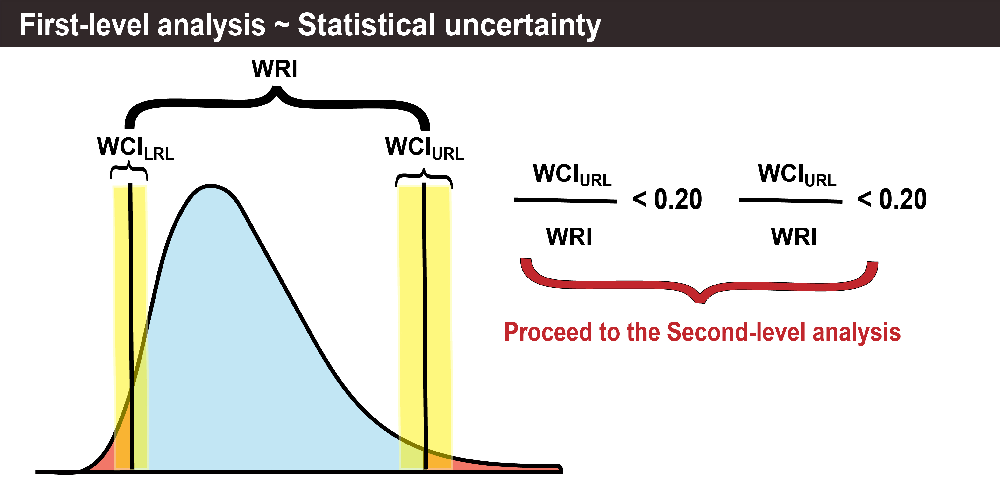
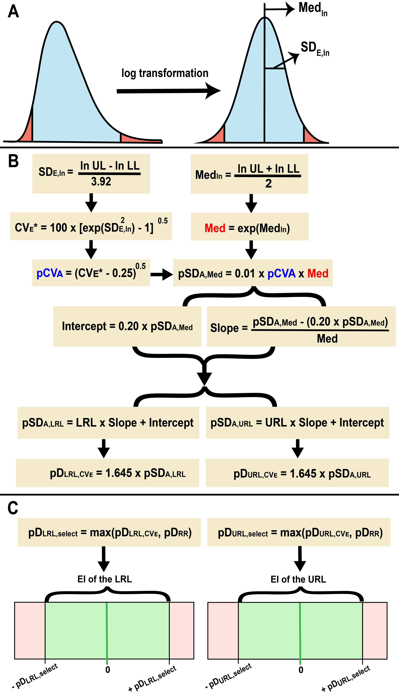
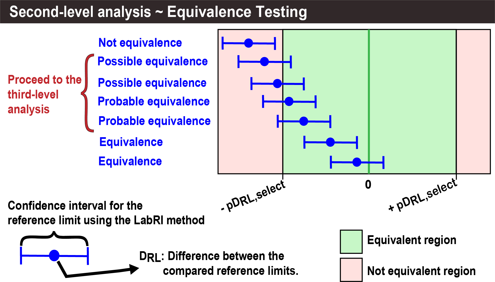
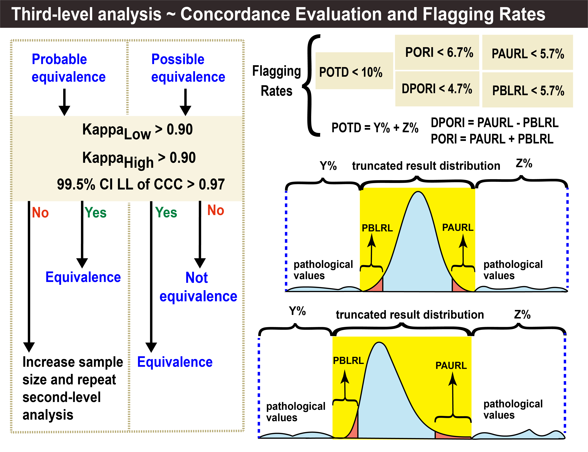

<br>

<br>

<div class="alert alert-dismissible alert-success" style="text-align: justify; line-height: 1.8;">
  <button type="button" class="btn-close" data-bs-dismiss="alert"></button> The <strong>LabRI tool</strong> is an R Markdown file that employs the indirect method called the <strong>LabRI Method</strong>. This method is an adaptive and multi-criteria approach for the <a href="#" class="alert-link">estimation and verification</a> of reference intervals, utilizing a combination of data cleaning algorithms, data transformation, clustering techniques, and the refineR and reflimR algorithms or the expectation-maximization (EM) algorithm, depending on the number of clusters in the truncated distribution.
</div>

<br>

<div class="alert alert-dismissible alert-info" style="text-align: justify; line-height: 1.8;">
  <button type="button" class="btn-close" data-bs-dismiss="alert"></button>
  <h4 class="alert-heading"><strong>Copyright (C); `r format(Sys.Date(), "%Y")`; LabR Group</strong></h4>
  <p>This program is free software: you can redistribute it and/or modify it under the terms of the GNU General Public License as published by the Free Software Foundation, either version 3 of the License, or (at your option) any later version.</p>
  <p>This program is distributed in the hope that it will be useful, but WITHOUT ANY WARRANTY; without even the implied warranty of MERCHANTABILITY or FITNESS FOR A PARTICULAR PURPOSE. See the GNU General Public License for more details.</p>
  <p>You should have received a copy of the GNU General Public License along with this program. If not, see <a href="https://www.gnu.org/licenses/" class="alert-link">Link</a>.</p>
</div>


<br>


# Contents

<br>

## 1. Initial information

<br>

```{r Stage_1_Initial_information,echo=FALSE,warning=FALSE,message=FALSE}


################################################################################
################################################################################
##################### NAME OF THE RESPONSIBLE SPECIALIST #######################
################################################################################
################################################################################


Responsible_person <- params$Responsible_person         


# Note 1: Please provide the name of the person responsible for the process or 
#         analysis conducted.

################################################################################
################################################################################
########################### DEFINE THE DATASET #################################
################################################################################
################################################################################


File_Name<-params$File_Name


# NOTE 2: Provide the name of the data file to be analyzed. 
#         The file must be in .csv, .xls, or .xlsx format.


################################################################################


Column_Name<-params$Column_Name


# NOTE 3: Provide the name of the column that contains the data to be analyzed.


################################################################################


# Is the name of the analyte the same as the name of the column in the file? 
# Mark the appropriate answer with an "X" 


yes <- ifelse(params$measurand_name == "yes", "x", "")

no <- ifelse(params$measurand_name == "no", "x", "")

Name_of_measurand <- params$Name_of_measurand


# NOTE 4: Select 'Yes' if the measurand name is the same as the column name in 
#         the dataset; otherwise, select 'No'. If 'No' is chosen, specify the 
#         custom measurand name in the "Name_of_measurand" field. This name will 
#         be used in the HTML report generated by the tool.


################################################################################


# File Format 
# Mark the appropriate answer with an "X" 


CSV<-""

XLS<-""

XLSX<-"x"


# Note 5: The default configuration File Format configuration is "CSV".


################################################################################


Data_source <- params$Data_source


# NOTE 6: NOTE: Provide the source of the dataset, specifying where it was 
#         obtained from.


################################################################################
################################################################################
##################### ABOUT THE TYPE OF REFERENCE INTERVAL #####################
######################  AND THE NUMBER OF DECIMAL PLACES  ######################
################################################################################
################################################################################


# C) Double-sided or One-sided reference intervals? 
# Mark the appropriate answer with an "X" 


Double_sided <- params$Double_sided

Right_sided <- params$Right_sided


# Note 7: The default configuration for reference intervals is "Double-sided".

IC_IR_select<-params$CI_level


################################################################################


Number_of_decimal_places <- params$Number_of_decimal_places


# Note 8: The default configuration for the number of decimal places is "2".


################################################################################
################################################################################
###################### STUDY TRACEABILITY INFORMATION ##########################
################################################################################
################################################################################


Measurement_procedure_and_analytical_method <- params$Measurement_procedure_and_analytical_method

Unit_of_measurement <- params$Unit_of_measurement

Type_of_specimen <- params$Type_of_specimen

Age_range <- params$Age_range

Sex <- params$Sex

Exclusion_criteria <- params$Exclusion_criteria  


################################################################################
################################################################################
######## PROVIDE THE COMPARATIVE REFERENCE INTERVAL (IF APPLICABLE) ############
################################################################################
################################################################################


Upper__Reference__Limit__of__Comparative_Reference <-params$Upper__Reference__Limit__of__Comparative_Reference

Lower__Reference__Limit__of__Comparative_Reference <- params$Lower__Reference__Limit__of__Comparative_Reference

Source_of_comparative_reference_used <- params$Source_of_comparative_reference_used


# NOTE 9: To perform the verification of reference intervals, a comparative 
#          reference interval must be provided. If a Comparative Reference 
#          Interval is not specified, the reference interval estimated by the 
#          LabRI method itself will be used as the comparative reference. 
#          This is because the algorithms in the LabRI method’s verification 
#          module require a comparative reference to conduct the verification.


################################################################################
################################################################################
################# SET THE MAXIMUM SAMPLE SIZE (IF APPLICABLE) ##################
################################################################################
################################################################################


Maximum_sample_size <- params$Maximum_sample_size


# NOTE 10: If the maximum sample size is not specified, a default value of 
#          10,000 will be used. This value was validated in the LabRI method 
#          study for estimating reference intervals representative of the 
#          laboratory's served population, ensuring processing efficiency and 
#          timely results.


################################################################################
########################## End (CLICK on "Knit") ###############################
################################################################################  
################################################################################  
################################################################################  
################################################################################  
################################################################################  
################################################################################  
################################################################################  
################################################################################  
################################################################################  
################################################################################  
################################################################################  
################################################################################  
################################################################################  
################################################################################  
################################################################################  
################################################################################  
################################################################################  
################################################################################  
################################################################################  
################################################################################  
################################################################################ 
################################################################################  
################################################################################  
################################################################################  
################################################################################  
################################################################################  
################################################################################  
################################################################################  
################################################################################  
################################################################################  
################################################################################  
################################################################################  
################################################################################  
################################################################################  
################################################################################  
################################################################################ 
################################################################################  
################################################################################  
################################################################################  
################################################################################   
################################################################################  
################################################################################  
################################################################################  
################################################################################ 
################################################################################  
################################################################################  
################################################################################  
################################################################################  
################################################################################  
################################################################################  
################################################################################ 
################################################################################  
################################################################################ 
################################################################################  
################################################################################  
################################################################################  
################################################################################ 
################################################################################  
################################################################################  
################################################################################   
################################################################################  
################################################################################ 
################################################################################  
################################################################################ 
################################################################################  
################################################################################  
################################################################################  
################################################################################  
################################################################################
################################################################################  


tempo_ini <- Sys.time()


################################################################################
### 1.1. Installing Packages ###################################################
################################################################################


install.packages.LabRI.Method <- function(Packages) {
  
Packages <- c(
  "AID", "DT", "FactoMineR", "KernSmooth", "MASS", "MethComp",
  "RVAideMemoire", "calibrate", "cartography", "cluster",
  "data.table", "datawizard", "devtools", "digest", "dplyr",
  "epiR", "factoextra", "ffp", "forecast", "ggplot2", "ggpubr",
  "ggtext", "grid", "gt", "imputeTS", "installr", "irr",
  "janitor", "kableExtra", "knitr", "lattice", "lubridate",
  "mclust", "mixR", "modeest", "moments", "multimode",
  "multiway", "nortest", "openxlsx", "pacman", "pandoc",
  "plotly", "prettydoc", "qqplotr", "readr", "readxl",
  "refineR", "reflimR", "rmarkdown", "scales", "shiny",
  "shiny.exe", "shinyjs", "shinythemes", "stats", "stringi",
  "systemfonts", "tidyr", "tools", "univOutl", "utf8",
  "xfun", "writexl", "zlog"
)


    novos_pacotes <- Packages[!(Packages %in% installed.packages()[, "Package"])]
  if(length(novos_pacotes)) {
    install.packages(novos_pacotes, dependencies = TRUE)
  }
  resultado <- sapply(Packages, require, character.only = TRUE)
  
  
#### 1.1.1. Create the formatted table #########################################
  
  
  n <- length(Packages)
  ncol <- 7
  nrow <- ceiling(n / ncol)
  tabela <- matrix("", nrow = nrow * 2, ncol = ncol)
  
  for (i in 1:n) {
    row <- ((i - 1) %% nrow) * 2 + 1
    col <- ceiling(i / nrow)
    tabela[row, col] <- Packages[i]
    tabela[row + 1, col] <- ifelse(resultado[i], "TRUE", "FALSE")
  }
  
  
#### 1.1.2. Convert the matrix to a data frame for use with kable ##############
  
  
  Table.1.data.frame <- as.data.frame(tabela)
  colnames(Table.1.data.frame) <- rep("", ncol)
  
   cor_condicional <- function(value) {
    if (value == "TRUE") {
      return("#d4edda") 
    } else if (value == "FALSE") {
      return("#f8d7da") 
    } else {
      return(NA) 
    }
  }
  
  df_color <- apply(Table.1.data.frame, c(1, 2), 
                    function(value) ifelse(value == "", NA, 
                    cor_condicional(value)))
  require(knitr)
  require(kableExtra)
  

  
kbl(Table.1.data.frame, align = "c", col.names = rep("", ncol), 
      caption = "<div style='text-align: justify; color: black;'><strong>Table 1.</strong> R Package Status.</div>") %>%
    kable_styling(full_width = FALSE, 
                  bootstrap_options = c("striped", "hover","condensed", "responsive")) %>%
    row_spec(seq(1, nrow(Table.1.data.frame), by = 2), bold = TRUE, color = "White", 
             background = "#1976d2") %>%
    column_spec(1:ncol, 
                background = ifelse(is.na(df_color), "transparent", df_color), 
                color = ifelse(Table.1.data.frame == "TRUE", "#155724", 
                               ifelse(Table.1.data.frame == "FALSE", "#721c24", "black")))
}


install.packages.LabRI.Method()


################################################################################
### 1.2. Reloading packages ####################################################
################################################################################


options(scipen = 999)
set.seed(200707042)
library(DT)
library(dplyr)
library(utf8)


################################################################################
### 1.3. Reading the file - Start Data cleaning ################################
################################################################################


formato.arquivo <- ifelse(CSV == "x" | CSV == "X", "csv",
                  ifelse(XLS == "x" | XLS == "X", "xls",
                  ifelse(XLSX == "x" | XLSX == "X", "xlsx", "csv")))

read_dataset_column <- function(file_name, column_name) {
  
  
#### 1.3.1. Internal function to remove accents ################################
 
   
  remove_accents <- function(text) {
    return(stringi::stri_trans_general(text, "Latin-ASCII"))
  }

    
#### 1.3.2. Internal function to read the file #################################

    
  read_file <- function(file) {
    extension <- tools::file_ext(file)
    
    tryCatch({
      if (extension == "csv") {
        
##### 1.3.2.1. Read the first lines to detect the decimal delimiter
        
        first_lines <- readLines(file, n = 5)
        decimal_mark <- ifelse(any(grepl(",", first_lines)), ",", ".")
        
        data <- readr::read_delim(file, delim = ";", 
                                  locale = readr::locale(decimal_mark = decimal_mark, 
                                                         encoding = "UTF-8"), n_max = -1)
      } else if (extension %in% c("xls", "xlsx")) {
        data <- readxl::read_excel(file, .name_repair = make.names, na = "", col_types = "guess")
        
##### 1.3.2.2. Convert columns to numeric, replacing commas with periods
        
        columns_to_convert <- colnames(data)
        
        for (column in columns_to_convert) {
          if (is.character(data[[column]])) {
            data[[column]] <- as.numeric(gsub(",", ".", data[[column]]))
          }
        }
      } else {
        stop("Unsupported file extension.")
      }
      
##### 1.3.2.3. Remove accents and special characters from column names
      
      colnames(data) <- remove_accents(make.names(colnames(data), unique = TRUE))
      
      return(data)
    }, error = function(e) {
      stop(paste("Error reading the file:", e$message))
    })
  }
  
  
#### 1.3.3. Use the file name directly #########################################
  
  
  file_path <- file_name
  
  
#### 1.3.4. Check if the file exists ###########################################
  
  
  if (!file.exists(file_path)) {
    stop("The specified file was not found.")
  }
  
  data <- read_file(file_path)

    
#### 1.3.5. Clean and standardize the specified column name ####################
  
  
  column_name_clean <- make.names(column_name)
  
  
#### 1.3.6. Check if the specified column exists in the dataset ################
  
  
  if (!column_name_clean %in% colnames(data)) {
    stop("The specified column does not exist in the dataset.")
  }
 
   
#### 1.3.7. Extract the specified column #######################################

    
  column_data <- data[[column_name_clean]]
  
  
#### 1.3.8. Check the data type of the column and handle appropriately #########
  
  
  if (is.factor(column_data)) {
    column_data <- as.character(column_data)
  } else if (is.character(column_data)) {
    column_data <- as.numeric(gsub(",", ".", column_data))
  }
  
  return(column_data)
}


#### 1.3.9. Adjusted to work with the full file path and column name from Shiny #


resultados <- data.frame(read_dataset_column(File_Name, Column_Name))

colnames(resultados)[1]<-"resultados"
resultados<-resultados$resultados
resultados<-as.character(resultados)
resultados<-gsub("[:punct:]","",resultados)
resultados<-as.numeric(resultados)
resultados<-na.omit(data.frame(resultados))
resultados<-resultados$resultados


################################################################################
### 1.4. Subsample #############################################################
################################################################################


sample.size<-length(resultados)

sampling<-ifelse(Maximum_sample_size=="","10000",Maximum_sample_size)

sampling<-as.numeric(sampling)

sampling<-ifelse(is.na(sampling)==TRUE,sample.size,sampling)

sample.size.select<-ifelse(is.na(sampling)==TRUE,sample.size,
                    ifelse(sampling>sample.size,sample.size,sampling))

resultados<-data.frame(resultados)

amostragem <- sample(nrow(resultados), replace=FALSE, 
                     size=sample.size.select)

resultados <- resultados[amostragem, ]


################################################################################
### 1.5. Loading Information ###################################################
################################################################################


interpretando.responsavel<-Responsible_person==""


Responsavel<-ifelse(interpretando.responsavel==TRUE,
                        "Inform the name of the person responsible for the analysis",
                    as.character(Responsible_person))


interpretando.Sistema.Analitico<-Measurement_procedure_and_analytical_method==""
Sistema.Analitico<-ifelse(interpretando.Sistema.Analitico==TRUE,
                        "Information about the measurement procedure",
                        as.character(Measurement_procedure_and_analytical_method))


Nome_do_Analito<-ifelse(yes=="x"|yes=="X",Column_Name,
                 ifelse(no=="x"|no=="X",Name_of_measurand,
                 ifelse(Name_of_measurand=="",Column_Name,Name_of_measurand)))

interpretando.nome.analito<-Nome_do_Analito==""
Nome.do.analito<-ifelse(interpretando.nome.analito==TRUE,
                        "Inform the Name of the measurand",
                        as.character(Nome_do_Analito))


interpretando.tipo.de.amostra<-Type_of_specimen==""
Tipo.de.amostra<-ifelse(interpretando.tipo.de.amostra==TRUE,
                              "Inform the type of blood specimen",
                              as.character(Type_of_specimen))


interpretando.Criterios.de.exclusao<-Exclusion_criteria==""
Criterios.de.exclusao<-ifelse(interpretando.Criterios.de.exclusao==TRUE,
                              "Inform the exclusion criteria",
                              as.character(Exclusion_criteria))


interpretando.Local.origem.dos.dados<-Data_source==""
Local.origem.dos.dados<-ifelse(interpretando.Local.origem.dos.dados==TRUE,
                               "Inform about data source",
                               as.character(Data_source))


interpretando.unidade.de.medida<-Unit_of_measurement==""
Unidade.de.medida<-ifelse(interpretando.unidade.de.medida==TRUE,
                        "Inform the unit of measurement used",
                        as.character(Unit_of_measurement))


interpretando.faixa.etaria<-Age_range==""
Faixa.etaria<-ifelse(interpretando.faixa.etaria==TRUE,
                        "Inform the age range",
                        as.character(Age_range))


interpretando.sexo<-Sex==""
Sexo<-ifelse(interpretando.sexo==TRUE,
             "Inform the sex",
             as.character(Sex))


lado<-ifelse(Double_sided=="x"|Double_sided=="X","Two_sided",
             ifelse(Right_sided=="x"|Right_sided=="X","Right_sided",
                     "Two_sided"))

Lado.texto<-ifelse(lado=="Two_sided",
            "Double-sided. There is a Lower Limit and an Upper Limit of reference.",
            ifelse(lado=="Right_sided",
            "Right-sided. There is only the Upper Limit of reference.",
            "Double-sided. There is a Lower Limit and an Upper Limit of reference."))


IC_IR_select2<-as.numeric(ifelse(is.na(IC_IR_select)==TRUE,0.90,IC_IR_select))


Platykurtic<-"The distribution can be considered platykurtic."
Leptokurtic<-"The distribution can be considered leptokurtic."
Mesokurtic<-"The distribution can be considered mesokurtic."


################################################################################
### 1.6. Measurement Granularity Audit (MAG) function ##########################
################################################################################


tabela.contagem<-as.data.frame(table(data=resultados))

MAG <- function(tabela.contagem,
                col_valor = "data",
                valor_excluir = 0,
                nova_coluna = "n_casas_decimais",
                max_dec_search = 10,
                tol = 1e-12,
                limiar_freq_acum = NULL) {
  
  
  
  x <- tabela.contagem[[col_valor]]
  
  
#### 1.6.1. Relative and cumulative relative frequency (base: Freq column) #####
  
  
  Freq_num <- suppressWarnings(as.numeric(tabela.contagem[["Freq"]]))
  total_freq <- sum(Freq_num, na.rm = TRUE)
  if (is.finite(total_freq) && total_freq > 0) {
    tabela.contagem[["Freq_rel"]] <- Freq_num / total_freq
    tabela.contagem[["Freq_rel_acum"]] <- cumsum(tabela.contagem[["Freq_rel"]])
  } else {
    tabela.contagem[["Freq_rel"]] <- NA_real_
    tabela.contagem[["Freq_rel_acum"]] <- NA_real_
  }
  
  
#### 1.6.2. Infer decimal places of a number (robust to floating point) ########
  
  
  infer_dec_num <- function(v) {
    if (is.na(v)) return(NA_integer_)
    for (d in 0:max_dec_search) {
      if (abs(v - round(v, d)) <= tol * max(1, abs(v))) return(as.integer(d))
    }
    as.integer(max_dec_search)
  }
  
  
#### 1.6.3. Decimal places per line ############################################
  
  
  if (is.numeric(x)) {
    n_dec <- vapply(x, infer_dec_num, integer(1))
    x_num <- x
  } else {
    x_chr <- trimws(as.character(x))
    n_dec <- vapply(x_chr, function(s) {
      if (is.na(s) || s == "") return(NA_integer_)
      if (!grepl("\\.", s)) return(0L)
      nchar(sub(".*\\.", "", s))
    }, integer(1))
    x_num <- suppressWarnings(as.numeric(x_chr))
  }
  
  
#### 1.6.4. Adds a column to the data frame ####################################
  
  
  tabela.contagem[[nova_coluna]] <- n_dec
  
  
#### 1.6.5. Maximum ignoring 0.0001 (but keeping its count in the column) ######
  
  
  excluir <- !is.na(x_num) & is.finite(x_num) &
    abs(x_num - valor_excluir) <= tol * max(1, abs(valor_excluir))
  max_dec_freq <- if (any(!excluir & !is.na(n_dec))) {
    max(n_dec[!excluir], na.rm = TRUE)
  } else {
    NA_integer_
  }
  
  
#### 1.6.6. Analysis of n_casas_decimais column - preponderant value ###########
  
  
##### 1.6.6.1. Count the quantity of each decimal place option
  
  
  n_dec_validos <- n_dec[!is.na(n_dec)]
  
  if (length(n_dec_validos) > 0) {
    
    
##### 1.6.6.2. Table of absolute frequencies
    
    
    tabela_freq_decimais <- table(n_dec_validos)
    
    
##### 1.6.6.3. Create data frame for auditing.
    
    
    auditoria_decimais <- data.frame(
      n_casas_decimais = as.integer(names(tabela_freq_decimais)),
      freq_absoluta = as.integer(tabela_freq_decimais),
      stringsAsFactors = FALSE
    )
    
    
##### 1.6.6.3. Sort by number of decimal places
    
    
    auditoria_decimais <- auditoria_decimais[order(auditoria_decimais$n_casas_decimais), ]
    
    
##### 1.6.6.4. Add relative frequency
    
    
    auditoria_decimais$freq_relativa <- auditoria_decimais$freq_absoluta / 
                                        sum(auditoria_decimais$freq_absoluta)
    
    
##### 1.6.6.5. Identify the predominant value (highest absolute frequency)
    
    
    idx_preponderante <- which.max(auditoria_decimais$freq_absoluta)
    max_dec <- auditoria_decimais$n_casas_decimais[idx_preponderante]
    
  } else {
    auditoria_decimais <- data.frame(
      n_casas_decimais = integer(0),
      freq_absoluta = integer(0),
      freq_relativa = numeric(0)
    )
    max_dec <- NA_integer_
  }
  
  
#### 1.6.7. Map threshold to Freq_rel_acum using the closest value in "data" ###
  
  
  limiar_in <- suppressWarnings(as.numeric(limiar_freq_acum))
  data_mais_proxima <- NA_real_
  freq_rel_acum_no_limiar <- NA_real_
  if (!is.null(limiar_freq_acum) && is.finite(limiar_in)) {
    dif <- abs(x_num - limiar_in)
    dif[is.na(dif) | !is.finite(dif)] <- Inf
    if (any(is.finite(dif))) {
      idx <- which.min(dif)
      data_mais_proxima <- x_num[idx]
      freq_rel_acum_no_limiar <- tabela.contagem[["Freq_rel_acum"]][idx]
    }
  }
  
  list(
    df = tabela.contagem,
    max_decimal = max_dec,
    max_decimal_freq = max_dec_freq,
    auditoria_casas_decimais = auditoria_decimais,
    limiar_input = limiar_in,
    data_mais_proxima = data_mais_proxima,
    freq_rel_acum_no_limiar = freq_rel_acum_no_limiar
  )
}


auditoria.decimais<-data.frame(MAG(tabela.contagem)$auditoria_casas_decimais)

decimal.max<-MAG(tabela.contagem)$max_decimal_freq

RGTC<-10^(1-decimal.max)

freq_acum<-MAG(tabela.contagem,
                               limiar_freq_acum=(RGTC))$freq_rel_acum_no_limiar

criterion.1<-length(unique(as.numeric(as.character(MAG(tabela.contagem)$df$data))[as.numeric(as.character(MAG(tabela.contagem)$df$data)) < (RGTC) & !is.na(as.numeric(as.character(MAG(tabela.contagem)$df$data)))]))<= 11


criterion.2<-freq_acum > 0.75


use.np.method<-ifelse(criterion.1 & criterion.2,TRUE,FALSE)


################################################################################
### 1.7. Defining the decimal places in the report #############################
################################################################################


interpretando.casa.decimal<-Number_of_decimal_places==""


casa.decimal <- if (isTRUE(interpretando.casa.decimal)) {
  decimal.max
} else {as.numeric(Number_of_decimal_places)}


casa.decimal2 <- if (isTRUE(interpretando.casa.decimal)) {
  decimal.max+1
} else {as.numeric(Number_of_decimal_places)}


```

<br>

::: {style="text-align: justify; line-height: 1.8; color: black;"}
<li><strong>Responsible person:</strong> `r Responsavel`;</li>
:::

<br>

::: {style="text-align: justify; line-height: 1.8; color: black;"}
<li><strong>Measurement procedure and Method:</strong> `r Sistema.Analitico`;</li>
:::

<br>

::: {style="text-align: justify; line-height: 1.8; color: black;"}
<li><strong>Name of the measurand:</strong> `r Nome.do.analito`;</li>
:::

<br>

::: {style="text-align: justify; line-height: 1.8; color: black;"}
<li><strong>Unit of measurement:</strong> `r Unidade.de.medida`;</li>
:::

<br>

::: {style="text-align: justify; line-height: 1.8; color: black;"}
<li><strong>Type of blood specimen:</strong> `r Tipo.de.amostra`;</li>
:::

<br>

::: {style="text-align: justify; line-height: 1.8; color: black;"}
<li><strong>Exclusion criteria:</strong> `r Criterios.de.exclusao`;</li>
:::

<br>

::: {style="text-align: justify; line-height: 1.8; color: black;"}
<li><strong>Data source:</strong> `r Local.origem.dos.dados`;</li>
:::

<br>

::: {style="text-align: justify; line-height: 1.8; color: black;"}
<li><strong>Age range:</strong> `r Faixa.etaria`;</li>
:::

<br>

::: {style="text-align: justify; line-height: 1.8; color: black;"}
<li><strong>Sex:</strong> `r Sexo`;</li>
:::

<br>

::: {style="text-align: justify; line-height: 1.8; color: black;"}
<li><strong>Settings:</strong></li>
:::

::: {style="text-align: justify; line-height: 1.8; color: black;"}
<ul style="list-style-type: circle; margin-left: 10px;">

<li><strong>Number of decimal places:</strong> `r casa.decimal`;</li>

<li><strong>Setting the limits of the Reference Interval ('Double-sided' or 'One-sided'):</strong> `r Lado.texto`;</li>

</ul>
:::

<br>

## 2. Descriptive statistics

<br>

```{r Stage_2_Descriptive_statistics,echo=FALSE,warning=FALSE,message=FALSE}

################################################################################
### 2.1. Reloading packages ####################################################
################################################################################


options(scipen = 999)
set.seed(200707042)
library(modeest)
library(kableExtra)
library(forecast)
library(multimode)
library(utf8)
library(DT)
library(dplyr)
library(utf8)
rm(tabela.contagem)
rm(auditoria.decimais)


################################################################################
### 2.2. Table 2 Patient's results #############################################
################################################################################


colnames <- c("Sample size", "Patients' results")
colnames <- enc2utf8(colnames)

Titulo.Table.2<-htmltools::tags$caption(
                       style = 'caption-side: top; text-align: justify; color: black;',
                       htmltools::HTML("<b>Table 2.</b> Patients' results."))

Table.2 <- datatable(data.frame(resultados), 
                     class = "cell-border stripe",
                     colnames = colnames(data.frame(resultados)),
                     caption = Titulo.Table.2,
                     filter = "top",
                     escape = FALSE,
                     options = list(
                       searchHighlight = TRUE,
                       initComplete = JS("function(settings, json) {",
                                         "$(this.api().table().header()).css({'background-color': '#0d47a1', 'color': '#fff'});",
                                         "}")
                     ))

Table.2


################################################################################
### 2.3. Table 3 - Position Measurements (Part 1) ##############################
################################################################################


mensurando<-paste(Nome.do.analito,"(",Unidade.de.medida,")")

P.media<-round(mean(resultados),digits=casa.decimal2)

P.mediana<-round(median(resultados),digits=casa.decimal2)


P.moda<-locmodes(resultados,mod0=1)
P.moda<-round(P.moda$locations,digits=casa.decimal2)


P.dp<-round(sd(resultados),digits=casa.decimal2)


menor.valor<-round(min(resultados),digits=casa.decimal2)
maior.valor<-round(max(resultados),digits=casa.decimal2)


medidas.posicao.1<-c("N",
                     "n", 
                     "Minimum", 
                     "Mode", 
                     "Mean", 
                     "Median", 
                     "Maximum")


result.medidas.posicao.1<-c(as.character(as.integer(sample.size)),
                            as.character(as.integer(sample.size.select)),
                            menor.valor,
                            P.moda,
                            P.media,
                            P.mediana,
                            maior.valor)

Table.3.data.frame <-data.frame(medidas.posicao.1,
                                result.medidas.posicao.1)

Titulo.Table.3<-"<div style='text-align: justify; color: black;'><strong>Table 3.</strong> Measures of Position - Part 1.</div>"

footnote_text.Tables.3<- paste("
<div style='text-align: justify; color: black;'>
<strong>N</strong>, total sample size in the original dataset (before subsampling and outlier removal).
<strong>n</strong>, user-defined subsample size (maximum number of observations used for analysis).
</div>
")

Table.3 <- kbl(Table.3.data.frame,
                  col.names = c("Statistical parameters","Results"),
                  align = "cc",
                  caption = Titulo.Table.3,
               format = "html", 
               table.attr = "style='text-align: justify; line-height: 1.8; color: #000000; font-size: 1em;'") %>%
  kable_styling(full_width = FALSE,
                bootstrap_options = c("striped",
                                      "hover",
                                      "condensed",
                                      "responsive")) %>%
  row_spec(0,
           bold = TRUE, 
           color = "White", 
           background = "#0d47a1") %>%
  column_spec(1,
             bold = TRUE,
             color = "White",
             background = "#1976d2") %>% 
  footnote(general_title = "<div style='text-align: justify; color: black;'>Footnote</div>",
           general = footnote_text.Tables.3, escape = FALSE)

Table.3


################################################################################
### 2.4. Table 4 - Position Measurements (Part 2) ##############################
################################################################################


medidas.posicao.2<-c("N",
                     "n", 
                     "1st percentile", 
                     "2.5th percentile", 
                     "5th percentile", 
                     "10th percentile", 
                     "16th percentile", 
                     "25th percentile", 
                     "50th percentile (median)", 
                     "75th percentile",
                     "84th percentile",
                     "90th percentile",
                     "95th percentile", 
                     "97.5th percentile",
                     "99th percentile")


result.medidas.posicao.2<-c(sample.size,
                            sample.size.select,
                          round(quantile(resultados,0.01),digits=casa.decimal2),
                          round(quantile(resultados,0.025),digits=casa.decimal2),
                          round(quantile(resultados,0.05),digits=casa.decimal2),
                          round(quantile(resultados,0.10),digits=casa.decimal2),
                          round(quantile(resultados,0.16),digits=casa.decimal2),
                          round(quantile(resultados,0.25),digits=casa.decimal2),
                          P.mediana,
                          round(quantile(resultados,0.75),digits=casa.decimal2),
                          round(quantile(resultados,0.84),digits=casa.decimal2),
                          round(quantile(resultados,0.90),digits=casa.decimal2),
                          round(quantile(resultados,0.95),digits=casa.decimal2),
                          round(quantile(resultados,0.975),digits=casa.decimal2),
                          round(quantile(resultados,0.99),digits=casa.decimal2))


Table.4.data.frame<-data.frame(medidas.posicao.2,
                               result.medidas.posicao.2)


Titulo.Table.4<-"<div style='text-align: justify; color: black;'><strong>Table 4.</strong> Measures of Position - Part 2.</div>"

footnote_text.Tables.4<- paste("
<div style='text-align: justify; color: black;'>
<strong>N</strong>, total sample size in the original dataset (before subsampling and outlier removal).
<strong>n</strong>, user-defined subsample size (maximum number of observations used for analysis).
</div>
")

Table.4 <- kbl(Table.4.data.frame,
               col.names=c("Statistical parameters","Results"),
                  align = "cc",
                  caption = Titulo.Table.4,
               format = "html", 
               table.attr = "style='text-align: justify; line-height: 1.8; color: #000000; font-size: 1em;'") %>%
  kable_styling(full_width = FALSE,
                bootstrap_options = c("striped",
                                      "hover",
                                      "condensed",
                                      "responsive")) %>%
  row_spec(0,
           bold = TRUE, 
           color = "White", 
           background = "#0d47a1") %>%
  column_spec(1,
             bold = TRUE,
             color = "White",
             background = "#1976d2") %>% 
  footnote(general_title = "<div style='text-align: justify; color: black;'>Footnote</div>",
           general = footnote_text.Tables.4, escape = FALSE)

Table.4


################################################################################
### 2.5. Table 5 - Dispersion measurements #####################################
################################################################################


medidas.dispers<-c("N",
                   "n",
                   "SD",
                   "Variance",
                   "IQR",
                   "Range")


amplitude<-round(max(resultados),digits=casa.decimal2)-round(min(resultados),
                                                            digits=casa.decimal2)

result.medidas.dispers <- c (as.character(as.integer(sample.size)),
                             as.character(as.integer(sample.size.select)),
                             P.dp,
                             round(var(resultados),digits=casa.decimal2),
                             round(IQR(resultados),digits=casa.decimal2),
                             round(amplitude,digits=casa.decimal2))


Table.5.data.frame <- data.frame(medidas.dispers,
                                 result.medidas.dispers)


Titulo.Table.5<-"<div style='text-align: justify; color: black;'><strong>Table 5.</strong> Measures of Dispersion.</div>"

footnote_text.Tables.5<- paste("
<div style='text-align: justify; color: black;'>
<strong>N</strong>, total sample size in the original dataset (before subsampling and outlier removal).
<strong>n</strong>, user-defined subsample size (maximum number of observations used for analysis).
<strong>SD</strong>, Standard Deviation.
<strong>IQR</strong>, Interquartile Range.
</div>
")


Table.5<-kbl(Table.5.data.frame,
             col.names = c("Statistical parameters","Results"),
                align = "cc",
                caption = Titulo.Table.5,
             format = "html", 
             table.attr = "style='text-align: justify; line-height: 1.8; color: #000000; font-size: 1em;'") %>%
  
  kable_styling(full_width = FALSE,
                bootstrap_options = c("striped",
                                      "hover",
                                      "condensed",
                                      "responsive")) %>%
  row_spec(0,
           bold = TRUE, 
           color = "White", 
           background = "#0d47a1") %>%
  column_spec(1,
             bold = TRUE,
             color = "White",
             background = "#1976d2") %>% 
  footnote(general_title = "<div style='text-align: justify; color: black;'>Footnote</div>",
           general = footnote_text.Tables.5, escape = FALSE)

Table.5


################################################################################
### 2.6. Choose Histogram n bins ###############################################
################################################################################


choose_nbreaks <- function(x, digits = NULL, use.np.method = FALSE) {
  x <- x[is.finite(x)]
  n <- length(x)
  if (n == 0) stop("x vazio.")

#### 2.6.1. Degenerate case (everything is the same)
  
  if (diff(range(x)) == 0) return(list(k = 1L, rule = "degenerate"))

#### 2.6.2. If it's the NP method, force 10 breaks
  
  if (isTRUE(use.np.method)) {
    return(list(k = 10L, rule = "fixed_10_np"))
  }

#### 2.6.3. Caps per n range (legibility)
  
  cap <- function(k, lo, hi) max(lo, min(hi, k))

  if (n < 40) {
    k <- ceiling(sqrt(n))
    return(list(k = cap(k, 4, 12), rule = "sqrt(n)"))
  }

  if (n < 200) {
    k <- nclass.Sturges(x)
    return(list(k = cap(k, 6, 20), rule = "Sturges"))
  }

  k_fd <- nclass.FD(x)
  if (!is.finite(k_fd) || k_fd <= 1) {
    k <- nclass.Sturges(x)
    return(list(k = cap(k, 8, if (n < 1000) 40 else 80), 
                rule = "Sturges_fallback"))
  }

  if (n < 500)  return(list(k = cap(k_fd, 10, 50),  rule = "FD"))
  if (n < 1000) return(list(k = cap(k_fd, 20, 80),  rule = "FD_capped"))
  return(list(k = cap(k_fd, 30, 120), rule = "FD_capped"))
}


choose.nbreaks<-choose_nbreaks(resultados,
                               digits = 5,
                               use.np.method = isTRUE(use.np.method))

n.break<-choose.nbreaks$k

```

<br>

## 3. Estimation Module

<br>

::: {style="text-align: justify; line-height: 1.8; color: black;"}
<ul>

<li>The LabRI method is an adaptive and multi-criteria approach for the <strong>indirect estimation and
verification</strong> of reference intervals. It integrates data cleaning, data transformation, clustering
techniques, and applies the refineR, reflimR, and Expectation-Maximization (EM) algorithms. The method
combines parametric and non-parametric percentile approaches to estimate population reference intervals,
depending on the number of clusters identified in the truncated distribution.</li>

</ul>
:::

::: {style="text-align: justify; line-height: 1.8; color: black;"}
<ul><strong>Characteristics of the LabRI Method:</strong></ul>
:::

::: {style="text-align: justify; line-height: 1.8; color: black; margin-left: 20px;"}
<ul style="list-style-type: circle;">

<li><strong>Adaptive:</strong> Adjusts its application based on the structure and characteristics of the data,
using different cleaning and transformation techniques as needed. Applies the Centroid of Windsorized
Reference Limits method using refineR and reflimR if the data distribution has more than one cluster for
reference interval estimation. If there is only one cluster, the expectation-maximization algorithm is used
with both parametric and non-parametric approaches to obtain the best reference interval estimate.</li>

<li><strong>Multi-criteria:</strong> Considers multiple criteria and methods for the estimation and
verification of reference intervals, ensuring a robust and comprehensive analysis.</li>

</ul>
:::

<br>

### 3.1. Initial data preprocessing {.tabset .tabset-pills}

<br>

```{r Stage_3_1_Preprocessing,echo=FALSE,warning=FALSE,message=FALSE,results='asis'}

cat("
<div style='text-align: justify; line-height: 1.8; color: #0033CC; font-size: 1.2em;'>
<strong>3.1.1. Handling Rounding Artifacts for Reliable Mixture-Model Fitting</strong></div>
<br>
<div style='text-align: justify; line-height: 1.8; color: black;'>
  Prior to Expectation–Maximization (EM) mixture modeling with the <code>mclust</code> and <code>mixR</code> packages, a
  reproducible uniform micro-jitter (IFCC-style dithering) is applied to break ties <strong>(eq.1)</strong>
  <a href='https://doi.org/10.1016/0009-8981(87)90151-3' target='_blank'>[1]</a>. This step preserves analytical resolution while improving numerical
  stability during model fitting, because extensive ties and heavy rounding can impair EM-based Gaussian mixture
  estimation, increasing the risk of degenerate covariance estimates and convergence failures. The perturbed values
  are then truncated downward to d+2 decimal places. Finally, any values that become zero or negative after jittering
  are replaced with a small positive floor (0.0001) <a href='https://doi.org/10.1002/cpt.2603' target='_blank'>[2]</a>.
</div>
<br>
")

cat("$$
\\Large{
x_i^{\\ast} = x_i + 10^{-(d+1)}\\times (r_i - 0.5)
}\\qquad (eq.1)
$$")

cat("
<div style='text-align: justify; line-height: 1.8; color: black;'>
  where, <strong>d</strong>, denotes the number of decimal places used to report the original measurements.
  <strong>x<sub>i</sub></strong>, is the individual laboratory test result.
  <strong>r<sub>i</sub></strong>, is a computer-generated random number between 0.0 and 1.0.
  <strong>x<sub>i</sub><sup>*</sup></strong>, is the jittered value obtained after applying the uniform micro-jitter to the original result x<sub>i</sub>
</div>
")


cat("
<br>
<div style='text-align: justify; line-height: 1.8; color: #0033CC; font-size: 1.2em;'>
<strong>3.1.2. Box-Cox transformation approaches:</strong>
</div>

<div style='text-align: justify; line-height: 1.8; color: black;'>
  <ul>
    <li> The Box-Cox transformation  is applied based on the <strong>Bowley&#39;s Coefficient of Skewness (Sk<sub>Bowley</sub>)</strong>. After the transformation, Sk<sub>Bowley</sub> is reassessed to determine which dataset exhibits a distribution closest to Gaussian. The dataset with the most Gaussian-like profile, whether from the cleaned original data or the transformed data, will be used in the clustering and truncation steps.</li>
  </ul>
</div>

<br>

<div style='text-align: justify; line-height: 1.8; color: #0033CC; font-size: 1.2em;'>
<strong>3.1.2. Algorithm for data transformation:</strong>
</div>

<div style='text-align: justify; line-height: 1.8; color: black;'>
  <ul>
    <li>No método LabRI, the <strong>'Transformation Algorithm'</strong> will be used to select the best Box-Cox transformation (method = <strong>log-likelihood</strong>) and the optimal lambda value (&lambda;), which is the one that provides the best approximation to a normal distribution. O relatório mostra o (&lambda;) obtido conforme o critério do algorimto refineR e conforme o critério definido pelo método LabRI que é utilziado para decisão de transformação tanto para estimativa de intervalos de referencia pelo método reflimR comom pelo método LabRI.</li>
<br>    
    <li>
      The transformation of y is performed using <strong>eq.(1)</strong>:
    </li>
  </ul>
</div>
")

cat("$$
\\Large{
y^{(\\lambda)} = 
\\left\\{
\\begin{matrix} 
{\\frac{y_i^\\lambda - 1}{\\lambda}}, & \\mbox{if } \\lambda \\neq 0 \\\\ 
ln(y_i), & \\mbox{if } \\lambda = 0 
\\end{matrix} 
\\right.
} \\quad \\quad \\quad \\quad \\quad \\quad {(1)} 
$$")


cat("
<br>
where, <strong>$y^{(\\lambda)}$</strong>, the transformed value of the (i)-th observation after applying the Box-Cox transformation. <strong>$y_{i}$</strong>, the original value of the $i$-th observation in the dataset.
<strong>$\\lambda$</strong>, the transformation parameter that maximizes the normality of the data. It is determined through optimization. <strong> $ln(y_{i})$</strong>, the natural logarithm of $y_{i}$, used when $\\lambda = 0$.
<br>
")

cat("
<br>
<div style='text-align: justify; line-height: 1.8; color: #0033CC; font-size: 1.2em;'>
<strong>3.1.2. Interpreting the shape of data distributions</strong>
</div>
<br>
<div style='text-align: justify; line-height: 1.8; color: black; margin-top: 10px;'>
  <ul>
    <li>
      <strong>Skewness</strong> refers to a distortion or asymmetry that deviates from the symmetrical bell curve, or normal distribution, in a set of data. If the curve is shifted to the left or right, it is said to be skewed.
      <ul style='margin-left: 20px;'>
        <li><strong>Positive skewed distribution (or right-skewed distribution):</strong> It is a type of distribution in which most values are clustered around the left tail of the distribution, while the right tail of the distribution is longer, indicating a positive skewness coefficient (Sk &gt; 0).</li>
        <li><strong>Negative skewness (or left-skewed distribution):</strong> It is a type of distribution in which most of the values are grouped around the right tail of the distribution, while the left tail of the distribution is longer, indicating a negative skewness coefficient (Sk &lt; 0).</li>
      </ul>
    </li>
  </ul>
</div>


<br>
<div style='text-align: justify; line-height: 1.8; color: black;'>
  <ul>
    <li>
      <strong>Kurtosis:</strong> Similar to 'skewness', kurtosis coefficient (Kt) is a statistical measure used to describe a distribution. While skewness differentiates extreme values in one tail versus the other, kurtosis measures extreme values in both tails. Kurtosis is a measure of the combined weight of the tails of a distribution relative to the center of the distribution.
      <ul style='margin-left: 20px;'>
        <li><strong>Leptokurtic:</strong> A leptokurtic distribution shows heavy tails on both sides, indicating large discrepant values. Theoretically, a leptokurtic distribution is one with K &gt; 3. From a practical standpoint, a leptokurtic distribution with Kt &gt; 3.3 can be considered visibly or perceptibly leptokurtic.</li>
        <li><strong>Mesokurtic:</strong> Data that follows a mesokurtic distribution shows an excess kurtosis of zero or close to zero. This means that if the data follows a normal distribution, it follows a mesokurtic distribution. Theoretically, the kurtosis of a normal distribution is equal to 3. A distribution of results between 2.7 and 3.3 will be considered mesokurtic.</li>
        <li><strong>Platykurtic:</strong> The kurtosis reveals a distribution with flattened tails. The flat tails indicate few outliers in the distribution. Theoretically, a platykurtic distribution is one with kurtosis below 3. From a practical standpoint, a distribution with kurtosis below 2.7 can be considered platykurtic.</li>
      </ul>
    </li>
  </ul>
</div>


<br>
")


################################################################################
#### 3.1.1. Reloading packages #################################################
################################################################################


set.seed(200707042)
library(modeest)
library(kableExtra)
library(forecast)
library(multimode)
library(utf8)
library(univOutl)
library(reflimR)
library(refineR)
rm(Table.2)
rm(Titulo.Table.2)
rm(Table.3.data.frame)
rm(Table.4.data.frame)
rm(Table.5.data.frame)
rm(choose.nbreaks)


################################################################################
#### 3.1.2. Step 1 - IFCC-Style Jittering ######################################
################################################################################


jittering_ifcc <- function(x, decimais, 
                           seed = 200707042, 
                           floor_value = 0.0001) {
  
  
##### 3.1.2.1. Basic checks ####################################################
  
  
  if (!is.numeric(x)) stop("The dataset needs to be numerical.")
  
  if (length(decimais) != 1 || is.na(decimais)) stop("The decimal number must be a single value (non-NA).")
  if (!is.numeric(decimais) || decimais < 0 || decimais %% 1 != 0) {
    stop("Decimal numbers must be integers greater than or equal to 0 (e.g., 0, 1, 2, 3...).")
  }
  if (length(floor_value) != 1 || !is.numeric(floor_value) || is.na(floor_value) || floor_value <= 0) {
    stop("floor_value must be a unique number > 0 (e.g., 0.0001).")
  }

  
##### 3.1.2.2. Rule: decimals=0 -> S=0.1; decimals=1 -> S=0.01; ...#############
  
  
  S <- 10^(-(decimais + 1))

  if (!is.null(seed)) set.seed(seed)

  out <- x
  idx <- which(!is.na(x))
  if (length(idx) == 0) return(out)

  r <- stats::runif(length(idx), min = 0, max = 1)
  out[idx] <- x[idx] + S * (r - 0.5)

  
##### 3.1.2.3. If it becomes <= 0, replace it with floor_value #################
  
  
  out[idx] <- ifelse(out[idx] <= 0, floor_value, out[idx])
  

##### 3.1.2.4. Round down to (decimal places + 2) ##############################
  
  
  n_dec_out <- decimais + 2L
  f <- 10^n_dec_out

  
##### 3.1.2.5. Protection: prevents turning to 0.00 ############################
  
  
  floor_eff <- max(floor_value, 1 / f)

  out[idx] <- floor(out[idx] * f) / f
  out[idx] <- ifelse(out[idx] <= 0, floor_eff, out[idx])
  out[idx] <- floor(out[idx] * f) / f
 

  out
}


resultados<-jittering_ifcc(resultados,
                           decimais = decimal.max)


################################################################################
#### 3.1.3. Step 2.2 - Preprocessing ###########################################
################################################################################


if (isTRUE(use.np.method)) {


##### 3.1.3.1. Preprocessing in a low-variability environment ##################
  
  
preproc_A <- function(resultados,
                      lado = c("Two_sided","Right_sided"),
                      menor_valor = 0,
                      n_ciclos = 5,
                      k = 1.5,
                      verbose = TRUE) {

  lado <- match.arg(lado)

  n_original <- length(resultados)
  dados_atuais <- resultados
  resumo_ciclos <- data.frame()

##### 3.1.3.1.1. To check stabilization (3 houses) 
  
  prev_LI_r3 <- NA_real_
  prev_LS_r3 <- NA_real_

  for (i in 1:n_ciclos) {

##### 3.1.3.1.2. If there is not enough data, stop 
    
    if (length(dados_atuais) < 2 || all(is.na(dados_atuais))) {
      if (verbose) message("Interrupted: insufficient data in the cycle ", i, ".")
      break
    }

##### 3.1.3.1.3. Tukey fences (asymmetric) 
    
    fences <- boxB(dados_atuais, k = k, method = "asymmetric")

    LS_raw <- as.numeric(fences$fences[2])
    LI_raw <- as.numeric(fences$fences[1])

    LI <- LI_raw
    LS <- LS_raw
    
###### 3.1.3.1.3.1. If LI < 0 => 0 (always)
    
    if (is.finite(LI) && LI < 0) LI <- 0
    
###### 3.1.3.1.3.2. Respects the lowest value (without letting it fall below 0)
    
    LI <- max(LI, 0, menor_valor, na.rm = TRUE)

###### 3.1.3.1.3.3. If LI == LS (no variation), force LI = max(0, smallest_value)
    
    if (is.finite(LI) && is.finite(LS) && LI == LS) {
      LI <- max(0, menor_valor)
    }

###### 3.1.3.1.3.4. Right one-tailed test: LI force = max(0, smallest_value)
    
    if (lado == "Right_sided") {
      LI <- max(0, menor_valor)
    }

###### 3.1.3.1.3.5. Stabilization check (3 decimal places)
    
    LI_r3 <- round(LI, 3)
    LS_r3 <- round(LS, 3)

    estabilizou <- (i > 1) && is.finite(LI_r3) && is.finite(LS_r3) &&
      identical(LI_r3, prev_LI_r3) && identical(LS_r3, prev_LS_r3)

###### 3.1.3.1.3.6. Filter data
    
    n_antes <- length(dados_atuais)
    dados_filtrados <- dados_atuais[dados_atuais >= LI & dados_atuais <= LS]
    n_depois <- length(dados_filtrados)
    n_removidos_ciclo <- n_antes - n_depois

    dados_atuais <- dados_filtrados

###### 3.1.3.1.3.7. Reliable statistics (in case it remains empty)
    
    Min_v <- if (length(dados_atuais) > 0) min(dados_atuais) else NA_real_
    Max_v <- if (length(dados_atuais) > 0) max(dados_atuais) else NA_real_
    Med_v <- if (length(dados_atuais) > 0) median(dados_atuais) else NA_real_

###### 3.1.3.1.3.8. Store cycle summary
    
    resumo_ciclos <- rbind(resumo_ciclos, data.frame(
      Ciclo = i,
      N_antes = n_antes,
      N_depois = n_depois,
      N_removidos = n_removidos_ciclo,
      LI_original = round(LI_raw, 4),
      LI_ajustado = round(LI, 4),
      LS = round(LS, 4),
      LI_r3 = LI_r3,
      LS_r3 = LS_r3,
      Estabilizou = estabilizou,
      Min = round(Min_v, 4),
      Max = round(Max_v, 4),
      Mediana = round(Med_v, 4)
    ))

###### 3.1.3.1.3.9. If it stabilizes, stop
    
    if (estabilizou) break

###### 3.1.3.1.3.10. Update reference for next iteration
    
    prev_LI_r3 <- LI_r3
    prev_LS_r3 <- LS_r3
  }

  n_final <- length(dados_atuais)
  n_total_removidos <- n_original - n_final
  prop_removida <- round((n_total_removidos / n_original) * 100, 2)

###### 3.1.3.1.3.11. Last fences used (if no cycles have run, they remain NA)
  
  LL_Fence <- if (nrow(resumo_ciclos) > 0) tail(resumo_ciclos$LI_ajustado, 1) else NA_real_
  UL_Fence <- if (nrow(resumo_ciclos) > 0) tail(resumo_ciclos$LS, 1) else NA_real_

  list(
    dataset_orig_truncado = dados_atuais,
    resumo_ciclos = resumo_ciclos,
    n_original = n_original,
    n_final = n_final,
    n_removidos = n_total_removidos,
    proporcao_removida = prop_removida,
    lado = lado,
    menor_valor = menor_valor,
    LL_Fence = LL_Fence,
    UL_Fence = UL_Fence
  )
}

data_analysis <- preproc_A(resultados = resultados,
                           lado = "Two_sided",
                           menor_valor = 0,
                           k = 1.5,
                           n_ciclos = 5)

needs_log_transform<-FALSE

lambda<-1

dataset_orig_truncado<-data.frame(data_analysis$dataset_orig_truncado)

colnames(dataset_orig_truncado) <- "dataset_orig_truncado"

dataset.escolhido<-dataset_orig_truncado

colnames(dataset.escolhido) <- "dataset.escolhido"

} else {

##### 3.1.3.2. Preprocessing in a standard scenario ############################
  
preproc_B <- function(ds_orig) {
  
  require(univOutl) 
  require(reflimR)

###### 3.1.3.2.1. (Step A.1): iBoxplot Algorithm and Box_Plot

log <- lognorm(ds_orig[ds_orig >= quantile(ds_orig,
                                           0.05, na.rm = TRUE) & 
                         ds_orig <= quantile(ds_orig,
                                             0.95, na.rm = TRUE)],
               plot.it = FALSE)$lognormal
 
  truncamento.reflim <-local({
                        old <- grDevices::pdf(NULL)
                        on.exit(grDevices::dev.off())
                        iboxplot(ds_orig, 
                                 lognormal = log,perc.trunc = 0.05,
                                 plot.it = FALSE)})

  LRL.iBoxPlot.truc<-truncamento.reflim$truncation.points[1]
  URL.iBoxPlot.truc<-truncamento.reflim$truncation.points[2]
  
###### 3.1.3.2.2. (Step A.2): First filtering of the original dataset

  n <- length(ds_orig)
  
  if (n > 1000) {
    
    ds_orig_filtered.1<-ds_orig[ds_orig >= LRL.iBoxPlot.truc & 
                                     ds_orig <= URL.iBoxPlot.truc]
    
    URL.box.plot<-boxB(ds_orig_filtered.1,k=2,method="asymmetric",
                          exclude = NA)$fences[2]
    
    ds_orig_filtered.2<-ds_orig_filtered.1[ds_orig_filtered.1 >= 
                                                LRL.iBoxPlot.truc & 
                                                ds_orig_filtered.1 <= URL.box.plot]
    
    sk.Pearson<-skewness(ds_orig)
    
    lambda.box.cox<-round(BoxCox.lambda(ds_orig_filtered.2,
                                        method="loglik",
                                        lower=0,upper=3),digits = 4)
    
    ds_transf_filtered<-forecast::BoxCox(ds_orig_filtered.2,lambda.box.cox)   
    
     } else {
       
       ds_orig_filtered.2 <- ds_orig[ds_orig >= LRL.iBoxPlot.truc & 
                                      ds_orig <= URL.iBoxPlot.truc]
       
       sk.Pearson<-skewness(ds_orig)
       
       lambda.box.cox<-round(BoxCox.lambda(ds_orig_filtered.2,
                                           method="loglik",
                                           lower=0,upper=3),digits = 4)
           
       ds_transf_filtered<-forecast::BoxCox(ds_orig_filtered.2,lambda.box.cox)
        
        }

###### 3.1.3.2.3. (Step B.2): Box-Cox transf and Pruning Data Tails for Bowley's Sk   
    
Adaptive_Tail_Pruning <- function(ds_orig_filtered.2, 
                                  log, 
                                  n,
                                  sk_Pearson) {

  require(reflimR)
  
  reflim.Tail_Pruning <-local({
                        old <- grDevices::pdf(NULL)
                        on.exit(grDevices::dev.off())
                        reflim(ds_orig_filtered.2, lognormal = log,
                               perc.trunc = ifelse(n<120,2.5,5), 
                               n.min = 40)})
  
  
  lower_limit <- reflim.Tail_Pruning$limits[1]
  upper_limit <- reflim.Tail_Pruning$limits[2]

  ds_orig_PruneTails <- ds_orig_filtered.2[ds_orig_filtered.2 >= lower_limit & 
                                            ds_orig_filtered.2 <= upper_limit]
  
  ds_orig_PruneTails <- ds_orig_PruneTails[ds_orig_PruneTails >= 
                                             quantile(ds_orig_PruneTails,
                                                      0.05, na.rm = TRUE) & 
                                             ds_orig_PruneTails <= 
                                             quantile(ds_orig_PruneTails,
                                             0.95, na.rm = TRUE)]
  
  if (length(ds_orig_PruneTails) < 40) {
    
    stop("After tail pruning, n < 40. Not enough data to proceed.")
  }

####### 3.1.3.2.3.1. Bowley skewness (original after pruning)
  
  sk_orig <- bowley(ds_orig_PruneTails, alpha = 0.25)

####### 3.1.3.2.3.2. Box-Cox lambda + transform + skewness
  
  if (!requireNamespace("forecast", quietly = TRUE)) {
    

    lambda.box.cox <- NA_real_
    ds_transf_filtered <- rep(NA_real_, length(ds_orig_PruneTails))
    sk_transf <- NA_real_
    delta <- NA_real_
    Box.Cox.Decision <- NA
    
  } else {
    
    lambda.box.cox <- round(forecast::BoxCox.lambda(ds_orig_PruneTails, 
                                                    method = "loglik", 
                                                    lower = 0, 
                                                    upper = 2),digits = 4)

    ds_transf_filtered <- forecast::BoxCox(ds_orig_PruneTails, lambda.box.cox)
    ds_transf_filtered_ok <- ds_transf_filtered[is.finite(ds_transf_filtered)]

    sk_transf <- bowley(ds_transf_filtered_ok, alpha = 0.25)
    
    delta <- abs(sk_transf - sk_orig)

    Box.Cox.Decision <- ifelse(abs(sk.Pearson) < 0.15,FALSE,
                               ifelse(abs(sk_orig) < 0.025, FALSE,
                               ifelse(is.finite(sk_transf) && 
                               abs(sk_transf) < abs(sk_orig) && delta > 0.05, 
                               TRUE, FALSE)))
    
  }


  list(
    n_input            = n,
    lognormal_used     = log,
    lower_limit        = lower_limit,
    upper_limit        = upper_limit,
    ds_orig_PruneTails = ds_orig_PruneTails,
    sk_orig            = sk_orig,
    sk_transf          = sk_transf,
    sk_Pearson         = sk.Pearson,
    delta_skew         = delta,
    lambda_box_cox     = lambda.box.cox,
    boxcox_decision    = Box.Cox.Decision
  )
}

###### 3.1.3.2.4. (Step B.3): Lognormality decision and Dataset Select

ds_orig_PruneTails<-Adaptive_Tail_Pruning(ds_orig_filtered.2 = ds_orig_filtered.2,
                                          log = log,n = n,
                                          sk_Pearson = sk.Pearson)$ds_orig_PruneTails

sk_orig<-Adaptive_Tail_Pruning(ds_orig_filtered.2 = ds_orig_filtered.2,
                               log = log,n = n,sk_Pearson = sk.Pearson)$sk_orig

sk_transf<-Adaptive_Tail_Pruning(ds_orig_filtered.2 = ds_orig_filtered.2,
                                 log = log, n = n,sk_Pearson = sk.Pearson)$sk_transf

delta<-Adaptive_Tail_Pruning(ds_orig_filtered.2 = ds_orig_filtered.2,
                             log = log, n = n,sk_Pearson = sk.Pearson)$delta_skew

Box.Cox.Decision<-Adaptive_Tail_Pruning(ds_orig_filtered.2 = ds_orig_filtered.2,
                                        log = log,n = n,sk_Pearson = sk.Pearson)$boxcox_decision

sk.Pearson<-Adaptive_Tail_Pruning(ds_orig_filtered.2 = ds_orig_filtered.2,
                                  log = log,n = n,sk_Pearson = sk.Pearson)$sk_Pearson
  
dataset_select <- function(Box.Cox.Decision,
                           ds_orig_filtered.2,
                           ds_transf_filtered) {
  
  if (Box.Cox.Decision==FALSE) {
    
    return(ds_orig_filtered.2)
    
  } else {
    
    return(ds_transf_filtered)}}

dataset_select<-dataset_select(Box.Cox.Decision = Box.Cox.Decision,
                               ds_orig_filtered = ds_orig_filtered.2,
                               ds_transf_filtered = ds_transf_filtered)   

###### 3.1.3.2.5. (Step C): "List of outputs from the 'preproc' function"

resultado <- list(dataset_select = dataset_select,
                  dataset_orig_truncado = ds_orig_filtered.2,
                  lambda_box.cox = lambda.box.cox,
                  skewness_orig.Bowley = sk_orig,
                  skewness_transf.Bowley = sk_transf,
                  skewness_orig.Pearson = sk.Pearson,
                  delta.bowley = delta,
                  LRL.trunc = LRL.iBoxPlot.truc,
                  URL.trunc = URL.iBoxPlot.truc,
                  Box.Cox.Decision = Box.Cox.Decision,
                  tratamento_analise_sk = ds_orig_PruneTails)
  
  return(resultado)}

data_analysis <- preproc_B(ds_orig = resultados)

needs_log_transform<-data_analysis$Box.Cox.Decision

lambda<-round(data_analysis$lambda_box.cox,digits = 3)

dataset_orig_truncado<-data.frame(data_analysis$dataset_orig_truncado)

colnames(dataset_orig_truncado) <- "dataset_orig_truncado"

dataset.escolhido<-data.frame(data_analysis$dataset_select)

colnames(dataset.escolhido) <- "dataset.escolhido"

sk.orig.Pearson<-data_analysis$skewness_orig.Pearson

sk.orig.Bowley<-data_analysis$skewness_orig.Bowley

sk.transf.Bowley<-data_analysis$skewness_transf.Bowley

delta.Bowley<-data_analysis$delta.bowley

}


################################################################################
###### 3.1.4. Table 6 ##########################################################
################################################################################


n.after.truncation<-length(dataset_orig_truncado$dataset_orig_truncado)
n.outliers<-sample.size.select-n.after.truncation
percentual.outliers<-(n.outliers/sample.size.select)*100

if (isTRUE(use.np.method)) {

titulo.Table.6<-paste("<div style='text-align: justify; color: black;'><strong>Table 6.</strong> Data-cleaning summary.</div>")

footnote_text.Tables.6 <- paste("
<div style='text-align: justify; color: black;'>
<strong>N</strong>, total sample size in the original dataset (before subsampling and outlier removal).
<strong>n</strong>, user-defined subsample size (maximum number of observations used for analysis); observations are randomly sampled without replacement up to n (default: 10,000).
<strong>n<sub>New1</sub></strong>, remaining sample size after outlier removal (number of observations retained for downstream analysis).
</div>
<hr style='border: none; border-top: 1px solid #120a8f; margin-top: 5px; margin-bottom: 5px;'>
<div style='text-align: justify; color: black;'><strong>Reference:</strong>
  <a href='https://doi.org/10.32614/CRAN.package.reflimR' target='_blank'>[1]</a>,
  <a href='https://doi.org/10.1007/978-3-031-15509-3' target='_blank'>[2]</a>,
  <a href='https://doi.org/10.32614/CRAN.package.univOutl' target='_blank'>[3]</a>,
  <a href='https://doi.org/10.1007/s41060-024-00559-0' target='_blank'>[4]</a>
</div>
")

boxcox.decision<-"No Box–Cox transformation was applied to the data."

nomes.estatistica.outliers<-c("N",
                              "n",
                              "Detection of outliers based on Box-Plot",
                              "Percentage of outliers detected and removed",
                              "n<sub>New1</sub>",
                              "Box–Cox decision")

lista.estatistica.outliers<-c(sample.size,
                              sample.size.select,
                              round(n.outliers,digits = casa.decimal2),
                              round(percentual.outliers,digits = casa.decimal2),
                              round(n.after.truncation,digits = casa.decimal2),
                              boxcox.decision)
} else {

titulo.Table.6<-paste("<div style='text-align: justify; color: black;'><strong>Table 6.</strong> Data-cleaning summary and Box–Cox transformation decision metrics.</div>")

footnote_text.Tables.6 <- paste("
<div style='text-align: justify; color: black;'>

<strong>N</strong>, total sample size in the original dataset (before subsampling and outlier removal).
<strong>n</strong>, user-defined subsample size (maximum number of observations used for analysis); observations are randomly sampled without replacement up to n (default: 10,000).
<strong>n<sub>New1</sub></strong>, remaining sample size after outlier removal (number of observations retained for downstream analysis).
<strong>Sk<sub>Pearson<sub>orig</sub></sub></strong>, Pearson’s coefficient of skewness for the original data.
<strong>Sk<sub>Bowley</sub></strong>, Bowley's Coefficient of Skewness.
<strong>Sk<sub>Bowley<sub>orig</sub></sub></strong>, Bowley's Coefficient of Skewness for the original data.
<strong>Sk<sub>Bowley<sub>trans</sub></sub></strong>, Bowley's Coefficient of Skewness for the transformed data.
<strong>&#124;&#916;<sub>Sk</sub>&#124;</strong>, the absolute difference in the Sk<sub>Bowley</sub> values between the original and transformed data.

</div>
<hr style='border: none; border-top: 1px solid #120a8f; margin-top: 5px; margin-bottom: 5px;'>
<div style='text-align: justify; color: black;'>

<strong>Box–Cox decision rule:</strong> transformation is skipped if Sk<sub>Pearson<sub>orig</sub></sub> &isin; [−0.15, 0.15] or Sk<sub>Bowley<sub>orig</sub></sub> &isin; [−0.025, 0.025]; otherwise, Box–Cox is applied only if &#124;&#916;<sub>Sk</sub>&#124; &#62; 0.05.


</div>
<hr style='border: none; border-top: 1px solid #120a8f; margin-top: 5px; margin-bottom: 5px;'>
<div style='text-align: justify; color: black;'><strong>Reference:</strong>
  <a href='https://doi.org/10.1093/clinchem/47.12.2137' target='_blank'>[3]</a>,
  <a href='https://doi.org/10.32614/CRAN.package.reflimR' target='_blank'>[4]</a>,
  <a href='https://doi.org/10.32614/CRAN.package.univOutl' target='_blank'>[5]</a>,
  <a href='https://doi.org/10.1007/s41060-024-00559-0' target='_blank'>[6]</a>
</div>
")

data.transformed<-paste("The Box–Cox transformation was applied to the data using a \u03BB<sub>LabRI</sub> value of ",lambda,".")

data.not.transformed<-"No Box–Cox transformation was applied to the data."

boxcox.decision<-ifelse(isTRUE(needs_log_transform),data.transformed,
                        data.not.transformed)

nomes.estatistica.outliers<-c("N",
                              "n",
                              "Detection of outliers based on Box-Plot",
                              "Percentage of outliers detected and removed",
                              "n<sub>New1</sub>",
                              "<strong>Sk<sub>Pearson<sub>orig</sub></sub></strong>",
                              "Sk<sub>Bowley<sub>orig</sub></sub>",
                              "Sk<sub>Bowley<sub>trans</sub></sub>",
                              "<strong>&#124;&#916;<sub>Sk</sub>&#124;</strong>",
                              "Box–Cox decision")

lista.estatistica.outliers<-c(sample.size,
                              sample.size.select,
                              round(n.outliers,digits = casa.decimal2),
                              round(percentual.outliers,digits = casa.decimal2),
                              round(n.after.truncation,digits = casa.decimal2),
                              round(sk.orig.Pearson,digits=3),
                              round(sk.orig.Bowley,digits=3),
                              round(sk.transf.Bowley,digits=3),
                              round(delta.Bowley,digits=3),
                              boxcox.decision)  


}


Table.6.data.frame<-data.frame(nomes.estatistica.outliers,
                            lista.estatistica.outliers)

Table.6<- kbl(Table.6.data.frame,
              escape = FALSE,
      col.names = c("Statistics parameters",
                    "Results"),
      align = "cc",
      caption = titulo.Table.6,
      format = "html", 
      table.attr = "style='text-align: justify; line-height: 1.8; color: #000000; font-size: 1em;'") %>%
  kable_styling(full_width = FALSE,
                bootstrap_options = c("striped",
                                      "hover",
                                      "condensed",
                                      "responsive")) %>%
  row_spec(0,
           bold = TRUE, 
           color = "White", 
           background = "#0d47a1") %>%

  row_spec(ifelse(isTRUE(use.np.method),6,10),
             color = "black",
             background = ifelse(isTRUE(needs_log_transform),
                                "gold",
                                "palegreen")) %>%
  column_spec(1,
             bold = TRUE,
             color = "White",
             background = "#1976d2") %>% 
  footnote(general_title = "<div style='text-align: justify; color: black;'>Footnote</div>",
           general = footnote_text.Tables.6, escape = FALSE)

Table.6

```

<br>

#### 3.1.1. Data shape before cleaning

<br>

```{r Stage_3_1_1_Before_cleaning,echo=FALSE,warning=FALSE,message=FALSE,results='asis'}

################################################################################
##### 3.1.1.1. Reloading packages ##############################################
################################################################################


set.seed(200707042)
library(ggplot2)
library(ggpubr)
library(qqplotr)
library(moments)
library(modeest)
library(multimode)
library(writexl)
library(reflimR)
library(refineR)
library(plotly)
rm(preproc_B)
rm(preproc_A)
rm(Table.6.data.frame)
rm(data_analysis)


################################################################################
##### 3.1.1.3. Histogram reflimR function ######################################
################################################################################


ri_hist_adapted <- function(x, 
                            lognormal, 
                            stats, 
                            limits, 
                            perc.norm,
                            remove.extremes = TRUE, 
                            main = "", 
                            xlab = "",     
                            ylab = "Frequency") {

  xx <- na.omit(x)

###### 3.1.1.3.1. Validations ##################################################
  
  if (!is.numeric(xx)) stop("x must be numeric.")
  if (min(xx) <= 0) stop("x must be a vector of positive numbers.")
  if (length(stats) != 2) stop("stats must be length 2: mean(meanlog) and sd(sdlog).")
  if (length(limits) != 2) stop("limits must be a vector with length 2.")
  if (is.null(xlab)) {
    xlab <- if (exists("mensurando")) mensurando else "Valor"
  }

  digits <- reflimR:::adjust_digits(median(xx))$digits
  n <- length(xx)
  if (n < 40) stop(paste0("n = ", n, ". The absolute minimum for reference limit estimation is 40."))

  if (remove.extremes) {
    xx <- xx[xx <= median(xx) + 8 * IQR(xx)]
  }

###### 3.1.1.3.2. Margin and Layout Adjustment #################################
  
  oldpar <- par(no.readonly = TRUE)
  on.exit(par(oldpar), add = TRUE)
  par(mar = c(5, 4, 4, 2) + 0.1, mgp = c(3, 1, 0))

###### 3.1.1.3.3. xlim "smart" (label-aware) ###################################
  
  difference <- max(xx) - min(xx)
  x_min_base <- min(xx) - 0.1 * difference
  if (!is.finite(x_min_base) || x_min_base < 0) x_min_base <- 0

  x_max_base <- max(c(xx, limits[2]), na.rm = TRUE)

  
  ticks <- pretty(c(x_min_base, x_max_base), n = 6)
  x_min_nice <- max(0, min(ticks))
  x_max_nice <- max(ticks)

  
  if (x_max_nice <= x_max_base) {
    if (length(ticks) >= 2) {
      step_tick <- ticks[length(ticks)] - ticks[length(ticks) - 1]
      x_max_nice <- x_max_base + ifelse(is.finite(step_tick) && step_tick > 0, step_tick, 1)
    } else {
      x_max_nice <- x_max_base * 1.01
    }
  }

  lab_ul <- format(round(limits[2], digits), trim = TRUE, scientific = FALSE)
  w_in   <- strwidth(lab_ul, units = "inches")

  plot_w_in <- par("pin")[1]  
  if (!is.finite(plot_w_in) || plot_w_in <= 0) plot_w_in <- 7

  user_per_in <- (x_max_nice - x_min_nice) / plot_w_in
  pad_user <- user_per_in * (w_in + 0.25)  

  xlim <- c(x_min_nice, x_max_nice + pad_user)

###### 3.1.1.3.4. Define breaks ################################################
  
  if (n < 200) {
    breaks <- "Sturges"
  } else {
    step <- (limits[2] - limits[1]) / 10


    if (!is.finite(step) || step <= 0) {
      step <- diff(xlim) / 30
    }

    breaks <- seq(from = xlim[1], to = xlim[2], by = step)

    if (tail(breaks, 1) < xlim[2]) breaks <- c(breaks, xlim[2])
    breaks <- sort(unique(breaks))
  }

###### 3.1.1.3.5. Calculate densities ##########################################
  
  d <- density(xx)
  d.max <- max(d$y)

  if (lognormal) {
    d1 <- dlnorm(d$x, stats[1], stats[2])
  } else {
    d1 <- dnorm(d$x, stats[1], stats[2])
  }

  dev.lim <- c(lower.limit = NA, upper.limit = NA)

###### 3.1.1.3.6. Create histogram #############################################
  
  hist(xx, freq = FALSE, breaks = breaks, yaxt = "n",
       xlim = xlim,
       ylim = c(0, max(d.max, max(d1 * perc.norm / 100))),
       col = "white", border = "grey",
       main = main, xlab = xlab, ylab = ylab,
       include.lowest = TRUE, right = FALSE)

  box()

###### 3.1.1.3.7. Lines and curves #############################################
  
  lines(d, lty = 3)
  lines(d$x, d1 * perc.norm / 100, lwd = 2, col = "blue")

  d2 <- d$y - d1
  d2[d2 < 0] <- 0
  lines(d$x, d2, lty = 2, lwd = 1.5, col = "red")

###### 3.1.1.3.8. Reference Limits reflimR #####################################
  
  lines(rep(limits[1], 2), c(0, d.max * 0.8), lty = 2, lwd = 3, col = "black")
  lines(rep(limits[2], 2), c(0, d.max * 0.8), lty = 2, lwd = 3, col = "black")

###### 3.1.1.3.9. If the text still touches the panel ##########################
  
  opxpd <- par(xpd = NA)
  on.exit(par(opxpd), add = TRUE)
  text(limits, rep(d.max * 0.85, 2), round(limits, digits))

  return(list(
    lognormal = lognormal,
    percent_normal = perc.norm,
    interpretation = dev.lim
  ))
}


################################################################################
##### 3.1.1.4. LabRI NP RI under a low-count scenario function #################
################################################################################


RI_LabRI_np <- function(dataset,
                        col_valor = "dataset.escolhido",
                        lado = c("Two_sided", "Right_sided"),
                        na.rm = TRUE,
                        names = FALSE,
                        type = 7) {

  lado <- match.arg(lado)

###### 3.1.1.4.1. Extract the column with the data #############################
  
  stopifnot(is.data.frame(dataset))
  if (!col_valor %in% names(dataset)) {
    stop("The column '", col_valor, 
         "' it does not exist in the 'dataset' dataframe.")
  }

  x <- dataset[[col_valor]]
  if (!is.numeric(x)) x <- suppressWarnings(as.numeric(x))

  if (na.rm) x <- x[!is.na(x)]
  x <- x[is.finite(x)]

  if (length(x) == 0) stop("There is no valid (numeric) data in dataset[['", 
                           col_valor, "']].")

###### 3.1.1.4.2. Calculates IR (non-parametric) limits ########################
  
  if (lado == "Two_sided") {
    LRL <- as.numeric(quantile(x, probs = 0.025, na.rm = na.rm, 
                               names = names, type = type))
    URL <- as.numeric(quantile(x, probs = 0.975, na.rm = na.rm, 
                               names = names, type = type))
  } else { # Right_sided
    LRL <- 0
    URL <- as.numeric(quantile(x, probs = 0.95, na.rm = na.rm, 
                               names = names, type = type))
  }

  list(
    lado = lado,
    col_valor = col_valor,
    LRL = LRL,
    URL = URL,
    n = length(x)
  )
}


################################################################################
##### 3.1.1.5. Select RI refineR fallback function #############################
################################################################################


select_RI_refineR_fallback <- function(ri_refineR,
                                       ri_reflimR,
                                       ri_NP,
                                       NP_method = TRUE) {

###### 3.1.1.5.1. Basic checks #################################################

  if (!is.logical(NP_method) || length(NP_method) != 1L || is.na(NP_method)) {
    stop("NP_method must be a single TRUE/FALSE value.")
  }

  .validate_ri <- function(x, name) {
    if (is.null(x) || length(x) != 2L) {
      stop(sprintf("%s must be a vector of length 2: c(LRL, URL).", name))
    }
    if (!is.numeric(x)) x <- suppressWarnings(as.numeric(x))
    if (any(is.nan(x))) stop(sprintf("%s contains NaN (use NA instead).", name))
    if (any(!is.finite(x), na.rm = TRUE)) stop(sprintf("%s contains Inf/-Inf.", name))
    if (all(!is.na(x)) && x[1] > x[2]) stop(sprintf("%s has LRL > URL.", name))
    x
  }

  ri_refineR <- .validate_ri(ri_refineR, "RI refineR")
  ri_reflimR <- .validate_ri(ri_reflimR, "RI reflimR")
  ri_NP      <- .validate_ri(ri_NP,      "RI NP method (low-count scenario)")

  refineR_failed <- anyNA(ri_refineR)
  NP_failed      <- anyNA(ri_NP)
  reflimR_failed <- anyNA(ri_reflimR)

###### 3.1.1.5.2. Decision rule (NP preponderant) ##############################

  if (isTRUE(NP_method) && !NP_failed) {
    selected_RI <- ri_NP
    selected_method <- "RI NP method (low-count scenario)"
  } else if (!refineR_failed) {
    selected_RI <- ri_refineR
    selected_method <- "RI refineR"
  } else if (!reflimR_failed) {
    selected_RI <- ri_reflimR
    selected_method <- "RI reflimR"
  } else {
    selected_RI <- c(NA_real_, NA_real_)
    selected_method <- "RI unavailable (all methods failed)"
  }

  list(
    selected_RI      = selected_RI,
    selected_method  = selected_method,
    refineR_RI       = ri_refineR,
    reflimR_RI       = ri_reflimR,
    NP_RI            = ri_NP,
    refineR_failed   = refineR_failed,
    NP_failed        = NP_failed,
    reflimR_failed   = reflimR_failed
  )
}


################################################################################
##### 3.1.1.6. Histogram RI LabRI NP (low-count scenario) function #############
################################################################################


hist_LabRI.NP.low.count <- function(x,
                           n_breaks,
                           main = "",
                           xlab = "Value",
                           ylab = "Absolute Frequency",
                           limits = NULL,          
                           remove_na = TRUE,
                           fill = "#66CDAA",
                           border = "#5DBB9A",
                           alpha = 0.5,
                           border_lwd = 0.2,
                           limits_col = "#2C6DB2",
                           limits_lwd = 2,
                           limits_lty = 1,
                           digits = 2,
                           labels_cex = 1.0) {

  if (missing(n_breaks)) stop("Provide n_breaks (integer).")
  if (!is.numeric(n_breaks) || length(n_breaks) != 1L || is.na(n_breaks) || n_breaks < 1) {
    stop("n_breaks must be a single positive number.")
  }

  if (remove_na) x <- x[!is.na(x)]
  if (!is.numeric(x)) stop("x must be numeric.")
  if (length(x) < 2) stop("x must have at least 2 non-NA values.")

###### 3.1.1.6.1. Title wrapping + extra top margin ############################

  oldpar <- par(no.readonly = TRUE)
  on.exit(par(oldpar), add = TRUE)

  title_lines <- if (nzchar(main)) strwrap(main, width = 60) else character(0)
  n_title <- length(title_lines)

    if (n_title > 0) {
    par(mar = c(5, 4, 2 + n_title, 2) + 0.1)  
  }


###### 3.1.1.6.2. Histogram (counts) ###########################################
  
  h <- hist(x, breaks = n_breaks, plot = FALSE)

  hist(
    x,
    breaks = n_breaks,
    freq = TRUE,
    col = adjustcolor(fill, alpha.f = alpha),
    border = border,
    lwd = border_lwd,
    main = "",                     
    xlab = xlab,
    ylab = ylab,
    ylim = c(0, max(h$counts, na.rm = TRUE) * 1.05),
    axes = FALSE
  )

###### 3.1.1.6.3. Draw ONLY axis lines (no frame) ##############################
  
  usr <- par("usr")
  segments(usr[1], usr[3], usr[1], usr[4], lwd = 1.2)  # y-axis (left)
  segments(usr[1], usr[3], usr[2], usr[3], lwd = 1.2)  # x-axis (bottom)

  axis(1)
  axis(2, las = 1)

###### 3.1.1.6.4. Draw wrapped title (left-aligned), preventing clipping #######
  
  if (n_title > 0) {
    top_line <- par("mar")[3] - 1
    for (i in seq_along(title_lines)) {
      mtext(title_lines[i], side = 3, line = top_line - (i - 1), adj = 0, font = 2)
    }
  }

###### 3.1.1.6.5. Reference limits (VERTICAL lines on x-axis) + labels #########
  
  if (!is.null(limits)) {
    if (length(limits) != 2L) stop("limits must be c(LRL, URL).")
    if (!is.numeric(limits)) limits <- suppressWarnings(as.numeric(limits))
    if (anyNA(limits)) stop("limits contains NA.")
    if (limits[1] > limits[2]) stop("limits has LRL > URL.")

    abline(v = limits[1], lwd = limits_lwd, col = limits_col, lty = limits_lty)
    abline(v = limits[2], lwd = limits_lwd, col = limits_col, lty = limits_lty)

####### 3.1.1.6.5.1. Place labels OUTSIDE the plotting region, close to the top of the panel
    
    usr <- par("usr")
    y_lab <- usr[4] + 0.6 * strheight("M", units = "user")

    lab1 <- format(round(limits[1], digits), trim = TRUE, scientific = FALSE)
    lab2 <- format(round(limits[2], digits), trim = TRUE, scientific = FALSE)

    opxpd <- par(xpd = NA)         
    on.exit(par(opxpd), add = TRUE)

    text(x = limits[1], y = y_lab, labels = lab1, pos = 3, cex = labels_cex)
    text(x = limits[2], y = y_lab, labels = lab2, pos = 3, cex = labels_cex)
  }

  invisible(h)
}


################################################################################
##### 3.1.1.7. Central tendency measurements ###################################
################################################################################

cat("

<br>


<div style='text-align: justify; line-height: 1.8; color: black;'>
  <ul>
    <li>Distribution profile of data <strong>before the outlier removal</strong> algorithm.</li>
  </ul>
</div>


<br>

")

write_xlsx(data.frame(resultados),
           "3_Outputs/1_dataset_orig_sampling.xlsx")

P.moda.texto<-paste("Mode: ",P.moda)
P.media.texto<-paste("Average: ",P.media)
P.mediana.texto<-paste("Median: ",P.mediana)

titulo.fig.1<-paste("Fig. 1. Density plot and Box-Plot before exclusion of outliers (n = ",
                      sample.size.select," ).")

P.g1=qplot(x="",y=resultados,
         data=data.frame(resultados),xlab="",geom="boxplot") +
  labs(y=mensurando) + coord_flip() +
  theme(legend.position="top",
        legend.text  = element_text (color="black",size =11 ),
        axis.title = element_text(size = 12),
        axis.text  = element_text (color="black",size = 11 ))

P.g2=qplot(x=resultados,
         data=data.frame(resultados),
         geom="density") + 
  labs(title=titulo.fig.1,
       x=mensurando,y="Density") +
  geom_density(color="sienna3",alpha = 0.6,fill="sienna1") +
  stat_function(fun = function(x) dnorm(x, mean = P.media, sd = P.dp),
                color = "black", size = 1.2) +
  geom_vline(aes(xintercept=P.moda,colour=P.moda.texto),size =1.2,
             linetype="solid") +
  geom_vline(aes(xintercept = P.mediana,colour=P.mediana.texto),size =1.2,
             linetype="solid") +
  geom_vline(aes(xintercept = P.media,colour=P.media.texto),size =1.2,
             linetype="solid") +
  scale_colour_manual("",breaks = c(P.moda.texto,P.mediana.texto,P.media.texto),
                      values = c("red","springgreen4","blue2")) +
  theme(legend.position="top",
        axis.title = element_text(size = 12),
        legend.text  = element_text (color="black",size =11 ),
        axis.text  = element_text (color="black",size = 11 ),
        plot.title=element_text(size=10,face = "bold"))

ggarrange(P.g2, P.g1, heights = c(3, 2), align = "hv", ncol = 1, nrow = 2)


P.g22=qplot(x=resultados,
         data=data.frame(resultados),
         geom="density") + 
  labs(x=mensurando,y="Density") +
  geom_density(color="sienna3",alpha = 0.6,fill="sienna1") +
  stat_function(fun = function(x) dnorm(x, mean = P.media, sd = P.dp),
                color = "black", size = 1.2) +
  geom_vline(aes(xintercept=P.moda,colour=P.moda.texto),size =1.2,
             linetype="solid") +
  geom_vline(aes(xintercept = P.mediana,colour=P.mediana.texto),size =1.2,
             linetype="solid") +
  geom_vline(aes(xintercept = P.media,colour=P.media.texto),size =1.2,
             linetype="solid") +
  scale_colour_manual("",breaks = c(P.moda.texto,P.mediana.texto,P.media.texto),
                      values = c("red","springgreen4","blue2")) +
  theme(legend.position="top",
        axis.title = element_text(size = 12),
        legend.text  = element_text (color="black",size =11 ),
        axis.text  = element_text (color="black",size = 11 ),
        plot.title=element_text(size=10,face = "bold"))

Fig.1 <- ggarrange(P.g22, P.g1, heights = c(3, 2),
                     align = "hv", ncol = 1, nrow = 2)


jpeg(filename = "3_Outputs/Fig.1._Density_plot_Box-Plot_before_exclusion_outliers.jpeg", 
     width = 6 * 600, height = 4 * 600, 
     units = "px", res = 600, quality = 100)

print(Fig.1)

invisible(dev.off())


titulo.fig.2<-paste("Fig. 2. Ogive plot before detection and exclusion of outliers (n = ",
                      sample.size.select," ).")

Fig.2 <- ggplot(data.frame(resultados),
       aes(resultados)) + 
  stat_ecdf(geom = "step", pad = FALSE,size =1.2) +
  labs(title=titulo.fig.2,
       x=mensurando,y="Cumulative frequency") +
  theme(plot.title=element_text(size=10,face = "bold"))

Fig.2<-ggplotly(Fig.2)

Fig.2

Fig.2.new <- ggplot(data.frame(resultados),
       aes(resultados)) + 
  stat_ecdf(geom = "step", pad = FALSE,size =1.2) +
  labs(x=mensurando,y="Cumulative frequency") +
  theme(plot.title=element_text(size=10,face = "bold"))

jpeg(filename = "3_Outputs/Fig.2._Ogive_plot_before_exclusion_outliers.jpeg", 
     width = 6 * 600, height = 4 * 600, 
     units = "px", res = 600, quality = 100)

print(Fig.2.new)

invisible(dev.off())


################################################################################
##### 3.1.1.8. Analyze Kurtosis ################################################
################################################################################


P.Kurtosis<-round(moments::kurtosis(resultados),2)


P.conclusao.Kurtosis<-ifelse(P.Kurtosis>3.3,Leptokurtic,ifelse(P.Kurtosis<2.7,
                                                               Platykurtic,
                                                               Mesokurtic))

P.analise.cor.Kurtosis<-ifelse(P.conclusao.Kurtosis==Mesokurtic,"ok","nao ok")


################################################################################
##### 3.1.1.9. Asymmetry Analysis ##############################################
################################################################################


P.ordem.neg.assimetria<-ifelse(P.moda>P.mediana & P.moda>P.media & 
                        P.mediana>P.media,"ok","nao ok")


P.ordem.pos.assimetria<-ifelse(P.media>P.mediana & P.media>P.moda & 
                        P.mediana>P.moda,"ok","nao ok")


P.conclusao.assimetria.1<-ifelse(P.ordem.pos.assimetria=="ok" & 
 P.ordem.neg.assimetria=="nao ok",
 "Empirical relationship between Mean, Median, and Mode is: Mean > Median > Mode. ",
 ifelse(P.ordem.pos.assimetria=="nao ok" & P.ordem.neg.assimetria=="ok",
 "Empirical relationship between Mean, Median and Mode: Mode > Median > Mean. ",""))


P.assimetria<-signif(round(skewness(resultados),digits=2),4)


P.magnitude.assimetria<-ifelse(abs(P.assimetria)>1,
                        "The distribution is highly skewed",
                        ifelse(abs(P.assimetria)>0.5 & abs(P.assimetria)<=1,
                        "The distribution is moderately skewed",      
                        ifelse(abs(P.assimetria)>0.15 & abs(P.assimetria)<=0.5,
                        "the distribution is slightly skewed",
                        "The distribution is approximately symmetric.")))


P.sinal.assimetria<-ifelse(P.assimetria > 0.15," to the right.",
                         ifelse(P.assimetria < (-0.15)," to the left.",""))


P.conclusao.assimetria.2<-paste(P.magnitude.assimetria,P.sinal.assimetria)

P.conclusao.assimetria<-paste(P.conclusao.assimetria.1,P.conclusao.assimetria.2)


P.analise.cor.assimetria<-ifelse(P.magnitude.assimetria==
                          "The distribution is highly skewed",
                          "nao ok","ok")


################################################################################
##### 3.1.1.10. Quantil-Quantil Chart ##########################################
################################################################################


titulo.fig.3<-paste("Fig. 3. Q-Q plot before detection and exclusion of outliers (n = ",sample.size.select," ).")


Fig.3<-ggplot(data.frame(resultados), mapping = aes(sample = resultados)) +
  stat_qq_band(geom = "qq_band",distribution = "norm",qtype = 7,
  bandType="pointwise",fill="gold4",alpha=0.4,conf=0.95) +
  stat_qq_line(size=1,color="royalblue4") +
  stat_qq_point(size=1,color="black") +
  labs(title=titulo.fig.3,x="Theoretical quantiles",
       y="Quantiles of the observed results") +
  theme(plot.title=element_text(size=10,face = "bold"))

Fig.3<-ggplotly(Fig.3)

Fig.3

Fig.3.new<-ggplot(data.frame(resultados), mapping = aes(sample = resultados)) +
  stat_qq_band(geom = "qq_band",distribution = "norm",qtype = 7,
  bandType="pointwise",fill="gold4",alpha=0.4,conf=0.95) +
  stat_qq_line(size=1,color="royalblue4") +
  stat_qq_point(size=1,color="black") +
  labs(x="Theoretical quantiles",
       y="Quantiles of the observed results") +
  theme(plot.title=element_text(size=10,face = "bold"))

jpeg(filename = "3_Outputs/Fig.3._Q-Q_plot_before_outliers.jpeg", 
     width = 6 * 600, height = 4 * 600, units = "px", res = 600, quality = 100)

print(Fig.3.new)

invisible(dev.off())


################################################################################
##### 3.1.1.11. Shape Table 7 ##################################################
################################################################################


P.lista.nomes.shape<-c("N",
                       "n",
                       "Kt",
                       "Interpretation of the Kt",
                       "Sk<sub>Pearson</sub>",
                       "Interpreting the result of the Sk<sub>Pearson</sub>")


P.lista.resultados.shape<-c(sample.size,
                            sample.size.select,
                            P.Kurtosis,
                            P.conclusao.Kurtosis,
                            P.assimetria,
                            P.conclusao.assimetria)


Table.7.data.frame<-data.frame(P.lista.nomes.shape,
                               P.lista.resultados.shape)


footnote_text.Tables.7 <- paste0(
  "<div style='text-align: justify; color: black;'>",
  "<strong>N</strong>, total sample size in the original dataset (before subsampling and outlier removal). ",
  "<strong>n</strong>, user-defined subsample size (maximum number of observations used for analysis). ",
  "<strong>Kt</strong>, Kurtosis coefficient. ",
  "Sk<sub>Pearson</sub>, Pearson&#39;s coefficient of skewness.",
  "</div>",

  "<hr style='border: none; border-top: 1px solid #120a8f; margin-top: 5px; margin-bottom: 5px;'>",

  "<div style='text-align: justify; color: black;'><strong>Mesokurtic:</strong> If Kt is between 2.7 and 3.3, the distribution can be considered mesokurtic.</div>",
  "<div style='text-align: justify; color: black;'><strong>Platykurtic:</strong> If Kt is less than 2.7.</div>",
  "<div style='text-align: justify; color: black;'><strong>Leptokurtic:</strong> If Kt is greater than 3.3.</div>",

  "<hr style='border: none; border-top: 1px solid #120a8f; margin-top: 5px; margin-bottom: 5px;'>",

  "<div style='text-align: justify; color: black;'><strong>Distribution is highly skewed:</strong> If Sk<sub>Pearson</sub> is less than -1 or greater than 1.</div>",
  "<div style='text-align: justify; color: black;'><strong>Distribution is moderately skewed:</strong> If Sk<sub>Pearson</sub> is between -1 and -0.5 or between 0.5 and 1.</div>",
  "<div style='text-align: justify; color: black;'><strong>Distribution is slightly skewed:</strong> If Sk<sub>Pearson</sub> is between -0.5 and -0.15 or between 0.15 and 0.5.</div>",
  "<div style='text-align: justify; color: black;'><strong>Distribution is approximately symmetrical:</strong> If Sk<sub>Pearson</sub> is between -0.15 and 0.15.</div>",

  "<hr style='border: none; border-top: 1px solid #120a8f; margin-top: 5px; margin-bottom: 5px;'>",

  "<div style='text-align: justify; color: black;'><strong>References:</strong> ",
  "<a href='https://doi.org/10.1515/CCLM.2010.319' target='_blank'>[7]</a>, ",
  "<a href='https://doi.org/10.1201/9781315153803' target='_blank'>[8]</a>, ",
  "<a href='https://doi.org/10.4103/aca.ACA_157_18' target='_blank'>[9]</a>, ",
  "<a href='https://doi.org/10.1016/j.clinbiochem.2019.06.006' target='_blank'>[10]</a>, ",
  "<a href='https://doi.org/10.1016/j.clinbiochem.2017.07.005' target='_blank'>[11]</a>",
  "</div>"
)


Titulo.Table.7<-paste("<div style='text-align: justify; color: black;'><strong>Table 7.</strong> Data distribution before outlier detection and exclusion (n = ",sample.size.select,").</div>")

Table.7<-kbl(Table.7.data.frame,
          escape = FALSE,
          col.names = c("Statistical parameters","Results"),
          align = "cc",
          caption = Titulo.Table.7,
          format = "html", 
          table.attr = "style='text-align: justify; line-height: 1.8; color: #000000; font-size: 1em;'") %>%
        kable_styling(full_width = FALSE,
                bootstrap_options = c("striped",
                                      "hover",
                                      "condensed",
                                      "responsive")) %>%
        row_spec(0,
                 bold = TRUE, 
                 color = "White", 
                 background = "#0d47a1") %>%
        row_spec(4,
                 bold = TRUE, 
                 color = "black", 
                 background = ifelse(is.na(P.analise.cor.Kurtosis)==TRUE,"gold",
                                     ifelse(P.analise.cor.Kurtosis=="ok",
                                            "palegreen","gold"))) %>%
        row_spec(6,
                 bold = TRUE, 
                 color = "black", 
                 background = ifelse(is.na(P.analise.cor.assimetria)==TRUE,"gold",
                                     ifelse(P.analise.cor.assimetria=="ok",
                                            "palegreen","gold"))) %>%
        column_spec(1,
                    bold = TRUE,
                    color = "White",
                    background = "#1976d2") %>%
        footnote(general_title = "<div style='text-align: justify; color: black;'>Footnote</div>",
                 general = footnote_text.Tables.7, escape = FALSE)

Table.7


################################################################################
##### 3.1.1.12. Reference limits NP LabRI low-count (Before) ###################
################################################################################


LabRI.NP.method.low.count.1<-RI_LabRI_np(dataset = data.frame(resultados),
                                         col_valor ="resultados",
                                         lado = lado)

URL.RI.LabRI.NP.method.low.count.cenario.1<-LabRI.NP.method.low.count.1$URL
LRL.RI.LabRI.NP.method.low.count.cenario.1<-LabRI.NP.method.low.count.1$LRL  


LabRI.NP.low.count.cenario.1<-paste(round(LRL.RI.LabRI.NP.method.low.count.cenario.1, 
                                          digits = casa.decimal),
                                    "to",
                                    round(URL.RI.LabRI.NP.method.low.count.cenario.1, 
                                          digits = casa.decimal))  


################################################################################
##### 3.1.1.13. Reference Interval refineR (before) ############################
################################################################################


RIperc<-ifelse(lado == "Right_sided", list(c(0.00000000000000000000001, 0.95)), 
               list(c(0.025, 0.975)))[[1]]

RIperc2<-ifelse(lado == "Right_sided", list(c(0, 0.95)), 
               list(c(0.025, 0.975)))[[1]]

refineR.1<-findRI(resultados,
                  seed = 200707042)

lambda.refineR.1<-round(refineR.1$Lambda,digits = 3)

refineR.cenario.1<-refineR::getRI(refineR.1,
                                  pointEst ="fullDataEst",
                                  RIperc = RIperc)

URL.RI.refineR.cenario.1<-round(refineR.cenario.1$PointEst[2],
                                digits=casa.decimal) 

LRL.RI.refineR.cenario.1<-round(refineR.cenario.1$PointEst[1],
                                digits=casa.decimal) 
LRL.RI.refineR.cenario.1<-ifelse(LRL.RI.refineR.cenario.1<0.0001,0,
                                 LRL.RI.refineR.cenario.1)


################################################################################
##### 3.1.1.14. Decision: Histogram from refineR or LabRI NP low-count (before)#
################################################################################


if (isTRUE(use.np.method==TRUE)) {

  
titulo.Fig.4<-paste("Fig. 4. LabRI RI under a low-count scenario before cleaning (n=",sample.size.select,")")

Fig.4.LabRI<-hist_LabRI.NP.low.count(x = resultados,
                                     n_breaks = n.break,
                                     main = titulo.Fig.4,
                                     xlab = mensurando,
                                     ylab = "Frequency",
                                     limits = c(LRL.RI.LabRI.NP.method.low.count.cenario.1,
                                                URL.RI.LabRI.NP.method.low.count.cenario.1),
                                     fill = "#66CDAA",
                                     border = "#5DBB9A",
                                     alpha = 0.5,
                                     border_lwd = 0.2)  
  
    
jpeg(filename = "3_Outputs/Fig.4._RI_LabRI_NP_low_count_before_exclusion_outliers.jpeg",
     width = 6 * 600, height = 4 * 600, units = "px", 
     res = 600, quality = 100)

Fig.4.LabRI.new<-hist_LabRI.NP.low.count(x = resultados,
                                         n_breaks = n.break,
                                         main = "",
                                         xlab = mensurando,
                                         ylab = "Frequency",
                                         limits = c(LRL.RI.LabRI.NP.method.low.count.cenario.1,
                                                    URL.RI.LabRI.NP.method.low.count.cenario.1),
                                         border = "#5DBB9A",
                                         alpha = 0.5,
                                         border_lwd = 0.2)

invisible(dev.off())


} else {

  
titulo.Fig.4 <- bquote(bold(atop(
  "Fig. 4. refineR reference interval before cleaning",
      "(" ~ lambda[refineR] ~ "=" ~ .(lambda.refineR.1) ~ ";" ~
        "n=" ~ .(sample.size.select) ~ ")")))

Fig.4.refineR<-plot(refineR.1,
                    Scale = "original",
                    RIperc = RIperc2,
                    showPathol = TRUE,
                    scalePathol = TRUE,
                    showBSModels = TRUE,
                    showValue = TRUE,
                    pointEst = "fullDataEst",
                    colScheme = "blue",
                    xlab = mensurando,
                    title = "")  
graphics::title(main = titulo.Fig.4,cex.main = 1,line = 3)  


jpeg(filename = "3_Outputs/Fig.4._RI_refineR_before_exclusion_outliers.jpeg",
     width = 6 * 600, height = 4 * 600, units = "px", 
     res = 600, quality = 100)

Fig.4.refineR.new<-plot(refineR.1,
                        Scale = "original",
                        RIperc = RIperc2,
                        showPathol = TRUE,
                        scalePathol = TRUE,
                        showBSModels = TRUE,
                        showValue = TRUE,
                        pointEst = "fullDataEst",
                        colScheme = "blue",
                        xlab = mensurando,
                        title = "")

invisible(dev.off())
  
}


################################################################################
##### 3.1.1.15. Reference Interval reflimR (before) ############################
################################################################################


###### 3.1.1.15.1. If the side is Right_sided ##################################


  if (lado == "Right_sided") {
    
    IR.reflim <- local({
      require(reflimR)
      old <- grDevices::pdf(NULL)
      on.exit(grDevices::dev.off())
      reflim(resultados, lognormal = needs_log_transform,
             plot.all = TRUE,
             perc.trunc = ifelse(sample.size.select < 120, 2.5, 5),
             n.min = 40,
             apply.rounding = TRUE)
    })

    
###### 3.1.1.15.2. Statistical parameters (mean and SD) reflimR ################
 
       
    meanlog.reflim <- IR.reflim$stats[1]
    sdlog.reflim   <- IR.reflim$stats[2]
    
    
###### 3.1.1.15.3. Reference limits reflimR ####################################

    
    URL.RI.reflimR.cenario.1 <- ifelse(needs_log_transform == TRUE, 
                                       exp(meanlog.reflim +(1.645*sdlog.reflim)), 
                                       meanlog.reflim +(1.645*sdlog.reflim))
    
    LRL.RI.reflimR.cenario.1 <- 0.000001
    
    
    IR.reflimR.cenario.1 <- paste(round(LRL.RI.reflimR.cenario.1, 
                                        digits = casa.decimal),
                                  "to",
                                  round(URL.RI.reflimR.cenario.1, 
                                        digits = casa.decimal))   
    
    
###### 3.1.1.15.4. reflimR Histogram ###########################################
    

   titulo.Fig.5 <- bquote(bold(
     "Fig. 5. reflimR reference interval before cleaning" ~
         "(" ~ n ~ "=" ~ .(sample.size.select) ~ ")"))

    Fig.5<-ri_hist_adapted(resultados,
                           lognormal = needs_log_transform,
                           stats = c(meanlog.reflim, sdlog.reflim),
                           limits = c(LRL.RI.reflimR.cenario.1, 
                                      URL.RI.reflimR.cenario.1),
                           perc.norm = iboxplot(resultados,
                                                plot.it = FALSE)$perc.norm,
                           main = "", 
                           xlab = mensurando)
    graphics::title(main = titulo.Fig.5,cex.main = 1,line = 1)  
    
    invisible(Fig.5)


    jpeg(filename = "3_Outputs/Fig.5._RI_reflimR_before_exclusion_outliers.jpeg",
     width = 6 * 600, height = 4 * 600, units = "px",res = 600, quality = 100)

    Fig.5.new<-ri_hist_adapted(resultados,
                               lognormal = needs_log_transform,
                               stats = c(meanlog.reflim, sdlog.reflim),
                               limits = c(LRL.RI.reflimR.cenario.1, 
                                          URL.RI.reflimR.cenario.1),
                               perc.norm = iboxplot(resultados,
                                                    plot.it = FALSE)$perc.norm,
                               main = "",
                               xlab = mensurando)
    
    invisible(dev.off())
    

  } else {

  
###### 3.1.1.15.5. If the side is Two_sided ####################################    
    

    IR.reflim <- local({
      old <- grDevices::pdf(NULL)
      on.exit(grDevices::dev.off())
      reflim(resultados,
             lognormal = needs_log_transform,
             plot.all = FALSE,
             plot.it = FALSE,
             perc.trunc = ifelse(sample.size.select < 120, 2.5, 5),
             n.min = 40,
             apply.rounding = TRUE)
    })
  
      
###### 3.1.1.15.6. Statistical parameters (mean and SD) reflimR ################
    
    
    meanlog.reflim<-IR.reflim$stats[1]
    sdlog.reflim<-IR.reflim$stats[2]
    

###### 3.1.1.15.7. Reference limits reflimR ####################################
    
    
    URL.RI.reflimR.cenario.1 <- IR.reflim$limits[2]
    LRL.RI.reflimR.cenario.1 <- IR.reflim$limits[1]
    

    IR.reflimR.cenario.1 <- paste(round(LRL.RI.reflimR.cenario.1, 
                                        digits = casa.decimal),
                                  "to",
                                  round(URL.RI.reflimR.cenario.1, 
                                        digits = casa.decimal))    
    
    
###### 3.1.1.15.8. reflimR Histogram ###########################################
    
    
   titulo.Fig.5 <- bquote(bold(
     "Fig. 5. reflimR reference interval before cleaning" ~
         "(" ~ n ~ "=" ~ .(sample.size.select) ~ ")"))

    Fig.5<-ri_hist_adapted(resultados,
                           lognormal = needs_log_transform,
                           stats = c(meanlog.reflim, sdlog.reflim),
                           limits = c(LRL.RI.reflimR.cenario.1, 
                                      URL.RI.reflimR.cenario.1),
                           perc.norm = iboxplot(resultados, 
                                                plot.it = FALSE)$perc.norm,
                           main = "", 
                           xlab = mensurando)
    graphics::title(main = titulo.Fig.5,cex.main = 1,line = 1)  
    
    Fig.5
    
    jpeg(filename = "3_Outputs/Fig.5._RI_reflimR_before_exclusion_outliers.jpeg",
     width = 6 * 600, height = 4 * 600, units = "px",res = 600, quality = 100)

    Fig.5.new<-ri_hist_adapted(resultados,
                               lognormal = needs_log_transform,
                               stats = c(meanlog.reflim, sdlog.reflim),
                               limits = c(LRL.RI.reflimR.cenario.1, 
                                          URL.RI.reflimR.cenario.1),
                               perc.norm = iboxplot(resultados,
                                                    plot.it = FALSE)$perc.norm,
                               main = "",
                               xlab = mensurando)
    
    invisible(dev.off())
    

  }


################################################################################
##### 3.1.1.16. RI refineR, reflimR, NP - fallback (Before) ####################
################################################################################


RI.fallback.1<-select_RI_refineR_fallback(ri_refineR=c(LRL.RI.refineR.cenario.1,
                                                       URL.RI.refineR.cenario.1),
                                          ri_reflimR = c(LRL.RI.reflimR.cenario.1,
                                                       URL.RI.reflimR.cenario.1),
                                          ri_NP = c(LRL.RI.LabRI.NP.method.low.count.cenario.1,
                                                  URL.RI.LabRI.NP.method.low.count.cenario.1),
                                          NP_method = use.np.method)


LRL.refineR.reflimR.NP.fallback.cenario.1<-round(RI.fallback.1$selected_RI[1],
                                                 digits = casa.decimal)

URL.refineR.reflimR.NP.fallback.cenario.1<-round(RI.fallback.1$selected_RI[2],
                                                 digits = casa.decimal)

IR.refineR.reflimR.NP.fallback.cenario.1<-paste(LRL.refineR.reflimR.NP.fallback.cenario.1,"to",
                                                URL.refineR.reflimR.NP.fallback.cenario.1)

```

<br>

#### 3.1.2. Data shape after cleaning

<br>

```{r Stage_3_1_2_After_cleaning,echo=FALSE,warning=FALSE,message=FALSE,results='asis'}

################################################################################
##### 3.1.2.1. Reloading packages ##############################################
################################################################################


set.seed(200707042)
library(ggplot2)
library(ggpubr)
library(qqplotr)
library(moments)
library(modeest)
library(multimode)
library(writexl)
library(reflimR)
library(refineR)
library(plotly)
library(grid)
rm(Fig.1)
rm(Fig.2)
rm(Fig.2.new)
rm(Fig.3)
rm(Fig.3.new)
rm(Fig.4.LabRI)
rm(Fig.4.LabRI.new)
rm(Fig.4.refineR)
rm(Fig.4.refineR.new)
rm(Fig.5)
rm(Fig.5.new)
rm(Table.7.data.frame)
rm(P.g1)
rm(P.g2)
rm(P.g22)
rm(IR.reflim)
rm(refineR.cenario.1)
rm(RI.fallback.1)
rm(LabRI.NP.method.low.count.1)
rm(refineR.1)


################################################################################
##### 3.1.2.2. Central tendency measurements ###################################
################################################################################


cat('

<br>

<div style="text-align: justify; line-height: 1.8; color: black;">
  <ul>
    <li>Distribution profile of the data <strong>after the outlier removal</strong> algorithm.</li>
  </ul>
</div>


<br>

')


write_xlsx(data.frame(dataset_orig_truncado),
           "3_Outputs/2_dataset_orig_sampling_truncado.xlsx")

S.media<-round(mean(dataset_orig_truncado$dataset_orig_truncado),digits = casa.decimal2)
S.mediana<-round(median(dataset_orig_truncado$dataset_orig_truncado),digits = casa.decimal2)


S.moda<-locmodes(dataset_orig_truncado$dataset_orig_truncado,mod0=1)
S.moda<-round(S.moda$locations,digits=casa.decimal2)


S.moda.texto<-paste("Mode: ",S.moda)
S.media.texto<-paste("Average: ",S.media)
S.mediana.texto<-paste("Median: ",S.mediana)


################################################################################
##### 3.1.2.3. Density and Box-Plot ###########################################
################################################################################


titulo.fig.6<-paste("Fig. 6. Density plot and Box-Plot after exclusion of outliers (n<sub>New1</sub> = ",n.after.truncation," ).")


S.dp<-round(sd(dataset_orig_truncado$dataset_orig_truncado),digits = casa.decimal2)


S.g1=qplot(x="",y=dataset_orig_truncado,
         data=dataset_orig_truncado,xlab="",geom="boxplot") +
  labs(y=mensurando) + coord_flip() +
  theme(legend.position="top",
        legend.text  = element_text (color="black",size =11 ),
        axis.title = element_text(size = 12),
        axis.text  = element_text (color="black",size = 11 ))
  

S.g2=qplot(x=dataset_orig_truncado,
         data=dataset_orig_truncado,
         geom="density") + 
  labs(title=titulo.fig.6,
       x=mensurando,y="Density") +
  geom_density(color="sienna3",alpha = 0.6,fill="sienna1") +
  stat_function(fun = function(x) dnorm(x, mean = S.media, sd = S.dp),
                color = "black", size = 1.2) +
  geom_vline(aes(xintercept=S.moda,colour=S.moda.texto),size =1.2,
             linetype="solid") +
  geom_vline(aes(xintercept = S.mediana,colour=S.mediana.texto),size =1.2,
             linetype="solid") +
  geom_vline(aes(xintercept = S.media,colour=S.media.texto),size =1.2,
             linetype="solid") +
  scale_colour_manual("",breaks = c(S.moda.texto,S.mediana.texto,S.media.texto),
                      values = c("red","springgreen4","blue2")) +
  theme(legend.position="top",
        axis.title = element_text(size = 12),
        legend.text  = element_text (color="black",size =11 ),
        axis.text  = element_text (color="black",size = 11 ),
        plot.title=element_textbox_simple(size=10,face = "bold"))


Fig.6 <-ggarrange(S.g2, S.g1,heights=c(3, 2),align="hv",ncol=1,nrow=2)
print(Fig.6)


S.g22=qplot(x=dataset_orig_truncado,
         data=dataset_orig_truncado,
         geom="density") + 
  labs(x=mensurando,y="Density") +
  geom_density(color="sienna3",alpha = 0.6,fill="sienna1") +
  stat_function(fun = function(x) dnorm(x, mean = S.media, sd = S.dp),
                color = "black", size = 1.2) +
  geom_vline(aes(xintercept=S.moda,colour=S.moda.texto),size =1.2,
             linetype="solid") +
  geom_vline(aes(xintercept = S.mediana,colour=S.mediana.texto),size =1.2,
             linetype="solid") +
  geom_vline(aes(xintercept = S.media,colour=S.media.texto),size =1.2,
             linetype="solid") +
  scale_colour_manual("",breaks = c(S.moda.texto,S.mediana.texto,S.media.texto),
                      values = c("red","springgreen4","blue2")) +
  theme(legend.position="top",
        axis.title = element_text(size = 12),
        legend.text  = element_text (color="black",size =11 ),
        axis.text  = element_text (color="black",size = 11 ),
        plot.title=element_textbox_simple(size=10,face = "bold"))

Fig.6.new <- ggarrange(S.g22, S.g1, heights = c(3, 2),
                     align = "hv", ncol = 1, nrow = 2)

jpeg(filename = "3_Outputs/Fig.6._Density_plot_Box_Plot_after_exclusion_outliers.jpeg", 
     width = 6 * 600, height = 4 * 600, 
     units = "px", res = 600, quality = 100)

print(Fig.6.new)

invisible(dev.off())


titulo.fig.7<-paste("Fig. 7. Ogive plot after detection and exclusion of outliers (n<sub>New1</sub> = ",
                      n.after.truncation," ).")

Fig.7 <- ggplot(dataset_orig_truncado,
       aes(dataset_orig_truncado)) + 
  stat_ecdf(geom = "step", pad = FALSE,size =1.2) +
  labs(title=titulo.fig.7,
       x=mensurando,y="Cumulative Frequency") +
  theme(plot.title=element_textbox_simple(size=10,face = "bold"))

Fig.7<-ggplotly(Fig.7)

Fig.7

Fig.7.new <- ggplot(dataset_orig_truncado,
       aes(dataset_orig_truncado)) + 
  stat_ecdf(geom = "step", pad = FALSE,size =1.2) +
  labs(x=mensurando,y="Cumulative Frequency") +
  theme(plot.title=element_textbox_simple(size=10,face = "bold"))

jpeg(filename = "3_Outputs/Fig.7._Ogive_plot_exclusion_outliers.jpeg", 
     width = 6 * 600, height = 4 * 600, units = "px", res = 600, quality = 100)

print(Fig.7.new)

invisible(dev.off())


################################################################################
##### 3.1.2.4. Analyze Kurtosis ################################################
################################################################################


S.Kurtosis<-round(moments::kurtosis(dataset_orig_truncado),2)

S.conclusao.Kurtosis<-ifelse(S.Kurtosis>3.3,Leptokurtic,ifelse(S.Kurtosis<2.7,
                                                               Platykurtic,
                                                               Mesokurtic))

S.analise.cor.Kurtosis<-ifelse(S.conclusao.Kurtosis==Mesokurtic,"ok","nao ok")


################################################################################
##### 3.1.2.5. Asymmetry Analysis ##############################################
################################################################################


S.ordem.neg.assimetria<-ifelse(S.moda>S.mediana & S.moda>S.media & S.mediana>S.media,
                            "ok","nao ok")
S.ordem.pos.assimetria<-ifelse(S.media>S.mediana & S.media>S.moda & S.mediana>S.moda,
                            "ok","nao ok")
S.conclusao.assimetria.1<-ifelse(S.ordem.pos.assimetria=="ok" & 
                                 S.ordem.neg.assimetria=="nao ok",
                                      "Empirical relationship between Mean, Median, and Mode is: Mean > Median > Mode. ",
                                      ifelse(S.ordem.pos.assimetria=="nao ok" & 
                                               S.ordem.neg.assimetria=="ok",
                                             "Empirical relationship between Mean, Median, and Mode is: Mode > Median > Mean. ",
                                             ""))

S.assimetria<-signif(round(skewness(dataset_orig_truncado$dataset_orig_truncado),digits=2),4)


S.magnitude.assimetria<-ifelse(abs(S.assimetria)>1,
                        "The distribution is highly skewed",
                        ifelse(abs(S.assimetria)>0.5 & abs(S.assimetria)<=1,
                        "The distribution is moderately skewed",      
                        ifelse(abs(S.assimetria)>0.15 & abs(S.assimetria)<=0.5,
                        "The distribution is slightly skewed",
                        "The distribution is approximately symmetrical.")))


S.sinal.assimetria<-ifelse(S.assimetria > 0.15," to the right.",
                         ifelse(S.assimetria < (-0.15)," to the left.",""))

S.conclusao.assimetria.2<-paste(S.magnitude.assimetria,S.sinal.assimetria)

S.conclusao.assimetria<-paste(S.conclusao.assimetria.1,S.conclusao.assimetria.2)


S.analise.cor.assimetria<-ifelse(S.magnitude.assimetria==
                                 "The distribution is highly skewed",
                                 "nao ok","ok")
  

################################################################################
##### 3.1.2.6. Quantile-Quantile Chart #########################################
################################################################################


titulo.fig.8<-paste("Fig. 8. Q-Q plot after detection and exclusion of outliers. (n<sub>New1</sub> = ",n.after.truncation," ).")

Fig.8<-ggplot(dataset_orig_truncado, 
              mapping = aes(sample = dataset_orig_truncado)) +
  stat_qq_band(geom = "qq_band",distribution = "norm",qtype = 7,
  bandType="pointwise",fill="gold4",alpha=0.4,conf=0.95) +
  stat_qq_line(size=1,color="royalblue4") +
  stat_qq_point(size=1,color="black") +
  labs(title=titulo.fig.8,x="Theoretical quantiles",
       y="Quantiles of the observed results") +
  theme(plot.title=element_text(size=10,face = "bold"))

Fig.8<-ggplotly(Fig.8)

Fig.8


Fig.8.new<-ggplot(dataset_orig_truncado, 
                  mapping = aes(sample = dataset_orig_truncado)) +
  stat_qq_band(geom = "qq_band",distribution = "norm",qtype = 7,
  bandType="pointwise",fill="gold4",alpha=0.4,conf=0.95) +
  stat_qq_line(size=1,color="royalblue4") +
  stat_qq_point(size=1,color="black") +
  labs(x="Theoretical quantiles",
       y="Quantiles of the observed results") +
  theme(plot.title=element_text(size=10,face = "bold"))

jpeg(filename = "3_Outputs/Fig.8._Q-Q_plot_after_exclusion_outliers.jpeg", 
     width = 6 * 600, height = 4 * 600, 
     units = "px", res = 600, quality = 100)

print(Fig.8.new)

invisible(dev.off())


################################################################################
##### 3.1.2.7. Shape Table 8 ###################################################
################################################################################


S.lista.nomes.shape<-c("N",
                       "n",
                       "n<sub>New1</sub>",
                       "Kt",
                       "Interpretation of the Kt",
                       "Sk<sub>Pearson</sub>",
                       "Interpreting the result of the Sk<sub>Pearson</sub>")

S.lista.resultados.shape<-c(sample.size,
                            sample.size.select,
                            n.after.truncation,
                            S.Kurtosis,
                            S.conclusao.Kurtosis,
                            S.assimetria,
                            S.conclusao.assimetria)

Table.8.data.frame<-data.frame(S.lista.nomes.shape,
                               S.lista.resultados.shape)


titulo.tabela.8<-paste("<div style='text-align: justify; color: black;'><strong>Table 8.</strong> Data shape after outlier detection (n<sub>New1</sub> = ",n.after.truncation,").</div>")


footnote_text.Tables.8.9 <- paste0(
  "<div style='text-align: justify; color: black;'>",
  "<strong>N</strong>, total sample size in the original dataset (before subsampling and outlier removal). ",
  "<strong>n</strong>, user-defined subsample size (maximum number of observations used for analysis). ",
  "<strong>n<sub>New1</sub></strong>, remaining sample size after outlier removal (number of observations retained for downstream analysis).",
  "<strong>Kt</strong>, Kurtosis coefficient. ",
  "Sk<sub>Pearson</sub>, Pearson&#39;s coefficient of skewness.",
  "</div>",

  "<hr style='border: none; border-top: 1px solid #120a8f; margin-top: 5px; margin-bottom: 5px;'>",

  "<div style='text-align: justify; color: black;'><strong>Mesokurtic:</strong> If Kt is between 2.7 and 3.3, the distribution can be considered mesokurtic.</div>",
  "<div style='text-align: justify; color: black;'><strong>Platykurtic:</strong> If Kt is less than 2.7.</div>",
  "<div style='text-align: justify; color: black;'><strong>Leptokurtic:</strong> If Kt is greater than 3.3.</div>",

  "<hr style='border: none; border-top: 1px solid #120a8f; margin-top: 5px; margin-bottom: 5px;'>",

  "<div style='text-align: justify; color: black;'><strong>Distribution is highly skewed:</strong> If Sk<sub>Pearson</sub> is less than -1 or greater than 1.</div>",
  "<div style='text-align: justify; color: black;'><strong>Distribution is moderately skewed:</strong> If Sk<sub>Pearson</sub> is between -1 and -0.5 or between 0.5 and 1.</div>",
  "<div style='text-align: justify; color: black;'><strong>Distribution is slightly skewed:</strong> If Sk<sub>Pearson</sub> is between -0.5 and -0.15 or between 0.15 and 0.5.</div>",
  "<div style='text-align: justify; color: black;'><strong>Distribution is approximately symmetrical:</strong> If Sk<sub>Pearson</sub> is between -0.15 and 0.15.</div>",

  "<hr style='border: none; border-top: 1px solid #120a8f; margin-top: 5px; margin-bottom: 5px;'>",

  "<div style='text-align: justify; color: black;'><strong>References:</strong> ",
  "<a href='https://doi.org/10.1515/CCLM.2010.319' target='_blank'>[7]</a>, ",
  "<a href='https://doi.org/10.1201/9781315153803' target='_blank'>[8]</a>, ",
  "<a href='https://doi.org/10.4103/aca.ACA_157_18' target='_blank'>[9]</a>, ",
  "<a href='https://doi.org/10.1016/j.clinbiochem.2019.06.006' target='_blank'>[10]</a>, ",
  "<a href='https://doi.org/10.1016/j.clinbiochem.2017.07.005' target='_blank'>[11]</a>",
  "</div>"
)


Table.8<-kbl(Table.8.data.frame,
             escape = FALSE,
             col.names = c("Statistical parameters",
                    "ResultS"),
            align = "cc",
            caption = titulo.tabela.8,
            format = "html", 
            table.attr = "style='text-align: justify; line-height: 1.8; color: #000000; font-size: 1em;'") %>%
            kable_styling(full_width = FALSE,
                          bootstrap_options = c("striped",
                                               "hover",
                                               "condensed",
                                               "responsive")) %>%
            row_spec(0,
                     bold = TRUE, 
           color = "White", 
           background = "#0d47a1") %>%
  row_spec(5,
           bold = TRUE, 
           color = "black", 
           background = ifelse(is.na(S.analise.cor.Kurtosis)==TRUE,"gold",
                                 ifelse(S.analise.cor.Kurtosis=="ok",
                                        "palegreen","gold"))) %>%
  row_spec(7,
           bold = TRUE, 
           color = "black", 
           background =   ifelse(is.na(S.analise.cor.assimetria)==TRUE,"gold",
                                 ifelse(S.analise.cor.assimetria=="ok",
                                        "palegreen","gold"))) %>%
  
  column_spec(1,
             bold = TRUE,
             color = "White",
             background = "#1976d2") %>%
        footnote(general_title = "<div style='text-align: justify; color: black;'>Footnote</div>",
                 general = footnote_text.Tables.8.9, escape = FALSE)

Table.8


################################################################################
##### 3.1.2.8. Reference limits NP LabRI low-count (After) #####################
################################################################################


LabRI.NP.method.low.count.2<-RI_LabRI_np(dataset = dataset_orig_truncado,
                                         col_valor ="dataset_orig_truncado",
                                         lado = lado)

URL.RI.LabRI.NP.method.low.count.cenario.2<-LabRI.NP.method.low.count.2$URL
LRL.RI.LabRI.NP.method.low.count.cenario.2<-LabRI.NP.method.low.count.2$LRL  


LabRI.NP.low.count.cenario.2<-paste(round(LRL.RI.LabRI.NP.method.low.count.cenario.2, 
                                          digits = casa.decimal),
                                    "to",
                                    round(URL.RI.LabRI.NP.method.low.count.cenario.2, 
                                          digits = casa.decimal))  


################################################################################
##### 3.1.2.9. Reference Interval refineR (After) ##############################
################################################################################


RIperc<-ifelse(lado == "Right_sided", list(c(0.00000000000000000000001, 0.95)), 
               list(c(0.025, 0.975)))[[1]]

RIperc2<-ifelse(lado == "Right_sided", list(c(0, 0.95)), 
               list(c(0.025, 0.975)))[[1]]

refineR.2<-findRI(dataset_orig_truncado$dataset_orig_truncado,
                  seed = 200707042)

lambda.refineR.2<-round(refineR.2$Lambda,digits = 3)

refineR.cenario.2<-refineR::getRI(refineR.2,
                                  pointEst ="fullDataEst",
                                  RIperc = RIperc)

URL.RI.refineR.cenario.2<-round(refineR.cenario.2$PointEst[2],
                                digits=casa.decimal) 

LRL.RI.refineR.cenario.2<-round(refineR.cenario.2$PointEst[1],
                                digits=casa.decimal) 
LRL.RI.refineR.cenario.2<-ifelse(LRL.RI.refineR.cenario.2<0.0001,0,
                                 LRL.RI.refineR.cenario.2)


################################################################################
##### 3.1.2.10. Decision: Histogram from refineR or LabRI NP low-count (After) #
################################################################################


if (isTRUE(use.np.method==TRUE)) {

  
titulo.Fig.9<-paste("Fig. 9. LabRI RI under a low-count scenario after cleaning (n=",
                    n.after.truncation,")")


Fig.9.LabRI<-hist_LabRI.NP.low.count(x = dataset_orig_truncado$dataset_orig_truncado,
                                     n_breaks = n.break,
                                     main = titulo.Fig.9,
                                     xlab = mensurando,
                                     ylab = "Frequency",
                                     limits = c(LRL.RI.LabRI.NP.method.low.count.cenario.2,
                                          URL.RI.LabRI.NP.method.low.count.cenario.2),
                                     fill = "#66CDAA",
                                     border = "#5DBB9A",
                                     alpha = 0.5,
                                     border_lwd = 0.2)  
  
    
jpeg(filename = "3_Outputs/Fig.9._RI_LabRI_NP_low_count_after_exclusion_outliers.jpeg",
     width = 6 * 600, height = 4 * 600, units = "px", 
     res = 600, quality = 100)

Fig.9.LabRI.new<-hist_LabRI.NP.low.count(x = dataset_orig_truncado$dataset_orig_truncado,
                                         n_breaks = n.break,
                                         main = "",
                                         xlab = mensurando,
                                         ylab = "Frequency",
                                         limits = c(LRL.RI.LabRI.NP.method.low.count.cenario.2,
                                                    URL.RI.LabRI.NP.method.low.count.cenario.2),
                                         border = "#5DBB9A",
                                         alpha = 0.5,
                                         border_lwd = 0.2)

invisible(dev.off())


} else {


Titulo.fig.9 <- bquote(bold(atop(
  "Fig. 9. refineR reference interval after cleaning",
      "(" ~ lambda[refineR] ~ "=" ~ .(lambda.refineR.2) ~ ";" ~
        "n=" ~ .(n.after.truncation) ~ ")")))

Fig.9.refineR<-plot(refineR.2,
                    Scale = "original",
                    RIperc = RIperc2,
                    showPathol = TRUE,
                    scalePathol = TRUE,
                    showBSModels = TRUE,
                    showValue = TRUE,
                    pointEst = "fullDataEst",
                    colScheme = "blue",
                    xlab = mensurando,
                    title ="")  

graphics::title(main = Titulo.fig.9,cex.main = 1,line = 2)  
  
jpeg(filename = "3_Outputs/Fig.9._RI_refineR_after_exclusion_outliers.jpeg", 
     width = 6 * 600, height = 4 * 600, units = "px", 
     res = 600, quality = 100)

Fig.9.refineR.new<-plot(refineR.2,
                        Scale = "original",
                        RIperc = RIperc2,
                        showPathol = TRUE,
                        scalePathol = TRUE,
                        showBSModels = TRUE,
                        showValue = TRUE,
                        pointEst = "fullDataEst",
                        colScheme = "blue",
                        xlab = mensurando,
                        title = "")

invisible(dev.off())
  
}


################################################################################
##### 3.1.2.11. Reference Interval reflimR (after) #############################
################################################################################


###### 3.1.2.11.1. If the side is Right_sided ##################################


  if (lado == "Right_sided") {
    
    IR.reflim.2 <- local({
      require(reflimR)
      old <- grDevices::pdf(NULL)
      on.exit(grDevices::dev.off())
      reflim(dataset_orig_truncado$dataset_orig_truncado, 
             lognormal = needs_log_transform,
             plot.all = TRUE,
             perc.trunc = ifelse(n.after.truncation < 120, 2.5, 5),
             n.min = 40,
             apply.rounding = TRUE)
    })

    
###### 3.1.2.11.2. Statistical parameters (mean and SD) reflimR ################
 
       
    meanlog.reflim.2 <- IR.reflim.2$stats[1]
    sdlog.reflim.2   <- IR.reflim.2$stats[2]
    
    
###### 3.1.2.11.3. Reference limits reflimR ####################################

    
    URL.RI.reflimR.cenario.2 <- ifelse(needs_log_transform == TRUE, 
                             exp(meanlog.reflim.2 +(1.645*sdlog.reflim.2)), 
                             meanlog.reflim.2 +(1.645*sdlog.reflim.2))
    
    LRL.RI.reflimR.cenario.2 <- 0.000001
    
    IR.reflimR.cenario.2<- paste(round(LRL.RI.reflimR.cenario.2,
                                       digits = casa.decimal),
                                 "to",
                                 round(URL.RI.reflimR.cenario.2,
                                       digits = casa.decimal))
    
    
###### 3.1.2.11.3. reflimR Histogram ###########################################
    

    titulo.Fig.10 <- bquote(bold(
     "Fig. 10. reflimR reference interval after cleaning" ~
         "(" ~ n ~ "=" ~ .(n.after.truncation) ~ ")"))
    
    Fig.10<-ri_hist_adapted(dataset_orig_truncado$dataset_orig_truncado,
                           lognormal = needs_log_transform,
                           stats = c(meanlog.reflim.2, sdlog.reflim.2),
                           limits = c(LRL.RI.reflimR.cenario.2, 
                                      URL.RI.reflimR.cenario.2),
                           perc.norm = iboxplot(dataset_orig_truncado$dataset_orig_truncado,
                                                plot.it = FALSE)$perc.norm,
                           main = "", 
                           xlab = mensurando)
    graphics::title(main = titulo.Fig.10,cex.main = 1,line = 1) 
    
    invisible(Fig.10)


    jpeg(filename = "3_Outputs/Fig.10._RI_reflimR_after_exclusion_outliers.jpeg",
     width = 6 * 600, height = 4 * 600, units = "px",res = 600, quality = 100)

    Fig.10.new<-ri_hist_adapted(dataset_orig_truncado$dataset_orig_truncado,
                               lognormal = needs_log_transform,
                               stats = c(meanlog.reflim.2, sdlog.reflim.2),
                               limits = c(LRL.RI.reflimR.cenario.2, 
                                          URL.RI.reflimR.cenario.2),
                               perc.norm = iboxplot(dataset_orig_truncado$dataset_orig_truncado,
                                                    plot.it = FALSE)$perc.norm,
                               main = "",
                               xlab = mensurando)
    
    invisible(dev.off())
    

  } else {

    
###### 3.1.2.11.4. If the side is Two_sided ####################################    
    
        
    IR.reflim.2 <- local({
      old <- grDevices::pdf(NULL)
      on.exit(grDevices::dev.off())
      reflim(dataset_orig_truncado$dataset_orig_truncado,
             lognormal = needs_log_transform,
             plot.all = FALSE,
             plot.it = FALSE,
             perc.trunc = ifelse(n.after.truncation < 120, 2.5, 5),
             n.min = 40,
             apply.rounding = TRUE)
    })
  
      
###### 3.1.2.11.5. Statistical parameters (mean and SD) reflimR ################
    
    
    meanlog.reflim.2<-IR.reflim.2$stats[1]
    sdlog.reflim.2<-IR.reflim.2$stats[2]
    

###### 3.1.2.11.6. Reference limits reflimR ####################################
    
    
    URL.RI.reflimR.cenario.2 <- IR.reflim.2$limits[2]
    LRL.RI.reflimR.cenario.2 <- IR.reflim.2$limits[1]
    

    IR.reflimR.cenario.2 <- paste(round(LRL.RI.reflimR.cenario.2, 
                                        digits = casa.decimal),
                                  "to",
                                  round(URL.RI.reflimR.cenario.2, 
                                        digits = casa.decimal))    
    
    
###### 3.1.2.11.7. reflimR Histogram ###########################################
    
    
    titulo.Fig.10 <- bquote(bold(
     "Fig. 10. reflimR reference interval after cleaning" ~
         "(" ~ n ~ "=" ~ .(n.after.truncation) ~ ")"))
        
    Fig.10<-ri_hist_adapted(dataset_orig_truncado$dataset_orig_truncado,
                           lognormal = needs_log_transform,
                           stats = c(meanlog.reflim.2, sdlog.reflim.2),
                           limits = c(LRL.RI.reflimR.cenario.2, 
                                      URL.RI.reflimR.cenario.2),
                           perc.norm = iboxplot(dataset_orig_truncado$dataset_orig_truncado, 
                                                plot.it = FALSE)$perc.norm,
                           main = "", 
                           xlab = mensurando)
    graphics::title(main = titulo.Fig.10,cex.main = 1,line = 1)     
    
    Fig.10
    
    jpeg(filename = "3_Outputs/Fig.10._RI_reflimR_after_exclusion_outliers.jpeg",
     width = 6 * 600, height = 4 * 600, units = "px",res = 600, quality = 100)

    Fig.10.new<-ri_hist_adapted(dataset_orig_truncado$dataset_orig_truncado,
                               lognormal = needs_log_transform,
                               stats = c(meanlog.reflim.2, sdlog.reflim.2),
                               limits = c(LRL.RI.reflimR.cenario.2, 
                                          URL.RI.reflimR.cenario.2),
                               perc.norm = iboxplot(dataset_orig_truncado$dataset_orig_truncado,
                                                    plot.it = FALSE)$perc.norm,
                               main = "",
                               xlab = mensurando)
    
    invisible(dev.off())
    

  }


################################################################################
##### 3.1.2.12. RI refineR, reflimR, NP - fallback (After) #####################
################################################################################


RI.fallback.2<-select_RI_refineR_fallback(ri_refineR = c(LRL.RI.refineR.cenario.2,
                                                       URL.RI.refineR.cenario.2),
                                        ri_reflimR = c(LRL.RI.reflimR.cenario.2,
                                                       URL.RI.reflimR.cenario.2),
                                        ri_NP = c(LRL.RI.LabRI.NP.method.low.count.cenario.2,
                                                  URL.RI.LabRI.NP.method.low.count.cenario.2),
                                        NP_method = use.np.method)


LRL.refineR.reflimR.NP.fallback.cenario.2<-round(RI.fallback.2$selected_RI[1],
                                                 digits = casa.decimal)

URL.refineR.reflimR.NP.fallback.cenario.2<-round(RI.fallback.2$selected_RI[2],
                                                 digits = casa.decimal)

IR.refineR.reflimR.NP.fallback.cenario.2<-paste(LRL.refineR.reflimR.NP.fallback.cenario.2,"to",
                                                URL.refineR.reflimR.NP.fallback.cenario.2)

select.method<-RI.fallback.2$selected_method

```

<br>

#### 3.1.3. Box-Cox transformation

<br>

```{r Stage_3_1_3_Box_Cox_transformation,echo=FALSE,warning=FALSE,message=FALSE,results='asis'}

################################################################################
##### 3.1.3.1. Reloading packages ##############################################
################################################################################


set.seed(200707042)
library(ggplot2)
library(ggpubr)
library(qqplotr)
library(moments)
library(modeest)
library(multimode)
library(plotly)
rm(Fig.6)
rm(Fig.6.new)
rm(Fig.7)
rm(Fig.7.new)
rm(Fig.8)
rm(Fig.8.new)
rm(Fig.9.LabRI)
rm(Fig.9.LabRI.new)
rm(Fig.9.refineR)
rm(Fig.9.refineR.new)
rm(Fig.10)
rm(Fig.10.new)
rm(S.g1)
rm(S.g2)
rm(S.g22)
rm(IR.reflim.2)
rm(refineR.cenario.2)
rm(RI.fallback.2)
rm(LabRI.NP.method.low.count.2)


################################################################################
##### 3.1.3.2. Decision box-cox ################################################
################################################################################


cat(boxcox.decision)


################################################################################
##### 3.1.3.3. Central tendency measurements ###################################
################################################################################


ajuste.casa.decimal<-ifelse(needs_log_transform==TRUE,
                            10,casa.decimal2)

T.media<-round(mean(dataset.escolhido$dataset.escolhido),
               digits=ajuste.casa.decimal)
T.mediana<-round(median(dataset.escolhido$dataset.escolhido),
                 digits=ajuste.casa.decimal)

T.moda<-locmodes(dataset.escolhido$dataset.escolhido,mod0=1)
T.moda<-round(T.moda$locations,digits=ajuste.casa.decimal)


T.moda.texto<-paste("Mode: ",T.moda)
T.media.texto<-paste("Average: ",T.media)
T.mediana.texto<-paste("Median: ",T.mediana)

T.dp<-round(sd(dataset.escolhido$dataset.escolhido),
            digits = ajuste.casa.decimal)


################################################################################
##### 3.1.3.4. Density and Box-Plot ############################################
################################################################################


lambda.method<-paste("\u03BB<sub>LabRI</sub>= ",lambda,"; Method= loglik",sep = "")

titulo.fig.11<-paste("Fig. 11. Density plot and Box-Plot after exclusion of outliers (\u03BB<sub>LabRI</sub> = 1; n<sub>New1</sub> =",n.after.truncation,").")


titulo.fig.11.transf<-paste("Fig. 11. Density plot and Box-Plot after transformation (",
                            lambda.method,"; n<sub>New1</sub> =",n.after.truncation,")")


T.g1=qplot(x="",y=dataset.escolhido$dataset.escolhido,
         data=data.frame(dataset.escolhido$dataset.escolhido),xlab="",
         geom="boxplot") +
  labs(y=mensurando) + coord_flip() +
  theme(legend.position="top",
        legend.text  = element_text (color="black",size =11 ),
        axis.title = element_text(size = 12),
        axis.text  = element_text (color="black",size = 11 ))
  

T.g2=qplot(x=dataset.escolhido$dataset.escolhido,
         data=data.frame(dataset.escolhido$dataset.escolhido),
         geom="density") + 
  labs(title=ifelse(needs_log_transform==TRUE,
                    titulo.fig.11.transf,titulo.fig.11),
       x=mensurando,y="Density") +
  geom_density(color="sienna3",alpha = 0.6,fill="sienna1") +
  stat_function(fun = function(x) dnorm(x, mean = T.media, sd = T.dp),
                color = "black", size = 1.2) +
  geom_vline(aes(xintercept=T.moda,colour=T.moda.texto),size =1.2,
             linetype="solid") +
  geom_vline(aes(xintercept = T.mediana,colour=T.mediana.texto),size =1.2,
             linetype="solid") +
  geom_vline(aes(xintercept = T.media,colour=T.media.texto),size =1.2,
             linetype="solid") +
  scale_colour_manual("",breaks = c(T.moda.texto,T.mediana.texto,T.media.texto),
                      values = c("red","springgreen4","blue2")) +
  theme(legend.position="top",
        axis.title = element_text(size = 12),
        legend.text  = element_text (color="black",size =11 ),
        axis.text  = element_text (color="black",size = 11 ),
        plot.title=element_textbox_simple(size=9,face = "bold"))


Fig.11 <-ggarrange(T.g2, T.g1,heights=c(3, 2),align="hv",ncol=1,nrow=2)

print(Fig.11)


T.g22=qplot(x=dataset.escolhido$dataset.escolhido,
         data=data.frame(dataset.escolhido$dataset.escolhido),
         geom="density") + 
  labs(x=mensurando,y="Density") +
  geom_density(color="sienna3",alpha = 0.6,fill="sienna1") +
  stat_function(fun = function(x) dnorm(x, mean = T.media, sd = T.dp),
                color = "black", size = 1.2) +
  geom_vline(aes(xintercept=T.moda,colour=T.moda.texto),size =1.2,
             linetype="solid") +
  geom_vline(aes(xintercept = T.mediana,colour=T.mediana.texto),size =1.2,
             linetype="solid") +
  geom_vline(aes(xintercept = T.media,colour=T.media.texto),size =1.2,
             linetype="solid") +
  scale_colour_manual("",breaks = c(T.moda.texto,T.mediana.texto,T.media.texto),
                      values = c("red","springgreen4","blue2")) +
  theme(legend.position="top",
        axis.title = element_text(size = 12),
        legend.text  = element_text (color="black",size =11 ),
        axis.text  = element_text (color="black",size = 11 ),
        plot.title=element_textbox_simple(size=9,face = "bold"))

Fig.11.new <- ggarrange(T.g22, T.g1, heights = c(3, 2),
                     align = "hv", ncol = 1, nrow = 2)

jpeg(filename = "3_Outputs/Fig.11._Density_plot_Box-Plot_after_transformation.jpeg", 
     width = 6 * 600, height = 4 * 600, 
     units = "px", res = 600, quality = 100)

print(Fig.11.new)

invisible(dev.off())


titulo.fig.12<-paste("Fig. 12.  Ogive plot after detection and exclusion of outliers (\u03BB<sub>LabRI</sub> = 1; n<sub>New1</sub> =",n.after.truncation,").")

titulo.fig.12.tranf<-paste("Fig. 12. Ogive plot after transformation (",
                            lambda.method,"; n<sub>New1</sub> =",n.after.truncation,")")


Fig.12<-ggplot(data.frame(dataset.escolhido$dataset.escolhido),
               aes(dataset.escolhido$dataset.escolhido)) + 
               stat_ecdf(geom = "step", pad = FALSE,size =1.2) +
               labs(title=ifelse(needs_log_transform==TRUE,titulo.fig.12.tranf,
                                     titulo.fig.12),
                   x=mensurando,y="Cumulative frequency") +
                  theme(plot.title=element_textbox_simple(size=10,face = "bold"))

Fig.12

Fig.12.new<-ggplot(data.frame(dataset.escolhido$dataset.escolhido),
               aes(dataset.escolhido$dataset.escolhido)) + 
               stat_ecdf(geom = "step", pad = FALSE,size =1.2) +
               labs(x=mensurando,y="Cumulative frequency") +
                  theme(plot.title=element_textbox_simple(size=10,face = "bold"))

jpeg(filename = "3_Outputs/Fig.12._Ogive_plot_after_transformation.jpeg", 
     width = 6 * 600, height = 4 * 600, 
     units = "px", res = 600, quality = 100)

print(Fig.12.new)

invisible(dev.off())


################################################################################
##### 3.1.3.5. Analyze Kurtosis ################################################
################################################################################


T.Kurtosis<-round(moments::kurtosis(dataset.escolhido$dataset.escolhido),2)


T.conclusao.Kurtosis<-ifelse(T.Kurtosis>3.3,Leptokurtic,ifelse(T.Kurtosis<2.7,
                                                               Platykurtic,
                                                               Mesokurtic))

T.analise.cor.Kurtosis<-ifelse(T.conclusao.Kurtosis==Mesokurtic,
                               "ok","nao ok")


################################################################################
##### 3.1.3.6. Asymmetry Analysis ##############################################
################################################################################


T.ordem.neg.assimetria<-ifelse(T.moda>T.mediana & T.moda>T.media & 
                        T.mediana>T.media,"ok","nao ok")

T.ordem.pos.assimetria<-ifelse(T.media>T.mediana & T.media>T.moda & 
                        T.mediana>T.moda,"ok","nao ok")

T.conclusao.assimetria.1<-ifelse(T.ordem.pos.assimetria=="ok" & 
                          T.ordem.neg.assimetria=="nao ok",
      "Empirical relationship between Mean, Median, and Mode is: Mean > Median > Mode.",
      ifelse(T.ordem.pos.assimetria=="nao ok" &
      T.ordem.neg.assimetria=="ok",
      "Empirical relationship between Mean, Median and Mode: Mode > Median > Mean.",
                                             ""))

T.assimetria<-signif(round(skewness(dataset.escolhido$dataset.escolhido),
              digits=2),4)


T.magnitude.assimetria<-ifelse(abs(T.assimetria)>1,
                        "The distribution is highly skewed",
                        ifelse(abs(T.assimetria)>0.5 & abs(T.assimetria)<=1,
                        "The distribution is moderately skewed",      
                        ifelse(abs(T.assimetria)>0.15 & abs(T.assimetria)<=0.5,
                        "The distribution is slightly skewed",
                        "The distribution is approximately symmetric.")))

T.sinal.assimetria<-ifelse(T.assimetria > 0.15," to the right.",
                         ifelse(T.assimetria < (-0.15)," to the left.",""))

T.conclusao.assimetria.2<-paste(T.magnitude.assimetria,T.sinal.assimetria)

T.conclusao.assimetria<-paste(T.conclusao.assimetria.1,T.conclusao.assimetria.2)


T.analise.cor.assimetria<-ifelse(T.magnitude.assimetria==
                                 "The distribution is highly skewed",
                                 "nao ok","ok")


################################################################################  
##### 3.1.3.7. Quantil-Quantil Chart ###########################################
################################################################################  


titulo.fig.13<-paste("Fig. 13. Q-Q plot after detection and exclusion of outliers (\u03BB<sub>LabRI</sub> = 1; n<sub>New1</sub> =",n.after.truncation,").")

titulo.fig.13.tranf<-paste("Fig. 13. Q-Q plot after transformation (",
                            lambda.method,"; n<sub>New1</sub> =",n.after.truncation,")")


Fig.13<-ggplot(data.frame(dataset.escolhido$dataset.escolhido),
             mapping=aes(sample=dataset.escolhido$dataset.escolhido)) +
  stat_qq_band(geom = "qq_band",distribution="norm",qtype=7,
               bandType="pointwise",fill="gold4",alpha=0.4,conf=0.95) +
  stat_qq_line(size=1,color="royalblue4",position = "identity") +
  stat_qq_point(size=1,color="black") +
  labs(title=ifelse(needs_log_transform==TRUE,
                    titulo.fig.13.tranf,
                    titulo.fig.13),
       x="Theoretical Quantiles",
       y="Quantiles of the observed results") +
  theme(plot.title=element_text(size=9,face = "bold"))

Fig.13<-ggplotly(Fig.13)

Fig.13

Fig.13.new<-ggplot(data.frame(dataset.escolhido$dataset.escolhido),
             mapping=aes(sample=dataset.escolhido$dataset.escolhido)) +
  stat_qq_band(geom = "qq_band",distribution="norm",qtype=7,
               bandType="pointwise",fill="gold4",alpha=0.4,conf=0.95) +
  stat_qq_line(size=1,color="royalblue4",position = "identity") +
  stat_qq_point(size=1,color="black") +
  labs(x="Theoretical Quantiles",
       y="Quantiles of the observed results") +
  theme(plot.title=element_text(size=9,face = "bold"))

jpeg(filename = "3_Outputs/Fig.13._Q-Q_plot_after_transformation.jpeg", 
     width = 6 * 600, height = 4 * 600, 
     units = "px", res = 600, quality = 100)

print(Fig.13.new)

invisible(dev.off())


################################################################################  
##### 3.1.3.8. Shape Table 9 ###################################################
################################################################################


T.lista.nomes.shape<-c("N",
                       "n",
                       "n<sub>New1</sub>",
                       "Kt",
                       "Interpretation of the Kt",
                       "Sk<sub>Pearson</sub>",
                       "Interpreting the result of the Sk<sub>Pearson</sub>")

T.lista.resultados.shape<-c(sample.size,
                            sample.size.select,
                            n.after.truncation,
                            T.Kurtosis,
                            T.conclusao.Kurtosis,
                            T.assimetria,
                            T.conclusao.assimetria)

Table.9.data.frame<-data.frame(T.lista.nomes.shape,
                               T.lista.resultados.shape)


titulo.tabela.9<-paste("<div style='text-align: justify; color: black;'><strong>Table 9.</strong> Data shape after outlier detection (\u03BB<sub>LabRI</sub> = 1; n<sub>New1</sub> =",n.after.truncation,").</div>")


titulo.tabela.9.transf<-paste("<div style='text-align: justify; color: black;'><strong>Table 9.</strong> Shape of the data after transformation (",lambda.method,"; n<sub>New1</sub> =",n.after.truncation,").</div>")

                              
Table.9<- kbl(Table.9.data.frame,
              escape = FALSE,
              col.names = c("Statistical parameters","ResultS"),
              align = "cc",
              caption = ifelse(needs_log_transform==TRUE,
                        titulo.tabela.9.transf,titulo.tabela.9),
              format = "html", 
              table.attr = "style='text-align: justify; line-height: 1.8; color: #000000; font-size: 1em;'") %>%
          kable_styling(full_width = FALSE,
                        bootstrap_options = c("striped",
                                              "hover",
                                              "condensed",
                                              "responsive")) %>%
           row_spec(0,
                    bold = TRUE, 
                    color = "White", 
                    background = "#0d47a1") %>%
           row_spec(5,
                    bold = TRUE, 
                    color = "black", 
                    background = ifelse(is.na(T.analise.cor.Kurtosis)==TRUE,
                                 "gold",ifelse(T.analise.cor.Kurtosis=="ok",
                                        "palegreen","gold"))) %>%
           row_spec(7,
                    bold = TRUE, 
                    color = "black", 
                    background = ifelse(is.na(T.analise.cor.assimetria)==TRUE,
                    "gold",ifelse(T.analise.cor.assimetria=="ok",
                                        "palegreen","gold"))) %>%
           column_spec(1,
                       bold = TRUE,
                       color = "White",
                       background = "#1976d2") %>%
        footnote(general_title = "<div style='text-align: justify; color: black;'>Footnote</div>",
                 general = footnote_text.Tables.8.9, escape = FALSE)

Table.9

```

<br>

### 3.2. Clustering and truncation 

<br>

```{r Stage_3_2_Clustering_and_truncation,echo=FALSE,warning=FALSE,message=FALSE,results='asis'}

################################################################################
#### 3.2.1. Reloading packages #################################################
################################################################################


set.seed(200707042)
library(mixR)
library(multimode)
library(ggplot2)
library(ggpubr)
library(mclust)
library(modeest)
library(data.table)
library(dplyr)
library(moments)
library(ggtext)
library(datawizard)
rm(Fig.11)
rm(Fig.11.new)
rm(Fig.12)
rm(Fig.12.new)
rm(Fig.13)
rm(Fig.13.new)
rm(T.g1)
rm(T.g2)
rm(T.g22)
rm(Table.9.data.frame)


################################################################################
#### 3.2.2. Estimating BIC (Models E and V) ####################################
################################################################################


cat('

<div style="text-align: justify; line-height: 1.8; color: #0033CC; 
font-size: 1.2em; margin-bottom: 20px;">
  <p><strong>3.2.1. Clustering</strong></p>
</div>
<br>
')


invisible(capture.output(
  gerando.componentes <- mclust::Mclust(dataset.escolhido, G = 1:7)))

componente<-matrix(gerando.componentes$BIC)

lista.mistura.E<-matrix(gerando.componentes$BIC[1:7])

lista.mistura.V<-matrix(gerando.componentes$BIC[8:14])

lista.n.componentes<-c(1,2,3,4,5,6,7)

dados.BIC<-data.frame(lista.n.componentes,lista.mistura.E,lista.mistura.V)
colnames(dados.BIC)[2]<-"Model E: Equal Variance"
colnames(dados.BIC)[3]<-"Model V: Variable Variance"


################################################################################
#### 3.2.3. BIC Modelo V - one dimensional-Variable variance ###################
################################################################################


##### 3.2.3.1. Estimating differences (Model V) ################################


dif.1.para.2<-abs(componente[9]-componente[8])
dif.2.para.3<-abs(componente[10]-componente[9])
dif.3.para.4<-abs(componente[11]-componente[10])
dif.4.para.5<-abs(componente[12]-componente[11])
dif.5.para.6<-abs(componente[13]-componente[12])
dif.6.para.7<-abs(componente[14]-componente[13])


dif.1.para.2<-ifelse(is.na(dif.1.para.2)==TRUE,0,dif.1.para.2)
dif.2.para.3<-ifelse(is.na(dif.2.para.3)==TRUE,0,dif.2.para.3)
dif.3.para.4<-ifelse(is.na(dif.3.para.4)==TRUE,0,dif.3.para.4)
dif.4.para.5<-ifelse(is.na(dif.4.para.5)==TRUE,0,dif.4.para.5)
dif.5.para.6<-ifelse(is.na(dif.5.para.6)==TRUE,0,dif.5.para.6)
dif.6.para.7<-ifelse(is.na(dif.6.para.7)==TRUE,0,dif.6.para.7)


soma.dif.1.ate.7<-dif.1.para.2+dif.2.para.3+dif.3.para.4+
                  dif.4.para.5+dif.5.para.6+dif.6.para.7


##### 3.2.3.2. Estimating relative frequencies - part 1 (Model V) ##############


freq.rel.dif.1.para.2<-dif.1.para.2/soma.dif.1.ate.7
freq.rel.dif.2.para.3<-dif.2.para.3/soma.dif.1.ate.7
freq.rel.dif.3.para.4<-dif.3.para.4/soma.dif.1.ate.7
freq.rel.dif.4.para.5<-dif.4.para.5/soma.dif.1.ate.7
freq.rel.dif.5.para.6<-dif.5.para.6/soma.dif.1.ate.7
freq.rel.dif.6.para.7<-dif.6.para.7/soma.dif.1.ate.7


##### 3.2.3.3. Estimating relative frequencies - part 2 (Model V) ##############


freq.rel.dif.1.para.2<-ifelse(is.na(freq.rel.dif.1.para.2)==TRUE,1,
                       freq.rel.dif.1.para.2)
freq.rel.dif.2.para.3<-ifelse(is.na(freq.rel.dif.2.para.3)==TRUE,1,
                       freq.rel.dif.2.para.3)
freq.rel.dif.3.para.4<-ifelse(is.na(freq.rel.dif.3.para.4)==TRUE,1,
                       freq.rel.dif.3.para.4)
freq.rel.dif.4.para.5<-ifelse(is.na(freq.rel.dif.4.para.5)==TRUE,1,
                       freq.rel.dif.4.para.5)
freq.rel.dif.5.para.6<-ifelse(is.na(freq.rel.dif.5.para.6)==TRUE,1,
                       freq.rel.dif.5.para.6)
freq.rel.dif.6.para.7<-ifelse(is.na(freq.rel.dif.6.para.7)==TRUE,1,
                       freq.rel.dif.6.para.7)


##### 3.2.3.4. Estimating accumulated frequencies #############################


freq.acum.dif.1.para.2<-freq.rel.dif.1.para.2
freq.acum.dif.1.para.2<-round(freq.acum.dif.1.para.2,1)

freq.acum.dif.1.para.3<-freq.rel.dif.1.para.2 + freq.rel.dif.2.para.3
freq.acum.dif.1.para.3<-round(freq.acum.dif.1.para.3,1)

freq.acum.dif.1.para.4<-freq.rel.dif.1.para.2 + freq.rel.dif.2.para.3 + 
freq.rel.dif.3.para.4
freq.acum.dif.1.para.4<-round(freq.acum.dif.1.para.4,1)

freq.acum.dif.1.para.5<-freq.rel.dif.1.para.2 + freq.rel.dif.2.para.3 + 
freq.rel.dif.3.para.4 + freq.rel.dif.4.para.5
freq.acum.dif.1.para.5<-round(freq.acum.dif.1.para.5,1)

freq.acum.dif.1.para.6<-freq.rel.dif.1.para.2 + freq.rel.dif.2.para.3 + 
freq.rel.dif.3.para.4 + freq.rel.dif.4.para.5 + freq.rel.dif.5.para.6
freq.acum.dif.1.para.6<-round(freq.acum.dif.1.para.6,1)

freq.acum.dif.1.para.7<-freq.rel.dif.1.para.2 + freq.rel.dif.2.para.3 + 
freq.rel.dif.3.para.4 + freq.rel.dif.4.para.5 + freq.rel.dif.5.para.6 +
freq.rel.dif.6.para.7
freq.acum.dif.1.para.7<-round(freq.acum.dif.1.para.7,1)


##### 3.2.3.5. Criterion 1 - Pareto Principle (Model V) ########################


Pareto.k.1<-ifelse(freq.acum.dif.1.para.2>=0.8,2,
                   ifelse(freq.acum.dif.1.para.3>=0.8,3,
                   ifelse(freq.acum.dif.1.para.4>=0.8,4,
                   ifelse(freq.acum.dif.1.para.5>=0.8,5,
                   ifelse(freq.acum.dif.1.para.6>=0.8,6,
                   ifelse(freq.acum.dif.1.para.7>=0.8,7,2))))))


##### 3.2.3.6. criterion 2 - Plato on the BIC chart (Model V) ##################


vetor.k.2<-c(freq.acum.dif.1.para.2,freq.acum.dif.1.para.3,
             freq.acum.dif.1.para.4,freq.acum.dif.1.para.5,
             freq.acum.dif.1.para.6,freq.acum.dif.1.para.7)

k.2.moda<-locmodes(vetor.k.2,mod0=1)
k.2.moda<-round(k.2.moda$locations,2)


Plato.BIC.k.2<-ifelse(freq.acum.dif.1.para.2>=k.2.moda,2,
               ifelse(freq.acum.dif.1.para.3>=k.2.moda,3,
               ifelse(freq.acum.dif.1.para.4>=k.2.moda,4,
               ifelse(freq.acum.dif.1.para.5>=k.2.moda,5,
               ifelse(freq.acum.dif.1.para.6>=k.2.moda,6,
               ifelse(freq.acum.dif.1.para.7>=k.2.moda,7,2))))))


##### 3.2.3.7. criterion 3- Largest BIC (Model V) ##############################


maior.vetor.k3<-c(componente[8],componente[9],componente[10],componente[11],
                    componente[12],componente[13],componente[14])
maior.vetor.k3<-na.omit(data.frame(maior.vetor.k3))
maior.vetor.k3<-maior.vetor.k3$maior.vetor.k3
maior.vetor.k3<-max(maior.vetor.k3)


maior.BIC.k3<-ifelse(maior.vetor.k3==componente[8],1,
              ifelse(maior.vetor.k3==componente[9],2,
              ifelse(maior.vetor.k3==componente[10],3,
              ifelse(maior.vetor.k3==componente[11],4,
              ifelse(maior.vetor.k3==componente[12],5,
              ifelse(maior.vetor.k3==componente[13],6,7))))))


################################################################################
#### 3.2.4. BIC Model E - one dimensional-equal variance #######################
################################################################################


##### 3.2.4.1. Estimating the differences (Model E) ############################


dif.11.para.22<-abs(componente[2]-componente[1])
dif.22.para.33<-abs(componente[3]-componente[2])
dif.33.para.44<-abs(componente[4]-componente[3])
dif.44.para.55<-abs(componente[5]-componente[4])
dif.55.para.66<-abs(componente[6]-componente[5])
dif.66.para.77<-abs(componente[7]-componente[6])


dif.11.para.22<-ifelse(is.na(dif.11.para.22)==TRUE,0,dif.11.para.22)
dif.22.para.33<-ifelse(is.na(dif.22.para.33)==TRUE,0,dif.22.para.33)
dif.33.para.44<-ifelse(is.na(dif.33.para.44)==TRUE,0,dif.33.para.44)
dif.44.para.55<-ifelse(is.na(dif.44.para.55)==TRUE,0,dif.44.para.55)
dif.55.para.66<-ifelse(is.na(dif.55.para.66)==TRUE,0,dif.55.para.66)
dif.66.para.77<-ifelse(is.na(dif.66.para.77)==TRUE,0,dif.66.para.77)


soma.dif.11.ate.77<-dif.11.para.22+dif.22.para.33+dif.33.para.44+
                    dif.44.para.55+dif.55.para.66+dif.66.para.77


##### 3.2.4.2. Estimating relative frequencies - part 1 (Model E) ##############


freq.rel.dif.11.para.22<-dif.11.para.22/soma.dif.11.ate.77
freq.rel.dif.22.para.33<-dif.22.para.33/soma.dif.11.ate.77
freq.rel.dif.33.para.44<-dif.33.para.44/soma.dif.11.ate.77
freq.rel.dif.44.para.55<-dif.44.para.55/soma.dif.11.ate.77
freq.rel.dif.55.para.66<-dif.55.para.66/soma.dif.11.ate.77
freq.rel.dif.66.para.77<-dif.66.para.77/soma.dif.11.ate.77


##### 3.2.4.3. Estimating relative frequencies - part 2 (Model E) ##############


freq.rel.dif.11.para.22<-ifelse(is.na(freq.rel.dif.11.para.22)==TRUE,1,
                         freq.rel.dif.11.para.22)
freq.rel.dif.22.para.33<-ifelse(is.na(freq.rel.dif.22.para.33)==TRUE,1,
                         freq.rel.dif.22.para.33)
freq.rel.dif.33.para.44<-ifelse(is.na(freq.rel.dif.33.para.44)==TRUE,1,
                         freq.rel.dif.33.para.44)
freq.rel.dif.44.para.55<-ifelse(is.na(freq.rel.dif.44.para.55)==TRUE,1,
                         freq.rel.dif.44.para.55)
freq.rel.dif.55.para.66<-ifelse(is.na(freq.rel.dif.55.para.66)==TRUE,1,
                         freq.rel.dif.55.para.66)
freq.rel.dif.66.para.77<-ifelse(is.na(freq.rel.dif.66.para.77)==TRUE,1,
                         freq.rel.dif.66.para.77)


##### 3.2.4.4. Estimating accumulated frequencies (Model E) ####################


freq.acum.dif.11.para.22<-freq.rel.dif.11.para.22
freq.acum.dif.11.para.22<-round(freq.acum.dif.11.para.22,1)

freq.acum.dif.11.para.33<-freq.rel.dif.11.para.22 + freq.rel.dif.22.para.33
freq.acum.dif.11.para.33<-round(freq.acum.dif.11.para.33,1)

freq.acum.dif.11.para.44<-freq.rel.dif.11.para.22 + freq.rel.dif.22.para.33 + 
                          freq.rel.dif.33.para.44
freq.acum.dif.11.para.44<-round(freq.acum.dif.11.para.44,1)

freq.acum.dif.11.para.55<-freq.rel.dif.11.para.22 + freq.rel.dif.22.para.33 + 
                          freq.rel.dif.33.para.44 + freq.rel.dif.44.para.55
freq.acum.dif.11.para.55<-round(freq.acum.dif.11.para.55,1)

freq.acum.dif.11.para.66<-freq.rel.dif.11.para.22 + freq.rel.dif.22.para.33 + 
                          freq.rel.dif.33.para.44 + freq.rel.dif.44.para.55 + 
                          freq.rel.dif.55.para.66
freq.acum.dif.11.para.66<-round(freq.acum.dif.11.para.66,1)

freq.acum.dif.11.para.77<-freq.rel.dif.11.para.22 + freq.rel.dif.22.para.33 + 
freq.rel.dif.33.para.44 + freq.rel.dif.44.para.55 + freq.rel.dif.55.para.66 +
freq.rel.dif.66.para.77
freq.acum.dif.11.para.77<-round(freq.acum.dif.11.para.77,1)


##### 3.2.4.5. Criterion 1-Pareto Principle (Model E) ##########################


Pareto.k.11<-ifelse(freq.acum.dif.11.para.22>=0.8,2,
             ifelse(freq.acum.dif.11.para.33>=0.8,3,
             ifelse(freq.acum.dif.11.para.44>=0.8,4,
             ifelse(freq.acum.dif.11.para.55>=0.8,5,
             ifelse(freq.acum.dif.11.para.66>=0.8,6,
             ifelse(freq.acum.dif.11.para.77>=0.8,7,2))))))


##### 3.2.4.6. Criterion 2-Plato on the BIC chart (Model E) ####################


vetor.k.22<-c(freq.acum.dif.11.para.22,freq.acum.dif.11.para.33,
             freq.acum.dif.11.para.44,freq.acum.dif.11.para.55,
             freq.acum.dif.11.para.66,freq.acum.dif.11.para.77)


k.22.moda.1<-mlv1(vetor.k.22,method="Parzen")[1]
k.22.moda.2<-mlv1(vetor.k.22,method="naive")[1]
k.22.moda.3<-mlv1(vetor.k.22,method="Venter")[1]
k.22.moda.4<-locmodes(vetor.k.22,mod0=1)
k.22.moda.4<-k.22.moda.4$locations


k.22.moda.results<-c(k.22.moda.1,k.22.moda.2,k.22.moda.3,k.22.moda.4)
k.22.moda<-round(median(k.22.moda.results),digits=casa.decimal)


Plato.BIC.k.22<-ifelse(freq.acum.dif.11.para.22>=k.22.moda,2,
                      ifelse(freq.acum.dif.11.para.33>=k.22.moda,3,
                      ifelse(freq.acum.dif.11.para.44>=k.22.moda,4,
                      ifelse(freq.acum.dif.11.para.55>=k.22.moda,5,
                      ifelse(freq.acum.dif.11.para.66>=k.22.moda,6,
                      ifelse(freq.acum.dif.11.para.77>=k.22.moda,7,2))))))


##### 3.2.4.7. Criterion 3-Highest BIC (Model E) ###############################


maior.vetor.k33<-c(componente[1],componente[2],componente[3],componente[4],
                   componente[5],componente[6],componente[7])
maior.vetor.k33<-na.omit(data.frame(maior.vetor.k33))
maior.vetor.k33<-maior.vetor.k33$maior.vetor.k33
maior.vetor.k33<-max(maior.vetor.k33)


maior.BIC.k33<-ifelse(maior.vetor.k33==componente[1],1,
               ifelse(maior.vetor.k33==componente[2],2,
               ifelse(maior.vetor.k33==componente[3],3,
               ifelse(maior.vetor.k33==componente[4],4,
               ifelse(maior.vetor.k33==componente[5],5,
               ifelse(maior.vetor.k33==componente[6],6,7))))))


################################################################################
#### 3.2.5. Choosing the best number of Child Clusters #########################
################################################################################


n.modas.1<-nmodes(data=dataset.escolhido$dataset.escolhido,
           bw=bw.nrd(dataset.escolhido$dataset.escolhido))
n.modas.1<-ifelse(n.modas.1>=7,7,n.modas.1)
n.modas.2<-nmodes(data=dataset.escolhido$dataset.escolhido,
           bw=bw.nrd0(dataset.escolhido$dataset.escolhido))
n.modas.2<-ifelse(n.modas.2>=7,7,n.modas.2)

lista.k.BIC<-c(Pareto.k.1,Plato.BIC.k.2,maior.BIC.k3,
               Pareto.k.11,Plato.BIC.k.22,maior.BIC.k33,
               n.modas.1,n.modas.2)


select_k_9criteria <- function(crit1, 
                               crit2, 
                               crit3, 
                               crit4, 
                               crit5, 
                               crit6, 
                               crit7, 
                               crit8, 
                               crit9) {

  
#### 3.2.5.1. Helpers ##########################################################  

  is_single_number <- function(z) is.numeric(z) && length(z) == 1 && is.finite(z) && !is.na(z)
  is_single_logical <- function(z) is.logical(z) && length(z) == 1 && !is.na(z)

  mode_min_tie <- function(v) {
    v <- v[is.finite(v)]
    if (!length(v)) return(NA_real_)
    tab <- table(v)
    maxf <- max(tab)
    cands <- as.numeric(names(tab)[tab == maxf])
    min(cands)
  }

#### 3.2.5.2. Validation #######################################################
  
  if (!is_single_number(crit1)) stop("crit1 must be a single finite numeric value.")
  if (!is_single_number(crit2)) stop("crit2 must be a single finite numeric value.")
  if (!is_single_number(crit3)) stop("crit3 must be a single finite numeric value.")
  if (!is_single_number(crit4)) stop("crit4 must be a single finite numeric value.")
  if (!is_single_number(crit5)) stop("crit5 must be a single finite numeric value.")
  if (!is_single_number(crit6)) stop("crit6 must be a single finite numeric value.")
  if (!is_single_number(crit7)) stop("crit7 must be a single finite numeric value.")
  if (!is_single_number(crit8)) stop("crit8 must be a single finite numeric value.")
  if (!is_single_logical(crit9)) stop("crit9 must be a single TRUE/FALSE value.")

  v_all  <- c(crit1, crit2, crit3, crit4, crit5, crit6, crit7, crit8)
  v_3to8 <- c(crit3, crit4, crit5, crit6, crit7, crit8)

  crit_conclusion <- NA_real_
  rule_used <- NA_character_

#### 3.2.5.3. Step 1: Mandatory override #######################################
  
  
  if (isTRUE(crit9)) {
    crit_conclusion <- 1
    rule_used <- "step1_crit9_override"

  } else {

    
#### 3.2.5.4. Step 2: crit3 and crit6 equal AND within 1 to 3 ##################
  
    if (identical(as.numeric(crit3), as.numeric(crit6)) && crit3 >= 1 && crit3 <= 3) {
      crit_conclusion <- crit3
      rule_used <- "step2_crit3_eq_crit6"

    } else {

#### 3.2.5.5. min of (crit3..crit8) repeats AND appears in crit1 or crit2 ######
  
      min_3to8 <- min(v_3to8)
      if (sum(v_3to8 == min_3to8) >= 2 && (crit1 == min_3to8 || crit2 == min_3to8)) {
        crit_conclusion <- min_3to8
        rule_used <- "step3_min_repeats_and_in_crit1or2"

      } else {

#### 3.2.5.6. crit1 == crit2 AND that value appears in (crit3..crit8) ##########
  
              
        if (crit1 == crit2 && any(v_3to8 == crit1)) {
          crit_conclusion <- crit1
          rule_used <- "step4_crit1_eq_crit2_and_supported"

        } else {

#### 3.2.5.7. mode of all eight criteria (tie -> smaller) ######################
 
                   
          m <- mode_min_tie(v_all)
          if (is.finite(m) && !is.na(m)) {
            crit_conclusion <- m
            rule_used <- "step5_mode"

          } else {

#### 3.2.5.8. median (fallback) ################################################
 
                       
            crit_conclusion <- median(v_all)
            rule_used <- "step6_median"
          }
        }
      }
    }
  }

##### 3.2.5.8.1. last safeguard: if somehow still NA, use median
  
  if (!is.finite(crit_conclusion) || is.na(crit_conclusion)) {
    crit_conclusion <- median(v_all)
    rule_used <- "step6_median_safeguard"
  }

  return(list(
    crit1 = crit1, crit2 = crit2, crit3 = crit3, crit4 = crit4,
    crit5 = crit5, crit6 = crit6, crit7 = crit7, crit8 = crit8,
    crit9 = crit9,
    crit_conclusion = as.numeric(crit_conclusion),
    rule_used = rule_used
  ))
}


k.new<-select_k_9criteria(crit1 = n.modas.1,
                          crit2 = n.modas.2,
                          crit3 = maior.BIC.k3,
                          crit4 = Pareto.k.1,
                          crit5 = Plato.BIC.k.2,
                          crit6 = maior.BIC.k33,
                          crit7 = Pareto.k.11,
                          crit8 = Plato.BIC.k.22,
                          crit9 = isTRUE(use.np.method==TRUE))$crit_conclusion


################################################################################
#### 3.2.6. Multicriteria cluster-number - Table 10 ############################
################################################################################


lista.criterios.n<-c("Criterion 1",
                     "Criterion 2",
                     "Criterion 3",
                     "Criterion 4",
                     "Criterion 5",
                     "Criterion 6",
                     "Criterion 7",
                     "Criterion 8",
                     "Criterion 9",
                     "Conclusion")

lista.criterios.n.clusters<-c("Estimated the number of clusters by counting modes in a Gaussian-kernel KDE, using a 1.06 normal-reference bandwidth constant",
                       "Estimated the number of clusters by counting modes in a Gaussian-kernel KDE, using a 0.90 normal-reference bandwidth constant",
                       "Maximum BIC (V model: equal variance)",
                       "80% cumulative BIC gain (V model: equal variance)",
                       "BIC-curve plateau / stabilization of gains (V model: equal variance)",
                       "Maximum BIC (E model: variable variance)",
                       "80% cumulative BIC gain (E model: variable variance)",
                       "BIC-curve plateau / stabilization of gains (E model: variable variance)",
                       "Low-Count Datasets: a single cluster is assumed",
                       "Conservative multicriteria estimate: final number of clusters (integrating all criteria)")

lista.results.n.clusters<-c(n.modas.1,
                            n.modas.2,
                            maior.BIC.k3,
                            Pareto.k.1,
                            Plato.BIC.k.2,
                            maior.BIC.k33,
                            Pareto.k.11,
                            Plato.BIC.k.22,
                            ifelse(isTRUE(use.np.method==TRUE),1,"N/A"),
                            k.new)

Table.10.data.frame<-data.frame(lista.criterios.n,
                                lista.criterios.n.clusters,
                                lista.results.n.clusters)  
  

nomes.colunas.Table.10<-c("Criterion Number",
                          "Criterion description",
                          "Estimated number of clusters")
  
titulo.tabela.10<-paste("<div style='text-align: justify; color: black;'><strong>Table 10.</strong> Multicriteria cluster-number estimates and final consensus selection (nonparametric KDE modes, Gaussian-mixture BIC criteria, and low-count override) (\u03BB<sub>LabRI</sub> = 1; n<sub>New1</sub> =",
                        n.after.truncation,").</div>")

titulo.tabela.10.transf<-paste("<div style='text-align: justify; color: black;'><strong>Table 10.</strong> Multicriteria cluster-number estimates and final consensus selection (nonparametric KDE modes, Gaussian-mixture BIC criteria, and low-count override) (",lambda.method,"; n<sub>New1</sub> =",n.after.truncation,").</div>")

footnote_text.Tables.10 <- paste0(
  "<div style='text-align: justify; color: black;'>",
    "<strong>N/A</strong>, not applicable. ",
  "<strong>n<sub>New1</sub></strong>, remaining sample size after outlier removal (number of observations retained for downstream analysis). ",
  "<strong>KDE</strong>, Kernel Density Estimation. ",
  "<strong>BIC</strong>, Bayesian Information Criterion.", 
  "<strong>E model</strong>, Equal-variance Gaussian mixture model (component variances constrained to be equal)",
  "<strong>V model</strong>, Variable-variance Gaussian mixture model (component variances allowed to differ) </div>")


Table.10<-kbl(Table.10.data.frame,
             col.names = nomes.colunas.Table.10,
             align = "clc",
             escape = FALSE,
             caption = ifelse(needs_log_transform==TRUE,
                        titulo.tabela.10.transf,titulo.tabela.10),
             format = "html", table.attr = "style='text-align: justify; line-height: 1.8; color: #000000; font-size: 1em;'") %>%
             kable_styling(full_width = FALSE,
                           bootstrap_options = c("striped",
                                                 "hover",
                                                 "condensed",
                                                 "responsive")) %>%
             row_spec(0,
                      bold = TRUE, 
                      color = "White", 
                      background = "#0d47a1") %>%
             row_spec(10,
                    bold = TRUE, 
                    color = "black", 
                    background = "gold") %>%
               column_spec(1,
                         bold = TRUE,
                         color = "White",
                         background = "#1976d2") %>%
        footnote(general_title = "<div style='text-align: justify; color: black;'>Footnote</div>",
                 general = footnote_text.Tables.10, escape = FALSE)

Table.10

  
################################################################################
#### 3.2.6. BIC Chart ##########################################################
################################################################################


cat('
<br><br>
')

titulo.fig.14 <- bquote(bold(atop(
  "Fig. 14. BIC plot indicating the number of selected clusters",
  "(" ~ lambda[LabRI] ~ "=" ~ 1 ~ ";" ~ n[New1] ~ "=" ~ .(n.after.truncation) ~ ")"
)))

titulo.fig.14.transf <- bquote(bold(atop(
  "Fig. 14. BIC plot indicating the number of selected clusters",
  "(" ~ lambda[LabRI] ~ "=" ~ .(lambda) ~ ";" ~ "Method" ~ "=" ~ "loglik" ~ ";" ~
    n[New1] ~ "=" ~ .(n.after.truncation) ~ ")"
)))

dados.BIC2 <- tidyr::pivot_longer(dados.BIC, 
                                  cols = -lista.n.componentes, 
                                  names_to = "modelo", 
                                  values_to = "BIC")

fig.14<-ggplot(data=dados.BIC2, 
                aes(x=lista.n.componentes,y=BIC,
                    group=modelo,color=modelo)) + 
        scale_x_continuous(labels=as.character(lista.n.componentes),
                                        breaks=lista.n.componentes) +
        geom_point(size=3.5) + 
        geom_vline(aes(xintercept = k.new)) +
        geom_line(size=1.5) +
        labs(title=if (needs_log_transform) titulo.fig.14.transf else titulo.fig.14,
             x="Number of Components (Clusters)",
             y="Bayesian Information Criterion (BIC)",
             color="Legend") +
        theme(legend.position="bottom",
              axis.title = element_text(size = 14),
              legend.text  = element_text (colour ="black",size =13 ),
              axis.text  = element_text (colour ="black",size = 11 ),
              plot.title=element_text(size=10))

fig.14

fig.14.new<-ggplot(data=dados.BIC2, 
                aes(x=lista.n.componentes,y=BIC,
                    group=modelo,color=modelo)) + 
        scale_x_continuous(labels=as.character(lista.n.componentes),
                                        breaks=lista.n.componentes) +
        geom_point(size=3.5) + 
        geom_vline(aes(xintercept = k.new)) +
        geom_line(size=1.5) +
        labs(x="Number of Components (Clusters)",
             y="Bayesian Information Criterion (BIC)",
             color="Legend") +
        theme(legend.position="bottom",
              axis.title = element_text(size = 14),
              legend.text  = element_text (colour ="black",size =13 ),
              axis.text  = element_text (colour ="black",size = 12 ),
              plot.title=element_text(size=11,face = "bold"))

jpeg(filename = "3_Outputs/Fig.14._BIC_plot.jpeg", 
     width = 6 * 600, height = 4 * 600, 
     units = "px", res = 600, quality = 100)

print(fig.14.new)

invisible(dev.off())

rm(fig.14.new)


################################################################################
#### 3.2.7. Generating modes and anti-modes ####################################
################################################################################


cat('
<br><br><br>
')

multimoda<-locmodes(dataset.escolhido$dataset.escolhido,mod0=k.new)

bw.critical<-round(multimoda$cbw$bw,digits = 5)

moda.1<-multimoda$locations[1]
anti.moda.1<-multimoda$locations[2]
moda.2<-multimoda$locations[3]
anti.moda.2<-multimoda$locations[4]
moda.3<-multimoda$locations[5]
anti.moda.3<-multimoda$locations[6]
moda.4<-multimoda$locations[7]
anti.moda.4<-multimoda$locations[8]
moda.5<-multimoda$locations[9]
anti.moda.5<-multimoda$locations[10]
moda.6<-multimoda$locations[11]
anti.moda.6<-multimoda$locations[12]
moda.7<-multimoda$locations[13]


lista.modas<-c(ifelse(is.na(moda.1)==TRUE,0,moda.1),
               ifelse(is.na(moda.2)==TRUE,0,moda.2),
               ifelse(is.na(moda.3)==TRUE,0,moda.3),
               ifelse(is.na(moda.4)==TRUE,0,moda.4),
               ifelse(is.na(moda.5)==TRUE,0,moda.5),
               ifelse(is.na(moda.6)==TRUE,0,moda.6),
               ifelse(is.na(moda.7)==TRUE,0,moda.7))

jpeg(filename = "3_Outputs/Fig.15._Density_plot_modes_Antimodes.jpeg", 
     width = 6 * 600, height = 4 * 600, 
     units = "px", res = 600, quality = 100)

plot(multimoda,addLegend=TRUE,xlab=mensurando,ylab="Density")

invisible(dev.off())

titulo.fig.15 <- bquote(bold(atop(
  "Fig. 15. Density plot with modes and anti-modes",
  "(" ~ lambda[LabRI] ~ "=" ~ 1 ~ ";" ~ n[New1] ~ "=" 
  ~ .(n.after.truncation) ~ ")")))

titulo.fig.15.transf <- bquote(bold(atop(
  "Fig. 15. Density plot with modes and anti-modes",
  "(" ~ lambda[LabRI] ~ "=" ~ .(lambda) ~ ";" ~ "Method = loglik" ~ ";" ~
    n[New1] ~ "=" ~ .(n.after.truncation) ~ ")")))


Fig.15 <- plot(multimoda, 
               addLegend=TRUE,
               xlab=mensurando,
               ylab="Density",
               main = if (needs_log_transform) titulo.fig.15.transf else titulo.fig.15,
               cex.main = 0.9)

invisible(Fig.15)


################################################################################
#### 3.2.8. Defining equal or variable variance between clusters ###############
################################################################################


decidir_ev_mixfit <- function(dados, ncomp, 
                              mu_inicial,
                              family = "normal",
                              tol = 1e-10,  
                              max_iter = 10000,
                              delta_bic = 2,
                              verbose = FALSE) {


##### 3.2.8.1. Robustness: if any error occurs at any stage, returns TRUE ######
  
  
  tryCatch({


###### 3.2.8.1.1. Basic data cleanup
    
    x <- dados[is.finite(dados)]
    
    if (length(x) < 10) stop("Limited data available.")

###### 3.2.8.1.2. Definition of initial mean (mu0)
    
    mu0 <- sort(unique(as.numeric(mu_inicial)))
    if (length(mu0) != ncomp) {
      mu0 <- as.numeric(quantile(
        x, probs = seq(0.1, 0.9, length.out = ncomp),
        na.rm = TRUE, names = FALSE
      ))
    }

###### 3.2.8.1.3. A safe wrapper to try and adjust mixfit() without breaking the flow
    
    fit_safe <- function(ev_flag) {
      tryCatch(
        mixfit(
          x, ncomp = ncomp, tol = tol, max_iter = max_iter,
          family = family, mu = mu0, ev = ev_flag
        ),
        error = function(e) NULL
      )
    }

###### 3.2.8.1.4. Robust log-likelihood (logLik) extractor
  
    get_ll <- function(fit) {
      if (is.null(fit)) return(NA_real_)
      if (!is.null(fit$loglik)) return(as.numeric(fit$loglik))
      if (!is.null(fit$logLik)) return(as.numeric(fit$logLik))
      if (!is.null(fit$llik))   return(as.numeric(fit$llik))
      NA_real_
    }

##### 3.2.8.2. Adjust the two candidates: ev=TRUE (eq) and ev=FALSE (neq) ######
   
     
    fit_eq  <- fit_safe(TRUE)
    fit_neq <- fit_safe(FALSE)

    
###### 3.2.8.2.1. If both fail, assume ev=TRUE (more stable/parsimonious)
  
    if (is.null(fit_eq) && is.null(fit_neq)) return(TRUE)

###### 3.2.8.2.2. If only one converged, choose the one that converged
    
    if (is.null(fit_eq)  && !is.null(fit_neq)) return(FALSE)
    if (!is.null(fit_eq) &&  is.null(fit_neq)) return(TRUE)

###### 3.2.8.2.3. If it is not possible to obtain logLik, assume ev=TRUE
  
    ll_eq  <- get_ll(fit_eq)
    ll_neq <- get_ll(fit_neq)
    if (!is.finite(ll_eq) || !is.finite(ll_neq)) return(TRUE)

###### 3.2.8.2.4. BIC calculation to compare thrift vs. flexibility

    n <- length(x)
    p_neq <- 3 * ncomp - 1
    p_eq  <- 2 * ncomp

    bic_eq  <- -2 * ll_eq  + log(n) * p_eq
    bic_neq <- -2 * ll_neq + log(n) * p_neq


##### 3.2.8.3. Decision rule via Delta BIC and indifference zone ###############

    
    delta <- bic_neq - bic_eq
    ev <- if (abs(delta) < delta_bic) TRUE else (delta > 0)

    
##### 3.2.8.4. Optional log ####################################################
  
      
    if (verbose) {
      message(sprintf(
        "BIC ev=TRUE: %.2f | ev=FALSE: %.2f | Δ(neq-eq)=%.2f | ev=%s",
        bic_eq, bic_neq, delta, ev
      ))
    }

    
##### 3.2.8.5. Final return ####################################################
    
    ev

  }, error = function(e) {
    if (verbose) message("Error when deciding ev (assuming ev=TRUE): ", e$message)
    TRUE
  })
}


ev <- decidir_ev_mixfit(
  dados = dataset.escolhido$dataset.escolhido,
  ncomp = k.new,
  mu_inicial = remover_zeros(lista.modas),
  tol = 1e-10,
  max_iter = 10000,
  verbose = TRUE
)

 
################################################################################
#### 3.2.9. Generating Mother Cluster Parameters ###############################
################################################################################


remover_zeros <- function(vetor) {
  return(vetor[vetor != 0])}


fit.1<-mixfit(dataset.escolhido$dataset.escolhido,ncomp=k.new,
              tol=1e-18,max_iter=10000,
            family="normal",mu=remover_zeros(lista.modas),ev=ev)


##### 3.2.9.1. Mixfit Cluster Audit function ###################################


mixfit_cluster_audit <- function(fit,
                                 z = 3,
                                 bc_min = 0.30,      
                                 d_max = 2.0,        
                                 pi_diff = 0.15,     
                                 lower_floor = NULL) {
  
  stopifnot(!is.null(fit$mu), !is.null(fit$sd), !is.null(fit$pi))
  
  mu_raw <- as.numeric(fit$mu)
  sd_raw <- as.numeric(fit$sd)
  pi_raw <- as.numeric(fit$pi)
  
  k <- length(mu_raw)
  if (length(sd_raw) != k || length(pi_raw) != k)
    stop("mu/sd/pi with inconsistent sizes.")
  
  valid <- is.finite(mu_raw) & is.finite(sd_raw) & sd_raw > 0 &
    is.finite(pi_raw) & pi_raw >= 0
  if (!any(valid)) stop("No valid components found.")
  
  ord_mu <- order(mu_raw)
  mu <- mu_raw[ord_mu]
  sd <- sd_raw[ord_mu]
  pi <- pi_raw[ord_mu]
  valid_mu <- valid[ord_mu]
  comp_raw_in_mu_order <- seq_len(k)[ord_mu]
  
  
###### 3.2.9.1.1. Identify the dominant component
  
  i_dom <- which.max(ifelse(valid_mu, pi, -Inf))
  
###### 3.2.9.1.2. Internal calculation functions
  
####### 3.2.9.1.2.1. Bhattacharyya Coefficient
  
  BC_pair <- function(i, j) {
    if (!valid_mu[i] || !valid_mu[j]) return(NA_real_)
    m1 <- mu[i]; m2 <- mu[j]
    s1 <- sd[i]; s2 <- sd[j]
    
######## 3.2.9.1.2.1.1. Bhattacharyya distance
   
    DB <- 0.25 * log(((s1^2 + s2^2) / 2) / (s1 * s2)) +
          ((m1 - m2)^2) / (4 * (s1^2 + s2^2))
    
######## 3.2.9.1.2.1.2. Convert to coefficient
 
    exp(-DB)
  }
  
####### 3.2.9.1.2.2. Ashman's D
  
  AshmanD_pair <- function(i, j) {
    if (!valid_mu[i] || !valid_mu[j]) return(NA_real_)
    m1 <- mu[i]; m2 <- mu[j]
    s1 <- sd[i]; s2 <- sd[j]
    sqrt(2) * abs(m1 - m2) / sqrt(s1^2 + s2^2)
  }
  
####### 3.2.9.1.2.3. Adjacency Analysis
  
  adjacency_tests <- vector("list", k)
  
  for (i in seq_len(k)) {
    is_dom <- (i == i_dom)
    is_adjacent <- (i == i_dom - 1) || (i == i_dom + 1)
    
######## 3.2.9.1.2.3.1. Skip if: dominant, invalid, or not adjacent
    
    if (is_dom || !valid_mu[i] || !is_adjacent) {
      adjacency_tests[[i]] <- data.frame(
        comp_mu = i, 
        comp_raw = comp_raw_in_mu_order[i],
        valid = valid_mu[i], 
        is_dominant = is_dom,
        adjacent_to_dominant = is_adjacent,
        mu = mu[i], 
        sd = sd[i], 
        pi = pi[i],
        BC = NA_real_, 
        AshmanD = NA_real_, 
        pi_diff = NA_real_,
        high_overlap = NA,        
        poorly_separated = NA,    
        similar_weight = NA,      
        unify_with_dominant = FALSE, 
        stringsAsFactors = FALSE
      )
      next
    }
    
######## 3.2.9.1.2.3.2. Calculate metrics for adjacent components
    
    bc <- tryCatch(BC_pair(i, i_dom), error = function(e) NA_real_)
    d  <- tryCatch(AshmanD_pair(i, i_dom), error = function(e) NA_real_)
    pd <- abs(pi[i] - pi[i_dom])
    
######## 3.2.9.1.2.3.3. Semantic flags
    
    high_overlap      <- if (is.finite(bc)) (bc >= bc_min) else NA
    poorly_separated  <- if (is.finite(d))  (d <= d_max) else NA
    similar_weight    <- if (is.finite(pd)) (pd <= pi_diff) else NA
    
######## 3.2.9.1.2.3.4. Unification Decision Logic (Hierarchical)

######### 3.2.9.1.2.3.4.1. PRIORITY 1
    
    if (!is.na(similar_weight) && similar_weight) {
      unify <- TRUE
      
######### 3.2.9.1.2.3.4.2. PRIORITY 2 
      
    } else if (!is.na(poorly_separated) && poorly_separated) {
      unify <- TRUE
      
######### 3.2.9.1.2.3.4.3. PRIORITY 3
      
    } else if (!is.na(high_overlap) && high_overlap) {
      unify <- TRUE
      
    } else {
      unify <- FALSE
    }
    
    adjacency_tests[[i]] <- data.frame(
      comp_mu = i, 
      comp_raw = comp_raw_in_mu_order[i],
      valid = valid_mu[i], 
      is_dominant = FALSE,
      adjacent_to_dominant = TRUE, 
      mu = mu[i], 
      sd = sd[i], 
      pi = pi[i],
      BC = bc, 
      AshmanD = d, 
      pi_diff = pd,
      high_overlap = high_overlap,
      poorly_separated = poorly_separated,
      similar_weight = similar_weight,
      unify_with_dominant = unify, 
      stringsAsFactors = FALSE
    )
  }
  
  adjacency_df <- do.call(rbind, adjacency_tests)
  
###### 3.2.9.1.3. Definition of the Unified Group and Truncation Limits
  
  unified_indices <- which(adjacency_df$unify_with_dominant & 
                           adjacency_df$adjacent_to_dominant)
  mother_components_mu <- c(i_dom, unified_indices)
  mother_components_raw <- sort(comp_raw_in_mu_order[mother_components_mu])
  mother_weight_sum <- sum(pi[mother_components_mu])
  
####### 3.2.9.1.3.1. Truncation limits
  
  LL <- min(mu[mother_components_mu] - z * sd[mother_components_mu], na.rm = TRUE)
  UL <- max(mu[mother_components_mu] + z * sd[mother_components_mu], na.rm = TRUE)
  
  if (!is.null(lower_floor) && is.finite(lower_floor)) {
    LL <- max(LL, lower_floor)
  }
  
###### 3.2.9.1.4. Individual Limits and Summary
  
  individual_limits <- data.frame(
    comp_raw = comp_raw_in_mu_order, 
    mu = mu, 
    sd = sd, 
    pi = pi,
    LL_individual = mu - z * sd, 
    UL_individual = mu + z * sd,
    stringsAsFactors = FALSE
  )
  
  if (!is.null(lower_floor) && is.finite(lower_floor)) {
    individual_limits$LL_individual <- pmax(individual_limits$LL_individual, 
                                            lower_floor)
  }
  
####### 3.2.9.1.4.1. Criteria summary 
  
  criteria_summary <- adjacency_df[adjacency_df$adjacent_to_dominant & 
                                   adjacency_df$valid, ]
  
  if (nrow(criteria_summary) > 0) {
    criteria_summary <- criteria_summary[, c("comp_raw", "mu", "pi", 
                                            "BC", "high_overlap",
                                            "AshmanD", "poorly_separated",
                                            "pi_diff", "similar_weight",
                                            "unify_with_dominant")]
  }
  
###### 3.2.9.1.5. Return Results
  
  list(
    LL_trunc = LL,
    UL_trunc = UL,
    unified_components = mother_components_raw,
    n_unified = length(mother_components_raw),
    unified_weight = mother_weight_sum,
    criteria_results = criteria_summary,
    adjacency_analysis = adjacency_df,
    individual_limits = individual_limits[, c("comp_raw", 
                                              "mu", 
                                              "sd", 
                                              "pi", 
                                              "LL_individual", 
                                              "UL_individual")],
    parameters = list(
      z = z, 
      bc_min = bc_min, 
      d_max = d_max,
      pi_diff = pi_diff, 
      lower_floor = lower_floor
    )
  )
}


cluster.mother <- mixfit_cluster_audit(
  fit = fit.1,
  z = 3.291,
  bc_min = 0.30,      
  d_max = 2.0,        
  pi_diff = 0.15      
)


LI.Truncado.cluster.mae<-cluster.mother$LL_trunc

LS.Truncado.cluster.mae<-cluster.mother$UL_trunc


################################################################################
#### 3.2.10. Child Group Parameters ############################################
################################################################################


dois<-ifelse(k.new==1,k.new,2)
tres<-ifelse(k.new==1|k.new==2,k.new,3)
quatro<-ifelse(k.new==1|k.new==2|k.new==3,k.new,4)
cinco<-ifelse(k.new==1|k.new==2|k.new==3|k.new==4,k.new,5)
seis<-ifelse(k.new==1|k.new==2|k.new==3|k.new==4|k.new==5,k.new,6)
sete<-ifelse(k.new==1|k.new==2|k.new==3|k.new==4|k.new==5|k.new==6,k.new,7)


#### 3.2.10.1. Child group 1 ###################################################


Mi.1<-fit.1$mu[1]
Sigma.1<-fit.1$sd[1]
Weights.1<-round(fit.1$pi[1],3)
LI.Cluster.1.pre.mae<-Mi.1-3.291*Sigma.1
LS.Cluster.1.pre.mae<-Mi.1+3.291*Sigma.1

LS.Cluster.1<-Mi.1+3.291*Sigma.1
LI.Cluster.1<-Mi.1-3.291*Sigma.1


range.truncado.cluster.1<-paste(round(LI.Cluster.1,digits=ajuste.casa.decimal),
                                " to ",
                          round(LS.Cluster.1,digits=ajuste.casa.decimal))


dataset.truncado.clusters.filho<-dataset.escolhido %>%
  filter(dataset.escolhido>=LI.Cluster.1 & 
           dataset.escolhido<=LS.Cluster.1)


LS.IR.Cluster.1.bi.1<-quantile(dataset.truncado.clusters.filho$dataset.escolhido,0.975)
LS.IR.Cluster.1.bi.2<-Mi.1+1.96*Sigma.1
LS.IR.Cluster.1.bi<-min(LS.IR.Cluster.1.bi.1,LS.IR.Cluster.1.bi.2)


LS.IR.Cluster.1.uni.1<-quantile(dataset.truncado.clusters.filho$dataset.escolhido,0.95)
LS.IR.Cluster.1.uni.2<-Mi.1+1.645*Sigma.1
LS.IR.Cluster.1.uni<-min(LS.IR.Cluster.1.uni.1,LS.IR.Cluster.1.uni.2)


LS.IR.Cluster.1<-ifelse(lado=="Right_sided",LS.IR.Cluster.1.uni,LS.IR.Cluster.1.bi)


LI.IR.Cluster.1.bi.1<-quantile(dataset.truncado.clusters.filho$dataset.escolhido,0.025)
LI.IR.Cluster.1.bi.2<-Mi.1-1.96*Sigma.1
LI.IR.Cluster.1.bi<-max(LI.IR.Cluster.1.bi.1,LI.IR.Cluster.1.bi.2)

LI.IR.Cluster.1<-ifelse(lado=="Right_sided",0,LI.IR.Cluster.1.bi)


IR.cluster.1<-paste(round(LI.IR.Cluster.1,digits=ajuste.casa.decimal)," a ",
                                      round(LS.IR.Cluster.1,
                                            digits=ajuste.casa.decimal))


#### 3.2.10.2. Child group 2 ###################################################


Mi.2<-fit.1$mu[dois]
Sigma.2<-fit.1$sd[dois]
Weights.2<-round(fit.1$pi[dois],3)
LI.Cluster.2.pre.mae<-Mi.2-3.291*Sigma.2
LS.Cluster.2.pre.mae<-Mi.2+3.291*Sigma.2

LS.Cluster.2<-Mi.2+3.291*Sigma.2
LI.Cluster.2<-Mi.2-3.291*Sigma.2


range.truncado.cluster.2<-paste(round(LI.Cluster.2,digits=ajuste.casa.decimal),
                                " to ",
                          round(LS.Cluster.2,digits=ajuste.casa.decimal))


dataset.truncado.clusters.filho<-dataset.escolhido %>%
  filter(dataset.escolhido>=LI.Cluster.2 & 
           dataset.escolhido<=LS.Cluster.2)


LS.IR.Cluster.2.bi.1<-quantile(dataset.truncado.clusters.filho$dataset.escolhido,0.975)
LS.IR.Cluster.2.bi.2<-Mi.2+1.96*Sigma.2
LS.IR.Cluster.2.bi<-min(LS.IR.Cluster.2.bi.1,LS.IR.Cluster.2.bi.2)


LS.IR.Cluster.2.uni.1<-quantile(dataset.truncado.clusters.filho$dataset.escolhido,0.95)
LS.IR.Cluster.2.uni.2<-Mi.2+1.645*Sigma.2
LS.IR.Cluster.2.uni<-min(LS.IR.Cluster.2.uni.1,LS.IR.Cluster.2.uni.2)


LS.IR.Cluster.2<-ifelse(lado=="Right_sided",LS.IR.Cluster.2.uni,LS.IR.Cluster.2.bi)


LI.IR.Cluster.2.bi.1<-quantile(dataset.truncado.clusters.filho$dataset.escolhido,0.025)
LI.IR.Cluster.2.bi.2<-Mi.2-1.96*Sigma.2
LI.IR.Cluster.2.bi<-max(LI.IR.Cluster.2.bi.1,LI.IR.Cluster.2.bi.2)


LI.IR.Cluster.2<-ifelse(lado=="Right_sided",0,LI.IR.Cluster.2.bi)


IR.cluster.2<-paste(round(LI.IR.Cluster.2,digits=ajuste.casa.decimal)," to ",
                                      round(LS.IR.Cluster.2,
                                            digits=ajuste.casa.decimal))


#### 3.2.10.3. Child group 3 ###################################################


Mi.3<-fit.1$mu[tres]
Sigma.3<-fit.1$sd[tres]
Weights.3<-round(fit.1$pi[tres],3)
LI.Cluster.3.pre.mae<-Mi.3-3.291*Sigma.3
LS.Cluster.3.pre.mae<-Mi.3+3.291*Sigma.3

LS.Cluster.3<-Mi.3+3.291*Sigma.3
LI.Cluster.3<-Mi.3-3.291*Sigma.3


range.truncado.cluster.3<-paste(round(LI.Cluster.3,digits=ajuste.casa.decimal),
                                " to ",
                          round(LS.Cluster.3,digits=ajuste.casa.decimal))


dataset.truncado.clusters.filho<-dataset.escolhido %>%
  filter(dataset.escolhido>=LI.Cluster.3 & 
           dataset.escolhido<=LS.Cluster.3)


LS.IR.Cluster.3.bi.1<-quantile(dataset.truncado.clusters.filho$dataset.escolhido,0.975)
LS.IR.Cluster.3.bi.2<-Mi.3+1.96*Sigma.3
LS.IR.Cluster.3.bi<-min(LS.IR.Cluster.3.bi.1,LS.IR.Cluster.3.bi.2)


LS.IR.Cluster.3.uni.1<-quantile(dataset.truncado.clusters.filho$dataset.escolhido,0.95)
LS.IR.Cluster.3.uni.2<-Mi.3+1.645*Sigma.3
LS.IR.Cluster.3.uni<-min(LS.IR.Cluster.3.uni.1,LS.IR.Cluster.3.uni.2)


LS.IR.Cluster.3<-ifelse(lado=="Right_sided",LS.IR.Cluster.3.uni,LS.IR.Cluster.3.bi)


LI.IR.Cluster.3.bi.1<-quantile(dataset.truncado.clusters.filho$dataset.escolhido,0.025)
LI.IR.Cluster.3.bi.2<-Mi.3-1.96*Sigma.3
LI.IR.Cluster.3.bi<-max(LI.IR.Cluster.3.bi.1,LI.IR.Cluster.3.bi.2)


LI.IR.Cluster.3<-ifelse(lado=="Right_sided",0,LI.IR.Cluster.3.bi)


IR.cluster.3<-paste(round(LI.IR.Cluster.3,digits=ajuste.casa.decimal)," to ",
                                      round(LS.IR.Cluster.3,
                                            digits=ajuste.casa.decimal))


#### 3.2.10.4. Child group 4 ###################################################


Mi.4<-fit.1$mu[quatro]
Sigma.4<-fit.1$sd[quatro]
Weights.4<-round(fit.1$pi[quatro],3)
LI.Cluster.4.pre.mae<-Mi.4-3.291*Sigma.4
LS.Cluster.4.pre.mae<-Mi.4+3.291*Sigma.4

LS.Cluster.4<-Mi.4+3.291*Sigma.4
LI.Cluster.4<-Mi.4-3.291*Sigma.4


range.truncado.cluster.4<-paste(round(LI.Cluster.4,digits=ajuste.casa.decimal),
                                " to ",
                          round(LS.Cluster.4,digits=ajuste.casa.decimal))


dataset.truncado.clusters.filho<-dataset.escolhido %>%
  filter(dataset.escolhido>=LI.Cluster.4 & 
           dataset.escolhido<=LS.Cluster.4)


LS.IR.Cluster.4.bi.1<-quantile(dataset.truncado.clusters.filho$dataset.escolhido,0.975)
LS.IR.Cluster.4.bi.2<-Mi.4+1.96*Sigma.4
LS.IR.Cluster.4.bi<-min(LS.IR.Cluster.4.bi.1,LS.IR.Cluster.4.bi.2)


LS.IR.Cluster.4.uni.1<-quantile(dataset.truncado.clusters.filho$dataset.escolhido,0.95)
LS.IR.Cluster.4.uni.2<-Mi.4+1.645*Sigma.4
LS.IR.Cluster.4.uni<-min(LS.IR.Cluster.4.uni.1,LS.IR.Cluster.4.uni.2)


LS.IR.Cluster.4<-ifelse(lado=="Right_sided",LS.IR.Cluster.4.uni,LS.IR.Cluster.4.bi)


LI.IR.Cluster.4.bi.1<-quantile(dataset.truncado.clusters.filho$dataset.escolhido,0.025)
LI.IR.Cluster.4.bi.2<-Mi.4-1.96*Sigma.4
LI.IR.Cluster.4.bi<-max(LI.IR.Cluster.4.bi.1,LI.IR.Cluster.4.bi.2)


LI.IR.Cluster.4<-ifelse(lado=="Right_sided",0,LI.IR.Cluster.4.bi)


IR.cluster.4<-paste(round(LI.IR.Cluster.4,digits=ajuste.casa.decimal)," to ",
                                      round(LS.IR.Cluster.4,
                                            digits=ajuste.casa.decimal))


#### 3.2.10.5. Child group 5 ###################################################


Mi.5<-fit.1$mu[cinco]
Sigma.5<-fit.1$sd[cinco]
Weights.5<-round(fit.1$pi[cinco],3)
LI.Cluster.5.pre.mae<-Mi.5-3.291*Sigma.5
LS.Cluster.5.pre.mae<-Mi.5+3.291*Sigma.5

LS.Cluster.5<-Mi.5+3.291*Sigma.5
LI.Cluster.5<-Mi.5-3.291*Sigma.5


range.truncado.cluster.5<-paste(round(LI.Cluster.5,digits=ajuste.casa.decimal),
                                " to ",
                          round(LS.Cluster.5,digits=ajuste.casa.decimal))


dataset.truncado.clusters.filho<-dataset.escolhido %>%
  filter(dataset.escolhido>=LI.Cluster.5 & 
           dataset.escolhido<=LS.Cluster.5)


LS.IR.Cluster.5.bi.1<-quantile(dataset.truncado.clusters.filho$dataset.escolhido,0.975)
LS.IR.Cluster.5.bi.2<-Mi.5+1.96*Sigma.5
LS.IR.Cluster.5.bi<-min(LS.IR.Cluster.5.bi.1,LS.IR.Cluster.5.bi.2)


LS.IR.Cluster.5.uni.1<-quantile(dataset.truncado.clusters.filho$dataset.escolhido,0.95)
LS.IR.Cluster.5.uni.2<-Mi.5+1.645*Sigma.5
LS.IR.Cluster.5.uni<-min(LS.IR.Cluster.5.uni.1,LS.IR.Cluster.5.uni.2)


LS.IR.Cluster.5<-ifelse(lado=="Right_sided",LS.IR.Cluster.5.uni,LS.IR.Cluster.5.bi)


LI.IR.Cluster.5.bi.1<-quantile(dataset.truncado.clusters.filho$dataset.escolhido,0.025)
LI.IR.Cluster.5.bi.2<-Mi.5-1.96*Sigma.5
LI.IR.Cluster.5.bi<-max(LI.IR.Cluster.5.bi.1,LI.IR.Cluster.5.bi.2)


LI.IR.Cluster.5<-ifelse(lado=="Right_sided",0,LI.IR.Cluster.5.bi)


IR.cluster.5<-paste(round(LI.IR.Cluster.5,digits=ajuste.casa.decimal)," to ",
                                      round(LS.IR.Cluster.5,
                                            digits=ajuste.casa.decimal))


#### 3.2.10.6. Child group 6 ###################################################


Mi.6<-fit.1$mu[seis]
Sigma.6<-fit.1$sd[seis]
Weights.6<-round(fit.1$pi[seis],3)
LI.Cluster.6.pre.mae<-Mi.6-3.291*Sigma.6
LS.Cluster.6.pre.mae<-Mi.6+3.291*Sigma.6

LS.Cluster.6<-Mi.6+3.291*Sigma.6
LI.Cluster.6<-Mi.6-3.291*Sigma.6


range.truncado.cluster.6<-paste(round(LI.Cluster.6,digits=ajuste.casa.decimal),
                                " to ",
                          round(LS.Cluster.6,digits=ajuste.casa.decimal))


dataset.truncado.clusters.filho<-dataset.escolhido %>%
  filter(dataset.escolhido>=LI.Cluster.6 & 
           dataset.escolhido<=LS.Cluster.6)


LS.IR.Cluster.6.bi.1<-quantile(dataset.truncado.clusters.filho$dataset.escolhido,0.975)
LS.IR.Cluster.6.bi.2<-Mi.6+1.96*Sigma.6
LS.IR.Cluster.6.bi<-min(LS.IR.Cluster.6.bi.1,LS.IR.Cluster.6.bi.2)


LS.IR.Cluster.6.uni.1<-quantile(dataset.truncado.clusters.filho$dataset.escolhido,0.95)
LS.IR.Cluster.6.uni.2<-Mi.6+1.645*Sigma.6
LS.IR.Cluster.6.uni<-min(LS.IR.Cluster.6.uni.1,LS.IR.Cluster.6.uni.2)


LS.IR.Cluster.6<-ifelse(lado=="Right_sided",LS.IR.Cluster.6.uni,LS.IR.Cluster.6.bi)


LI.IR.Cluster.6.bi.1<-quantile(dataset.truncado.clusters.filho$dataset.escolhido,0.025)
LI.IR.Cluster.6.bi.2<-Mi.6-1.96*Sigma.6
LI.IR.Cluster.6.bi<-max(LI.IR.Cluster.6.bi.1,LI.IR.Cluster.6.bi.2)


LI.IR.Cluster.6<-ifelse(lado=="Right_sided",0,LI.IR.Cluster.6.bi)


IR.cluster.6<-paste(round(LI.IR.Cluster.6,digits=ajuste.casa.decimal)," to ",
                                      round(LS.IR.Cluster.6,
                                            digits=ajuste.casa.decimal))


#### 3.2.10.7. Child group 7 ###################################################


Mi.7<-fit.1$mu[sete]
Sigma.7<-fit.1$sd[sete]
Weights.7<-round(fit.1$pi[sete],3)
LI.Cluster.7.pre.mae<-Mi.7-3.291*Sigma.7
LS.Cluster.7.pre.mae<-Mi.7+3.291*Sigma.7

LS.Cluster.7<-Mi.7+3.291*Sigma.7
LI.Cluster.7<-Mi.7-3.291*Sigma.7


range.truncado.cluster.7<-paste(round(LI.Cluster.7,digits=ajuste.casa.decimal),
                                " to ",
                          round(LS.Cluster.7,digits=ajuste.casa.decimal))


dataset.truncado.clusters.filho<-dataset.escolhido %>%
  filter(dataset.escolhido>=LI.Cluster.7 & 
           dataset.escolhido<=LS.Cluster.7)


LS.IR.Cluster.7.bi.1<-quantile(dataset.truncado.clusters.filho$dataset.escolhido,0.975)
LS.IR.Cluster.7.bi.2<-Mi.7+1.96*Sigma.7
LS.IR.Cluster.7.bi<-min(LS.IR.Cluster.7.bi.1,LS.IR.Cluster.7.bi.2)


LS.IR.Cluster.7.uni.1<-quantile(dataset.truncado.clusters.filho$dataset.escolhido,0.95)
LS.IR.Cluster.7.uni.2<-Mi.7+1.645*Sigma.7
LS.IR.Cluster.7.uni<-min(LS.IR.Cluster.7.uni.1,LS.IR.Cluster.7.uni.2)


LS.IR.Cluster.7<-ifelse(lado=="Right_sided",LS.IR.Cluster.7.uni,LS.IR.Cluster.7.bi)


LI.IR.Cluster.7.bi.1<-quantile(dataset.truncado.clusters.filho$dataset.escolhido,0.025)
LI.IR.Cluster.7.bi.2<-Mi.7-1.96*Sigma.7
LI.IR.Cluster.7.bi<-max(LI.IR.Cluster.7.bi.1,LI.IR.Cluster.7.bi.2)


LI.IR.Cluster.7<-ifelse(lado=="Right_sided",0,LI.IR.Cluster.7.bi)


IR.cluster.7<-paste(round(LI.IR.Cluster.7,digits=ajuste.casa.decimal)," to ",
                                      round(LS.IR.Cluster.7,
                                            digits=ajuste.casa.decimal))


################################################################################
#### 3.2.13. Validating Child Groupings ########################################
################################################################################


##### 3.2.13.1. Include - do not include #######################################


decisao.cluster.1<-ifelse(Mi.1>LI.Truncado.cluster.mae & 
                  Mi.1<LS.Truncado.cluster.mae,"incluir","nao incluir")


decisao.cluster.2<-ifelse(Mi.2>LI.Truncado.cluster.mae & 
                   Mi.2 < LS.Truncado.cluster.mae,"incluir","nao incluir")


decisao.cluster.3<-ifelse(Mi.3>LI.Truncado.cluster.mae & 
                   Mi.3 < LS.Truncado.cluster.mae,"incluir","nao incluir")


decisao.cluster.4<-ifelse(Mi.4>LI.Truncado.cluster.mae & 
                   Mi.4 < LS.Truncado.cluster.mae,"incluir","nao incluir")


decisao.cluster.5<-ifelse(Mi.5>LI.Truncado.cluster.mae & 
                   Mi.5 < LS.Truncado.cluster.mae,"incluir","nao incluir")


decisao.cluster.6<-ifelse(Mi.6>LI.Truncado.cluster.mae & 
                   Mi.6 < LS.Truncado.cluster.mae,"incluir","nao incluir")


decisao.cluster.7<-ifelse(Mi.7>LI.Truncado.cluster.mae & 
                   Mi.7 < LS.Truncado.cluster.mae,"incluir","nao incluir")


habil.1<-ifelse(decisao.cluster.1=="incluir",1,0)
habil.2<-ifelse(decisao.cluster.2=="incluir",1,0)
habil.3<-ifelse(decisao.cluster.3=="incluir",1,0)
habil.4<-ifelse(decisao.cluster.4=="incluir",1,0)
habil.5<-ifelse(decisao.cluster.5=="incluir",1,0)
habil.6<-ifelse(decisao.cluster.6=="incluir",1,0)
habil.7<-ifelse(decisao.cluster.7=="incluir",1,0)


n.clusters.habili<-ifelse(k.new==2,habil.1+habil.2,
ifelse(k.new==3,habil.1+habil.2+habil.3,
ifelse(k.new==4,habil.1+habil.2+habil.3+habil.4,
ifelse(k.new==5,habil.1+habil.2+habil.3+habil.4+habil.5,
ifelse(k.new==6,habil.1+habil.2+habil.3+habil.4+habil.5+habil.6,
ifelse(k.new==7,habil.1+habil.2+habil.3+habil.4+habil.5+habil.6+habil.7,1))))))


##### 3.2.13.2. Enabling color in the column ###################################


cor.coluna.table.4<-c(ifelse(decisao.cluster.1=="incluir",ifelse(k.new>=1,2,""),""),
                      ifelse(decisao.cluster.2=="incluir",ifelse(k.new>=2,3,""),""),
                      ifelse(decisao.cluster.3=="incluir",ifelse(k.new>=3,4,""),""),
                      ifelse(decisao.cluster.4=="incluir",ifelse(k.new>=4,5,""),""),
                      ifelse(decisao.cluster.5=="incluir",ifelse(k.new>=5,6,""),""),
                      ifelse(decisao.cluster.6=="incluir",ifelse(k.new>=6,7,""),""),
                      ifelse(decisao.cluster.7=="incluir",ifelse(k.new>=7,8,""),""))

cor.coluna.table.4<-as.numeric(cor.coluna.table.4)
cor.coluna.table.4<-na.omit(data.frame(cor.coluna.table.4))
cor.coluna.table.4<-cor.coluna.table.4$cor.coluna.table.4


################################################################################
#### 3.2.14. Estimating Truncated Interval based on Child Clusters #############
################################################################################


LS.Cluster.11<-ifelse(decisao.cluster.1=="incluir",LS.Cluster.1,"")
LI.Cluster.11<-ifelse(decisao.cluster.1=="incluir",LI.Cluster.1,"")


LS.Cluster.22<-ifelse(decisao.cluster.2=="incluir",LS.Cluster.2,"")
LI.Cluster.22<-ifelse(decisao.cluster.2=="incluir",LI.Cluster.2,"")


LS.Cluster.33<-ifelse(decisao.cluster.3=="incluir",LS.Cluster.3,"")
LI.Cluster.33<-ifelse(decisao.cluster.3=="incluir",LI.Cluster.3,"")


LS.Cluster.44<-ifelse(decisao.cluster.4=="incluir",LS.Cluster.4,"")
LI.Cluster.44<-ifelse(decisao.cluster.4=="incluir",LI.Cluster.4,"")


LS.Cluster.55<-ifelse(decisao.cluster.5=="incluir",LS.Cluster.5,"")
LI.Cluster.55<-ifelse(decisao.cluster.5=="incluir",LI.Cluster.5,"")


LS.Cluster.66<-ifelse(decisao.cluster.6=="incluir",LS.Cluster.6,"")
LI.Cluster.66<-ifelse(decisao.cluster.6=="incluir",LI.Cluster.6,"")


LS.Cluster.77<-ifelse(decisao.cluster.7=="incluir",LS.Cluster.7,"")
LI.Cluster.77<-ifelse(decisao.cluster.7=="incluir",LI.Cluster.7,"")

lista.valores.truncados<-c(LS.Cluster.11,LI.Cluster.11,
                           LS.Cluster.22,LI.Cluster.22,
                           LS.Cluster.33,LI.Cluster.33,
                           LS.Cluster.44,LI.Cluster.44,
                           LS.Cluster.55,LI.Cluster.55,
                           LS.Cluster.66,LI.Cluster.66,
                           LS.Cluster.77,LI.Cluster.77)

lista.valores.truncados<-as.numeric(lista.valores.truncados)
lista.valores.truncados<-na.omit(data.frame(lista.valores.truncados))
lista.valores.truncados<-lista.valores.truncados$lista.valores.truncados


LS.Truncado<-max(lista.valores.truncados)
LI.Truncado<-min(lista.valores.truncados)


################################################################################
#### 3.2.15. Final truncated distribution filter ###############################
################################################################################


LS.Truncado<-ifelse(LS.Truncado>=max(dataset.escolhido$dataset.escolhido),
                    max(dataset.escolhido$dataset.escolhido),
                    LS.Truncado)


LI.Truncado<-ifelse(LI.Truncado<=min(dataset.escolhido$dataset.escolhido),
                    min(dataset.escolhido$dataset.escolhido),
                    LI.Truncado)

dataset.escolhido<-data.frame(dataset.escolhido)


dataset.truncado<-dataset.escolhido %>%
  filter(dataset.escolhido>=LI.Truncado & 
           dataset.escolhido<=LS.Truncado)

colnames(dataset.truncado) <- "dataset.truncado"


range.truncado.clusters<-paste(round(LI.Truncado,
                                     digits=ajuste.casa.decimal),
                               " to ",
                               round(LS.Truncado,
                                     digits=ajuste.casa.decimal)) 


n.truncado.clusters<-length(dataset.truncado$dataset.truncado)


################################################################################
#### 3.2.16. Modes and anti-modes - Table 11 ###################################
################################################################################

cat('
<br><br>
')

lista.antimodas<-c(ifelse(is.na(round(anti.moda.1,
                                      digits=ajuste.casa.decimal))==TRUE,
                          "--",round(anti.moda.1,
                                     digits=ajuste.casa.decimal)),
                   ifelse(is.na(round(anti.moda.2,
                                      digits=ajuste.casa.decimal))==TRUE,
                          "--",round(anti.moda.2,
                                     digits=ajuste.casa.decimal)),
                   ifelse(is.na(round(anti.moda.3,
                                      digits=ajuste.casa.decimal))==TRUE,
                          "--",round(anti.moda.3,
                                     digits=ajuste.casa.decimal)),
                   ifelse(is.na(round(anti.moda.4,
                                      digits=ajuste.casa.decimal))==TRUE,
                          "--",round(anti.moda.4,
                                     digits=ajuste.casa.decimal)),
                   ifelse(is.na(round(anti.moda.5,
                                      digits=ajuste.casa.decimal))==TRUE,
                          "--",round(anti.moda.5,
                                     digits=ajuste.casa.decimal)),
                   ifelse(is.na(round(anti.moda.6,
                                      digits=ajuste.casa.decimal))==TRUE,
                          "--",round(anti.moda.6,
                                     digits=ajuste.casa.decimal)),"--")
  
lista.modas.2<-c(ifelse(is.na(round(moda.1,
                                    digits=ajuste.casa.decimal))==TRUE,"--",
             round(moda.1,digits=ajuste.casa.decimal)),
               ifelse(is.na(round(moda.2,
                                  digits=ajuste.casa.decimal))==TRUE,"--",
             round(moda.2,digits=ajuste.casa.decimal)),
               ifelse(is.na(round(moda.3,
                                  digits=ajuste.casa.decimal))==TRUE,"--",
             round(moda.3,digits=ajuste.casa.decimal)),
               ifelse(is.na(round(moda.4,
                                  digits=ajuste.casa.decimal))==TRUE,"--",
             round(moda.4,digits=ajuste.casa.decimal)),
               ifelse(is.na(round(moda.5,
                                  digits=ajuste.casa.decimal))==TRUE,"--",
             round(moda.5,digits=ajuste.casa.decimal)),
               ifelse(is.na(round(moda.6,
                                  digits=ajuste.casa.decimal))==TRUE,"--",
             round(moda.6,digits=ajuste.casa.decimal)),
               ifelse(is.na(round(moda.7,
                                  digits=ajuste.casa.decimal))==TRUE,"--",
             round(moda.7,digits=ajuste.casa.decimal)))
 

lista.n.moda.antimoda<-c(1,2,3,4,5,6,7)

titulo.tabela.11<-paste("<div style='text-align: justify; color: black;'><strong>Table 11.</strong> Modes and Anti-modes (\u03BB<sub>LabRI</sub> = 1; n<sub>New1</sub> =",
                        n.after.truncation,
                        "; bw<sub>critical</sub> = ",bw.critical,").</div>")

titulo.tabela.11.transf<-paste("<div style='text-align: justify; color: black;'><strong>Table 11.</strong> Modes and Anti-modes (",lambda.method,"; n<sub>New1</sub> =",n.after.truncation,
                               "; bw<sub>critical</sub> = ",bw.critical,").</div>")

Table.11.data.frame<-data.frame(lista.n.moda.antimoda,
                                 lista.modas.2,
                                 lista.antimodas)

footnote_text.Tables.11 <- paste0(
  "<div style='text-align: justify; color: black;'>",
  "<strong>n<sub>Modes</sub></strong>, number of estimated modes. ",
  "<strong>n<sub>New1</sub></strong>, remaining sample size after outlier removal (number of observations retained for downstream analysis). ",
  "<strong>Modes</strong>, in the multimode R package, a mode is defined as a local maximum of the estimated probability density function. The density is obtained using kernel density estimation (<strong>KDE</strong>) with a Gaussian kernel, where the bandwidth is selected through a data-driven iterative procedure so that the estimated density exhibits a prespecified number of modes.", 
  "<strong>bw<sub>critical</sub></strong>, denotes the selected (critical) KDE bandwidth associated with the n<sub>Modes</sub>&mdash;here, n<sub>Modes</sub> is the cluster-number selected by the Multicriteria cluster-number estimates approach (see Table 10). Thus, bw<sub>critical</sub> is the smoothing level at which the KDE yields exactly k modes, aligning the mode count with the corresponding cluster solution. ",
  "<strong>Anti-modes</strong>, An antimode is defined as a local minimum of the estimated probability density function, representing a valley between adjacent modes. Antimodes are identified from the same <strong>KDE</strong> and <strong>bw<sub>critical</sub></strong> used for mode detection, as points where the first derivative of the density is zero and the second derivative is positive, corresponding to local minima. </div>")


Table.11<-kbl(Table.11.data.frame,
             col.names = c("n<sub>Modes</sub>","Modes","Anti-modes"),
             align = "cccccccc",
             escape = FALSE,
             caption = ifelse(needs_log_transform==TRUE,
                        titulo.tabela.11.transf,titulo.tabela.11),
             format = "html", table.attr = "style='text-align: justify; line-height: 1.8; color: #000000; font-size: 1em;'") %>%
             kable_styling(full_width = FALSE,
                           bootstrap_options = c("striped",
                                                 "hover",
                                                 "condensed",
                                                 "responsive")) %>%
             row_spec(0,
                      bold = TRUE, 
                      color = "White", 
                      background = "#0d47a1") %>%
             column_spec(1,
                         bold = TRUE,
                         color = "White",
                         background = "#1976d2") %>%
        footnote(general_title = "<div style='text-align: justify; color: black;'>Footnote</div>",
                 general = footnote_text.Tables.11, escape = FALSE)

Table.11


################################################################################
#### 3.2.17. Data shape ########################################################
################################################################################


##### 3.2.17.1. Estimating mean, median and mode ###############################

 
Q.moda<-locmodes(dataset.truncado$dataset.truncado,mod0=1)
Q.moda<-round(Q.moda$locations,digits=ajuste.casa.decimal)


Q.media<-round(mean(dataset.truncado$dataset.truncado),digits=ajuste.casa.decimal)
Q.mediana<-round(median(dataset.truncado$dataset.truncado),digits=ajuste.casa.decimal)


Q.midpoint<-ifelse(Q.media>Q.mediana & Q.media>Q.moda & 
             Q.mediana>Q.moda,Q.moda,ifelse(Q.moda>Q.mediana & 
             Q.moda>Q.media & Q.mediana>Q.media,Q.moda,Q.mediana))


##### 3.2.17.2. Analyze kurtosis ###############################################


Q.Kurtosis<-round(moments::kurtosis(dataset.truncado),2)
Q.conclusao.Kurtosis<-ifelse(Q.Kurtosis>3.3,Leptokurtic,ifelse(Q.Kurtosis<2.7,
                                                               Platykurtic,
                                                               Mesokurtic))

Q.analise.cor.Kurtosis<-ifelse(Q.conclusao.Kurtosis==Mesokurtic,"ok","nao ok")


##### 3.2.17.3. Analysis of asymmetry ##########################################


Q.ordem.neg.assimetria<-ifelse(Q.moda>Q.mediana & Q.moda>Q.media & 
                                 Q.mediana>Q.media,"ok","nao ok")

Q.ordem.pos.assimetria<-ifelse(Q.media>Q.mediana & Q.media>Q.moda & 
                                 Q.mediana>Q.moda,"ok","nao ok")

Q.conclusao.assimetria.1<-ifelse(Q.ordem.pos.assimetria=="ok" & 
                                 Q.ordem.neg.assimetria=="nao ok",
    "Empirical relationship between Mean, Median, and Mode is: Mean > Median > Mode.",
    ifelse(T.ordem.pos.assimetria=="nao ok" & T.ordem.neg.assimetria=="ok",
    "Empirical relationship between Mean, Median and Mode: Mode > Median > Mean.",
    ""))

Q.assimetria<-signif(round(skewness(dataset.truncado$dataset.truncado),digits=2),4)

Q.magnitude.assimetria<-ifelse(abs(Q.assimetria)>1,
                        "The distribution is highly skewed",
                        ifelse(abs(Q.assimetria)>0.5 & abs(Q.assimetria)<=1,
                        "The distribution is moderately skewed",      
                        ifelse(abs(Q.assimetria)>0.15 & abs(Q.assimetria)<=0.5,
                        "The distribution is slightly skewed",
                        "The distribution is approximately symmetric.")))

Q.sinal.assimetria<-ifelse(Q.assimetria > 0.15," to the right.",
                         ifelse(Q.assimetria < (-0.15)," to the left.",""))

Q.conclusao.assimetria.2<-paste(Q.magnitude.assimetria,Q.sinal.assimetria)


Q.conclusao.assimetria<-paste(Q.conclusao.assimetria.1,Q.conclusao.assimetria.2)


Q.analise.cor.assimetria<-ifelse(Q.magnitude.assimetria==
                                 "The distribution is highly skewed",
                                 "nao ok","ok")


################################################################################
#### 3.2.18. Cluster-specific statistical parameters - Table 12 ################
################################################################################


Mistura.Normal.Nomes<-c("Global Midpoint (Mode or Median)",
                        "Cluster Mean",
                        "Cluster SD",
                        "Mixture Proportion (Weight)",
                        "Cluster Truncated Distribution (+/- 3.291 SD)")

Mistura.Normal.Cluster.1<-c(round(Q.midpoint,digits = ajuste.casa.decimal),
                            round(Mi.1,digits = ajuste.casa.decimal),
                            round(Sigma.1,digits = ajuste.casa.decimal),
                            round(Weights.1,digits = ajuste.casa.decimal),
                            range.truncado.cluster.1)

Mistura.Normal.Cluster.2<-c(round(Q.midpoint,digits = ajuste.casa.decimal),
                            round(Mi.2,digits = ajuste.casa.decimal),
                            round(Sigma.2,digits = ajuste.casa.decimal),
                            round(Weights.2,digits = ajuste.casa.decimal),
                            range.truncado.cluster.2)

Mistura.Normal.Cluster.3<-c(round(Q.midpoint,digits = ajuste.casa.decimal),
                            round(Mi.3,digits = ajuste.casa.decimal),
                            round(Sigma.3,digits = ajuste.casa.decimal),
                            round(Weights.3,digits = ajuste.casa.decimal),
                            range.truncado.cluster.3)

Mistura.Normal.Cluster.4<-c(round(Q.midpoint,digits = ajuste.casa.decimal),
                            round(Mi.4,digits = ajuste.casa.decimal),
                            round(Sigma.4,digits = ajuste.casa.decimal),
                            round(Weights.4,digits = ajuste.casa.decimal),
                            range.truncado.cluster.4)

Mistura.Normal.Cluster.5<-c(round(Q.midpoint,digits = ajuste.casa.decimal),
                            round(Mi.5,digits = ajuste.casa.decimal),
                            round(Sigma.5,digits = ajuste.casa.decimal),
                            round(Weights.5,digits = ajuste.casa.decimal),
                            range.truncado.cluster.5)

Mistura.Normal.Cluster.6<-c(round(Q.midpoint,digits = ajuste.casa.decimal),
                            round(Mi.6,digits = ajuste.casa.decimal),
                            round(Sigma.6,digits = ajuste.casa.decimal),
                            round(Weights.6,digits = ajuste.casa.decimal),
                            range.truncado.cluster.6)

Mistura.Normal.Cluster.7<-c(round(Q.midpoint,digits = ajuste.casa.decimal),
                            round(Mi.7,digits = ajuste.casa.decimal),
                            round(Sigma.7,digits = ajuste.casa.decimal),
                            round(Weights.7,digits = ajuste.casa.decimal),
                            range.truncado.cluster.7)


coluna.desabilitada<-c("N/A","N/A","N/A","N/A","N/A")


Mistura.Normal.Cluster.22 <- function (k.new) {
  
  if (k.new>=2) {
    return (Mistura.Normal.Cluster.2)
    } else {
      return (coluna.desabilitada)
    }
  }
Mistura.Normal.Cluster.22<-Mistura.Normal.Cluster.22(k.new=k.new)


Mistura.Normal.Cluster.33 <- function (k.new) {
  
  if (k.new>=3) {
    return (Mistura.Normal.Cluster.3)
    } else {
      return (coluna.desabilitada)
    }
  }
Mistura.Normal.Cluster.33<-Mistura.Normal.Cluster.33(k.new=k.new)


Mistura.Normal.Cluster.44 <- function (k.new) {
  
  if (k.new>=4) {
    return (Mistura.Normal.Cluster.4)
    } else {
      return (coluna.desabilitada)
    }
  }
Mistura.Normal.Cluster.44<-Mistura.Normal.Cluster.44(k.new=k.new)


Mistura.Normal.Cluster.55 <- function (k.new) {
  if (k.new>=5) {
    return (Mistura.Normal.Cluster.5)
    } else {
      return (coluna.desabilitada)
    }
  }
Mistura.Normal.Cluster.55<-Mistura.Normal.Cluster.55(k.new=k.new)


Mistura.Normal.Cluster.66 <- function (k.new) {
  if (k.new>=6) {
    return (Mistura.Normal.Cluster.6)
    } else {
      return (coluna.desabilitada)
    }
  }
Mistura.Normal.Cluster.66<-Mistura.Normal.Cluster.66(k.new=k.new)


Mistura.Normal.Cluster.77 <- function (k.new) {
  if (k.new>=7) {
    return (Mistura.Normal.Cluster.7)
    } else {
      return (coluna.desabilitada)
    }
  }
Mistura.Normal.Cluster.77<-Mistura.Normal.Cluster.77(k.new=k.new)


Table.12.data.frame<-data.frame(Mistura.Normal.Nomes,
                                Mistura.Normal.Cluster.1,
                                Mistura.Normal.Cluster.22,
                                Mistura.Normal.Cluster.33,
                                Mistura.Normal.Cluster.44,
                                Mistura.Normal.Cluster.55,
                                Mistura.Normal.Cluster.66,
                                Mistura.Normal.Cluster.77)

footnote_text.Table.12 <- paste("<div style='text-align: justify; color: black;'>
<strong>N/A</strong>, not applicable. <strong>SD</strong>, Standard Deviation.</div>

<hr style='border: none; border-top: 1px solid #120a8f; margin-top: 5px; margin-bottom: 5px;'>

<div style='text-align: justify; color: black;'>The columns with green background indicate 
the best clusters used to estimate the 'Truncation band'.</div>

<hr style='border: none; border-top: 1px solid #120a8f; margin-top: 5px; margin-bottom: 5px;'>

<div style='text-align: justify; color: black;'><strong>Truncation band 
(all clusters selected):</strong>",range.truncado.clusters,".</div>")


cat('
<div style="text-align: justify; line-height: 1.8; color: #0033CC; 
font-size: 1.2em; margin-bottom: 20px;">
  <p><strong>3.2.2. Truncation</strong></p>
</div>
<br>
')


titulo.tabela.12<-paste("<div style='text-align: justify; color: black;'><strong>Table 12.</strong> Cluster-specific statistical parameters estimated by maximum likelihood (\u03BB<sub>LabRI</sub> = 1; n<sub>New1</sub> =",n.after.truncation, ").</div>")

titulo.tabela.12.transf<-paste("<div style='text-align: justify; color: black;'><strong>Table 12.</strong> Cluster-specific statistical parameters estimated by maximum likelihood (",lambda.method,"; n<sub>New1</sub> =",n.after.truncation,").</div>")


nomes.Table.12<-c("Statistical parameters",
                            "Cluster 1",
                            "Cluster 2",
                            "Cluster 3",
                            "Cluster 4",
                            "Cluster 5",
                            "Cluster 6",
                            "Cluster 7")


Table.12<-kbl(Table.12.data.frame,
              col.names = nomes.Table.12,
             align = "ccc",
             caption = ifelse(needs_log_transform==TRUE,
                              titulo.tabela.12.transf,titulo.tabela.12),
             format = "html", 
             table.attr = "style='text-align: justify; line-height: 1.8; color: #000000; font-size: 1em;'") %>%
             kable_styling(full_width = FALSE,
                           bootstrap_options = c("striped",
                                                 "hover",
                                                 "condensed",
                                                 "responsive")) %>%
             row_spec(0,
                      bold = TRUE, 
                      color = "White", 
                      background = "#0d47a1") %>%
             column_spec(1,
                         bold = TRUE,
                         color = "White",
                         background = "#1976d2") %>%
             column_spec(cor.coluna.table.4,
                         bold = TRUE,
                         color = "black",
                         background = "palegreen") %>%
            footnote(general_title = "<div style='text-align: justify; color: black;'>Footnote</div>",
                     general = footnote_text.Table.12, escape = FALSE) 

Table.12

cat('

<br>

  ')

################################################################################
#### 3.2.19. Histograms ########################################################
################################################################################


sigma.maximo<-max(Sigma.1,Sigma.2,Sigma.3,Sigma.4,Sigma.5,Sigma.6,Sigma.7)

  
menor.LI<-min(LI.Cluster.1,LI.Cluster.2,LI.Cluster.3,LI.Cluster.4,
              LI.Cluster.5,LI.Cluster.6,LI.Cluster.7,menor.valor,
              min(dataset.escolhido))

maior.LS<-c(LS.Cluster.1,LS.Cluster.2,LS.Cluster.3,LS.Cluster.4,
            LS.Cluster.5,LS.Cluster.6,LS.Cluster.7)
maior.LS<-max(LS.Cluster.1,LS.Cluster.2,LS.Cluster.3,LS.Cluster.4,
              LS.Cluster.5,LS.Cluster.6,LS.Cluster.7,max(dataset.escolhido))


n.misturas<-ifelse(k.new==2,"two",
                   ifelse(k.new==3,"three",
                          ifelse(k.new==4,"four",
                                 ifelse(k.new==5,"five",
                                         ifelse(k.new==6,"six",
                                                ifelse(k.new==7,"seven","one"))))))


lambda.hist<-fit.1$pi
mu.hist<-fit.1$mu


ID.coluna.mu<-function(k.new) {
  if (k.new==1) {return (c("1"))}
  else if (k.new==2){return (c("1","2"))}
  else if (k.new==3){return (c("1","2","3"))}
  else if (k.new==4){return (c("1","2","3","4"))}
  else if (k.new==5){return (c("1","2","3","4","5"))}
  else if (k.new==6){return (c("1", "2","3","4","5","6"))}
  else {return (c("1", "2","3","4","5","6","7"))}
  }
names(mu.hist)<-ID.coluna.mu(k.new=k.new)


sigma.hist<-fit.1$sd
posterior.hist<-fit.1$comp.prob


ID.coluna.posterior<-function(k.new) {
  if (k.new==1) {return (c("comp.1"))}
  else if (k.new==2){return (c("comp.1","comp.2"))}
  else if (k.new==3){return (c("comp.1","comp.2","comp.3"))}  
  else if (k.new==4){return (c("comp.1","comp.2","comp.3","comp.4"))}
  else if (k.new==5){return (c("comp.1","comp.2","comp.3","comp.4","comp.5"))}
  else if (k.new==6){return (c("comp.1", "comp.2","comp.3","comp.4","comp.5","comp.6"))}
  else {return (c("comp.1", "comp.2","comp.3","comp.4","comp.5","comp.6","comp.7"))}
  }
colnames(posterior.hist)<-ID.coluna.posterior(k.new=k.new)


x.hist<-fit.1$data


fit.1.his<-list(mu=mu.hist,sigma=sigma.hist,lambda=lambda.hist,
                posterior=posterior.hist,x=x.hist)

remover_NAs <- function(vetor) {
  return(vetor[vetor != "N/A"])}

lista.Medias<-c(Table.12.data.frame[2,2],
                Table.12.data.frame[2,3],
                Table.12.data.frame[2,4],
                Table.12.data.frame[2,5],
                Table.12.data.frame[2,6],
                Table.12.data.frame[2,7],
                Table.12.data.frame[2,8])


txt.Components<-ifelse(isTRUE(n.misturas=="one"),"Component","Components")


title_plain <- if (needs_log_transform) {
  paste0(
    "Fig. 16. Histogram with ", 
    n.misturas, " Gaussian Mixture ", txt.Components,
    "\n(\u03BB<sub>LabRI</sub> = ", 
    lambda, "; Method = loglik; n<sub>New1</sub> = ", 
    n.after.truncation, ")"
  )
} else {
  paste0(
    "Fig. 16. Histogram with ", 
    n.misturas, " Gaussian Mixture ", txt.Components,
    "\n(\u03BB<sub>LabRI</sub> = 1; n<sub>New1</sub> = ",
    n.after.truncation, ")"
  )
}

hist.mix.gauss.2<-plot(mixfit(dataset.escolhido$dataset.escolhido,
                  ncomp = k.new,family = "normal",
                  tol=1e-18,max_iter=10000,
                  mu=as.numeric(remover_NAs(lista.Medias)),ev=ev),
                  xlab=mensurando,
                  ylab="Density",
                  add_poly=TRUE,
                  plot.title=element_text(size=9,face = "bold"),
                  theme="gray",
                  breaks=n.break) + labs(title = title_plain)


Fig.16 <- ggplotly(hist.mix.gauss.2)

Fig.16


Fig.16.new<-plot(mixfit(dataset.escolhido$dataset.escolhido,
                  ncomp = k.new,family = "normal",
                  tol=1e-18,max_iter=10000,
                  mu=as.numeric(remover_NAs(lista.Medias)),ev=ev),
                  xlab=mensurando,
                  ylab="Density",
                  add_poly=TRUE,
                  plot.title=element_text(size=9,face = "bold"),
                  theme="gray",
                  breaks=n.break)

jpeg(filename = "3_Outputs/Fig.16._Histogram_Gaussian_Mix.jpeg", 
     width = 6 * 600, height = 4 * 600, 
     units = "px", res = 600, quality = 100)

print(Fig.16.new)

invisible(dev.off())

rm(Fig.16.new)


cat('

<br>

  ')


hist.mix.gauss.2<-function(EM) {
  require(ggplot2)
  x       <-with(EM,seq(menor.LI,maior.LS,len=10000))
  pars    <-with(EM,data.frame(comp=colnames(posterior),mu,sigma,lambda))
  em.df   <-data.frame(x=rep(x,each=nrow(pars)),pars)
  em.df$y <-with(em.df,lambda*dnorm(x,mean=mu,sd=sigma))
  ggplot(data.frame(x=EM$x),
         aes(x,y=..density..)) +
    
    geom_histogram(fill="white",
                   color="black", 
                   bins = n.break) +
    geom_polygon(data=em.df,aes(x,y,fill=comp), 
                 size = 1,
                 alpha=0.5) +
    
    scale_fill_discrete("Mean values\nof the\ncluster",
                        labels=format(em.df$mu,digits=4)) +
    scale_x_continuous(breaks = waiver(),n.breaks = 8, expand = waiver()) +
    labs(x=mensurando,y = "Density") +
    theme(axis.title = element_text(size = 11),
          legend.text  = element_text (colour ="black",size =12 ),
          axis.text  = element_text (colour ="black",size = 12 ),
          plot.title=element_text(size=9,face = "bold"))
}

hist.mix.gauss.2<-hist.mix.gauss.2(fit.1.his)

titulo.fig.17<-paste("Fig. 17. Histogram and 'Truncation band':",
                      range.truncado.clusters)

Fig.17 <- hist.mix.gauss.2 +
  labs(title=titulo.fig.17) +
  geom_rect(
    data = data.frame(xmin = LI.Truncado, xmax = LS.Truncado,
                      ymin = -Inf, ymax = Inf, key = "Truncation band"),
    aes(xmin = xmin, xmax = xmax, ymin = ymin, ymax = ymax, linetype = key),
    inherit.aes = FALSE,
    fill = "gold2", alpha = 0.15, color = "gold4", linewidth = 0.6
  ) +
  scale_linetype_manual(values = c("Truncation band" = "dashed"), name = "")


Fig.17


Fig.17.new <-hist.mix.gauss.2 + 
         labs(x=mensurando, y = "Density") +
         annotate("rect",xmin=LI.Truncado,
         xmax=LS.Truncado,
         ymin=-Inf,ymax=Inf,
         alpha=0.15, fill="gold2")

jpeg(filename = "3_Outputs/Fig.17._Histogram_New_Truncated.jpeg", 
     width = 6 * 600, height = 4 * 600, 
     units = "px", res = 600, quality = 100)

print(Fig.17.new)

invisible(dev.off())

rm(Fig.17.new)


cat('

<br>

  ')


################################################################################
#### 3.2.20. Grafico densidade e Box-plot ######################################
################################################################################


titulo.fig.18<-paste("Fig.18. Density plot and Box-Plot of the data from the 'Truncation band' (\u03BB<sub>LabRI</sub> = 1; n<sub>New2</sub> = ",
                     n.truncado.clusters,").",sep = "")

titulo.fig.18.tranf<-paste("Fig.18. Density plot and Box-Plot of the data from the 'Truncation band' (",lambda.method,"; n<sub>New2</sub> = ",
                           n.truncado.clusters,")",sep = "")


Q.dp<-round(sd(dataset.truncado$dataset.truncado),digits=casa.decimal)
Q.moda.texto<-paste("Mode: ",Q.moda)
Q.media.texto<-paste("Mean: ",Q.media)
Q.mediana.texto<-paste("Median: ",Q.mediana)


Q.g1=qplot(x="",y=dataset.truncado$dataset.truncado,
         data=data.frame(dataset.truncado$dataset.truncado),xlab="",geom="boxplot") +
  labs(y=mensurando) + coord_flip() +
  theme(legend.position="top",
        legend.text  = element_text (colour ="black",size =11 ),
        axis.title = element_text(size = 12),
        axis.text  = element_text (colour ="black",size = 11 ))


Q.g2=qplot(x=dataset.truncado$dataset.truncado,
         data=data.frame(dataset.truncado$dataset.truncado),
         geom="density") + 
  labs(title=ifelse(needs_log_transform==TRUE,
                    titulo.fig.18.tranf,titulo.fig.18),
       x=mensurando,y="Density") +
  geom_density(color="sienna3",alpha = 0.6,fill="sienna1") +
  stat_function(fun = function(x) dnorm(x, mean = Q.media, sd = Q.dp),color = "black", size = 1.2) +
  geom_vline(aes(xintercept=Q.moda,colour=Q.moda.texto),size =1.2,
             linetype="solid") +
  geom_vline(aes(xintercept = Q.mediana,colour=Q.mediana.texto),size =1.2,
             linetype="solid") +
  geom_vline(aes(xintercept = Q.media,colour=Q.media.texto),size =1.2,
             linetype="solid") +
  scale_colour_manual("",breaks = c(Q.moda.texto,Q.mediana.texto,Q.media.texto),
                      values = c("red","springgreen4","blue")) +
  theme(legend.position="top",
        axis.title = element_text(size = 10),
        legend.text  = element_text (colour ="black",size =11 ),
        axis.text  = element_text (colour ="black",size = 11 ),
        plot.title=element_textbox_simple(size=9,face = "bold"))


Q.g22=qplot(x=dataset.truncado$dataset.truncado,
         data=data.frame(dataset.truncado$dataset.truncado),
         geom="density") + 
  labs(x=mensurando,y="Density") +
  geom_density(color="sienna3",alpha = 0.6,fill="sienna1") +
  stat_function(fun = function(x) dnorm(x, mean = Q.media, sd = Q.dp),color = "black", size = 1.2) +
  geom_vline(aes(xintercept=Q.moda,colour=Q.moda.texto),size =1.2,
             linetype="solid") +
  geom_vline(aes(xintercept = Q.mediana,colour=Q.mediana.texto),size =1.2,
             linetype="solid") +
  geom_vline(aes(xintercept = Q.media,colour=Q.media.texto),size =1.2,
             linetype="solid") +
  scale_colour_manual("",breaks = c(Q.moda.texto,Q.mediana.texto,Q.media.texto),
                      values = c("red","springgreen4","blue")) +
  theme(legend.position="top",
        axis.title = element_text(size = 10),
        legend.text  = element_text (colour ="black",size =11 ),
        axis.text  = element_text (colour ="black",size = 11 ),
        plot.title=element_textbox_simple(size=9,face = "bold"))

Fig.18 <-ggarrange(Q.g2, Q.g1,heights = c(3, 2),align ="hv",ncol = 1,nrow = 2)

Fig.18

Fig.18.new <-ggarrange(Q.g22, Q.g1,heights = c(3, 2),align ="hv",ncol = 1,nrow = 2)

jpeg(filename = "3_Outputs/Fig.18._Density_plot_Box-Plot_New_Truncated.jpeg", 
     width = 6 * 600, height = 4 * 600, 
     units = "px", res = 600, quality = 100)

print(Fig.18.new)

invisible(dev.off())

rm(Fig.18.new)

cat('

<br>

  ')


titulo.fig.19<-paste("Fig.19. Ogive Graph of the 'Truncation band' (\u03BB<sub>LabRI</sub> = 1; n<sub>New2</sub> = ",n.truncado.clusters,").",sep = "")

titulo.fig.19.tranf<-paste("Fig.19. Ogive Graph of the 'Truncation band' (",
                           lambda.method,"; n<sub>New2</sub> = ",
                           n.truncado.clusters,")",sep = "")


Fig.19<-ggplot(dataset.truncado,
        aes(dataset.truncado)) + 
        stat_ecdf(geom = "step", pad = FALSE,size =1.2) +
        labs(title=ifelse(needs_log_transform==TRUE,
                          titulo.fig.19.tranf,titulo.fig.19),
       x=mensurando,y="Cumulative frequency") +
  theme(plot.title=element_textbox_simple(size=10,face = "bold"))

Fig.19

Fig.19.new<-ggplot(dataset.truncado,
        aes(dataset.truncado)) + 
        stat_ecdf(geom = "step", pad = FALSE,size =1.2) +
        labs(x=mensurando,y="Cumulative frequency") +
  theme(plot.title=element_textbox_simple(size=10,face = "bold"))


jpeg(filename = "3_Outputs/Fig.19._Ogive_Graph_New_Truncated.jpeg", 
     width = 6 * 600, height = 4 * 600, 
     units = "px", res = 600, quality = 100)

print(Fig.19.new)

invisible(dev.off())

rm(Fig.19.new)

cat('

<br>

  ')

################################################################################
#### 3.2.21. Quantil-Quantil Chart #############################################
################################################################################


titulo.fig.20<-paste("Fig.20. Q-Q Plot of the 'Truncation band' (\u03BB<sub>LabRI</sub> = 1; n<sub>New2</sub> = ",n.truncado.clusters,").",sep = "")

titulo.fig.20.tranf<-paste("Fig.20. Q-Q Plot of the 'Truncation band' (",
                           lambda.method,"; n<sub>New2</sub> = ",
                           n.truncado.clusters,")",sep = "")

Fig.20<-ggplot(data.frame(dataset.truncado$dataset.truncado),
                 mapping = aes(sample = dataset.truncado$dataset.truncado)) +
  stat_qq_band(geom="qq_band",distribution="norm",qtype=7,bandType="pointwise",
               fill = "gold4",alpha = 0.4,conf = 0.95) +
  stat_qq_line(size=1,color="royalblue4") +
  stat_qq_point(size=1,color="black") +
  labs(title=ifelse(needs_log_transform==TRUE,
                    titulo.fig.20.tranf,titulo.fig.20),
       x="Theoretical Quantiles",y="Quantiles of the observed results") +
  theme(plot.title=element_textbox_simple(size=9,face = "bold"))

Fig.20<-ggplotly(Fig.20)

Fig.20


Fig.20.new<-ggplot(data.frame(dataset.truncado$dataset.truncado),
                 mapping = aes(sample = dataset.truncado$dataset.truncado)) +
  stat_qq_band(geom="qq_band",distribution="norm",qtype=7,bandType="pointwise",
               fill = "gold4",alpha = 0.4,conf = 0.95) +
  stat_qq_line(size=1,color="royalblue4") +
  stat_qq_point(size=1,color="black") +
  labs(title=titulo.fig.20,
       x="Theoretical Quantiles",y="Quantiles of the observed results") +
  theme(plot.title=element_textbox_simple(size=10,face = "bold"))


jpeg(filename = "3_Outputs/Fig.20._Q-Q_Plot_New_Truncated.jpeg", 
     width = 6 * 600, height = 4 * 600, 
     units = "px", res = 600, quality = 100)

print(Fig.20.new)

invisible(dev.off())

rm(Fig.20.new)


################################################################################
#### 3.2.22. Shape of the 'Truncation band' - Table 13 #########################
################################################################################


Q.lista.nomes.shape<-c("N",
                       "n",
                       "n<sub>New1</sub>",
                       "n<sub>New2</sub>",
                       "Kt",
                       "Interpretation of the Kt",
                       "Sk<sub>Pearson</sub>",
                       "Interpreting the result of the Sk<sub>Pearson</sub>")

Q.lista.resultados.shape<-c(sample.size,
                            sample.size.select,
                            n.after.truncation,
                            n.truncado.clusters,
                            Q.Kurtosis,
                            Q.conclusao.Kurtosis,
                            Q.assimetria,
                            Q.conclusao.assimetria)

Table.13.data.frame<-data.frame(Q.lista.nomes.shape,
                                Q.lista.resultados.shape)


Titulo.Tabela.13<-paste("<div style='text-align: justify; color: black;'><strong>Table 13.</strong> Shape of the 'Truncation band'.</div>")

footnote_text.Tables.13 <- paste0(
  "<div style='text-align: justify; color: black;'>",
  "<strong>N</strong>, total sample size in the original dataset (before subsampling and outlier removal). ",
  "<strong>n</strong>, user-defined subsample size (maximum number of observations used for analysis). ",
  "<strong>n<sub>New1</sub></strong>, remaining sample size after outlier removal (number of observations retained for downstream analysis).",
  "<strong>n<sub>New2</sub></strong>, remaining sample size after distribution truncation.",
  "<strong>Kt</strong>, Kurtosis coefficient. ",
  "Sk<sub>Pearson</sub>, Pearson&#39;s coefficient of skewness.",
  "</div>",

  "<hr style='border: none; border-top: 1px solid #120a8f; margin-top: 5px; margin-bottom: 5px;'>",

  "<div style='text-align: justify; color: black;'><strong>Mesokurtic:</strong> If Kt is between 2.7 and 3.3, the distribution can be considered mesokurtic.</div>",
  "<div style='text-align: justify; color: black;'><strong>Platykurtic:</strong> If Kt is less than 2.7.</div>",
  "<div style='text-align: justify; color: black;'><strong>Leptokurtic:</strong> If Kt is greater than 3.3.</div>",

  "<hr style='border: none; border-top: 1px solid #120a8f; margin-top: 5px; margin-bottom: 5px;'>",

  "<div style='text-align: justify; color: black;'><strong>Distribution is highly skewed:</strong> If Sk<sub>Pearson</sub> is less than -1 or greater than 1.</div>",
  "<div style='text-align: justify; color: black;'><strong>Distribution is moderately skewed:</strong> If Sk<sub>Pearson</sub> is between -1 and -0.5 or between 0.5 and 1.</div>",
  "<div style='text-align: justify; color: black;'><strong>Distribution is slightly skewed:</strong> If Sk<sub>Pearson</sub> is between -0.5 and -0.15 or between 0.15 and 0.5.</div>",
  "<div style='text-align: justify; color: black;'><strong>Distribution is approximately symmetrical:</strong> If Sk<sub>Pearson</sub> is between -0.15 and 0.15.</div>",

  "<hr style='border: none; border-top: 1px solid #120a8f; margin-top: 5px; margin-bottom: 5px;'>",

  "<div style='text-align: justify; color: black;'><strong>References:</strong> ",
  "<a href='https://doi.org/10.1515/CCLM.2010.319' target='_blank'>[7]</a>, ",
  "<a href='https://doi.org/10.1201/9781315153803' target='_blank'>[8]</a>, ",
  "<a href='https://doi.org/10.4103/aca.ACA_157_18' target='_blank'>[9]</a>, ",
  "<a href='https://doi.org/10.1016/j.clinbiochem.2019.06.006' target='_blank'>[10]</a>, ",
  "<a href='https://doi.org/10.1016/j.clinbiochem.2017.07.005' target='_blank'>[11]</a>",
  "</div>"
)


Table.13<-kbl(Table.13.data.frame,
              escape = FALSE,
              col.names = c("Statistical parameters","Results"),
              align = "cc",
              caption = Titulo.Tabela.13,
              format = "html", 
              table.attr = "style='text-align: justify; line-height: 1.8; color: #000000; font-size: 1em;'") %>%
              kable_styling(full_width = FALSE,
                            bootstrap_options = c("striped",
                                                  "hover",
                                                  "condensed",
                                                  "responsive")) %>%
             row_spec(0,bold = TRUE,color = "White", 
                      background = "#0d47a1") %>%
             row_spec(6,bold = TRUE,color = "black", 
                      background = ifelse(Q.analise.cor.Kurtosis=="ok",
                                         "palegreen","gold")) %>%
             row_spec(8,bold = TRUE,color = "black", 
                      background = ifelse(Q.analise.cor.assimetria=="ok",
                                         "palegreen","gold")) %>%
             column_spec(1,bold = TRUE,color = "White",
                         background = "#1976d2") %>%
        footnote(general_title = "<div style='text-align: justify; color: black;'>Footnote</div>",
                 general = footnote_text.Tables.13, escape = FALSE)

Table.13


################################################################################
#### 3.2.23. RI LabRI (1 cluster and + 1 cluster) ##############################
################################################################################


cat('
<br>
<div style="text-align: justify; line-height: 1.8; color: #0033CC; 
font-size: 1.2em; margin-bottom: 20px;">
  <p><strong>3.2.3. Cluster-driven reference interval estimation</strong></p>
</div>
')


##### 3.2.23.1. Step 1: Reference interval - 1 Cluster - Table 14 ##############


cat('
<div style="text-align: justify; line-height: 1.8; color: #0033CC; font-size: 1.1em;">
<p><strong>3.2.3.1. Single-cluster scenario: EM-based reference interval estimation with empirical safeguard</strong></p></div>
<br>
')


URL.RI.1.cluster.back<-round(InvBoxCox(LS.IR.Cluster.1,
                                       lambda),digits=casa.decimal)
URL.RI.1.cluster<-ifelse(needs_log_transform==TRUE,
                           URL.RI.1.cluster.back,LS.IR.Cluster.1)
URL.RI.LabRI.1.cluster<-round(ifelse(n.clusters.habili==1,
                                     URL.RI.1.cluster,NA),casa.decimal2)


LRL.RI.1.cluster.back<-round(InvBoxCox(LI.IR.Cluster.1,
                                         lambda),digits=casa.decimal)
LRL.RI.1.cluster<-ifelse(needs_log_transform==TRUE,
                         LRL.RI.1.cluster.back,LI.IR.Cluster.1)
LRL.RI.LabRI.1.cluster<-round(ifelse(n.clusters.habili==1,LRL.RI.1.cluster,
                           NA),casa.decimal2)


IR.LabRI.1.cluster<-paste(round(LRL.RI.LabRI.1.cluster,digits = casa.decimal),
                          "to",
                          round(URL.RI.LabRI.1.cluster,digits = casa.decimal))


footnote.table.14 <- paste("<div style='text-align: justify; color: black;'><strong>RI</strong>,  reference interval. <strong>EM</strong>, Expectation–Maximization (EM). <strong>N/A</strong>, not applicable.</div>")


col_names.Table.14<-c("Algorithm used",
                      "RI<sub>optimized</sub>(parametric,non-parametric)")

Table.14.data.frame<-data.frame("EM Algorithm",
                                ifelse(n.clusters.habili>1,
                                       "Option disabled",IR.LabRI.1.cluster))

titulo.tabela.14<-paste("<div style='text-align: justify; color: black;'><strong>Table 14.</strong> EM-based reference interval estimates for the single-cluster truncated distribution.</div>")

Table.14 <- kbl(Table.14.data.frame,
                align = "cc",
                col.names = col_names.Table.14, 
                caption = titulo.tabela.14,
                escape = FALSE,
                format = "html", 
                table.attr = "style='text-align: justify; line-height: 1.8; color: #000000; font-size: 1em;'") %>%
  kable_styling(full_width = FALSE,
                bootstrap_options = c("striped", "hover", 
                                      "condensed", 
                                      "responsive")) %>%
  row_spec(0, bold = TRUE, color = "White", background = "#0d47a1") %>%
  column_spec(1, bold = TRUE, color = "White", background = "#1976d2") %>% 
  footnote(general_title = "<div style='text-align: justify; color: black;'>Footnote</div>",
           general = footnote.table.14, escape = FALSE)

Table.14


##### 3.2.23.2. Step 2: Reference interval considering multiple clusters, ######
#####  with one isolated #######################################################


###### 3.2.23.2.1. Scenario 1


identify_main_cluster_and_RI <- function(num_clusters,
                                         midpoints, 
                                         sds, 
                                         proportions, 
                                         global_midpoint, 
                                         needs_log_transform = FALSE, 
                                         lambda = NULL) {
  
####### 3.2.23.2.1.1. Check if num_clusters > 1
  
  if (num_clusters <= 1) {
    return(list(Cluster_Number = NA,
                Lower_Reference_Limit = NA,
                Upper_Reference_Limit = NA))}
  
####### 3.2.23.2.1.2. Convert ratio to percentage if needed
  
  if (sum(proportions) != 100) {
    proportions <- proportions / sum(proportions) * 100
  }
  
####### 3.2.23.2.1.3. Check if any cluster has proportion > 50%
  
  main_clusters <- which(proportions > 50)
  
  if (length(main_clusters) == 0) {
    return(list(Cluster_Number = NA,
                Lower_Reference_Limit = NA,
                Upper_Reference_Limit = NA))
  }
  
####### 3.2.23.2.1.4. Calculate distance between cluster means and global midpoint
  
  distances <- abs(midpoints[main_clusters] - global_midpoint)
  
####### 3.2.23.2.1.5. Find the cluster with the smallest distance
  
  min_distance_cluster <- main_clusters[which.min(distances)]
  
####### 3.2.23.2.1.6. Check distance of other clusters relative to main cluster
  
  for (i in 1:num_clusters) {
    if (i != min_distance_cluster) {
      distance_from_main <- abs(midpoints[i] - midpoints[min_distance_cluster])
      if (distance_from_main <= 1.96 * sds[min_distance_cluster]) {
        return(list(Cluster_Number = NA,
                Lower_Reference_Limit = NA,
                Upper_Reference_Limit = NA))
      }
    }
  }
  
  
####### 3.2.23.2.1.7. Calculate the lower and upper reference limits
  
  lower_limit <- midpoints[min_distance_cluster] - 1.96 * sds[min_distance_cluster]
  upper_limit <- midpoints[min_distance_cluster] + 1.96 * sds[min_distance_cluster]
  
####### 3.2.23.2.1.8. Apply InvBoxCox if log-transformed
  
  if (needs_log_transform && !is.null(lambda)) {
    lower_limit <- InvBoxCox(lower_limit, lambda)
    upper_limit <- InvBoxCox(upper_limit, lambda)
  }
  
####### 3.2.23.2.1.9. Return results
  
  return(list(
    Cluster_Number = min_distance_cluster,
    Mean = midpoints[min_distance_cluster],
    DP = sds[min_distance_cluster],
    Lower_Reference_Limit = lower_limit,
    Upper_Reference_Limit = upper_limit))}


####### 3.2.23.2.1.10. Vector clusters function


vector.clusters <- function(k.new,vetor.Mi,vetor.Sigma,vetor.Weights) {
  
####### 3.2.23.2.1.10.1. Checks if k.new is within the allowed range
  
  if (k.new < 1 || k.new > 7) {
    stop("k.new must be a value between 1 and 7")
  }
  
####### 3.2.23.2.1.10.2. Update the vectors according to the specified n clusters
  
  vetor.Mi <- c(vetor.Mi[1:k.new], rep(NA, 7 - k.new))
  vetor.Sigma <- c(vetor.Sigma[1:k.new], rep(NA, 7 - k.new))
  vetor.Weights <- c(vetor.Weights[1:k.new], rep(NA, 7 - k.new))
  
####### 3.2.23.2.1.10.3. Returns the fitted vectors in a list
  
  return(list(Mi = vetor.Mi, Sigma = vetor.Sigma, Weights = vetor.Weights))
}


results.vector.clusters<-vector.clusters(k.new = k.new,
                                         vetor.Mi = c(Mi.1,
                                                      Mi.2,
                                                      Mi.3,
                                                      Mi.4,
                                                      Mi.5,
                                                      Mi.6,
                                                      Mi.7),
                                         vetor.Sigma = c(Sigma.1,
                                                         Sigma.2,
                                                         Sigma.3,
                                                         Sigma.4,
                                                         Sigma.5,
                                                         Sigma.6,
                                                         Sigma.7),
                                         vetor.Weights = c(Weights.1,
                                                           Weights.2,
                                                           Weights.3,
                                                           Weights.4,
                                                           Weights.5,
                                                           Weights.6,
                                                           Weights.7))


remover_NAs.1 <- function(vetor) {
  return(vetor[!is.na(vetor)])
}

vector.Mi<-remover_NAs.1(results.vector.clusters$Mi)

vector.Sigma<-remover_NAs.1(results.vector.clusters$Sigma)

vector.Weights<-remover_NAs.1(results.vector.clusters$Weights)


isolated.cluster<-identify_main_cluster_and_RI(num_clusters = k.new,
                                               midpoints = vector.Mi,
                                               sds = vector.Sigma,
                                               proportions = vector.Weights,
                                               global_midpoint = Q.midpoint,
                                               needs_log_transform = needs_log_transform,
                                               lambda = lambda)

LRL.isolated.cluster<-isolated.cluster$Lower_Reference_Limit

URL.isolated.cluster<-isolated.cluster$Upper_Reference_Limit


###### 3.2.23.2.2. Scenario 2


percentage_outside_RI <- function(dataset, upper_limit,lower_limit) {
  
####### 3.2.23.2.2.1. Calculate the number of values above the limit
  
  n_acima <- sum(dataset > upper_limit)
  
  n_abaixo <- sum(dataset < lower_limit)
  
####### 3.2.23.2.2.2. Calculates the percentage of values above the limit
  
  percentual_acima <- round(n_acima / length(dataset),3)
  
  percentual_abaixo <- round(n_abaixo / length(dataset),3)
  
####### 3.2.23.2.2.3. Returns the percentage
  
  resultado <- list(
  percentual_acima = percentual_acima, 
  percentual_abaixo = percentual_abaixo)
  
  return(resultado)}


outside.reflimR.2<-percentage_outside_RI(dataset=dataset_orig_truncado$dataset_orig_truncado,
                                         upper_limit = URL.RI.reflimR.cenario.2,
                                         lower_limit = LRL.RI.reflimR.cenario.2)

outside.refineR.2<-percentage_outside_RI(dataset=dataset_orig_truncado$dataset_orig_truncado,
                                         upper_limit = URL.RI.refineR.cenario.2,
                                         lower_limit = LRL.RI.refineR.cenario.2)

outside.refineR.2<-c(outside.refineR.2$percentual_abaixo,
                     outside.refineR.2$percentual_acima)

outside.reflimR.2<-c(outside.reflimR.2$percentual_abaixo,
                     outside.reflimR.2$percentual_acima)


check_all_values <- function(outside1, outside2) {
  
  # Combine all values into a single vector
  
  all_values <- c(outside1, outside2)
  
  # Check if any value is greater than 0.057
  
  if (any(all_values > 0.06)) {
    return(list(URL = NA, 
                LRL = NA))} 
  
  else {
    
    
    return(list(URL = round(quantile(dataset.truncado$dataset.truncado,
                                     ifelse(isTRUE(lado=="Right_sided"),
                                            0.95,0.975)),digits=5), 
                LRL = round(quantile(dataset.truncado$dataset.truncado,
                                     ifelse(isTRUE(lado=="Right_sided"),
                                            0.000,0.025)),digits=5)))}
  }


RI.percentil<-check_all_values(outside1 = outside.refineR.2,
                 outside2 = outside.reflimR.2)

LRL.percentil.1<-RI.percentil$LRL

LRL.percentil<-round(ifelse(needs_log_transform == TRUE,
                     InvBoxCox(LRL.percentil.1, lambda),LRL.percentil.1),
                     digits = casa.decimal2)

URL.percentil.1<-RI.percentil$URL

URL.percentil<-round(ifelse(needs_log_transform == TRUE,
                     InvBoxCox(URL.percentil.1, lambda),URL.percentil.1),
                     digits = casa.decimal2)

# conclusion


URL.isolated.percentil<-ifelse(is.na(URL.isolated.cluster),
                        ifelse(is.na(URL.percentil),NA,
                        URL.percentil),URL.isolated.cluster)

LRL.isolated.percentil<-ifelse(is.na(LRL.isolated.cluster),
                        ifelse(is.na(LRL.percentil),NA,
                        LRL.percentil),LRL.isolated.cluster)


##### 3.2.23.3. Step 3: pD_RL Haeckel approach and weighted mean RI


cat('
<br>
<div style="text-align: justify; line-height: 1.8; color: #0033CC; font-size: 1.2em;">
<p><strong>3.2.3.2. Multi-cluster scenario: consensus reference interval estimation with controlled winsorization</strong></p>
</div>
<br>
')

Haeckel_approach1 <- function(LI_IR, 
                              LS_IR, 
                              variable = "all", 
                              decimals = 2) {
  
###### 3.2.23.3.1. Input checks
  
  if (missing(LS_IR) || missing(LI_IR)) {
    stop("Please provide values for LS_IR and LI_IR.")
  }
  
  if (!is.numeric(LS_IR) || !is.numeric(LI_IR)) {
    stop("LS_IR and LI_IR must be numeric values.")
  }
  
  if (!is.numeric(decimals) || decimals < 0) {
    stop("decimals must be a non-negative integer.")
  }
  
###### 3.2.23.3.2. Calculating intermediate and final variables

  CV_E <- sqrt(exp(((log(LS_IR) - log(ifelse(is.na(LI_IR) || LI_IR == 0,
                                             ifelse(is.na(LS_IR), NA, 
                                                    0.15 * LS_IR), LI_IR))) / 
                                                    3.92)^2) - 1)
  
  pCV_A <- (sqrt(CV_E * 100 - 0.25)) / 100
  
  Med <- if (is.na(LI_IR) & is.na(LS_IR)) {
    NA
  } else {
    sqrt(ifelse(LI_IR == "" || LI_IR == 0,
                ifelse(LS_IR == "", NA, 0.15 * LS_IR), LI_IR) * LS_IR)
  }
  
  pS_A.Med <- pCV_A * Med
  
  Slope <- if (Med == 0) {
    NA
  } else {
    (pS_A.Med - 0.2 * pS_A.Med) / Med
  }

  Intercept<- (0.2 * pS_A.Med)

  pS_A.LI <- (ifelse(LI_IR == "", ifelse(LS_IR == "", NA, 
                                         0.15 * LS_IR), 
                     LI_IR) * Slope) + (0.2 * pS_A.Med)
  
  pS_A.LS <- (LS_IR * Slope) + (0.2 * pS_A.Med)
  
  pD_LI <- round(1.645 * pS_A.LI, decimals)

  pD_LS <- round(1.645 * pS_A.LS, decimals)
  
###### 3.2.23.3.3. Creating a data frame with all variables

  results_table <- data.frame(CV_E, pCV_A, Med, pS_A.Med, 
                              Slope, Intercept,
                              pS_A.LI, pS_A.LS, pD_LI, pD_LS)
  
###### 3.2.23.3.4. Returning the specified variable or all variables
  
  if (variable == "all") {
    return(results_table)
  } else if (variable %in% names(results_table)) {
    return(results_table[[variable]])
  } else {
    stop("The specified variable is not in the results table.")
  }
}

mean.LRL<-median(c(LRL.RI.refineR.cenario.1,
                   LRL.RI.refineR.cenario.2,
                   LRL.RI.reflimR.cenario.1,
                   LRL.RI.reflimR.cenario.2,
                   LRL.isolated.percentil),
                   na.rm = TRUE)

mean.URL<-median(c(URL.RI.refineR.cenario.1,
                   URL.RI.refineR.cenario.2,
                   URL.RI.reflimR.cenario.1,
                   URL.RI.reflimR.cenario.2,
                   URL.isolated.percentil),
                   na.rm = TRUE)

IR.pD.Haeckel_approach1<-Haeckel_approach1(mean.LRL,mean.URL)

LTL_LRL.Haeckel_approach1<-mean.LRL-IR.pD.Haeckel_approach1$pD_LI

LTL_LRL.Haeckel_approach1<-ifelse(LTL_LRL.Haeckel_approach1<0,0,
                                  LTL_LRL.Haeckel_approach1)

UTL_LRL.Haeckel_approach1<-mean.LRL+IR.pD.Haeckel_approach1$pD_LI

LTL_URL.Haeckel_approach1<-mean.URL-IR.pD.Haeckel_approach1$pD_LS

LTL_URL.Haeckel_approach1<-ifelse(LTL_URL.Haeckel_approach1<0,0,
                                  LTL_URL.Haeckel_approach1)

UTL_URL.Haeckel_approach1<-mean.URL+IR.pD.Haeckel_approach1$pD_LS


##### 3.2.23.4. Step 4: Windorization of the Reference Limits ##################


Two.stage_Winso<-function(LTL_LRL.Haeckel_approach1,
                          UTL_LRL.Haeckel_approach1,
                          LTL_URL.Haeckel_approach1,
                          UTL_URL.Haeckel_approach1,
                          LRL.RI.refineR.cenario.1,
                          LRL.RI.reflimR.cenario.1,
                          LRL.RI.refineR.cenario.2,
                          LRL.RI.reflimR.cenario.2,
                          LRL.isolated.percentil,
                          URL.RI.refineR.cenario.1,
                          URL.RI.reflimR.cenario.1,
                          URL.RI.refineR.cenario.2,
                          URL.RI.reflimR.cenario.2,
                          URL.isolated.percentil){


LRL.faixa.windsor.Haeckel_approach1<-c(LTL_LRL.Haeckel_approach1,
                                       UTL_LRL.Haeckel_approach1)

URL.faixa.windsor.Haeckel_approach1<-c(LTL_URL.Haeckel_approach1,
                                       UTL_URL.Haeckel_approach1)

lista.LRL<-c(LRL.refineR.reflimR.NP.fallback.cenario.1, 
             LRL.RI.reflimR.cenario.1,
             LRL.refineR.reflimR.NP.fallback.cenario.2,
             LRL.RI.reflimR.cenario.2,
             ifelse(k.new==1,NA,LRL.isolated.percentil))

lista.URL<-c(URL.refineR.reflimR.NP.fallback.cenario.1, 
             URL.RI.reflimR.cenario.1,
             URL.refineR.reflimR.NP.fallback.cenario.2, 
             URL.RI.reflimR.cenario.2,
             ifelse(k.new==1,NA,URL.isolated.percentil))

lista.URL.wind<-winsorize(lista.URL,
                          threshold = URL.faixa.windsor.Haeckel_approach1,
                          method = "raw")

lista.URL.wind.2<-winsorize(lista.URL.wind,method = "zscore")


lista.LRL.wind<-winsorize(lista.LRL,
                          threshold = LRL.faixa.windsor.Haeckel_approach1,
                          method = "raw")

lista.LRL.wind.2<-winsorize(lista.LRL.wind,robust = TRUE,method = "zscore")


    result <- list(List.LRL.Winsorized = lista.LRL.wind.2, 
                   List.URL.Winsorized = lista.URL.wind.2)
    
    return(result)}


Winsorization_RL<-Two.stage_Winso(LTL_LRL.Haeckel_approach1=LTL_LRL.Haeckel_approach1,
                                  UTL_LRL.Haeckel_approach1=UTL_LRL.Haeckel_approach1,
                                  LTL_URL.Haeckel_approach1=LTL_URL.Haeckel_approach1,
                                  UTL_URL.Haeckel_approach1=UTL_URL.Haeckel_approach1,
                                  LRL.RI.refineR.cenario.1=LRL.refineR.reflimR.NP.fallback.cenario.1,
                                  LRL.RI.reflimR.cenario.1=LRL.RI.reflimR.cenario.1,
                                  LRL.RI.refineR.cenario.2=LRL.refineR.reflimR.NP.fallback.cenario.2,
                                  LRL.RI.reflimR.cenario.2=LRL.RI.reflimR.cenario.2,
                                  LRL.isolated.percentil=LRL.isolated.percentil,
                                  URL.RI.refineR.cenario.1=URL.refineR.reflimR.NP.fallback.cenario.1,
                                  URL.RI.reflimR.cenario.1=URL.RI.reflimR.cenario.1,
                                  URL.RI.refineR.cenario.2=URL.refineR.reflimR.NP.fallback.cenario.2,
                                  URL.RI.reflimR.cenario.2=URL.RI.reflimR.cenario.2,
                                  URL.isolated.percentil=URL.isolated.percentil)

lista.URL.wind.2<-Winsorization_RL$List.URL.Winsorized

lista.LRL.wind.2<-Winsorization_RL$List.LRL.Winsorized


##### 3.2.23.5. Step 5: K-means Reference limits ###############################


###### 3.2.23.5.1. Hartigan-Wong Centroid Reference Limits Algorithm

if (is.na(ifelse(k.new==1,NA,LRL.isolated.percentil)) && 
    is.na(ifelse(k.new==1,NA,URL.isolated.percentil))) {

get_kmeans_limits_and_plot<-function(LRL.RI.refineR.cenario.1, 
                                     LRL.RI.reflimR.cenario.1,
                                     LRL.RI.refineR.cenario.2, 
                                     LRL.RI.reflimR.cenario.2,
                                     URL.RI.refineR.cenario.1, 
                                     URL.RI.reflimR.cenario.1,
                                     URL.RI.refineR.cenario.2, 
                                     URL.RI.reflimR.cenario.2) {
 require(cluster)
 require(ggplot2)
 require(plotly)
 require(ggtext) 
  
###### 3.2.23.5.2. Defining the limits
    
    limites <- data.frame(
    
    Metodo = c("refineR_dados_originais", 
               "reflimR_dados_originais", 
               "refineR_primeira_limpeza", 
               "reflimR_primeira_limpeza"),
    Limite_inferior = c(LRL.RI.refineR.cenario.1,
                        LRL.RI.reflimR.cenario.1,
                        LRL.RI.refineR.cenario.2,
                        LRL.RI.reflimR.cenario.2),
    Limite_superior = c(URL.RI.refineR.cenario.1,
                        URL.RI.reflimR.cenario.1,
                        URL.RI.refineR.cenario.2,
                        URL.RI.reflimR.cenario.2))

###### 3.2.23.5.3. K-means clustering to find the representative thresholds
  
  kmeans_result<-kmeans(limites[,c("Limite_inferior","Limite_superior")],
                        algorithm = "Hartigan-Wong",centers = 1)

###### 3.2.23.5.4. More representative limits
 
  limite_inferior_escolhido <- kmeans_result$centers[1, "Limite_inferior"]
  limite_superior_escolhido <- kmeans_result$centers[1, "Limite_superior"]
  
###### 3.2.23.5.5. Adding K-means results to the data frame
  
  limites$Cluster <- factor(kmeans_result$cluster)
  
###### 3.2.23.5.6. Defining axis limits
  
  x_limits <- range(limites$Limite_inferior, limite_inferior_escolhido)
  y_limits <- range(limites$Limite_superior, limite_superior_escolhido)
  
###### 3.2.23.5.7. Creating the graph
  
  p1 <- ggplot(limites, aes(x = Limite_inferior, 
                            y = Limite_superior, 
                            color = as.factor(Cluster))) +
  geom_point(size = 4, shape = 21, fill = "#FFA3D1", color = "black") +
  geom_point(aes(x = limite_inferior_escolhido, y = limite_superior_escolhido), 
             color = "blue", size = 5, shape = 8, stroke = 1) + 
  geom_segment(aes(x = limite_inferior_escolhido, 
                   xend = limite_inferior_escolhido, 
                   y = y_limits[1], 
                   yend = limite_superior_escolhido), 
               linetype = "dashed", color = "blue") +
  geom_segment(aes(x = x_limits[1], xend = limite_inferior_escolhido,
                   y = limite_superior_escolhido, 
                   yend = limite_superior_escolhido), 
               linetype = "dashed", color = "blue") +
  geom_hline(yintercept = 0, linetype = "solid", color = "black") + 
  geom_vline(xintercept = 0, linetype = "solid", color = "black") + 
  labs(title = "Fig. 21. Reference Limits with K-means Centroid.",
       x = "Lower reference limit",
       y = "Upper reference limit") +
  scale_x_continuous(limits = x_limits) +
  scale_y_continuous(limits = y_limits) +
  theme(legend.position = "none",
        axis.title = element_text(size = 12),
        axis.text  = element_text(colour = "black", size = 10),
        plot.title = element_textbox_simple(size = 10, face = "bold"))

  p2 <- ggplot(limites, aes(x = Limite_inferior, 
                         y = Limite_superior, color = as.factor(Cluster))) +
  geom_point(size = 4, shape = 21, fill = "#FFA3D1", color = "black") +
  geom_point(aes(x = limite_inferior_escolhido, y = limite_superior_escolhido), 
             color = "blue", size = 5, shape = 8, stroke = 1) + 
  geom_segment(aes(x = limite_inferior_escolhido, 
                   xend = limite_inferior_escolhido, 
                   y = y_limits[1], 
                   yend = limite_superior_escolhido), 
               linetype = "dashed", color = "blue") +
  geom_segment(aes(x = x_limits[1], xend = limite_inferior_escolhido,
                   y = limite_superior_escolhido, 
                   yend = limite_superior_escolhido), 
               linetype = "dashed", color = "blue") +
  geom_hline(yintercept = 0, linetype = "solid", color = "black") + 
  geom_vline(xintercept = 0, linetype = "solid", color = "black") + 
  labs(x = "Lower reference limit",
       y = "Upper reference limit") +
  scale_x_continuous(limits = x_limits) +
  scale_y_continuous(limits = y_limits) +
  theme(legend.position = "none",
        axis.title = element_text(size = 12),
        axis.text  = element_text(colour = "black", size = 10),
        plot.title = element_textbox_simple(size = 10, face = "bold"))
   
###### 3.2.23.5.8. Plot the graph
  
  
p1<-ggplotly(p1)

print(p1)
  
###### 3.2.23.5.9. Returning the results
 
  return(list(limite_inferior_escolhido = limite_inferior_escolhido, 
              limite_superior_escolhido = limite_superior_escolhido,
              reference_limits = limites, plot1 = p1, plot2 = p2))
}


refineR.reflim.kmeans<-get_kmeans_limits_and_plot(lista.LRL.wind.2[1],  
                                                  lista.LRL.wind.2[2],  
                                                  lista.LRL.wind.2[3],  
                                                  lista.LRL.wind.2[4],
                                                  lista.URL.wind.2[1], 
                                                  lista.URL.wind.2[2], 
                                                  lista.URL.wind.2[3], 
                                                  lista.URL.wind.2[4])
} else {

get_kmeans_limits_and_plot<-function(LRL.RI.refineR.cenario.1, 
                                     LRL.RI.reflimR.cenario.1,
                                     LRL.RI.refineR.cenario.2, 
                                     LRL.RI.reflimR.cenario.2,
                                     LRL.isolated.percentil,
                                     URL.RI.refineR.cenario.1, 
                                     URL.RI.reflimR.cenario.1,
                                     URL.RI.refineR.cenario.2, 
                                     URL.RI.reflimR.cenario.2,
                                     URL.isolated.percentil) {
 require(cluster)
 require(ggplot2)
 require(plotly)
 require(ggtext) 
 
###### 3.2.23.5.10. Defining the limits

    limites <- data.frame(
    
    Metodo = c("refineR_dados_originais", 
               "reflimR_dados_originais", 
               "refineR_primeira_limpeza", 
               "reflimR_primeira_limpeza",
               "EM_Algorithm_Percentiles"),
    Limite_inferior = c(LRL.RI.refineR.cenario.1,
                        LRL.RI.reflimR.cenario.1,
                        LRL.RI.refineR.cenario.2,
                        LRL.RI.reflimR.cenario.2,
                        LRL.isolated.percentil),
    Limite_superior = c(URL.RI.refineR.cenario.1,
                        URL.RI.reflimR.cenario.1,
                        URL.RI.refineR.cenario.2,
                        URL.RI.reflimR.cenario.2,
                        URL.isolated.percentil))
  
###### 3.2.23.5.11. K-means clustering to find the representative thresholds
  
  kmeans_result<-kmeans(limites[,c("Limite_inferior",
                                   "Limite_superior")],
                        centers = 1)

###### 3.2.23.5.12. More representative limits
  
  limite_inferior_escolhido <- kmeans_result$centers[1, "Limite_inferior"]
  limite_superior_escolhido <- kmeans_result$centers[1, "Limite_superior"]
  
###### 3.2.23.5.13. Adding K-means results to the data frame
  
  limites$Cluster <- factor(kmeans_result$cluster)
  
###### 3.2.23.5.14. Defining axis limits
  
  x_limits <- range(limites$Limite_inferior, limite_inferior_escolhido)
  y_limits <- range(limites$Limite_superior, limite_superior_escolhido)
  
##### 3.2.25.3.15. Creating the graph
  
  p1 <- ggplot(limites, aes(x = Limite_inferior, 
                         y = Limite_superior, color = as.factor(Cluster))) +
  geom_point(size = 4, shape = 21, fill = "#FFA3D1", color = "black") +
  geom_point(aes(x = limite_inferior_escolhido, y = limite_superior_escolhido), 
             color = "blue", size = 5, shape = 8, stroke = 1) + 
  geom_segment(aes(x = limite_inferior_escolhido, 
                   xend = limite_inferior_escolhido, 
                   y = y_limits[1], 
                   yend = limite_superior_escolhido), 
               linetype = "dashed", color = "blue") +
  geom_segment(aes(x = x_limits[1], xend = limite_inferior_escolhido,
                   y = limite_superior_escolhido, 
                   yend = limite_superior_escolhido), 
               linetype = "dashed", color = "blue") +
  geom_hline(yintercept = 0, linetype = "solid", color = "black") + 
  geom_vline(xintercept = 0, linetype = "solid", color = "black") + 
  labs(title = "Fig. 23. Reference Limits with K-means Centroid.",
       x = "Lower reference limit",
       y = "Upper reference limit") +
  scale_x_continuous(limits = x_limits) +
  scale_y_continuous(limits = y_limits) +
  theme(legend.position = "none",
        axis.title = element_text(size = 12),
        axis.text  = element_text(colour = "black", size = 10),
        plot.title = element_textbox_simple(size = 10, face = "bold"))

    p2 <- ggplot(limites, aes(x = Limite_inferior, 
                         y = Limite_superior, color = as.factor(Cluster))) +
  geom_point(size = 4, shape = 21, fill = "#FFA3D1", color = "black") +
  geom_point(aes(x = limite_inferior_escolhido, y = limite_superior_escolhido), 
             color = "blue", size = 5, shape = 8, stroke = 1) + 
  geom_segment(aes(x = limite_inferior_escolhido, 
                   xend = limite_inferior_escolhido, 
                   y = y_limits[1], 
                   yend = limite_superior_escolhido), 
               linetype = "dashed", color = "blue") +
  geom_segment(aes(x = x_limits[1], xend = limite_inferior_escolhido,
                   y = limite_superior_escolhido, 
                   yend = limite_superior_escolhido), 
               linetype = "dashed", color = "blue") +
  geom_hline(yintercept = 0, linetype = "solid", color = "black") + 
  geom_vline(xintercept = 0, linetype = "solid", color = "black") + 
  labs(x = "Lower reference limit",
       y = "Upper reference limit") +
  scale_x_continuous(limits = x_limits) +
  scale_y_continuous(limits = y_limits) +
  theme(legend.position = "none",
        axis.title = element_text(size = 12),
        axis.text  = element_text(colour = "black", size = 10),
        plot.title = element_textbox_simple(size = 10, face = "bold"))
    
##### 3.2.25.3.16. Plot the graph
  
p1<-ggplotly(p1)

print(p1)

##### 3.2.25.3.17. Returning the results
  
  return(list(limite_inferior_escolhido = limite_inferior_escolhido, 
              limite_superior_escolhido = limite_superior_escolhido,
              reference_limits = limites, plot1 = p1,plot2 = p2))
}


refineR.reflim.kmeans<-get_kmeans_limits_and_plot(lista.LRL.wind.2[1],  
                                                  lista.LRL.wind.2[2],  
                                                  lista.LRL.wind.2[3],  
                                                  lista.LRL.wind.2[4],
                                                  lista.LRL.wind.2[5],
                                                  lista.URL.wind.2[1], 
                                                  lista.URL.wind.2[2], 
                                                  lista.URL.wind.2[3], 
                                                  lista.URL.wind.2[4],
                                                  lista.URL.wind.2[5])}

URL.RI.refineR.reflimR.kmeans<-round(refineR.reflim.kmeans$limite_superior_escolhido,
                      digits=casa.decimal2) 

LRL.RI.refineR.reflimR.kmeans<-round(refineR.reflim.kmeans$limite_inferior_escolhido,
                                     digits=casa.decimal2) 

LRL.RI.refineR.reflimR.kmeans<-ifelse(LRL.RI.refineR.reflimR.kmeans<0,0,
                                      LRL.RI.refineR.reflimR.kmeans)

RI.refineR.reflimR.kmeans<-paste(LRL.RI.refineR.reflimR.kmeans,
                                 " to ",
                                 URL.RI.refineR.reflimR.kmeans)


##### 3.2.23.5. Step 6: Table 15 and Fig. RIs before and #######################
##### after Windorization and k-means ##########################################


IR.refineR.cenario.1.wind<-paste(round(lista.LRL.wind.2[1],casa.decimal2),
                                 " to ", 
                                 round(lista.URL.wind.2[1],casa.decimal2))

IR.refineR.cenario.2.wind<-paste(round(lista.LRL.wind.2[3],casa.decimal2),
                                 " to ", 
                                 round(lista.URL.wind.2[3],casa.decimal2))

IR.reflimR.cenario.1.wind<-paste(round(lista.LRL.wind.2[2],casa.decimal2),
                                 " to ", 
                                 round(lista.URL.wind.2[2],casa.decimal2))

IR.reflimR.cenario.2.wind<-paste(round(lista.LRL.wind.2[4],casa.decimal2),
                                 " to ", 
                                 round(lista.URL.wind.2[4],casa.decimal2))


IR.EM.Algorithm<-ifelse(k.new==1,"Option disabled",
                        ifelse(is.na(LRL.isolated.percentil) == TRUE &
                        is.na(URL.isolated.percentil) == TRUE,"Option disabled",
                        paste(round(LRL.isolated.percentil,casa.decimal2),
                        " to ",round(URL.isolated.percentil,casa.decimal2))))


IR.EM.Algorithm.wind<-ifelse(k.new==1,"Option disabled",
                      ifelse(is.na(LRL.isolated.percentil) == TRUE &
                      is.na(URL.isolated.percentil) == TRUE,"Option disabled",
                      paste(round(lista.LRL.wind.2[5],casa.decimal2),
                      " to ",round(lista.URL.wind.2[5],casa.decimal2))))


lista.RIs<-c(select.method,
             "RI reflimR",
             "EM Algorithm")

lista.RIs.before.before.windsor<-c(IR.refineR.reflimR.NP.fallback.cenario.1,
                                   IR.reflimR.cenario.1,
                                   " --- ")  

lista.RIs.after.before.windsor<-c(IR.refineR.reflimR.NP.fallback.cenario.2,
                                  IR.reflimR.cenario.2,
                                  IR.EM.Algorithm)  

lista.RIs.before.after.windsor<-c(IR.refineR.cenario.1.wind,
                                  IR.reflimR.cenario.1.wind,
                                  " --- ")  

lista.RIs.after.after.windsor<-c(IR.refineR.cenario.2.wind,
                                 IR.reflimR.cenario.2.wind,
                                 IR.EM.Algorithm.wind)  

lista.RI.kmeans<-c(RI.refineR.reflimR.kmeans,
                   RI.refineR.reflimR.kmeans,
                   RI.refineR.reflimR.kmeans)


Table.15.data.frame <- if (k.new > 1) {
  data.frame(
    lista.RIs,
    lista.RIs.before.before.windsor,
    lista.RIs.after.before.windsor,
    lista.RIs.before.after.windsor,
    lista.RIs.after.after.windsor,
    lista.RI.kmeans
  )
} else {  # k.new > 1
  data.frame(
    lista.RIs,
    "Option disabled",
    "Option disabled",
    "Option disabled",
    "Option disabled",
    "Option disabled"
  )
}

col_names.Table.15<-c("Algorithm used",
                      "RI before cleaning",
                      "RI after cleaning",
                      "RI before cleaning",
                      "RI after cleaning",
                      "Centroid RI")


footnote.table.15<-paste("<div style='text-align: justify; color: black;'><strong>RI</strong>,  reference interval. <strong>EM</strong>, Expectation–Maximization (EM).</div>")

titulo.tabela.15<-paste("<div style='text-align: justify; color: black;'><strong>Table 15.</strong> Consensus reference interval estimates using winsorized limits from refineR and reflimR, with EM-based estimates included when applicable (multi-cluster truncated distributions).</div>")

Table.15<-kbl(Table.15.data.frame,
              align = "cccccc",
              col.names = col_names.Table.15, 
              caption = titulo.tabela.15,
              escape = FALSE,
              format = "html", 
              table.attr = "style='text-align: justify; line-height: 1.8; color: #000000; font-size: 1em;'") %>%
  add_header_above(c(" " = 1, "Before Winsorization" = 2, "After Winsorization" = 3),
                   bold = TRUE, color = "White",background = "#0d47a1") %>%
  collapse_rows(columns = 6) %>%
  kable_styling(full_width = FALSE,
                bootstrap_options = c("striped", "hover", 
                                      "condensed", 
                                      "responsive")) %>%
  row_spec(0, bold = TRUE, color = "White", background = "#0d47a1") %>%
  column_spec(1, bold = TRUE, color = "White", background = "#1976d2") %>% 
  
  footnote(general_title = "<div style='text-align: justify; color: black;'>Footnote</div>",
           general = footnote.table.15, escape = FALSE)

Table.15

cat('
<br><br>
')

Fig.21<-refineR.reflim.kmeans$plot1

Fig.21

Fig.21.new<-refineR.reflim.kmeans$plot2

jpeg(filename = "3_Outputs/Fig.21._RIK-means_Centroid.jpeg", 
     width = 6 * 600, height = 4 * 600, 
     units = "px", res = 600, quality = 100)

print(Fig.21.new)

invisible(dev.off())

rm(Fig.21.new)

```

<br> <br> <br>

### 3.3. Estimated Reference Interval

<br>

```{r Stage_3_3_Estimated_reference_Interval,echo=FALSE,warning=FALSE,message=FALSE}

################################################################################
#### 3.3.1. Reloading packages #################################################
################################################################################


set.seed(200707042)
library(KernSmooth)
library(plotly)
library(mixR)


################################################################################
#### 3.3.2. RI LabRI ###########################################################
################################################################################


URL.RI.LabRI<-round(ifelse(n.clusters.habili==1,URL.RI.LabRI.1.cluster,
                           URL.RI.refineR.reflimR.kmeans),casa.decimal2)

URL.RI.LabRI.2<-ifelse(is.na(URL.RI.LabRI)==TRUE,"---",
                       round(URL.RI.LabRI,digits = casa.decimal))


LRL.RI.LabRI<-round(ifelse(n.clusters.habili==1,LRL.RI.LabRI.1.cluster,
                           LRL.RI.refineR.reflimR.kmeans),casa.decimal2)

LRL.RI.LabRI<-ifelse(lado=="Right_sided",0,LRL.RI.LabRI)


LRL.RI.LabRI.2<-ifelse(is.na(LRL.RI.LabRI)==TRUE,"---",
                    round(LRL.RI.LabRI,digits = casa.decimal))

IR.LabRI<-paste(LRL.RI.LabRI.2,"to",
                URL.RI.LabRI.2)


################################################################################
#### 3.3.3. Within-estimation margin of error ##################################
################################################################################


Two_Piece_Gaussian_CI <- function(n,
                                  dataset,
                                  RI,
                                  CI,
                                  URL,
                                  LRL) {

##### 3.3.3.1. Checks ##########################################################
 
   
  RI     <- as.numeric(RI[1])
  CI     <- as.numeric(CI[1])
  LRL    <- as.numeric(LRL[1])
  URL    <- as.numeric(URL[1])

  if (LRL >= URL) stop("`LRL` must be < `URL`.")
  if (RI <= 0 || RI >= 1) stop("`RI` must be in (0,1), e.g., 0.95.")
  if (CI <= 0 || CI >= 1) stop("`CI` must be in (0,1), e.g., 0.90.")

  needs_log_transform <- isTRUE(log)

##### 3.3.3.2. Helpers #########################################################
  
  require(forecast)
  require(multimode)

##### 3.3.3.3. Parameters ######################################################
  
  alpha <- (1 - RI) / 2
  
  c_1_minus_alpha <- qnorm(1 - alpha)

  k_Beta <- qnorm((1 + CI) / 2)

##### 3.3.3.4. Reference Interval ##############################################  
  
Reference_Interval <- paste(LRL, " to ", URL)
  
##### 3.3.3.5. Midpoint rule ###################################################

Media<-mean(dataset)
Moda<-multimode::locmodes(dataset,mod0=1)$locations
Mediana<-median(dataset)

Midpoint<-ifelse(Media>Mediana & Media>Moda & 
             Mediana>Moda,Moda,ifelse(Moda>Mediana & 
             Moda>Media & Mediana>Media,Moda,Mediana))

##### 3.3.3.6. Two-piece SD_empirical ##########################################

  SD_E_h <- (URL - Midpoint) / c_1_minus_alpha
  SD_E_l <- (Midpoint - LRL) / c_1_minus_alpha

##### 3.3.3.7. Two-piece "SE_empirical" ########################################
  
  SE_E_h <- SD_E_h / sqrt(n)
  SE_E_l <- SD_E_l / sqrt(n)

##### 3.3.3.8. Two-piece "SE_fractile" #########################################  
  
  SE_E_h_fractile <- sqrt((2 + c_1_minus_alpha^2) / 2) * SE_E_h
  SE_E_l_fractile <- sqrt((2 + c_1_minus_alpha^2) / 2) * SE_E_l

##### 3.3.3.9. Two-piece Margin_Error ##########################################   
  
  margin_error_URL <- k_Beta * SE_E_h_fractile
  margin_error_LRL <- k_Beta * SE_E_l_fractile

##### 3.3.3.10. CI Reference Limits ############################################
  
  URL_low <- URL - margin_error_URL
  URL_up  <- URL + margin_error_URL
  
  LRL_low <- LRL - margin_error_LRL
  LRL_up  <- LRL + margin_error_LRL

  LRL_low <- ifelse(LRL_low < 0, 0, LRL_low) 
  LRL_low<-ifelse(LRL==0,0,LRL_low)
  
  LRL_up<-ifelse(LRL==0,0,LRL_up)

  
  CI_URL <- paste(URL_low, " to ", URL_up)
  
  CI_LRL <- paste(LRL_low, " to ", LRL_up)

  CI.label<-paste(CI*100,"% CI",sep = "")
  RI.label<-paste(RI*100,"% RI",sep = "")
 
##### 3.3.3.11. Outputs ########################################################  
   
  list(
    `Sample Size`        = n,
    RI_label             = RI.label,
    `Reference Interval` = Reference_Interval,
    Factor_k_IC_label    = CI.label,
    `CI URL`             = CI_URL,
    UL_CI_URL            = URL_up,
    LL_CI_URL            = URL_low,
    `CI LRL`             = CI_LRL,
    UL_CI_LRL            = LRL_up,
    LL_CI_LRL            = LRL_low,
    k_Beta               = k_Beta,
    ME_URL               = margin_error_URL,    
    ME_LRL               = margin_error_LRL,
    SD_E_URL             = SD_E_h,
    SD_E_LRL             = SD_E_l,    
    Midpoint             = Midpoint

  )
}


CI.info<-Two_Piece_Gaussian_CI(n = n.truncado.clusters,
                               dataset = dataset_orig_truncado$dataset_orig_truncado,
                               RI = 0.95,
                               CI = IC_IR_select2,
                               URL = URL.RI.LabRI,
                               LRL = LRL.RI.LabRI)

ME_URL.intra<-CI.info$ME_URL
k.intra<-CI.info$k_Beta
ME_LRL.intra<-CI.info$ME_LRL
n.intra<-n.truncado.clusters

Midpoint_IR<-round(CI.info$Midpoint,digits = casa.decimal2)

SDe_URL<-round(CI.info$SD_E_URL,digits = casa.decimal2)
SDe_LRL<-round(CI.info$SD_E_LRL,digits = casa.decimal2)


################################################################################
#### 3.3.4. Between-estimation margin of error #################################
################################################################################


stats_t_me <- function(x_num, CI = 0.95) {
  
  x_num <- suppressWarnings(as.numeric(x_num))
  x_num <- x_num[is.finite(x_num)]

  n <- length(x_num)
  df <- n - 1

  sd_val <- if (n >= 2) stats::sd(x_num) else NA_real_
  se_val <- if (!is.na(sd_val) && n > 0) sd_val / sqrt(n) else NA_real_

  k_t <- if (df >= 1) stats::qt(1 - (1 - CI)/2, df = df) else NA_real_
  ME  <- if (!is.na(k_t) && !is.na(se_val)) k_t * se_val else NA_real_

  list(sd = sd_val, se = se_val, k_t = k_t, ME = ME,n = n)
}


ME_URL.inter<- stats_t_me(lista.URL.wind.2)$ME
k.inter<-stats_t_me(lista.URL.wind.2)$k_t
n.inter<-stats_t_me(lista.URL.wind.2)$n
ME_LRL.inter<- stats_t_me(lista.LRL.wind.2)$ME


################################################################################
#### 3.3.5. Expanded uncertainty associated with the RL ########################
################################################################################


combine_U_expanded_one_sided <- function(U1, k1, n1,
                                         U2, k2, n2,
                                         CI = 0.90,
                                         k_new = 2) {

  
##### 3.3.5.1. Rule1: if k_new = 1 -> does NOT match, only return U1 with k1 ###
  
  
  k_new <- suppressWarnings(as.numeric(k_new))
  if (!is.finite(k_new) || k_new <= 0) k_new <- 2

  if (k_new == 1) {
    U1 <- suppressWarnings(as.numeric(U1))
    k1 <- suppressWarnings(as.numeric(k1))
    n1 <- suppressWarnings(as.numeric(n1))

    if (!all(is.finite(c(U1, k1, n1))) || k1 <= 0 || n1 < 2) {
      return(list(U = NA_real_, k = NA_real_, n = NA_real_, 
                  note = "invalid inputs with k_new==1"))
    }

    return(list(
      U_out = U1,
      k_out = k1,
      n = n1,
      CI_label = paste0(CI * 100, "% Two-sided")
    ))
  }

  
##### 3.3.5.2. Rule2: Combines with df_eff and calculates k_eff (Two-sided) ####
  
  
  U1 <- suppressWarnings(as.numeric(U1))
  U2 <- suppressWarnings(as.numeric(U2))
  k1 <- suppressWarnings(as.numeric(k1))
  k2 <- suppressWarnings(as.numeric(k2))
  n1 <- suppressWarnings(as.numeric(n1))
  n2 <- suppressWarnings(as.numeric(n2))

  if (!all(is.finite(c(U1, U2, k1, k2, n1, n2))) || any(c(k1, k2) <= 0) || any(c(n1, n2) < 2)) {
    return(list(u_c = NA_real_, k_eff = NA_real_, U_c = NA_real_))
  }

###### 3.3.5.2.1. Standard uncertainties
  
  u1 <- U1 / k1
  u2 <- U2 / k2

###### 3.3.5.2.2. Combined uncertainty
  
  u_c <- sqrt(u1^2 + u2^2)

###### 3.3.5.2.3. Degrees of freedom
  
  df1 <- n1 - 1
  df2 <- n2 - 1

###### 3.3.5.2.4. Welch–Satterthwaite equation - effective degrees of freedom
  
  denom <- ((u1^4 / df1) + (u2^4 / df2))
  
  df_eff <- if (denom > 0) (u_c^4 / denom) else Inf

###### 3.3.5.2.5. Two-sided coverage factor
  
  Beta<-(1+CI)/2
  
  k_eff <- if (is.finite(df_eff)) stats::qt(Beta, df = df_eff) else stats::qnorm(Beta)

###### 3.3.5.2.6. Expanded uncertainty
  
  U_c <- k_eff * u_c

  list(
    u1 = u1, 
    u2 = u2,
    u_c = u_c,
    df1 = df1, df2 = df2, df_eff = df_eff,
    k_out = k_eff,
    U_out = U_c,
    CI_label = paste0(CI * 100, "% Two-sided")
  )
}


U_URL <- combine_U_expanded_one_sided(U1 = ME_URL.intra, 
                                      k1 = k.intra, 
                                      n1 = n.intra,   
                                      U2 = ME_URL.inter,
                                      k2 = k.inter,
                                      n2 = n.inter,
                                      CI = IC_IR_select2,
                                      k_new = k.new)


U_LRL <- combine_U_expanded_one_sided(U1 = ME_LRL.intra, 
                                      k1 = k.intra, 
                                      n1 = n.intra,   
                                      U2 = ME_LRL.inter,
                                      k2 = k.inter,
                                      n2 = n.inter,
                                      CI = IC_IR_select2,
                                      k_new = k.new)


################################################################################
#### 3.3.6. Expanded uncertainty associated with the RL ########################
################################################################################


IC_label<-U_URL$CI_label


##### 3.3.6.1. URL Confidence Interval #########################################


UL.IC.URL.LabRI<-round(URL.RI.LabRI + U_URL$U_out,
                         digits = casa.decimal2)

LL.IC.URL.LabRI<-round(URL.RI.LabRI- U_URL$U_out,
                           digits = casa.decimal2)

UL.IC.URL.LabRI<-ifelse(UL.IC.URL.LabRI=="---"|LL.IC.URL.LabRI>URL.RI.LabRI,NA,
                        round(UL.IC.URL.LabRI,digits = casa.decimal2))

LL.IC.URL.LabRI<-ifelse(LL.IC.URL.LabRI=="---"|LL.IC.URL.LabRI>URL.RI.LabRI,NA,
                        round(LL.IC.URL.LabRI,digits = casa.decimal2))

IC.URL.LabRI<-paste(LL.IC.URL.LabRI," to ",UL.IC.URL.LabRI)

IC.URL.LabRI<-paste(ifelse(is.na(LL.IC.URL.LabRI)==TRUE,"---",LL.IC.URL.LabRI),
                    " to ",
                    ifelse(is.na(UL.IC.URL.LabRI)==TRUE,"---",UL.IC.URL.LabRI))


##### 3.3.6.2. LRL Confidence Interval #########################################


UL.IC.LRL.LabRI<-round(LRL.RI.LabRI + U_LRL$U_out,
                           digits = casa.decimal2)

LL.IC.LRL.LabRI<-round(LRL.RI.LabRI- U_LRL$U_out,
                           digits = casa.decimal2)

UL.IC.LRL.LabRI<-ifelse(LL.IC.LRL.LabRI<0 && LRL.RI.LabRI==0,NA,
                        round(UL.IC.LRL.LabRI,digits = casa.decimal2))

LL.IC.LRL.LabRI<-ifelse(LL.IC.LRL.LabRI<0 && LRL.RI.LabRI>0,0,
                        ifelse(LL.IC.LRL.LabRI<0 && LRL.RI.LabRI==0,NA,
                               round(LL.IC.LRL.LabRI,digits = casa.decimal2)))

IC.LRL.LabRI<-paste(ifelse(is.na(LL.IC.LRL.LabRI)==TRUE,"---",LL.IC.LRL.LabRI),
                    " to ",
                    ifelse(is.na(UL.IC.LRL.LabRI)==TRUE,"---",UL.IC.LRL.LabRI))


################################################################################
#### 3.3.7. Generating fit.3.hist object #######################################
################################################################################


fit.3<-mixfit(dataset_orig_truncado$dataset_orig_truncado,
              ncomp=k.new,family="normal",tol=1e-18,max_iter=10000,ev=ev)


lambda.hist.2<-fit.3$pi
mu.hist.2<-fit.3$mu


ID.coluna.mu.2<-function(k) {
  if (k.new==1) {return (c("1"))}
  else if (k.new==2){return (c("1","2"))}
  else if (k.new==3){return (c("1","2","3"))}
  else if (k.new==4){return (c("1","2","3","4"))}
  else if (k.new==5){return (c("1","2","3","4","5"))}
  else if (k.new==6){return (c("1", "2","3","4","5","6"))}
  else {return (c("1", "2","3","4","5","6","7"))}
  }
names(mu.hist.2)<-ID.coluna.mu.2(k=k.new)


sigma.hist.2<-fit.3$sd
posterior.hist.2<-fit.3$comp.prob


ID.coluna.posterior.2<-function(k) {
  if (k.new==1) {return (c("comp.1"))}
  else if (k.new==2){return (c("comp.1","comp.2"))}
  else if (k.new==3){return (c("comp.1","comp.2","comp.3"))}  
  else if (k.new==4){return (c("comp.1","comp.2","comp.3","comp.4"))}
  else if (k.new==5){return (c("comp.1","comp.2","comp.3","comp.4","comp.5"))}
  else if (k.new==6){return (c("comp.1", "comp.2","comp.3",
                               "comp.4","comp.5","comp.6"))}
  else {return (c("comp.1", "comp.2","comp.3","comp.4",
                  "comp.5","comp.6","comp.7"))}
  }
colnames(posterior.hist.2)<-ID.coluna.posterior.2(k=k.new)


x.hist.2<-fit.3$data


fit.3.his<-list(mu=mu.hist.2,sigma=sigma.hist.2,lambda=lambda.hist.2,
                posterior=posterior.hist.2,x=x.hist.2)


################################################################################
#### 3.3.8. Generating RI and CI from the LabRI Histogram ######################
################################################################################


LI.IC90.LI.LabRI.Fig.5.1<-ifelse(is.na(LL.IC.LRL.LabRI)==TRUE,
                                 LRL.RI.LabRI,
                                 LL.IC.LRL.LabRI)

LS.IC90.LI.LabRI.Fig.5.1<-ifelse(is.na(UL.IC.LRL.LabRI)==TRUE,
                                 LRL.RI.LabRI,
                                 UL.IC.LRL.LabRI)


LI.IC90.LS.LabRI.Fig.5.1<-ifelse(is.na(LL.IC.URL.LabRI)==TRUE,
                                 URL.RI.LabRI,
                                 LL.IC.URL.LabRI)

LS.IC90.LS.LabRI.Fig.5.1<-ifelse(is.na(UL.IC.URL.LabRI)==TRUE,
                                 URL.RI.LabRI,
                                 UL.IC.URL.LabRI)


LI.IC90.LI.LabRI.Fig.5.1.new<-ifelse(is.na(LI.IC90.LI.LabRI.Fig.5.1)==TRUE,
                              LI.IC90.LS.LabRI.Fig.5.1,
                              LI.IC90.LI.LabRI.Fig.5.1)
                                 
LS.IC90.LI.LabRI.Fig.5.1.new<-ifelse(is.na(LS.IC90.LI.LabRI.Fig.5.1)==TRUE,
                              LS.IC90.LS.LabRI.Fig.5.1,
                              LS.IC90.LI.LabRI.Fig.5.1)


LI.IC90.LS.LabRI.Fig.5.1.new<-ifelse(is.na(LI.IC90.LS.LabRI.Fig.5.1)==TRUE,
                              LI.IC90.LI.LabRI.Fig.5.1,
                              LI.IC90.LS.LabRI.Fig.5.1)
                                 
LS.IC90.LS.LabRI.Fig.5.1.new<-ifelse(is.na(LS.IC90.LS.LabRI.Fig.5.1)==TRUE,
                              LS.IC90.LI.LabRI.Fig.5.1,
                              LS.IC90.LS.LabRI.Fig.5.1)


LI.IR.LabRI.Fig.5.1<-ifelse(is.na(LRL.RI.LabRI)==TRUE,URL.RI.LabRI,LRL.RI.LabRI)
LS.IR.LabRI.Fig.5.1<-ifelse(is.na(URL.RI.LabRI)==TRUE,LRL.RI.LabRI,URL.RI.LabRI)


################################################################################
#### 3.3.9. Histogram with RI and CI LabRI #####################################
################################################################################


choose.nbreaks.2<-choose_nbreaks(dataset_orig_truncado$dataset_orig_truncado,
                                 digits = 5,
                                 use.np.method = isTRUE(use.np.method))


n.break.2<-choose.nbreaks.2$k

main_metodo.LabRI<-paste("Fig. 22. Reference Intervals for the LabRI Method.")

hist.mix.gauss.4 <- function(EM) {
  require(ggplot2)
  
  x <- with(EM, seq(min(x), max(x), len = 10000))
  
  pars <- with(EM, data.frame(comp = colnames(posterior), mu, sigma, lambda))
  
  em.df <- data.frame(x = rep(x, each = nrow(pars)), pars)
  
  em.df$y <- with(em.df, lambda * dnorm(x, mean = mu, sd = sigma))
  
  ggplot(data.frame(x = EM$x), aes(x, y = ..count..)) +
    geom_histogram(fill = "#9CDEC8", 
                   color = "#96D3BD", 
                   alpha = 0.5, 
                   size = 0.2, 
                   bins = n.break.2) +
    scale_x_continuous(breaks = waiver(), 
                       n.breaks = 10, 
                       expand = waiver()) +
    labs(x = mensurando, y = "Density") +
    theme_minimal(base_size = 15) + 
    theme(panel.background = element_rect(fill = "#FFFFFF", color = NA),
          plot.background = element_rect(fill = "#FFFFFF", color = NA),
          panel.grid = element_blank(),
          axis.line = element_line(color = "black"),
          axis.title = element_text(size = 11),
          legend.text = element_text(colour = "black", size = 11),
          axis.text = element_text(colour = "black", size = 11),
          plot.title = element_text(size = 10, face = "bold"))
}

hist.mix.gauss.4 <- hist.mix.gauss.4(fit.3.his)

g <- ggplot_build(hist.mix.gauss.4)

density.max.hist.mix.gauss.4 <- max(g$data[[1]]$count)


Fig.22 <- hist.mix.gauss.4 + 
  labs(title = main_metodo.LabRI,
       x = mensurando, y = "Absolute Frequency") +
  geom_segment(aes(x = Midpoint_IR, xend = Midpoint_IR,
                 y = 0, yend = density.max.hist.mix.gauss.4),
             linetype = "twodash", color = "#404040", size = 0.4) +
  
  geom_vline(xintercept = LI.IR.LabRI.Fig.5.1,
             linetype = "solid", color = "#4682B4", size = 0.6) +
  
  geom_vline(xintercept = LS.IR.LabRI.Fig.5.1,
             linetype = "solid", color = "#4682B4", size = 0.6) +
  
  annotate("rect", xmin = LI.IC90.LI.LabRI.Fig.5.1.new,
           xmax = LS.IC90.LI.LabRI.Fig.5.1.new,
           ymin = 0, ymax = density.max.hist.mix.gauss.4,
           alpha = 0.2, fill = "dodgerblue") +
  
  annotate("rect", xmin = LI.IC90.LS.LabRI.Fig.5.1.new,
           xmax = LS.IC90.LS.LabRI.Fig.5.1.new,
           ymin = 0, ymax = density.max.hist.mix.gauss.4,
           alpha = 0.2, fill = "dodgerblue")


Fig.22 <- ggplotly(Fig.22) %>%
  layout(
    margin = list(t = 80),
    annotations = list(
      list(
        x = LI.IR.LabRI.Fig.5.1,
        y = 1.02,
        yref = "paper",
        text = paste0("<b>LRL</b><br>",
                      "<b>", format(LI.IR.LabRI.Fig.5.1,
                                    scientific = FALSE),"</b>"),
        showarrow = FALSE,
        font = list(size = 9, color = "#4682B4"),
        xanchor = "center",
        yanchor = "bottom"),
      list(
        x = LS.IR.LabRI.Fig.5.1,
        y = 1.02,
        yref = "paper",
        text = paste0("<b>URL</b><br>",
                      "<b>", format(LS.IR.LabRI.Fig.5.1,
                                    scientific = FALSE),"</b>"),
        showarrow = FALSE,
        font = list(size = 9, color = "#4682B4"),
        xanchor = "center",
        yanchor = "bottom"),
            list(
        x = Midpoint_IR, 
        y = 1.01, 
        yref = "paper",
        text = paste0("<b>Midpoint</b><br>",
                      "<b>", format(Midpoint_IR,
                                    scientific = FALSE),"</b>"),
        showarrow = FALSE,
        font = list(size = 9, color = "#404040"),
        xanchor = "center", yanchor = "bottom"
        )
      )
    )

Fig.22


Fig.22.new <- hist.mix.gauss.4 + 
  labs(x = mensurando, y = "Absolute Frequency") +
  
  geom_vline(xintercept = LI.IR.LabRI.Fig.5.1,
             linetype = "solid", color = "#4682B4", size = 0.6) +
  
  geom_vline(xintercept = LS.IR.LabRI.Fig.5.1,
             linetype = "solid", color = "#4682B4", size = 0.6) +
  
  annotate("rect", xmin = LI.IC90.LI.LabRI.Fig.5.1.new,
           xmax = LS.IC90.LI.LabRI.Fig.5.1.new,
           ymin = 0, ymax = density.max.hist.mix.gauss.4,
           alpha = 0.2, fill = "dodgerblue") +
  
  annotate("rect", xmin = LI.IC90.LS.LabRI.Fig.5.1.new,
           xmax = LS.IC90.LS.LabRI.Fig.5.1.new,
           ymin = 0, ymax = density.max.hist.mix.gauss.4,
           alpha = 0.2, fill = "dodgerblue")


jpeg(filename = "3_Outputs/Fig.22._RI_LabRI_Method.jpeg", 
     width = 6 * 600, height = 4 * 600, 
     units = "px", res = 600, quality = 100)

print(Fig.22.new)

invisible(dev.off())

rm(Fig.22.new)


################################################################################
#### 3.3.10. Limits of CR ######################################################
################################################################################


LRL.Comparativo<-ifelse(is.numeric(
  as.numeric(Lower__Reference__Limit__of__Comparative_Reference))==TRUE,
  as.numeric(Lower__Reference__Limit__of__Comparative_Reference),
                     LRL.RI.LabRI)

LRL.Comparativo<-ifelse(is.na(LRL.Comparativo)==TRUE,LRL.RI.LabRI,LRL.Comparativo)

LRL.Comparativo<-round(LRL.Comparativo,digits = casa.decimal)


URL.Comparativo<-ifelse(is.numeric(
  as.numeric(Upper__Reference__Limit__of__Comparative_Reference))==TRUE,
  as.numeric(Upper__Reference__Limit__of__Comparative_Reference),
                     URL.RI.LabRI)

URL.Comparativo<-ifelse(is.na(URL.Comparativo)==TRUE,
                       URL.RI.LabRI,URL.Comparativo)

URL.Comparativo<-round(URL.Comparativo,digits = casa.decimal)


Interpretacao.Fonte.Refe.Comp<-Source_of_comparative_reference_used==""


Fonte.Refe.Comp<-ifelse(Interpretacao.Fonte.Refe.Comp==TRUE,
                        "Inform the source of the Comparative Reference.",
                        as.character(Source_of_comparative_reference_used))


################################################################################
#### 3.3.11. Comparative RI Histogram ##########################################
################################################################################


LRL.Comparativo.2<-ifelse(is.na(LRL.Comparativo)==TRUE,"---",LRL.Comparativo)
URL.Comparativo.2<-ifelse(is.na(URL.Comparativo)==TRUE,"---",URL.Comparativo)


main.histo.RC<-ifelse(is.na(LRL.Comparativo)==TRUE & is.na(URL.Comparativo)==TRUE,
                      paste("Fig. 23. Unreported Comparative Reference Interval."),
                      paste("Fig. 23. Comparative Reference Interval."))

Fig.23 <- hist.mix.gauss.4 + 
  
  labs(title = main.histo.RC, x = mensurando, y = "Absolute Frequency") +
  geom_segment(aes(x = Midpoint_IR, xend = Midpoint_IR,
                 y = 0, yend = density.max.hist.mix.gauss.4),
             linetype = "twodash", color = "#404040", size = 0.4) +
  geom_vline(xintercept = ifelse(is.na(LRL.Comparativo) == TRUE,
             URL.Comparativo, LRL.Comparativo), linetype = "solid", 
             color = "#ff6961", size = 0.6) +
  geom_vline(xintercept = ifelse(is.na(URL.Comparativo) == TRUE, LRL.Comparativo,
             URL.Comparativo), colour = "#ff6961", size = 0.6, linetype = "solid")

Fig.23 <- ggplotly(Fig.23) %>%
  layout(
    margin = list(t = 80),
    annotations = list(
      list(
        x = ifelse(is.na(LRL.Comparativo) == TRUE, URL.Comparativo, LRL.Comparativo),
        y = 1.02,
        yref = "paper",
        text = paste0("<b>LRL</b><br>",
                      "<b>", format(ifelse(is.na(LRL.Comparativo) == TRUE,
               URL.Comparativo, LRL.Comparativo), scientific = FALSE),"</b>"),
        showarrow = FALSE,
        font = list(size = 9, color = "#ff6961"),
        xanchor = "center",
        yanchor = "bottom"
      ),
      list(
        x = ifelse(is.na(URL.Comparativo) == TRUE, LRL.Comparativo, URL.Comparativo),
        y = 1.02,
        yref = "paper",
        text = paste0("<b>URL</b><br>",
                      "<b>", format(ifelse(is.na(URL.Comparativo) == TRUE,
               LRL.Comparativo, URL.Comparativo), scientific = FALSE),"</b>"),
        showarrow = FALSE,
        font = list(size = 9, color = "#ff6961"),
        xanchor = "center",
        yanchor = "bottom"),
            list(
        x = Midpoint_IR, 
        y = 1.01, 
        yref = "paper",
        text = paste0("<b>Midpoint</b><br>",
                      "<b>", format(Midpoint_IR,
                                    scientific = FALSE),"</b>"),
        showarrow = FALSE,
        font = list(size = 9, color = "#404040"),
        xanchor = "center", yanchor = "bottom"
        )
      )
    )


Fig.23


Fig.23.new<-hist.mix.gauss.4 + 
  labs(x=mensurando,y="Absolute Frequency") +
  geom_vline(xintercept=ifelse(is.na(LRL.Comparativo)==TRUE,
  URL.Comparativo,LRL.Comparativo),linetype="solid",color="#ff6961",size=0.6) +
  geom_vline(xintercept=ifelse(is.na(URL.Comparativo)==TRUE,LRL.Comparativo,
  URL.Comparativo),colour="#ff6961",size =0.6,linetype="solid")

jpeg(filename = "3_Outputs/Fig.23._RI_Comparative_Reference.jpeg", 
     width = 6 * 600, height = 4 * 600, 
     units = "px", res = 600, quality = 100)

print(Fig.23.new)

invisible(dev.off())

rm(Fig.23.new)


################################################################################
#### 3.3.12. Table 16 ##########################################################
################################################################################


lado.Table<-ifelse(isTRUE(lado)=="Two_sided","Two sided","Right sided")

criterio.IC.LI.txt<-paste(IC_label,"of the LRL")
criterio.IC.LS.txt<-paste(IC_label,"of the URL")
Reference.Interval.txt<-paste("95% RI, ",lado.Table)

IR_Comparativo1<-paste(ifelse(is.na(LRL.Comparativo)==TRUE,"---",LRL.Comparativo),
                " to ",ifelse(is.na(URL.Comparativo)==TRUE,"---",URL.Comparativo))

IR_Comparativo1 <- ifelse(is.null(IR_Comparativo1), "N/A", IR_Comparativo1)
Unidade.de.medida <- ifelse(is.null(Unidade.de.medida), "N/A", Unidade.de.medida)
Fonte.Refe.Comp <- ifelse(is.null(Fonte.Refe.Comp), "N/A", Fonte.Refe.Comp)
Interpretacao.Fonte.Refe.Comp <- ifelse(is.null(Interpretacao.Fonte.Refe.Comp), FALSE, Interpretacao.Fonte.Refe.Comp)

footnote_text.Table.16 <- paste0("<div style='text-align: justify; color: black;'>",
                          "<strong>RI</strong>, reference interval. <strong>CI</strong>, confidence interval. ",
                          "<strong>LRL</strong>, lower reference limit. <strong>URL</strong>, upper reference limit.",
                          " <strong>SD</strong>, standard deviation",
                          "</div>",
                          "<hr style='border: none; border-top: 1px solid #120a8f; margin-top: 5px; margin-bottom: 5px;'>",
                          "<div style='text-align: justify; color: black;'>",
                          "<strong>Main references to develop the LabRI method (Estimation Module):</strong> ",
                          "<a href='https://doi.org/10.32614/CRAN.package.reflimR' target='_blank'>[1]</a>, ",
                          "<a href='https://doi.org/10.1515/CCLM.2010.273' target='_blank'>[12]</a>, ",
                          "<a href='https://doi.org/10.1515/CCLM.2007.249' target='_blank'>[13]</a>, ",
                          "<a href='https://doi.org/10.32614/CRAN.package.mixR' target='_blank'>[14]</a>, ",
                          "<a href='https://doi.org/10.18637/jss.v097.i09' target='_blank'>[15]</a>, ",
                          "<a href='https://doi.org/10.32614/CRAN.package.moments' target='_blank'>[16]</a>, ",
                          "<a href='https://doi.org/10.32614/CRAN.package.mclust' target='_blank'>[17]</a>, ",
                          "<a href='https://doi.org/10.32614/CRAN.package.modeest' target='_blank'>[18]</a>, ",
                          "<a href='https://doi.org/10.1515/labmed-2024-0118' target='_blank'>[19]</a>, ",
                          "<a href='https://doi.org/10.3109/00365519509088450' target='_blank'>[20]</a>, ",
                          "<a href='https://doi.org/10.1016/j.jmsacl.2022.02.004' target='_blank'>[21]</a>, ",
                          "<a href='https://doi.org/10.32614/CRAN.package.refineR' target='_blank'>[22]</a>, ",
                          "<a href='https://doi.org/10.1515/labmed-2020-0157' target='_blank'>[23]</a>, ",
                          "<a href='https://www.ncbi.nlm.nih.gov/pmc/articles/PMC6544248/#b44-cbr-40-99' target='_blank'>[24]</a>, ",
                          "<a href='https://doi.org/10.1016/s0140-6736(60)91480-x' target='_blank'>[25]</a>, ",
                          "<a href='https://doi.org/10.1515/CCLM.2009.290' target='_blank'>[26]</a>","</div>",
                          "<hr style='border: none; border-top: 1px solid #120a8f; margin-top: 5px; margin-bottom: 5px;'>",
                          "<div style='text-align: justify; color: black;'>","<strong>Comparative Reference Interval:</strong> ",
                          IR_Comparativo1, " ", Unidade.de.medida,"</div>",
                          "<hr style='border: none; border-top: 1px solid #120a8f; margin-top: 5px; margin-bottom: 5px;'>",
                          "<div style='text-align: justify; color: black;'>","<strong>Source of the Comparative Reference Interval:</strong> ",ifelse(Interpretacao.Fonte.Refe.Comp, "Insert the source of the Comparative Reference Interval.",Fonte.Refe.Comp),"</div>")


titulo.Table.16<-paste("<div style='text-align: justify; color: black;'><strong>Table 16.</strong> Reference Interval estimated by the LabRI Method of",mensurando,", Age: ",Faixa.etaria,", Sex: ",
Sexo," (n = ",n.truncado.clusters,
"; Midpoint = ",Midpoint_IR,
"; SD<sub>below,Midpoint</sub>",SDe_LRL,
"; SD<sub>above,Midpoint</sub>",SDe_URL,").</div>")

metodo<-c("Results")

Table.16.data.frame<-data.frame(metodo,IR.LabRI,
                                  IC.LRL.LabRI,
                                  IC.URL.LabRI)

Table.16<-kbl(Table.16.data.frame,
               col.names = c("LabRI Method",
                             Reference.Interval.txt,
                             criterio.IC.LI.txt,
                             criterio.IC.LS.txt),
              align = "cccc",
              caption = titulo.Table.16,
              format = "html", 
              table.attr = "style='text-align: justify; line-height: 1.8; color: #000000; font-size: 1em;'") %>%
          kable_styling(full_width = FALSE,
                        bootstrap_options = c("striped",
                                              "hover",
                                              "condensed",
                                              "responsive")) %>%
           row_spec(0,
                    bold = TRUE,
                    color = "White", 
                    background = "#0d47a1") %>%
           column_spec(1,
                       bold = TRUE,
                       color = "White",
                       background = "#1976d2") %>%
           footnote(general_title = "<div style='text-align: justify; color: black;'>Footnote</div>", 
                    general = footnote_text.Table.16, escape = FALSE)


Table.16

```

<br>

## 4. Verification Module

<br>

::: {style="text-align: justify; line-height: 1.8; color: black;"}
<ul>

<li>It is important for laboratories to verify their RIs before applying them for routine clinical care. This
requirement applies to reference intervals derived using the indirect approach.</li>

</ul>
:::

<br>

::: {style="text-align: justify; line-height: 1.8; color: black;"}
<ul>About the <strong>verification module</strong> of the LabRI method:</ul>
:::

::: {style="text-align: justify; line-height: 1.8; color: black; margin-left: 20px;"}
<ul style="list-style-type: circle;">

<li>A three-level analysis is performed, and after this analysis, the tool concludes whether the compared reference limits are equivalent or not. The first stage is called "<strong>First-Level Analysis \~ Statistical Uncertainty</strong>". The second stage is called "<strong>Second-Level Analysis \~ Distance Criterion Based on Equivalence Testing</strong>". The third stage is called "<strong>Third-Level Analysis \~ Concordance Evaluation</strong>".</li>

<br>

<li>The <strong>first-level analysis</strong> evaluates the magnitude of the statistical uncertainty associated with the reference limits. If this statistical uncertainty is acceptable, the <strong>second-level analysis</strong> is performed, which compares the reference limit estimated by the LabRI method with the comparative reference limit. Therefore, in the second-level analysis, it is assessed, through equivalence testing, whether the differences between the compared reference limits are practically significant.</li>

<br>

<li>The <strong>third-level analysis</strong> is only applied if the interpretation of the equivalence test is "<strong>Possible Equivalence</strong>" or "<strong>Probable Equivalence</strong>", as in these cases, the confidence interval of the equivalence test incorporates one of the equivalence limits. In these cases, three approaches are used in the third-level analysis: Fleiss' Kappa test, Lin's Concordance Correlation Coefficient, and Flagging Rates.</li>

</ul>
:::

<br>

### 4.1. First-level analysis

<br>

```{r Stage_4_1_First_level_analysis,echo=FALSE,warning=FALSE,message=FALSE,results='asis'}

################################################################################
#### 4.1.1. Reload the package #################################################
################################################################################


set.seed(200707042)
library(dplyr)
library(DT)
library(kableExtra)
library(multiway)


################################################################################
#### 4.1.2. Fig. validating the magnitude of statistical uncertainty ###########
################################################################################


cat('
<div style="text-align: justify; line-height: 1.8; color: black; 
margin-bottom: 15px;">
  <p>The number of values (results or individuals selected) directly affects the 
    accuracy of the calculation of reference limits. The calculation of the 
    Confidence Interval (CI) for each reference limit allows for validation of 
    the number of selected individuals (sample size). It is generally accepted 
    that the 90% CI for each reference limit should be less than 0.2 times the 
    width of the 95% Reference Interval (RI) in question.</p></div>
')


cat('

<div style="text-align: justify; line-height: 1.8; color: #0033CC; 
font-size: 1.2em; margin-bottom: 20px;">
  <p><strong>4.1.1. Interpretation of the first-level analysis</strong></p>
</div>

<div style="text-align: center; margin-bottom: 30px;">
  
</div>

')


cat('

<div style="text-align: justify; line-height: 1.8; color: #0033CC; 
font-size: 1.2em; margin-bottom: 20px;">
  <p><strong>4.1.2. Results obtained from the first-level analysis</strong></p>
</div>

')


################################################################################
#### 4.1.3. Calculating table elements #########################################
################################################################################


UL.IC.URL.LabRI.2<-UL.IC.URL.LabRI
LL.IC.URL.LabRI.2<-LL.IC.URL.LabRI

range.CI.URL<-UL.IC.URL.LabRI.2-LL.IC.URL.LabRI.2


UL.IC.LRL.LabRI.2<-ifelse(is.na(UL.IC.LRL.LabRI),0,UL.IC.LRL.LabRI)
LL.IC.LRL.LabRI.2<-ifelse(is.na(LL.IC.LRL.LabRI),0,LL.IC.LRL.LabRI)

range.CI.LRL<-UL.IC.LRL.LabRI.2-LL.IC.LRL.LabRI.2


range.RI95.uni<-round((URL.RI.LabRI+0)/2,digits = 4)
range.RI95.bi<-round(URL.RI.LabRI-LRL.RI.LabRI,digits = 4)

range.RI95<-ifelse(lado=="Right sided",range.RI95.uni,range.RI95.bi)


razao.ranges.URL<-range.CI.URL/range.RI95
razao.ranges.LRL<-range.CI.LRL/range.RI95


razao.ranges.max<-0.2


range.CI.URL.tabela<-paste(round(UL.IC.URL.LabRI,digits = 3)," - ",
                            round(LL.IC.URL.LabRI,digits = 3)," = ",
                            round(range.CI.URL,digits = 3))

range.CI.LRL.tabela<-paste(round(UL.IC.LRL.LabRI,digits = 3)," - ",
                            round(LL.IC.LRL.LabRI,digits = 3)," = ",
                            round(range.CI.LRL,digits = 3))

range.range.RI95.tabela<-paste(round(URL.RI.LabRI,digits = 3)," - ",
                            round(LRL.RI.LabRI,digits = 3)," = ",
                            round(range.RI95,digits = 3))


razao.ranges.URL.tabela<-paste(round(range.CI.URL,digits = 3)," / ",
                               round(range.RI95,digits = 3)," = ",
                               round(razao.ranges.URL,digits = 3))

razao.ranges.LRL.tabela<-paste(round(range.CI.LRL,digits = 3)," / ",
                               round(range.RI95,digits = 3)," = ",
                               round(razao.ranges.LRL,digits = 3))


lista.ranges.nomes<-c("WCI","WRI",
                      "WCI/WRI ratio",
                      "WCI/WRI ratio",
                      "WCI/WRI limit")

lista.ranges.URL.results<-c(range.CI.URL.tabela,
                            range.range.RI95.tabela,
                            razao.ranges.URL.tabela,
                            round(razao.ranges.URL,3),
                            razao.ranges.max)

lista.ranges.LRL.results<-c(range.CI.LRL.tabela,
                            range.range.RI95.tabela,
                            razao.ranges.LRL.tabela,
                            round(razao.ranges.LRL,3),
                            razao.ranges.max)


################################################################################
#### 4.1.4. Table 16 ###########################################################
################################################################################


footnote.table.17 <- paste("<div style='text-align: justify; color: black;'>
<strong>WCI</strong>,  Width of the 90% Confidence Interval; <strong>WRI</strong>,  
Width of the 95% Reference Interval.</div>

<hr style='border: none; border-top: 1px solid #120a8f; margin-top: 5px; margin-bottom: 5px;'>

<div style='text-align: justify; color: black;'><strong>References:</strong>
<a href='https://doi.org/10.1515/cclm-2016-0793' target='_blank'>[27]</a>,
<a href=' https://doi.org/10.1111/vcp.12065' target='_blank'>[28]</a>,
<a href='https://doi.org/10.1515/labmed-2020-0131' target='_blank'>[29]</a>,<a href='https://doi.org/10.1016/j.clinbiochem.2020.03.012' target='_blank'>[30]</a>,
<a href='https://doi.org/10.1186/s12874-022-01751-1' target='_blank'>[31]</a></div>")


Table.17.data.frame<-data.frame(lista.ranges.nomes,
                                lista.ranges.LRL.results,
                                lista.ranges.URL.results)
	

Table.17.data.frame[4, 2] <- cell_spec(
  Table.17.data.frame[4, 2],
  background = ifelse(razao.ranges.LRL > 0.2, "lightpink", "palegreen")
,escape = FALSE)

Table.17.data.frame[4, 3] <- cell_spec(
  Table.17.data.frame[4, 3],
  background = ifelse(razao.ranges.URL > 0.2,  "lightpink", "palegreen")
,escape = FALSE)


Titulo.Table.17<-paste("<div style='text-align: justify; color: black;'><strong>Table 17.</strong> Evaluating the magnitude of the statistical uncertainty associated with the reference limits.</div>")


col.names.Table.17<-c("Statistical Parameters",
                      "Lower Limit of RI",
                      "Upper Limit of RI")

Table.17 <- kbl(Table.17.data.frame,
                col.names = col.names.Table.17,
                align = "ccc",
                caption = Titulo.Table.17,
                escape = FALSE,
                format = "html", 
                table.attr = "style='text-align: justify; line-height: 1.8; color: #000000; font-size: 1em;'") %>%
  kable_styling(full_width = FALSE,
                bootstrap_options = c("striped", "hover", "condensed", "responsive")) %>%
  row_spec(0, bold = TRUE, color = "White", background = "#0d47a1") %>%
  column_spec(1, bold = TRUE, color = "White", background = "#1976d2") %>%
  footnote(general_title = "<div style='text-align: justify; color: black;'>Footnote</div>",
           general = footnote.table.17, escape = FALSE)


Table.17


################################################################################
#### 4.1.5. Table 17 - conclusion - First-level analysis #######################
################################################################################


cat('
<br>
<div style="text-align: justify; line-height: 1.8; color: #0033CC; font-size: 1.2em;">
<p><strong>4.1.3. Conclusion of the first-level analysis</strong></p></div>  
<br>
')

condicional1.WC.WR<-"<div style='text-align: justify; color: black;'>The width of the 90% confidence interval (CIW) for the lower (LRL) and upper (URL) reference limits is proportionally small relative to the width of the 95% reference interval (RIW), with a ratio of CIW/RIW &le; 0.20. Therefore, the magnitudes of these statistical uncertainties validate these reference limits. <strong>Proceed to the second-level analysis.</strong></div>"

condicional2.WC.WR<-"<div style='text-align: justify; color: black;'>The width of the 90% confidence interval (CIW) for at least one of the reference limits, either lower (LRL) or upper (URL), is proportionally larger than recommended relative to the width of the 95% reference interval (RIW), implying a ratio of CIW/RIW &gt; 0.20 for one of the reference limits. It is recommended to check the sample size or the criteria adopted for filtering the dataset to mitigate the presence of any pathological results. It is recommended to increase the <strong>sample size</strong> or adjust the criteria adopted for <strong>filtering</strong> the dataset to mitigate the presence of pathological results.</div>"

condicional3.WC.WR<-"<div style='text-align: justify; color: black;'>Both the width of the 90% confidence interval (CIW) for the lower reference limit (LRL) and the upper reference limit (URL) are proportionally larger than recommended relative to the width of the 95% reference interval (RIW), implying a ratio of CIW/RIW &gt; 0.20 for both reference limits. It is recommended to increase the <strong>sample size</strong> or adjust the criteria adopted for <strong>filtering</strong> the dataset to mitigate the presence of pathological results.</div>"

conclusion.1.level<-ifelse(razao.ranges.LRL<=0.2 & razao.ranges.URL <=0.2,
                    condicional1.WC.WR,
                    ifelse(razao.ranges.LRL>0.2 | razao.ranges.URL >0.2,
                    condicional2.WC.WR,condicional3.WC.WR))

Table.18.data.frame<-data.frame(conclusion.1.level)

colnames(Table.18.data.frame)[colnames(Table.18.data.frame) ==
                                         "conclusion.1.level"] <- "First-level analysis conclusion"


footnote.table.18 <- paste("<div style='text-align: justify; color: black;'><strong>References:</strong> 
                           <a href='https://doi.org/10.1515/cclm-2016-0793' target='_blank'>[27]</a>,
                           <a href='https://doi.org/10.1111/vcp.12065' target='_blank'>[28]</a>,
                           <a href='https://doi.org/10.1515/labmed-2020-0131' target='_blank'>[29]</a></div>")


Titulo.Table.18<-paste("<div style='text-align: justify; color: black;'><strong>Table 18.</strong> First-level analysis conclusion.</div>")

Table.18 <- kbl(Table.18.data.frame,
                align = "c",
                caption = Titulo.Table.18,
                escape = FALSE,
                format = "html", 
                table.attr = "style='text-align: justify; line-height: 1.8; color: #000000; font-size: 1em;'") %>%
  kable_styling(full_width = FALSE,
                bootstrap_options = c("striped", "hover", 
                                      "condensed", 
                                      "responsive")) %>%
  row_spec(0, bold = TRUE, color = "White", background = "#0d47a1") %>%
  column_spec(1, color = "black", 
              background=ifelse(conclusion.1.level==condicional2.WC.WR|
                                conclusion.1.level==condicional3.WC.WR,
                                "#fdfd96",
                                "palegreen")) %>%
  footnote(general_title = "<div style='text-align: justify; color: black;'>Footnote</div>",
           general = footnote.table.18, escape = FALSE)

Table.18

```

<br>

### 4.2. Second-level analysis

<br>

```{r Stage_4_2_Second_level_analysis,echo=FALSE,warning=FALSE,message=FALSE,results='asis'}

################################################################################
#### 4.2.1. Reloading packages #################################################
################################################################################


library(ggplot2)
library(plotly)
library(ggplot2)
library(kableExtra)
library(knitr)
library(scales)
library(ggtext)


################################################################################
#### 4.2.2. Calculating table elements #########################################
################################################################################


Bias.LS<-round(URL.RI.LabRI-URL.Comparativo,digits = 3)

Bias.LI<-round(LRL.RI.LabRI-LRL.Comparativo,digits = 3)
Bias.LI<-ifelse(lado=="Right_sided",NA,Bias.LI)

calcula_RU <- function(digitos) {
  if (digitos >= 0) {
    return(10^(-digitos))
  } else {
    stop("The number of decimal places must be a non-negative integer")
  }
}

pD.RR<-3*calcula_RU(casa.decimal2)

interpretando.RU.LS<-ifelse(abs(Bias.LS)>=pD.RR,
    "<div style='text-align: justify; color: black;'>The difference between the upper reference limits is discernible from a practical standpoint.</div>",
    "<div style='text-align: justify; color: black;'>The difference between the upper reference limits is not discernible from a practical standpoint.</div>")

interpretando.RU.LI<-ifelse(abs(Bias.LI)>=pD.RR,
    "<div style='text-align: justify; color: black;'>The difference between the lower reference limits is discernible from a practical standpoint.</div>",
    "<div style='text-align: justify; color: black;'>The difference between the lower reference limits is not discernible from a practical standpoint.</div>")


################################################################################
#### 4.2.3. Tables 18 and 19 ###################################################
################################################################################


cat('
<div style="text-align: justify; line-height: 1.8; color: #0033CC; font-size: 1.2em;">
  <p><strong>4.2.1. Permissible difference for the reference limit (pD<sub>RR</sub>), based on the "Reporting range" (RR) criterion</strong></p></div>

<br>

<div style="text-align: justify; line-height: 1.8; color: black;">
  <ul>
    <li>When the RI is narrow, both ratios can be inflated. To address these situations, we have established a pragmatic criterion where the analytical bias reference limits (<strong>D<sub>RL</sub></strong>) must be equal to or greater than 3 times the <strong>“Reporting range (RR)"</strong> to validate whether the differences between the reference limits are practically relevant (clinically significant).</li>
    <li>The <strong>RR</strong> represents the smallest difference between two reported results, that is, the minimum increment in reported analyte concentrations. In laboratory medicine, this incremental value generally ranges between 0.01 and 10. If the number of digits below the decimal point in reporting test results is 2, 1, or 0, RR is 0.01, 0.1, or 1, respectively.</li>
  </ul>
</div>
<br><br>
')


lista.nomes.Tabela.RU<-c("&#124;D<sub>RL</sub>&#124;",
                         "pD<sub>RR</sub> = 3 x RR",
                          "Conclusion")

lista.resultados.Tabela.RU.LS<-c(abs(Bias.LS),
                           paste(" 3 x ",calcula_RU(casa.decimal2)," = ",pD.RR),
                           interpretando.RU.LS)

lista.resultados.Tabela.RU.LI<-c(ifelse(lado=="Right_sided","---",abs(Bias.LI)),
                           paste(" 3 x ",calcula_RU(casa.decimal2)," = ",pD.RR),
                           ifelse(lado=="Right_sided","---",interpretando.RU.LI))

Table.19.data.frame<-data.frame(lista.nomes.Tabela.RU,
                                lista.resultados.Tabela.RU.LS)

Table.20.data.frame<-data.frame(lista.nomes.Tabela.RU,
                                lista.resultados.Tabela.RU.LI)

footnote.tables.19.20 <- paste("<div style='text-align: justify; color: black;'><strong>D<sub>RL</sub></strong>, absolute difference (modulus) between the reference limits. <strong>pD<sub>RR</sub></strong>, value for the permissible difference for the reference limit, based on the Reporting range (RR). <strong>RR</strong>, represents the 'reporting range', defined as the incremental value selected to capture changes in analyte concentration, designed to reflect background noise caused by analytical imprecision and biological variation, capturing only significant changes when a true alteration is likely to occur. For example, if the number of digits below the decimal point in reporting test results is 2, 1, or 0, then the RR is 0.01, 0.1, or 1, respectively.</div>

<hr style='border: none; border-top: 1px solid #120a8f; margin-top: 5px; margin-bottom: 5px;'>

<div style='text-align: justify; color: black;'><strong>References:</strong>
<a href='https://doi.org/10.1371/journal.pone.0235234' target='_blank'>[32]</a>,
<a href='https://doi.org/10.1016/j.cca.2006.06.008' target='_blank'>[33]</a>,
<a href='https://doi.org/10.1373/clinchem.2005.063107' target='_blank'>[34]</a>,
<a href='https://doi.org/10.1258/0004563041731583' target='_blank'>[35]</a>,
<a href='https://doi.org/10.1016/j.cca.2009.11.006' target='_blank'>[36]</a></div>")


Titulo.Table.19<-paste("<div style='text-align: justify; color: black;'><strong>Table 19.</strong> Assessing the difference between the upper reference limits (URL) using the RU based criteria.</div>")

col.names.Table.19<-c("Statistical parameters",
                      "Results of bias between upper limits")

Table.19<-kbl(Table.19.data.frame,
              escape = FALSE,
               col.names = col.names.Table.19,
               align = "cc",
               caption = Titulo.Table.19,
              format = "html", 
              table.attr = "style='text-align: justify; line-height: 1.8; color: #000000; font-size: 1em;'") %>%
  kable_styling(full_width = FALSE,
                bootstrap_options = c("striped",
                                      "hover",
                                      "condensed",
                                      "responsive")) %>%
  row_spec(0,
           bold = TRUE, 
           color = "White", 
           background = "#0d47a1") %>%
  row_spec(3,
             color = "black",
             background = ifelse(is.na(Bias.LS)==TRUE,"",
                                 ifelse(abs(Bias.LS)>=pD.RR,
                                "#fdfd96",
                                "palegreen"))) %>%
  column_spec(1,
             bold = TRUE,
             color = "White",
             background = "#1976d2") %>%
          footnote(general_title = "<div style='text-align: justify; color: black;'>Footnote</div>",
                 general = footnote.tables.19.20,escape = FALSE)

Table.19


Titulo.Table.20<-paste("<div style='text-align: justify; color: black;'><strong>Table 20.</strong> Assessing the difference between the lower reference limits (LRL) using the RU based criteria.</div>")

col.names.Table.20<-c("Statistical parameters",
                      "Results of bias between upper limits")

Table.20<-kbl(Table.20.data.frame,
              escape = FALSE,
              col.names = col.names.Table.20,
              align = "cc",
              caption = Titulo.Table.20,
              format = "html", 
              table.attr = "style='text-align: justify; line-height: 1.8; color: #000000; font-size: 1em;'") %>%
  kable_styling(full_width = FALSE,
                bootstrap_options = c("striped",
                                      "hover",
                                      "condensed",
                                      "responsive")) %>%
  row_spec(0,
           bold = TRUE, 
           color = "White", 
           background = "#0d47a1") %>%
  row_spec(3,
             color = "black",
             background = ifelse(is.na(Bias.LI)==TRUE,"",
                                 ifelse(abs(Bias.LI)>=pD.RR,
                                "#fdfd96",
                                "palegreen"))) %>%
  column_spec(1,
             bold = TRUE,
             color = "White",
             background = "#1976d2") %>%
          footnote(general_title = "<div style='text-align: justify; color: black;'>Footnote</div>",
                 general = footnote.tables.19.20,escape = FALSE)


Table.20


################################################################################
#### 4.2.4. Equivalence Interval Function ######################################
################################################################################


Haeckel_approach2 <- function(LI_IR, LS_IR, variable = "all", decimals = 2) {
  
  # Input checks
  if (missing(LS_IR) || missing(LI_IR)) {
    stop("Please provide values for LS_IR and LI_IR.")
  }
  
  if (!is.numeric(LS_IR) || !is.numeric(LI_IR)) {
    stop("LS_IR and LI_IR must be numeric values.")
  }
  
  if (!is.numeric(decimals) || decimals < 0) {
    stop("decimals must be a non-negative integer.")
  }
  
  # Calculating intermediate and final variables

  CV_E <- sqrt(exp(((log(LS_IR) - log(ifelse(is.na(LI_IR) || LI_IR == 0,
                                             ifelse(is.na(LS_IR), NA, 
                                                    0.15 * LS_IR), LI_IR))) / 
                                                    3.92)^2) - 1)
  
  pCV_A <- (sqrt(CV_E * 100 - 0.25)) / 100
  
  Med <- if (is.na(LI_IR) & is.na(LS_IR)) {
    NA
  } else {
    sqrt(ifelse(LI_IR == "" || LI_IR == 0,
                ifelse(LS_IR == "", NA, 0.15 * LS_IR), LI_IR) * LS_IR)
  }
  
  pS_A.Med <- pCV_A * Med
  
  Slope <- if (Med == 0) {
    NA
  } else {
    (pS_A.Med - 0.2 * pS_A.Med) / Med
  }

  Intercept<- (0.2 * pS_A.Med)

  pS_A.LI <- (ifelse(LI_IR == "", ifelse(LS_IR == "", NA, 
                                         0.15 * LS_IR), 
                     LI_IR) * Slope) + (0.2 * pS_A.Med)
  
  pS_A.LS <- (LS_IR * Slope) + (0.2 * pS_A.Med)
  
  pD_LI <- round(1.645 * pS_A.LI, decimals)

  pD_LS <- round(1.645 * pS_A.LS, decimals)
  
 
  
  # Creating a data frame with all variables

  results_table <- data.frame(CV_E, pCV_A, Med, pS_A.Med, Slope, Intercept,
                              pS_A.LI, pS_A.LS, pD_LI, pD_LS)
  
  # Returning the specified variable or all variables
  if (variable == "all") {
    return(results_table)
  } else if (variable %in% names(results_table)) {
    return(results_table[[variable]])
  } else {
    stop("The specified variable is not in the results table.")
  }
}


################################################################################
#### 4.2.5. Equivalence Interval ###############################################
################################################################################


Haeckel_approach_IE_LabRI<-Haeckel_approach2(LI_IR=LRL.RI.LabRI,
                                             LS_IR=URL.RI.LabRI,
                                             variable="all",
                                             decimals=casa.decimal2)

Haeckel_approach_IE_Comparativo<-Haeckel_approach2(LI_IR=LRL.Comparativo,
                                                   LS_IR=URL.Comparativo,
                                                   variable="all",
                                                   decimals=casa.decimal2)

pD_LI_LabRI<-Haeckel_approach_IE_LabRI$pD_LI
pD_LS_LabRI<-Haeckel_approach_IE_LabRI$pD_LS


pD_LI_Comparativo<-Haeckel_approach_IE_Comparativo$pD_LI
pD_LS_Comparativo<-Haeckel_approach_IE_Comparativo$pD_LS


pD_LI_min<-min(pD_LI_LabRI,pD_LI_Comparativo)
pD_LS_min<-min(pD_LS_LabRI,pD_LS_Comparativo)

pD_select.URL<-max(pD.RR,pD_LS_min)
pD_select.LRL<-max(pD.RR,pD_LI_min)

eixo.x.plot.EI<-ifelse(pD_select.URL < 1 | pD_select.LRL < 1, TRUE, FALSE)

LRL_UL_Equivalence_Interval<- pD_select.LRL
LRL_LL_Equivalence_Interval<- -pD_select.LRL


URL_UL_Equivalence_Interval<- pD_select.URL
URL_LL_Equivalence_Interval<- -pD_select.URL


################################################################################
#### 4.2.6. Table 20 (approach proposed by Haeckel) ############################
################################################################################


cat('
<br>
<div style="text-align: justify; line-height: 1.8; color: #0033CC; font-size: 1.2em;"><p><strong>4.2.2. Defining the permissible difference for the reference limit (pD<sub>RL,CV<sub>E</sub></sub>), based on Haeckel’s approach of estimating the empirical coefficient of variation (CV<sub>E</sub>) from the reference interval</strong></p></div>

<br>

<div style="text-align: justify; line-height: 1.8; color: #000000; font-size: 1.2em;">The absolute difference ${ (pD_{LRL} = |LRL_{LabRI} - LRL_{Comp}|)}$ between the two lower reference limits ${(LRL_{LabRI} ; LRL_{Comp})}$ compared should not exceed a permissible difference (${ pD_{LRL}}$) <strong>(eq.3)</strong>. Similarly, the absolute difference${ (pD_{URL} = |URL_{LabRI} - URL_{Comp}|)}$ between the two upper reference limits (${URL_{LabRI}; URL_{Comp}}$) compared should not exceed a permissible difference (${ pD_{URL}}$) <strong>(eq.4)</strong>.</div>

<br>
')

cat('$$\\large{pD_{LRL} \\leq \\ 1.645 \\times pS_{A,LRL} \\ }\\ \\ \\ \\ \\ \\ \\ \\ \\ {(eq.3)}$$')

cat('$$\\large{pD_{URL} \\leq \\ 1.645 \\times pS_{A,URL} \\ }\\ \\ \\ \\ \\ \\ \\ \\ \\ {(eq.4)}$$')

cat('

<div style="text-align: justify; line-height: 1.8; color: black;">
  where, <strong>$EI_{LRL}$</strong>, Equivalence Interval (EI) of the Lower Reference Limit (LRL).
  <strong>$EI_{URL}$</strong>, Equivalence Interval (EI) of the Upper Reference Limit (URL).
  <strong>$pS_{a,LRL}$</strong>, analytical standard deviation permitted (or Clinically irrelevant
    uncertainty) at the Lower Limit (LRL).
  <strong>$pS_{a,URL}$</strong>, analytical standard deviation permitted (or Clinically irrelevant
    uncertainty) at the Upper Limit (URL).
  <strong>$Factor \\ 1.645$</strong>, The coverage factor 1.645 is used to calculate a one-tailed confidence
    interval of 95%.
</div>
<br><br>
')

Tabela.EI <- round(rbind(Haeckel_approach_IE_LabRI, 
             Haeckel_approach_IE_Comparativo),
             digits = casa.decimal2)


Tabela.EI <- Tabela.EI %>%
  mutate(pD_LI_min = pD_LI_min) %>%
  relocate(pD_LI_min, .after = pD_LI)%>%
  mutate(pD_LS_min = pD_LS_min) %>%
  relocate(pD_LS_min, .after = pD_LS)


Table.21.data.frame <-round(Tabela.EI,digits = casa.decimal2)


nome.Table.21.data.frame<-c("RI<sub>LabRI</sub>",
                  "RI<sub>Comp</sub>")


Table.21.data.frame <- Table.21.data.frame %>%
  mutate(nome = nome.Table.21.data.frame) %>%
  relocate(nome, .before = CV_E)


titulo.Table.21<-"<div style='text-align: justify; color: black;'><strong>Table 21.</strong>  Permissible difference for the reference limit (<strong>pD<sub>RL</sub></strong>) based on the approach proposed by Haeckel et al., integrating state-of-the-art models with those based on biological variation.</div>"

col_names.Table.21 <- c("Method", 
                       "CV<sub>E</sub>", 
                       "pCV<sub>A</sub>",
                       "Med<sub>ln</sub>", 
                       "pS<sub>A,Med</sub>", 
                       "Slope", 
                       "Intercept",
                       "pS<sub>A,LRL</sub>",
                       "pS<sub>A,URL</sub>",
                       "pD<sub>LRL</sub>", 
                       "pD<sub>LRL,CV<sub>E</sub></sub>",
                       "pD<sub>URL</sub>", 
                       "pD<sub>URL,CV<sub>E</sub></sub>")

footnote.table.21<-paste("<div style='text-align: justify; color: black;'><strong>RI<sub>LabRI</sub></strong>, reference interval estimated by the LabRI method. <strong>RI<sub>Comp</sub></strong>, comparative reference interval. <strong>CV<sub>E</sub></strong>, empirical biological variation coefficient derived from the logarithmic scale, based on the lower reference limit (LRL) and upper reference limit (URL), then converted to the linear scale. If the LRL is not known, it will be set at 15% of the URL for the CV<sub>E</sub> calculation. <strong>pCV<sub>A</sub></strong>, the permissible CV<sub>A</sub> at the median on the linear scale is obtained from CV<sub>E</sub>. <strong>Med<sub>ln</sub></strong>, median calculated on the logarithmic scale, as the average of ln(LRI) and ln(LRS), and then converted to the linear scale. <strong>pS<sub>A,Med</sub></strong>, permissible analytical standard deviation at the median of the reference interval. <strong>Slope</strong>, calculated based on the pS<sub>A,Med</sub> and at the median of the reference interval. <strong>Intercept</strong>, is related to the detection limit. Because the detection limit is usually unknown for the matrix of human materials, 20% of the pS<sub>A,Med</sub> is applied empirically here as a substitute. <strong>pS<sub>A,LRL</sub></strong>, permissible analytical standard deviation at the LRL. <strong>pS<sub>A,URL</sub></strong>, permissible analytical standard deviation at the URL. <strong>pD<sub>LRL</sub></strong>, permissible difference for the lower reference limit. <strong>pD<sub>LRL,CV<sub>E</sub></sub></strong>, permissible difference for the LRL, based on Haeckel's approach estimating the empirical coefficient of variation CV<sub>E</sub> from the reference interval. <strong>pD<sub>URL</sub></strong>, permissible difference for the URL. <strong>pD<sub>URL,CV<sub>E</sub></sub></strong>, permissible difference for the URL, based on Haeckel's approach estimating the CV<sub>E</sub> from the reference interval. </div>

<hr style='border: none; border-top: 1px solid #120a8f; margin-top: 5px; margin-bottom: 5px;'>

<div style='text-align: justify; color: black;'><strong>References:</strong> 
<a href='https://doi.org/10.1515/labmed-2016-0002' target='_blank'>[37]</a>,
<a href='https://doi.org/10.1515/cclm-2014-0874' target='_blank'>[38]</a>,
<a href='https://doi.org/10.1515/cclm-2022-1061' target='_blank'>[39]</a>,
<a href='https://doi.org/10.1515/labmed-2016-0006' target='_blank'>[40]</a>,
<a href='https://doi.org/10.11613/BM.2017.001' target='_blank'>[41]</a>,
<a href='https://doi.org/10.1111/ijlh.12898' target='_blank'>[42]</a>,
<a href='https://doi.org/10.1186/s13063-018-2925-8' target='_blank'>[43]</a>,
<a href='https://doi.org/10.1046/j.1525-1497.2002.11111.x' target='_blank'>[44]</a>,
<a href='https://doi.org/10.1002/eng2.12197' target='_blank'>[45]</a>,
<a href='https://doi.org/10.1016/j.fct.2017.09.044' target='_blank'>[46]</a>,
<a href='https://doi.org/10.1007/s10055-023-00765-4' target='_blank'>[47]</a>,
<a href='https://doi.org/10.3343/alm.2020.40.3.201' target='_blank'>[48]</a>,
<a href='https://doi.org/10.1016/j.tree.2021.10.009' target='_blank'>[49]</a>,
<a href='https://doi.org/10.11613/BM.2021.010502' target='_blank'>[50]</a>,
<a href='https://doi.org/10.1080/00031305.2019.1583913' target='_blank'>[51]</a>,
<a href='https://doi.org/10.1080/00031305.2016.1154108' target='_blank'>[52]</a>,
<a href='https://doi.org/10.1080/00031305.2018.1564697' target='_blank'>[53]</a>,
<a href='https://doi.org/10.1515/cclm-2014-1201' target='_blank'>[54]</a>,
<a href='https://doi.org/10.1007/s10654-011-9563-8' target='_blank'>[55]</a>,
<a href='https://doi.org/10.1007/s10654-016-0149-3' target='_blank'>[56]</a>,
<a href='https://doi.org/10.1093/clinchem/48.11.1987' target='_blank'>[57]</a>,
<a href='https://doi.org/10.1515/labmed-2020-0149' target='_blank'>[58]</a>,
<a href='https://doi.org/10.1093/clinchem/48.2.338' target='_blank'>[59]</a>,
<a href='https://doi.org/10.1515/labmed-2016-0036' target='_blank'>[60]</a>,
<a href='https://doi.org/10.1515/labmed-2017-0041' target='_blank'>[61]</a></div>") 

Table.21<-kbl(Table.21.data.frame, 
              col.names = col_names.Table.21, 
              escape = FALSE, 
              align = "cccccccccccccc", 
          caption = titulo.Table.21,
          format = "html", 
          table.attr = "style='text-align: justify; line-height: 1.8; color: #000000; font-size: 1em;'") %>%
          collapse_rows(columns = c(11,13)) %>%
          kable_styling(full_width = FALSE,
                        bootstrap_options = c("striped", 
                                              "hover", 
                                              "condensed", 
                                              "responsive")) %>%
          row_spec(0,bold = TRUE,color = "White", 
                   background = "#0d47a1") %>%
          column_spec(1,bold = TRUE,color = "White", 
                   background = "#1976d2") %>%
          footnote(general_title = "<div style='text-align: justify; color: black;'>Footnote</div>",
                 general = footnote.table.21,escape = FALSE)


Table.21


################################################################################
#### 4.2.7. Tables 21 and 22 max(pD_RU; pD_CVe) ################################
################################################################################


cat('
  <br>
<div style="text-align: justify; line-height: 1.8; color: #0033CC; font-size: 1.2em;">
  <p><strong>4.2.3. Permissible difference for the reference limit (pD<sub>RL</sub>) selected as the greater value between pD<sub>RU</sub> and pD<sub>RL,CV<sub>E</sub></sub></strong></p>
  
<br>

  
  
</div>  

<br> 
')

Lista.nome.Table.22<-c("&#124;D<sub>RL</sub>&#124;",
                       "pD<sub>RR</sub>",
                       "pD<sub>RL,CV<sub>E</sub></sub>",
                       "pD<sub>RL,select</sub> = max(pD<sub>RR</sub>; pD<sub>RL,CV<sub>E</sub></sub>)")

URL.Table.22<-c(abs(Bias.LS),
                pD.RR,pD_LS_min,pD_select.URL)

LRL.Table.22<-c(ifelse(lado=="Right_sided","---",abs(Bias.LI)),
                pD.RR,pD_LI_min,pD_select.LRL)

Table.22.data.frame<-data.frame(Lista.nome.Table.22,
                                LRL.Table.22,
                                URL.Table.22)

col.nomes.Table.22<-c("Statistical parameters","LRL","URL")

titulo.Tabela.22<-"<div style='text-align: justify; color: black;'><strong>Table 22.</strong> Selecting the Permissible Difference for the Reference Limit (pD<sub>RL,select</sub>).</div>"

footnote.table.22<-paste("<div style='text-align: justify; color: black;'><strong>RL</strong>, reference limit. <strong>RR</strong>, Reporting range. <strong>D<sub>RL</sub></strong>, absolute difference (modulus) between the reference limits. <strong>pD<sub>RR</sub></strong>, value for the permissible difference for the RL, based on the RR. <strong>pD<sub>RL,CV<sub>E</sub></sub></strong>, permissible difference for the RL, based on Haeckel's approach estimating the empirical coefficient of variation (CV<sub>E</sub>) from the reference interval. <strong>pD<sub>RL,select</sub></strong>, permissible difference for the RL, selected as the greater value between pD<sub>RR</sub> and pD<sub>RL,CV<sub>E</sub></sub>. <strong>URL</strong>, upper reference limit. <strong>LRL</strong>, lower reference limit.</div>") 

Table.22<-kbl(Table.22.data.frame, 
              col.names = col.nomes.Table.22, 
              escape = FALSE, 
              align = "ccc", 
          caption = titulo.Tabela.22,
          format = "html", 
          table.attr = "style='text-align: justify; line-height: 1.8; color: #000000; font-size: 1em;'") %>%
          kable_styling(full_width = FALSE,
                        bootstrap_options = c("striped", 
                                              "hover", 
                                              "condensed", 
                                              "responsive")) %>%
          row_spec(0,bold = TRUE,color = "White", 
                   background = "#0d47a1") %>%
          column_spec(1,bold = TRUE,color = "White", 
                   background = "#1976d2") %>%
          footnote(general_title = "<div style='text-align: justify; color: black;'>Footnote</div>",
                 general = footnote.table.22,escape = FALSE)

Table.22


################################################################################
#### 4.2.8. Defining the confidence limits of the IE plot ######################
################################################################################


LL.IC.LRL<-ifelse(is.na(LL.IC.LRL.LabRI),LRL.Comparativo,
                  LL.IC.LRL.LabRI.2) - LRL.Comparativo
UL.IC.LRL<-ifelse(is.na(UL.IC.LRL.LabRI),
                  LRL.Comparativo,UL.IC.LRL.LabRI.2) - LRL.Comparativo

LL.IC.URL<-LL.IC.URL.LabRI.2 - URL.Comparativo
UL.IC.URL<-UL.IC.URL.LabRI.2 - URL.Comparativo


################################################################################
#### 4.2.9. Generating the dataframe of the IE plot ############################
################################################################################


data_LRL_EI <-data.frame(Limite_Referencia=c("Lower Reference Limit"), 
              Bias_LI=ifelse(is.na(Bias.LI)==TRUE,0,Bias.LI), 
              LL_IC_LRL=LL.IC.LRL, 
              UL_IC_LRL=UL.IC.LRL)

data_URL_EI <-data.frame(Limite_Referencia=c("Upper Reference Limit"), 
              Bias_LS=ifelse(is.na(Bias.LS)==TRUE,0,Bias.LS), 
              LL_IC_URL=LL.IC.URL, 
              UL_IC_URL=UL.IC.URL)


################################################################################
#### 4.2.10. Equivalence plots #################################################
################################################################################


cat('

<div style="text-align: justify; line-height: 1.8; color: #0033CC; font-size: 1.2em;">
<br><br>
<p><strong>4.2.4. Interpretation of the second-level analysis</strong></p>

</div>  

<br><br>

')

legend_data <- data.frame(x = c(-Inf, -Inf),
                          y = c(-Inf, -Inf),
                          region = c("Equivalent Region", 
                                     "Not Equivalent Region"))

titulo.fig.24 <- paste("Fig. 24. Equivalence plots.")

plot_UL_IE <- ggplot() +
  
  geom_rect(aes(xmin = URL_LL_Equivalence_Interval,
                xmax = URL_UL_Equivalence_Interval, 
                ymin = -Inf, ymax = Inf, 
                fill = "Equivalent Region"), alpha = 0.5) +
  
  geom_rect(aes(xmin = URL_LL_Equivalence_Interval,xmax = -Inf,
                ymin = -Inf, ymax = Inf, 
                fill = "Not Equivalent Region"),alpha = 0.2) +
  
  geom_rect(aes(xmin = URL_UL_Equivalence_Interval, xmax = Inf, 
                ymin = -Inf, ymax = Inf, 
                fill = "Not Equivalent Region"), alpha = 0.2) +
  
  geom_vline(aes(xintercept = 0), color = "#00B050", size = 1) +
  
  geom_vline(aes(xintercept = URL_LL_Equivalence_Interval), 
             color = "black", size = 0.5) +
  
  geom_vline(aes(xintercept = URL_UL_Equivalence_Interval), 
             color = "black", size = 0.5) +
  
  geom_point(data = data_URL_EI, 
             aes(x = Bias_LS, y = Limite_Referencia, 
             color = "90% Confidence Interval of the URL"), size = 6) +
  
  geom_errorbarh(data = data_URL_EI, mapping = aes(y = Limite_Referencia, 
                x = Bias_LS, xmin = LL.IC.URL, xmax = UL.IC.URL, 
                color = "90% Confidence Interval of the URL"), 
                height = 0.2, size = 1.5) +
  
  geom_rect(data = legend_data, aes(xmin = x, xmax = x, ymin = y, 
                                    ymax = y, fill = region), alpha = 0) +  
  
  scale_fill_manual(name = "Legend", 
                    values = c("Equivalent Region" = "#90ee90", 
                               "Not Equivalent Region" = "#ff6961")) +
  
  scale_color_manual(name = "Legend", 
                     values = c("90% Confidence Interval of the URL" = "blue2")) +
  
  scale_linetype_manual(name = "Legend", 
                        values = c("Line of Exact Equality" = "solid")) +
  
  labs(title = titulo.fig.24, 
       x = "Difference Between URLs (or Effect Size<sub>URLs</sub>)", y = "") +
  
  scale_x_continuous(breaks = pretty_breaks(n = 9)) +
  
  guides(fill = guide_legend(order = 1),color = guide_legend(order = 2, 
                override.aes = list(size = 1.5), title = NULL),
                linetype = guide_legend(order = 2,
                override.aes = list(size = 1.5), title = NULL)) +  
  
  theme_minimal() +
  theme(
    axis.line.x = element_line(color = "black"),  
    axis.text.y = element_blank(),
    axis.ticks.y = element_blank(),
    axis.title.y = element_blank(),
    axis.text.x = element_text(color = "black", size = 12,
                               angle = ifelse(eixo.x.plot.EI==TRUE,45,0), 
                               vjust = ifelse(eixo.x.plot.EI==TRUE,0.8,1)),
    panel.grid.major = element_blank(),  
    panel.grid.minor = element_blank(),   
    legend.position = "right",
    legend.title = element_blank(),
    axis.title.x = ggtext::element_markdown(size = 12)
  )


plot_UL_IE2 <- ggplot() +
  
  geom_rect(aes(xmin = URL_LL_Equivalence_Interval,
                xmax = URL_UL_Equivalence_Interval, 
                ymin = -Inf, ymax = Inf, 
                fill = "Equivalent Region"), alpha = 0.5) +
  
  geom_rect(aes(xmin = URL_LL_Equivalence_Interval,xmax = -Inf,
                ymin = -Inf, ymax = Inf, 
                fill = "Not Equivalent Region"),alpha = 0.2) +
  
  geom_rect(aes(xmin = URL_UL_Equivalence_Interval, xmax = Inf, 
                ymin = -Inf, ymax = Inf, 
                fill = "Not Equivalent Region"), alpha = 0.2) +
  
  geom_vline(aes(xintercept = 0), color = "#00B050", size = 1) +
  
  geom_vline(aes(xintercept = URL_LL_Equivalence_Interval), 
             color = "black", size = 0.5) +
  
  geom_vline(aes(xintercept = URL_UL_Equivalence_Interval), 
             color = "black", size = 0.5) +
  
  geom_point(data = data_URL_EI, 
             aes(x = Bias_LS, y = Limite_Referencia, 
             color = "90% Confidence Interval of the URL"), size = 6) +
  
  geom_errorbarh(data = data_URL_EI, mapping = aes(y = Limite_Referencia, 
                x = Bias_LS, xmin = LL.IC.URL, xmax = UL.IC.URL, 
                color = "90% Confidence Interval of the URL"), 
                height = 0.2, size = 1.5) +
  
  geom_rect(data = legend_data, aes(xmin = x, xmax = x, ymin = y, 
                                    ymax = y, fill = region), alpha = 0) +  
  
  scale_fill_manual(name = "Legend", 
                    values = c("Equivalent Region" = "#90ee90", 
                               "Not Equivalent Region" = "#ff6961")) +
  
  scale_color_manual(name = "Legend", 
                     values = c("90% Confidence Interval of the URL" = "blue2")) +
  
  scale_linetype_manual(name = "Legend", 
                        values = c("Line of Exact Equality" = "solid")) +
  
  labs(x = "Difference Between URLs (or Effect Size<sub>URLs</sub>)", y = "") +
  
  scale_x_continuous(breaks = pretty_breaks(n = 9)) +
  
  guides(fill = guide_legend(order = 1),color = guide_legend(order = 2, 
                override.aes = list(size = 1.5), title = NULL),
                linetype = guide_legend(order = 2,
                override.aes = list(size = 1.5), title = NULL)) +  
  
  theme_minimal() +
  theme(
    axis.line.x = element_line(color = "black"),  
    axis.text.y = element_blank(),
    axis.ticks.y = element_blank(),
    axis.title.y = element_blank(),
    axis.text.x = element_text(color = "black", size = 12,
                               angle = ifelse(eixo.x.plot.EI==TRUE,45,0), 
                               vjust = ifelse(eixo.x.plot.EI==TRUE,0.8,1)),
    panel.grid.major = element_blank(),  
    panel.grid.minor = element_blank(),   
    legend.position = "right",
    legend.title = element_blank(),
    axis.title.x = ggtext::element_markdown(size = 12)
  )

plot_LL_IE <- ggplot() +
  
  geom_rect(aes(xmin = LRL_LL_Equivalence_Interval, 
                xmax = LRL_UL_Equivalence_Interval, 
                ymin = -Inf, ymax = Inf, 
                fill = "Equivalent Region"), alpha = 0.5) +
  
  geom_rect(aes(xmin = LRL_LL_Equivalence_Interval, xmax = -Inf, 
                ymin = -Inf, ymax = Inf, 
                fill = "Not Equivalent Region"), alpha = 0.2) +
  
  geom_rect(aes(xmin = LRL_UL_Equivalence_Interval, xmax = Inf, 
                ymin = -Inf, ymax = Inf, 
                fill = "Not Equivalent Region"), alpha = 0.2) +
  
  geom_vline(aes(xintercept = 0), color = "#00B050", size = 1) +
  
  geom_vline(aes(xintercept = LRL_LL_Equivalence_Interval), 
             color = "black", size = 0.5) +
  
  geom_vline(aes(xintercept = LRL_UL_Equivalence_Interval), 
             color = "black", size = 0.5) +
  
  geom_point(data = data_LRL_EI, aes(x = Bias_LI,y = Limite_Referencia, 
             color = "90% Confidence Interval of the LRL"), size = 6) +
  
  geom_errorbarh(data = data_LRL_EI, mapping = aes(y = Limite_Referencia, 
                  x = Bias_LI, xmin = LL.IC.LRL, xmax = UL.IC.LRL, 
                  color = "90% Confidence Interval of the LRL"), 
                 height = 0.2, size = 1.5) +
  
  geom_rect(data = legend_data, aes(xmin = x, xmax = x, ymin = y, 
                                    ymax = y, fill = region), alpha = 0) +  
  scale_fill_manual(name = "Legend", 
                    values = c("Equivalent Region" = "#90ee90",
                              "Not Equivalent Region" = "#ff6961")) +
  
  scale_color_manual(name = "Legend", 
                    values = c("90% Confidence Interval of the LRL" = "blue2")) +
  
  scale_linetype_manual(name = "Legend", 
                        values = c("Line of Exact Equality" = "solid")) +
  
  labs(x = "Difference Between LRLs (or Effect Size<sub>LRLs</sub>)", y = "") +
  
  scale_x_continuous(breaks = pretty_breaks(n = 9)) +
  
  guides(fill = guide_legend(order = 1),
    color = guide_legend(order = 2, override.aes = list(size = 1.5), 
                         title = NULL),
    linetype = guide_legend(order = 2, override.aes = list(size = 1.5), 
                            title = NULL)) +  
  
  theme(plot.title=element_text(size=11,face = "bold"),
    axis.line.x = element_line(color = "black"),  
    axis.text.y = element_blank(),
    axis.ticks.y = element_blank(),
    axis.title.y = element_blank(),
    axis.text.x = element_text(color = "black", size = 12,
                               angle = ifelse(eixo.x.plot.EI==TRUE,45,0), 
                               vjust = ifelse(eixo.x.plot.EI==TRUE,0.8,1)),
    panel.grid.major = element_blank(),  
    panel.grid.minor = element_blank(),   
    legend.position = "right",
    legend.title = element_blank(),
    axis.title.x = ggtext::element_markdown(size = 12) 
  )

Fig.24 <- ggarrange(plot_UL_IE, plot_LL_IE, heights = c(8, 8), 
                    align = "hv", ncol = 1, nrow = 2)

Fig.24


Fig.24.new <- ggarrange(plot_UL_IE2, plot_LL_IE, heights = c(8, 8), 
                    align = "hv", ncol = 1, nrow = 2)

jpeg(filename = "3_Outputs/Fig.24._Equivalence_plots.jpeg", 
     width = 6 * 600, height = 4 * 600, 
     units = "px", res = 600, quality = 100)

print(Fig.24.new)

invisible(dev.off())

rm(Fig.24.new)


################################################################################
#### 4.2.11. Histogram Fig.22 ##################################################
################################################################################


titulo.fig.25<-paste("Fig. 25. Histogram with reference limits.")

Fig.25 <- hist.mix.gauss.4 +
  labs(title = titulo.fig.25, x = mensurando, y = "Absolute frequency") +
  geom_vline(aes(xintercept = ifelse(is.na(URL.RI.LabRI) == TRUE, 
                                     LRL.RI.LabRI, URL.RI.LabRI), 
                 colour = "URL of the\nLabRI Method."), 
             size = 0.5, linetype = "solid") +
  geom_vline(aes(xintercept = ifelse(is.na(LRL.RI.LabRI) == TRUE, 
                                     URL.RI.LabRI, LRL.RI.LabRI), 
                 colour = "LRL of the\nLabRI Method."), 
             size = 0.5, linetype = "solid") +
  geom_vline(aes(xintercept = ifelse(is.na(URL.Comparativo) == TRUE, 
                                     LRL.Comparativo, URL.Comparativo), 
                 colour = "URL of the\nReference Comparative."), 
             size = 0.5, linetype = "solid") +
  geom_vline(aes(xintercept = ifelse(is.na(LRL.Comparativo) == TRUE, 
                                     URL.Comparativo, LRL.Comparativo), 
                 colour = "LRL of the\nReference Comparative."), 
             size = 0.5, linetype = "solid") +
  scale_colour_manual("Legend",
                      breaks = c("URL of the\nLabRI Method.",
                                 "LRL of the\nLabRI Method.",
                                 "URL of the\nReference Comparative.",
                                 "LRL of the\nReference Comparative."),
                      values = c("#4682B4", "#4682B4", "#ff6961", "#ff6961")) +
  theme(plot.title=element_text(size=11,face = "bold"),
        legend.position = "bottom", 
        legend.box = "horizontal",
        legend.title = element_text(size = 10),
        legend.text = element_text(size = 8),
        plot.margin = margin(10, 10, 40, 10))


Fig.25 <- ggplotly(Fig.25)

Fig.25


Fig.25.new <- hist.mix.gauss.4 +
  labs(x = mensurando, y = "Absolute frequency") +
  geom_vline(aes(xintercept = ifelse(is.na(URL.RI.LabRI) == TRUE, 
                                     LRL.RI.LabRI, URL.RI.LabRI), 
                 colour = "URL of the\nLabRI Method."), 
             size = 0.5, linetype = "solid") +
  geom_vline(aes(xintercept = ifelse(is.na(LRL.RI.LabRI) == TRUE, 
                                     URL.RI.LabRI, LRL.RI.LabRI), 
                 colour = "LRL of the\nLabRI Method."), 
             size = 0.5, linetype = "solid") +
  geom_vline(aes(xintercept = ifelse(is.na(URL.Comparativo) == TRUE, 
                                     LRL.Comparativo, URL.Comparativo), 
                 colour = "URL of the\nReference Comparative."), 
             size = 0.5, linetype = "solid") +
  geom_vline(aes(xintercept = ifelse(is.na(LRL.Comparativo) == TRUE, 
                                     URL.Comparativo, LRL.Comparativo), 
                 colour = "LRL of the\nReference Comparative."), 
             size = 0.5, linetype = "solid") +
  scale_colour_manual("Legend",
                      breaks = c("URL of the\nLabRI Method.",
                                 "LRL of the\nLabRI Method.",
                                 "URL of the\nReference Comparative.",
                                 "LRL of the\nReference Comparative."),
                      values = c("#4682B4", "#4682B4", "#ff6961", "#ff6961")) +
  theme(plot.title=element_text(size=11,face = "bold"),
        legend.position = "bottom", 
        legend.box = "horizontal",
        legend.title = element_text(size = 10),
        legend.text = element_text(size = 8),
        plot.margin = margin(10, 10, 40, 10))


jpeg(filename = "3_Outputs/Fig.25._Histogram_with_RLs.jpeg", 
     width = 6 * 600, height = 4 * 600, 
     units = "px", res = 600, quality = 100)

print(Fig.25.new)

invisible(dev.off())

rm(Fig.25.new)

################################################################################
#### 4.2.12. Table 20 - conclusion - Second-level analysis #####################
################################################################################


cat('
<div style="text-align: justify; line-height: 1.8; color: #0033CC; font-size: 1.2em;">
<p><strong>4.2.5. Conclusion of the second-level analysis</strong></p></div>  
<br>
')


interpret.equivalence.test.URL<- function(lower_ci, 
                                          point_estimate, 
                                          upper_ci, 
                                          lower_equivalence, 
                                          upper_equivalence) 
  
  {if (lower_ci > upper_equivalence | upper_ci < lower_equivalence) 
  {return("<div style='text-align: justify; color: #000000; font-size: 1em;'><strong>Not equivalent.</strong> The differences between the compared reference limits are greater than the selected permissible difference (pD<sub>URL,select</sub>). This pD<sub>URL,select</sub> is based on the Haeckel approach, which takes into account the empirical coefficient of variation, and the approach that considers the Reporting range (RR).</div>")} 

  else if (lower_ci < lower_equivalence & point_estimate < lower_equivalence | upper_ci > upper_equivalence & point_estimate > upper_equivalence) 
    {return("<div style='text-align: justify; color: #000000; font-size: 1em;'><strong>Possible equivalence.</strong> Occurs when the point estimate of the difference between the compared reference limits (D<sub>URL</sub>) is greater than the selected permissible difference (pD<sub>URL,select</sub>), while one of the limits of the confidence interval associated with that point estimate is greater than +pD<sub>URL,select</sub> or less than -pD<sub>URL,select</sub>. <strong>Proceed to the third-level analysis</strong>.</div>")} 
  
  else if (lower_ci < lower_equivalence & point_estimate >= lower_equivalence | upper_ci > upper_equivalence & point_estimate <= upper_equivalence) 
    {return("<div style='text-align: justify; color: #000000; font-size: 1em;'><strong>Probable equivalence.</strong> Occurs when the point estimate of the difference between the compared reference limits (D<sub>URL</sub>) is less than the selected permissible difference (pD<sub>URL,select</sub>), while one of the limits of the confidence interval associated with that point estimate is greater than +pD<sub>URL,select</sub> or less than -pD<sub>URL,select</sub>. <strong>Proceed to the third-level analysis</strong>.</div>")} 
  
  else if (lower_ci >= lower_equivalence & upper_ci <= upper_equivalence) 
    {return("<div style='text-align: justify; color: #000000; font-size: 1em;'><strong>Equivalent.</strong> The differences between the compared reference limits are less than or equal to the selected permissible difference (pD<sub>URL,select</sub>). This pD<sub>URL,select</sub> is based on the Haeckel approach, which takes into account the empirical coefficient of variation, and the approach that considers the Reporting range (RR).</div>")} 
  
  else {return("<div style='text-align: justify; color: #000000; font-size: 1em;'>Uncertain interpretation.</div>")}}

interpret.equivalence.test.LRL<- function(lower_ci, 
                                          point_estimate, 
                                          upper_ci, 
                                          lower_equivalence, 
                                          upper_equivalence) 
  
  {if (lower_ci > upper_equivalence | upper_ci < lower_equivalence) 
  {return("<div style='text-align: justify; color: #000000; font-size: 1em;'><strong>Not equivalent.</strong> The differences between the compared reference limits are greater than the selected permissible difference (pD<sub>LRL,select</sub>). This pD<sub>LRL,select</sub> is based on the Haeckel approach, which takes into account the empirical coefficient of variation, and the approach that considers the Reporting range (RR).</div>")} 

  else if (lower_ci < lower_equivalence & point_estimate < lower_equivalence | upper_ci > upper_equivalence & point_estimate > upper_equivalence) 
    {return("<div style='text-align: justify; color: #000000; font-size: 1em;'><strong>Possible equivalence.</strong> Occurs when the point estimate of the difference between the compared reference limits (D<sub>LRL</sub>) is greater than the selected permissible difference (pD<sub>LRL,select</sub>), while one of the limits of the confidence interval associated with that point estimate is greater than +pD<sub>LRL,select</sub> or less than -pD<sub>LRL,select</sub>. <strong>Proceed to the third-level analysis</strong>.</div>")} 
  
  else if (lower_ci < lower_equivalence & point_estimate >= lower_equivalence | upper_ci > upper_equivalence & point_estimate <= upper_equivalence) 
    {return("<div style='text-align: justify; color: #000000; font-size: 1em;'><strong>Probable equivalence.</strong> Occurs when the point estimate of the difference between the compared reference limits (D<sub>LRL</sub>) is less than the selected permissible difference (pD<sub>LRL,select</sub>), while one of the limits of the confidence interval associated with that point estimate is greater than +pD<sub>LRL,select</sub> or less than -pD<sub>LRL,select</sub>. <strong>Proceed to the third-level analysis</strong>.</div>")} 
  
  else if (lower_ci >= lower_equivalence & upper_ci <= upper_equivalence) 
    {return("<div style='text-align: justify; color: #000000; font-size: 1em;'><strong>Equivalent.</strong> The differences between the compared reference limits are less than or equal to the selected permissible difference (pD<sub>LRL,select</sub>). This pD<sub>LRL,select</sub> is based on the Haeckel approach, which takes into account the empirical coefficient of variation, and the approach that considers the Reporting range (RR).</div>")} 
  
  else {return("<div style='text-align: justify; color: #000000; font-size: 1em;'>Uncertain interpretation.</div>")}}

disabling.analyze.level.2<-"<div style='text-align: justify; color: #000000; font-size: 1em;'>The <strong>First-level analysis</strong> indicated that the uncertainty associated with at least one of the reference limits is greater than recommended. It is recommended to increase the <strong>sample size</strong> or adjust the criteria adopted for <strong>filtering</strong> the dataset to mitigate the presence of pathological results.</div>"

equivalence.test.URL<-interpret.equivalence.test.URL(lower_ci =LL.IC.URL,
                                                     point_estimate =Bias.LS,
                                                     upper_ci =UL.IC.URL,
                                                     lower_equivalence =URL_LL_Equivalence_Interval,
                                                     upper_equivalence =URL_UL_Equivalence_Interval)


equivalence.test.URL<-ifelse(conclusion.1.level==condicional2.WC.WR|
                             conclusion.1.level==condicional3.WC.WR,
                             disabling.analyze.level.2,
                             equivalence.test.URL)


equivalence.test.LRL<-interpret.equivalence.test.LRL(lower_ci =LL.IC.LRL,
                                                    point_estimate =Bias.LI,
                                                    upper_ci =UL.IC.LRL,
                                                    lower_equivalence =LRL_LL_Equivalence_Interval,
                                                    upper_equivalence =LRL_UL_Equivalence_Interval)


equivalence.test.LRL<-ifelse(conclusion.1.level==condicional2.WC.WR|
                                conclusion.1.level==condicional3.WC.WR,
                             disabling.analyze.level.2,
                             equivalence.test.LRL)

Equivalence.URL.txt<-"<div style='text-align: justify; color: #000000; font-size: 1em;'><strong>Equivalent.</strong> The differences between the compared reference limits are less than or equal to the selected permissible difference (pD<sub>URL,select</sub>). This pD<sub>URL,select</sub> is based on the Haeckel approach, which takes into account the empirical coefficient of variation, and the approach that considers the Reporting range (RR).</div>"

Equivalence.LRL.txt<-"<div style='text-align: justify; color: #000000; font-size: 1em;'><strong>Equivalent.</strong> The differences between the compared reference limits are less than or equal to the selected permissible difference (pD<sub>LRL,select</sub>). This pD<sub>LRL,select</sub> is based on the Haeckel approach, which takes into account the empirical coefficient of variation, and the approach that considers the Reporting range (RR).</div>"

Probable.URL.txt<-"<div style='text-align: justify; color: #000000; font-size: 1em;'><strong>Probable equivalence.</strong> Occurs when the point estimate of the difference between the compared reference limits (D<sub>URL</sub>) is less than the selected permissible difference (pD<sub>URL,select</sub>), while one of the limits of the confidence interval associated with that point estimate is greater than +pD<sub>URL,select</sub> or less than -pD<sub>URL,select</sub>. <strong>Proceed to the third-level analysis</strong>.</div>"

Probable.LRL.txt<-"<div style='text-align: justify; color: #000000; font-size: 1em;'><strong>Probable equivalence.</strong> Occurs when the point estimate of the difference between the compared reference limits (D<sub>LRL</sub>) is less than the selected permissible difference (pD<sub>LRL,select</sub>), while one of the limits of the confidence interval associated with that point estimate is greater than +pD<sub>LRL,select</sub> or less than -pD<sub>LRL,select</sub>. <strong>Proceed to the third-level analysis</strong>.</div>"

Possible.URL.txt<-"<div style='text-align: justify; color: #000000; font-size: 1em;'><strong>Possible equivalence.</strong> Occurs when the point estimate of the difference between the compared reference limits (D<sub>URL</sub>) is greater than the selected permissible difference (pD<sub>URL,select</sub>), while one of the limits of the confidence interval associated with that point estimate is greater than +pD<sub>URL,select</sub> or less than -pD<sub>URL,select</sub>. <strong>Proceed to the third-level analysis</strong>.</div>"

Possible.LRL.txt<-"<div style='text-align: justify; color: #000000; font-size: 1em;'><strong>Possible equivalence.</strong> Occurs when the point estimate of the difference between the compared reference limits (D<sub>LRL</sub>) is greater than the selected permissible difference (pD<sub>LRL,select</sub>), while one of the limits of the confidence interval associated with that point estimate is greater than +pD<sub>LRL,select</sub> or less than -pD<sub>LRL,select</sub>. <strong>Proceed to the third-level analysis</strong>.</div>"

No.Equivalence.URL.txt<-"<div style='text-align: justify; color: #000000; font-size: 1em;'><strong>Not equivalent.</strong> The differences between the compared reference limits are greater than the selected permissible difference (pD<sub>URL,select</sub>). This pD<sub>URL,select</sub> is based on the Haeckel approach, which takes into account the empirical coefficient of variation, and the approach that considers the Reporting range (RR).</div>"

No.Equivalence.LRL.txt<-"<div style='text-align: justify; color: #000000; font-size: 1em;'><strong>Not equivalent.</strong> The differences between the compared reference limits are greater than the selected permissible difference (pD<sub>LRL,select</sub>). This pD<sub>LRL,select</sub> is based on the Haeckel approach, which takes into account the empirical coefficient of variation, and the approach that considers the Reporting range (RR).</div>"

conclusion.2.level.rotulo<-c("URL<sub>LabRI</sub> vs URL<sub>Comp</sub>",
                             "LRL<sub>LabRI</sub> vs LRL<sub>Comp</sub>")

conclusion.2.level<-c(equivalence.test.URL,
                      equivalence.test.LRL)

Table.23.data.frame<-data.frame(conclusion.2.level.rotulo,
                                conclusion.2.level)

Titulo.Table.23<-"<div style='text-align: justify; color: black;'>
<strong>Table 23.</strong> Second-level analysis conclusion.</div>"


colnames.Table.23<-c("Reference limits compared",
                     "Second-level analysis conclusion")


Table.23<-kbl(Table.23.data.frame, col.names = colnames.Table.23,align = "cc",
                caption = Titulo.Table.23, escape = FALSE,
                format = "html",
                table.attr = "style='text-align: justify; line-height: 1.8; color: #000000; font-size: 1em;'") %>%
  kable_styling(full_width = FALSE,
                bootstrap_options = c("striped", "hover", 
                                      "condensed", 
                                      "responsive")) %>%
  row_spec(0, bold = TRUE, color = "White", background = "#0d47a1") %>%
  
  row_spec(1,color="black",background = ifelse(equivalence.test.URL==Equivalence.URL.txt,"palegreen",
                                        ifelse(equivalence.test.URL==Probable.URL.txt|
                                               equivalence.test.URL==Possible.URL.txt|
                                               equivalence.test.LRL==disabling.analyze.level.2,"#fdfd96",
                                                          ifelse(equivalence.test.URL==No.Equivalence.URL.txt,"lightpink","")))) %>% 
  
  row_spec(2,color="black",background = ifelse(equivalence.test.LRL==Equivalence.LRL.txt,"palegreen",
                                        ifelse(equivalence.test.LRL==Probable.LRL.txt|
                                               equivalence.test.LRL==Possible.LRL.txt|
                                               equivalence.test.LRL==disabling.analyze.level.2,"#fdfd96",
                                          ifelse(equivalence.test.LRL==No.Equivalence.LRL.txt,"lightpink","")))) %>% 
  
  column_spec(1, bold = TRUE, color = "White", background = "#1976d2")


Table.23

```

<br>

### 4.3. Third-Level Analysis

<br>

```{r Stage_4_3_Third_Level_Analysis,echo=FALSE,warning=FALSE,message=FALSE,results='asis'}

################################################################################
#### 4.3.1. Reload the package #################################################
################################################################################


set.seed(200707042)
library(tidyr)
library(writexl)
library(irr)
library(epiR)
library(plotly)
library(zlog)
library(kableExtra)


################################################################################
#### 4.3.2. Fig. equivalence test ##############################################
################################################################################


cat('

<div style="text-align: justify; line-height: 1.8; color: #0033CC; font-size: 1.2em;">

<p><strong>4.3.1.Interpretation of the third-level analysis</strong></p>

<br>



</div>

<br><br>

')


cat('

<div style="text-align: justify; line-height: 1.8; color: #0033CC; font-size: 1.2em;">

<p><strong>4.3.2. Results obtained from the third-level analysis</strong></p></div>

<br>
')


################################################################################
#### 4.3.3. Choosing the dataset ###############################################
################################################################################


select.dataset.FR <- function(needs_log_transform, 
                               dataset1, 
                               dataset2) {
  if (needs_log_transform == TRUE) {
    return(dataset1)
  } else {
    return(dataset2)
  }
}


select.dataset.FR<-select.dataset.FR(needs_log_transform=needs_log_transform,
                                       InvBoxCox(dataset.truncado$dataset.truncado,
                                                 lambda=lambda),
                                       dataset.truncado$dataset.truncado)

n.select.dataset.FR<-length(select.dataset.FR)

outliers.perc.final<-percent(((sample.size.select-n.after.truncation)/
                                sample.size.select),accuracy = 0.01)

outliers.perc.final2<-round(((sample.size.select-n.after.truncation)/
                               sample.size.select)*100,digits = 2)

corte.LI.LabRI<-ifelse(lado=="Right_sided",
                min(dataset_orig_truncado),LRL.RI.LabRI)

corte.LI.RC<-ifelse(lado=="Right_sided",
                    min(dataset_orig_truncado)-0.1,LRL.Comparativo)

corte.LS.LabRI<-URL.RI.LabRI

corte.LS.RC<-URL.Comparativo


################################################################################
#### 4.3.4. IR RC Interpretation - Low, Within, High ###########################
################################################################################


tabela.sem.Interpretacao.Quali <- data.frame(select.dataset.FR,
                                             IR.Comparativo.Quali = "",
                                             IR.LabRI.Quali = "")

tabela.Quali <- tabela.sem.Interpretacao.Quali %>%
  dplyr::mutate(IR.Comparativo.Quali = ifelse(select.dataset.FR>=
                                      corte.LI.RC & select.dataset.FR<=
                                      corte.LS.RC,"Normal",
                                      ifelse(select.dataset.FR>
                                      corte.LS.RC,"High",
                                      ifelse(select.dataset.FR<
                                       corte.LI.RC,"Low","")))) %>%
  dplyr::mutate(IR.LabRI.Quali = ifelse(select.dataset.FR>=
                                 corte.LI.LabRI & select.dataset.FR<=
                                 corte.LS.LabRI,"Normal",
                                 ifelse(select.dataset.FR>
                                 corte.LS.LabRI,"High",
                                 ifelse(select.dataset.FR<
                                 corte.LI.LabRI,"Low",""))))


Tabela.Baixo.RC<-tabela.Quali %>% filter(IR.Comparativo.Quali=="Low")
Baixo.RC.abs<-length(Tabela.Baixo.RC$IR.Comparativo.Quali)
Baixo.RC<-percent((Baixo.RC.abs/n.select.dataset.FR),accuracy = 0.01)
Baixo.RC2<-round((Baixo.RC.abs/n.select.dataset.FR)*100,digits = 2)


Tabela.Normal.RC<-tabela.Quali %>% filter(IR.Comparativo.Quali=="Normal")
Normal.RC.abs<-length(Tabela.Normal.RC$IR.Comparativo.Quali)
Normal.RC<-percent((Normal.RC.abs/n.select.dataset.FR),accuracy = 0.01)
Normal.RC2<-round((Normal.RC.abs/n.select.dataset.FR)*100,digits = 2)


Tabela.Alto.RC<-tabela.Quali %>% filter(IR.Comparativo.Quali=="High")
Alto.RC.abs<-length(Tabela.Alto.RC$IR.Comparativo.Quali)
Alto.RC<-percent((Alto.RC.abs/n.select.dataset.FR),accuracy = 0.01)
Alto.RC2<-round((Alto.RC.abs/n.select.dataset.FR)*100,digits = 2)


Diferenca.RC<-percent(abs((Baixo.RC.abs/n.select.dataset.FR)-
                            (Alto.RC.abs/n.select.dataset.FR)),
                      accuracy = 0.01)
Diferenca.RC2<-abs(Baixo.RC2-Alto.RC2)


Alterado.RC<-percent(abs((Baixo.RC.abs/n.select.dataset.FR)+
             (Alto.RC.abs/n.select.dataset.FR)),accuracy = 0.01)
Alterado.RC2<-abs(Baixo.RC2+Alto.RC2)


################################################################################
#### 4.3.5. RI LabRI Interpretation - Low, Normal, High ########################
################################################################################


Tabela.Baixo.LabRI<-tabela.Quali %>% filter(IR.LabRI.Quali=="Low")
Baixo.LabRI.abs<-length(Tabela.Baixo.LabRI$IR.LabRI.Quali)
Baixo.LabRI<-percent((Baixo.LabRI.abs/n.select.dataset.FR),accuracy = 0.01)
Baixo.LabRI2<-round((Baixo.LabRI.abs/n.select.dataset.FR)*100,digits = 2)


Tabela.Normal.LabRI<-tabela.Quali %>% filter(IR.LabRI.Quali=="Normal")
Normal.LabRI.abs<-length(Tabela.Normal.LabRI$IR.LabRI.Quali)
Normal.LabRI<-percent((Normal.LabRI.abs/n.select.dataset.FR),accuracy = 0.01)
Normal.LabRI2<-round((Normal.LabRI.abs/n.select.dataset.FR)*100,digits = 2)


Tabela.Alto.LabRI<-tabela.Quali %>% filter(IR.LabRI.Quali=="High")
Alto.LabRI.abs<-length(Tabela.Alto.LabRI$IR.LabRI.Quali)
Alto.LabRI<-percent((Alto.LabRI.abs/n.select.dataset.FR),accuracy = 0.01)
Alto.LabRI2<-round((Alto.LabRI.abs/n.select.dataset.FR)*100,digits = 2)


Diferenca.LabRI<-percent(abs((Baixo.LabRI.abs/n.select.dataset.FR)-
                               (Alto.LabRI.abs/n.select.dataset.FR)),
                         accuracy = 0.01)
Diferenca.LabRI2<-abs(Baixo.LabRI2-Alto.LabRI2)

Alterado.LabRI<-percent(abs((Baixo.LabRI.abs/n.select.dataset.FR)+
                              (Alto.LabRI.abs/n.select.dataset.FR)),
                        accuracy = 0.01)
Alterado.LabRI2<-abs(Baixo.LabRI2+Alto.LabRI2)


################################################################################
### 4.3.6. Table 24 ############################################################
################################################################################


write_xlsx(tabela.Quali,
           "3_Outputs/Table.22.dataset_qualitative_interpretation_results.xlsx")


Table.24<-datatable(data.frame(tabela.Quali),
                    class = "cell-border stripe",
                    colnames = c("Sample number","Patient's results",
                                 "Comparative RI","LabRI Method RI"),
                    caption = htmltools::tags$caption(
                              style = 'caption-side: top; text-align: justify; color: black;',
                              htmltools::HTML("<strong>Table 24.</strong> Qualitative interpretation of the results from the ‘Truncation band’ dataset, after reproducible uniform micro-jitter (IFCC-style dithering), in relation to the evaluated reference intervals ( n<sub>New2</sub> = ", n.truncado.clusters, ").")
  ),
                              filter = 'top',
                              escape = FALSE,
                              options = list(
                              initComplete = JS("function(settings, json) {",
                                             "$(this.api().table().header()).css({'background-color': '#0d47a1', 'color': '#fff'});",
                                              "}"))) %>%
        formatStyle("IR.Comparativo.Quali",
                    backgroundColor = styleEqual(c("Normal","Low","High"),
                    c("palegreen","lightpink","lightpink"))) %>%
        formatStyle("IR.LabRI.Quali",backgroundColor = styleEqual(c("Normal",
                                                                    "Low",
                                                                    "High"),
                                                                  c("palegreen",
                                                                    "lightpink",
                                                                    "lightpink")))
Table.24


################################################################################
#### 4.3.7. Table 25  ##########################################################
################################################################################


cat('
<br>
<div style="text-align: justify; line-height: 1.8; color: #0033CC; font-size: 1.2em;">
<p><strong>4.3.3. Categorical agreement between LabRI and comparative reference intervals (Low/Normal/High)</strong></p></div>

<br>
')


contingency_table<- table(tabela.Quali$IR.Comparativo.Quali,
                            tabela.Quali$IR.LabRI.Quali)

Table.25.data.frame<- as.data.frame.matrix(contingency_table)


concordancia<-percent((agree(tabela.Quali[,2:3])$value)/100,accuracy = 0.01)


footnote.Table.25 <- paste0(
  "<span style='display:block; text-align: justify; color: #000;'>",
  "<strong>Concordance</strong> ", concordancia,
  "<hr style='border:none; border-top:1px solid #120a8f; margin:5px 0;'>",
  "<strong>Low</strong>, values below the lower reference limit (LRL). ",
  "<strong>&ldquo;Normal&rdquo;</strong>, The terms &lsquo;healthy&rsquo; or &lsquo;normal&rsquo; should not be used anymore ",
  "because health and normality are relative conditions lacking a universal definition. ",
  "There is often a gradual transition from &lsquo;health&rsquo; to disease. ",
  "In the present review, the term pathological values are used for values from diseased subjects, ",
  "and non-pathological values for values from non-diseased subjects. ",
  "However, for simplicity in this table, the term &lsquo;normal&rsquo; is used to represent non-pathological values. ",
  "<strong>High</strong>, values above the upper reference limit (URL).",
  "</span>"
)


Titulo.Table.25<-paste0(
  "<span style='display:block; text-align: justify; color: #000;'>",
  "<strong>Table 25.</strong> 3×3 Contingency table comparing value interpretations ",
  "based on reference intervals (Rows = Comparative Reference; Columns = LabRI method).",
  "</span>"
)

Table.25<- kbl(Table.25.data.frame, align = "cccc",
               caption = Titulo.Table.25,
               escape = FALSE,
               format = "html", 
               table.attr = "style='text-align: justify; line-height: 1.8; color: #000000; font-size: 1em;'") %>%
  kable_styling(full_width = FALSE) %>%
  row_spec(0, bold = TRUE, background = "#0d47a1", color = "white") %>%
  column_spec(1, bold = TRUE, background = "#1976d2", color = "white") %>%
  kable_styling(full_width = FALSE,
                bootstrap_options = c("striped", 
                                      "hover", 
                                      "condensed", 
                                      "responsive")) %>%
  footnote(general_title = "<div style='text-align: justify; color: black;'>Footnote</div>",
           general = footnote.Table.25, escape = FALSE)

Table.25


################################################################################
#### 4.3.8. Fleiss Kappa #######################################################
################################################################################


##### 4.3.8.1. Interpret kappa Fleiss function #################################


interpret.kappa.Fleiss <- function(kappa_value) {
  
  if (kappa_value < 0) 
  {return("Agreement worse than chance")} 
  
  else if (kappa_value >= 0 && kappa_value <= 0.40) 
    {return("Poor agreement")} 
  
  else if (kappa_value > 0.40 && kappa_value <= 0.60) 
  {return("Weak agreement")} 
  
  else if (kappa_value > 0.60 && kappa_value <= 0.80) 
  {return("Moderate agreement")} 
  
  else if (kappa_value > 0.80 && kappa_value <= 0.90) 
  {return("Strong agreement")} 
  
  else if (kappa_value > 0.90 && kappa_value <= 0.95) 
  {return("Very strong agreement")} 
  
  else if (kappa_value > 0.95 && kappa_value <= 1.00) 
  {return("Almost perfect agreement")} 
  
  else {return("Kappa value out of expected range")}
}


##### 4.3.8.2. Coloring cell function ##########################################


coloring_cell <- function(text) {
  if (text %in% c("Agreement worse than chance",
                  "Poor agreement", 
                  "Weak agreement", 
                  "Moderate agreement")) {
    return("lightpink") 
  } else if (text == "Strong agreement") {
    return("#fdfd96") 
  } else if (text %in% c("Very strong agreement", 
                         "Almost perfect agreement")) {
    return("palegreen") 
  } else {
    return(NA) 
  }
}


##### 4.3.8.3. Output kappa Fleiss function ####################################


output.kappa.Fleiss <- function(lado, matriz.kappa.Fleiss) {

###### 4.3.8.3.1. Load the necessary packages
  
set.seed(200707042)  
require(irr)
require(scales)
require(knitr)
require(kableExtra)

###### 4.3.8.3.2. Calculation of Fleiss' kappa (global and detailed)
  
kappa.Fleiss<-kappam.fleiss(matriz.kappa.Fleiss,detail = TRUE)
kappa.Fleiss.Global<-round(kappa.Fleiss$value,3)
p.value_kappa.Fleiss.Global<-scales::pvalue(kappa.Fleiss$p.value,accuracy=0.001)
kappa.Fleiss.Global.interpret<-interpret.kappa.Fleiss(kappa.Fleiss.Global)

###### 4.3.8.3.3. Internal helper: detect available classification groups

resumo_grupos_Var1 <- function(teste) {
  
####### 4.3.8.3.3.1. Unique categories, standardized to lower case
  
  grupos <- unique(tolower(as.character(teste$Var1)))
  
####### 4.3.8.3.3.2. Desired canonical order
  
  ordem <- c("normal", "high", "low")
  grupos_ordenados <- ordem[ordem %in% grupos]
  
####### 4.3.8.3.3.3. Collapse into a single comma-separated string
  
  paste(grupos_ordenados, collapse = ", ")
}

classe_select<-resumo_grupos_Var1(data.frame(kappa.Fleiss$detail))

###### 4.3.8.3.4. Initialize output table structure

lista.nomes.kappa.Fleiss.Table <- c("Fleiss' kappa","p-value","Interpretation")

columns <- NULL

Table.26.data.frame <- data.frame()

###### 4.3.8.3.5. Build the results table according to the selected side

  if (lado == "Two_sided") {
    
####### 4.3.8.3.5.1. Two-sided: scenario selection   
    
if (classe_select == "normal, high, low") {

######## 4.3.8.3.5.1.1. Two-sided - Normal + High + Low   
  
  kappa.Fleiss.High<-round(kappa.Fleiss$detail[1,1],3)
  p.value_kappa.Fleiss.High<-scales::pvalue(kappa.Fleiss$detail[1,3],accuracy=0.001)
  kappa.Fleiss.High.interpret <- interpret.kappa.Fleiss(kappa.Fleiss.High)
  
  kappa.Fleiss.Low<-round(kappa.Fleiss$detail[2,1],3)
  p.value_kappa.Fleiss.Low<-scales::pvalue(kappa.Fleiss$detail[2,3],accuracy=0.001)
  kappa.Fleiss.Low.interpret<-interpret.kappa.Fleiss(kappa.Fleiss.Low)
  
  kappa.Fleiss.Normal<-round(kappa.Fleiss$detail[3,1],3)
  p.value_kappa.Fleiss.Normal<-scales::pvalue(kappa.Fleiss$detail[3,3],accuracy=0.001)
  kappa.Fleiss.Normal.interpret<-interpret.kappa.Fleiss(kappa.Fleiss.Normal)
  
  
  columns  <- c("Low.Kappa.Fleiss", 
                "Normal.Kappa.Fleiss", 
                "High.Kappa.Fleiss",
                "Global.Kappa.Fleiss")
  
  columns2 <- c("Low", 
                "'Normal'", 
                "High", 
                "Global")
  
  Low.Kappa.Fleiss<-c(kappa.Fleiss.Low,
                      p.value_kappa.Fleiss.Low,
                      kappa.Fleiss.Low.interpret)
  
  Normal.Kappa.Fleiss<-c(kappa.Fleiss.Normal,
                         p.value_kappa.Fleiss.Normal,
                         kappa.Fleiss.Normal.interpret)
  
  High.Kappa.Fleiss<-c(kappa.Fleiss.High,
                       p.value_kappa.Fleiss.High,
                       kappa.Fleiss.High.interpret)
  
  Global.Kappa.Fleiss <- c(kappa.Fleiss.Global, 
                           p.value_kappa.Fleiss.Global, 
                           kappa.Fleiss.Global.interpret)

  Table.26.data.frame <- data.frame(lista.nomes.kappa.Fleiss.Table,
                                    Low.Kappa.Fleiss,
                                    Normal.Kappa.Fleiss,
                                    High.Kappa.Fleiss,
                                    Global.Kappa.Fleiss)

} else if (classe_select == "normal, high") {
  
######## 4.3.8.3.5.1.2. Two-sided - Normal + High
  
  kappa.Fleiss.High<-round(kappa.Fleiss$detail[1,1],3)
  p.value_kappa.Fleiss.High<-scales::pvalue(kappa.Fleiss$detail[1,3],accuracy=0.001)
  kappa.Fleiss.High.interpret <- interpret.kappa.Fleiss(kappa.Fleiss.High)
  
  kappa.Fleiss.Normal<-round(kappa.Fleiss$detail[2,1],3)
  p.value_kappa.Fleiss.Normal<-scales::pvalue(kappa.Fleiss$detail[2,3],accuracy=0.001)
  kappa.Fleiss.Normal.interpret<-interpret.kappa.Fleiss(kappa.Fleiss.Normal)
  
  columns  <- c("Normal.Kappa.Fleiss", 
                "High.Kappa.Fleiss",
                "Global.Kappa.Fleiss")
  
  columns2 <- c("'Normal'", 
                "High", 
                "Global")
  
  Normal.Kappa.Fleiss<-c(kappa.Fleiss.Normal,
                         p.value_kappa.Fleiss.Normal,
                         kappa.Fleiss.Normal.interpret)
  
  High.Kappa.Fleiss<-c(kappa.Fleiss.High,
                       p.value_kappa.Fleiss.High,
                       kappa.Fleiss.High.interpret)
  
  Global.Kappa.Fleiss <- c(kappa.Fleiss.Global, 
                           p.value_kappa.Fleiss.Global, 
                           kappa.Fleiss.Global.interpret)

  Table.26.data.frame <- data.frame(lista.nomes.kappa.Fleiss.Table,
                                    Normal.Kappa.Fleiss,
                                    High.Kappa.Fleiss,
                                    Global.Kappa.Fleiss)
  

} else if (classe_select == "normal, low") {
  
######## 4.3.8.3.5.1.3. Two-sided - Normal + Low
  
  kappa.Fleiss.Low  <- round(kappa.Fleiss$detail[1, 1], 3)
  p.value_kappa.Fleiss.Low <- scales::pvalue(kappa.Fleiss$detail[1, 3], accuracy = 0.001)
  kappa.Fleiss.Low.interpret <- interpret.kappa.Fleiss(kappa.Fleiss.Low)
  
  kappa.Fleiss.Normal  <- round(kappa.Fleiss$detail[2, 1], 3)
  p.value_kappa.Fleiss.Normal <- scales::pvalue(kappa.Fleiss$detail[2, 3], accuracy = 0.001)
  kappa.Fleiss.Normal.interpret <- interpret.kappa.Fleiss(kappa.Fleiss.Normal)
  
  columns  <- c("Low.Kappa.Fleiss", 
                "Normal.Kappa.Fleiss", 
                "Global.Kappa.Fleiss")
  
  columns2 <- c("Low", 
                "'Normal'", 
                "Global")
  
  Low.Kappa.Fleiss<-c(kappa.Fleiss.Low,
                      p.value_kappa.Fleiss.Low,
                      kappa.Fleiss.Low.interpret)
  
  Normal.Kappa.Fleiss<-c(kappa.Fleiss.Normal, 
                         p.value_kappa.Fleiss.Normal, 
                         kappa.Fleiss.Normal.interpret)

  Global.Kappa.Fleiss <- c(kappa.Fleiss.Global, 
                           p.value_kappa.Fleiss.Global, 
                           kappa.Fleiss.Global.interpret)
  
  
  Table.26.data.frame <- data.frame(lista.nomes.kappa.Fleiss.Table,
                                    Low.Kappa.Fleiss,
                                    Normal.Kappa.Fleiss,
                                    Global.Kappa.Fleiss)
  }
    } else if (lado == "Right_sided") {
    
    
####### 4.3.8.3.5.2. Right sided: scenario selection 
    
    
    kappa.Fleiss.High<-round(kappa.Fleiss$detail[1, 1], 3)
    p.value_kappa.Fleiss.High<-scales::pvalue(kappa.Fleiss$detail[1, 3],accuracy = 0.001)
    kappa.Fleiss.High.interpret<-interpret.kappa.Fleiss(kappa.Fleiss.High)
    
  
    kappa.Fleiss.Low<-NA
    p.value_kappa.Fleiss.Low<-NA
    kappa.Fleiss.Low.interpret<-NA
    
    
    kappa.Fleiss.Normal<-round(kappa.Fleiss$detail[2, 1], 3)
    p.value_kappa.Fleiss.Normal<-scales::pvalue(kappa.Fleiss$detail[2, 3],accuracy = 0.001)
    kappa.Fleiss.Normal.interpret<-interpret.kappa.Fleiss(kappa.Fleiss.Normal)
    
    
    columns <- c("Low.Kappa.Fleiss", 
                 "Normal.Kappa.Fleiss", 
                 "High.Kappa.Fleiss", 
                 "Global.Kappa.Fleiss")
    
    
    columns2 <- c("Low",
                  "'Normal'", 
                  "High", 
                  "Global")
    
    
    Low.Kappa.Fleiss <- c("---", 
                          "---", 
                          "---")
        
    
    Normal.Kappa.Fleiss <- c(kappa.Fleiss.Normal, 
                             p.value_kappa.Fleiss.Normal, 
                             kappa.Fleiss.Normal.interpret)
    
    
    High.Kappa.Fleiss <- c(kappa.Fleiss.High, 
                           p.value_kappa.Fleiss.High, 
                           kappa.Fleiss.High.interpret)
    
    
    Global.Kappa.Fleiss <- c(kappa.Fleiss.Global, 
                             p.value_kappa.Fleiss.Global, 
                             kappa.Fleiss.Global.interpret)
    
    
    Table.26.data.frame <- data.frame(lista.nomes.kappa.Fleiss.Table,
                                      Low.Kappa.Fleiss,
                                      Normal.Kappa.Fleiss,
                                      High.Kappa.Fleiss,
                                      Global.Kappa.Fleiss)
    
  } else {
    
####### 4.3.8.3.5.3. Left sided: scenario selection 
    
    kappa.Fleiss.High<-NA
    p.value_kappa.Fleiss.High<-NA
    kappa.Fleiss.High.interpret<-NA
    
    
    kappa.Fleiss.Low <- round(kappa.Fleiss$detail[1, 1], 3)
    p.value_kappa.Fleiss.Low<-scales::pvalue(kappa.Fleiss$detail[1, 3],accuracy = 0.001)
    kappa.Fleiss.Low.interpret <- interpret.kappa.Fleiss(kappa.Fleiss.Low)
    
    
    kappa.Fleiss.Normal<-round(kappa.Fleiss$detail[2, 1], 3)
    p.value_kappa.Fleiss.Normal<-scales::pvalue(kappa.Fleiss$detail[2, 3],accuracy = 0.001)
    kappa.Fleiss.Normal.interpret<-interpret.kappa.Fleiss(kappa.Fleiss.Normal)
    
    
    columns <- c("Low.Kappa.Fleiss", 
                 "Normal.Kappa.Fleiss", 
                 "High.Kappa.Fleiss", 
                 "Global.Kappa.Fleiss")
    
    
    columns2 <- c("Low",
                  "'Normal'", 
                  "High", 
                  "Global")
    
    
    Low.Kappa.Fleiss <- c(kappa.Fleiss.Low, 
                          p.value_kappa.Fleiss.Low, 
                          kappa.Fleiss.Low.interpret)
    
    
    Normal.Kappa.Fleiss <- c(kappa.Fleiss.Normal, 
                             p.value_kappa.Fleiss.Normal, 
                             kappa.Fleiss.Normal.interpret)
    
    
    High.Kappa.Fleiss <- c("---", 
                           "---", 
                           "---")
      
      
    Global.Kappa.Fleiss <- c(kappa.Fleiss.Global, 
                             p.value_kappa.Fleiss.Global, 
                             kappa.Fleiss.Global.interpret)
    
    
    Table.26.data.frame <- data.frame(lista.nomes.kappa.Fleiss.Table,
                                      Low.Kappa.Fleiss,
                                      Normal.Kappa.Fleiss,
                                      High.Kappa.Fleiss,
                                      Global.Kappa.Fleiss)
  }
  
###### 4.3.8.3.6. Apply background coloring to interpretation cells

  for (col in columns) {
    color <- coloring_cell(Table.26.data.frame[3, col])
    if (!is.na(color)) {
      Table.26.data.frame[3, col] <- cell_spec(Table.26.data.frame[3, col],
                                                 background = color)
    }
  }

###### 4.3.8.3.7. Define the explanatory footnote
  
footnote.Table.26 <- paste("
<div style='text-align: justify; color: black;'>
<strong>The interpretation of the kappa values is as follows:</strong><br>
  <strong>&lt; 0:</strong> Agreement worse than chance.
  <strong>&ge; 0 to &le; 0.40:</strong> Poor agreement.
  <strong> &gt; 0.40 to &le; 0.60:</strong> Weak agreement.
  <strong>&gt; 0.60 to &le; 0.80:</strong> Moderate agreement.
  <strong>&gt; 0.80 to &le; 0.90:</strong> Strong agreement.
  <strong>&gt; 0.90 to &le; 0.95:</strong> Very strong agreement.
  <strong>&gt; 0.95 to &le; 1.00:</strong> Almost perfect agreement.
</div>

<hr style='border: none; border-top: 1px solid #120a8f; margin-top: 5px; margin-bottom: 5px;'>

<div style='text-align: justify; color: black;'>
  <strong>The cells are colored based on the kappa value:</strong>
  <span style='background-color:palegreen; padding: 0 5px;'> 'Very Strong' to 'Almost perfect' agreement</span>.
  <span style='background-color:yellow; padding: 0 5px;'>Strong agreement</span>.
  <span style='background-color:lightpink; padding: 0 5px;'>From 'Agreement worse than chance' to Moderate agreement.</span>
</div>

<hr style='border: none; border-top: 1px solid #120a8f; margin-top: 5px; margin-bottom: 5px;'>

<div style='text-align: justify; color: black;'>
  <strong>References:</strong>
  <a href='https://doi.org/10.1002/0471445428' target='_blank'>[62]</a>,
  <a href='https://doi.org/10.11613/BM.2012.031' target='_blank'>[63]</a>,
  <a href='https://doi.org/10.1111/cea.14016' target='_blank'>[64]</a>,
  <a href='https://doi.org/10.4067/S0034-98872021000100013' target='_blank'>[65]</a>
</div>")

###### 4.3.8.3.8. Assemble and format the HTML summary table

Titulo.Table.26 <- paste("<div style='text-align: justify; color: black;'><strong>Table 26.</strong> Fleiss kappa statistics for attribute agreement analysis between LabRI method and Comparative Reference in laboratory test Classifications.</div>")
  
  Table.26 <- kbl(Table.26.data.frame, align = "cccc",
                  col.names = c("Statistical parameters", columns2),
                  caption = Titulo.Table.26, escape = FALSE,
                  format = "html", 
                  table.attr = "style='text-align: justify; line-height: 1.8; color: #000000; font-size: 1em;'") %>%
    kable_styling(full_width = FALSE,
                  bootstrap_options = c("striped", "hover", "condensed", "responsive")) %>%
    row_spec(0, bold = TRUE, color = "White", background = "#0d47a1") %>%
    column_spec(1, bold = TRUE, color = "White", 
                background = ifelse(Table.26.data.frame$lista.nomes.kappa.Fleiss.Table[1:7] == "Statistical parameters", "#0d47a1", "#1976d2")) %>%
    footnote(general_title = "<div style='text-align: justify; color: black;'>Footnote</div>",
             general = footnote.Table.26, escape = FALSE)

###### 4.3.8.3.9. Assemble the return list
  
  if (classe_select == "normal, high, low") {
  
  resultado <- list(
    
  Fleiss_kappa_Global = kappa.Fleiss.Global, 
  p.value_Fleiss_kappa_Global = p.value_kappa.Fleiss.Global,
  Interpret_Fleiss_kappa_Global = kappa.Fleiss.Global.interpret,

  Fleiss_kappa_High = kappa.Fleiss.High, 
  p.value_Fleiss_kappa_High = p.value_kappa.Fleiss.High,
  Interpret_Fleiss_kappa_High = kappa.Fleiss.High.interpret,
  
  Fleiss_kappa_Normal = kappa.Fleiss.Normal, 
  p.value_Fleiss_kappa_Normal = p.value_kappa.Fleiss.Normal,
  Interpret_Fleiss_kappa_Normal = kappa.Fleiss.Normal.interpret,
  
  Fleiss_kappa_Low = kappa.Fleiss.Low, 
  p.value_Fleiss_kappa_Low = p.value_kappa.Fleiss.Low,
  Interpret_Fleiss_kappa_Low = kappa.Fleiss.Low.interpret,
  
  dataframe = Table.26.data.frame,
  Table_Fleiss_kappa = Table.26)
  
} else if (classe_select == "normal, high") {
  
  resultado <- list(
    
  Fleiss_kappa_Global = kappa.Fleiss.Global, 
  p.value_Fleiss_kappa_Global = p.value_kappa.Fleiss.Global,
  Interpret_Fleiss_kappa_Global = kappa.Fleiss.Global.interpret,

  Fleiss_kappa_High = kappa.Fleiss.High, 
  p.value_Fleiss_kappa_High = p.value_kappa.Fleiss.High,
  Interpret_Fleiss_kappa_High = kappa.Fleiss.High.interpret,
  
  Fleiss_kappa_Normal = kappa.Fleiss.Normal, 
  p.value_Fleiss_kappa_Normal = p.value_kappa.Fleiss.Normal,
  Interpret_Fleiss_kappa_Normal = kappa.Fleiss.Normal.interpret,
  
  dataframe = Table.26.data.frame,
  Table_Fleiss_kappa = Table.26)
  
} else if (classe_select == "normal, low") {
  
  resultado <- list(
    
  Fleiss_kappa_Global = kappa.Fleiss.Global, 
  p.value_Fleiss_kappa_Global = p.value_kappa.Fleiss.Global,
  Interpret_Fleiss_kappa_Global = kappa.Fleiss.Global.interpret,

  Fleiss_kappa_Normal = kappa.Fleiss.Normal, 
  p.value_Fleiss_kappa_Normal = p.value_kappa.Fleiss.Normal,
  Interpret_Fleiss_kappa_Normal = kappa.Fleiss.Normal.interpret,
  
  Fleiss_kappa_Low = kappa.Fleiss.Low, 
  p.value_Fleiss_kappa_Low = p.value_kappa.Fleiss.Low,
  Interpret_Fleiss_kappa_Low = kappa.Fleiss.Low.interpret,
  
  dataframe = Table.26.data.frame,
  Table_Fleiss_kappa = Table.26)
}

  return(resultado)}  
  
  
matriz.kappa.Fleiss<-as.matrix(tabela.Quali[,c("IR.Comparativo.Quali",
                                               "IR.LabRI.Quali")])

results.kappa.Fleiss <- output.kappa.Fleiss(lado, matriz.kappa.Fleiss)


Table.26<-results.kappa.Fleiss$Table_Fleiss_kappa


Table.26


kappa.Fleiss.High<-results.kappa.Fleiss$Fleiss_kappa_High

kappa.Fleiss.Low<-results.kappa.Fleiss$Fleiss_kappa_Low


################################################################################
#### 4.3.9. Standardize results using the zlog function ########################
################################################################################


cat('
<br>
<div style="text-align: justify; line-height: 1.8; color: #0033CC; font-size: 1.2em;">
<p><strong>4.3.4. Agreement of standardized results (z/zlog) using LabRI vs comparative reference intervals</strong></p></div>
<br>
')


dataset.zlog <- data.frame(setNames(list(resultados),Column_Name))

Column_Name<-names(dataset.zlog)

IR_comparativo_dataset<-c(ifelse(as.numeric(LRL.Comparativo.2)==0,
                                 0.000001,
                                 as.numeric(LRL.Comparativo.2)),
                                 as.numeric(URL.Comparativo.2))

IR_LabRI_dataset<-c(ifelse(as.numeric(LRL.RI.LabRI.2)==0,
                           0.000001,
                           as.numeric(LRL.RI.LabRI.2)),
                           as.numeric(URL.RI.LabRI.2))


calculate_zlog <- function(dataset,lado,
                           IR_LabRI_dataset,
                           IR_comparativo_dataset,
                           log) {
  
  
##### 4.3.9.1. Automatically detects the name of the single column #############
  
  
  Column_Name <- names(dataset)[1]

  
##### 4.3.9.2. Define the probabilities according to the side ##################
  
  
  require(zlog)
  
  prob <- if (identical(lado, "Right_sided")) c(0.000001, 
                                                0.949999) else c(0.025, 
                                                                 0.975)
  

##### 4.3.9.3. Calculate zlog using the two intervals ##########################
  
  
  zlog_IR_comparativo <- zlog::z(x = dataset[[Column_Name]],
                                 limits = IR_comparativo_dataset,
                                 probs  = prob,
                                 log = log)
  
  zlog_IR_LabRI <- zlog::z(x = dataset[[Column_Name]],
                           limits = IR_LabRI_dataset,
                           probs  = prob,
                           log = log)
  
  
##### 4.3.9.4. Creates new column names dynamically ############################
  
  
  col_ref1 <- "zlog_IR_LabRI"
  col_ref2 <- "zlog_IR_comparativo"
  
  
##### 4.3.9.5. Add the columns to the original dataset #########################
  
  
  dataset[[col_ref1]] <- zlog_IR_LabRI
  dataset[[col_ref2]] <- zlog_IR_comparativo
  
  return(dataset)
}


dataset.zlog<-calculate_zlog(dataset = dataset.zlog,
                             lado = lado, 
                             IR_LabRI_dataset = IR_LabRI_dataset,
                             IR_comparativo_dataset = IR_comparativo_dataset,
                             log = needs_log_transform)


################################################################################
#### 4.3.10. Box-Plot without outliers #########################################
################################################################################


##### 4.3.10.1. Convert dataset from wide format to long format ################


dataset.zlog_long <- tidyr::pivot_longer(dataset.zlog,
                                         cols = -Column_Name,
                                         names_to  = "variavel",
                                         values_to = "valor")


##### 4.3.10.2. Calculate the IQR for each model ###############################


IQR_values <- sapply(split(dataset.zlog_long$valor, 
                           dataset.zlog_long$variavel),IQR)


##### 4.3.10.3. Calculate y-axis limits ########################################


ylim_lower <- min(sapply(split(dataset.zlog_long$valor, 
                               dataset.zlog_long$variavel), 
                         quantile, probs = 0.25) - 1.5 * IQR_values)
ylim_upper <- max(sapply(split(dataset.zlog_long$valor, 
                               dataset.zlog_long$variavel), 
                         quantile, probs = 0.75) + 1.5 * IQR_values)


lab.Z <- ifelse(needs_log_transform == TRUE,"zlog","z")

Titulo.Fig.26<-paste("Fig. 26. Box-Plot of the comparison of standardized (",
                     lab.Z,") results.")

Fig.26 <- ggplot(dataset.zlog_long, 
                        aes(x = factor(variavel),y = valor,fill = variavel)) +
  stat_boxplot(geom ='errorbar', linetype = 1, width = 0.2,size = 1) +
  geom_boxplot(outlier.shape = NA, lwd = 1) + 
  geom_hline(yintercept = c(-1.96, 1.96), 
             linetype = "dashed",color = "red", size = 1) + 
  labs(x = "", y = paste(Column_Name," (",lab.Z,")",sep="")) +
  ggtitle(Titulo.Fig.26) + 
  scale_fill_discrete(name = "Model") +
  scale_y_continuous(limits = c(ylim_lower, ylim_upper), n.breaks = 8) +
  scale_x_discrete(labels = c("LabRI","Comparative\nReference")) +
  theme(axis.line = element_line(colour = "black", linewidth = 0.5),
        axis.title = element_text(size = 12, family = "Arial"),
        legend.text  = element_text(colour = "black", size = 8),
        axis.text.x = element_text(colour = "black", size = 12, family = "Arial"),
        axis.text.y = element_text(colour = "black", size = 12, family = "Arial"),              
        plot.title = element_text(size = 11, face = "bold", family = "Arial"),
        plot.background = element_blank(),
        panel.background = element_blank(),
        legend.position = "none")

Fig.26<-ggplotly(Fig.26)

Fig.26


Fig.26.new <- ggplot(dataset.zlog_long, 
                        aes(x = factor(variavel),y = valor,fill = variavel)) +
  stat_boxplot(geom ='errorbar', linetype = 1, width = 0.2,size = 1) +
  geom_boxplot(outlier.shape = NA, lwd = 1) + 
  geom_hline(yintercept = c(-1.96, 1.96), 
             linetype = "dashed",color = "red", size = 1) + 
  labs(x = "", y = paste(Column_Name,lab.Z,sep="")) +
  scale_fill_discrete(name = "Model") +
  scale_y_continuous(limits = c(ylim_lower, ylim_upper), n.breaks = 8) +
  scale_x_discrete(labels = c("LabRI","Comparative\nReference")) +
  theme(axis.line = element_line(colour = "black", linewidth = 0.5),
        axis.title = element_text(size = 12, family = "Arial"),
        legend.text  = element_text(colour = "black", size = 8),
        axis.text.x = element_text(colour = "black", size = 12, family = "Arial"),
        axis.text.y = element_text(colour = "black", size = 12, family = "Arial"),              
        plot.title = element_text(size = 10, face = "bold", family = "Arial"),
        plot.background = element_blank(),
        panel.background = element_blank(),
        legend.position = "none")

jpeg(filename = "3_Outputs/Fig.26._Box_Plot_standardized_results.jpeg", 
     width = 6 * 600, height = 4 * 600, 
     units = "px", res = 600, quality = 100)

print(Fig.26.new)

invisible(dev.off())

rm(Fig.26.new)


################################################################################
#### 4.3.11. Concordance correlation coefficient and Table 27 ##################
################################################################################


statistics_Lin<-epi.ccc(dataset.zlog$zlog_IR_comparativo,
                          dataset.zlog$zlog_IR_LabRI,
                          conf.level = 0.995)

value.ccc<-round(statistics_Lin$rho.c$est,4)
  
LL.CI99.5.ccc<-round(statistics_Lin$rho.c$lower,4)
LL.CI99.5.ccc<-ifelse(is.nan(LL.CI99.5.ccc),1,LL.CI99.5.ccc)

UL.CI99.5.ccc<-round(statistics_Lin$rho.c$upper,4)
UL.CI99.5.ccc<-ifelse(is.nan(UL.CI99.5.ccc),1,UL.CI99.5.ccc)

CI99.5.ccc<-paste(LL.CI99.5.ccc," to ",UL.CI99.5.ccc,sep = "")

correlation.pearson<-round(cor(dataset.zlog$zlog_IR_comparativo,
                     dataset.zlog$zlog_IR_LabRI),4)

bias.correction.factor<-round(statistics_Lin$C.b,4)

interpretation_statistics_Lin<-ifelse(LL.CI99.5.ccc>0.99,
                                      "Almost perfect agreement",
                                      ifelse(LL.CI99.5.ccc>0.97,
                                      "Very strong agreement",
                                      ifelse(LL.CI99.5.ccc>0.95,
                                      "Strong agreement",       
                                      ifelse(LL.CI99.5.ccc>0.92,
                                      "Moderate agreement",
                                      ifelse(LL.CI99.5.ccc>0.90,
                                      "Weak agreement",
                                      "Poor agreement")))))


lista.nomes.CCC.Table<-c("Sample size (N)",
                         "Subsample (n)",
                         "Sample size after removal of outliers (n<sub>New1</sub>)",
                         "Sample size after distribution truncation (n<sub>New2</sub>)",
                         "Lin's Concordance Correlation Coefficient (&rho;<sub>c</sub>)",
                         "99.5% Confidence interval of the &rho;<sub>c</sub>",
                         "Pearson correlation coefficient (&rho;) - measure of precision",
                         "Bias correction factor (C<sub>b</sub>) - measure of trueness",
                         "Interpretation")


values.CCC.Table<-c(sample.size,
                    sample.size.select,
                    n.after.truncation,
                    n.truncado.clusters,
                    value.ccc ,
                    CI99.5.ccc,
                    correlation.pearson,
                    bias.correction.factor,
                    interpretation_statistics_Lin)


Table.27.data.frame<- data.frame(lista.nomes.CCC.Table,
                                 values.CCC.Table)


footnote.Table.27 <- paste("
<div style='text-align: justify; color: black;'><strong>Interpretation based on the lower limit of the confidence interval for &rho;<sub>c</sub> is as follows:</strong><br>
  <strong>&lt; 0.90:</strong> Poor agreement.
  <strong>&ge; 0.90 to &le; 0.92:</strong> Weak agreement.
  <strong>&ge; 0.92 to &le; 0.95:</strong> Moderate agreement.
  <strong>&ge; 0.95 to &le; 0.97:</strong> Strong agreement.
  <strong>&ge; 0.97 to &le; 0.99:</strong> Very strong agreement.
  <strong>&gt; 0.99:</strong> Almost perfect agreement.
</div>
<hr style='border: none; border-top: 1px solid #120a8f; margin-top: 5px; margin-bottom: 5px;'>

<div style='text-align: justify; color: black;'><strong>The cells are colored based on the lower limit of the confidence interval for &rho;<sub>c</sub> is as follows:</strong>
  <span style='background-color:palegreen; padding: 0 5px;'> 'Very Strong' to 'Almost perfect' agreement</span>.
  <span style='background-color:yellow; padding: 0 5px;'>Strong agreement</span>.
  <span style='background-color:lightpink; padding: 0 5px;'>Poor to Moderate agreement.</span>
</div>
<hr style='border: none; border-top: 1px solid #120a8f; margin-top: 5px; margin-bottom: 5px;'>

<div style='text-align: justify; color: black;'>
  <strong>References:</strong>
  <a href='https://doi.org/10.1111/cea.14016' target='_blank'>[64]</a>,
  <a href='https://doi.org/10.4067/S0034-98872021000100013' target='_blank'>[65]</a>,
  <a href='https://doi.org/10.1007/978-1-4614-0562-7' target='_blank'>[66]</a>,
  <a href='https://doi.org/10.32614/CRAN.package.epiR' target='_blank'>[67]</a>
</div>")


Titulo.Table.27<-paste("<div style='text-align: justify; color: black;'><strong>Table 27.</strong> Analysis of the Agreement of Standardized Results (",lab.Z,") based on Lin's Concordance Correlation Coefficient (&rho;<sub>c</sub>).</div>",sep = "")


colnames.Table.27<-c("Statistical parameters","Results")


color <- coloring_cell(Table.27.data.frame[9, "values.CCC.Table"])
if (!is.na(color)) {
  Table.27.data.frame[9, "values.CCC.Table"] <- cell_spec(Table.27.data.frame[9, "values.CCC.Table"], background = color)
}


Table.27 <- kbl(Table.27.data.frame, 
                col.names = colnames.Table.27, 
                align = "ccc",
                caption = Titulo.Table.27, 
                escape = FALSE,
                format = "html", 
                table.attr = "style='text-align: justify; line-height: 1.8; color: #000000; font-size: 1em;'") %>%
  kable_styling(full_width = FALSE,
                bootstrap_options = c("striped", "hover", 
                                      "condensed", 
                                      "responsive")) %>%
  row_spec(0, bold = TRUE, color = "White", background = "#0d47a1") %>%
  column_spec(1, bold = TRUE, color = "White", background = "#1976d2") %>%
  footnote(general_title = "<div style='text-align: justify; color: black;'>Footnote</div>",
           general = footnote.Table.27, escape = FALSE)

Table.27


################################################################################
#### 4.3.13. Fig 29 - Concordance correlation coefficient ######################
################################################################################


Titulo.Fig.27<-"Fig. 27. Comparison of standardized results based \non the estimated reference interval."


lab.Z.2 <- ifelse(needs_log_transform == TRUE," zlog)"," z)")


Fig.27 <- ggplot(dataset.zlog, aes(x = zlog_IR_comparativo, y = zlog_IR_LabRI)) +  
  geom_line(aes(y = zlog_IR_LabRI, color = "Regression Line"), linewidth = 1.2) +
  geom_line(aes(y = zlog_IR_comparativo, color = "Line of Identity"), linewidth = 1) +
  ggtitle(Titulo.Fig.27) + 
  xlab(paste("Comparative Reference (", Column_Name,lab.Z.2, sep = "")) +  
  ylab(paste("LabRI (", Column_Name,lab.Z.2, sep = "")) +   
  scale_y_continuous(n.breaks = 7) +
  scale_x_continuous(n.breaks = 7) +
  scale_color_manual(name = "Legend", 
                     values = c("Regression Line" = "#0000cd", 
                                "Line of Identity" = "#FF0000")) +
  theme(
    axis.line = element_line(colour = "black", size = 0.5),
    axis.title = element_text(size = 12, family = "Arial"),
    axis.text.x = element_text(colour = "black", size = 12, family = "Arial"),
    axis.text.y = element_text(colour = "black", size = 12, family = "Arial"),  
    plot.title = element_text(size = 12, face = "bold", family = "Arial", hjust = 0.5),
    plot.background = element_blank(),
    panel.background = element_blank(),
    legend.position = "top",
    legend.title = element_blank(),
    legend.text = element_text(size = 12, family = "Arial"),
    plot.margin = margin(20, 10, 40, 10))


Fig.27 <-ggplotly(Fig.27)


Fig.27


Fig.27.new <- ggplot(dataset.zlog, aes(x = zlog_IR_comparativo, y = zlog_IR_LabRI)) +  
  geom_line(aes(y = zlog_IR_LabRI, color = "Regression Line"), linewidth = 1.2) +
  geom_line(aes(y = zlog_IR_comparativo, color = "Line of Identity"), linewidth = 1) +
  xlab(paste("Comparative Reference (", Column_Name,lab.Z.2, sep = "")) +  
  ylab(paste("LabRI (", Column_Name,lab.Z.2, sep = "")) +   
  scale_y_continuous(n.breaks = 7) +
  scale_x_continuous(n.breaks = 7) +
  scale_color_manual(name = "Legend",  # Define o título da legenda
                     values = c("Regression Line" = "#0000cd", 
                                "Line of Identity" = "#FF0000")) +
  theme(
    axis.line = element_line(colour = "black", size = 0.5),
    axis.title = element_text(size = 12, family = "Arial"),
    axis.text.x = element_text(colour = "black", size = 12, family = "Arial"),
    axis.text.y = element_text(colour = "black", size = 12, family = "Arial"),  
    plot.title = element_text(size = 12, face = "bold", family = "Arial", hjust = 0.5),
    plot.background = element_blank(),
    panel.background = element_blank(),
    legend.position = "top",
    legend.title = element_blank(),
    legend.text = element_text(size = 12, family = "Arial"),
    plot.margin = margin(20, 10, 40, 10))

jpeg(filename = "3_Outputs/Fig.27._Scatter_plotBox_standardized_results.jpeg", 
     width = 6 * 600, height = 4 * 600, 
     units = "px", res = 600, quality = 100)

print(Fig.27.new)

invisible(dev.off())

rm(Fig.27.new)


################################################################################
#### 4.3.14. Table 28 - Flagging Rates #########################################
################################################################################


cat("<div style='text-align: justify; line-height: 1.8; color: #000000; font-size: 1em;'>
  <ul>
    <strong>Verification of flagging rates:</strong>
      <ul style='margin-left: 10px; margin-bottom: 10px;'>
        <li><strong>POTD</strong>, Percentage Outside Truncated Data. <strong>DPORI</strong>, Difference
          in Percentages Out of Reference Interval. <strong>PORI</strong>, Percentage Out of Reference
          Interval. <strong>PAURL</strong>, Percentage Above Upper Reference Limit. <strong>PBLLR</strong>, Percentage Below Lower Reference Limit. <strong>%Y</strong>, percentage of result below the truncated range. <strong>%Z</strong>, percentage of results above the truncated range.
        </li>
        <li>The expected flagging rates will be compared with their current rates derived from the calculations of the original indirect study. When the increase in flagging in any direction does not exceed the predefined quality targets, the RI under evaluation can be considered acceptable for use. The <strong>goal</strong> is to assess the flagging rates <strong>to determine whether a change in the historical Reference Interval</strong> will create higher flagging rates.
        </li>
        <li>Ideally, the percentages of results below the lower reference limit (<strong>PBLRL</strong>) and above the upper reference limit (<strong>PAURL</strong>) should be kept reasonably close to 2.5% to avoid significant changes in the sensitivity and specificity of the laboratory test. Based on the principle of the <strong>minimum category used to define the allowed bias limits</strong>, the flagging rates can reach a value of <strong>5.7%</strong> or lower for one of the reference limits, while the other limit would have a value of <strong>1%</strong> or lower.
        </li>
        <li>Verify if <strong>POTD</strong>, <strong>DPORI</strong>, <strong>PORI</strong>, <strong>PAURL</strong>, and <strong>PBLLR</strong> meet the pre-defined criteria based on studies of biological variation. Investigate the adopted partitioning criteria (e.g., age, sex, etc.) Verify the criteria for data exclusion and filtering. If it is identified that any of these parameters do not meet the pre-defined criteria, consider refining the criteria for data exclusion and filtering to achieve better standardization in future studies.
        </li>
      </ul>
  </ul>
</div>
            
")


Lista.IR<-c("RI<sub>LabRI</sub>",
            "RI<sub>Comp</sub>")

Lista.n<-c(n.after.truncation,n.after.truncation)

Lista.Outliers<-c(outliers.perc.final,
                  outliers.perc.final)
Lista.Outliers2<-c(outliers.perc.final2,
                  outliers.perc.final2)

Lista.Normais<-c(Normal.LabRI,Normal.RC)
Lista.Normais2<-c(Normal.LabRI2,Normal.RC2)

Lista.Baixo<-c(Baixo.LabRI,Baixo.RC)
Lista.Baixo2<-c(Baixo.LabRI2,Baixo.RC2)

Lista.Alto<-c(Alto.LabRI,Alto.RC)
Lista.Alto2<-c(Alto.LabRI2,Alto.RC2)

Lista.Diferenca<-c(Diferenca.LabRI,Diferenca.RC)
Lista.Diferenca2<-c(Diferenca.LabRI2,Diferenca.RC2)

Lista.Alterados<-c(Alterado.LabRI,Alterado.RC)
Lista.Alterados2<-c(Alterado.LabRI2,Alterado.RC2)


Table.28.data.frame<-data.frame(Lista.IR,
                                Lista.n,
                                Lista.Outliers,
                                Lista.Normais,
                                Lista.Baixo,
                                Lista.Alto,
                                Lista.Diferenca,
                                Lista.Alterados)

Tabela.Flagging2<-data.frame(Lista.IR,
                               Lista.n,
                               Lista.Outliers2,
                               Lista.Normais2,
                               Lista.Baixo2,
                               Lista.Alto2,
                               Lista.Diferenca2,
                               Lista.Alterados2)


Titulo.Table.28<-paste("<div style='text-align: justify; color: black;'><strong>Table 28.</strong> Evaluation of the 'Flagging Rates' of Data from the 'Truncation band'.</div>")

footnote.Table.28 <- "
<div style='text-align: justify; color: black;'><strong>RI<sub>LabRI</sub></strong>, reference interval estimated by the LabRI method.
  <strong>RI<sub>Comp</sub></strong>, comparative reference interval.
  <strong>POTD</strong>, Percentage Outside Truncated Data.
  <strong>PRWRI</strong>, Percentage Results Within the Reference Interval.
  <strong>PBLRL</strong>, Percentage Below Lower Reference Limit.
  <strong>PAURL</strong>, Percentage Above Upper Reference Limit.
  <strong>DPORI</strong>, Difference in Percentages Out of Reference Interval.
  <strong>PORI</strong>, Percentage Out of Reference Interval.
</div>
<hr style='border: none; border-top: 1px solid #120a8f; margin-top: 5px; margin-bottom: 5px;'>

<div style='text-align: justify; color: black;'>When the total percentages of values outside the truncated range, PBLRL, PAURL, DPORI, and PORI,exceed 10%, 5.7%, 5.7%, 4.7%, and 6.7%, respectively, the table cell will have a red background.
  In these cases, it is recommended to review the exclusion criteria for reference individuals
  (if direct sampling is used) or the filtering criteria applied to the original database
  (if indirect sampling is used), or to review the partitioning used by sex or age group.
</div>
<hr style='border: none; border-top: 1px solid #120a8f; margin-top: 5px; margin-bottom: 5px;'>

<div style='text-align: justify; color: black;'><strong>References:</strong>
  <a href='https://doi.org/10.1016/j.clinbiochem.2019.06.006' target='_blank'>[8]</a>,
  <a href='https://www.ncbi.nlm.nih.gov/pmc/articles/PMC5111244/' target='_blank'>[68]</a>,
  <a href='https://doi.org/10.1373/clinchem.2015.243055' target='_blank'>[69]</a>,
  <a href='https://www.ncbi.nlm.nih.gov/pmc/articles/PMC4310060/' target='_blank'>[70]</a>,
  <a href='https://doi.org/10.1093/clinchem/45.3.321' target='_blank'>[71]</a>,
  <a href='https://doi.org/10.1515/CCLM.2004.123' target='_blank'>[72]</a>,
  <a href='https://doi.org/10.1373/clinchem.2003.027953' target='_blank'>[73]</a>,
  <a href='https://doi.org/10.4097/kjae.2016.69.6.555' target='_blank'>[74]</a>,
  <a href='https://doi.org/10.1515/cclm-2016-0307' target='_blank'>[75]</a>,
  <a href='https://doi.org/10.1016/S0009-8981(03)00133-5' target='_blank'>[76]</a>,
  <a href='https://doi.org/10.3109/00365518809088757' target='_blank'>[77]</a>
</div>"


Table.28<-kbl(Table.28.data.frame,
               col.names = c("Method",
                    "Sample size",
                    "POTD",
                    "PRWRI",
                    "PBLRL",
                    "PAURL",
                    "DPORI",
                    "PORI"),
               escape = FALSE, 
               align = "cccccccc",
      caption = Titulo.Table.28,
      format = "html", 
      table.attr = "style='text-align: justify; line-height: 1.8; color: #000000; font-size: 1em;'") %>%
  kable_styling(full_width = FALSE,
                bootstrap_options = c("striped",
                                      "hover",
                                      "condensed",
                                      "responsive")) %>%
  row_spec(0,
           bold = TRUE, 
           color = "White", 
           background = "#0d47a1") %>%
  column_spec(1,
             bold = TRUE,
             color = "White",
             background = "#1976d2") %>%
  column_spec(3, color = "black", 
              background=ifelse(Tabela.Flagging2$Lista.Outliers2>10,
                                "lightpink",
                                "palegreen")) %>%
  column_spec(5, color = "black", 
              background=ifelse(Tabela.Flagging2$Lista.Baixo2>5.7,
                                "lightpink",
                                "palegreen")) %>%
  column_spec(6, color = "black", 
              background=ifelse(Tabela.Flagging2$Lista.Alto2>5.7,
                                "lightpink",
                                "palegreen")) %>%
  column_spec(7, color = "black", 
              background=ifelse(Tabela.Flagging2$Lista.Diferenca2>4.7,
                                "lightpink",
                                "palegreen")) %>%
  column_spec(8, color = "black", 
              background=ifelse(Tabela.Flagging2$Lista.Alterados2>6.7,
                                "lightpink",
                                "palegreen")) %>%
  footnote(general_title = "<div style='text-align: justify; color: black;'>Footnote</div>", 
           general = footnote.Table.28,
           escape = FALSE)


Table.28


################################################################################
#### 4.3.15. Table 28 - conclusion - Third-level analysis ######################
################################################################################


cat('
<br>

<div style="text-align: justify; line-height: 1.8; color: #0033CC; font-size: 1.2em;">

<p><strong>4.3.3. Conclusion of the third-level analysis</strong></p>
  
</div>  

<br>
')


No.Equivalence.URL2.txt<-"<div style='text-align: justify; color: black;'>The <strong>upper reference limits (URL) were not considered equivalent in the second-level analysis</strong>. Therefore, the <strong>third-level analysis</strong> will not be performed.</div>"

Yes.Possible.URL2.txt<-"<div style='text-align: justify; color: black;'>The Fleiss' Kappa test is &gt; 0.90 and Lin's concordance correlation coefficient is &gt; 0.97 for results above the upper reference limit (URL). These results <strong>indicate at least a very strong agreement</strong> between the generated interpretations, suggesting that the <strong>URLs produce equivalent interpretations</strong> of the laboratory results.</div>"

No.Possible.URL2.txt<-"<div style='text-align: justify; color: black;'>The Fleiss' Kappa test is &le; 0.90 or Lin's concordance correlation coefficient is &le; 0.97 for results above the upper reference limit (URL). These results, along with the second-level equivalence test, suggest that the URLs do not produce equivalent interpretations of the laboratory results.</div>"

Yes.Probable.URL2.txt<-"<div style='text-align: justify; color: black;'><strong>Probable equivalence</strong>. The Fleiss' Kappa test is &gt; 0.90 and Lin's concordance correlation coefficient is &gt; 0.97 for results above the upper reference limit (URL). These results <strong>indicate at least a very strong agreement</strong> between the generated interpretations, suggesting that the <strong>URLs produce equivalent interpretations</strong> of the laboratory results.</div>"

No.Probable.URL2.txt<-"<div style='text-align: justify; color: black;'><strong>Probable equivalence</strong>. Increase sample size to reduce the statistical uncertainty associated with the upper reference limit and repeat the second-level analysis.</div>"

Equivalence.URL2.txt<-"<div style='text-align: justify; color: black;'>The upper reference limits (URLs) were considered equivalent in the <strong>second-level analysis</strong>. Therefore, the <strong>third-level analysis</strong> will not be performed.</div>"


No.Equivalence.LRL2.txt<-"<div style='text-align: justify; color: black;'>The lower reference limits (LRL) were <strong>not considered equivalent in the second-level analysis</strong>. Therefore, the third-level analysis will not be performed.</div>"

Yes.Possible.LRL2.txt<-"<div style='text-align: justify; color: black;'>The Fleiss' Kappa test is &gt; 0.90 and Lin's concordance correlation coefficient is &gt; 0.97 for results above the lower reference limit (LRL). These results <strong>indicate at least a very strong agreement</strong> between the generated interpretations, suggesting that the <strong>LRLs produce equivalent interpretations</strong> of the laboratory results.</div>"

No.Possible.LRL2.txt<-"<div style='text-align: justify; color: black;'>The <strong>Fleiss' Kappa test is &le; 0.90 or Lin's concordance correlation coefficient is &le; 0.97</strong> for results above the lower reference limit (<strong>LRL</strong>). These results, along with the second-level analysis, suggest that the LRLs do not produce equivalent interpretations of the laboratory results.</div>"

Yes.Probable.LRL2.txt<-"<div style='text-align: justify; color: black;'><strong>Probable equivalence</strong>. The Fleiss' Kappa test is &gt; 0.90 and Lin's concordance correlation coefficient is &gt; 0.97 for results above the lower reference limit (LRL). These results <strong>indicate at least a very strong agreement</strong> between the generated interpretations, suggesting that the <strong>LRLs produce equivalent interpretations</strong> of the laboratory results.</div>"

No.Probable.LRL2.txt<-"<div style='text-align: justify; color: black;'><strong>Probable equivalence</strong>. Increase sample size to reduce the statistical uncertainty associated with the lower reference limit and repeat the second-level analysis.</div>"

Equivalence.LRL2.txt<-"<div style='text-align: justify; color: black;'>The lower reference limits (LRLs) were considered equivalent in the <strong>second-level analysis</strong>. Therefore, the <strong>third-level analysis</strong> will not be performed.</div>"


equivalence.test.interp.URL<-ifelse(equivalence.test.URL==No.Equivalence.URL.txt,
                                    No.Equivalence.URL2.txt,
                             ifelse(equivalence.test.URL==Possible.URL.txt,
                                    ifelse(kappa.Fleiss.High>0.90 &
                                          LL.CI99.5.ccc>0.97,
                                         Yes.Possible.URL2.txt,
                                         No.Possible.URL2.txt),
                             ifelse(equivalence.test.URL==Probable.URL.txt,
                                    ifelse(kappa.Fleiss.High>0.90 &
                                          LL.CI99.5.ccc>0.97,
                                          Yes.Probable.URL2.txt,
                                          No.Probable.URL2.txt),
                             ifelse(equivalence.test.URL==Equivalence.URL.txt,
                                    Equivalence.URL2.txt,
                             ifelse(equivalence.test.URL==disabling.analyze.level.2,
                                    disabling.analyze.level.2)))))


equivalence.test.interp.LRL<-ifelse(equivalence.test.LRL==No.Equivalence.LRL.txt,
                                    No.Equivalence.LRL2.txt,
                             ifelse(equivalence.test.LRL==Possible.LRL.txt,
                                    ifelse(kappa.Fleiss.Low>0.90 & 
                                           LL.CI99.5.ccc>0.97,
                                          Yes.Possible.LRL2.txt,
                                          No.Possible.LRL2.txt),
                             ifelse(equivalence.test.LRL==Probable.LRL.txt,
                                    ifelse(kappa.Fleiss.Low>0.90 & 
                                           LL.CI99.5.ccc>0.97,
                                          Yes.Probable.LRL2.txt,
                                          No.Probable.LRL2.txt),
                             ifelse(equivalence.test.LRL==Equivalence.LRL.txt,
                                    Equivalence.LRL2.txt,
                             ifelse(equivalence.test.LRL==disabling.analyze.level.2,
                                    disabling.analyze.level.2)))))


conclusion.Lista.Outliers<-ifelse(Lista.Outliers2[1]>10,"no ok","ok")

conclusion.Baixo.LabRI<-ifelse(Lista.Baixo2[1]>5.7,"no ok","ok")
conclusion.Alto.LabRI<-ifelse(Lista.Alto2[1]>5.7,"no ok","ok")
conclusion.Diferenca.LabRI<-ifelse(Lista.Diferenca2[1]>4.7,"no ok","ok")
conclusion.Soma.LabRI<-ifelse(Lista.Alterados2[1]>6.7,"no ok","ok")

combination.LabRI<-ifelse(conclusion.Baixo.LabRI=="no ok" |
                          conclusion.Alto.LabRI=="no ok" |
                          conclusion.Diferenca.LabRI=="no ok" |
                          conclusion.Soma.LabRI=="no ok","no ok","ok")

txt.conclusion.LabRI.no.ok<-"<div style='text-align: justify; color: black;'>The <strong>Flagging Rates</strong> associated with the reference interval estimated by the LabRI method are above the minimum target based on biological variation studies for at least one of the evaluated parameters. It is recommended to check the possibility of refining the criteria adopted for filtering the dataset and whether the estimated reference intervals are representative by visually analyzing the reference limits plotted on the histogram. Any discrepancies between the reference limits estimated by the LabRI method and the Comparative Reference may be due to an excess of pathological results or low representativeness of the reference interval of the LabRI method.</div>"

txt.conclusion.LabRI.ok<-"<div style='text-align: justify; color: black;'>The <strong>Flagging Rates</strong> associated with the reference interval estimated by the LabRI method meet the minimum targets based on biological variation studies.</div>"

conclusion.flagging.rates.LabRI<-ifelse(combination.LabRI=="no ok",
                                        txt.conclusion.LabRI.no.ok,
                                        txt.conclusion.LabRI.ok)

conclusion.Baixo.RC<-ifelse(Lista.Baixo2[2]>5.7,"no ok","ok")
conclusion.Alto.RC<-ifelse(Lista.Alto2[2]>5.7,"no ok","ok")
conclusion.Diferenca.RC<-ifelse(Lista.Diferenca2[2]>4.7,"no ok","ok")
conclusion.Soma.RC<-ifelse(Lista.Alterados2[2]>6.7,"no ok","ok")

combination.RC<-ifelse(conclusion.Baixo.RC=="no ok" |
                       conclusion.Alto.RC=="no ok" |
                       conclusion.Diferenca.RC=="no ok" |
                       conclusion.Soma.RC=="no ok","no ok","ok")

txt.conclusion.RC.no.ok<-"<div style='text-align: justify; color: black;'>The <strong>Flagging Rates</strong> associated with the reference interval defined as the Comparative Reference are above the minimum target based on biological variation studies for at least one of the evaluated parameters. It is recommended to check the possibility of refining the criteria adopted for filtering the dataset and whether the estimated reference intervals are representative by visually analyzing the reference limits plotted on the histogram. Any discrepancies between the reference limits estimated by the LabRI method and the Comparative Reference may be due to an excess of pathological results or low representativeness of the reference interval of the Comparative Reference.</div>"

txt.conclusion.RC.ok<-"<div style='text-align: justify; color: black;'>The <strong>Flagging Rates</strong> associated with the reference interval defined as the Comparative Reference meet the minimum targets based on biological variation studies.</div>"

conclusion.flagging.rates.RC<-ifelse(combination.RC=="no ok",
                                     txt.conclusion.RC.no.ok,
                                     txt.conclusion.RC.ok)

lista.concordance.test.interp<-c(equivalence.test.interp.URL,
                                 equivalence.test.interp.LRL,
                                 conclusion.flagging.rates.LabRI,
                                 conclusion.flagging.rates.RC)

conclusion.3.level.rotulo<-c("URL<sub>LabRI</sub> vs URL<sub>Comp</sub>",
                             "LRL<sub>LabRI</sub> vs LRL<sub>Comp</sub>",
                             "Flagging Rates - RI<sub>LabRI</sub>",
                             "Flagging Rates - RI<sub>Comp</sub>")

Table.29.data.frame<-data.frame(conclusion.3.level.rotulo,
                                lista.concordance.test.interp)

Titulo.Table.29<-paste("<div style='text-align: justify; color: black;'><strong>Table 29.</strong> Third-level analysis conclusion.</div>")

colnames.Table.29<-c("Reference limits compared",
                     "Third-level analysis conclusion")

Table.29 <- kbl(Table.29.data.frame,
                col.names = colnames.Table.29,
                align = "cc",
                caption = Titulo.Table.29,
                escape = FALSE,
                format = "html", 
                table.attr = "style='text-align: justify; line-height: 1.8; color: #000000; font-size: 1em;'") %>%
  kable_styling(full_width = FALSE,
                bootstrap_options = c("striped", "hover", "condensed", "responsive")) %>%
  row_spec(0, bold = TRUE, color = "White", background = "#0d47a1") %>%
  row_spec(1, color = "black", background = ifelse(equivalence.test.interp.URL==Equivalence.URL2.txt|
                                                   equivalence.test.interp.URL==Yes.Probable.URL2.txt|
                                                   equivalence.test.interp.URL==Yes.Possible.URL2.txt,
                                                   "palegreen",
                                            ifelse(equivalence.test.interp.URL==No.Probable.URL2.txt,
                                                   "#fdfd96",
                                                   
ifelse(equivalence.test.interp.LRL==disabling.analyze.level.2,
                                                   "#fdfd96",                                    
       
ifelse(equivalence.test.interp.URL==No.Equivalence.URL2.txt|
         equivalence.test.interp.URL==No.Possible.URL2.txt,
                                                   "lightpink",
                                            ifelse(equivalence.test.interp.URL==disabling.analyze.level.2,
                                                   disabling.analyze.level.2,"N/A")))))) %>%
  row_spec(2, color = "black", background = ifelse(equivalence.test.interp.LRL==Equivalence.LRL2.txt|
                                                   equivalence.test.interp.LRL==Yes.Probable.LRL2.txt|
                                                   equivalence.test.interp.LRL==Yes.Possible.LRL2.txt,
                                                   "palegreen",
                                          ifelse(equivalence.test.interp.LRL==No.Probable.LRL2.txt,
                                                   "#fdfd96",
                                                 
ifelse(equivalence.test.interp.LRL==disabling.analyze.level.2,
                                                   "#fdfd96",                                                 
ifelse(equivalence.test.interp.LRL==No.Equivalence.LRL2.txt|
         equivalence.test.interp.LRL==No.Possible.LRL2.txt,
                                                   "lightpink",
                                            ifelse(equivalence.test.interp.LRL==disabling.analyze.level.2,
                                                   disabling.analyze.level.2,"N/A")))))) %>%  
  row_spec(3, color = "black", background = ifelse(conclusion.flagging.rates.LabRI==txt.conclusion.LabRI.ok,
                                                   "palegreen","#fdfd96")) %>% 
  row_spec(4, color = "black", background = ifelse(conclusion.flagging.rates.RC==txt.conclusion.RC.ok,
                                                   "palegreen","#fdfd96")) %>% 
  column_spec(1, bold = TRUE, color = "White", background = "#1976d2")

Table.29

```

<br>

## 5. Runtime

<br>

```{r Runtime,echo=FALSE,warning=FALSE,message=FALSE,results='asis'}

cat('

<div style="text-align: justify; line-height: 1.8; color: black;">
  <ul>
    <li>This section of the code is designed to measure and log the runtime of the algorithm based on the sample size.</li>
  </ul>
</div>

')

library(knitr)
library(kableExtra)

tempo_ini.2.text <- "Starting date and time:"
tempo_ini.2 <- format(tempo_ini, "%A, %d %B, %Y, %H:%M:%S")

tempo_fim.2.text <- "End date and time:"


tempo_fim <- Sys.time()
tempo_fim.2 <- format(tempo_fim, "%A, %d %B, %Y, %H:%M:%S")

tempo.text <- "'End date and time' - 'Starting date and time' ="

tempo.final <- difftime(tempo_fim, tempo_ini, units = "secs")

# Function to convert time to legal format

format_time <- function(time_diff) {
  seconds <- as.numeric(time_diff)
  if (seconds < 60) {
    return(paste0(round(seconds, 2), " seconds"))
  } else if (seconds < 3600) {
    return(paste0(round(seconds / 60, 2), " minutes"))
  } else if (seconds < 86400) {
    return(paste0(round(seconds / 3600, 2), " hours"))
  } else {
    return(paste0(round(seconds / 86400, 2), " days"))
  }
}

tempo_formatado <- format_time(tempo.final)

tempo_tabela <- data.frame(
  Descrição = c("Starting date and time", "End date and time", "Total runtime"),
  Tempo = c(tempo_ini.2, tempo_fim.2, tempo_formatado)
)


Table.30 <- tempo_tabela %>%
  kbl(col.names = c("Description", "Time"), align = "cc", escape = FALSE, 
      caption = "<div style='text-align: justify; color: black;'><strong>Table 30.</strong> Execution Time.</div>",
      format = "html", 
      table.attr = "style='text-align: justify; line-height: 1.8; color: #000000; font-size: 1em;'"
      ) %>%
  kable_styling(full_width = FALSE, bootstrap_options = c("striped", "hover", "condensed", "responsive")) %>%
  row_spec(0, bold = TRUE, color = "White", background = "#0d47a1") %>%
  column_spec(1, bold = TRUE, color = "White", background = "#1976d2")


Table.30

```


<br>

```{css, echo=FALSE}

<style type="text/css">

/* TOC Styling */
#TOC {
    background-color: #0d47a1;
    border: 1px solid #0d47a1;
    padding: 10px;
    border-radius: 3px;
    color: white; 
}

/* Header Styling */
h1, h2, h3, h4, h5, h6 {
    color: #0033CC;
    font-weight: bold;
}

/* TOC Section Styling */
.tocify-header {
    background-color: #FFFEC2; 
    font-weight: bold; 
    color: #0033CC; 
}

.tocify-item {
    background-color: #FFFEC2; 
    font-weight: bold; 
    color: #0033CC; 
}

.tocify-subheader {
    background-color: #FFFEC2; 
    color: #0033CC; 
}

.tocify-item .tocify-item {
    background-color: #FFFEC2; 
    color: #0033CC; 
}

/* Title and Subtitle Styling */
.title, .subtitle {
    font-size: 2em; 
    margin-top: 0;
    margin-bottom: 0.5em;
    margin-right: 200px; 
}

/* Responsive Adjustments */
@media (max-width: 768px) {
    .title {
        font-size: 1.5em;
        margin-right: 100px;
    }
    .subtitle {
        font-size: 1.2em;
        margin-right: 100px; 
    }
}

/* Body Text Styling */
body {
    font-size: 14px; /* Defines a standard text size */
    line-height: 1.6; /* Adjusts line spacing for readability */
    font-family: Arial, sans-serif; /* Sets a standard font for body text */
    color: #333; /* Text color */
}


</style>

```

<br>
