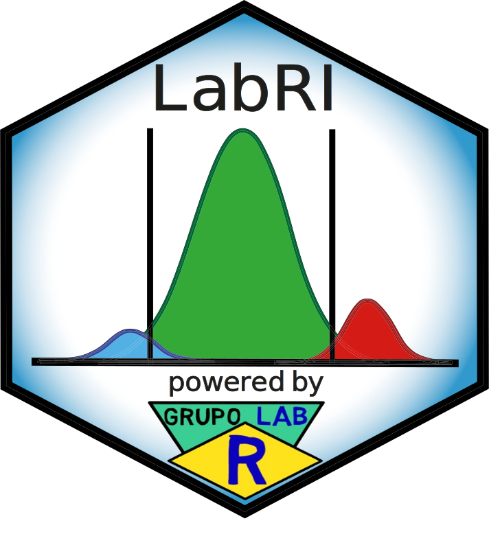
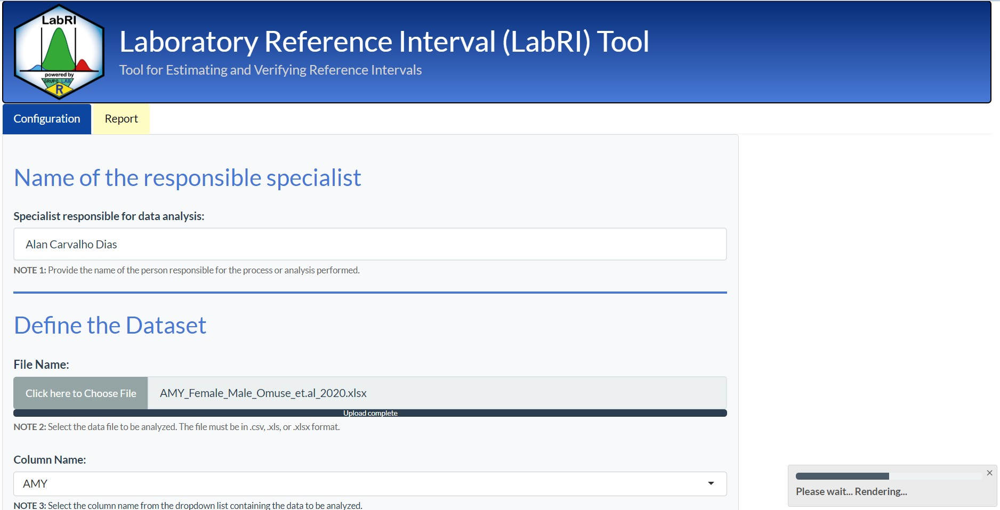

# [𝗟𝗮𝗯𝗥𝗜 𝗦𝗵𝗶𝗻𝘆 𝗔𝗽𝗽𝗹𝗶𝗰𝗮𝘁𝗶𝗼𝗻](https://img.shields.io/badge/LabRI%20Shiny%20Application-%230070C0?style=for-the-badge&logoColor=white)

The LabRI Shiny Application is designed for the estimation and verification of reference intervals in clinical laboratories. This repository includes three key components:
- **install_packages.Rmd**: Ensures that all required R packages are correctly installed and updated, simplifying the configuration of the R environment for running the LabRI System
- **app.R**: Launches the Shiny application, providing an intuitive graphical interface to execute the LabRI method interactively.
- **LabRI_script.Rmd**: The primary script that implements the `LabRI method`, responsible for estimating and verifying reference intervals, and producing comprehensive HTML reports.

The image above provides an example of the initial interface of the **LabRI Shiny Application**, demonstrating how users configure essential parameters for data analysis. The "Name of the Responsible Specialist" section captures the analyst's name, while the "Define the Dataset" section allows users to upload a .csv, .xls, or .xlsx file and select the relevant data column. A status bar indicates the system's progress during processing. This streamlined interface ensures intuitive navigation and efficient setup for reference interval estimation and verification.

The **LabRI Shiny Application** is available for download from its GitHub repository and also as a compressed folder. This flexibility allows users to execute the tool without requiring additional installation steps or dependencies beyond R and Shiny, providing the option to work with the application in its uncompressed format. It is ideal for users who prefer to interact with the LabRI method through an intuitive graphical interface without relying on automation files or an executable installer.

### 👇 **Click here to download the LabRI Shiny Application** 👇

 

The **LabRI Method** is a core component of the **LabRI System**, serving as the analytical backbone for the estimation and verification of reference intervals in laboratory data. It comprises a set of algorithms, sub-algorithms, and mathematical procedures, implemented primarily in the **LabRI_script.Rmd file**.

**The LabRI Method is structured into two main modules:**

- **Estimation Module**: Focuses on adaptive, multi-criteria estimation of reference intervals through data cleaning, transformation, and clustering techniques, utilizing algorithms such as `refineR` and `reflimR`, available in the R packages `refineR` and `reflimR`, respectively, along with the Expectation-Maximization (EM) algorithm, supported by packages like `mclust` and `mixR`.
  
- **Verification Module**: Ensures the validity of estimated reference intervals through a three-level analysis, which evaluates statistical uncertainty, equivalence, and concordance, making the intervals reliable for clinical application.

## [𝗔. 𝗘𝘀𝘁𝗶𝗺𝗮𝘁𝗶𝗼𝗻 𝗠𝗼𝗱𝘂𝗹𝗲](https://img.shields.io/badge/LabRI%20Shiny%20Application-%230070C0?style=for-the-badge&logoColor=white)

The **LabRI method** provides an adaptive and multi-criteria approach for the **indirect estimation** of reference intervals. This module integrates data cleaning, transformation, and clustering techniques, utilizing the `refineR`, `reflimR`, and **EM algorithms**. By combining **parametric and non-parametric percentile** approaches, the method estimates population reference intervals based on the number of clusters in the truncated distribution.

### Characteristics of the LabRI Method

- **Adaptive**:
  
  - Adjusts dynamically based on data structure and characteristics, applying appropriate cleaning and transformation techniques.
  - For **multi-cluster distributions**, the Centroid of Windsorized Reference Limits is applied to the reference limits estimated by `refineR` and `reflimR`. This involves a two-stage process: first, the Two-stage Winsorization sub-algorithm estimates the winsorized reference limits, adding robustness against extreme values. Next, the Hartigan-Wong Centroid Reference Limits sub-algorithm calculates the centroid, with the x and y coordinates representing the lower and upper reference limits, respectively, yielding a centralized and stable estimate. When clusters are sufficiently distant from each other, the EM algorithm is also incorporated to further refine the reference interval estimate.
    
  - For **single-cluster distributions**, the EM algorithm applies parametric and non-parametric methods to derive the best reference interval estimate.

- **Multi-criteria**:
  - Incorporates multiple criteria and methods for robust and comprehensive estimation and verification of reference intervals.

## [𝗕. 𝗩𝗲𝗿𝗶𝗳𝗶𝗰𝗮𝘁𝗶𝗼𝗻 𝗠𝗼𝗱𝘂𝗹𝗲](https://img.shields.io/badge/LabRI%20Shiny%20Application-%230070C0?style=for-the-badge&logoColor=white)

To ensure reliability in clinical practice, it is crucial for laboratories to verify their reference intervals (RIs) before routine application. This verification is especially important for RIs derived through indirect methods.

### Structure of the Verification Module

The **Verification Module** performs a **three-level analysis** to assess whether the compared reference limits are equivalent:

1. **First-Level Analysis ~ Statistical Uncertainty**: Assesses the magnitude of statistical uncertainty in the reference limits.
   
2. **Second-Level Analysis ~ Distance Criterion Based on Equivalence Testing**: Compares the LabRI-estimated reference limit with a comparative limit to evaluate practical significance.
   
3. **Third-Level Analysis ~ Concordance Evaluation**: Evaluates concordance using tests like Fleiss' Kappa, Lin's Concordance Correlation Coefficient, and Flagging Rates.

### Details of the Three-Level Analysis

- **First-Level Analysis**:
  - Evaluates statistical uncertainty associated with reference limits. If uncertainty is within acceptable bounds, the analysis proceeds to the second level.

- **Second-Level Analysis**:
  - Compares the LabRI reference limit with a comparative reference limit using equivalence testing to assess practical significance.

- **Third-Level Analysis**:
  - Conducted if the second-level analysis suggests "Possible Equivalence" or "Probable Equivalence". This level incorporates confidence intervals and uses Fleiss' Kappa, Lin's Concordance Correlation Coefficient, and Flagging Rates to ensure robust verification.

---

A simple usage tutorial, covering the installation of R and RStudio and instructions for using the Shiny tool, can be found on the **Grupo Lab R website**:

### 👇 **Click here to access the LabRI Tutorial** 👇

---

## [𝗖𝗼𝗻𝘁𝗮𝗰𝘁](https://img.shields.io/badge/LabRI%20Shiny%20Application-%230070C0?style=for-the-badge&logoColor=white)

You are welcome to:

**Submit suggestions and Bugs at:** https://github.com/labrgrupo/LabRI_Tool/issues

**Write an Email with any questions and problems to:** alancdias@hotmail.com or labrgrupo@gmail.com

**Link to the publication:** 

---
